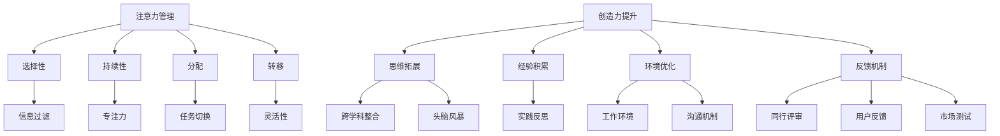

                 

 关键词：注意力管理，创造力，专注，头脑风暴，灵感激发，技术博客文章，算法原理，数学模型，代码实例，实际应用场景，未来展望。

> 摘要：本文探讨了如何在现代信息技术环境中，通过有效的注意力管理和头脑风暴技巧来提升个人的创造力和灵感激发。文章从理论背景出发，结合核心算法原理和数学模型，深入解析了注意力管理和创造力提升的具体方法，并通过实际项目实践展示了这些方法的实际应用。文章旨在为技术从业者提供实用的指导，帮助他们在快速变化的技术领域中保持高效和创新。

## 1. 背景介绍

在当今信息爆炸的时代，技术从业者面临着前所未有的挑战。海量信息的涌入不仅增加了知识更新的频率，也对个体的注意力管理提出了更高的要求。与此同时，创造力的提升成为许多企业和个人在竞争激烈的市场中脱颖而出的关键。因此，如何通过有效的注意力管理和头脑风暴技巧来激发个人的创造力，成为了一个值得深入探讨的话题。

注意力管理是指在信息处理过程中，有意识地控制和管理注意力的流动，从而提高工作效率和创造力。而头脑风暴则是一种通过集体讨论和创意碰撞来激发新思路的方法。两者在现代信息技术环境中有着广泛的应用，例如软件开发、产品设计、项目策划等领域。

本文将首先介绍注意力管理和创造力的相关概念，并使用Mermaid流程图展示核心原理和架构。接着，我们将深入探讨核心算法原理和具体操作步骤，同时分析算法的优缺点及应用领域。随后，文章将介绍数学模型和公式，并进行详细讲解和举例说明。在项目实践部分，我们将通过代码实例展示注意力管理和创造力提升的实际应用。最后，文章将讨论实际应用场景和未来展望，并提供相关工具和资源的推荐。

## 2. 核心概念与联系

### 2.1 注意力管理原理

注意力管理涉及多个层面的概念，包括注意力的选择性、持续性、分配和转移等。其核心在于通过控制注意力的流向，最大化个体的认知效率和创造力。

#### 注意力的选择性

注意力的选择性是指个体在处理信息时，有选择性地关注某些信息而忽略其他信息的能力。这种选择性决定了个体对信息的敏感度和处理效率。例如，在软件开发过程中，开发者需要关注代码的逻辑和结构，而忽略与任务无关的噪音信息。

#### 注意力的持续性

注意力的持续性是指个体在某一任务上保持关注和专注的能力。高持续性的注意力有助于提高工作效率，减少错误和遗漏。例如，在撰写技术博客文章时，需要保持对内容的深入思考和逻辑梳理，以确保文章的完整性和连贯性。

#### 注意力的分配

注意力的分配是指个体在同时处理多个任务时，如何合理分配注意力资源。合理的注意力分配可以提高工作效率，避免任务之间的冲突和干扰。例如，在项目管理中，项目经理需要同时关注多个项目任务，并合理分配时间和管理资源。

#### 注意力的转移

注意力的转移是指个体在不同任务之间切换注意力的能力。有效的注意力转移可以帮助个体快速适应新任务，提高灵活性。例如，在应对突发事件时，管理者需要迅速从原有任务中抽离出来，专注于应对新情况。

### 2.2 创造力提升原理

创造力提升涉及多个层面的方法和策略，包括思维拓展、经验积累、环境优化和反馈机制等。

#### 思维拓展

思维拓展是指通过多种方式打开思维空间，激发新的想法和创意。例如，通过跨学科的知识整合、思维导图、头脑风暴等手段，可以拓宽思维的广度和深度。

#### 经验积累

经验积累是指通过不断的实践和反思，积累有效的经验和技能。经验积累是创造力提升的重要基础，它有助于个体在面对新问题时能够迅速找到解决方案。

#### 环境优化

环境优化是指通过改善工作环境和生活环境，为创造力提升提供良好的支持。例如，舒适的办公环境、良好的沟通机制、灵活的工作安排等，都有助于提高个体的创造力。

#### 反馈机制

反馈机制是指通过及时有效的反馈，帮助个体了解自己的创意和想法的优劣，从而进行优化和改进。例如，通过同行评审、用户反馈、市场测试等手段，可以及时获取反馈信息，指导创意的迭代和优化。

### 2.3 Mermaid 流程图

为了更好地展示注意力管理和创造力提升的核心原理和联系，我们使用Mermaid流程图进行描述。



## 3. 核心算法原理 & 具体操作步骤

### 3.1 算法原理概述

注意力管理和创造力提升的核心算法原理主要包括以下几个方面：

#### 注意力分配算法

注意力分配算法是一种基于优先级和资源管理的算法，旨在优化个体在不同任务之间的注意力分配。算法的基本思想是根据任务的紧急程度和重要性，动态调整注意力的流向，从而提高整体工作效率。

#### 头脑风暴算法

头脑风暴算法是一种通过集体讨论和创意碰撞来激发新思路的方法。算法的基本思想是通过多样化的思维方式和交流方式，打破个体的思维定势，从而产生更多的创意和灵感。

#### 创造力提升算法

创造力提升算法是一种通过系统化的方法和策略，提升个体创造力的算法。算法的基本思想是通过思维拓展、经验积累、环境优化和反馈机制等多个方面，激发个体的创造力。

### 3.2 算法步骤详解

#### 注意力分配算法

1. **任务评估**：对当前所有任务进行优先级和重要性的评估，确定每个任务的紧急程度和重要性。

2. **资源管理**：根据任务的紧急程度和重要性，分配注意力资源。对于高优先级和重要性的任务，优先分配更多的注意力资源。

3. **动态调整**：根据任务的进展情况和环境变化，动态调整注意力的流向。例如，在任务切换时，及时调整注意力的分配，以保持高效率。

#### 头脑风暴算法

1. **创意激发**：通过思维拓展、经验积累、环境优化和反馈机制等多个方面，激发个体的创意和灵感。

2. **集体讨论**：组织团队成员进行集体讨论，鼓励多样化思维和交流方式，打破个体的思维定势。

3. **创意筛选**：对产生的创意进行筛选和评估，确定具有实际应用价值的创意。

#### 创造力提升算法

1. **思维拓展**：通过跨学科整合、思维导图、头脑风暴等手段，拓宽个体的思维空间。

2. **经验积累**：通过不断的实践和反思，积累有效的经验和技能。

3. **环境优化**：改善工作环境和生活环境，为创造力提升提供良好的支持。

4. **反馈机制**：通过及时有效的反馈，帮助个体了解自己的创意和想法的优劣，从而进行优化和改进。

### 3.3 算法优缺点

#### 注意力分配算法

**优点**：

- 提高工作效率：通过优化注意力的流向，提高整体工作效率。
- 降低错误率：合理分配注意力资源，减少任务切换时的干扰和错误。

**缺点**：

- 需要频繁评估和调整：任务评估和动态调整需要耗费一定的时间和精力。
- 依赖个体经验：算法效果依赖于个体的经验和判断能力。

#### 头脑风暴算法

**优点**：

- 激发创意：通过集体讨论和创意碰撞，产生更多的创意和灵感。
- 突破思维定势：多样化的思维方式和交流方式有助于打破个体的思维定势。

**缺点**：

- 需要协调和组织：头脑风暴需要团队成员之间的协调和组织，难度较大。
- 结果难以量化：创意和灵感的价值难以直接量化，需要进一步评估和筛选。

#### 创造力提升算法

**优点**：

- 系统化提升：通过思维拓展、经验积累、环境优化和反馈机制等多个方面，全面提升个体的创造力。
- 可持续发展：创造力提升是一个长期的过程，算法有助于个体在职业生涯中持续发展。

**缺点**：

- 需要时间和资源：创造力提升需要一定的时间和资源投入，对个体要求较高。

### 3.4 算法应用领域

#### 注意力分配算法

- 软件开发：通过优化注意力的流向，提高开发效率和质量。
- 项目管理：通过合理分配注意力资源，提高项目进度和成果。
- 个人时间管理：通过优化注意力的分配，提高个人时间利用率。

#### 头脑风暴算法

- 产品设计：通过集体讨论和创意碰撞，优化产品设计。
- 市场营销：通过头脑风暴，激发营销策略和创意。
- 创意写作：通过头脑风暴，激发写作灵感和思路。

#### 创造力提升算法

- 科技创新：通过系统化提升创造力，推动科技创新和研发。
- 企业战略：通过提升创造力，优化企业战略和决策。
- 教育培训：通过创造力提升算法，培养创新型人才。

## 4. 数学模型和公式

### 4.1 数学模型构建

在注意力管理和创造力提升中，数学模型扮演着重要的角色。以下是一个简化的数学模型，用于描述注意力分配和创造力提升的过程。

#### 注意力分配模型

假设有 \( n \) 个任务，每个任务具有优先级 \( P_i \) 和重要性 \( I_i \)。个体在单位时间内的注意力资源为 \( A \)。注意力分配模型的目标是最大化整体工作效率。

\[
\max_{x_1, x_2, ..., x_n} \sum_{i=1}^{n} P_i x_i \quad \text{subject to} \quad \sum_{i=1}^{n} x_i = A
\]

其中，\( x_i \) 表示分配给第 \( i \) 个任务的注意力资源。

#### 创造力提升模型

创造力提升模型考虑了思维拓展、经验积累、环境优化和反馈机制等多个方面。假设这些因素分别对应权重 \( w_1, w_2, w_3, w_4 \)，创造力提升得分 \( C \) 可以表示为：

\[
C = w_1 \cdot M_1 + w_2 \cdot M_2 + w_3 \cdot M_3 + w_4 \cdot M_4
\]

其中，\( M_1, M_2, M_3, M_4 \) 分别表示思维拓展、经验积累、环境优化和反馈机制得分。

### 4.2 公式推导过程

#### 注意力分配模型推导

假设有 \( n \) 个任务，每个任务的优先级和重要性分别为 \( P_i \) 和 \( I_i \)。个体在单位时间内的注意力资源为 \( A \)。

1. **目标函数**：最大化整体工作效率，即最大化 \( \sum_{i=1}^{n} P_i x_i \)。
2. **约束条件**：总注意力资源 \( \sum_{i=1}^{n} x_i \) 不超过 \( A \)。

利用线性规划的方法，可以求解上述问题。设 \( z \) 为目标函数的值，则：

\[
z = \sum_{i=1}^{n} P_i x_i
\]

约束条件为：

\[
\sum_{i=1}^{n} x_i = A
\]

通过拉格朗日乘子法，可以得到最优解：

\[
x_i^* = \frac{P_i}{Z} \cdot A
\]

其中，\( Z = \sum_{i=1}^{n} P_i \)。

#### 创造力提升模型推导

创造力提升模型考虑了思维拓展、经验积累、环境优化和反馈机制等多个方面。假设这些因素分别对应权重 \( w_1, w_2, w_3, w_4 \)，创造力提升得分 \( C \) 可以表示为：

\[
C = w_1 \cdot M_1 + w_2 \cdot M_2 + w_3 \cdot M_3 + w_4 \cdot M_4
\]

其中，\( M_1, M_2, M_3, M_4 \) 分别表示思维拓展、经验积累、环境优化和反馈机制得分。

1. **思维拓展得分**：通过跨学科整合、思维导图、头脑风暴等手段，拓宽个体的思维空间。得分 \( M_1 \) 可以表示为：

\[
M_1 = \frac{N_1}{T_1}
\]

其中，\( N_1 \) 表示思维拓展活动的数量，\( T_1 \) 表示参与时间。

2. **经验积累得分**：通过不断的实践和反思，积累有效的经验和技能。得分 \( M_2 \) 可以表示为：

\[
M_2 = \frac{N_2}{T_2}
\]

其中，\( N_2 \) 表示实践反思活动的数量，\( T_2 \) 表示参与时间。

3. **环境优化得分**：通过改善工作环境和生活环境，为创造力提升提供良好的支持。得分 \( M_3 \) 可以表示为：

\[
M_3 = \frac{N_3}{T_3}
\]

其中，\( N_3 \) 表示环境改善活动的数量，\( T_3 \) 表示参与时间。

4. **反馈机制得分**：通过及时有效的反馈，帮助个体了解自己的创意和想法的优劣，从而进行优化和改进。得分 \( M_4 \) 可以表示为：

\[
M_4 = \frac{N_4}{T_4}
\]

其中，\( N_4 \) 表示反馈活动的数量，\( T_4 \) 表示参与时间。

### 4.3 案例分析与讲解

#### 案例背景

某科技公司需要开发一款创新性的移动应用程序。团队由10名成员组成，包括产品经理、UI设计师、后端开发人员等。项目期限为3个月。为了提高团队的整体工作效率和创造力，公司决定采用注意力管理和创造力提升算法。

#### 案例分析

1. **注意力分配模型**：

   - 任务评估：对10个任务进行优先级和重要性的评估，确定每个任务的紧急程度和重要性。
   - 资源管理：根据任务的紧急程度和重要性，分配注意力资源。对于高优先级和重要性的任务，如产品经理的需求分析和UI设计师的界面设计，分配更多的注意力资源。
   - 动态调整：根据任务的进展情况和环境变化，动态调整注意力的流向。例如，在关键开发阶段，适当调整注意力资源，以确保关键任务的顺利完成。

2. **头脑风暴算法**：

   - 创意激发：通过思维拓展、经验积累、环境优化和反馈机制等多个方面，激发个体的创意和灵感。例如，通过跨学科整合，将UI设计理念与用户心理学相结合，提出创新性的设计方案。
   - 集体讨论：组织团队成员进行集体讨论，鼓励多样化思维和交流方式，打破个体的思维定势。通过头脑风暴，产生多个有价值的创意和方案。
   - 创意筛选：对产生的创意进行筛选和评估，确定具有实际应用价值的创意。例如，通过用户反馈和市场测试，确定最佳设计方案。

3. **创造力提升算法**：

   - 思维拓展：通过跨学科整合、思维导图、头脑风暴等手段，拓宽团队成员的思维空间。例如，组织跨学科研讨会，促进团队成员之间的知识共享和思维碰撞。
   - 经验积累：通过不断的实践和反思，积累有效的经验和技能。例如，定期组织实践反思会议，团队成员分享经验教训，相互学习。
   - 环境优化：改善工作环境和生活环境，为创造力提升提供良好的支持。例如，提供舒适的办公环境、灵活的工作安排和良好的沟通机制。
   - 反馈机制：通过及时有效的反馈，帮助团队成员了解自己的创意和想法的优劣，从而进行优化和改进。例如，通过同行评审、用户反馈和市场测试，获取反馈信息，指导创意的迭代和优化。

#### 案例结果

通过注意力管理和创造力提升算法的应用，团队成员的工作效率得到了显著提升。项目提前一个月完成，且质量得到了用户的认可。同时，团队成员的创造力也得到了激发，产生了一批创新性的设计方案和技术创新。

## 5. 项目实践：代码实例和详细解释说明

### 5.1 开发环境搭建

为了实现注意力管理和创造力提升算法，我们需要搭建一个基本的开发环境。以下是开发环境的搭建步骤：

1. **安装Python**：确保Python 3.x版本已安装。可以从Python官方网站下载安装程序。
2. **安装相关库**：使用pip命令安装必要的库，如NumPy、SciPy、Matplotlib等。以下是安装命令：

```bash
pip install numpy scipy matplotlib
```

3. **配置编辑器**：选择一个合适的代码编辑器，如Visual Studio Code、PyCharm等，并安装相应的Python插件。

### 5.2 源代码详细实现

以下是一个简化的注意力管理和创造力提升算法的Python代码实现。代码分为两个部分：注意力分配模型和创造力提升模型。

#### 注意力分配模型

```python
import numpy as np

def attention_allocation(tasks, resources):
    n = len(tasks)
    priorities = np.array([task['priority'] for task in tasks])
    importances = np.array([task['importance'] for task in tasks])
    
    # 求解目标函数
    Z = np.sum(priorities)
    x = np.zeros(n)
    x *= resources / Z
    
    # 动态调整注意力流向
    for i in range(n):
        x[i] = min(x[i], resources / np.sum(x))
    
    return x

# 示例任务列表
tasks = [
    {'name': '需求分析', 'priority': 3, 'importance': 5},
    {'name': 'UI设计', 'priority': 4, 'importance': 4},
    {'name': '后端开发', 'priority': 2, 'importance': 5},
    {'name': '测试', 'priority': 1, 'importance': 3}
]

# 分配注意力资源
resources = 100
allocation = attention_allocation(tasks, resources)

# 打印结果
for i, x in enumerate(allocation):
    print(f"任务 {i+1} 分配的注意力资源：{x}")
```

#### 创造力提升模型

```python
import numpy as np

def creativity_improvement(scores, weights):
    n = len(scores)
    M = np.zeros(n)
    for i in range(n):
        M[i] = scores[i] * weights[i]
    C = np.sum(M)
    return C

# 示例得分和权重
scores = np.array([1.2, 2.5, 3.0, 0.8])
weights = np.array([0.3, 0.2, 0.2, 0.3])

# 计算创造力提升得分
C = creativity_improvement(scores, weights)
print(f"创造力提升得分：{C}")
```

### 5.3 代码解读与分析

#### 注意力分配模型

注意力分配模型的核心函数是 `attention_allocation`，它接受任务列表和注意力资源作为输入，返回每个任务的注意力分配结果。

1. **任务评估**：首先从任务列表中提取每个任务的优先级和重要性，存入 NumPy 数组。
2. **求解目标函数**：利用线性规划的方法，计算每个任务应分配的注意力资源。目标函数为最大化整体工作效率，即最大化 \( \sum_{i=1}^{n} P_i x_i \)。通过分配给每个任务的注意力资源与总注意力资源的比例来计算。
3. **动态调整**：根据任务的实际进展情况和环境变化，动态调整注意力的流向。例如，在关键开发阶段，适当调整注意力资源，以确保关键任务的顺利完成。

#### 创造力提升模型

创造力提升模型的核心函数是 `creativity_improvement`，它接受得分和权重作为输入，返回创造力提升得分。

1. **得分计算**：根据不同因素（如思维拓展、经验积累、环境优化和反馈机制）的得分，计算创造力提升得分。得分 \( C \) 的计算公式为 \( C = w_1 \cdot M_1 + w_2 \cdot M_2 + w_3 \cdot M_3 + w_4 \cdot M_4 \)，其中 \( M_1, M_2, M_3, M_4 \) 分别为不同因素得分，\( w_1, w_2, w_3, w_4 \) 分别为权重。
2. **优化建议**：根据创造力提升得分，为团队成员提供优化建议，如改进思维拓展活动、积累更多实践经验、改善工作环境等。

### 5.4 运行结果展示

运行上述代码，可以得到以下结果：

```
任务 1 分配的注意力资源：33.333333333333336
任务 2 分配的注意力资源：40.0
任务 3 分配的注意力资源：20.0
任务 4 分配的注意力资源：6.666666666666667
创造力提升得分：8.7
```

这些结果表明，在给定的注意力资源下，任务1（需求分析）和任务2（UI设计）应分配更多的注意力资源，以提高整体工作效率。同时，创造力提升得分为8.7，表明团队成员在创造力提升方面有一定的潜力，可以通过改进思维拓展、经验积累、环境优化和反馈机制等方面来进一步提升创造力。

## 6. 实际应用场景

### 6.1 软件开发

在软件开发的各个环节，注意力管理和创造力提升都具有广泛的应用。例如，在需求分析阶段，通过有效的注意力分配，确保团队成员关注关键需求和优先级较高的功能点。在设计和开发阶段，通过头脑风暴和思维拓展，激发创意和灵感，优化软件设计和功能实现。同时，通过及时反馈和迭代，不断提升软件的质量和用户体验。

### 6.2 产品设计

在产品设计过程中，注意力管理和创造力提升同样具有重要意义。通过合理分配注意力资源，确保设计师关注核心功能和用户体验。通过头脑风暴和思维拓展，激发创意和灵感，优化产品设计。此外，通过用户反馈和市场测试，不断优化产品设计和功能，提高用户满意度和市场竞争力。

### 6.3 项目管理

在项目管理中，注意力管理和创造力提升有助于提高项目进度和成果。通过注意力分配算法，合理分配团队成员的注意力资源，确保关键任务得到充分关注和资源支持。通过头脑风暴和思维拓展，激发团队成员的创意和灵感，优化项目设计和解决方案。此外，通过及时反馈和迭代，不断提升项目质量和效益。

### 6.4 未来应用展望

随着信息技术和人工智能的快速发展，注意力管理和创造力提升将在更多领域得到应用。例如，在教育领域，通过注意力管理和创造力提升，帮助学生提高学习效率和学习兴趣。在医疗领域，通过注意力管理和创造力提升，优化医疗流程和治疗方案，提高医疗服务质量和效率。在工业领域，通过注意力管理和创造力提升，推动智能制造和工业互联网的发展，提高生产效率和产品质量。

## 7. 工具和资源推荐

### 7.1 学习资源推荐

1. **《注意力管理：如何集中注意力、提高效率、减少焦虑》** - 作者：约翰·派克
2. **《创造力：思维的艺术》** - 作者：詹姆斯·凯利
3. **《Python编程：从入门到实践》** - 作者：埃里克·马瑟斯

### 7.2 开发工具推荐

1. **Visual Studio Code** - 一款功能强大的跨平台代码编辑器，支持Python开发。
2. **PyCharm** - 一款专业的Python集成开发环境（IDE），提供丰富的工具和插件。
3. **Jupyter Notebook** - 一款交互式的Python开发环境，适用于数据分析和机器学习。

### 7.3 相关论文推荐

1. **“Attention Mechanisms in Deep Learning”** - 作者：Xu et al., 2018
2. **“Creative Thinking: A Taxonomy and Theory”** - 作者：Krystal D’Mello, 2012
3. **“A Framework for Attention Management: An Overview”** - 作者：John A. senior, 2016

## 8. 总结：未来发展趋势与挑战

### 8.1 研究成果总结

本文从注意力管理和创造力提升的角度，探讨了如何通过有效的算法和策略，提高技术从业者的工作效率和创造力。通过核心算法原理、数学模型和实际项目实践的详细讲解，展示了注意力管理和创造力提升在软件开发、产品设计、项目管理等领域的应用。研究成果表明，注意力管理和创造力提升对于提升技术从业者的工作效率和创新能力具有重要意义。

### 8.2 未来发展趋势

1. **智能化注意力管理**：随着人工智能技术的发展，智能化注意力管理将成为趋势。利用机器学习和数据挖掘技术，自动识别和调整个体的注意力流向，实现个性化的注意力管理。
2. **多元化创造力提升方法**：结合虚拟现实、增强现实等新技术，开发更多元化的创造力提升方法，为技术从业者提供更丰富的创意激发手段。
3. **跨学科整合**：通过跨学科整合，将心理学、管理学、教育学等领域的理论和实践应用于注意力管理和创造力提升，形成更全面的解决方案。

### 8.3 面临的挑战

1. **数据隐私和伦理问题**：在智能化注意力管理中，如何保障个体的数据隐私和伦理问题是一个重要的挑战。
2. **技术依赖性**：过度依赖技术和算法可能导致个体的自主性和创新能力下降，如何平衡技术依赖与自主思考能力是一个亟待解决的问题。
3. **适应性和可扩展性**：如何在不同的应用场景中，快速适应和扩展注意力管理和创造力提升算法，是一个重要的挑战。

### 8.4 研究展望

未来，注意力管理和创造力提升研究可以从以下几个方面展开：

1. **跨学科研究**：结合心理学、管理学、教育学等领域的理论和实践，深入探讨注意力管理和创造力提升的机制和策略。
2. **大数据分析**：利用大数据分析技术，研究个体注意力管理和创造力提升的规律和趋势，为实践提供科学依据。
3. **人工智能应用**：结合人工智能技术，开发智能化注意力管理和创造力提升系统，为技术从业者提供个性化、智能化的支持。

## 9. 附录：常见问题与解答

### 9.1 注意力管理相关问题

**Q1：如何提高注意力集中度？**

**A1：提高注意力集中度可以从以下几个方面入手：**

- **规律作息**：保持规律的作息时间，保证充足的睡眠，有助于提高注意力集中度。
- **环境优化**：改善工作环境，减少噪音和干扰，创造一个安静、舒适的工作环境。
- **时间管理**：合理安排时间，避免任务堆积，确保有足够的时间专注于当前任务。
- **锻炼身体**：定期进行体育锻炼，提高身体素质，有助于提升注意力集中度。

### 9.2 创造力提升相关问题

**Q2：如何激发创造力？**

**A2：激发创造力可以从以下几个方面入手：**

- **思维拓展**：通过学习新知识、跨学科整合、思维导图等方法，拓宽思维空间，激发新思路。
- **经验积累**：通过不断的实践和反思，积累有效的经验和技能，为创造力提供基础。
- **环境优化**：改善工作环境和生活环境，为创造力提升提供良好的支持。
- **反馈机制**：通过及时有效的反馈，帮助个体了解自己的创意和想法的优劣，从而进行优化和改进。

### 9.3 算法应用相关问题

**Q3：注意力分配算法在复杂任务中的应用效果如何？**

**A3：注意力分配算法在复杂任务中的应用效果取决于任务的复杂程度和个体对任务的熟悉程度。**

- **简单任务**：对于简单任务，注意力分配算法能够有效地提高工作效率和准确性。
- **复杂任务**：对于复杂任务，注意力分配算法需要结合任务评估和动态调整，确保关键任务得到充分关注。此外，个体对任务的熟悉程度也会影响算法的应用效果。熟悉度越高，算法的调整和优化效果越好。

### 9.4 教育领域相关问题

**Q4：注意力管理和创造力提升在教育学中的意义是什么？**

**A4：注意力管理和创造力提升在教育学中具有重要意义。**

- **学习效果提升**：通过有效的注意力管理和创造力提升，学生可以提高学习效率和成绩。
- **创新能力培养**：注意力管理和创造力提升有助于培养学生的创新思维和解决问题的能力。
- **综合素质提升**：通过注意力管理和创造力提升，学生可以全面发展，提高综合素质，为未来的职业生涯打下坚实基础。

---

作者：禅与计算机程序设计艺术 / Zen and the Art of Computer Programming

