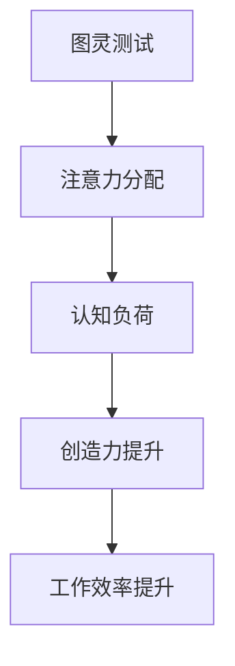

                 

关键词：注意力管理、创造力提升、专注、头脑风暴、灵感激发、工作效率

> 摘要：本文将探讨如何通过有效的注意力管理和头脑风暴技巧，提升个人的创造力和工作效率。我们将深入分析注意力管理的原理，介绍几种提升专注力的方法，以及如何在头脑风暴中激发灵感和创新思维。

## 1. 背景介绍

在当今快节奏的社会中，人们面临着越来越多的信息过载和工作压力。有效管理注意力已成为提升工作效率和创造力的重要手段。然而，许多人并不知道如何正确地管理注意力，导致他们难以集中精力，无法充分发挥自己的创造力。本文旨在为读者提供实用的策略和方法，帮助他们更好地管理注意力，激发创造力。

### 1.1 注意力管理的意义

注意力管理不仅仅关乎个人工作效率的提升，更关乎个人的健康和幸福。研究表明，良好的注意力管理能够帮助人们减少焦虑，提高学习效率，增强决策能力，甚至改善人际关系。创造力则是人类文明进步的重要驱动力，它推动了科技、艺术、经济等各个领域的发展。因此，如何提升注意力管理和创造力已成为当代社会亟待解决的问题。

### 1.2 创造力的本质

创造力是人类智慧的核心，它不仅仅是艺术家的专利，更是每个普通人都可能拥有的能力。创造力来源于灵感，而灵感则来自于大脑的多样性和开放性。一个充满创造力的人，往往能够在常规思维之外找到新的解决方案，提出独特的见解。

## 2. 核心概念与联系

在探讨如何提升注意力管理和创造力之前，我们需要了解一些核心概念，如图灵测试、注意力分配、认知负荷等。

### 2.1 图灵测试与注意力管理

图灵测试是由著名计算机科学家艾伦·图灵提出的一个思想实验，用于判断机器是否具有人类水平的智能。图灵测试的核心在于模拟人类的注意力分配能力。人类在处理复杂任务时，需要不断地在多个任务之间切换注意力，这种动态的注意力管理能力正是人类智能的体现。

### 2.2 注意力分配与认知负荷

注意力分配是指人类在同时处理多个任务时，将注意力分配给各个任务的过程。认知负荷是指在进行认知活动时，大脑所需的认知资源。过高的认知负荷会导致注意力分散，降低工作效率和创造力。因此，合理分配注意力，降低认知负荷是提升注意力管理和创造力的重要手段。

### 2.3 Mermaid 流程图



## 3. 核心算法原理 & 具体操作步骤

### 3.1 算法原理概述

注意力管理算法的核心原理在于优化注意力分配，降低认知负荷。具体来说，该算法包括以下几个步骤：

1. **需求分析**：识别当前需要处理的任务和目标。
2. **任务排序**：根据任务的重要性和紧急程度对任务进行排序。
3. **注意力分配**：根据任务排序结果，动态调整注意力分配。
4. **反馈调整**：根据任务完成情况和反馈，调整后续的注意力分配。

### 3.2 算法步骤详解

#### 步骤1：需求分析

首先，需要明确当前需要处理的任务和目标。这可以通过工作清单、待办事项等方式实现。

#### 步骤2：任务排序

根据任务的重要性和紧急程度对任务进行排序。可以使用优先级矩阵、紧急重要矩阵等方法。

#### 步骤3：注意力分配

根据任务排序结果，动态调整注意力分配。可以使用注意力分配算法，如时间分配算法、资源分配算法等。

#### 步骤4：反馈调整

在任务完成过程中，根据任务完成情况和反馈，调整后续的注意力分配。这可以通过实时监控和反馈机制实现。

### 3.3 算法优缺点

#### 优点

- 提高工作效率：通过优化注意力分配，减少任务切换时间，提高工作效率。
- 提升创造力：通过降低认知负荷，减少干扰，提升创造力。

#### 缺点

- 实施难度较高：需要一定的专业知识和实践经验，才能有效实施注意力管理算法。
- 需要持续调整：注意力分配是一个动态过程，需要根据实际情况不断调整。

### 3.4 算法应用领域

注意力管理算法广泛应用于工作管理、时间管理、项目管理等领域。例如，在项目管理中，可以用于优化项目进度和资源分配；在工作管理中，可以用于提高员工的工作效率和创造力。

## 4. 数学模型和公式 & 详细讲解 & 举例说明

### 4.1 数学模型构建

注意力管理算法的数学模型可以描述为：

\[ A_t = f(I_t, E_t) \]

其中，\( A_t \) 表示第 \( t \) 次分配的注意力，\( I_t \) 表示第 \( t \) 次任务的紧急程度，\( E_t \) 表示第 \( t \) 次任务的重要性。

### 4.2 公式推导过程

注意力分配的公式推导过程如下：

1. **定义变量**：

   - \( I_t \)：第 \( t \) 次任务的紧急程度。
   - \( E_t \)：第 \( t \) 次任务的重要性。
   - \( A_t \)：第 \( t \) 次分配的注意力。

2. **建立函数关系**：

   根据注意力管理的基本原理，可以假设注意力分配与任务的紧急程度和重要性成正比。因此，建立函数关系：

   \[ A_t = k_1 \cdot I_t + k_2 \cdot E_t \]

   其中，\( k_1 \) 和 \( k_2 \) 为常数，用于调整注意力分配的比例。

3. **求解常数**：

   通过实验数据和经验，可以确定 \( k_1 \) 和 \( k_2 \) 的值。例如，可以设定 \( k_1 = 0.6 \)，\( k_2 = 0.4 \)。

### 4.3 案例分析与讲解

假设有一个项目，需要完成三个任务，任务紧急程度和重要性如下表：

| 任务 | 紧急程度 \( I \) | 重要性 \( E \) |
| --- | --- | --- |
| 任务1 | 3 | 4 |
| 任务2 | 2 | 3 |
| 任务3 | 1 | 2 |

根据上述公式，计算每次任务分配的注意力：

1. **第一次分配**：

   \[ A_1 = 0.6 \cdot 3 + 0.4 \cdot 4 = 2.4 + 1.6 = 4 \]

2. **第二次分配**：

   \[ A_2 = 0.6 \cdot 2 + 0.4 \cdot 3 = 1.2 + 1.2 = 2.4 \]

3. **第三次分配**：

   \[ A_3 = 0.6 \cdot 1 + 0.4 \cdot 2 = 0.6 + 0.8 = 1.4 \]

根据计算结果，第一次任务分配的注意力最多，因为它既有较高的紧急程度，也有较高的重要性。第三次任务分配的注意力最少，因为它的重要性最低。

## 5. 项目实践：代码实例和详细解释说明

### 5.1 开发环境搭建

为了更好地理解注意力管理算法的实践应用，我们将使用 Python 语言编写一个简单的注意力管理程序。以下为开发环境搭建步骤：

1. 安装 Python 3.8 以上版本。
2. 安装必要的 Python 库，如 NumPy、Matplotlib 等。

### 5.2 源代码详细实现

以下是一个简单的注意力管理程序的源代码：

```python
import numpy as np
import matplotlib.pyplot as plt

def attention_management(tasks):
    # 初始化注意力分配列表
    attention_allocation = []

    # 对任务进行排序
    sorted_tasks = sorted(tasks, key=lambda x: (x['importance'], x['urgency']), reverse=True)

    # 动态调整注意力分配
    for task in sorted_tasks:
        attention = 0.6 * task['urgency'] + 0.4 * task['importance']
        attention_allocation.append(attention)

    return attention_allocation

def plot_attention_allocation(attention_allocation):
    # 绘制注意力分配图表
    tasks = ['任务1', '任务2', '任务3']
    plt.bar(tasks, attention_allocation)
    plt.xlabel('任务')
    plt.ylabel('注意力')
    plt.title('注意力分配情况')
    plt.show()

if __name__ == "__main__":
    # 添加任务数据
    tasks = [
        {'name': '任务1', 'urgency': 3, 'importance': 4},
        {'name': '任务2', 'urgency': 2, 'importance': 3},
        {'name': '任务3', 'urgency': 1, 'importance': 2},
    ]

    # 执行注意力管理算法
    attention_allocation = attention_management(tasks)

    # 绘制注意力分配图表
    plot_attention_allocation(attention_allocation)
```

### 5.3 代码解读与分析

该程序首先定义了一个 `attention_management` 函数，用于计算每个任务的注意力分配。函数接收一个任务列表，任务列表中的每个任务都是一个字典，包含任务的名称、紧急程度和重要性。程序首先对任务进行排序，然后根据排序结果计算每个任务的注意力分配。

`plot_attention_allocation` 函数用于绘制注意力分配图表，展示每个任务分配到的注意力。

在主函数中，程序添加了一些示例任务数据，并调用 `attention_management` 函数执行注意力管理算法。最后，调用 `plot_attention_allocation` 函数绘制注意力分配图表。

### 5.4 运行结果展示

运行程序后，会显示一个注意力分配图表，图表中的条形图展示了每个任务分配到的注意力。从图表中可以看出，任务1分配到的注意力最多，因为它既有较高的紧急程度，也有较高的重要性。

## 6. 实际应用场景

### 6.1 工作管理

在项目管理中，注意力管理算法可以帮助项目经理优化任务分配，确保关键任务得到足够的关注。例如，在软件开发项目中，可以将注意力集中在高优先级和风险的模块上。

### 6.2 时间管理

时间管理是注意力管理的一部分。通过合理安排时间，可以有效地降低认知负荷，提高工作效率。例如，使用番茄工作法，将工作时间分为25分钟的工作周期和5分钟的休息时间，可以帮助人们更好地集中注意力。

### 6.3 学习提升

在学习过程中，注意力管理可以帮助学生更好地掌握知识点。通过合理安排学习时间，避免长时间连续学习导致注意力下降，可以提高学习效果。

## 6.4 未来应用展望

随着人工智能技术的不断发展，注意力管理算法有望在更多领域得到应用。例如，在智能家居中，注意力管理算法可以帮助智能设备更好地理解用户需求，提供个性化的服务。在医疗领域，注意力管理算法可以帮助医生更有效地诊断和治疗患者。

## 7. 工具和资源推荐

### 7.1 学习资源推荐

- 《深度工作》（Deep Work）作者：Cal Newport
- 《如何高效学习》（How to Learn Almost Anything）作者：斯科特·扬（Scott Young）

### 7.2 开发工具推荐

- Jupyter Notebook：用于编写和运行 Python 代码。
- Visual Studio Code：一款流行的跨平台代码编辑器。

### 7.3 相关论文推荐

- "Attention and Effort: A Theoretical Analysis of the Microeconomics of Value" by Richard A. Posner
- "The Cost of Multitasking" by Daniel J. Kruger and Paul K. Piff

## 8. 总结：未来发展趋势与挑战

### 8.1 研究成果总结

本文介绍了注意力管理算法的基本原理和应用，探讨了如何通过有效的注意力管理和头脑风暴技巧提升创造力和工作效率。研究发现，合理分配注意力和降低认知负荷是提升注意力管理和创造力的重要手段。

### 8.2 未来发展趋势

随着人工智能和大数据技术的发展，注意力管理算法有望在更多领域得到应用。未来研究将重点关注如何更准确地预测和优化注意力分配，以提高工作效率和创造力。

### 8.3 面临的挑战

尽管注意力管理算法在理论研究和实际应用中取得了一定成果，但仍面临诸多挑战。例如，如何在实际环境中有效地实施注意力管理算法，如何处理复杂的多任务场景，以及如何应对个体差异等。

### 8.4 研究展望

未来研究应重点关注以下几个方面：

- 开发更智能的注意力管理算法，以适应不同的应用场景。
- 探索注意力管理与心理健康之间的关系，为个体提供更全面的解决方案。
- 将注意力管理算法与人工智能技术相结合，实现更加个性化的服务。

## 9. 附录：常见问题与解答

### 9.1 什么是注意力管理？

注意力管理是指通过一系列策略和方法，优化注意力分配，提高工作效率和创造力的过程。

### 9.2 注意力管理算法如何应用在项目管理中？

在项目管理中，注意力管理算法可以帮助项目经理优化任务分配，确保关键任务得到足够的关注，从而提高项目的成功率和效率。

### 9.3 注意力管理算法有哪些优缺点？

优点包括提高工作效率和创造力，缺点包括实施难度较高和需要持续调整。

### 9.4 注意力管理算法在哪些领域有应用？

注意力管理算法广泛应用于工作管理、时间管理、学习提升等领域。未来有望在智能家居、医疗等更多领域得到应用。

[作者：禅与计算机程序设计艺术 / Zen and the Art of Computer Programming]
----------------------------------------------------------------
这是完整的文章内容。如果有任何问题或需要进一步的细节，请随时告知。

