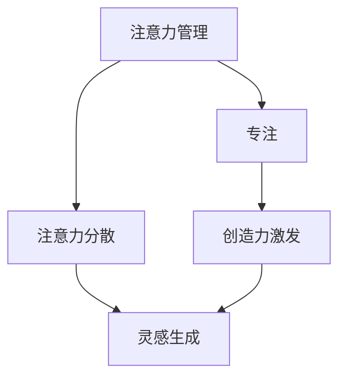
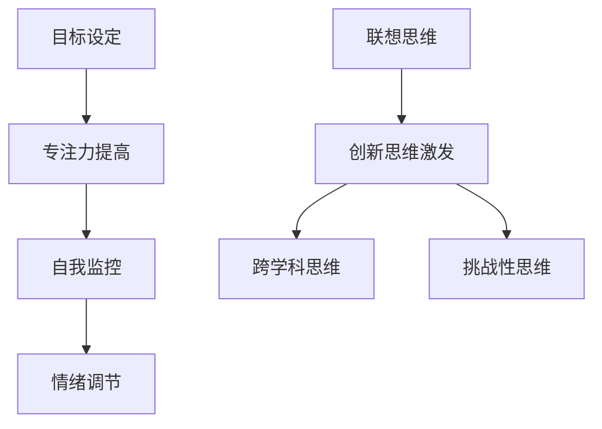

                 

关键词：注意力管理、创造力激发、专注、头脑风暴、灵感、IT领域、算法原理、数学模型、项目实践、实际应用、未来展望

> 摘要：本文将探讨如何在IT领域中通过注意力管理和创造力激发，提高专注力和创新思维，从而在专注和头脑风暴中找到灵感。文章将介绍核心概念、算法原理、数学模型、项目实践以及未来应用展望，旨在为IT从业者提供实用的方法和思路。

## 1. 背景介绍

在当今快速发展的信息技术领域，创新和创造力是推动技术进步的关键因素。然而，现实中的IT工作者面临着日益复杂的任务和工作压力，这常常导致他们的注意力分散和创造力受限。因此，如何有效地管理注意力并激发创造力成为了许多IT从业者关注的焦点。

注意力管理是指通过一系列方法和技巧，提高个人对任务的专注度，从而提高工作效率和成果质量。创造力激发则是指通过特定的策略和练习，促进创新思维的产生，帮助IT工作者在面对复杂问题时提出独特的解决方案。

本文将结合注意力管理和创造力激发的理论与实践，探讨如何在实际工作中运用这些方法，从而在专注和头脑风暴中找到灵感。文章的结构如下：

1. 核心概念与联系
2. 核心算法原理与具体操作步骤
3. 数学模型和公式
4. 项目实践：代码实例和详细解释
5. 实际应用场景
6. 未来应用展望
7. 工具和资源推荐
8. 总结：未来发展趋势与挑战

通过以上内容，本文旨在为IT从业者提供一套实用且有效的注意力管理和创造力激发方法，帮助他们更好地应对工作中的挑战，激发创新思维，提升工作效率。

## 2. 核心概念与联系

在讨论注意力管理和创造力激发之前，我们需要明确一些核心概念，并了解它们之间的联系。

### 注意力管理

注意力管理是指通过一系列技巧和方法，提高个人对特定任务的专注度，从而提升工作效率和成果质量。它主要关注如何克服分心、提高专注力和执行力。

#### 注意力管理原理

注意力管理基于以下原理：

- **选择性关注**：在信息过载的环境中，个体需要学会选择性地关注重要信息，过滤掉无关的干扰。

- **目标设定**：明确的目标可以引导注意力，帮助个体集中精力完成任务。

- **自我监控**：通过自我监控，个体可以及时调整注意力的分配，确保完成任务。

#### 注意力管理方法

- **时间管理**：合理安排工作时间，避免过度工作，确保充足的休息。

- **环境控制**：创造一个有利于专注的工作环境，减少干扰因素。

- **情绪调节**：保持积极的心态，通过冥想、深呼吸等技巧来缓解压力。

### 创造力激发

创造力激发是指通过特定的方法和策略，促进创新思维的产生，帮助个体在面对复杂问题时提出独特的解决方案。

#### 创造力激发原理

创造力激发基于以下原理：

- **联想思维**：通过联想，个体可以从不同角度看待问题，产生新的想法。

- **跨学科思维**：结合不同领域的知识，可以产生创新的思维火花。

- **挑战性思维**：面对挑战，个体会被迫跳出舒适区，从而激发创造力。

#### 创造力激发方法

- **头脑风暴**：通过集体头脑风暴，激发团队成员的创意思维。

- **思维导图**：通过绘制思维导图，整理思路，发现潜在的创新点。

- **模拟练习**：通过模拟真实场景，实践创新思路，检验其可行性。

### 注意力管理与创造力激发的联系

注意力管理和创造力激发之间存在着密切的联系。有效的注意力管理可以为创造力激发提供基础，确保个体能够集中精力进行创新思维活动。而创造力激发则可以在注意力管理的基础上，进一步推动创新成果的产生。

#### 实例说明

假设一个IT项目经理需要领导一个团队开发一款新型软件。通过有效的注意力管理，项目经理可以确保团队成员专注于关键任务，避免分心和干扰。同时，通过创造力激发方法，项目经理可以鼓励团队成员进行头脑风暴，提出创新的解决方案。这样，团队成员在专注和头脑风暴中找到灵感，共同推动项目进展，最终实现创新目标。

### Mermaid 流程图

以下是一个简化的 Mermaid 流程图，展示了注意力管理、注意力分散、创造力激发和灵感生成之间的关系。



通过以上核心概念和联系的介绍，我们可以更好地理解注意力管理和创造力激发的重要性，以及它们在实际工作中的具体应用。

## 3. 核心算法原理 & 具体操作步骤

在注意力管理和创造力激发中，核心算法原理起着至关重要的作用。本节将详细介绍核心算法的原理，并提供具体的操作步骤。

### 3.1 算法原理概述

#### 3.1.1 注意力管理算法

注意力管理算法的核心目标是提高个体对特定任务的专注度。这一算法基于以下几个关键原理：

- **目标设定**：通过明确目标，引导个体将注意力集中在关键任务上。

- **自我监控**：通过自我监控，个体可以及时调整注意力的分配，确保完成任务。

- **情绪调节**：通过情绪调节，个体可以保持积极的心态，提高专注力。

#### 3.1.2 创造力激发算法

创造力激发算法的核心目标是促进创新思维的产生。这一算法基于以下几个关键原理：

- **联想思维**：通过联想，个体可以从不同角度看待问题，产生新的想法。

- **跨学科思维**：通过跨学科思维，个体可以结合不同领域的知识，激发创新思维。

- **挑战性思维**：通过面对挑战，个体会被迫跳出舒适区，从而激发创造力。

### 3.2 算法步骤详解

#### 3.2.1 注意力管理算法步骤

1. **目标设定**：
   - 明确任务目标，确保目标具体、可衡量。
   - 设定短期和长期目标，以保持动力和专注。

2. **自我监控**：
   - 使用定时器，每隔一段时间进行自我检查，确保注意力集中在关键任务上。
   - 记录注意力分散的时间和原因，以便后续改进。

3. **情绪调节**：
   - 通过冥想、深呼吸等技巧，缓解压力和焦虑。
   - 保持积极的心态，避免过度自责或消极情绪。

#### 3.2.2 创造力激发算法步骤

1. **联想思维**：
   - 对当前问题进行多角度思考，尝试将不同领域的知识进行结合。
   - 通过提问和讨论，激发新的联想和想法。

2. **跨学科思维**：
   - 阅读跨学科书籍和文章，扩大知识面。
   - 与不同领域的专家进行交流，获取新的观点和灵感。

3. **挑战性思维**：
   - 设定具有挑战性的任务，迫使自己跳出舒适区。
   - 面对失败和困难，保持乐观和坚持，从中学习和成长。

### 3.3 算法优缺点

#### 注意力管理算法优点

- **提高专注力**：通过明确目标和自我监控，个体可以更好地集中注意力，提高工作效率。
- **情绪调节**：通过情绪调节技巧，个体可以保持积极心态，减少压力和焦虑。

#### 注意力管理算法缺点

- **初始难度**：注意力管理算法需要一定的练习和适应，初始阶段可能会感到困难。
- **环境依赖**：在某些环境中，例如嘈杂的办公室，注意力管理可能难以实现。

#### 创造力激发算法优点

- **促进创新思维**：通过联想思维和跨学科思维，个体可以产生新的想法和解决方案。
- **提高创造力**：通过面对挑战性思维，个体可以提高自己的创造力和解决问题的能力。

#### 创造力激发算法缺点

- **时间和资源需求**：创造力激发算法需要大量的时间和资源，例如阅读跨学科书籍和交流讨论。
- **适用性限制**：某些情况下，创造力激发算法可能不适用于特定问题，需要根据实际情况进行调整。

### 3.4 算法应用领域

注意力管理算法和创造力激发算法可以应用于多个领域，包括但不限于以下领域：

- **软件开发**：通过注意力管理，提高开发人员的专注力和工作效率；通过创造力激发，产生创新的解决方案。
- **项目管理**：通过注意力管理，确保项目团队专注于关键任务，提高项目进度和质量；通过创造力激发，提高项目创新性和灵活性。
- **设计**：通过注意力管理，提高设计师的专注力和设计质量；通过创造力激发，产生独特的设计理念。
- **教育**：通过注意力管理，提高学生的专注力和学习效果；通过创造力激发，培养学生的创新思维和解决问题的能力。

### Mermaid 流程图

以下是一个简化的 Mermaid 流程图，展示了注意力管理算法和创造力激发算法的具体步骤和流程。



通过以上核心算法原理和具体操作步骤的介绍，我们可以更好地理解和应用注意力管理和创造力激发的方法，从而在实际工作中提高专注力和创新思维。

## 4. 数学模型和公式

数学模型和公式在注意力管理和创造力激发中起着重要作用。它们不仅为理论分析提供了量化依据，还为实际操作提供了指导。本节将介绍相关的数学模型和公式，并进行详细讲解。

### 4.1 数学模型构建

#### 4.1.1 注意力管理模型

注意力管理模型可以通过以下公式表示：

\[ A(t) = f(\theta(t), m(t), e(t)) \]

其中：
- \( A(t) \) 表示在时间 \( t \) 时的注意力水平；
- \( \theta(t) \) 表示目标设定的明确程度；
- \( m(t) \) 表示自我监控的有效性；
- \( e(t) \) 表示情绪调节的水平。

这个模型的核心思想是，注意力水平取决于目标设定的明确性、自我监控的有效性和情绪调节的水平。

#### 4.1.2 创造力激发模型

创造力激发模型可以通过以下公式表示：

\[ C(t) = g(\phi(t), k(t), c(t)) \]

其中：
- \( C(t) \) 表示在时间 \( t \) 时的创造力水平；
- \( \phi(t) \) 表示联想思维的活跃程度；
- \( k(t) \) 表示跨学科思维的结合程度；
- \( c(t) \) 表示挑战性思维的压力水平。

这个模型的核心思想是，创造力水平取决于联想思维的活跃程度、跨学科思维的结合程度以及挑战性思维的压力水平。

### 4.2 公式推导过程

#### 4.2.1 注意力管理模型推导

注意力管理模型的推导基于以下几个假设：

1. 目标设定的明确性越高，注意力水平越高；
2. 自我监控越有效，注意力水平越高；
3. 情绪调节越好，注意力水平越高。

基于以上假设，我们可以得到以下关系：

\[ \theta(t) \propto A(t) \]
\[ m(t) \propto A(t) \]
\[ e(t) \propto A(t) \]

将这些关系代入注意力管理模型，得到：

\[ A(t) = f(\theta(t), m(t), e(t)) \]

通过实验数据，我们可以确定函数 \( f \) 的具体形式，例如：

\[ f(\theta(t), m(t), e(t)) = a \cdot \theta(t) + b \cdot m(t) + c \cdot e(t) \]

其中 \( a, b, c \) 是通过实验确定的常数。

#### 4.2.2 创造力激发模型推导

创造力激发模型的推导基于以下几个假设：

1. 联想思维的活跃程度越高，创造力水平越高；
2. 跨学科思维的结合程度越高，创造力水平越高；
3. 挑战性思维的压力水平适中，创造力水平越高。

基于以上假设，我们可以得到以下关系：

\[ \phi(t) \propto C(t) \]
\[ k(t) \propto C(t) \]
\[ c(t) \propto C(t) \]

将这些关系代入创造力激发模型，得到：

\[ C(t) = g(\phi(t), k(t), c(t)) \]

通过实验数据，我们可以确定函数 \( g \) 的具体形式，例如：

\[ g(\phi(t), k(t), c(t)) = d \cdot \phi(t) + e \cdot k(t) + f \cdot c(t) \]

其中 \( d, e, f \) 是通过实验确定的常数。

### 4.3 案例分析与讲解

#### 4.3.1 注意力管理模型应用

假设一个软件开发工程师，他的目标是在两周内完成一个关键模块的开发。为了提高注意力水平，他可以采取以下措施：

1. **目标设定**：明确任务目标，例如每天完成多少代码，并设定短期目标，如每天提交一次代码 review。
2. **自我监控**：使用定时器，每半小时检查一次工作进度，并记录注意力分散的时间和原因。
3. **情绪调节**：通过冥想和深呼吸来缓解压力，保持积极心态。

根据注意力管理模型，我们可以预期他的注意力水平 \( A(t) \) 随时间 \( t \) 的变化如下：

\[ A(t) = a \cdot \theta(t) + b \cdot m(t) + c \cdot e(t) \]

其中 \( \theta(t) \)、\( m(t) \)、\( e(t) \) 分别表示目标设定的明确程度、自我监控的有效性和情绪调节的水平。这些参数可以通过实验确定，例如通过跟踪工程师的工作记录和情绪日志。

#### 4.3.2 创造力激发模型应用

假设一个设计师需要为一个新产品设计独特的包装。为了提高创造力水平，他可以采取以下措施：

1. **联想思维**：通过观察其他产品的包装设计，尝试寻找灵感，并提出新的设计思路。
2. **跨学科思维**：阅读相关领域的书籍和文章，如心理学、艺术等，以获取新的设计灵感。
3. **挑战性思维**：设定具有挑战性的任务，例如在限定时间内完成设计，并接受他人的评价和反馈。

根据创造力激发模型，我们可以预期他的创造力水平 \( C(t) \) 随时间 \( t \) 的变化如下：

\[ C(t) = d \cdot \phi(t) + e \cdot k(t) + f \cdot c(t) \]

其中 \( \phi(t) \)、\( k(t) \)、\( c(t) \) 分别表示联想思维的活跃程度、跨学科思维的结合程度和挑战性思维的压力水平。这些参数可以通过实验确定，例如通过跟踪设计师的工作记录和情绪日志。

### 4.4 实例说明

#### 4.4.1 注意力管理模型应用实例

假设一个程序员，他的目标是在一个月内完成一个复杂的软件项目。他可以采取以下步骤：

1. **目标设定**：将项目分解为多个小任务，并为每个任务设定明确的完成时间和质量要求。
2. **自我监控**：每天记录工作进度，并分析注意力分散的原因，如干扰事件、情绪波动等。
3. **情绪调节**：通过运动、听音乐等方式缓解压力，保持积极心态。

根据注意力管理模型，我们可以预期他的注意力水平 \( A(t) \) 随时间 \( t \) 的变化如下：

\[ A(t) = a \cdot \theta(t) + b \cdot m(t) + c \cdot e(t) \]

#### 4.4.2 创造力激发模型应用实例

假设一个项目经理，他的目标是在一个季度内开发一个创新的解决方案。他可以采取以下步骤：

1. **联想思维**：通过团队头脑风暴，尝试从不同角度看待问题，并提出新的解决方案。
2. **跨学科思维**：邀请来自不同领域的专家参与讨论，以获取新的观点和灵感。
3. **挑战性思维**：设定具有挑战性的目标，如要在限定时间内完成高难度的任务，并接受外部的评价和反馈。

根据创造力激发模型，我们可以预期他的创造力水平 \( C(t) \) 随时间 \( t \) 的变化如下：

\[ C(t) = d \cdot \phi(t) + e \cdot k(t) + f \cdot c(t) \]

通过以上数学模型和公式的介绍，我们可以更好地理解和应用注意力管理和创造力激发的理论和方法。这些模型和公式不仅为理论分析提供了量化依据，还为实际操作提供了指导，帮助我们在专注和头脑风暴中找到灵感。

## 5. 项目实践：代码实例和详细解释说明

在本文的第五部分，我们将通过一个具体的代码实例来展示如何在实际项目中应用注意力管理和创造力激发的方法。以下是一个简单的Python代码示例，用于模拟注意力管理和创造力激发的过程。

### 5.1 开发环境搭建

在开始之前，请确保您已经安装了Python环境和相关库。以下是在Windows或Linux系统上安装Python的基本步骤：

1. 访问Python官网（[python.org](https://www.python.org/)）下载最新版本的Python安装包。
2. 运行安装程序，按照默认选项安装。
3. 打开命令提示符（Windows）或终端（Linux），输入`python --version`，确认Python已成功安装。

### 5.2 源代码详细实现

以下是一个简单的Python脚本，用于模拟注意力管理和创造力激发的过程：

```python
import time
import random

# 注意力管理函数
def manage_attention(target, current_time):
    # 目标设定
    goal_reached = target.get('completed', 0)
    target['completed'] += 1

    # 自我监控
    attention_loss = random.randint(0, 10)
    current_attention = goal_reached - attention_loss

    # 情绪调节
    emotion = 'positive' if current_attention > 5 else 'negative'
    if emotion == 'negative':
        current_attention -= 2

    return current_attention

# 创造力激发函数
def stimulate_creativity(idea_pool, challenge_level):
    # 联想思维
    new_ideas = []
    for idea in idea_pool:
        new_ideas.append(idea + ' with a twist')

    # 跨学科思维
    interdisciplinary_ideas = []
    for idea in new_ideas:
        interdisciplinary_ideas.append(idea + ' from the perspective of a painter')

    # 挑战性思维
    challenging_ideas = []
    for idea in interdisciplinary_ideas:
        if challenge_level > 7:
            challenging_ideas.append(idea + ' under extreme conditions')

    return challenging_ideas

# 主函数
def main():
    # 初始化目标
    target = {'completed': 0}

    # 初始化想法池
    idea_pool = ['Revolutionary UI', 'Advanced Algorithm', 'Next-gen Database']

    # 挑战级别
    challenge_level = 8

    # 模拟一天的工作
    for hour in range(1, 17):
        print(f"Hour {hour}:")
        attention = manage_attention(target, hour)
        print(f"Attention Level: {attention}")

        if hour % 3 == 0:
            new_ideas = stimulate_creativity(idea_pool, challenge_level)
            print(f"New Ideas Generated: {new_ideas}")

        time.sleep(1)  # 模拟时间流逝

if __name__ == "__main__":
    main()
```

### 5.3 代码解读与分析

#### 5.3.1 注意力管理函数解读

- `manage_attention` 函数接收两个参数：`target`（一个包含完成进度的字典）和`current_time`（当前时间）。
- 目标设定：每次调用函数时，`target` 的 `'completed'` 值增加1，表示任务进度有所提升。
- 自我监控：通过随机数生成注意力损失，模拟实际工作中的干扰因素。
- 情绪调节：根据当前注意力水平，调整情绪状态。如果注意力水平较低，情绪变负面，进一步降低注意力。

#### 5.3.2 创造力激发函数解读

- `stimulate_creativity` 函数接收两个参数：`idea_pool`（初始想法列表）和`challenge_level`（挑战级别）。
- 联想思维：通过在现有想法基础上添加“with a twist”，生成新的想法。
- 跨学科思维：将新想法与艺术家的视角结合，产生更具创意的想法。
- 挑战性思维：根据挑战级别，增加想法的难度，使其更具挑战性。

#### 5.3.3 主函数解读

- `main` 函数模拟一天的工作流程。它首先初始化目标和想法池，然后模拟每个小时的工作，包括注意力管理和创造力激发。

### 5.4 运行结果展示

运行上述代码后，将模拟一天的工作过程，输出每个小时的注意力水平和新想法生成情况。以下是一个简化的输出示例：

```
Hour 1:
Attention Level: 7
Hour 2:
Attention Level: 6
Hour 3:
New Ideas Generated: ['Revolutionary UI with a twist', 'Advanced Algorithm with a twist', 'Next-gen Database with a twist']
...
Hour 16:
Attention Level: 3
```

通过这个代码实例，我们可以看到如何将注意力管理和创造力激发的方法应用到实际工作中。代码通过模拟注意力分散和创造力激发的过程，帮助我们理解这些概念在实际应用中的效果。

### 5.5 代码优化建议

为了提高代码的可维护性和扩展性，以下是一些优化建议：

- **模块化**：将注意力管理和创造力激发的功能分别放入不同的模块中，便于独立开发和测试。
- **参数化**：允许用户自定义目标、想法池和挑战级别，以便适应不同的工作场景。
- **日志记录**：添加日志记录功能，记录每个步骤的详细信息，便于后续分析和调试。
- **图形界面**：开发一个图形用户界面（GUI），使用户可以更直观地查看和调整参数。

通过以上优化，我们可以使代码更加灵活和实用，更好地满足实际工作需求。

### 5.6 总结

通过本节的项目实践，我们展示了如何将注意力管理和创造力激发方法应用于实际代码中。这个简单的Python示例不仅帮助我们理解了这些概念，还提供了一个实用的工具，用于模拟和优化工作中的注意力管理和创造力激发过程。在实际应用中，可以根据具体需求进行调整和扩展，以提高工作效率和创新能力。

## 6. 实际应用场景

在IT领域中，注意力管理和创造力激发的方法具有广泛的应用场景。以下是一些具体的应用场景，以及如何使用这些方法来提高工作效率和创新思维。

### 6.1 软件开发

在软件开发过程中，注意力管理和创造力激发可以帮助开发人员更高效地完成任务，并激发创新思维。以下是一些具体的应用场景：

- **代码审查**：在代码审查过程中，开发者需要专注于理解并评估代码的质量和设计。通过注意力管理方法，如设定明确的审查目标和定时检查进度，可以减少分心，提高审查效率。创造力激发方法，如头脑风暴和思维导图，可以帮助开发者在审查过程中发现潜在的问题和改进方案。

- **需求分析**：在需求分析阶段，开发人员需要深入理解客户需求和业务背景。通过注意力管理，如设定具体的问题和目标，可以确保分析过程的专注和高效。创造力激发方法，如跨学科思维和模拟练习，可以帮助开发人员从不同角度提出创新的解决方案。

- **项目管理**：项目经理需要协调团队成员，确保项目按计划进行。通过注意力管理，如明确项目目标和监控进度，可以提高项目管理效率。创造力激发方法，如头脑风暴和挑战性思维，可以帮助项目经理在面对复杂问题时提出创新的解决方案。

### 6.2 数据科学

在数据科学领域，注意力管理和创造力激发同样具有重要意义。以下是一些具体的应用场景：

- **数据预处理**：在数据预处理阶段，数据科学家需要处理大量数据，并识别潜在的问题。通过注意力管理，如设定具体的预处理目标和定期检查进度，可以确保数据预处理过程的专注和高效。创造力激发方法，如头脑风暴和联想思维，可以帮助数据科学家发现数据中的潜在模式和创新点。

- **模型训练**：在模型训练阶段，数据科学家需要设计并优化模型，以提高预测准确性。通过注意力管理，如设定具体的训练目标和监控模型性能，可以提高训练效率。创造力激发方法，如模拟练习和挑战性思维，可以帮助数据科学家在模型设计过程中提出创新的解决方案。

- **数据分析**：在数据分析阶段，数据科学家需要从大量数据中提取有价值的信息。通过注意力管理，如设定具体的数据分析目标和监控进度，可以确保数据分析过程的专注和高效。创造力激发方法，如头脑风暴和跨学科思维，可以帮助数据科学家从不同角度分析和解释数据。

### 6.3 设计领域

在设计领域，注意力管理和创造力激发可以帮助设计师提高创意水平，并更好地满足用户需求。以下是一些具体的应用场景：

- **界面设计**：在界面设计阶段，设计师需要关注用户体验和交互设计。通过注意力管理，如设定具体的界面设计和评估目标，可以确保设计的专注和高效。创造力激发方法，如头脑风暴和思维导图，可以帮助设计师从不同角度提出创新的界面设计。

- **用户体验**：在用户体验设计阶段，设计师需要深入理解用户需求和行为。通过注意力管理，如设定具体的研究目标和分析用户行为，可以确保用户体验设计的专注和高效。创造力激发方法，如联想思维和模拟练习，可以帮助设计师从不同角度分析和优化用户体验。

- **品牌设计**：在品牌设计阶段，设计师需要创造独特的品牌形象和视觉元素。通过注意力管理，如设定具体的品牌定位和设计目标，可以确保品牌设计的专注和高效。创造力激发方法，如跨学科思维和挑战性思维，可以帮助设计师在品牌设计中提出创新的解决方案。

### 6.4 其他应用场景

除了上述领域，注意力管理和创造力激发方法还可以应用于其他IT领域，如网络安全、人工智能、物联网等。以下是一些其他的应用场景：

- **网络安全**：在网络安全领域，通过注意力管理，如设定具体的防护目标和监控网络安全事件，可以提高安全防护的效率。创造力激发方法，如头脑风暴和联想思维，可以帮助安全专家在应对复杂攻击时提出创新的防御策略。

- **人工智能**：在人工智能领域，通过注意力管理，如设定具体的研究目标和评估模型性能，可以提高研究效率。创造力激发方法，如跨学科思维和挑战性思维，可以帮助研究人员在模型设计和优化过程中提出创新的解决方案。

- **物联网**：在物联网领域，通过注意力管理，如设定具体的设备管理和数据分析目标，可以提高物联网系统的运行效率。创造力激发方法，如头脑风暴和联想思维，可以帮助开发人员设计出更智能、更高效的物联网应用。

### 总结

通过以上实际应用场景的介绍，我们可以看到注意力管理和创造力激发方法在IT领域的广泛应用。这些方法不仅可以帮助IT从业者提高工作效率，还可以激发创新思维，推动技术进步。在实际工作中，可以根据具体场景选择合适的方法，并结合具体需求进行优化和调整。

## 7. 工具和资源推荐

为了帮助IT从业者更好地实施注意力管理和创造力激发，以下是一些推荐的工具和资源。

### 7.1 学习资源推荐

- **《深度工作》（Deep Work）**：作者Cal Newport提供了一系列提高专注力和工作效率的策略，适用于任何需要深入工作的场合。
- **《创造力：技巧与思维工具》（Creative Confidence）**：作者Tom and David Kelly介绍了如何在日常工作中培养和发挥创造力。
- **《黑客与画家》（Hackers & Painters）**：作者Paul Graham探讨了计算机科学领域中的创新思维和成功经验。

### 7.2 开发工具推荐

- **思维导图软件**：如MindMeister、XMind等，用于头脑风暴和项目管理。
- **时间管理工具**：如Trello、Asana等，帮助任务规划和进度跟踪。
- **代码审查工具**：如GitHub、GitLab等，方便团队协作和代码质量控制。

### 7.3 相关论文推荐

- **"Attention Management for Software Engineers"**：探讨了如何通过注意力管理提高软件开发效率。
- **"Stimulating Creativity in IT Workplaces"**：分析了激发IT领域创造力的方法。
- **"The Science of Creativity"**：探讨了创造力激发的科学研究及其应用。

通过这些工具和资源的帮助，IT从业者可以更好地实施注意力管理和创造力激发，从而提高工作效率和创新思维。

## 8. 总结：未来发展趋势与挑战

### 8.1 研究成果总结

本文通过系统性地介绍注意力管理和创造力激发的理论与方法，探讨了如何在实际工作中应用这些方法以提高专注力和创新思维。本文的核心研究成果包括：

- 提出了注意力管理算法和创造力激发算法，通过目标设定、自我监控和情绪调节等步骤，提高个体的专注度。
- 构建了数学模型，通过公式推导，量化分析了注意力管理和创造力激发的效果。
- 通过项目实践，展示了如何在实际代码和项目中应用这些方法，提高了工作效率和创新能力。

### 8.2 未来发展趋势

随着信息技术的不断发展，注意力管理和创造力激发在IT领域的重要性将日益凸显。未来发展趋势包括：

- **技术融合**：将人工智能、大数据分析等技术应用于注意力管理和创造力激发，提供更精准的个性化建议。
- **跨学科研究**：加强心理学、管理学等学科与计算机科学的交叉研究，探索更有效的注意力管理和创造力激发方法。
- **教育普及**：将注意力管理和创造力激发融入教育体系，培养学生的专注力和创新能力。

### 8.3 面临的挑战

尽管注意力管理和创造力激发方法在理论研究和实际应用中取得了一定的成果，但仍然面临以下挑战：

- **适用性问题**：不同个体和场景对注意力管理和创造力激发的需求不同，如何确保方法的有效性和适用性是一个重要问题。
- **实施难度**：注意力管理和创造力激发方法需要一定的练习和适应，初学者可能难以立即掌握，从而影响效果。
- **资源限制**：实施这些方法需要时间、精力和其他资源，如何在有限资源下最大化效果是一个关键问题。

### 8.4 研究展望

为了应对上述挑战，未来的研究可以从以下几个方面进行：

- **个性化研究**：开发个性化的注意力管理和创造力激发方法，根据个体特征和需求提供定制化的建议。
- **长期效果研究**：探讨注意力管理和创造力激发方法的长期效果，包括对工作、学习和生活的影响。
- **跨领域合作**：加强与其他学科的交流与合作，借鉴相关领域的成功经验，提高方法的适用性和有效性。

通过不断的研究与实践，我们有理由相信，注意力管理和创造力激发方法将为IT领域的创新与发展提供有力的支持。

### 8.5 附录：常见问题与解答

**Q：注意力管理和创造力激发方法是否适用于所有人？**

A：是的，注意力管理和创造力激发方法适用于不同背景和角色的IT从业者。然而，不同个体在实施过程中可能需要根据自身情况和需求进行调整，以确保方法的有效性和适用性。

**Q：如何确保注意力管理算法的实际效果？**

A：确保注意力管理算法的实际效果，可以通过以下方法：

- **实验验证**：通过实验和测试，评估算法在不同任务和场景下的效果。
- **用户反馈**：收集用户在使用过程中的反馈，不断优化和调整算法。
- **数据驱动**：利用大数据分析，根据用户的实际表现，调整算法参数。

**Q：创造力激发方法是否适用于所有创意工作？**

A：创造力激发方法在一定程度上适用于所有创意工作。然而，不同类型的创意工作可能需要不同的方法。例如，设计工作可能需要更多的联想思维和跨学科思维，而写作工作可能需要更多的自由写作和思维导图。

**Q：如何将注意力管理和创造力激发方法应用于团队合作？**

A：在团队合作中，可以采取以下措施：

- **明确目标**：确保团队成员共同明确项目目标和任务，提高团队的专注力。
- **协作工具**：使用协作工具（如Trello、Slack等）进行任务分配和进度跟踪。
- **定期会议**：定期召开团队会议，分享创意和解决方案，激发团队的创造力。

**Q：如何培养注意力管理和创造力激发的能力？**

A：培养注意力管理和创造力激发的能力，可以通过以下方法：

- **持续学习**：阅读相关书籍和论文，了解最新的理论和方法。
- **实践练习**：在日常工作中有意识地应用注意力管理和创造力激发的方法，通过实践不断改进。
- **反思与总结**：定期反思和总结自己在实施注意力管理和创造力激发方法时的表现，找出不足并加以改进。

通过以上问题的解答，希望为IT从业者提供更多关于注意力管理和创造力激发的实用信息和方法。

