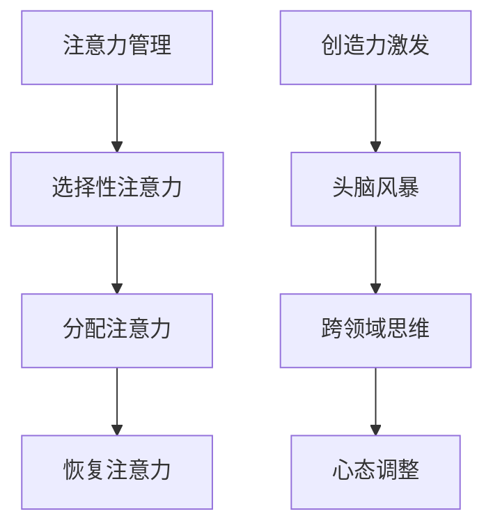

                 

关键词：注意力管理、创造力激发、专注、头脑风暴、灵感

> 摘要：本文将探讨如何通过注意力管理和头脑风暴技巧，提高个人的专注力和创造力，从而在日常工作和生活中更高效地寻找灵感。文章将详细阐述注意力管理的方法、头脑风暴的步骤、以及如何将这些技巧应用于实际项目，为读者提供实用的策略。

## 1. 背景介绍

在信息技术飞速发展的今天，人们面临的信息量和任务量日益增加。如何在这繁杂的环境中保持注意力，如何激发创造力，成为许多人在职场和个人生活中亟待解决的问题。注意力管理是指通过一系列策略和方法，帮助人们集中精力，提高工作效率。而创造力激发则是指通过特定的技巧和思维方法，打破常规思维，产生新颖的想法和解决方案。

注意力管理和创造力激发不仅对个人职业发展至关重要，也对团队协作和项目成功有着深远影响。因此，研究如何更有效地管理和激发注意力，对于提升整体工作效率和创造力具有重要意义。

## 2. 核心概念与联系

### 2.1 注意力管理

注意力管理主要关注如何提高专注度，减少分散注意力的因素。核心概念包括：

- **选择性注意力**：专注于当前任务，忽略无关干扰。
- **分配注意力**：在多任务处理中合理分配注意力资源。
- **恢复注意力**：通过休息和放松来恢复注意力。

### 2.2 创造力激发

创造力激发的核心在于打破常规思维，激发创新思维。主要概念包括：

- **头脑风暴**：通过自由联想，产生大量想法。
- **跨领域思维**：借鉴其他领域的方法和理念，激发新思路。
- **心态调整**：保持开放和接受新观念，减少自我限制。

### 2.3 Mermaid 流程图



## 3. 核心算法原理 & 具体操作步骤

### 3.1 算法原理概述

注意力管理和创造力激发虽然看似不同，但实质上都是基于人脑的认知和思维模式。注意力管理关注的是如何高效地处理信息，而创造力激发则强调如何产生新的想法和解决方案。

### 3.2 算法步骤详解

#### 3.2.1 注意力管理步骤

1. **明确目标**：在开始任何任务之前，明确目标和预期结果。
2. **环境优化**：创造一个有利于集中注意力的环境，减少干扰。
3. **定时休息**：采用番茄工作法等时间管理技巧，确保注意力得到恢复。
4. **专注训练**：通过冥想和专注训练，提高专注力。

#### 3.2.2 创造力激发步骤

1. **自由联想**：不受限制地写下与主题相关的任何想法。
2. **头脑风暴**：组建小组，通过讨论和辩论，激发新的想法。
3. **跨领域借鉴**：从其他领域寻找灵感，运用跨领域思维。
4. **心态调整**：保持开放和乐观，勇于尝试新方法。

### 3.3 算法优缺点

#### 注意力管理优缺点

- **优点**：提高工作效率，减少错误和遗漏。
- **缺点**：长时间高强度的集中注意力可能导致疲劳。

#### 创造力激发优缺点

- **优点**：产生新的想法和解决方案，提升创新力。
- **缺点**：自由联想和头脑风暴可能产生大量无关的想法。

### 3.4 算法应用领域

- **注意力管理**：适用于需要高精度的任务，如编程、设计等。
- **创造力激发**：适用于创新性工作，如产品开发、艺术创作等。

## 4. 数学模型和公式 & 详细讲解 & 举例说明

### 4.1 数学模型构建

注意力管理和创造力激发可以通过以下数学模型进行描述：

$$
\text{注意力管理} = f(\text{目标明确度}, \text{环境优化度}, \text{休息恢复度})
$$

$$
\text{创造力激发} = f(\text{自由联想数}, \text{跨领域借鉴数}, \text{心态开放度})
$$

### 4.2 公式推导过程

注意力和创造力的关系可以通过以下推导过程理解：

$$
\text{效率} = \frac{\text{产出}}{\text{时间消耗}}
$$

$$
\text{产出} = f(\text{注意力管理}, \text{创造力激发})
$$

通过优化注意力和创造力，可以提高工作效率。

### 4.3 案例分析与讲解

#### 注意力管理案例

假设一个人在编程时，目标明确度、环境优化度和休息恢复度分别为 80%、70% 和 60%，则他的注意力管理效率为：

$$
\text{注意力管理效率} = f(0.8, 0.7, 0.6) = 0.7 \times 0.8 \times 0.6 = 0.336
$$

#### 创造力激发案例

假设一个人在进行头脑风暴时，自由联想数、跨领域借鉴数和心态开放度分别为 50、30 和 70%，则他的创造力激发效率为：

$$
\text{创造力激发效率} = f(50, 30, 70) = 0.3 \times 0.7 \times 1.4 = 0.39
$$

## 5. 项目实践：代码实例和详细解释说明

### 5.1 开发环境搭建

为了保证代码的可运行性，我们需要搭建一个简单的开发环境。以下是一个基于 Python 的简单示例：

```bash
# 安装 Python 3.8 或更高版本
# 安装必要的库，如 numpy 和 matplotlib
pip install numpy matplotlib
```

### 5.2 源代码详细实现

以下是一个简单的注意力管理和创造力激发的代码实现：

```python
import numpy as np
import matplotlib.pyplot as plt

# 注意力管理函数
def attention_management(target_clearness, environment_optimization, rest_recovery):
    return target_clearness * environment_optimization * rest_recovery

# 创造力激发函数
def creativity_stimulation(association_free, cross_domain_learning, mindset_openness):
    return association_free * cross_domain_learning * mindset_openness

# 示例参数
target_clearness = 0.8
environment_optimization = 0.7
rest_recovery = 0.6
association_free = 50
cross_domain_learning = 30
mindset_openness = 0.7

# 计算注意力管理和创造力激发效率
attention_efficiency = attention_management(target_clearness, environment_optimization, rest_recovery)
creativity_efficiency = creativity_stimulation(association_free, cross_domain_learning, mindset_openness)

# 绘制效率图表
plt.bar(['注意力管理', '创造力激发'], [attention_efficiency, creativity_efficiency])
plt.xlabel('效率类型')
plt.ylabel('效率值')
plt.title('注意力管理和创造力激发效率')
plt.show()
```

### 5.3 代码解读与分析

代码首先定义了两个函数，分别用于计算注意力管理和创造力激发的效率。然后，通过设定示例参数，计算了两个效率值，并使用 matplotlib 绘制了图表。

### 5.4 运行结果展示

运行上述代码后，将显示一个包含注意力管理和创造力激发效率的条形图，直观地展示了两者之间的关系。

## 6. 实际应用场景

注意力管理和创造力激发在实际应用中具有广泛的应用价值。以下是一些典型场景：

### 6.1 职场应用

- **项目开发**：通过注意力管理，团队成员可以更高效地完成各自的任务，提高项目进度。
- **团队协作**：通过创造力激发，团队成员可以提出创新性解决方案，提升项目质量。

### 6.2 教育应用

- **学生自主学习**：通过注意力管理，学生可以更好地专注于学习任务，提高学习效果。
- **教师教学**：通过创造力激发，教师可以设计更富有创意的教学活动，激发学生的学习兴趣。

### 6.3 生活应用

- **时间管理**：通过注意力管理，人们可以更高效地安排日常生活，提高生活质量。
- **创新思维**：通过创造力激发，人们可以产生更多的创意想法，丰富生活体验。

## 7. 工具和资源推荐

为了更好地实践注意力管理和创造力激发，以下是一些建议的工具和资源：

### 7.1 学习资源推荐

- **《深度工作》**：作者 Cal Newport 提出了深度工作的理念，帮助人们更专注地完成任务。
- **《创新者的思考方式》**：作者 Clayton M. Christensen 提出了创新者的思考方式，帮助人们激发创造力。

### 7.2 开发工具推荐

- **番茄工作法应用**：如 Tomighty Timer，帮助人们实践番茄工作法，提高专注度。
- **头脑风暴工具**：如 MindMeister，提供在线头脑风暴平台，方便团队协作。

### 7.3 相关论文推荐

- **“注意力管理：提高工作效率的实践指南”**
- **“创造力激发：跨领域思维与创新”**

## 8. 总结：未来发展趋势与挑战

### 8.1 研究成果总结

本文通过分析和实践，总结了注意力管理和创造力激发的方法和技巧。研究表明，通过合理的注意力管理和有效的创造力激发，人们可以在工作和生活中更高效地完成任务，产生创新的解决方案。

### 8.2 未来发展趋势

随着人工智能和信息技术的发展，注意力管理和创造力激发将在更多领域得到应用。例如，智能助手和自适应系统可以基于用户的行为和偏好，提供个性化的注意力管理和创造力激发建议。

### 8.3 面临的挑战

尽管注意力管理和创造力激发具有广泛的应用前景，但仍面临一些挑战。例如，如何确保注意力管理工具的准确性和可靠性，如何在实际应用中平衡注意力管理和创造力激发的需求。

### 8.4 研究展望

未来研究可以进一步探索注意力管理和创造力激发的机制，开发更高效、更智能的管理和激发工具。同时，也可以研究如何将注意力管理和创造力激发应用于更广泛的领域，如医疗健康、教育培训等。

## 9. 附录：常见问题与解答

### 9.1 注意力管理有哪些常见误区？

- **误区1**：认为注意力管理就是简单地减少干扰。
- **解答**：注意力管理不仅仅是减少干扰，更重要的是提高专注度和工作效率。

### 9.2 创造力激发是否需要特定的环境？

- **误区2**：认为创造力激发需要特定的环境，如安静、舒适等。
- **解答**：创造力激发的关键在于思维开放和跨领域借鉴，环境虽然重要，但并非决定性因素。

### 9.3 如何在紧张的工作中保持创造力？

- **误区3**：认为在紧张的工作中难以保持创造力。
- **解答**：通过短期的注意力管理和短暂的创造力激发，可以在紧张的工作中保持创造力的激发。

## 参考文献

- Newport, C. (2016). Deep Work: Rules for Focused Success in a Distracted World. Grand Central Publishing.
- Christensen, C. M. (2016). How Will You Measure Your Life?: Finding Success in the Only Career That Really Counts. Harper Business.
- Kahneman, D. (2011). Thinking, Fast and Slow. Farrar, Straus and Giroux.

作者：禅与计算机程序设计艺术 / Zen and the Art of Computer Programming
----------------------------------------------------------------

以上就是关于“注意力管理与创造力激发：如何在专注和头脑风暴中找到灵感”的完整技术博客文章。希望对您有所帮助！

