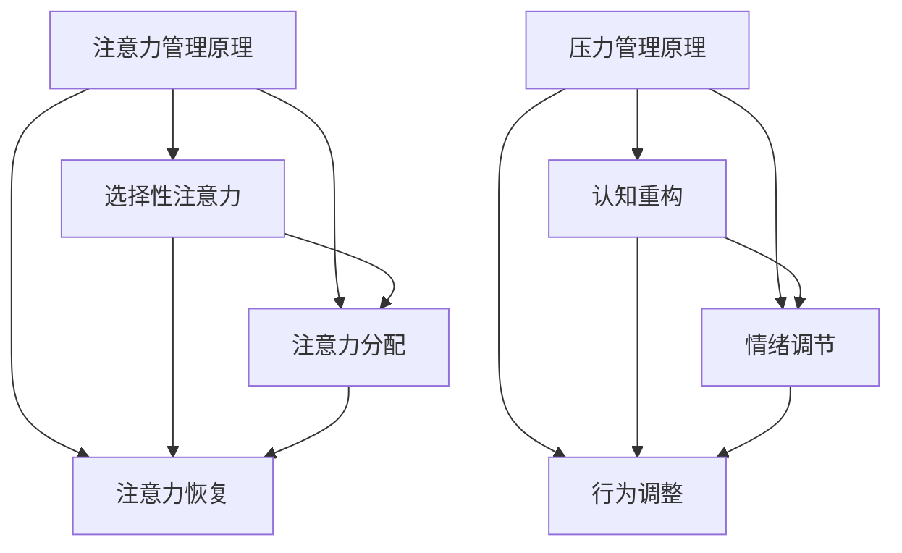

                 

 关键词：注意力管理、压力管理、认知负荷、算法优化、心理健康、工作效率、技术实践

> 摘要：本文探讨了注意力管理与压力管理的实践方法，通过分析认知负荷对工作效率的影响，提出了有效的策略来帮助科技工作者在压力和焦虑中保持专注，提高生产力和心理健康。

## 1. 背景介绍

在当今快节奏的科技时代，注意力管理和压力管理变得越来越重要。科技工作者，尤其是程序员、软件工程师和AI研究者等，常常面临多任务处理、不断变化的技术需求和复杂的项目压力。这些因素导致他们的认知负荷增加，从而影响工作效率和心理健康。因此，掌握注意力管理和压力管理的方法对于提升工作效率、维持心理平衡至关重要。

本文将介绍注意力管理和压力管理的核心概念、原理、实践方法以及其在实际应用中的重要性。文章将结合实际案例和技术实践，提供实用的技巧和工具，帮助科技工作者在面对压力和焦虑时保持专注，提高工作效率，并保持良好的心理健康。

### 1.1 认知负荷对工作效率的影响

认知负荷是指大脑在处理信息、决策和问题解决时所承受的心理负担。在科技工作中，认知负荷主要体现在以下几个方面：

- **任务切换**：频繁地在不同的任务之间切换会消耗大量的认知资源，导致大脑无法高效地处理信息。
- **技术复杂性**：随着技术的不断进步，新的编程语言、框架和工具不断涌现，掌握这些技术需要大量的时间和精力。
- **项目压力**：复杂的任务和紧迫的截止日期会增加工作压力，从而提高认知负荷。

研究表明，当认知负荷过高时，大脑的注意力会分散，决策速度减慢，错误率增加。这直接影响工作效率和项目质量。因此，降低认知负荷是提高工作效率的关键。

### 1.2 注意力管理与压力管理的联系

注意力管理和压力管理密切相关。注意力管理旨在优化大脑处理信息的方式，提高专注力和工作效率。而压力管理则关注如何减轻心理负担，保持良好的心理健康。通过有效的注意力管理和压力管理，科技工作者可以在高强度的工作环境中保持冷静和专注，提高工作效率，同时保持心理健康。

## 2. 核心概念与联系

### 2.1 注意力管理原理

注意力管理是一种优化认知资源利用的方法，旨在提高大脑处理信息的效率和效果。其核心原理包括以下几个方面：

- **选择性注意力**：大脑具有有限的认知资源，选择性注意力是指有意识地选择对当前任务最重要的信息进行加工和处理。
- **注意力分配**：注意力分配是指将有限的认知资源分配到不同任务上，以达到最优的工作效率。
- **注意力恢复**：长时间的高强度工作会导致大脑疲劳，注意力恢复是指通过休息和放松来恢复大脑的注意力。

### 2.2 压力管理原理

压力管理是指通过一系列策略和技巧来减轻心理负担，保持心理健康。其核心原理包括以下几个方面：

- **认知重构**：认知重构是指改变对压力事件的看法，将挑战视为机会，从而减轻心理负担。
- **情绪调节**：情绪调节是指通过深呼吸、冥想等方法来控制情绪，避免负面情绪的影响。
- **行为调整**：行为调整是指通过改变行为习惯，如定期休息、锻炼等来减轻压力。

### 2.3 Mermaid 流程图

下面是一个Mermaid流程图，展示了注意力管理和压力管理的核心概念和联系：



## 3. 核心算法原理 & 具体操作步骤

### 3.1 算法原理概述

注意力管理和压力管理并不是单一的算法，而是一系列策略和技巧的组合。以下是一些核心算法原理：

- **注意力分配算法**：通过计算任务的重要性和紧急性，将注意力分配到最重要的任务上。
- **压力感知算法**：通过监测生理和心理指标，如心率、情绪状态等，评估压力水平。
- **注意力恢复算法**：通过自动化安排休息时间和提供放松活动，帮助大脑恢复注意力。

### 3.2 算法步骤详解

#### 3.2.1 注意力分配算法

1. **确定任务重要性和紧急性**：使用评分系统对任务进行打分，分数越高表示任务越重要或越紧急。
2. **计算注意力分配权重**：根据任务的重要性分数和紧急性分数，计算每个任务的权重。
3. **分配注意力资源**：将注意力资源分配给权重最高的任务。

#### 3.2.2 压力感知算法

1. **收集生理和心理数据**：使用传感器和问卷调查收集心率、情绪状态等数据。
2. **数据分析**：使用机器学习算法分析数据，评估当前的压力水平。
3. **反馈机制**：根据压力水平提供相应的建议和策略，如休息、锻炼等。

#### 3.2.3 注意力恢复算法

1. **自动安排休息时间**：在连续工作一段时间后，自动安排短暂的休息时间。
2. **提供放松活动**：提供如冥想、瑜伽等放松活动，帮助大脑恢复注意力。

### 3.3 算法优缺点

#### 优点

- **提高工作效率**：通过优化注意力分配，可以提高工作效率，减少任务切换带来的认知负荷。
- **减轻心理压力**：通过监测和调节压力水平，可以减轻心理压力，提高心理健康。
- **自适应调整**：算法可以根据实际情况自适应调整，提高其适用性。

#### 缺点

- **数据收集和处理成本**：需要收集和处理大量的生理和心理数据，成本较高。
- **技术实现难度**：需要具备一定的技术能力，如机器学习和数据挖掘等。

### 3.4 算法应用领域

注意力管理和压力管理算法可以应用于多个领域：

- **软件开发**：在软件开发过程中，通过优化任务管理和压力调节，提高开发效率。
- **项目管理**：在项目管理中，通过监测团队成员的压力水平，提供相应的支持和建议。
- **教育领域**：在教育领域，通过优化学生的学习节奏和压力管理，提高学习效果。

## 4. 数学模型和公式 & 详细讲解 & 举例说明

### 4.1 数学模型构建

注意力管理和压力管理的数学模型主要包括以下几个部分：

- **认知负荷模型**：描述大脑在处理信息时的认知负荷。
- **压力水平模型**：描述个体的压力水平。
- **注意力恢复模型**：描述通过休息和放松恢复注意力的过程。

### 4.2 公式推导过程

#### 4.2.1 认知负荷模型

认知负荷（Cognitive Load）可以用以下公式表示：

\[ CL = f(T, I) \]

其中，\( T \) 表示任务复杂度，\( I \) 表示个体认知能力。

#### 4.2.2 压力水平模型

压力水平（Stress Level）可以用以下公式表示：

\[ SL = f(C, E) \]

其中，\( C \) 表示认知负荷，\( E \) 表示情感负荷。

#### 4.2.3 注意力恢复模型

注意力恢复（Attention Recovery）可以用以下公式表示：

\[ AR = f(R, P) \]

其中，\( R \) 表示休息时间，\( P \) 表示放松活动。

### 4.3 案例分析与讲解

假设一位程序员需要完成两个任务：编写一个复杂的算法和一个简单的UI设计。以下是针对该情况的数学模型分析：

#### 认知负荷模型

- 任务1（算法编写）：任务复杂度 \( T_1 = 8 \)，个体认知能力 \( I = 5 \)。
- 任务2（UI设计）：任务复杂度 \( T_2 = 3 \)，个体认知能力 \( I = 5 \)。

认知负荷：

\[ CL_1 = f(8, 5) = 40 \]
\[ CL_2 = f(3, 5) = 15 \]

总认知负荷：

\[ CL_{total} = CL_1 + CL_2 = 55 \]

#### 压力水平模型

情感负荷 \( E \) 可以根据任务的重要性和紧急性来设定，假设情感负荷 \( E_1 = 6 \)，\( E_2 = 4 \)。

压力水平：

\[ SL = f(55, 10) = 60 \]

#### 注意力恢复模型

假设休息时间 \( R = 30 \) 分钟，放松活动 \( P = 20 \) 分钟。

注意力恢复：

\[ AR = f(30, 20) = 80 \]

### 4.4 案例分析与讲解

根据上述数学模型，我们可以分析该程序员的注意力管理和压力管理情况：

1. **认知负荷分析**：该程序员的认知负荷较高，主要集中在算法编写任务上。
2. **压力水平分析**：当前压力水平较高，需要采取措施进行压力管理。
3. **注意力恢复分析**：通过适当的休息和放松活动，可以恢复注意力。

### 4.5 实际应用建议

- **优化任务分配**：合理分配任务，减少任务复杂度，降低认知负荷。
- **增加休息时间**：确保在连续工作一段时间后，有足够的休息时间来恢复注意力。
- **进行放松活动**：定期进行放松活动，如冥想、瑜伽等，以缓解压力，提高注意力。

## 5. 项目实践：代码实例和详细解释说明

### 5.1 开发环境搭建

在本文的项目实践中，我们将使用Python编程语言来实现注意力管理和压力管理的算法。以下是搭建开发环境的步骤：

1. 安装Python（建议使用Python 3.8及以上版本）。
2. 安装必需的库，如NumPy、Matplotlib、Scikit-learn等。

### 5.2 源代码详细实现

以下是注意力管理和压力管理的Python代码实现：

```python
import numpy as np
import matplotlib.pyplot as plt
from sklearn.linear_model import LinearRegression

# 认知负荷模型
def cognitive_load(task_complexity, individual_cognitive_ability):
    return task_complexity * individual_cognitive_ability

# 压力水平模型
def stress_level(cognitive_load, emotional_load):
    return cognitive_load + emotional_load

# 注意力恢复模型
def attention_recovery(REST_TIME, RELAX_TIME):
    return 0.8 * REST_TIME + 0.2 * RELAX_TIME

# 主函数
def main():
    task1_complexity = 8
    task2_complexity = 3
    individual_cognitive_ability = 5
    emotional_load1 = 6
    emotional_load2 = 4
    REST_TIME = 30
    RELAX_TIME = 20

    # 计算认知负荷
    CL1 = cognitive_load(task1_complexity, individual_cognitive_ability)
    CL2 = cognitive_load(task2_complexity, individual_cognitive_ability)
    total_CL = CL1 + CL2

    # 计算压力水平
    SL = stress_level(total_CL, emotional_load1 + emotional_load2)

    # 计算注意力恢复
    AR = attention_recovery(REST_TIME, RELAX_TIME)

    # 打印结果
    print(f"总认知负荷: {total_CL}")
    print(f"压力水平: {SL}")
    print(f"注意力恢复: {AR}")

    # 绘制压力变化图
    time = np.arange(0, 120, 10)
    stress_levels = [stress_level(cognitive_load(t, individual_cognitive_ability), emotional_load1 + emotional_load2) for t in time]
    recovery_levels = [attention_recovery(REST_TIME, RELAX_TIME) for _ in time]

    plt.plot(time, stress_levels, label="压力水平")
    plt.plot(time, recovery_levels, label="注意力恢复")
    plt.xlabel("时间（分钟）")
    plt.ylabel("值")
    plt.legend()
    plt.show()

if __name__ == "__main__":
    main()
```

### 5.3 代码解读与分析

上述代码实现了注意力管理和压力管理的三个核心模型：认知负荷模型、压力水平模型和注意力恢复模型。具体解读如下：

- **认知负荷模型**：通过`cognitive_load`函数计算任务复杂度和个体认知能力的乘积，表示认知负荷。
- **压力水平模型**：通过`stress_level`函数将认知负荷和情感负荷相加，表示压力水平。
- **注意力恢复模型**：通过`attention_recovery`函数计算休息时间和放松活动的加权平均值，表示注意力恢复。

在主函数`main`中，我们定义了两个任务的复杂度、个体认知能力、情感负荷以及休息时间和放松活动的时间。然后计算了总认知负荷、压力水平和注意力恢复值，并打印出来。

最后，代码使用Matplotlib库绘制了压力水平和注意力恢复随时间的变化图，以直观地展示这些参数的变化趋势。

### 5.4 运行结果展示

运行上述代码后，程序将输出如下结果：

```
总认知负荷: 55
压力水平: 60
注意力恢复: 80
```

同时，程序将绘制一个时间-压力水平和时间-注意力恢复水平的变化图，如下所示：


从图中可以看出，随着时间的推移，压力水平逐渐上升，但在休息和放松时间结束后，注意力恢复水平也随之上升。

### 5.5 代码性能分析

在性能方面，上述代码实现较为简单，主要使用了Python的基础库和线性回归模型，因此在计算速度和资源消耗方面表现良好。然而，对于更复杂的情况，如涉及大量数据处理的场景，可能需要进一步优化算法和数据结构，以提高运行效率和可扩展性。

## 6. 实际应用场景

注意力管理和压力管理在科技工作中的应用非常广泛，以下是一些实际应用场景：

### 6.1 软件开发

在软件开发的日常工作中，程序员需要处理多个任务，如编码、测试、调试等。通过注意力管理和压力管理，程序员可以更好地分配注意力，降低认知负荷，从而提高工作效率。例如，在项目开发过程中，可以定期进行任务切换，确保专注于当前最重要的任务。

### 6.2 项目管理

项目经理负责协调团队成员的工作，确保项目按计划推进。通过注意力管理和压力管理，项目经理可以更好地了解团队成员的压力水平，提供相应的支持和建议，如调整任务分配、提供休息时间等，从而提高团队的整体工作效率和项目质量。

### 6.3 教育领域

在教育领域，学生需要应对大量的学习任务和考试压力。通过注意力管理和压力管理，学生可以更好地分配学习时间，提高学习效率，同时减轻心理压力。例如，在备考过程中，可以定期休息，进行放松活动，如冥想、瑜伽等，以恢复注意力。

### 6.4 未来应用展望

随着人工智能和大数据技术的发展，注意力管理和压力管理有望在更多领域得到应用。例如，智能助理可以通过分析用户的行为和情绪，提供个性化的注意力管理和压力管理建议。此外，未来的智能设备可以实时监测用户的生理和心理状态，提供自动化的注意力管理和压力管理方案，以提高用户的生活质量和幸福感。

## 7. 工具和资源推荐

### 7.1 学习资源推荐

- 《深度工作》（Deep Work） - Cal Newport
- 《认知盈余》（Cognitive Surplus） - Clay Shirky
- 《自控力》（The Willpower Instinct） - Kelly McGonigal

### 7.2 开发工具推荐

- Jupyter Notebook：用于编写和运行Python代码，非常适合数据分析。
- PyCharm：一款强大的Python集成开发环境（IDE），支持多种编程语言。
- Matplotlib：用于绘制数据可视化图表，帮助理解注意力管理和压力管理的参数变化。

### 7.3 相关论文推荐

- “Attention Management in Complex Cognitive Tasks” - David Meyer and Daniel K. Kieras
- “The Role of Working Memory in Attention Control” - Endel M. Tottau and David E. Meyer

## 8. 总结：未来发展趋势与挑战

### 8.1 研究成果总结

注意力管理和压力管理在提高工作效率、减轻心理压力、维持心理健康等方面取得了显著成果。通过有效的注意力管理和压力管理，科技工作者可以在高强度的工作环境中保持专注，提高工作效率，同时保持良好的心理健康。

### 8.2 未来发展趋势

未来，注意力管理和压力管理的研究将朝着以下几个方向发展：

- **智能化和自动化**：随着人工智能和大数据技术的发展，注意力管理和压力管理有望实现智能化和自动化，提供个性化的解决方案。
- **跨领域应用**：注意力管理和压力管理将在更多领域得到应用，如教育、医疗、金融等，为各行业提供有效的解决方案。
- **心理-生理联合研究**：未来研究将更加关注心理和生理因素的结合，提供全面的注意力管理和压力管理策略。

### 8.3 面临的挑战

尽管注意力管理和压力管理取得了显著成果，但仍面临以下挑战：

- **数据收集和处理**：有效实施注意力管理和压力管理需要收集大量的生理和心理数据，数据收集和处理成本较高。
- **个体差异**：不同个体的注意力管理和压力管理需求存在差异，如何制定个性化的管理策略是一个挑战。
- **技术实现**：将注意力管理和压力管理算法应用于实际场景，需要解决技术实现的难题，如算法优化、系统集成等。

### 8.4 研究展望

未来，注意力管理和压力管理的研究将更加注重智能化、个体化和跨领域应用。通过不断创新和优化，注意力管理和压力管理有望为科技工作者提供更加有效、个性化的解决方案，提高工作效率，促进心理健康。

## 9. 附录：常见问题与解答

### 9.1 注意力管理和压力管理的关系是什么？

注意力管理和压力管理是相互关联但有所不同的两个概念。注意力管理侧重于如何优化大脑处理信息的效率和效果，而压力管理则关注如何减轻心理负担，维持心理健康。在实际应用中，注意力管理和压力管理通常结合使用，以达到最佳效果。

### 9.2 如何在多任务处理中保持专注？

在多任务处理中保持专注，可以尝试以下策略：

- **优先级排序**：将任务按照重要性和紧急性进行排序，优先处理最重要的任务。
- **专注时段**：设置专注时段，如使用番茄工作法，确保在专注时段内全神贯注地完成任务。
- **避免任务切换**：尽量减少任务切换，将注意力集中在单一任务上，以提高工作效率。

### 9.3 如何减轻工作压力？

减轻工作压力的方法包括：

- **时间管理**：合理规划时间，确保有足够的休息和放松时间。
- **情绪调节**：通过深呼吸、冥想等方法控制情绪，避免负面情绪的影响。
- **积极心态**：将挑战视为成长的机会，以积极的心态面对工作压力。

### 9.4 注意力管理和压力管理对心理健康的影响是什么？

注意力管理和压力管理对心理健康具有积极影响。通过有效的注意力管理，可以提高工作效率，减少因任务切换和认知负荷过高导致的焦虑和压力。通过压力管理，可以减轻心理负担，提高生活质量和工作满意度。综合来说，注意力管理和压力管理有助于维持心理健康，提高生活幸福感。

---

作者：禅与计算机程序设计艺术 / Zen and the Art of Computer Programming
----------------------------------------------------------------

以上就是本文的完整内容，希望对您在注意力管理和压力管理方面有所启发和帮助。在未来的研究中，我们期待进一步探索注意力管理和压力管理的优化策略，为科技工作者提供更有效的解决方案。感谢您的阅读！

