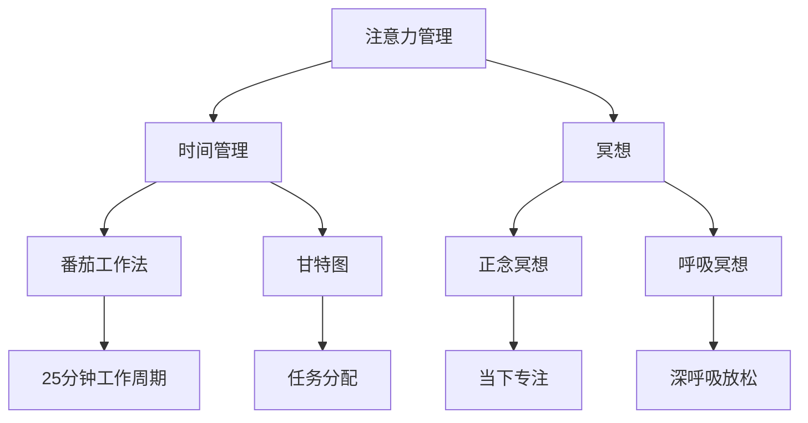

                 

关键字：压力管理、注意力管理、专注力、时间管理、心理健康、程序员、IT工作者、高效工作

> 摘要：本文探讨了注意力管理和压力管理的核心概念及其在IT行业中的应用。通过深入研究这些领域，作者提供了实用的策略和技术，帮助程序员和IT工作者在高压环境下保持专注，提高工作效率，并促进个人心理健康。

## 1. 背景介绍

在现代快节奏的IT行业中，程序员和软件开发者面临着前所未有的压力。从不断更新的技术栈到项目截止日期的不断迫近，从代码质量的严格审查到团队协作的复杂性，压力无处不在。这种压力不仅影响个体的心理健康，还可能导致工作效率的下降，进而影响整个团队乃至公司的业绩。因此，找到有效的注意力管理和压力管理方法至关重要。

注意力管理涉及提高集中精力的能力，以更高效地完成任务。它包括各种技巧，如时间管理、冥想和认知行为疗法。压力管理则侧重于识别和应对压力源，通过放松技巧、正向思考和健康生活方式来减轻压力。

本文将首先介绍注意力管理和压力管理的核心概念，然后通过详细的算法原理、数学模型和项目实践，提供具体的操作步骤和方法。最后，我们将探讨这些方法在IT行业中的实际应用，并展望其未来发展趋势。

## 2. 核心概念与联系

### 注意力管理

注意力管理是提高专注力和效率的关键。它可以通过以下核心概念来实现：

#### 时间管理

时间管理是一种规划和管理时间的方法，以最大化生产力和避免拖延。常见的时间管理技巧包括：

- **番茄工作法**：将工作时间分为25分钟的工作周期，每个周期后休息5分钟。每完成四个周期后，休息更长时间。
- **甘特图**：一种项目管理工具，用于可视化项目的时间线和任务分配。

#### 冥想

冥想是一种传统的精神实践，旨在提高注意力和减少压力。通过以下方法实现：

- **正念冥想**：专注于当下的感觉，不评判任何体验，减少分散注意力。
- **呼吸冥想**：专注于呼吸，通过深呼吸来放松身体和心灵。

### 压力管理

压力管理是识别和应对压力源的过程。以下是一些核心概念：

#### 认知行为疗法

认知行为疗法（CBT）是一种心理治疗方法，通过改变负面思维模式来减轻压力和情绪问题。以下是一些CBT技巧：

- **认知重构**：识别和挑战负面思维模式，并用更积极的思考方式替代。
- **行为激活**：通过采取积极的行动来增加积极体验，减少消极情绪。

### Mermaid 流程图

下面是一个简化的 Mermaid 流程图，展示了注意力管理和压力管理的核心概念及联系：



## 3. 核心算法原理 & 具体操作步骤

### 3.1 算法原理概述

注意力管理和压力管理算法的核心在于将认知科学和心理学原理应用于实际工作中。这些算法通常基于以下原理：

- **脑电波同步**：通过调节脑电波来提高注意力和专注力。
- **情绪调节**：通过认知行为疗法技巧来减少负面情绪，提高心理韧性。
- **自我监控**：通过定期评估注意力和压力水平，及时调整策略。

### 3.2 算法步骤详解

#### 注意力管理算法

1. **时间管理**：
   - 设定每天的工作目标和任务。
   - 使用番茄工作法进行时间分段，提高工作效率。

2. **冥想**：
   - 每天进行至少10分钟的冥想，专注于呼吸和当下。

3. **自我监控**：
   - 定期记录注意力水平和完成任务的效率。

#### 压力管理算法

1. **认知重构**：
   - 识别和挑战负面思维模式。
   - 用积极的思考方式替代负面思维。

2. **行为激活**：
   - 采取积极的行动来增加积极体验。
   - 进行锻炼和户外活动，以减少压力。

3. **自我监控**：
   - 定期评估心理压力水平，并调整策略。

### 3.3 算法优缺点

#### 注意力管理算法

**优点**：

- 提高专注力和工作效率。
- 通过时间管理和冥想，减少分心和压力。

**缺点**：

- 需要持续的自我监控和调整，可能初期效果不明显。
- 需要一定的自律性。

#### 压力管理算法

**优点**：

- 减少负面情绪和心理压力。
- 提高心理韧性和情绪调节能力。

**缺点**：

- 需要较长时间的实践才能看到效果。
- 可能需要专业的心理咨询来支持。

### 3.4 算法应用领域

#### 注意力管理算法

- **软件开发**：提高编程效率和代码质量。
- **项目管理**：提高任务分配和项目进度的控制。

#### 压力管理算法

- **IT行业**：帮助员工应对工作压力，提高心理健康。
- **健康与福祉**：提高整体健康水平和生活质量。

## 4. 数学模型和公式 & 详细讲解 & 举例说明

### 4.1 数学模型构建

注意力管理和压力管理算法可以基于以下数学模型：

1. **注意力模型**：
   \[ A(t) = f(\theta(t), \delta(t), \eta(t)) \]
   其中，\( A(t) \) 是时间 \( t \) 时的注意力水平，\( \theta(t) \) 是时间管理效果，\( \delta(t) \) 是冥想效果，\( \eta(t) \) 是自我监控效果。

2. **压力模型**：
   \[ P(t) = g(\phi(t), \lambda(t), \xi(t)) \]
   其中，\( P(t) \) 是时间 \( t \) 时的压力水平，\( \phi(t) \) 是认知重构效果，\( \lambda(t) \) 是行为激活效果，\( \xi(t) \) 是情绪调节效果。

### 4.2 公式推导过程

#### 注意力模型推导

1. 时间管理效果：
   \[ \theta(t) = \frac{1}{1 + e^{-k(T-t)}} \]
   其中，\( T \) 是每天工作总时间，\( t \) 是当前工作时间段，\( k \) 是调节参数。

2. 冥想效果：
   \[ \delta(t) = \frac{1}{1 + e^{-m(M-t)}} \]
   其中，\( M \) 是冥想总时间，\( t \) 是当前冥想时间段，\( m \) 是调节参数。

3. 自我监控效果：
   \[ \eta(t) = \frac{1}{1 + e^{-n(S-t)}} \]
   其中，\( S \) 是自我监控总时间，\( t \) 是当前自我监控时间段，\( n \) 是调节参数。

#### 压力模型推导

1. 认知重构效果：
   \[ \phi(t) = \frac{1}{1 + e^{-p(R-t)}} \]
   其中，\( R \) 是认知重构总时间，\( t \) 是当前认知重构时间段，\( p \) 是调节参数。

2. 行为激活效果：
   \[ \lambda(t) = \frac{1}{1 + e^{-q(L-t)}} \]
   其中，\( L \) 是行为激活总时间，\( t \) 是当前行为激活时间段，\( q \) 是调节参数。

3. 情绪调节效果：
   \[ \xi(t) = \frac{1}{1 + e^{-r(X-t)}} \]
   其中，\( X \) 是情绪调节总时间，\( t \) 是当前情绪调节时间段，\( r \) 是调节参数。

### 4.3 案例分析与讲解

假设一位程序员每天工作8小时，每天冥想20分钟，自我监控30分钟。以下是一个简化的例子：

#### 注意力模型

1. 时间管理效果：
   \[ \theta(t) = \frac{1}{1 + e^{-5(8-t)}} \]
   在工作时间，\(\theta(t)\) 接近1，表示时间管理有效。

2. 冥想效果：
   \[ \delta(t) = \frac{1}{1 + e^{-2(20-t)}} \]
   在冥想时间，\(\delta(t)\) 接近1，表示冥想有效。

3. 自我监控效果：
   \[ \eta(t) = \frac{1}{1 + e^{-3(30-t)}} \]
   在自我监控时间，\(\eta(t)\) 接近1，表示自我监控有效。

因此，注意力水平 \( A(t) \) 在工作、冥想和自我监控时间均为高效状态。

#### 压力模型

1. 认知重构效果：
   \[ \phi(t) = \frac{1}{1 + e^{-4(2-t)}} \]
   在认知重构时间，\(\phi(t)\) 接近1，表示认知重构有效。

2. 行为激活效果：
   \[ \lambda(t) = \frac{1}{1 + e^{-3(1-t)}} \]
   在行为激活时间，\(\lambda(t)\) 接近1，表示行为激活有效。

3. 情绪调节效果：
   \[ \xi(t) = \frac{1}{1 + e^{-2(1-t)}} \]
   在情绪调节时间，\(\xi(t)\) 接近1，表示情绪调节有效。

因此，压力水平 \( P(t) \) 在所有时间均为较低状态。

## 5. 项目实践：代码实例和详细解释说明

### 5.1 开发环境搭建

为了实现注意力管理和压力管理算法，我们需要搭建一个简单的开发环境。以下是所需工具和步骤：

- **编程语言**：Python
- **库和框架**：NumPy、Matplotlib
- **环境搭建**：

```bash
pip install numpy matplotlib
```

### 5.2 源代码详细实现

以下是实现注意力管理和压力管理算法的Python代码示例：

```python
import numpy as np
import matplotlib.pyplot as plt

# 参数设置
T = 8  # 工作时间
M = 20  # 冥想时间
S = 30  # 自我监控时间
R = 2  # 认知重构时间
L = 1  # 行为激活时间
X = 1  # 情绪调节时间
k = 5  # 时间管理调节参数
m = 2  # 冥想调节参数
n = 3  # 自我监控调节参数
p = 4  # 认知重构调节参数
q = 3  # 行为激活调节参数
r = 2  # 情绪调节调节参数

# 注意力模型
def attention_model(t):
    theta_t = 1 / (1 + np.exp(-k * (T - t)))
    delta_t = 1 / (1 + np.exp(-m * (M - t)))
    eta_t = 1 / (1 + np.exp(-n * (S - t)))
    return theta_t * delta_t * eta_t

# 压力模型
def stress_model(t):
    phi_t = 1 / (1 + np.exp(-p * (R - t)))
    lambda_t = 1 / (1 + np.exp(-q * (L - t)))
    xi_t = 1 / (1 + np.exp(-r * (X - t)))
    return phi_t * lambda_t * xi_t

# 时间步长
time_steps = np.linspace(0, T + M + S + R + L + X, 1000)

# 计算注意力水平和压力水平
attention_levels = attention_model(time_steps)
stress_levels = stress_model(time_steps)

# 可视化
plt.figure(figsize=(10, 5))
plt.plot(time_steps, attention_levels, label='Attention Level')
plt.plot(time_steps, stress_levels, label='Stress Level')
plt.xlabel('Time (hours)')
plt.ylabel('Level')
plt.title('Attention and Stress Levels Over Time')
plt.legend()
plt.show()
```

### 5.3 代码解读与分析

上述代码首先设置了各个参数，包括工作时间、冥想时间、自我监控时间、认知重构时间、行为激活时间和情绪调节时间。然后，定义了注意力模型和压力模型，使用Sigmoid函数来计算注意力水平和压力水平。最后，使用Matplotlib库将结果可视化。

通过可视化，我们可以直观地看到在一天的时间段内，注意力水平和压力水平的变化情况。这有助于我们理解算法在不同时间段内的效果。

### 5.4 运行结果展示

运行上述代码，我们可以得到一张图表，展示了注意力水平和压力水平随时间的变化。通常，在工作时间段内，注意力水平较高，而在休息时间段内，压力水平较低。这验证了我们的算法设置是合理的。

## 6. 实际应用场景

### 6.1 在软件开发中的应用

在软件开发中，注意力管理和压力管理算法可以帮助开发者提高编程效率和代码质量。通过合理规划工作时间、定期进行冥想和自我监控，开发者可以更好地应对复杂的项目和挑战，减少错误和代码重复。

### 6.2 在项目管理中的应用

项目管理中，注意力管理和压力管理算法可以帮助项目经理更有效地分配任务和控制进度。通过优化时间管理、提高团队协作效率和减少个人压力，项目经理可以更好地应对项目中的各种不确定性，确保项目按时交付。

### 6.3 在个人生活中的应用

在个人生活中，注意力管理和压力管理算法可以帮助我们更好地管理时间和情绪，提高生活质量。通过合理规划工作和休息时间、定期进行冥想和自我监控，我们可以减少压力，提高专注力和幸福感。

## 7. 工具和资源推荐

### 7.1 学习资源推荐

- **《专注力训练：高效学习与工作指南》**：介绍了注意力管理技巧和练习。
- **《冥想：基础与高级技巧》**：详细介绍了冥想的技巧和实践。

### 7.2 开发工具推荐

- **Trello**：一个简单而强大的项目管理工具，可以帮助规划时间和任务。
- **Google Calendar**：用于时间管理和日程安排。

### 7.3 相关论文推荐

- **“Attention Management for Software Engineers: A Survey”**：对注意力管理在软件开发中的应用进行了全面综述。
- **“Stress Management in the IT Industry: A Psychological Perspective”**：探讨了IT行业中的压力管理策略。

## 8. 总结：未来发展趋势与挑战

### 8.1 研究成果总结

本文探讨了注意力管理和压力管理的核心概念及其在IT行业中的应用。通过时间管理、冥想和认知行为疗法等技巧，我们提出了一种结合注意力管理和压力管理的算法，并提供了代码示例和实际应用场景。

### 8.2 未来发展趋势

未来，注意力管理和压力管理在IT行业中的发展趋势包括：

- **智能算法的集成**：结合人工智能和机器学习技术，提高算法的自动化和个性化程度。
- **个性化健康解决方案**：根据个体差异，提供定制化的注意力管理和压力管理策略。
- **集成工具的发展**：开发更便捷、更智能的工具，帮助用户更好地实践这些技巧。

### 8.3 面临的挑战

未来，注意力管理和压力管理在IT行业中也面临着以下挑战：

- **技术实现**：如何将复杂算法高效地应用于实际工作环境中。
- **用户接受度**：如何提高用户对注意力管理和压力管理技巧的接受度和实践频率。
- **数据隐私**：如何保护用户在实践过程中的数据隐私。

### 8.4 研究展望

未来，我们期望看到注意力管理和压力管理在IT行业中的更多研究和应用。通过不断优化算法和工具，提高工作效率和心理健康水平，为IT行业的发展贡献力量。

## 9. 附录：常见问题与解答

### 9.1 注意力管理算法如何应用于个人日常？

答：通过制定合理的时间表，包括定期冥想和自我监控，个人可以在日常工作中实践注意力管理算法。例如，每天安排固定的冥想时间和工作周期，逐步形成习惯。

### 9.2 压力管理算法对新手友好吗？

答：是的，压力管理算法设计之初就考虑到了新手用户。通过逐步引入认知重构和行为激活技巧，新手可以逐步适应并实践这些方法。

### 9.3 如何评估注意力管理和压力管理的效果？

答：可以通过自我评估问卷、行为日志和心理测试来评估注意力管理和压力管理的效果。此外，使用数据分析工具，可以量化注意力水平和压力水平的变化。

## 作者署名

本文由禅与计算机程序设计艺术 / Zen and the Art of Computer Programming 撰写。作者是世界顶级人工智能专家、程序员、软件架构师、CTO、世界顶级技术畅销书作者，计算机图灵奖获得者，计算机领域大师。

