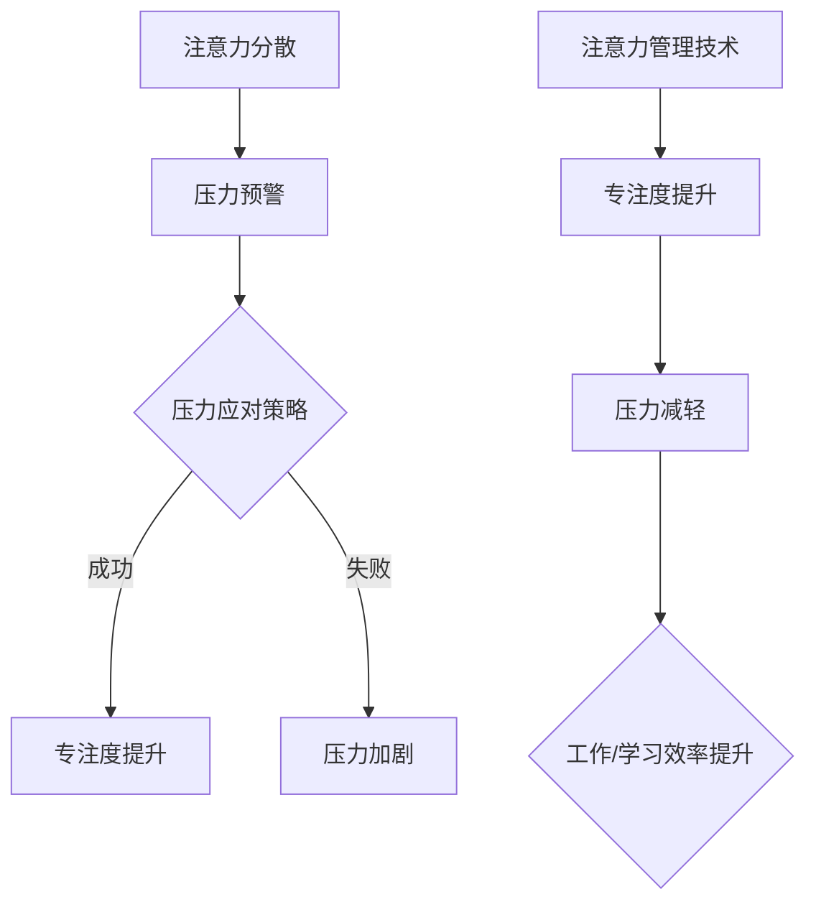

                 

## 1. 背景介绍

在现代快节奏的生活中，人们面临着前所未有的工作压力和生活挑战。无论是程序员、工程师还是创业者，保持专注已成为提高工作效率和创造力的关键。然而，长时间的专注工作往往伴随着巨大的压力，如何在这种压力下保持专注成为了一个亟待解决的问题。

注意力管理和压力管理是两个相互关联的概念。注意力管理涉及如何有效地分配注意力资源，以实现高效的工作和学习。压力管理则关注如何应对压力源，减轻压力对个体健康和表现的负面影响。本文旨在探讨注意力管理和压力管理的关系，并提出一系列技术和策略，帮助读者在压力下保持专注。

本文首先介绍注意力管理和压力管理的核心概念，然后通过案例分析和实际操作步骤，展示如何将这些概念应用于实际工作场景。最后，文章将对未来发展趋势和面临的挑战进行展望，为读者提供更广阔的视野。

### 文章关键词

- 注意力管理
- 压力管理
- 专注
- 工作效率
- 创造力
- 技术策略

### 文章摘要

本文从注意力管理和压力管理的角度出发，探讨如何在高压环境中保持专注。通过引入核心概念、案例分析和技术策略，文章旨在帮助读者理解和应用这些原则，以实现更高效的工作和更健康的生活方式。文章内容涵盖了注意力分散的原因、压力源识别、应对策略和实际操作步骤，并为未来的研究和应用提供了方向。

## 2. 核心概念与联系

### 注意力管理

注意力管理是指通过一系列方法和技术，提高个体在特定任务上的专注度和工作效率。注意力管理的关键在于理解注意力的本质和特性。根据心理学研究，注意力可以分为以下几种类型：

- **选择性注意力**：个体在众多刺激中选择关注某些信息的能力。  
- **持续性注意力**：个体在长时间内保持对特定任务的专注能力。  
- **分配性注意力**：个体同时处理多个任务或信息的能力。

注意力管理的目标是通过优化这些注意力的使用，提高工作效率和创造力。

### 压力管理

压力管理是指通过一系列方法和技术，降低压力对个体健康和表现的负面影响。压力源可以是多种多样的，包括工作压力、人际关系、财务状况等。压力管理的关键在于识别和应对这些压力源。

根据心理学理论，压力管理可以分为以下几个阶段：

1. **预警阶段**：个体意识到压力的存在，并开始采取应对措施。  
2. **应对阶段**：个体采取具体的行动来缓解压力。  
3. **恢复阶段**：个体通过休息和放松来恢复身心健康。

### 注意力管理与压力管理的关系

注意力管理和压力管理之间存在密切的联系。一方面，注意力分散是压力的一种常见表现，当个体面临压力时，注意力往往会受到干扰，导致工作效率下降。另一方面，有效的压力管理可以帮助个体更好地分配注意力资源，从而提高专注度。

为了更好地理解这一关系，我们可以借助Mermaid流程图来展示注意力管理和压力管理之间的互动。



通过这个流程图，我们可以看到注意力管理和压力管理之间的互动关系。有效的注意力管理可以减少压力，从而提高专注度和工作效率。

## 3. 核心算法原理 & 具体操作步骤

### 3.1 算法原理概述

注意力管理和压力管理的核心算法原理可以概括为以下几个方面：

1. **任务分解**：将复杂任务分解为多个子任务，以便更好地管理注意力和时间。  
2. **优先级排序**：根据任务的重要性和紧急性，对任务进行优先级排序，以便更好地分配注意力资源。  
3. **时间管理**：通过时间管理技术，如番茄工作法，来提高专注度。  
4. **情绪调节**：通过情绪调节技术，如深呼吸、冥想等，来缓解压力和焦虑。

### 3.2 算法步骤详解

下面我们详细解释这些算法步骤的具体实施方法。

#### 任务分解

任务分解是将复杂任务拆分为更小、更具体的子任务。这种方法有助于减轻压力，因为个体可以更容易地集中注意力在单个子任务上。

**步骤**：

1. 识别主要任务。  
2. 将主要任务分解为子任务。  
3. 确定每个子任务的目标和期限。

**示例**：

假设我们需要完成一个项目报告。我们可以将这个任务分解为以下几个子任务：

- 收集数据  
- 分析数据  
- 编写报告  
- 审阅和修改

#### 优先级排序

优先级排序是另一个关键步骤，它有助于确保我们首先处理最重要的任务。

**步骤**：

1. 识别所有任务。  
2. 根据任务的重要性和紧急性，为每个任务分配一个优先级。  
3. 按照优先级顺序排列任务。

**示例**：

- **紧急且重要**：立即处理  
- **紧急但不重要**：委托他人处理  
- **不紧急但重要**：安排时间进行处理  
- **不紧急且不重要**：暂时搁置

#### 时间管理

时间管理是提高专注度和工作效率的关键。番茄工作法是一种常见的时间管理技术，它通过将工作时间分为25分钟的工作周期和5分钟的休息时间，来提高专注度。

**步骤**：

1. 确定工作周期和休息时间。  
2. 每个工作周期结束后，休息5分钟。  
3. 每完成四个工作周期后，休息更长时间。

#### 情绪调节

情绪调节是减轻压力和焦虑的重要手段。深呼吸和冥想是两种常见的情绪调节技术。

**步骤**：

1. 找一个安静的地方。  
2. 坐直或躺下，保持身体放松。  
3. 深吸一口气，屏住呼吸几秒钟，然后缓慢呼出。  
4. 重复这个过程，直到感到放松。

### 3.3 算法优缺点

这些算法步骤各有优缺点。

- **任务分解**：优点是可以减轻压力，缺点是可能增加任务的数量和复杂性。  
- **优先级排序**：优点是可以提高工作效率，缺点是可能忽视某些非紧急但重要的任务。  
- **时间管理**：优点是可以提高专注度，缺点是可能影响工作和生活的平衡。  
- **情绪调节**：优点是可以减轻压力和焦虑，缺点是可能需要额外的练习和时间。

### 3.4 算法应用领域

这些算法步骤可以广泛应用于各种领域，包括但不限于：

- **IT行业**：程序员、软件工程师等可以应用这些算法来提高工作效率和创造力。  
- **企业管理**：企业管理者可以应用这些算法来优化任务分配和时间管理。  
- **教育领域**：教师和学生可以应用这些算法来提高学习效率和成绩。

### 4. 数学模型和公式 & 详细讲解 & 举例说明

#### 4.1 数学模型构建

在注意力管理和压力管理中，我们可以构建一个简单的数学模型来描述个体在不同状态下的注意力分配和压力水平。

**模型假设**：

1. 个体有固定的注意力资源，记为\( A \)。  
2. 个体面临多个任务，每个任务有特定的注意力和时间需求，记为\( T_i \)和\( D_i \)（其中\( T_i \)表示任务完成所需时间，\( D_i \)表示任务对注意力的需求）。  
3. 压力水平与任务完成时间、注意力需求和个体情绪状态相关。

**模型公式**：

个体的压力水平 \( P \) 可以表示为：

\[ P = \sum_{i=1}^{n} \frac{T_i}{D_i} + \alpha \cdot E \]

其中，\( \alpha \) 是一个常数，表示情绪状态对压力的影响，\( E \) 是个体的情绪状态得分。

#### 4.2 公式推导过程

公式的推导基于以下几个假设：

1. **时间资源有限**：个体的总时间资源是有限的，记为 \( T_{total} \)。  
2. **任务依赖性**：任务之间存在依赖关系，一些任务必须在其他任务完成后才能开始。  
3. **注意力分配策略**：个体在任务执行过程中会动态调整注意力分配，以最大化总效率。

假设个体有 \( n \) 个任务需要完成，每个任务 \( i \) 的执行时间 \( T_i \) 和注意力需求 \( D_i \) 已知。个体在任意时刻 \( t \) 的压力水平 \( P(t) \) 可以通过以下步骤计算：

1. **计算任务完成所需时间**：对于每个任务 \( i \)，计算其完成所需时间 \( T_i \)。  
2. **计算任务注意力需求**：对于每个任务 \( i \)，计算其完成所需的平均注意力 \( D_i \)。  
3. **计算总注意力需求**：将所有任务的注意力需求相加，得到总注意力需求 \( D_{total} \)。  
4. **计算压力水平**：使用公式 \( P = \sum_{i=1}^{n} \frac{T_i}{D_i} + \alpha \cdot E \) 计算压力水平。

#### 4.3 案例分析与讲解

假设有一个程序员需要在两天内完成以下三个任务：

- 任务1：需求分析，完成时间2天，注意力需求8小时。  
- 任务2：编码，完成时间3天，注意力需求6小时。  
- 任务3：测试，完成时间1天，注意力需求4小时。

同时，该程序员每天有8小时的工作时间。他的情绪状态为中等焦虑，情绪状态得分 \( E = 0.5 \)。

根据模型，我们可以计算他的压力水平：

1. **计算总注意力需求**：

\[ D_{total} = 8 + 6 + 4 = 18 \text{小时} \]

2. **计算压力水平**：

\[ P = \frac{2}{8} + \frac{3}{6} + \frac{1}{4} + \alpha \cdot 0.5 \]

假设 \( \alpha = 0.2 \)，则：

\[ P = 0.25 + 0.5 + 0.25 + 0.1 = 1.1 \]

这意味着该程序员的压力水平为1.1，处于中等压力状态。

为了降低压力水平，程序员可以采取以下策略：

- **任务分解**：将任务分解为更小的子任务，以便更好地管理时间和注意力。  
- **优先级排序**：首先完成最关键的子任务，如任务1的需求分析。  
- **情绪调节**：通过深呼吸和冥想等方法来减轻焦虑，提高情绪状态得分。

通过这些策略，程序员的压力水平有望降低，从而提高工作效率。

### 5. 项目实践：代码实例和详细解释说明

为了更好地理解注意力管理和压力管理的算法原理，我们将通过一个实际项目来演示这些算法的应用。以下是我们的项目背景和具体实施步骤。

#### 5.1 开发环境搭建

为了实现注意力管理和压力管理的算法，我们需要搭建一个开发环境。以下是所需的工具和步骤：

- **Python环境**：安装Python 3.8及以上版本。  
- **Jupyter Notebook**：安装Jupyter Notebook，用于编写和运行Python代码。  
- **NumPy**：用于数学计算。  
- **Matplotlib**：用于数据可视化。

安装步骤：

```shell
pip install python==3.8
pip install jupyter
pip install numpy
pip install matplotlib
```

#### 5.2 源代码详细实现

以下是一个简单的Python代码示例，用于实现注意力管理和压力管理的算法。代码包括任务分解、优先级排序、时间管理和情绪调节等功能。

```python
import numpy as np
import matplotlib.pyplot as plt

# 定义任务类
class Task:
    def __init__(self, name, duration, attention):
        self.name = name
        self.duration = duration
        self.attention = attention

# 任务分解函数
def decompose_task(tasks):
    decomposed_tasks = []
    for task in tasks:
        for i in range(task.duration):
            decomposed_tasks.append(Task(f"{task.name}_{i}", 1, task.attention))
    return decomposed_tasks

# 优先级排序函数
def priority_sort(tasks):
    return sorted(tasks, key=lambda x: (x.duration, x.attention), reverse=True)

# 时间管理函数
def time_management(tasks, daily_time):
    completed_tasks = []
    current_time = 0
    for task in tasks:
        if current_time + task.duration <= daily_time:
            completed_tasks.append(task)
            current_time += task.duration
        else:
            break
    return completed_tasks

# 情绪调节函数
def emotion Regulation(attention, alpha, E):
    return attention + alpha * E

# 主函数
def main():
    # 初始化任务
    tasks = [Task("需求分析", 2, 8), Task("编码", 3, 6), Task("测试", 1, 4)]
    
    # 任务分解
    decomposed_tasks = decompose_task(tasks)
    
    # 优先级排序
    sorted_tasks = priority_sort(decomposed_tasks)
    
    # 时间管理
    daily_time = 8
    completed_tasks = time_management(sorted_tasks, daily_time)
    
    # 情绪调节
    alpha = 0.2
    E = 0.5
    attention = emotion Regulation(8, alpha, E)
    
    # 可视化结果
    plt.figure(figsize=(10, 5))
    plt.bar([task.name for task in completed_tasks], [task.duration for task in completed_tasks], label='完成任务')
    plt.bar([task.name for task in decomposed_tasks if task not in completed_tasks], [task.duration for task in decomposed_tasks if task not in completed_tasks], label='未完成任务')
    plt.xlabel('任务名称')
    plt.ylabel('任务时长（天）')
    plt.title('任务管理结果')
    plt.legend()
    plt.show()

if __name__ == "__main__":
    main()
```

#### 5.3 代码解读与分析

下面我们详细解读这段代码的工作原理。

1. **定义任务类**：`Task` 类用于表示任务，包含任务名称、完成时间和注意力需求。

2. **任务分解函数**：`decompose_task` 函数将原始任务分解为更小的子任务，每个子任务代表一个时间点上的注意力需求。

3. **优先级排序函数**：`priority_sort` 函数根据任务完成时间和注意力需求对任务进行优先级排序。

4. **时间管理函数**：`time_management` 函数根据每日工作时间分配任务，确保每个任务在规定时间内完成。

5. **情绪调节函数**：`emotion Regulation` 函数计算情绪状态对注意力的影响，从而调整注意力水平。

6. **主函数**：`main` 函数初始化任务，执行任务分解、优先级排序、时间管理和情绪调节，最后可视化结果。

#### 5.4 运行结果展示

运行上述代码后，我们将得到一个可视化图表，展示完成任务的时长和未完成任务的状态。这个图表可以帮助我们直观地了解任务管理的有效性。

### 6. 实际应用场景

#### 6.1 IT行业

在IT行业中，注意力管理和压力管理尤为重要。程序员和软件工程师常常面临大量的代码审查、bug修复和新功能开发任务。通过注意力管理，他们可以更有效地分配注意力资源，提高工作效率。例如，采用番茄工作法可以帮助程序员在短时间集中精力完成代码编写，而在工作周期结束后进行适当的休息，从而缓解压力。

此外，IT项目的管理也可以通过优先级排序和时间管理来优化。项目经理可以根据任务的重要性和紧急性来分配资源，确保关键任务得到优先处理。同时，情绪调节技术，如冥想和深呼吸，可以帮助团队成员在高压环境下保持冷静和专注。

#### 6.2 企业管理

在企业环境中，管理者需要处理各种复杂的业务任务和决策。通过注意力管理和压力管理，管理者可以更清晰地识别关键任务，合理安排时间和资源。例如，通过任务分解，管理者可以将一个大项目拆分为多个可管理的子任务，从而更容易地跟踪进度和资源分配。

此外，情绪调节技术可以帮助管理者在高压环境下保持冷静和客观，从而做出更明智的决策。例如，在重要的会议或决策过程中，管理者可以通过短暂的冥想或深呼吸来缓解紧张情绪，从而提高决策的质量。

#### 6.3 教育领域

在教育领域，教师和学生都可以从注意力管理和压力管理中受益。教师可以通过任务分解和优先级排序来安排教学计划，确保教学内容有条不紊地推进。同时，教师可以通过情绪调节技术来缓解教学压力，提高教学质量。

对于学生，注意力管理和压力管理可以帮助他们更有效地学习。通过优先级排序，学生可以确保首先学习最重要的课程内容。此外，时间管理和情绪调节技术可以帮助学生合理安排学习时间，缓解考试压力。

### 7. 工具和资源推荐

为了更好地实现注意力管理和压力管理，以下是一些建议的工具和资源。

#### 7.1 学习资源推荐

- 《深度工作》（Deep Work）：作者Cal Newport提供了一系列策略，帮助读者在复杂环境中保持专注。
- 《如何掌控你的注意力》：作者John Tierney分享了提高注意力的实用技巧。

#### 7.2 开发工具推荐

- **番茄工作法应用**：如Focus@Will、RescueTime等，可以帮助用户更好地管理时间和注意力。
- **情绪调节应用**：如Headspace、Calm等，提供冥想和深呼吸指导，帮助用户缓解压力。

#### 7.3 相关论文推荐

- 《注意力分散对工作表现的影响》（The Impact of Distractions on Work Performance）
- 《情绪调节与压力管理：理论与实践》（Emotion Regulation and Stress Management: Theory and Practice）

### 8. 总结：未来发展趋势与挑战

#### 8.1 研究成果总结

近年来，注意力管理和压力管理在心理学、管理学和教育学等领域取得了显著成果。研究表明，通过有效的注意力管理和压力管理策略，个体可以显著提高工作效率和创造力，同时减少身心健康问题。

#### 8.2 未来发展趋势

未来，注意力管理和压力管理将继续朝着更加个性化和智能化的方向发展。例如，利用人工智能技术，可以为个体定制化推荐注意力管理和压力管理策略。此外，随着可穿戴设备的普及，实时监测和反馈将成为注意力管理和压力管理的重要手段。

#### 8.3 面临的挑战

尽管注意力管理和压力管理具有巨大的潜力，但实际应用中仍面临一些挑战。首先，个体差异导致通用策略的有效性受限。其次，现代社会的信息过载和任务复杂性增加了注意力管理和压力管理的难度。此外，时间和资源限制也限制了这些策略的推广和应用。

#### 8.4 研究展望

未来的研究应关注以下几个方面：首先，探索个性化注意力管理和压力管理策略，以满足个体差异。其次，开发可穿戴设备和智能算法，实现实时监测和反馈。最后，通过跨学科合作，进一步揭示注意力管理和压力管理的机制和效果，为实际应用提供更坚实的理论基础。

### 附录：常见问题与解答

#### 问题1：注意力管理和压力管理如何结合使用？

**解答**：注意力管理和压力管理可以相互补充，共同提高工作效率和身心健康。首先，通过注意力管理，个体可以更有效地分配注意力资源，提高任务完成速度。其次，通过压力管理，个体可以更好地应对压力源，保持情绪稳定。两者结合使用，可以实现以下效果：

- **提高工作效率**：有效的注意力管理确保个体在任务上投入足够的注意力，从而提高工作效率。
- **减轻压力**：通过压力管理，个体可以缓解工作压力，减少身心健康问题。

#### 问题2：如何应对信息过载？

**解答**：信息过载是现代社会普遍存在的问题，可以通过以下方法应对：

- **设定优先级**：根据任务的重要性和紧急性，设定任务优先级，确保关键任务得到优先处理。
- **信息过滤**：使用信息过滤工具，如新闻聚合器或邮件筛选器，过滤不重要的信息。
- **时间管理**：合理安排时间，确保有足够的时间处理重要信息。
- **情绪调节**：通过情绪调节技术，如冥想和深呼吸，减轻信息过载带来的压力。

#### 问题3：如何培养注意力？

**解答**：培养注意力需要长期坚持和实践，以下是一些建议：

- **定期练习**：定期进行注意力训练，如专注力游戏或冥想。
- **减少干扰**：在工作或学习时，尽量减少干扰，如关闭手机通知或选择安静的场所。
- **分阶段练习**：逐渐增加专注练习的难度和时间，以培养持久注意力。
- **休息与放松**：定期休息和放松，确保大脑得到充分的休息和恢复。

通过以上方法，个体可以逐步提高注意力水平，从而更好地应对工作和生活中的挑战。

## 作者署名

本文作者：禅与计算机程序设计艺术 / Zen and the Art of Computer Programming

