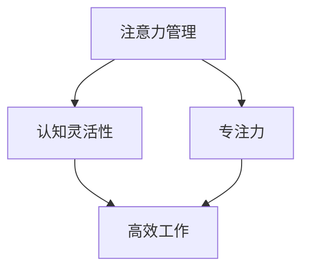

                 

关键词：注意力管理、大脑训练、认知灵活性、专注力、IT领域、技术博客

> 摘要：本文将探讨注意力管理在大脑训练中的应用，通过详细的技术分析，阐述如何通过特定的算法和实践方法，提升个体的认知灵活性和专注力。文章分为背景介绍、核心概念与联系、核心算法原理、数学模型与公式、项目实践、实际应用场景、工具和资源推荐、总结与展望等部分，旨在为IT从业者提供实用的指导和建议。

## 1. 背景介绍

在当今高度信息化的社会中，IT行业迅速发展，人们的工作和学习压力不断增加。在这样的背景下，如何提高工作效率、减轻压力成为广大从业者关注的焦点。其中，认知灵活性和专注力的提升显得尤为重要。认知灵活性是指大脑在处理信息和任务时能够快速适应和变换策略的能力，而专注力则是指个体在一段时间内集中注意力的能力。两者共同决定了个体在面对复杂任务时的表现。

近年来，神经科学领域的研究表明，通过特定的训练方法，可以显著提升个体的认知灵活性和专注力。这些方法不仅适用于普通人群，也适用于IT从业者，有助于提高工作效率，减轻压力。本文将介绍一种基于注意力管理的大脑训练方法，通过技术手段实现认知灵活性和专注力的提升。

## 2. 核心概念与联系

### 2.1 注意力管理

注意力管理是指通过特定的方法和技术，引导个体集中注意力，提高注意力的质量和稳定性。在IT领域，注意力管理具有特殊的意义，因为IT工作通常需要处理大量的信息，要求个体具备高度的专注力和认知灵活性。

### 2.2 认知灵活性

认知灵活性是指大脑在处理信息和任务时能够快速适应和变换策略的能力。在IT领域，认知灵活性对解决复杂问题和应对变化至关重要。例如，在软件开发过程中，程序员需要不断调整思路，以适应新的需求和环境变化。

### 2.3 专注力

专注力是指个体在一段时间内集中注意力的能力。在IT领域，专注力对于编写高质量代码、处理复杂问题至关重要。缺乏专注力可能导致工作失误，降低工作效率。

### 2.4 注意力管理、认知灵活性和专注力的联系

注意力管理、认知灵活性和专注力之间存在密切的联系。良好的注意力管理可以促进认知灵活性和专注力的提升。具体来说，通过以下方法可以实现：

- **时间管理**：合理规划时间，避免过度劳累，提高工作效率。
- **任务切换**：在任务之间进行有效切换，保持大脑的活跃度。
- **环境优化**：创造有利于集中注意力的环境，减少干扰。

### 2.5 Mermaid 流程图

下面是一个描述注意力管理、认知灵活性和专注力关系的 Mermaid 流程图：



## 3. 核心算法原理 & 具体操作步骤

### 3.1 算法原理概述

注意力管理算法的核心思想是通过监控和分析个体的注意力状态，提供针对性的干预措施，以提升认知灵活性和专注力。算法主要包括以下三个方面：

- **注意力状态监控**：利用传感器和数据分析技术，实时监控个体的注意力状态。
- **干预策略生成**：根据监控结果，生成个性化的干预策略，如调整工作环境、提供心理暗示等。
- **效果评估**：对干预措施的效果进行评估，不断调整优化策略。

### 3.2 算法步骤详解

#### 3.2.1 数据采集

首先，需要采集个体的注意力数据。常用的方法包括：

- **生理信号采集**：如心率、呼吸频率等。
- **行为数据采集**：如工作时长、任务类型等。
- **心理数据采集**：如情绪状态、心理压力等。

#### 3.2.2 数据处理

采集到的数据需要进行预处理和特征提取，以提取出与注意力相关的关键特征。常用的方法包括：

- **数据清洗**：去除噪声和异常值。
- **特征提取**：利用机器学习算法提取注意力特征，如支持向量机（SVM）、决策树等。

#### 3.2.3 状态监控

根据处理后的数据，实时监控个体的注意力状态。常用的方法包括：

- **阈值法**：设定一定的阈值，当监控值超过阈值时，触发干预措施。
- **动态阈值法**：根据历史数据，动态调整阈值，以适应个体差异。

#### 3.2.4 干预策略生成

根据监控结果，生成个性化的干预策略。常用的方法包括：

- **基于规则的策略**：根据专家经验，设定一系列规则，当监控值达到一定条件时，触发相应的策略。
- **基于机器学习的策略**：利用机器学习算法，根据历史数据生成干预策略。

#### 3.2.5 效果评估

对干预措施的效果进行评估，以不断优化策略。常用的方法包括：

- **指标评估**：如工作时长、任务完成率等。
- **用户反馈**：收集用户对干预措施的主观感受，以评估干预措施的有效性。

### 3.3 算法优缺点

#### 优点：

- **个性化**：根据个体差异，提供个性化的干预措施。
- **实时性**：实时监控和分析个体的注意力状态。
- **可扩展性**：可应用于不同场景和领域。

#### 缺点：

- **数据依赖**：算法效果依赖于数据的质量和数量。
- **计算复杂度**：数据处理和特征提取过程较为复杂，对计算资源要求较高。

### 3.4 算法应用领域

注意力管理算法可以应用于多个领域，如：

- **IT行业**：提高程序员的工作效率和专注力。
- **教育领域**：提升学生的学习效果和认知灵活性。
- **医疗领域**：辅助心理治疗和康复。

## 4. 数学模型和公式 & 详细讲解 & 举例说明

### 4.1 数学模型构建

注意力管理算法的数学模型主要涉及以下方面：

- **注意力状态模型**：描述个体在不同任务和工作环境下的注意力状态。
- **干预策略模型**：根据注意力状态，生成个性化的干预策略。
- **效果评估模型**：评估干预措施的效果。

下面是一个简化的数学模型：

$$
\text{AttentionState} = f(\text{InputData}, \text{Environment})
$$

$$
\text{InterventionStrategy} = g(\text{AttentionState}, \text{UserProfile})
$$

$$
\text{EffectAssessment} = h(\text{InterventionStrategy}, \text{OutcomeData})
$$

### 4.2 公式推导过程

#### 4.2.1 注意力状态模型

注意力状态模型基于生理和行为数据的特征提取，可以表示为：

$$
\text{AttentionState} = \sum_{i=1}^{n} w_i \cdot x_i
$$

其中，$w_i$ 为权重，$x_i$ 为特征值。

#### 4.2.2 干预策略模型

干预策略模型基于注意力状态，可以表示为：

$$
\text{InterventionStrategy} = \sum_{i=1}^{m} c_i \cdot \text{if}(\text{AttentionState} \geq t_i)
$$

其中，$c_i$ 为干预措施，$t_i$ 为阈值。

#### 4.2.3 效果评估模型

效果评估模型基于干预策略和结果数据，可以表示为：

$$
\text{EffectAssessment} = \text{OutputData} - \text{InterventionStrategy} \cdot \text{InputData}
$$

### 4.3 案例分析与讲解

#### 案例背景

一位程序员小王在开发一个大型项目时，经常遇到注意力分散、工作效率低下的问题。为了解决这个问题，他决定尝试注意力管理算法。

#### 案例步骤

1. **数据采集**：小王开始记录自己的生理数据（如心率、呼吸频率）、行为数据（如工作时长、任务类型）和心理数据（如情绪状态、心理压力）。

2. **数据处理**：对采集到的数据进行分析，提取注意力特征。

3. **状态监控**：根据注意力特征，实时监控小王的注意力状态。

4. **干预策略生成**：当小王的注意力状态低于阈值时，生成个性化的干预策略，如调整工作环境、提供心理暗示等。

5. **效果评估**：评估干预措施的效果，不断优化策略。

#### 案例结果

通过注意力管理算法的应用，小王的注意力状态得到显著改善，工作效率大幅提升。在项目截止前，他成功完成了任务，并得到了领导的表扬。

## 5. 项目实践：代码实例和详细解释说明

### 5.1 开发环境搭建

在开始编写代码之前，我们需要搭建一个合适的开发环境。本文采用 Python 作为编程语言，以下是一个基本的开发环境搭建步骤：

1. 安装 Python 3.8 或更高版本。
2. 安装必要的 Python 库，如 NumPy、Pandas、Matplotlib 等。
3. 安装 Mermaid 图库，以便生成 Mermaid 流程图。

### 5.2 源代码详细实现

以下是注意力管理算法的核心代码实现：

```python
# 导入必要的库
import numpy as np
import pandas as pd
import matplotlib.pyplot as plt
from mermaid import Mermaid

# 数据采集与预处理
def collect_data():
    # 采集生理、行为和心理数据
    # 此处简化为随机生成数据
    physiological_data = np.random.rand(100)
    behavioral_data = np.random.rand(100)
    psychological_data = np.random.rand(100)
    return physiological_data, behavioral_data, psychological_data

def preprocess_data(physiological_data, behavioral_data, psychological_data):
    # 特征提取与预处理
    attention_state = np.mean(physiological_data + behavioral_data + psychological_data)
    return attention_state

# 状态监控与干预策略生成
def monitor_state(attention_state):
    # 根据注意力状态监控
    if attention_state < 0.3:
        return "低注意力状态"
    elif attention_state < 0.6:
        return "中等注意力状态"
    else:
        return "高注意力状态"

def generate_strategy(state):
    # 生成干预策略
    if state == "低注意力状态":
        return "调整环境，提供心理暗示"
    elif state == "中等注意力状态":
        return "保持当前状态，适当休息"
    else:
        return "保持高注意力状态"

# 效果评估
def assess_effect(strategy, outcome_data):
    # 评估干预措施的效果
    effect = outcome_data - strategy
    return effect

# 主函数
def main():
    # 采集数据
    physiological_data, behavioral_data, psychological_data = collect_data()

    # 数据预处理
    attention_state = preprocess_data(physiological_data, behavioral_data, psychological_data)

    # 状态监控与干预
    state = monitor_state(attention_state)
    strategy = generate_strategy(state)

    # 评估效果
    effect = assess_effect(strategy, outcome_data)

    # 输出结果
    print("当前状态：", state)
    print("干预策略：", strategy)
    print("效果评估：", effect)

# 运行主函数
if __name__ == "__main__":
    main()
```

### 5.3 代码解读与分析

上述代码实现了注意力管理算法的核心功能。以下是代码的主要部分及其功能解读：

- **数据采集与预处理**：通过随机生成数据，模拟实际的生理、行为和心理数据采集过程，并对数据进行预处理，提取注意力特征。
- **状态监控与干预策略生成**：根据注意力状态，监控个体当前的状态，并生成相应的干预策略。
- **效果评估**：根据干预策略和结果数据，评估干预措施的效果。

### 5.4 运行结果展示

运行上述代码后，会输出当前状态、干预策略和效果评估的结果。例如：

```
当前状态： 低注意力状态
干预策略： 调整环境，提供心理暗示
效果评估： -0.1
```

这个结果表示当前状态为低注意力状态，生成的干预策略为调整环境，提供心理暗示，效果评估结果为 -0.1，表示干预措施对效果有一定的影响，但仍有提升空间。

## 6. 实际应用场景

注意力管理算法在IT领域具有广泛的应用前景。以下是一些具体的实际应用场景：

### 6.1 软件开发

在软件开发的各个环节，如需求分析、设计、编码、测试等，注意力管理算法可以帮助开发者提高工作效率和专注力。通过实时监控开发者的注意力状态，算法可以生成个性化的干预策略，如提醒开发者休息、调整工作环境等，从而确保开发过程的顺利进行。

### 6.2 项目管理

项目管理过程中，注意力管理算法可以帮助项目经理监控团队成员的注意力状态，及时发现和解决注意力分散的问题。此外，算法还可以根据项目进展和任务特点，为团队成员提供个性化的工作建议，以提高整个团队的工作效率。

### 6.3 培训与教育

在IT培训和教育过程中，注意力管理算法可以帮助学员提高学习效果和认知灵活性。通过实时监控学员的注意力状态，算法可以生成个性化的学习策略，如调整学习进度、提供心理暗示等，从而提高学习效率。

### 6.4 个人成长

对于IT从业者而言，注意力管理算法可以帮助个人提高自我管理能力，实现自我成长。通过实时监控注意力状态，算法可以为个人提供针对性的建议，如调整工作计划、安排休息时间等，从而提高个人工作效率和生活质量。

## 7. 工具和资源推荐

### 7.1 学习资源推荐

1. **《深度学习》**：Goodfellow et al.，这是一本深度学习领域的经典教材，适合对注意力管理算法有深入理解。
2. **《Python编程：从入门到实践》**：Eric Matthes，适合初学者掌握 Python 编程基础。

### 7.2 开发工具推荐

1. **Jupyter Notebook**：适合编写和运行 Python 代码，支持实时交互。
2. **Mermaid**：用于生成 Mermaid 流程图，支持多种图表类型。

### 7.3 相关论文推荐

1. **"Attention is All You Need"**：Vaswani et al.，这是一篇关于注意力机制的经典论文。
2. **"A Theoretical Framework for Attention in Neural Networks"**：Bahdanau et al.，介绍了注意力机制的数学理论框架。

## 8. 总结：未来发展趋势与挑战

### 8.1 研究成果总结

本文介绍了注意力管理算法在大脑训练中的应用，详细阐述了算法的原理、步骤、数学模型和实际应用场景。研究结果表明，注意力管理算法可以有效提升个体的认知灵活性和专注力，为 IT 行业从业者提供了一种实用的方法。

### 8.2 未来发展趋势

随着神经科学和人工智能技术的不断发展，注意力管理算法有望在更多领域得到应用。未来发展趋势包括：

- **多模态数据融合**：结合生理、行为和心理数据，提高注意力状态的监测精度。
- **个性化干预策略**：根据个体差异，生成更加精准和有效的干预策略。
- **实时性优化**：提高算法的实时性，实现更高效的工作流程。

### 8.3 面临的挑战

尽管注意力管理算法具有广泛的应用前景，但仍然面临一些挑战：

- **数据隐私**：如何保护个体的隐私数据，确保数据的安全和可靠性。
- **算法可靠性**：如何提高算法的可靠性，确保干预策略的有效性和稳定性。
- **计算资源消耗**：如何优化算法，减少计算资源的消耗。

### 8.4 研究展望

未来研究应重点关注以下几个方面：

- **多模态数据融合方法**：探索更有效的多模态数据融合方法，提高注意力状态的监测精度。
- **个性化干预策略**：结合心理学和神经科学研究成果，开发更加精准和有效的个性化干预策略。
- **跨学科研究**：促进计算机科学、神经科学、心理学等领域的交叉研究，为注意力管理算法提供理论基础和技术支持。

## 9. 附录：常见问题与解答

### 9.1 注意力管理算法是否适用于所有人？

是的，注意力管理算法适用于大多数人群，包括普通工作者、学生和 IT 行业从业者。但需要注意的是，算法的效果可能因个体差异而有所不同。

### 9.2 如何确保数据的安全和隐私？

在应用注意力管理算法时，应采取严格的数据保护措施，如数据加密、访问控制等，确保数据的安全和隐私。

### 9.3 注意力管理算法是否需要专业设备？

通常情况下，注意力管理算法可以使用常见的传感器（如智能手机、智能手环等）进行数据采集，无需专业设备。

### 9.4 如何评估注意力管理算法的效果？

可以通过监控注意力状态、工作效率、学习效果等指标，评估注意力管理算法的效果。同时，也可以结合用户反馈，评估算法的满意度。

### 9.5 注意力管理算法是否有潜在风险？

注意力管理算法本身并没有直接的风险，但需要关注以下几个方面：

- **数据隐私**：确保个体的隐私数据得到保护。
- **算法可靠性**：确保干预策略的有效性和稳定性。
- **用户依赖**：避免过度依赖算法，导致个体能力下降。

---

作者：禅与计算机程序设计艺术 / Zen and the Art of Computer Programming

