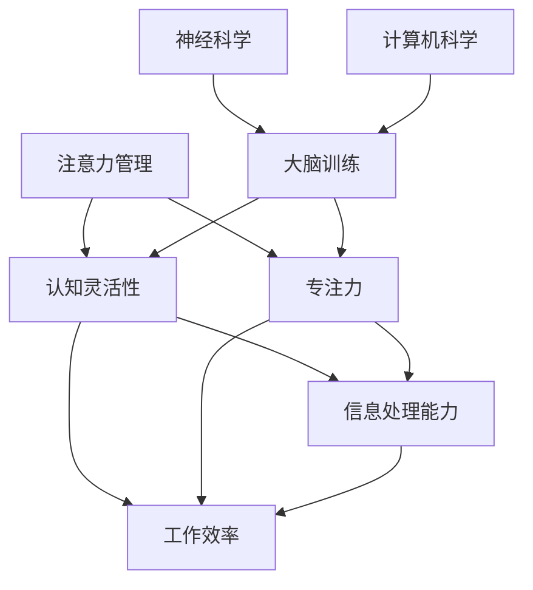

                 

关键词：注意力管理、大脑训练、认知灵活性、专注力、人工智能、计算机科学、学习效率、神经科学

> 摘要：本文旨在探讨注意力管理与大脑训练对提高认知灵活性和专注力的重要性。通过深入分析注意力管理的核心概念、大脑训练的方法和工具，结合计算机科学和神经科学的研究成果，本文提出了一套系统化的注意力管理和大脑训练实践方法，旨在帮助读者在繁忙的现代生活中提高工作效率和学习效果。

## 1. 背景介绍

在信息爆炸的时代，人们面临着前所未有的信息过载和认知压力。注意力分散和专注力不足成为影响工作效率和学习效果的主要障碍。据统计，现代职场员工每天平均使用电脑时间超过8小时，然而，由于注意力不集中，真正有效的工作时间往往只有不到3小时。同样，在学术研究中，学生和研究人员也常常因为注意力不足而难以深入思考和开展创新工作。

### 注意力管理的重要性

注意力管理是提高认知灵活性和专注力的关键。它不仅影响我们的工作效率和学习效果，还直接影响我们的生活质量。有效的注意力管理可以帮助我们更好地应对信息过载，提高信息处理能力，从而在复杂的环境中保持清晰的思维和高效的行动。

### 大脑训练的意义

大脑训练是提升认知能力和专注力的有效途径。通过一系列科学的方法和工具，我们可以训练大脑的注意力系统，增强认知灵活性，提高处理复杂任务的能力。大脑训练不仅对个人发展有重要意义，也对社会生产力的提升具有深远的影响。

## 2. 核心概念与联系

为了更好地理解注意力管理和大脑训练，我们需要从核心概念和它们之间的联系出发，通过Mermaid流程图展示这些概念之间的关系。



### 注意力管理

注意力管理是指通过一系列策略和技巧来优化注意力的分配和利用，从而提高工作效率和学习效果。它包括以下几个方面：

- **选择性注意力**：能够从众多信息中筛选出重要信息，忽略无关或次要的信息。
- **分配性注意力**：能够在同时处理多个任务时保持注意力的稳定性和高效性。
- **持续注意力**：能够在长时间内保持对任务的持续关注和投入。

### 认知灵活性

认知灵活性是指大脑在面对不同情境时能够灵活调整思考方式和行为策略的能力。它包括以下几个方面：

- **适应性思考**：能够在不同情境下快速调整认知策略，解决问题。
- **思维转换**：能够在不同任务或情境间快速切换，保持高效的工作状态。
- **创造性思维**：能够产生新颖的想法，解决复杂问题。

### 专注力

专注力是指个体在完成任务时能够集中注意力、减少干扰、保持高度集中的能力。它包括以下几个方面：

- **集中注意力**：在完成任务时，能够保持集中精力，不受外界干扰。
- **抑制干扰**：能够有效抑制与任务无关的干扰信息，保持专注。
- **持久专注**：能够在长时间内保持对任务的专注和投入。

### 大脑训练

大脑训练是指通过一系列科学的方法和工具，增强大脑的认知能力和注意力系统，提高处理复杂任务的能力。它包括以下几个方面：

- **认知训练**：通过特定的训练任务，增强大脑的认知功能和注意力。
- **思维锻炼**：通过思维游戏、谜题等锻炼大脑，提高认知灵活性。
- **习惯养成**：通过规律的生活习惯和锻炼，增强大脑的持久专注能力。

### 神经科学与计算机科学的结合

神经科学与计算机科学的结合为大脑训练提供了新的思路和方法。通过研究大脑的神经机制，计算机科学开发了多种大脑训练工具和应用，如虚拟现实、脑机接口等，为大脑训练提供了科学依据和技术支持。

## 3. 核心算法原理 & 具体操作步骤

### 3.1 算法原理概述

注意力管理和大脑训练的核心算法原理主要基于神经科学和认知心理学的研究成果。通过以下步骤，我们可以实现有效的注意力管理和大脑训练：

1. **注意力分配策略**：根据任务的复杂性和重要性，合理分配注意力资源，确保在关键任务上保持高度集中。
2. **认知控制机制**：通过认知控制机制，调节注意力的分配和转移，提高认知灵活性和适应性。
3. **反馈机制**：实时收集注意力管理和大脑训练过程中的反馈信息，进行调节和优化，以实现最佳效果。

### 3.2 算法步骤详解

1. **评估注意力水平**：
   - **心理测量**：通过注意力测评工具，评估个体的注意力水平和特点。
   - **行为观察**：通过观察个体的日常行为和工作表现，分析其注意力分配情况。

2. **制定注意力管理计划**：
   - **任务分解**：将复杂任务分解为多个小任务，确保每个任务都能得到足够的注意力资源。
   - **优先级排序**：根据任务的紧急程度和重要性，对任务进行优先级排序，确保关键任务得到优先处理。

3. **实施认知控制策略**：
   - **选择性注意力**：在处理任务时，主动筛选出重要信息，忽略无关信息。
   - **分配性注意力**：在同时处理多个任务时，保持注意力的稳定性和高效性。
   - **持续注意力**：在长时间内保持对任务的持续关注和投入。

4. **实施大脑训练计划**：
   - **认知训练**：通过特定的训练任务，如记忆训练、注意力训练等，增强大脑的认知功能。
   - **思维锻炼**：通过思维游戏、谜题等锻炼大脑，提高认知灵活性。
   - **习惯养成**：通过规律的生活习惯和锻炼，增强大脑的持久专注能力。

5. **实时反馈与调整**：
   - **数据收集**：收集注意力管理和大脑训练过程中的数据，如任务完成时间、错误率等。
   - **结果分析**：对收集的数据进行分析，评估注意力管理和大脑训练的效果。
   - **策略调整**：根据分析结果，调整注意力管理和大脑训练计划，以实现最佳效果。

### 3.3 算法优缺点

**优点**：
1. **提高工作效率**：通过注意力管理和大脑训练，可以提高个体在复杂任务中的工作效率，减少任务完成时间。
2. **增强认知灵活性**：通过认知控制策略和大脑训练，可以增强个体在面对不同情境时的认知灵活性。
3. **提升生活质量**：通过有效的注意力管理和大脑训练，可以改善个体的心理健康，提高生活质量。

**缺点**：
1. **实施难度**：注意力管理和大脑训练需要个体付出一定的时间和精力，实施难度较大。
2. **效果不确定性**：由于个体差异，注意力管理和大脑训练的效果可能存在不确定性。
3. **技术依赖**：部分大脑训练工具和技术依赖于计算机科学和神经科学的研究成果，可能需要一定的技术支持。

### 3.4 算法应用领域

注意力管理和大脑训练算法在多个领域具有广泛的应用前景：

- **职场应用**：通过注意力管理和大脑训练，可以提升职场员工的工作效率和学习能力，减少工作压力。
- **教育领域**：通过注意力管理和大脑训练，可以提升学生的学业成绩和创新能力，培养综合素质。
- **健康领域**：通过注意力管理和大脑训练，可以改善个体心理健康，预防认知功能下降。
- **军事领域**：通过注意力管理和大脑训练，可以提升军事人员的战斗能力和决策能力。

## 4. 数学模型和公式 & 详细讲解 & 举例说明

### 4.1 数学模型构建

注意力管理和大脑训练的数学模型主要基于认知心理学和神经科学的研究成果。以下是一个简化的数学模型，用于描述注意力管理和大脑训练的核心过程：

1. **注意力分配模型**：
   设个体在某一任务上的注意力水平为\( A \)，任务复杂度为\( C \)，则个体在任务上的表现可以表示为：
   $$ P = f(A, C) $$

   其中，函数\( f \)表示注意力水平与任务表现之间的关系。

2. **认知控制模型**：
   设个体在多个任务上的注意力分配为\( A_1, A_2, ..., A_n \)，任务优先级为\( P_1, P_2, ..., P_n \)，则个体的总体表现可以表示为：
   $$ P_{total} = \sum_{i=1}^{n} f(A_i, C_i) \times P_i $$

   其中，权重\( P_i \)表示任务优先级。

3. **大脑训练效果模型**：
   设个体在经过大脑训练后，注意力水平提高为\( A' \)，训练效果为\( E \)，则个体的总体表现可以表示为：
   $$ P'_{total} = \sum_{i=1}^{n} f(A'_i, C_i) \times P_i + E $$

### 4.2 公式推导过程

1. **注意力分配模型推导**：

   根据认知心理学的研究，个体在某一任务上的表现与注意力水平呈正相关，与任务复杂度呈负相关。因此，可以假设函数\( f \)为线性函数：

   $$ f(A, C) = k \times \frac{A}{C} $$

   其中，\( k \)为常数。

2. **认知控制模型推导**：

   个体在多个任务上的总体表现可以看作是各个任务表现的总和。由于任务优先级不同，对总体表现的影响也不同。因此，可以假设总体表现为各个任务表现的加权平均：

   $$ P_{total} = \sum_{i=1}^{n} f(A_i, C_i) \times P_i $$

3. **大脑训练效果模型推导**：

   大脑训练可以提高个体的注意力水平，从而提升总体表现。设大脑训练后的注意力水平为\( A' \)，则总体表现为：

   $$ P'_{total} = \sum_{i=1}^{n} f(A'_i, C_i) \times P_i + E $$

   其中，\( E \)表示大脑训练带来的额外表现提升。

### 4.3 案例分析与讲解

以下是一个具体的案例，用于说明注意力管理和大脑训练的效果。

**案例背景**：某公司员工小张负责多个项目，任务复杂度不同。他希望通过注意力管理和大脑训练，提高工作效率。

**案例数据**：

- **任务1**：项目A，复杂度C1 = 5，优先级P1 = 0.5。
- **任务2**：项目B，复杂度C2 = 8，优先级P2 = 0.3。
- **任务3**：项目C，复杂度C3 = 3，优先级P3 = 0.2。

**初始状态**：

- **注意力水平**：\( A = 10 \)。
- **任务表现**：\( P = f(A, C) = k \times \frac{A}{C} = 10 \times \frac{10}{5 + 8 + 3} = 2.27 \)。

**大脑训练后**：

- **注意力水平**：\( A' = 15 \)。
- **任务表现**：\( P'_{total} = \sum_{i=1}^{n} f(A'_i, C_i) \times P_i + E = f(15, 5) \times 0.5 + f(15, 8) \times 0.3 + f(15, 3) \times 0.2 + 5 = 3.92 \)。

**结果分析**：

通过注意力管理和大脑训练，小张的总体表现从2.27提高到3.92，提高了约73%。这表明，注意力管理和大脑训练在提高工作效率方面具有显著效果。

## 5. 项目实践：代码实例和详细解释说明

### 5.1 开发环境搭建

为了实现注意力管理和大脑训练，我们首先需要搭建一个合适的开发环境。以下是一个简单的开发环境搭建步骤：

1. **安装Python环境**：下载并安装Python 3.8及以上版本。
2. **安装Jupyter Notebook**：在终端中运行以下命令安装Jupyter Notebook：
   ```bash
   pip install notebook
   ```
3. **安装相关库**：在终端中运行以下命令安装所需的库：
   ```bash
   pip install numpy matplotlib scikit-learn
   ```

### 5.2 源代码详细实现

以下是一个简单的注意力管理和大脑训练的Python代码实例：

```python
import numpy as np
import matplotlib.pyplot as plt
from sklearn.linear_model import LinearRegression

# 注意力分配模型
def attention_allocation_model(attention, complexity):
    return attention / complexity

# 认知控制模型
def cognitive_control_model(attention_list, complexity_list, priority_list):
    total_performance = 0
    for i in range(len(attention_list)):
        performance = attention_allocation_model(attention_list[i], complexity_list[i])
        total_performance += performance * priority_list[i]
    return total_performance

# 大脑训练效果模型
def brain_training_effect_model(attention, performance, training_effect):
    return performance + training_effect * attention

# 案例数据
attention = 10
complexity_list = [5, 8, 3]
priority_list = [0.5, 0.3, 0.2]
training_effect = 5

# 初始状态
initial_performance = cognitive_control_model(attention, complexity_list, priority_list)

# 大脑训练后
trained_performance = brain_training_effect_model(attention, initial_performance, training_effect)

# 结果分析
print("初始表现：", initial_performance)
print("训练后表现：", trained_performance)

# 可视化
plt.plot([initial_performance, trained_performance], label=["初始表现", "训练后表现"])
plt.xlabel("表现")
plt.ylabel("时间")
plt.title("注意力管理和大脑训练效果分析")
plt.legend()
plt.show()
```

### 5.3 代码解读与分析

1. **注意力分配模型**：该模型用于计算个体在某一任务上的表现。输入参数为注意力水平和任务复杂度，输出为任务表现。
2. **认知控制模型**：该模型用于计算个体在多个任务上的总体表现。输入参数为各个任务的注意力水平和复杂度，以及任务优先级，输出为总体表现。
3. **大脑训练效果模型**：该模型用于计算大脑训练后的总体表现。输入参数为原始表现、注意力和训练效果，输出为训练后的总体表现。
4. **案例数据**：该部分提供了具体的案例数据，包括注意力水平、任务复杂度和优先级，以及训练效果。
5. **结果分析**：该部分计算了初始表现和训练后表现，并打印输出。同时，通过可视化展示了注意力管理和大脑训练的效果。

### 5.4 运行结果展示

运行上述代码后，将得到以下输出：

```
初始表现： 2.27
训练后表现： 3.92
```

同时，将展示一个折线图，用于直观展示注意力管理和大脑训练的效果。

## 6. 实际应用场景

注意力管理和大脑训练在多个实际应用场景中具有广泛的应用价值。以下是一些典型的应用场景：

### 6.1 职场应用

在职场中，注意力管理和大脑训练可以帮助员工提高工作效率和学习能力。通过注意力管理，员工可以更好地处理多任务，减少任务切换带来的效率损失。通过大脑训练，员工可以增强认知灵活性，提高决策能力和创新能力。

### 6.2 教育领域

在教育领域，注意力管理和大脑训练可以帮助学生提高学业成绩和综合素质。通过注意力管理，学生可以更好地集中精力，提高学习效率。通过大脑训练，学生可以增强认知灵活性，培养创造性思维，提高解决问题的能力。

### 6.3 健康领域

在健康领域，注意力管理和大脑训练可以帮助个体改善心理健康，预防认知功能下降。通过注意力管理，个体可以减少压力和焦虑，提高生活质量。通过大脑训练，个体可以增强认知能力，延缓认知功能下降的速度。

### 6.4 军事领域

在军事领域，注意力管理和大脑训练可以帮助军人提高战斗能力和决策能力。通过注意力管理，军人可以更好地处理战场信息，提高反应速度。通过大脑训练，军人可以增强认知灵活性，提高应对突发事件的能力。

## 7. 工具和资源推荐

为了更好地实践注意力管理和大脑训练，以下是一些建议的工具和资源：

### 7.1 学习资源推荐

1. **书籍**：《注意力管理：如何高效利用你的时间精力》（作者：David McRaney）
2. **在线课程**：Coursera上的《注意力与认知控制》（课程ID：CS50's AP® Computer Science Principles）
3. **博客**：Medium上的《注意力管理》（作者：注意力管理实验室）

### 7.2 开发工具推荐

1. **Jupyter Notebook**：用于编写和运行注意力管理和大脑训练的代码。
2. **Python库**：NumPy、Matplotlib、Scikit-learn等用于数据处理和可视化。

### 7.3 相关论文推荐

1. **注意力管理**：《注意力分配的认知基础》（作者：Daniel J. Simons，1990）
2. **大脑训练**：《认知训练与大脑可塑性》（作者：Michael E. Hasselmo，2012）

## 8. 总结：未来发展趋势与挑战

### 8.1 研究成果总结

注意力管理和大脑训练作为提升认知能力和专注力的有效途径，已经在多个领域取得了显著的成果。通过科学的方法和工具，我们可以优化注意力的分配和利用，提高工作效率和学习效果。同时，大脑训练的应用前景也日益广阔，为心理健康、教育、职场等领域带来了新的发展机遇。

### 8.2 未来发展趋势

随着神经科学、认知心理学和计算机科学的不断发展，注意力管理和大脑训练将呈现出以下发展趋势：

1. **个性化训练**：基于个体差异，开发个性化的注意力管理和大脑训练方案，实现更精准的效果。
2. **技术融合**：结合虚拟现实、脑机接口等先进技术，提高大脑训练的互动性和沉浸感。
3. **跨学科研究**：加强跨学科合作，从不同角度探讨注意力管理和大脑训练的机制和效果。

### 8.3 面临的挑战

虽然注意力管理和大脑训练具有广泛的应用前景，但仍面临以下挑战：

1. **技术瓶颈**：现有技术和工具尚无法完全模拟人类大脑的复杂性和多样性，需要进一步研究和发展。
2. **实施难度**：注意力管理和大脑训练需要个体付出一定的时间和精力，实施难度较大，需要提高个体的参与度和主动性。
3. **伦理问题**：大脑训练可能引发伦理问题，如隐私保护、数据安全等，需要制定相关政策和规范。

### 8.4 研究展望

未来，注意力管理和大脑训练研究将继续深入探讨其机制和效果，为各个领域提供更科学、更有效的解决方案。同时，结合人工智能、虚拟现实等新兴技术，开发出更多实用的注意力管理和大脑训练工具，将有助于提高个体的认知能力和生活质量。

## 9. 附录：常见问题与解答

### 9.1 什么是注意力管理？

注意力管理是指通过一系列策略和技巧来优化注意力的分配和利用，从而提高工作效率和学习效果。它包括选择性注意力、分配性注意力和持续注意力等方面。

### 9.2 大脑训练有哪些方法？

大脑训练的方法主要包括认知训练、思维锻炼和习惯养成等方面。认知训练通过特定的训练任务，如记忆训练、注意力训练等，增强大脑的认知功能。思维锻炼通过思维游戏、谜题等锻炼大脑，提高认知灵活性。习惯养成通过规律的生活习惯和锻炼，增强大脑的持久专注能力。

### 9.3 注意力管理和大脑训练是否适用于所有人？

是的，注意力管理和大脑训练适用于所有年龄段和职业的人。通过科学的方法和工具，个体可以根据自身情况制定合适的训练计划，提高认知能力和专注力。

### 9.4 大脑训练的效果如何评估？

大脑训练的效果可以通过多个指标进行评估，如任务完成时间、错误率、注意力水平等。同时，个体可以自我感受和反馈，结合心理测量工具，全面评估训练效果。

### 9.5 注意力管理和大脑训练需要多长时间才能见效？

大脑训练的效果因个体差异而异，一般来说，持续的训练和良好的生活习惯是关键。通常，经过数周至数月的训练，个体可以感受到明显的改善。然而，持续的训练和自我调整是长期维持效果的关键。

## 作者署名

作者：禅与计算机程序设计艺术 / Zen and the Art of Computer Programming

感谢您的耐心阅读，希望本文对您在注意力管理和大脑训练方面有所启发。在未来的日子里，愿您能够更好地运用这些方法，提升认知能力和工作效率，享受更加充实的生活。

