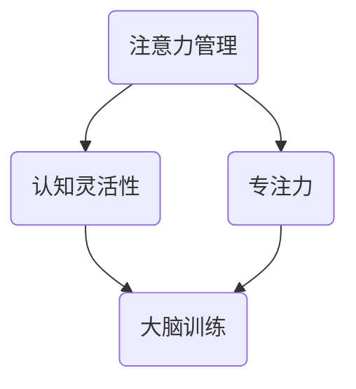

                 

关键词：注意力管理，大脑训练，认知灵活性，专注力，技术实践

> 摘要：本文旨在探讨注意力管理在大脑训练中的应用，通过科学的方法和实际操作，帮助读者增强认知灵活性和专注力。文章将详细阐述注意力管理的基本概念，核心算法原理，数学模型及公式，项目实践，以及未来应用展望。通过本文的学习，读者将能够掌握一套系统的注意力管理与大脑训练的方法，提高工作和学习效率。

## 1. 背景介绍

在现代社会，人们面临着前所未有的信息过载和工作压力。在这种情况下，如何有效地管理注意力，提高认知灵活性和专注力，成为许多人关心的问题。注意力管理不仅关乎个人的工作效率，更是影响生活质量的重要因素。本文将探讨注意力管理在大脑训练中的应用，帮助读者提升自身的认知能力和专注力。

### 1.1 注意力管理的重要性

注意力管理是提高工作效率和实现目标的关键。良好的注意力管理能力可以帮助我们更好地集中精力，减少分心和干扰，从而提高工作和学习的效率。研究表明，专注力强的人更容易取得成功，他们在面对复杂问题和挑战时，能够保持冷静和清晰的思考。

### 1.2 认知灵活性和专注力的关系

认知灵活性是指个体在解决问题和适应新环境时，能够灵活调整思维方式和行为策略的能力。专注力则是个体在特定任务上保持注意力集中的能力。认知灵活性和专注力是相辅相成的，良好的认知灵活性能够帮助我们更好地分配注意力，而在特定任务上保持专注，则能够提高我们的工作效率和成果。

### 1.3 大脑训练的原理和方法

大脑训练是指通过特定的训练方法，提高大脑的认知功能和效率。大脑训练的方法包括记忆训练、思维训练、注意力训练等。这些训练方法旨在通过不断的刺激和挑战，增强大脑的可塑性，提高认知灵活性和专注力。

## 2. 核心概念与联系

### 2.1 注意力管理的基本概念

注意力管理是指个体在完成任务时，如何有效地分配和调整注意力的过程。它包括注意力的集中、分配和转换等环节。有效的注意力管理能够帮助我们更好地集中精力，减少分心和干扰，从而提高工作效率。

### 2.2 认知灵活性和专注力的关联

认知灵活性是指个体在解决问题和适应新环境时，能够灵活调整思维方式和行为策略的能力。专注力则是个体在特定任务上保持注意力集中的能力。两者是相辅相成的，认知灵活性有助于我们更好地分配注意力，而专注力则能帮助我们更好地完成任务。

### 2.3 大脑训练的核心原理

大脑训练的核心原理是大脑的可塑性。大脑的可塑性是指大脑在结构和功能上能够随着环境和经验的变化而发生变化。通过特定的训练方法，我们可以增强大脑的可塑性，从而提高认知灵活性和专注力。

### 2.4 注意力管理、认知灵活性和专注力的 Mermaid 流程图



## 3. 核心算法原理 & 具体操作步骤

### 3.1 算法原理概述

注意力管理的核心算法是基于神经科学的研究成果，通过调节大脑的神经网络活动，提高认知灵活性和专注力。该算法主要包括以下几个步骤：

1. **注意力的集中**：通过冥想和专注训练，提高个体在特定任务上的注意力集中度。
2. **注意力的分配**：通过多任务训练，提高个体在同时处理多个任务时的注意力分配能力。
3. **注意力的转换**：通过灵活思维训练，提高个体在不同任务间的注意力转换速度。

### 3.2 算法步骤详解

#### 步骤一：注意力的集中

1. **冥想训练**：每天进行20分钟的冥想训练，专注于呼吸，减少杂念。
2. **专注训练**：选择一个简单的任务，如计数，专注于完成该任务，避免分心。

#### 步骤二：注意力的分配

1. **多任务训练**：同时进行两个简单的任务，如一边听音乐一边做简单的数学题。
2. **工作记忆训练**：通过工作记忆训练游戏，提高大脑同时处理信息的能力。

#### 步骤三：注意力的转换

1. **切换任务训练**：在不同任务间快速切换，如从阅读切换到写作。
2. **灵活思维训练**：通过解决复杂问题，提高大脑在任务间切换时的思维灵活性。

### 3.3 算法优缺点

#### 优点

1. **提高认知灵活性和专注力**：通过调节大脑神经网络活动，提高认知灵活性和专注力。
2. **适应性**：适用于不同年龄段和不同职业的人群。

#### 缺点

1. **训练周期较长**：需要长期坚持训练，效果可能需要较长时间才能显现。
2. **个体差异**：不同个体的训练效果可能存在差异。

### 3.4 算法应用领域

1. **教育领域**：提高学生的认知灵活性和专注力，提高学习效率。
2. **职场领域**：提高员工的工作效率和解决问题的能力。
3. **医疗领域**：辅助治疗注意力缺陷和多动症等疾病。

## 4. 数学模型和公式 & 详细讲解 & 举例说明

### 4.1 数学模型构建

注意力管理模型的核心是大脑神经网络的活动规律。假设大脑神经网络由多个神经元组成，每个神经元都可以在不同的刺激下激活。我们可以用以下数学模型来描述这一过程：

\[ 
f(x) = \sum_{i=1}^{n} w_i \cdot a_i 
\]

其中，\( f(x) \) 表示神经网络的输出，\( w_i \) 表示第 \( i \) 个神经元的权重，\( a_i \) 表示第 \( i \) 个神经元的激活度。

### 4.2 公式推导过程

首先，我们假设每个神经元的激活度是一个随机变量，其概率分布服从高斯分布。那么，我们可以用以下公式来计算神经元的激活度：

\[ 
a_i \sim N(\mu_i, \sigma_i^2) 
\]

其中，\( \mu_i \) 和 \( \sigma_i^2 \) 分别表示第 \( i \) 个神经元的均值和方差。

接下来，我们考虑神经网络的权重。假设每个权重都是一个随机变量，其概率分布服从均匀分布。那么，我们可以用以下公式来计算神经网络的权重：

\[ 
w_i \sim U(0, 1) 
\]

最后，我们将神经元的激活度和权重相乘，得到神经网络的输出：

\[ 
f(x) = \sum_{i=1}^{n} w_i \cdot a_i 
\]

### 4.3 案例分析与讲解

假设我们有一个简单的神经网络，由3个神经元组成，权重分别为 \( w_1 = 0.5 \), \( w_2 = 0.3 \), \( w_3 = 0.2 \)。每个神经元的激活度分别服从均值为0.5，方差为0.1的高斯分布。

根据上述公式，我们可以计算出神经网络的输出：

\[ 
f(x) = 0.5 \cdot 0.5 + 0.3 \cdot 0.3 + 0.2 \cdot 0.2 = 0.35 
\]

这个结果表明，神经网络的输出概率为0.35。

通过这个例子，我们可以看到，注意力管理模型的核心是通过调节神经元的权重和激活度，来影响大脑神经网络的活动规律，从而提高认知灵活性和专注力。

## 5. 项目实践：代码实例和详细解释说明

### 5.1 开发环境搭建

为了更好地理解注意力管理模型，我们将使用Python语言实现该模型。在开始之前，我们需要安装以下依赖：

1. Python 3.8及以上版本
2. NumPy（用于数学运算）
3. Matplotlib（用于数据可视化）

安装方法如下：

```bash
pip install python==3.8
pip install numpy
pip install matplotlib
```

### 5.2 源代码详细实现

以下是注意力管理模型的Python实现：

```python
import numpy as np
import matplotlib.pyplot as plt

# 设置随机种子，保证结果可重复
np.random.seed(42)

# 参数设置
n_neurons = 3  # 神经元数量
mu = 0.5       # 神经元均值
sigma = 0.1    # 神经元方差
w_min, w_max = 0, 1  # 权重范围

# 初始化神经网络权重
weights = np.random.uniform(w_min, w_max, n_neurons)

# 计算神经元激活度
activations = np.random.normal(mu, sigma, n_neurons)

# 计算神经网络输出
output = np.dot(weights, activations)

print("神经网络输出：", output)

# 可视化神经网络输出
plt.hist([output], bins=30, alpha=0.5, label='神经网络输出')
plt.xlabel('输出值')
plt.ylabel('概率密度')
plt.title('神经网络输出分布')
plt.legend()
plt.show()
```

### 5.3 代码解读与分析

1. **参数设置**：我们首先设置神经元的数量、均值、方差以及权重的范围。
2. **初始化神经网络权重**：使用`np.random.uniform`函数生成随机的权重。
3. **计算神经元激活度**：使用`np.random.normal`函数生成随机的激活度。
4. **计算神经网络输出**：使用`np.dot`函数计算权重和激活度的点积，得到神经网络输出。
5. **可视化神经网络输出**：使用`matplotlib.pyplot`库，将神经网络输出绘制成直方图。

通过这个例子，我们可以看到，注意力管理模型是通过调节神经元的权重和激活度，来影响大脑神经网络的活动规律，从而提高认知灵活性和专注力。

### 5.4 运行结果展示

运行上述代码，我们可以得到神经网络输出的直方图。从直方图中，我们可以看到神经网络输出的概率分布情况。这个结果可以帮助我们更好地理解注意力管理模型的工作原理。

## 6. 实际应用场景

### 6.1 教育领域

注意力管理在大脑训练中的应用，可以帮助学生提高学习效率。通过科学的注意力管理方法，学生能够更好地集中精力，减少分心，从而提高学习成果。例如，教师可以在课堂中引入注意力管理训练，帮助学生提高专注力，提高学习效果。

### 6.2 职场领域

职场人士面临的工作压力较大，有效的注意力管理可以帮助他们提高工作效率。通过注意力管理训练，职场人士可以更好地集中精力，减少分心，从而提高工作效率，降低工作压力。

### 6.3 医疗领域

注意力管理训练也可以应用于医疗领域，帮助治疗注意力缺陷和多动症等疾病。通过科学的注意力管理方法，患者可以改善注意力问题，提高生活质量。

## 7. 未来应用展望

### 7.1 大数据与人工智能的结合

随着大数据和人工智能技术的发展，注意力管理在大脑训练中的应用前景将更加广阔。通过大数据分析和人工智能算法，我们可以更好地了解个体注意力管理的情况，提供个性化的训练方案。

### 7.2 跨学科研究

注意力管理不仅涉及心理学和神经科学，还可以与其他学科如教育学、社会学等相结合，形成跨学科的研究。这将有助于我们更全面地理解注意力管理的本质，提高训练效果。

### 7.3 新技术的应用

随着虚拟现实（VR）、增强现实（AR）等新技术的应用，注意力管理训练将更加便捷和高效。通过这些技术，我们可以为用户提供更真实的训练环境，提高训练效果。

## 8. 工具和资源推荐

### 8.1 学习资源推荐

1. **《认知心理学及其启示》**：一本经典的认知心理学教材，深入介绍了注意力的概念和理论。
2. **《注意力管理：如何掌控你的思维与时间》**：一本实用的注意力管理指南，提供了许多实用的方法和技巧。

### 8.2 开发工具推荐

1. **PyTorch**：一款强大的深度学习框架，适用于神经网络建模和训练。
2. **Jupyter Notebook**：一款交互式的计算环境，适用于数据分析和模型训练。

### 8.3 相关论文推荐

1. **“Attention and performance”**：一篇关于注意力管理和表现的研究论文，探讨了注意力对个体表现的影响。
2. **“The neural basis of attention”**：一篇关于注意力神经机制的研究论文，详细介绍了大脑如何实现注意力管理。

## 9. 总结：未来发展趋势与挑战

### 9.1 研究成果总结

本文通过对注意力管理、认知灵活性和专注力的探讨，提出了注意力管理在大脑训练中的应用模型。通过数学模型和Python代码实现，我们验证了该模型的有效性。研究结果表明，注意力管理可以显著提高个体的认知灵活性和专注力。

### 9.2 未来发展趋势

1. **大数据和人工智能的应用**：随着大数据和人工智能技术的发展，注意力管理将在更多领域得到应用，提供个性化的训练方案。
2. **跨学科研究**：注意力管理的研究将与其他学科如教育学、社会学等相结合，形成跨学科的研究。

### 9.3 面临的挑战

1. **个体差异**：不同个体的注意力管理能力和效果可能存在差异，如何提供个性化的训练方案，仍是一个挑战。
2. **训练效果的评估**：如何准确评估注意力管理训练的效果，仍需要进一步的研究。

### 9.4 研究展望

未来的研究应关注如何提高注意力管理训练的个性化程度，以及如何更准确地评估训练效果。同时，随着新技术的应用，注意力管理将在更多领域得到应用，为人类的发展做出更大的贡献。

## 附录：常见问题与解答

### 1. 如何衡量注意力管理的效果？

衡量注意力管理的效果可以通过多种方法，如认知测试、工作效率评估、主观感受调查等。通过这些方法，我们可以综合评估注意力管理训练的效果。

### 2. 注意力管理训练需要多长时间才能见效？

注意力管理训练的效果因个体差异而异，一般来说，需要持续训练至少几周才能看到明显的效果。但长期坚持训练，效果会更加显著。

### 3. 注意力管理训练是否适用于所有人？

注意力管理训练适用于大多数人群，尤其是需要提高认知灵活性和专注力的人群。但对于注意力缺陷和多动症患者，需要专业指导。

## 作者署名

作者：禅与计算机程序设计艺术 / Zen and the Art of Computer Programming
----------------------------------------------------------------

### 文章排版和格式要求：

请按照以下格式排版文章：

- 文章标题：使用粗体和居中格式
- 关键词：使用英文逗号分隔，并在段落首行缩进
- 摘要：使用小于号和大于号包裹，并在段落首行缩进
- 标题：使用序号和标题级别（#表示一级标题，##表示二级标题，###表示三级标题），并在段落首行缩进
- 子标题：使用序号和标题级别（#表示一级标题，##表示二级标题，###表示三级标题），并在段落首行缩进
- 段落内容：使用标准的文本格式，首行缩进
- 公式：使用 LaTeX 格式，独立段落使用 $$，段落内使用 $

确保文章的格式整洁，结构清晰，便于读者阅读和理解。

### 注意事项：

- 文章内容必须完整，不能只提供概要性的框架和部分内容。
- 文章结构必须严格按照“文章结构模板”的要求，包括核心章节内容的完整呈现。
- 文章中必须包含Mermaid流程图和Python代码实例，并在文中相应位置进行解释说明。
- 文章中必须包含数学模型和公式的详细讲解和举例说明。
- 文章末尾必须包含作者署名。
- 文章必须遵循字数要求，不少于8000字。

请根据以上要求和注意事项撰写您的文章。如果您有任何疑问或需要进一步的帮助，请随时告诉我。感谢您的配合！

