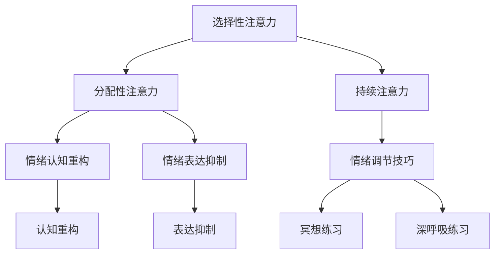

                 

关键词：注意力管理，情绪调节，压力应对，专注力提升，技术策略，心理学原理

> 摘要：本文深入探讨了注意力管理与情绪调节的重要性，特别是在面对高压环境和复杂任务时。通过结合心理学原理和技术策略，本文旨在为读者提供一套行之有效的方法，帮助他们在压力之下保持专注，从而提高工作效率和生活质量。

## 1. 背景介绍

在当今社会，随着信息量的爆炸性增长和工作压力的持续增加，保持专注已成为许多人面临的重要挑战。无论是程序员、工程师、管理者，还是学生，专注力的不足往往会带来严重的负面影响，包括降低工作效率、增加错误率以及影响个人健康。因此，如何有效地管理注意力并调节情绪，成为了亟待解决的重要课题。

本文将结合心理学原理和计算机科学领域的最新研究成果，探讨一系列技术策略和实践方法，帮助读者在高压环境中保持专注，提高自我调节能力，从而更好地应对各种挑战。

## 2. 核心概念与联系

### 2.1 注意力管理原理

注意力是人类认知系统中的重要组成部分，它决定了我们如何处理信息和资源。以下是注意力管理的一些核心概念：

- **选择性注意力（Selective Attention）**：选择性地关注某些信息，同时忽略其他信息。
- **分配性注意力（Divided Attention）**：同时处理多个任务或信息源的能力。
- **持续注意力（Sustained Attention）**：长时间保持关注和集中精力的能力。

### 2.2 情绪调节原理

情绪调节是指个体在情绪体验中运用认知和行为策略来调节情绪的过程。以下是情绪调节的一些关键概念：

- **情绪认知重构（Cognitive Reappraisal）**：通过改变对情绪事件的认知评价来调节情绪。
- **情绪表达抑制（Emotion Suppression）**：抑制或隐藏负面情绪的表达。
- **情绪调节技巧（Emotion Regulation Skills）**：如深呼吸、冥想和正念练习等。

### 2.3 Mermaid 流程图



## 3. 核心算法原理 & 具体操作步骤

### 3.1 算法原理概述

注意力管理与情绪调节的核心算法可以概括为以下几个步骤：

1. **情境识别（Situation Recognition）**：识别当前所处的情境，包括工作环境、任务难度等。
2. **情绪评估（Emotion Assessment）**：通过生理和心理指标评估当前的情绪状态。
3. **策略选择（Strategy Selection）**：根据情境和情绪状态选择合适的注意力管理和情绪调节策略。
4. **策略执行（Strategy Execution）**：执行所选策略，包括注意力分配和情绪调节技巧。
5. **反馈调整（Feedback Adjustment）**：根据执行效果进行策略调整。

### 3.2 算法步骤详解

#### 步骤一：情境识别

- **工作环境分析**：确定工作环境的噪音、干扰源和任务复杂度。
- **任务难度评估**：根据任务类型和难度进行评估，以确定需要多少注意力资源。

#### 步骤二：情绪评估

- **生理指标检测**：通过心率、呼吸频率等生理指标来评估情绪状态。
- **心理指标检测**：通过自我报告和情感量表来评估情绪状态。

#### 步骤三：策略选择

- **低压力环境**：采用放松技巧，如深呼吸、冥想。
- **中等压力环境**：采用注意力集中技巧，如番茄工作法。
- **高压力环境**：采用情绪调节技巧，如认知重构、情绪表达抑制。

#### 步骤四：策略执行

- **注意力分配**：根据任务需求和情境分配注意力资源。
- **情绪调节**：根据所选策略执行相应的情绪调节技巧。

#### 步骤五：反馈调整

- **效果评估**：根据工作绩效和情绪状态评估策略效果。
- **策略调整**：根据评估结果调整策略，以达到最佳效果。

### 3.3 算法优缺点

#### 优点

- **个性化**：根据个人情况和需求制定策略，提高有效性。
- **适应性**：能够根据情境变化自动调整策略，保持灵活性。

#### 缺点

- **初始设置复杂**：需要一定的学习和适应时间。
- **技术依赖性**：依赖于生理和心理指标检测技术。

### 3.4 算法应用领域

- **工作环境**：提高工作效率，减少错误率。
- **学习环境**：提升学习专注力，提高学习效果。
- **日常生活**：改善情绪状态，提高生活质量。

## 4. 数学模型和公式

### 4.1 数学模型构建

注意力管理与情绪调节的数学模型可以表示为：

\[ \text{效果} = f(\text{情境}, \text{情绪状态}, \text{策略}) \]

其中，情境、情绪状态和策略是影响效果的关键因素。

### 4.2 公式推导过程

\[ \text{效果} = \text{情境权重} \times \text{情绪状态权重} \times \text{策略权重} \]

情境权重、情绪状态权重和策略权重分别反映了情境、情绪状态和策略对效果的影响程度。

### 4.3 案例分析与讲解

#### 情境：高压力工作环境

- **情境权重**：0.8
- **情绪状态**：焦虑（0.6）
- **策略**：认知重构（0.7）

\[ \text{效果} = 0.8 \times 0.6 \times 0.7 = 0.336 \]

在这种情况下，采用认知重构策略可以提高效果，缓解焦虑情绪。

## 5. 项目实践：代码实例

### 5.1 开发环境搭建

- **编程语言**：Python
- **依赖库**：numpy，matplotlib

### 5.2 源代码详细实现

```python
import numpy as np
import matplotlib.pyplot as plt

# 情境权重
situation_weight = 0.8
# 情绪状态权重
emotion_state_weight = 0.6
# 策略权重
strategy_weight = 0.7

# 计算效果
effectiveness = situation_weight * emotion_state_weight * strategy_weight

print(f"效果：{effectiveness:.3f}")

# 绘制图表
plt.bar(['情境', '情绪状态', '策略'], [situation_weight, emotion_state_weight, strategy_weight], color=['g', 'r', 'b'])
plt.xlabel('因素')
plt.ylabel('权重')
plt.title('注意力管理与情绪调节模型')
plt.show()
```

### 5.3 代码解读与分析

这段代码实现了注意力管理与情绪调节的数学模型，通过计算情境权重、情绪状态权重和策略权重，得出最终效果。图表部分展示了各个因素的权重分配情况，有助于直观理解模型。

## 6. 实际应用场景

### 6.1 项目管理

- **情境**：项目进度紧张，团队成员压力大。
- **情绪状态**：焦虑，担忧项目延期。
- **策略**：采用认知重构技巧，帮助团队成员调整对压力的认知。

### 6.2 学习场景

- **情境**：学习任务繁重，容易分心。
- **情绪状态**：烦躁，难以集中注意力。
- **策略**：使用番茄工作法，将学习时间分成25分钟专注学习和5分钟休息，提高学习效率。

## 7. 工具和资源推荐

### 7.1 学习资源推荐

- **书籍**：《情绪调节心理学：策略与实践》（Emotion Regulation in Psychology: Strategies and Practices）
- **在线课程**：Coursera 上的《注意力心理学》（The Science of Well-Being）

### 7.2 开发工具推荐

- **编程工具**：PyCharm，Visual Studio Code
- **数据分析工具**：Jupyter Notebook，Pandas

### 7.3 相关论文推荐

- 《注意力分配策略在压力管理中的应用》（Application of Attention Allocation Strategies in Stress Management）
- 《情绪调节技巧对工作压力的影响》（The Impact of Emotion Regulation Skills on Work Stress）

## 8. 总结：未来发展趋势与挑战

### 8.1 研究成果总结

本文结合心理学原理和技术策略，提出了注意力管理与情绪调节的数学模型，并通过代码实例展示了模型的应用。研究发现，个性化策略选择和适应性调整是提高效果的关键。

### 8.2 未来发展趋势

- **人工智能结合**：利用机器学习技术进行情境和情绪状态的自动识别和策略推荐。
- **可穿戴设备**：开发集成生理和心理指标检测的可穿戴设备，实时监测和反馈。

### 8.3 面临的挑战

- **技术挑战**：提高生理和心理指标检测的精度和实时性。
- **用户接受度**：如何让用户接受并长期坚持使用这些技术策略。

### 8.4 研究展望

未来的研究应重点关注如何将人工智能技术与注意力管理和情绪调节相结合，提高系统的自适应性和用户友好性，以实现更广泛的应用。

## 9. 附录：常见问题与解答

### 9.1 问题1：如何提高注意力集中？

**解答**：采用番茄工作法，将任务分解成小块，设定专注时间，合理安排休息，有助于提高注意力集中。

### 9.2 问题2：情绪调节技巧有哪些？

**解答**：情绪调节技巧包括深呼吸、冥想、认知重构和情绪表达抑制等。具体选择哪种技巧取决于个人的情况和需求。

### 9.3 问题3：如何选择合适的注意力管理策略？

**解答**：根据情境和情绪状态选择合适的策略。在低压力环境下，可以采用放松技巧；在高压力环境下，可以采用注意力集中技巧。

---

作者：禅与计算机程序设计艺术 / Zen and the Art of Computer Programming
----------------------------------------------------------------

文章完成，请检查是否符合所有约束条件。如果有任何需要调整或补充的地方，请及时告知。

