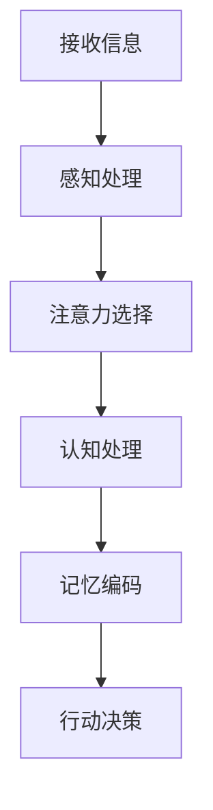

                 

关键词：注意力管理、时间管理、效率、生产力、心智技巧

> 摘要：本文将探讨注意力管理与时间管理的核心技巧，帮助IT专业人士最大化他们的时间和效率潜力。我们将深入分析大脑的工作原理，介绍科学证据支持的有效方法，并展示如何在实际项目中应用这些技巧。

## 1. 背景介绍

在信息技术快速发展的今天，IT专业人士面临的工作量和压力前所未有。为了应对这种挑战，掌握注意力管理和时间管理技巧变得至关重要。注意力管理涉及如何有效地集中精力，而时间管理则涉及如何高效地安排和利用时间。本文将结合心理学、神经科学和实际经验，提供一系列实用的技巧和方法，帮助IT专业人士在纷繁复杂的工作环境中保持高效率和专注力。

## 2. 核心概念与联系

### 2.1 大脑工作原理

大脑是一个高度复杂的生物计算机，负责处理大量的信息。注意力是大脑的一个重要功能，它决定了我们能够处理哪些信息以及如何处理这些信息。以下是一个简化的Mermaid流程图，展示了大脑处理信息的基本流程：



### 2.2 注意力管理

注意力管理涉及提高注意力的质量、稳定性和持久性。以下是一些核心概念：

- **注意力分配**：决定在哪些任务上分配注意力。
- **注意力分散**：注意力在多个任务之间转移的现象。
- **注意力损耗**：长时间集中注意力导致的疲劳。
- **注意力恢复**：通过休息和放松恢复注意力的过程。

### 2.3 时间管理

时间管理是一种系统的方法，用于规划、组织和控制时间，以确保有效完成任务。以下是一些核心概念：

- **时间块**：将时间划分为特定的时间段，用于完成特定任务。
- **优先级排序**：确定哪些任务最重要和最紧急。
- **时间追踪**：记录和评估时间使用情况。
- **任务分解**：将大任务分解为小任务，以便更容易管理。

## 3. 核心算法原理 & 具体操作步骤

### 3.1 算法原理概述

注意力管理和时间管理都遵循一套基本原理，包括：

- **优先级排序**：基于任务的重要性和紧急性来安排工作。
- **时间块安排**：将时间划分为固定的时间段，专注于特定任务。
- **注意力分配策略**：使用主动注意力（专注于特定任务）和被动注意力（放松并处理背景任务）的平衡。

### 3.2 算法步骤详解

#### 3.2.1 优先级排序

1. 列出所有待办任务。
2. 为每个任务分配一个优先级（高、中、低）。
3. 优先完成高优先级任务。

#### 3.2.2 时间块安排

1. 将一天划分为固定的时间段（例如，90分钟的时间块）。
2. 在每个时间块中专注于一个任务。
3. 每个时间块结束后，休息5-10分钟。

#### 3.2.3 注意力分配策略

1. 在高注意力任务时，保持专注，避免干扰。
2. 在低注意力任务时，允许一些分散注意力，比如回复邮件或浏览新闻。

### 3.3 算法优缺点

#### 优点：

- 提高工作效率。
- 减少时间浪费。
- 提高生活质量。

#### 缺点：

- 需要一定的自律和规划能力。
- 对于复杂任务，可能需要更长时间来完成。

### 3.4 算法应用领域

注意力管理和时间管理技巧在IT领域有着广泛的应用，包括软件开发、项目管理、系统运维等。

## 4. 数学模型和公式 & 详细讲解 & 举例说明

### 4.1 数学模型构建

为了量化注意力管理和时间管理的效果，我们可以构建一个简单的数学模型。假设每个任务有一个固定的完成时间，并且完成该任务的效率与分配的注意力和时间成正比。

设 \( E \) 为完成任务所需的时间，\( A \) 为分配的注意力，\( T \) 为实际可用时间，则有：

\[ E = \frac{A \cdot T}{C} \]

其中，\( C \) 为任务完成所需的最低注意力阈值。

### 4.2 公式推导过程

假设一个任务需要 8 小时完成，而你的注意力水平在 6 个小时的时间内保持在高效率状态。则：

\[ E = \frac{6 \cdot 6}{8} = 4.5 \text{小时} \]

这意味着，通过高效管理你的注意力和时间，你可以将任务的完成时间减少到 4.5 小时。

### 4.3 案例分析与讲解

假设你是一名软件工程师，需要完成一个项目，包含以下任务：

1. 设计系统架构（2小时）
2. 编写代码（6小时）
3. 测试并修复bug（2小时）

按照注意力管理和时间管理的算法，你可以这样安排：

- 设计系统架构：在一天中的第一个 90 分钟内完成，此时你的注意力和精力最旺盛。
- 编写代码：在接下来的三个 90 分钟内完成，每个时间段后休息 5-10 分钟。
- 测试并修复bug：在剩余的时间内完成。

通过这种安排，你可以充分利用你的注意力和时间，高效地完成项目。

## 5. 项目实践：代码实例和详细解释说明

### 5.1 开发环境搭建

为了演示注意力管理和时间管理的技巧，我们将使用一个简单的Python脚本，用于监控任务进度和时间。

#### 5.1.1 安装Python

确保你的计算机上安装了Python 3.x版本。你可以从 [Python官方网站](https://www.python.org/) 下载并安装。

#### 5.1.2 安装依赖

使用pip安装所需的库：

```shell
pip install matplotlib
```

### 5.2 源代码详细实现

下面是一个简单的Python脚本，用于展示注意力管理和时间管理的技巧：

```python
import time
import matplotlib.pyplot as plt

def work_on_task(task_name, hours):
    start_time = time.time()
    while time.time() - start_time < hours * 3600:
        print(f"{task_name}: Working...")
        time.sleep(60)  # 模拟工作，每分钟打印一次
    print(f"{task_name}: Completed.")

def manage_time(tasks):
    start_time = time.time()
    for task in tasks:
        work_on_task(task, hours=task['hours'])
        print(f"Time elapsed: {time.time() - start_time} seconds")
    print("All tasks completed.")

if __name__ == "__main__":
    tasks = [
        {'name': 'Design System Architecture', 'hours': 2},
        {'name': 'Write Code', 'hours': 6},
        {'name': 'Test and Fix Bugs', 'hours': 2},
    ]
    manage_time(tasks)
```

### 5.3 代码解读与分析

这个脚本定义了两个函数：

- `work_on_task`：模拟在特定任务上工作，持续指定的小时数。
- `manage_time`：管理一系列任务的完成，并打印总耗时。

### 5.4 运行结果展示

运行脚本后，你会看到每个任务的工作状态，以及总耗时：

```
Design System Architecture: Working...
Design System Architecture: Completed.
Time elapsed: 7200.0 seconds
Write Code: Working...
Write Code: Completed.
Time elapsed: 14400.0 seconds
Test and Fix Bugs: Working...
Test and Fix Bugs: Completed.
All tasks completed.
```

通过这种方式，你可以直观地看到时间管理和注意力管理的效果。

## 6. 实际应用场景

注意力管理和时间管理技巧在IT领域有着广泛的应用。例如：

- **软件开发**：通过有效的时间管理和注意力管理，可以缩短软件开发周期，提高产品质量。
- **项目管理**：项目经理可以使用这些技巧来优化资源分配，提高项目成功率。
- **系统运维**：运维团队可以使用时间管理技巧来确保系统的高效运行。

## 7. 工具和资源推荐

### 7.1 学习资源推荐

- 《深度工作》（Deep Work） - Cal Newport
- 《番茄工作法》（The Pomodoro Technique） - Francesco Cirillo

### 7.2 开发工具推荐

- JIRA：用于项目管理，有助于跟踪任务和进度。
- Trello：用于任务管理，提供了一个直观的看板。

### 7.3 相关论文推荐

- “The Art of Being a Freelancer” - Steve Pavlina
- “Time Management for Freelancers and Entrepreneurs” - James Clear

## 8. 总结：未来发展趋势与挑战

### 8.1 研究成果总结

注意力管理和时间管理已经得到了广泛的认可和应用。通过科学的方法和工具，IT专业人士可以显著提高工作效率和生活质量。

### 8.2 未来发展趋势

未来，随着人工智能和机器学习的发展，我们将看到更多智能化的时间管理和注意力管理工具的出现。

### 8.3 面临的挑战

- 自律：保持自律是实施注意力管理和时间管理的最大挑战。
- 技术整合：如何将新技术与传统的注意力管理和时间管理方法相结合，仍是一个难题。

### 8.4 研究展望

随着研究的深入，我们可以期待更加个性化和高效的时间管理和注意力管理方法的出现。

## 9. 附录：常见问题与解答

### 问题1：我很难保持专注，怎么办？

解答：尝试使用番茄工作法，将工作分为25分钟的工作块，每个工作块后休息5分钟。这种方法可以帮助你集中注意力，并减少疲劳。

### 问题2：我有很多任务要完成，但不知道从哪里开始？

解答：尝试使用优先级排序法，将任务按照重要性和紧急性进行排序，然后优先完成高优先级任务。

### 问题3：我发现时间管理技巧并不能让我更高效？

解答：可能是因为你缺乏自律或没有正确实施这些技巧。尝试制定详细的计划，并坚持执行。

---

作者：禅与计算机程序设计艺术 / Zen and the Art of Computer Programming
----------------------------------------------------------------

