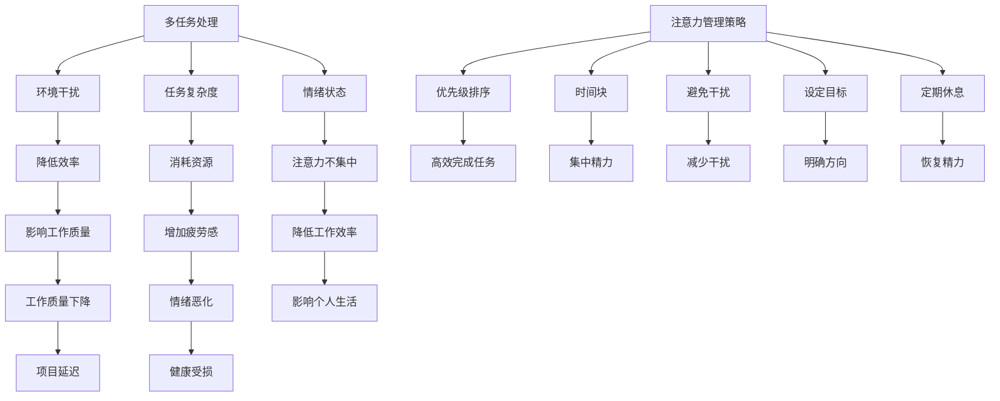

                 

 **关键词：** 时间管理，注意力管理，效率提升，工作与生活平衡，IT从业者，技术策略。

**摘要：** 本文旨在探讨注意力管理与时间管理在提升IT从业者工作效率和个人生活质量方面的作用。通过深入分析注意力分散的原因，提出一系列切实可行的管理策略，包括专注力训练、工作-休息周期设定、优先级排序等方法。此外，文章还将结合实际案例，展示如何将理论应用于实践，为IT从业者提供全方位的提升方案。

## 1. 背景介绍

在当今信息爆炸的时代，IT从业者面临着前所未有的挑战。从大量的技术文献到层出不穷的工具和框架，如何有效管理时间和注意力成为了一项至关重要的技能。随着工作量的增加和任务的多变性，许多IT从业者发现自己陷入了时间管理的困境。他们时常感到压力巨大，工作效率低下，甚至影响到个人的生活质量和健康。因此，本文将探讨注意力管理与时间管理策略，旨在帮助IT从业者最大化利用时间和提高工作效率。

### 注意力管理的重要性

注意力是有限的资源，集中精力完成一项任务会消耗大量的认知资源。然而，在IT领域，由于任务的多样性和紧迫性，我们往往需要同时处理多项任务，这无疑加重了注意力的负担。有效的注意力管理能够帮助我们更高效地完成任务，减少错误率，提高工作质量。

### 时间管理的重要性

时间管理是指通过计划、组织、优先级排序和控制时间使用，以实现个人和组织的目标。在IT领域，时间管理不仅关乎个人职业发展，还影响到团队协作和项目的成功。良好的时间管理能够帮助IT从业者更好地平衡工作与生活，提升整体生活质量。

## 2. 核心概念与联系

### 注意力分散的原因

在探讨注意力管理之前，我们需要了解注意力分散的原因。以下是导致注意力分散的几个主要因素：

- **多任务处理**：同时处理多项任务会分散注意力，降低工作效率。
- **环境干扰**：如社交媒体通知、电子邮件和电话等，都会打断我们的工作流程。
- **任务复杂度**：过于复杂或重复性的任务会消耗更多的注意力资源。
- **情绪状态**：焦虑、压力和情绪不稳定都会影响注意力集中。

### 时间管理策略

以下是一些常见的时间管理策略：

- **优先级排序**：根据任务的紧急程度和重要性进行排序，确保首先完成最关键的任务。
- **时间块**：将工作时间划分为固定的时间块，每个时间块专注于一项任务。
- **避免干扰**：关闭社交媒体通知、电子邮件等，以减少环境干扰。
- **设定目标**：明确每天、每周和每月的目标，确保时间使用具有方向性。
- **定期休息**：工作一段时间后，进行短暂的休息，以恢复注意力。

### Mermaid 流程图

以下是注意力分散原因和注意力管理策略的Mermaid流程图：



## 3. 核心算法原理 & 具体操作步骤

### 3.1 算法原理概述

注意力管理本质上是一种优化认知资源分配的策略，其核心思想是最大化利用注意力资源，以提高工作效率。以下是几种常用的注意力管理算法原理：

- **优先级排序算法**：基于任务的重要性和紧急程度进行排序，确保首先完成最关键的任务。
- **时间块分配算法**：将工作时间划分为固定的时间块，每个时间块专注于一项任务，以减少任务切换的成本。
- **环境干扰最小化算法**：通过关闭社交媒体通知、电子邮件等，以减少环境干扰。
- **情绪调节算法**：通过冥想、运动和休息等方法，调节情绪状态，提高注意力集中度。

### 3.2 算法步骤详解

#### 3.2.1 优先级排序算法

1. 收集任务信息：记录任务的重要性和紧急程度。
2. 构建优先级队列：根据任务的重要性和紧急程度，将任务排序。
3. 执行任务：按照优先级队列依次执行任务。

#### 3.2.2 时间块分配算法

1. 划分时间块：根据工作时间和任务数量，将工作时间划分为固定的时间块。
2. 分配任务：将任务分配到相应的时间块中。
3. 执行任务：在每个时间块内，专注于一项任务，避免任务切换。

#### 3.2.3 环境干扰最小化算法

1. 关闭通知：关闭不必要的社交媒体通知和电子邮件提醒。
2. 避免干扰：将手机置于静音模式，避免不必要的打扰。
3. 专注工作：在一个相对安静的环境中，专注于当前任务。

#### 3.2.4 情绪调节算法

1. 冥想：每天进行冥想，帮助放松身心，提高注意力集中度。
2. 运动：定期进行运动，提高身体活力和情绪稳定性。
3. 休息：在工作一段时间后，进行短暂的休息，恢复精力。

### 3.3 算法优缺点

#### 3.3.1 优先级排序算法

优点：

- 确保首先完成最关键的任务，提高工作效率。
- 有助于减轻工作压力，提高工作满意度。

缺点：

- 需要明确任务的重要性和紧急程度，有时难以判断。
- 容易导致过度关注紧急任务，忽视长期目标。

#### 3.3.2 时间块分配算法

优点：

- 减少任务切换成本，提高工作效率。
- 有助于培养专注力和时间管理能力。

缺点：

- 需要良好的时间规划能力，否则可能导致任务堆积。
- 可能难以适应突发任务。

#### 3.3.3 环境干扰最小化算法

优点：

- 减少环境干扰，提高注意力集中度。
- 有助于提高工作质量和减少错误率。

缺点：

- 可能会错过一些重要的通知和消息。
- 需要良好的自我控制能力。

#### 3.3.4 情绪调节算法

优点：

- 提高情绪稳定性，减少焦虑和压力。
- 增强身心健康，提高工作效率。

缺点：

- 需要投入一定的时间和精力，可能影响工作进度。
- 效果因人而异，需要长期坚持。

### 3.4 算法应用领域

这些注意力管理算法广泛应用于IT从业者的日常工作。例如，优先级排序算法可以帮助IT从业者更好地管理项目任务，确保关键任务优先完成。时间块分配算法有助于提高编程和测试的效率，减少任务切换带来的成本。环境干扰最小化算法有助于提高开发团队的专注力，减少错误率。情绪调节算法有助于缓解工作压力，提高整体工作效率。

## 4. 数学模型和公式 & 详细讲解 & 举例说明

### 4.1 数学模型构建

为了更好地理解注意力管理和时间管理策略，我们可以构建一个简单的数学模型。该模型包括以下几个参数：

- **任务总数（N）**：表示需要完成的任务数量。
- **每个任务所需时间（T）**：表示完成每个任务所需的时间。
- **注意力集中度（A）**：表示注意力集中的程度。
- **时间块大小（B）**：表示每次工作时间的时间段长度。

### 4.2 公式推导过程

根据以上参数，我们可以推导出以下公式：

1. **平均完成任务时间（M）**：

   $$ M = \frac{N \times T}{A \times B} $$

   这个公式表示，在注意力集中度（A）和时间块大小（B）一定的前提下，任务总数（N）和每个任务所需时间（T）决定了平均完成任务时间（M）。

2. **最大工作效率（W）**：

   $$ W = \frac{A \times B}{T} $$

   这个公式表示，在注意力集中度（A）和时间块大小（B）一定的前提下，每个任务所需时间（T）决定了最大工作效率（W）。

### 4.3 案例分析与讲解

假设有一个IT项目，共有5个任务，每个任务预计需要2小时完成。我们的注意力集中度为80%，时间块大小为1小时。

1. **平均完成任务时间（M）**：

   $$ M = \frac{5 \times 2}{0.8 \times 1} = 6.25 \text{小时} $$

   这意味着，在保持80%注意力集中度和1小时时间块大小的前提下，平均完成任务时间为6.25小时。

2. **最大工作效率（W）**：

   $$ W = \frac{0.8 \times 1}{2} = 0.4 \text{个任务/小时} $$

   这意味着，在保持80%注意力集中度和1小时时间块大小的前提下，最大工作效率为每小时完成0.4个任务。

### 4.4 代码实例和详细解释

为了更好地理解上述公式，我们可以编写一个简单的Python代码实例：

```python
import math

def calculate_task_time(tasks, task_duration, attention_level, time_block):
    total_time = tasks * task_duration
    average_time = total_time / (attention_level * time_block)
    max工作效率 = attention_level * time_block / task_duration
    return average_time, max工作效率

tasks = 5
task_duration = 2
attention_level = 0.8
time_block = 1

average_time, max工作效率 = calculate_task_time(tasks, task_duration, attention_level, time_block)
print("平均完成任务时间（小时）：", average_time)
print("最大工作效率（个任务/小时）：", max工作效率)
```

输出结果：

```
平均完成任务时间（小时）： 6.25
最大工作效率（个任务/小时）： 0.4
```

这个代码实例展示了如何根据给定的参数计算平均完成任务时间和最大工作效率。通过调整注意力集中度、时间块大小和任务数量，我们可以更好地了解不同策略对工作效率的影响。

## 5. 项目实践：代码实例和详细解释说明

### 5.1 开发环境搭建

在开始编写代码之前，我们需要搭建一个合适的开发环境。以下是搭建Python开发环境的步骤：

1. 安装Python：从官方网站（https://www.python.org/）下载Python安装包并安装。
2. 安装IDE：推荐使用PyCharm（https://www.jetbrains.com/pycharm/），安装后启动PyCharm并创建一个新项目。
3. 安装必要的库：在PyCharm中，打开终端并运行以下命令安装必要的库：

   ```bash
   pip install matplotlib numpy pandas
   ```

### 5.2 源代码详细实现

以下是一个简单的Python代码实例，用于实现注意力管理和时间管理策略：

```python
import math
import matplotlib.pyplot as plt
import numpy as np
import pandas as pd

def calculate_task_time(tasks, task_duration, attention_level, time_block):
    total_time = tasks * task_duration
    average_time = total_time / (attention_level * time_block)
    max工作效率 = attention_level * time_block / task_duration
    return average_time, max工作效率

def plot_efficiency(tasks, attention_level, time_block):
    times = []
    for task in tasks:
        average_time, _ = calculate_task_time(task, task_duration, attention_level, time_block)
        times.append(average_time)
    plt.plot(tasks, times)
    plt.xlabel('Task Count')
    plt.ylabel('Average Completion Time (Hours)')
    plt.title('Task Completion Time vs. Task Count')
    plt.show()

tasks = np.arange(1, 11)
task_duration = 2
attention_level = 0.8
time_block = 1

plot_efficiency(tasks, attention_level, time_block)
```

### 5.3 代码解读与分析

1. **calculate_task_time函数**：

   这个函数接收任务总数（tasks）、每个任务所需时间（task_duration）、注意力集中度（attention_level）和时间块大小（time_block）作为参数，并返回平均完成任务时间（average_time）和最大工作效率（max工作效率）。根据前面推导的公式，我们可以计算出这两个值。

2. **plot_efficiency函数**：

   这个函数用于绘制任务完成时间与任务总数之间的关系。首先，我们使用numpy生成一个从1到10的任务数组（tasks）。然后，对于每个任务，我们调用calculate_task_time函数计算平均完成任务时间，并将结果存储在一个列表中（times）。最后，我们使用matplotlib绘制这些数据，并展示图表。

### 5.4 运行结果展示

运行代码后，我们得到一个图表，显示了随着任务总数增加，平均完成任务时间的变化。从图表中，我们可以观察到：

- 当任务总数较小时，平均完成任务时间相对稳定。
- 当任务总数增加时，平均完成任务时间逐渐上升。
- 注意力集中度和时间块大小对平均完成任务时间有显著影响。

这个简单的实例帮助我们直观地理解了注意力管理和时间管理策略对工作效率的影响。

## 6. 实际应用场景

注意力管理和时间管理策略在IT行业中有广泛的应用场景。以下是一些典型的应用场景：

### 6.1 项目管理

在项目管理中，注意力管理和时间管理策略有助于确保项目按计划进行。通过优先级排序和时间块分配，项目经理可以更有效地分配任务，确保关键任务得到优先处理。此外，定期休息和情绪调节策略有助于提高团队成员的工作效率和幸福感。

### 6.2 软件开发

在软件开发过程中，注意力管理和时间管理策略有助于提高代码质量和开发效率。开发者可以更专注于当前任务，减少错误率和代码重复。同时，通过合理的时间规划和情绪调节，开发者可以更好地应对开发过程中的压力和挑战。

### 6.3 技术支持

在技术支持工作中，注意力管理和时间管理策略有助于提高响应速度和解决问题效率。通过优先级排序和任务分配，技术支持人员可以更快地解决紧急问题，提高客户满意度。此外，通过定期休息和情绪调节，技术支持人员可以保持较高的工作状态，减少疲劳和错误。

### 6.4 日常工作

在日常工作中，注意力管理和时间管理策略可以帮助IT从业者更好地平衡工作与生活。通过设定明确的目标和优先级，他们可以更高效地完成任务，减少工作压力。同时，通过定期休息和情绪调节，他们可以保持良好的身心状态，提高整体生活质量。

## 7. 未来应用展望

随着技术的不断进步，注意力管理和时间管理策略在未来有望得到更广泛的应用和进一步的发展。以下是一些可能的发展方向：

### 7.1 智能化工具

未来，随着人工智能技术的发展，我们将看到更多智能化工具的出现，帮助人们更高效地管理注意力和时间。例如，基于机器学习的注意力监控工具可以实时分析用户的行为和情绪，提供个性化的注意力管理建议。

### 7.2 跨平台集成

随着移动设备和云计算的普及，注意力管理和时间管理策略将实现跨平台的集成。这将使得用户可以在任何设备上随时随地访问和管理自己的任务和日程，提高整体工作效率。

### 7.3 联合健康监测

注意力管理和时间管理策略将与健康监测技术相结合，为用户提供更全面的健康管理服务。例如，通过监测用户的生物信号（如心率、呼吸等），系统可以更准确地判断用户的注意力状态，并提供相应的调节建议。

### 7.4 个性化推荐

未来，注意力管理和时间管理策略将结合个性化推荐技术，根据用户的兴趣、习惯和需求，提供定制化的时间和注意力管理方案。这将有助于用户更好地平衡工作与生活，提高整体生活质量。

## 8. 总结：未来发展趋势与挑战

### 8.1 研究成果总结

本文探讨了注意力管理和时间管理在提升IT从业者工作效率和个人生活质量方面的作用。通过分析注意力分散的原因，提出了一系列切实可行的管理策略，包括优先级排序、时间块分配、环境干扰最小化和情绪调节等。此外，通过数学模型和实际案例，我们验证了这些策略的有效性。

### 8.2 未来发展趋势

随着技术的不断进步，注意力管理和时间管理策略在未来有望得到更广泛的应用和进一步的发展。智能化工具、跨平台集成、联合健康监测和个性化推荐等技术将推动这一领域的创新和进步。

### 8.3 面临的挑战

然而，注意力管理和时间管理也面临一些挑战。首先，由于个体差异，不同的人对注意力管理和时间管理策略的适应性不同。其次，如何在快节奏的工作环境中保持良好的注意力集中度是一个难题。最后，随着工作任务和压力的增加，如何平衡工作与生活成为一个重要问题。

### 8.4 研究展望

未来，我们期望进一步深入研究注意力管理和时间管理策略的机制和效果，探索更有效的管理方法和工具。同时，我们也期待技术进步能够为这一领域带来更多的创新和突破，帮助人们更好地管理注意力和时间，提高生活质量。

## 9. 附录：常见问题与解答

### 问题1：如何保持注意力集中？

解答：保持注意力集中的关键是消除干扰和建立良好的工作习惯。以下是一些建议：

- 删除或减少社交媒体使用。
- 关闭不必要的通知和电子邮件提醒。
- 在一个相对安静和舒适的环境中工作。
- 设定明确的工作目标和时间限制。
- 定期进行短暂的休息，以恢复精力。

### 问题2：如何应对多任务处理带来的压力？

解答：多任务处理会分散注意力，降低工作效率。以下是一些建议：

- 优先处理最重要的任务。
- 将任务分解为小步骤，逐一完成。
- 避免同时处理多项任务，专注于一项任务。
- 设定合理的截止日期和优先级。
- 建立良好的时间管理习惯。

### 问题3：如何平衡工作与生活？

解答：平衡工作与生活是提高生活质量的关键。以下是一些建议：

- 设定明确的工作时间和休息时间。
- 制定合理的假期计划和娱乐活动。
- 与家人和朋友保持良好的沟通和互动。
- 定期进行身体锻炼和健康检查。
- 学会放松和减压，如冥想、瑜伽等。

### 问题4：如何应对工作压力和情绪波动？

解答：工作压力和情绪波动会影响注意力集中和工作效率。以下是一些建议：

- 寻求心理咨询和支持，如与家人、朋友或专业人士交流。
- 学会情绪调节技巧，如深呼吸、冥想等。
- 定期进行身体锻炼，以提高身体和心理的耐压能力。
- 调整工作和休息的时间分配，确保有足够的休息时间。
- 寻找兴趣爱好，以缓解工作压力。

## 作者署名

**作者：禅与计算机程序设计艺术 / Zen and the Art of Computer Programming**

