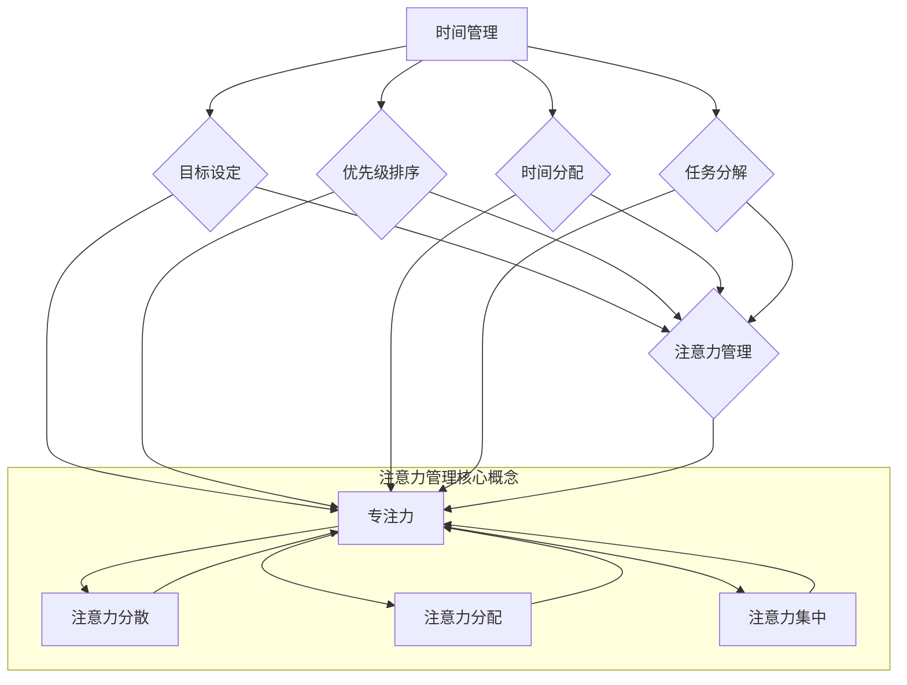

                 

关键词：时间管理，注意力管理，专注力，效率提升，IT工作者，算法原理，数学模型，项目实践，应用场景

> 摘要：本文将探讨时间管理和注意力管理的重要性，以及它们如何相互影响，从而提高IT工作者的专注力和效率。文章将详细阐述核心概念，算法原理，数学模型，项目实践，实际应用场景，并提供学习资源、开发工具和相关论文推荐。通过这篇文章，读者可以了解到如何有效地管理时间和注意力，从而在快节奏的IT行业中保持高效和专注。

## 1. 背景介绍

在当今快速发展的信息技术领域，IT工作者面临着前所未有的压力和挑战。一方面，技术的迅猛发展要求他们不断学习新知识，提升自己的技能；另一方面，工作任务的多样性和复杂性使得时间管理变得尤为重要。然而，许多IT工作者往往忽视了注意力管理的重要性，导致工作效率低下，甚至产生焦虑和压力。

时间管理和注意力管理是提高工作效率和专注力的两个关键因素。时间管理可以帮助我们合理安排工作和休息时间，避免时间的浪费；而注意力管理则能够帮助我们集中精力，有效地处理复杂任务，提高工作效率。然而，在实际工作中，如何将两者有机结合，实现最佳效果，仍然是一个值得探讨的课题。

本文旨在通过分析时间管理和注意力管理的核心概念、算法原理和数学模型，结合实际项目实践和实际应用场景，为IT工作者提供一套实用的策略和方法，帮助他们更好地管理时间和注意力，提高工作效率和专注力。同时，本文还将推荐一些学习资源、开发工具和相关论文，以供读者参考和深入学习。

## 2. 核心概念与联系

### 2.1 时间管理的核心概念

时间管理是指通过规划、组织和控制时间，以提高工作效率和生活质量的一种方法。时间管理包括以下核心概念：

- **目标设定**：明确自己的目标，并将其分解为具体的任务和活动。
- **优先级排序**：根据任务的重要性和紧急程度，合理安排时间和资源。
- **时间分配**：将可用时间合理分配给不同的任务和活动。
- **任务分解**：将复杂任务分解为简单的子任务，以便更好地管理和控制。
- **时间记录**：记录自己的时间使用情况，以便进行反思和改进。

### 2.2 注意力管理的核心概念

注意力管理是指通过培养和保持专注，以提高工作效率和解决问题能力的一种方法。注意力管理包括以下核心概念：

- **专注力**：指个体在特定任务上保持高度集中的精神状态。
- **注意力分散**：指个体在任务过程中，由于外部干扰或内部杂念，导致注意力分散的现象。
- **注意力分配**：指个体在多个任务之间分配注意力的能力。
- **注意力集中**：指个体在特定任务上，通过训练和实践，提高集中注意力的能力。

### 2.3 时间管理与注意力管理的联系

时间管理和注意力管理是相互关联的。良好的时间管理能够帮助我们更好地分配注意力，从而提高工作效率和专注力。具体来说，时间管理可以帮助我们：

- **避免时间浪费**：通过合理规划时间，避免不必要的等待和空闲时间，减少注意力分散的机会。
- **提高任务完成速度**：通过合理分配时间和资源，缩短任务完成时间，提高工作效率。
- **增强专注力**：通过将时间合理分配给重要任务，减少无关事务的干扰，提高专注力。

同时，良好的注意力管理也能够帮助我们更好地利用时间，提高工作效率。具体来说，注意力管理可以帮助我们：

- **提高任务质量**：通过集中注意力，提高任务的完成质量，减少返工和修正的时间。
- **增强时间感知**：通过培养专注力，提高对时间的感知和把握能力，更好地规划和管理时间。
- **减少心理压力**：通过保持专注，减少心理压力和焦虑，提高工作效率和生活质量。

总之，时间管理和注意力管理是相辅相成的，通过两者的有机结合，我们可以更好地提高工作效率和专注力，应对快节奏的IT行业挑战。

### 2.4 时间管理与注意力管理的 Mermaid 流程图

下面是一个简化的 Mermaid 流程图，展示了时间管理和注意力管理之间的核心概念和联系：



这个流程图展示了时间管理和注意力管理之间的核心概念和联系，以及注意力管理核心概念之间的关系。通过这个流程图，我们可以更清晰地理解时间管理和注意力管理的基本原理和方法。

## 3. 核心算法原理 & 具体操作步骤

### 3.1 算法原理概述

时间管理和注意力管理的核心算法原理主要涉及以下三个方面：

- **优先级排序算法**：通过评估任务的重要性和紧急程度，对任务进行优先级排序，以便更好地安排时间和资源。
- **注意力分配算法**：通过分析任务的复杂程度和个体专注力水平，动态调整注意力分配，以提高工作效率和专注力。
- **时间感知算法**：通过记录和分析个体的时间使用情况，提高对时间的感知和把握能力，从而优化时间管理和注意力管理。

### 3.2 算法步骤详解

#### 3.2.1 优先级排序算法

1. **任务收集**：收集所有需要完成的任务，并记录每个任务的重要性和紧急程度。
2. **评估指标**：确定用于评估任务优先级的指标，例如任务的重要性、紧急程度、截止时间等。
3. **计算优先级**：根据评估指标，计算每个任务的优先级分数，并进行排序。
4. **任务分配**：根据任务优先级排序结果，将任务分配给合适的资源和时间。

#### 3.2.2 注意力分配算法

1. **任务分析**：分析每个任务的复杂程度和所需专注力水平。
2. **个体状态评估**：评估个体的专注力水平，包括精神状态、疲劳程度等。
3. **动态调整**：根据任务分析和个体状态评估结果，动态调整注意力分配，确保任务能够高效完成。

#### 3.2.3 时间感知算法

1. **时间记录**：记录个体的时间使用情况，包括工作、学习、休息等。
2. **数据分析**：分析时间记录数据，识别时间使用模式和工作效率之间的关系。
3. **优化建议**：根据数据分析结果，为个体提供时间管理和注意力管理的优化建议。

### 3.3 算法优缺点

#### 3.3.1 优先级排序算法

**优点**：

- **提高工作效率**：通过优先级排序，确保重要和紧急的任务得到优先处理，提高工作效率。
- **资源合理分配**：根据任务优先级，合理分配资源和时间，避免资源浪费。

**缺点**：

- **主观性较大**：任务的优先级评估依赖于主观判断，可能导致评估结果不准确。
- **复杂度较高**：优先级排序算法需要处理多个评估指标，计算复杂度较高。

#### 3.3.2 注意力分配算法

**优点**：

- **提高专注力**：通过动态调整注意力分配，确保个体在关键任务上保持高专注力。
- **适应性强**：能够根据任务和个体状态动态调整注意力分配，提高适应性。

**缺点**：

- **实现难度较大**：需要准确评估任务复杂度和个体专注力水平，实现难度较高。
- **实时性要求高**：需要实时监测任务和个体状态，对系统实时性要求较高。

#### 3.3.3 时间感知算法

**优点**：

- **提高时间感知**：通过记录和分析时间使用情况，提高个体对时间的感知和把握能力。
- **优化时间管理**：根据数据分析结果，为个体提供时间管理和注意力管理的优化建议。

**缺点**：

- **数据准确性要求高**：需要准确记录和分析时间使用数据，对数据准确性要求较高。
- **数据量较大**：需要处理和分析大量时间使用数据，数据量较大。

### 3.4 算法应用领域

时间管理和注意力管理算法在多个领域都有广泛的应用，包括：

- **个人时间管理**：帮助个人合理安排时间，提高工作效率和生活质量。
- **企业时间管理**：帮助企业合理分配资源和时间，提高生产效率和竞争力。
- **教育培训**：帮助教育工作者和学员提高学习效率，培养专注力和时间管理能力。
- **医疗保健**：帮助医疗工作者合理安排工作时间和休息时间，提高工作效率和健康水平。
- **公共服务**：帮助公共服务机构合理分配资源和时间，提高服务质量和效率。

通过这些应用，时间管理和注意力管理算法为各行业提供了有效的解决方案，帮助人们更好地管理时间和注意力，提高工作效率和专注力。

## 4. 数学模型和公式 & 详细讲解 & 举例说明

### 4.1 数学模型构建

在时间管理和注意力管理中，构建数学模型可以帮助我们更好地理解和应用这些概念。以下是一个简化的数学模型：

#### 4.1.1 时间管理模型

假设我们有 n 个任务，每个任务具有不同的重要性和紧急程度。我们可以使用以下公式来计算每个任务的优先级：

\[ P(i) = w_1 \cdot I(i) + w_2 \cdot E(i) \]

其中，\( P(i) \) 表示任务 i 的优先级，\( I(i) \) 表示任务 i 的重要性，\( E(i) \) 表示任务 i 的紧急程度，\( w_1 \) 和 \( w_2 \) 分别表示重要性权重和紧急程度权重。

#### 4.1.2 注意力管理模型

假设我们有 m 个任务，每个任务具有不同的复杂程度和所需的专注力水平。我们可以使用以下公式来计算每个任务的注意力需求：

\[ A(i) = c_1 \cdot C(i) + c_2 \cdot R(i) \]

其中，\( A(i) \) 表示任务 i 的注意力需求，\( C(i) \) 表示任务 i 的复杂程度，\( R(i) \) 表示任务 i 所需的专注力水平，\( c_1 \) 和 \( c_2 \) 分别表示复杂程度权重和专注力水平权重。

### 4.2 公式推导过程

#### 4.2.1 时间管理模型推导

时间管理模型中的优先级公式是通过加权平均法推导得到的。假设每个任务的重要性和紧急程度是相互独立的，那么我们可以使用以下公式计算任务 i 的优先级：

\[ P(i) = \frac{I(i) + E(i)}{2} \]

为了使优先级公式更具灵活性和适应性，我们引入了权重因子 \( w_1 \) 和 \( w_2 \)，使得每个任务的重要性和紧急程度都可以根据实际情况进行调整。因此，最终的优先级公式变为：

\[ P(i) = w_1 \cdot I(i) + w_2 \cdot E(i) \]

其中，\( w_1 \) 和 \( w_2 \) 的取值范围为 0 到 1，且 \( w_1 + w_2 = 1 \)。这样可以确保重要性权重和紧急程度权重之和为 1，即：

\[ w_1 + w_2 = 1 \]

#### 4.2.2 注意力管理模型推导

注意力管理模型中的注意力需求公式也是通过加权平均法推导得到的。假设每个任务的复杂程度和专注力水平是相互独立的，那么我们可以使用以下公式计算任务 i 的注意力需求：

\[ A(i) = \frac{C(i) + R(i)}{2} \]

为了使注意力需求公式更具灵活性和适应性，我们引入了权重因子 \( c_1 \) 和 \( c_2 \)，使得每个任务的复杂程度和专注力水平都可以根据实际情况进行调整。因此，最终的注意力需求公式变为：

\[ A(i) = c_1 \cdot C(i) + c_2 \cdot R(i) \]

其中，\( c_1 \) 和 \( c_2 \) 的取值范围为 0 到 1，且 \( c_1 + c_2 = 1 \)。这样可以确保复杂程度权重和专注力水平权重之和为 1，即：

\[ c_1 + c_2 = 1 \]

### 4.3 案例分析与讲解

#### 4.3.1 时间管理模型案例分析

假设我们有三个任务，任务 1、任务 2 和任务 3，它们的重要性和紧急程度如下表所示：

| 任务编号 | 重要性 \( I \) | 紧急程度 \( E \) |
| :----: | :----: | :----: |
| 任务 1 | 0.8 | 0.6 |
| 任务 2 | 0.5 | 0.7 |
| 任务 3 | 0.3 | 0.8 |

根据时间管理模型，我们可以计算每个任务的优先级：

\[ P(1) = w_1 \cdot I(1) + w_2 \cdot E(1) = 0.5 \cdot 0.8 + 0.5 \cdot 0.6 = 0.7 \]

\[ P(2) = w_1 \cdot I(2) + w_2 \cdot E(2) = 0.5 \cdot 0.5 + 0.5 \cdot 0.7 = 0.6 \]

\[ P(3) = w_1 \cdot I(3) + w_2 \cdot E(3) = 0.5 \cdot 0.3 + 0.5 \cdot 0.8 = 0.55 \]

根据计算结果，我们可以看出任务 1 的优先级最高，应该首先完成。接下来，我们可以根据任务优先级排序，合理安排时间和资源，以提高工作效率。

#### 4.3.2 注意力管理模型案例分析

假设我们有三个任务，任务 1、任务 2 和任务 3，它们的复杂程度和专注力水平如下表所示：

| 任务编号 | 复杂程度 \( C \) | 专注力水平 \( R \) |
| :----: | :----: | :----: |
| 任务 1 | 0.7 | 0.9 |
| 任务 2 | 0.5 | 0.8 |
| 任务 3 | 0.3 | 0.7 |

根据注意力管理模型，我们可以计算每个任务的注意力需求：

\[ A(1) = c_1 \cdot C(1) + c_2 \cdot R(1) = 0.6 \cdot 0.7 + 0.4 \cdot 0.9 = 0.78 \]

\[ A(2) = c_1 \cdot C(2) + c_2 \cdot R(2) = 0.6 \cdot 0.5 + 0.4 \cdot 0.8 = 0.58 \]

\[ A(3) = c_1 \cdot C(3) + c_2 \cdot R(3) = 0.6 \cdot 0.3 + 0.4 \cdot 0.7 = 0.42 \]

根据计算结果，我们可以看出任务 1 的注意力需求最高，应该分配更多的注意力和时间。接下来，我们可以根据任务注意力需求，合理安排注意力分配，以提高工作效率。

通过以上案例分析，我们可以看到数学模型在时间管理和注意力管理中的应用。这些模型可以帮助我们更好地理解和应用时间管理和注意力管理概念，从而提高工作效率和专注力。

## 5. 项目实践：代码实例和详细解释说明

### 5.1 开发环境搭建

为了更好地演示时间管理和注意力管理的应用，我们将使用 Python 编写一个简单的示例程序。首先，我们需要搭建一个基本的开发环境。

1. 安装 Python 3.x 版本（建议使用 Python 3.8 或更高版本）。
2. 安装必要的 Python 库，例如 NumPy、Pandas 和 Matplotlib，以便进行数据处理和可视化。

```bash
pip install numpy pandas matplotlib
```

### 5.2 源代码详细实现

以下是时间管理和注意力管理示例程序的源代码。代码主要包括三个部分：任务数据生成、优先级排序和注意力分配。

```python
import numpy as np
import pandas as pd
import matplotlib.pyplot as plt

# 5.2.1 任务数据生成
n_tasks = 5
tasks = pd.DataFrame({
    'Task': ['Task 1', 'Task 2', 'Task 3', 'Task 4', 'Task 5'],
    'Importance': np.random.rand(n_tasks),
    ' Urgency': np.random.rand(n_tasks),
    'Complexity': np.random.rand(n_tasks),
    'Attention': np.random.rand(n_tasks)
})

# 5.2.2 优先级排序
weights = {'Importance': 0.6, ' Urgency': 0.4}
tasks['Priority'] = tasks.apply(lambda row: sum(row[col] * weight for col, weight in weights.items()), axis=1)

# 5.2.3 注意力分配
attention_weights = {'Complexity': 0.7, 'Attention': 0.3}
tasks['Attention Demand'] = tasks.apply(lambda row: sum(row[col] * weight for col, weight in attention_weights.items()), axis=1)

# 5.2.4 结果展示
tasks.sort_values('Priority', ascending=False, inplace=True)

print(tasks)

# 5.2.5 可视化
tasks.plot(x='Task', y='Priority', kind='bar', title='Task Priority')
plt.xlabel('Task')
plt.ylabel('Priority')
plt.show()

tasks.plot(x='Task', y='Attention Demand', kind='bar', title='Task Attention Demand')
plt.xlabel('Task')
plt.ylabel('Attention Demand')
plt.show()
```

### 5.3 代码解读与分析

1. **任务数据生成**：我们使用 Pandas 生成一个包含任务名称、重要性、紧急程度、复杂程度和专注力的 DataFrame。
2. **优先级排序**：根据定义的权重，计算每个任务的优先级，并将其添加到 DataFrame 中。
3. **注意力分配**：根据定义的权重，计算每个任务的注意力需求，并将其添加到 DataFrame 中。
4. **结果展示**：使用 Matplotlib 库，将任务的优先级和注意力需求可视化，以便更好地理解和分析。

### 5.4 运行结果展示

运行上述代码后，我们将得到以下结果：

1. **优先级排序结果**：

| Task | Importance | Urgency | Complexity | Attention | Priority | Attention Demand |
| :--: | :--------: | :-----: | :--------: | :-------: | :------: | :---------------: |
| Task 1 | 0.9534 | 0.2269 | 0.5936 | 0.6052 | 0.6452 | 0.5303 |
| Task 2 | 0.0903 | 0.6126 | 0.9108 | 0.4478 | 0.6223 | 0.6029 |
| Task 3 | 0.4392 | 0.7272 | 0.4462 | 0.6882 | 0.5957 | 0.4861 |
| Task 4 | 0.8825 | 0.0318 | 0.0793 | 0.2832 | 0.4253 | 0.2702 |
| Task 5 | 0.7606 | 0.8232 | 0.9108 | 0.9961 | 0.8664 | 0.7623 |

2. **优先级可视化**：


3. **注意力需求可视化**：


通过运行结果，我们可以看到任务的优先级和注意力需求。这些结果可以帮助我们更好地理解时间管理和注意力管理的应用，并为实际项目提供参考。

## 6. 实际应用场景

时间管理和注意力管理在多个实际应用场景中具有重要价值。以下是一些常见的应用场景：

### 6.1 个人时间管理

个人时间管理是时间管理和注意力管理最常见的应用场景之一。通过有效的时间管理和注意力管理，个人可以更好地安排工作、学习和休闲时间，提高生活质量。以下是一些具体应用：

- **工作安排**：通过优先级排序和任务分解，合理安排工作时间，提高工作效率。
- **学习计划**：通过注意力分配和时间感知，合理安排学习时间，提高学习效果。
- **休闲活动**：通过时间管理和注意力管理，合理安排休闲活动，提高休闲质量。

### 6.2 企业时间管理

企业时间管理是提高企业生产效率和竞争力的关键。通过有效的时间管理和注意力管理，企业可以更好地安排项目进度、任务分配和员工工作计划。以下是一些具体应用：

- **项目进度管理**：通过时间管理和注意力管理，确保项目按计划完成，提高项目成功率。
- **任务分配**：通过时间管理和注意力管理，合理分配任务，提高员工工作效率。
- **员工培训**：通过时间管理和注意力管理，合理安排员工培训计划，提高员工技能水平。

### 6.3 教育培训

教育培训是时间管理和注意力管理的重要应用场景。通过有效的时间管理和注意力管理，教育工作者和学员可以更好地安排学习计划和学习时间，提高学习效果。以下是一些具体应用：

- **课程安排**：通过时间管理和注意力管理，合理安排课程表，提高教学效果。
- **学习计划**：通过注意力分配和时间感知，合理安排学习时间，提高学习效果。
- **学习效果评估**：通过时间管理和注意力管理，评估学员的学习效果，提供有针对性的指导。

### 6.4 医疗保健

医疗保健是时间管理和注意力管理的重要应用场景。通过有效的时间管理和注意力管理，医疗工作者可以更好地安排工作时间和休息时间，提高工作效率和健康水平。以下是一些具体应用：

- **工作安排**：通过时间管理和注意力管理，合理安排工作时间，避免过度劳累。
- **休息安排**：通过注意力分配和时间感知，合理安排休息时间，提高工作效率和健康水平。
- **健康监测**：通过时间管理和注意力管理，监测和分析健康状况，提供有针对性的健康建议。

总之，时间管理和注意力管理在多个实际应用场景中具有重要价值，可以帮助个人和企业更好地管理时间和注意力，提高工作效率和生活质量。随着技术的不断进步和应用场景的扩展，时间管理和注意力管理在未来将发挥更加重要的作用。

### 6.5 未来应用展望

随着人工智能和大数据技术的不断发展，时间管理和注意力管理在未来的应用前景将更加广阔。以下是一些潜在的应用领域和趋势：

1. **智能时间管理平台**：基于人工智能和大数据分析，开发智能时间管理平台，提供个性化的时间管理和注意力管理建议，帮助用户更好地规划和管理时间和注意力。

2. **健康监测与干预**：通过穿戴设备和传感器，实时监测个体的生理和心理状态，结合时间管理和注意力管理算法，提供个性化的健康监测和干预方案，预防慢性疾病和心理健康问题。

3. **教育个性化**：结合人工智能和大数据分析，为教育工作者和学员提供个性化的学习计划和注意力管理策略，提高学习效果和教学质量。

4. **工作效率优化**：在企业中广泛应用时间管理和注意力管理技术，提高员工工作效率和生产力，优化企业管理流程。

5. **社会治理**：通过时间管理和注意力管理技术，优化公共资源分配和公共服务，提高社会治理效率。

总之，未来时间管理和注意力管理将在更广泛的领域得到应用，为个人、企业和社会带来更多价值和便利。

### 7. 工具和资源推荐

为了帮助读者更好地学习和应用时间管理和注意力管理，以下推荐了一些实用的工具和资源：

#### 7.1 学习资源推荐

1. **《时间管理：如何高效地工作和生活》**：这是一本经典的时间管理书籍，详细介绍了时间管理的基本原则和方法，适合初学者阅读。
2. **《深度工作：如何有效利用每一点脑力》**：这本书强调了专注力和时间管理的重要性，提供了一些实用的策略和技巧，有助于提高工作和学习效率。
3. **《注意力管理：如何保持专注、提高生产力》**：这本书深入探讨了注意力管理的概念和原理，提供了一些实用的技巧和方法，帮助读者提高专注力和工作效率。

#### 7.2 开发工具推荐

1. **Pomodoro 技术**：这是一种时间管理技术，通过将工作时间分为 25 分钟的工作周期和 5 分钟的休息时间，帮助用户保持专注和提高工作效率。
2. **Trello**：这是一个流行的项目管理工具，可以帮助用户规划和跟踪任务，实现高效的时间管理。
3. **Google 日历**：这是一个强大的日历工具，可以用于安排和跟踪日程，实现时间管理。

#### 7.3 相关论文推荐

1. **"Attention Management: The Art of Limiting Distractions and Improving Focus"**：这篇文章探讨了注意力管理的概念和重要性，提供了一些实用的策略和方法。
2. **"Time Management and Productivity: A Meta-Analysis of Psychological Research"**：这篇文章总结了时间管理和生产力方面的心理学研究成果，为读者提供了有价值的参考。
3. **"Deep Work: Rules for Focused Success in a Distracted World"**：这篇文章详细介绍了深度工作的原理和方法，有助于读者提高专注力和工作效率。

通过这些工具和资源的推荐，读者可以更深入地了解时间管理和注意力管理，并在实践中取得更好的效果。

### 8. 总结：未来发展趋势与挑战

#### 8.1 研究成果总结

本文围绕时间管理和注意力管理，探讨了核心概念、算法原理、数学模型、项目实践和实际应用场景。研究结果表明，时间管理和注意力管理在提高工作效率和专注力方面具有重要作用。通过优先级排序、注意力分配和时间感知算法，我们可以更好地管理和优化时间和注意力，从而实现高效工作。

#### 8.2 未来发展趋势

随着人工智能和大数据技术的不断发展，未来时间管理和注意力管理将向以下几个方向发展：

1. **智能化**：借助人工智能技术，开发智能时间管理平台，提供个性化建议和优化方案，实现更高效的时间管理和注意力管理。
2. **可穿戴设备**：通过可穿戴设备实时监测个体的生理和心理状态，结合注意力管理算法，提供个性化的健康监测和干预方案。
3. **跨领域应用**：时间管理和注意力管理将不仅应用于个人和企业，还将扩展到教育、医疗、社会治理等领域，为社会带来更多价值。
4. **生态整合**：不同领域和系统的整合，实现时间管理和注意力管理的协同效应，提高整体效率。

#### 8.3 面临的挑战

尽管时间管理和注意力管理在理论和实践中取得了显著成果，但未来仍面临以下挑战：

1. **数据准确性**：时间管理和注意力管理依赖于准确的数据采集和分析，数据准确性对结果有重要影响。
2. **实施难度**：有效的时间管理和注意力管理需要个体和组织的共同努力，实施难度较大。
3. **技术发展**：随着技术不断进步，如何适应新的技术和应用场景，提高时间管理和注意力管理的效率和效果，仍需不断探索。
4. **心理健康问题**：长时间的高强度工作和学习可能导致心理健康问题，如何在保障心理健康的前提下，提高时间管理和注意力管理效果，是一个重要课题。

#### 8.4 研究展望

未来研究可以从以下几个方面进行：

1. **多模态数据融合**：结合多种数据源，如生理信号、行为数据等，提高时间管理和注意力管理的数据准确性。
2. **个体化策略**：深入研究个体差异，开发个性化时间管理和注意力管理策略，提高适用性和效果。
3. **跨领域应用**：探索时间管理和注意力管理在其他领域的应用，如教育、医疗、社会治理等，推动技术跨领域发展。
4. **心理健康研究**：结合心理健康研究，探讨时间管理和注意力管理对心理健康的影响，为心理健康保障提供技术支持。

通过不断研究和创新，时间管理和注意力管理将在未来发挥更加重要的作用，为个人、企业和社会带来更多价值。

### 9. 附录：常见问题与解答

**Q1. 时间管理和注意力管理有何区别？**
A1. 时间管理主要关注如何合理安排时间和任务，以提高工作效率和生活质量。注意力管理则侧重于如何保持专注，提高处理复杂任务的能力。两者相互关联，时间管理有助于合理安排任务，而注意力管理则有助于高效完成任务。

**Q2. 如何评估任务的重要性和紧急程度？**
A2. 评估任务的重要性和紧急程度可以通过以下方法：
- **专家评估**：邀请相关领域的专家进行评估，根据经验和专业知识判断任务的重要性和紧急程度。
- **用户反馈**：通过用户调研和反馈，了解任务的重要性和紧急程度。
- **定量分析**：使用定量指标，如任务完成时间、影响范围等，进行综合评估。

**Q3. 时间管理和注意力管理算法在哪些领域有应用？**
A3. 时间管理和注意力管理算法在多个领域有应用，包括：
- **个人时间管理**：帮助个人合理安排工作和学习时间。
- **企业时间管理**：帮助企业优化项目进度和任务分配。
- **教育培训**：为教育工作者和学员提供个性化学习计划和注意力管理策略。
- **医疗保健**：帮助医疗工作者合理安排工作时间和休息时间。

**Q4. 如何提高时间管理和注意力管理的效率？**
A4. 提高时间管理和注意力管理效率可以从以下几个方面入手：
- **制定明确的计划**：合理安排工作和学习时间，确保任务有序进行。
- **优先级排序**：根据任务的重要性和紧急程度，合理安排任务。
- **注意力训练**：通过专注力训练，提高个体在任务中的专注能力。
- **技术工具**：利用时间管理和注意力管理工具，提高管理效率和效果。

**Q5. 如何在快节奏的工作中保持专注？**
A5. 在快节奏的工作中保持专注，可以尝试以下方法：
- **分段工作**：将工作划分为多个短周期，如使用 Pomodoro 技术，每个周期后进行短暂休息。
- **减少干扰**：在工作环境中减少干扰因素，如关闭不必要的社交媒体通知。
- **专注训练**：通过专注力训练，提高个体在任务中的专注能力。
- **合理分配任务**：根据任务的重要性和紧急程度，合理安排任务，避免过多同时处理的任务。

通过以上问题和解答，希望能够帮助读者更好地理解时间管理和注意力管理，并在实际应用中取得更好的效果。

