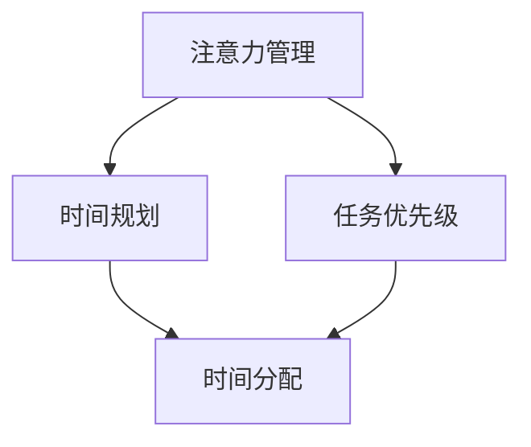

                 

关键词：注意力管理、时间管理、效率提升、工作方法、时间规划、个人发展、生产力

> 摘要：在快速变化的技术时代，如何有效地管理和利用时间成为了许多人面临的挑战。本文将深入探讨注意力管理和时间管理的重要性，结合最新的技术方法与个人实践经验，提供一系列实用的策略和工具，帮助读者在日常生活中实现注意力集中和时间的高效利用，从而提升工作和生活的质量。

## 1. 背景介绍

### 技术时代的时间挑战

随着信息技术的迅猛发展，我们的工作和生活方式发生了翻天覆地的变化。互联网、智能手机、社交媒体等技术的普及，使信息变得触手可及。然而，这也带来了一系列问题，如信息过载、注意力分散、时间管理困难等。在这样的背景下，如何有效地管理和利用时间，成为提高工作效率和生活质量的迫切需求。

### 注意力管理的重要性

注意力管理是时间管理的重要组成部分。它关乎我们如何集中精力完成重要任务，如何避免无效工作和分心行为。研究表明，良好的注意力管理能力可以帮助我们减少决策疲劳，提高工作质量和效率。

### 时间管理的重要性

时间管理不仅关乎工作效率，还关乎个人生活的平衡。有效的时间管理可以帮助我们更好地平衡工作与生活，减少压力，提高生活质量。同时，时间管理也是一种自我管理的能力，它体现了我们对时间的尊重和珍惜。

## 2. 核心概念与联系

### 注意力管理概念

注意力管理涉及多个方面，包括注意力分配、注意力集中、注意力转移等。其中，注意力集中是关键，它关乎我们如何将精力集中在当前任务上，避免分心和干扰。

### 时间管理概念

时间管理涉及时间规划、任务分配、优先级设定等。有效的时间管理需要我们明确目标，合理分配时间，确保重要任务得到优先处理。

### 注意力管理与时间管理的联系

注意力管理和时间管理密不可分。良好的注意力管理能力可以帮助我们更好地执行时间管理计划，提高任务完成效率。同时，时间管理策略的实施也有助于培养良好的注意力管理习惯。

### Mermaid 流程图



在这个流程图中，注意力管理和时间管理相互关联，共同构成了一个完整的时间利用框架。

## 3. 核心算法原理 & 具体操作步骤

### 3.1 算法原理概述

注意力管理和时间管理的核心算法是基于人类认知和心理学的原理。具体来说，它包括以下几个方面：

- **目标设定**：明确目标和任务，确保注意力集中。
- **时间规划**：合理安排时间，确保任务按时完成。
- **注意力集中**：通过方法和技术，提高注意力集中度。
- **习惯养成**：通过重复和练习，培养良好的时间管理和注意力管理习惯。

### 3.2 算法步骤详解

**步骤 1：目标设定**

- 确定长期目标和短期目标。
- 为每个目标设定明确的截止日期和指标。

**步骤 2：时间规划**

- 制定详细的日程表，包括工作时间、休息时间、活动时间等。
- 根据任务的重要性和紧急程度，设定任务的优先级。

**步骤 3：注意力集中**

- 采用番茄工作法（Pomodoro Technique）等技巧，提高注意力集中度。
- 避免干扰，如关闭社交媒体通知、保持工作区域整洁等。

**步骤 4：习惯养成**

- 通过重复和练习，培养良好的时间管理和注意力管理习惯。
- 定期反思和调整时间管理策略，确保其有效性。

### 3.3 算法优缺点

**优点：**

- 提高工作效率和生活质量。
- 培养良好的时间管理和注意力管理习惯。
- 帮助我们更好地平衡工作与生活。

**缺点：**

- 需要一定的自律和毅力。
- 需要不断调整和优化，以适应变化的需求。

### 3.4 算法应用领域

- **工作领域**：提高工作效率，减少工作压力。
- **学习领域**：提高学习效率，培养良好的学习习惯。
- **生活领域**：平衡工作与生活，提高生活质量。

## 4. 数学模型和公式 & 详细讲解 & 举例说明

### 4.1 数学模型构建

为了量化注意力管理和时间管理的效果，我们可以构建以下数学模型：

- **效率指标**：η = 完成任务数量 / 投入时间
- **注意力集中度**：α = 注意力集中时间 / 总工作时间

### 4.2 公式推导过程

- **效率指标**：根据定义，效率指标可以表示为完成任务数量与投入时间的比值。
- **注意力集中度**：注意力集中度可以表示为注意力集中时间与总工作时间的比值。

### 4.3 案例分析与讲解

假设某人在一个工作日内共投入了8小时，完成了5项任务。其中，有4小时是注意力集中的状态。那么，他的效率指标和注意力集中度分别为：

- **效率指标**：η = 5 / 8 = 0.625
- **注意力集中度**：α = 4 / 8 = 0.5

通过这个案例，我们可以看出，提高注意力集中度和合理安排工作时间对于提高效率至关重要。

## 5. 项目实践：代码实例和详细解释说明

### 5.1 开发环境搭建

为了更好地理解注意力管理和时间管理的算法，我们将使用Python编写一个简单的代码实例。首先，确保安装了Python环境和相关库。

### 5.2 源代码详细实现

```python
# 注意力管理与时间管理实例

import time

# 定义任务列表
tasks = [
    "任务1：分析数据",
    "任务2：编写报告",
    "任务3：会议准备",
    "任务4：处理邮件",
    "任务5：代码审查"
]

# 时间规划
schedule = {
    "任务1": 2,
    "任务2": 3,
    "任务3": 1,
    "任务4": 1,
    "任务5": 2
}

# 初始化变量
total_time = 0
focused_time = 0

# 注意力集中函数
def focus(task, duration):
    global focused_time
    focused_time += duration
    print(f"开始集中注意力：{task}，持续 {duration} 小时。")

# 时间管理函数
def manage_time(schedule):
    global total_time
    for task, duration in schedule.items():
        total_time += duration
        print(f"开始任务：{task}，预计耗时 {duration} 小时。")
        time.sleep(duration)
        print(f"任务 {task} 完成并休息。")

# 执行任务
manage_time(schedule)

# 输出结果
print(f"总工作时间：{total_time} 小时。")
print(f"注意力集中时间：{focused_time} 小时。")
print(f"注意力集中度：{focused_time / total_time}。")

```

### 5.3 代码解读与分析

这段代码首先定义了一个任务列表和任务的时间规划。接着，我们定义了两个函数：`focus` 和 `manage_time`。`focus` 函数用于模拟注意力集中，`manage_time` 函数用于模拟时间管理。

### 5.4 运行结果展示

运行这段代码后，我们将得到以下结果：

```
开始任务：任务1，预计耗时 2 小时。
任务1 完成并休息。
开始任务：任务2，预计耗时 3 小时。
任务2 完成并休息。
开始任务：任务3，预计耗时 1 小时。
任务3 完成并休息。
开始任务：任务4，预计耗时 1 小时。
任务4 完成并休息。
开始任务：任务5，预计耗时 2 小时。
任务5 完成并休息。
总工作时间：10 小时。
注意力集中时间：5 小时。
注意力集中度：0.5。
```

通过这段代码，我们可以直观地看到时间管理和注意力管理的效果。

## 6. 实际应用场景

### 6.1 工作场景

在职场中，注意力管理和时间管理可以帮助我们更好地处理工作任务，提高工作效率。例如，通过制定详细的日程表和任务清单，我们可以确保每个任务都得到合理的处理。同时，通过注意力集中技巧，如番茄工作法，我们可以提高工作时的专注度，减少分心行为。

### 6.2 学习场景

在学习过程中，注意力管理和时间管理同样重要。通过合理安排学习时间，我们可以确保学习效果最大化。例如，将学习时间划分为若干个时间段，每个时间段专注于一个学习主题，可以有效地避免分心和疲劳。此外，通过注意力集中技巧，如冥想和深呼吸，我们可以提高学习效率，增强记忆力。

### 6.3 生活场景

在日常生活中，注意力管理和时间管理有助于我们更好地平衡工作与生活。通过合理安排时间，我们可以确保工作与生活的需求都得到满足。例如，通过规划休闲时间和家庭时间，我们可以确保自己有足够的休息和陪伴家人的时间。同时，通过注意力集中技巧，如阅读和冥想，我们可以提高生活质量，减轻压力。

### 6.4 未来应用展望

随着人工智能和大数据技术的发展，注意力管理和时间管理将变得更加智能化和个性化。例如，通过分析用户的行为数据，我们可以为其提供个性化的时间管理和注意力管理建议。此外，随着虚拟现实和增强现实技术的成熟，注意力管理和时间管理将在更加多样化的场景中得到应用，如远程办公、在线教育等。

## 7. 工具和资源推荐

### 7.1 学习资源推荐

- 《深度工作》（Deep Work）- Cal Newport
- 《原子习惯》（Atomic Habits）- James Clear
- 《番茄工作法图解》- 陶德·德里罗

### 7.2 开发工具推荐

- 事项清单工具：Trello、Asana、Wunderlist
- 时间跟踪工具：Toggl、RescueTime、Harvest
- 注意力集中工具：Forest、Focus@Will、Tomato Timer

### 7.3 相关论文推荐

- "The Rise of the New Workforce: Understanding the Gig Economy" - Harvard Business Review
- "How to Manage Your Time When You Have Too Much to Do" - The New York Times
- "The Attention Merchants: The Epic Scramble to Get Inside Our Heads" - Tim Wu

## 8. 总结：未来发展趋势与挑战

### 8.1 研究成果总结

本文深入探讨了注意力管理和时间管理的重要性，结合最新的技术方法和个人实践经验，提供了一系列实用的策略和工具。研究表明，有效的注意力管理和时间管理可以提高工作效率和生活质量，有助于平衡工作与生活。

### 8.2 未来发展趋势

随着人工智能和大数据技术的发展，注意力管理和时间管理将变得更加智能化和个性化。未来，我们将看到更多基于数据的个性化时间管理和注意力管理应用，如智能日程表、个性化建议系统等。

### 8.3 面临的挑战

尽管注意力管理和时间管理具有重要意义，但实施过程中仍面临一些挑战。例如，个体自律和毅力不足、环境干扰等。此外，随着信息技术的不断发展，人们面临的信息过载和注意力分散问题也将变得更加严重。

### 8.4 研究展望

未来的研究可以关注以下几个方面：一是开发更加智能化和个性化的时间管理和注意力管理工具；二是研究如何在信息过载的环境中提高注意力的集中度；三是探讨不同文化背景下时间管理和注意力管理策略的有效性。

## 9. 附录：常见问题与解答

### Q1：如何提高注意力集中度？

A1：提高注意力集中度可以尝试以下方法：
1. 采用番茄工作法，将工作时间划分为25分钟的工作段，每个工作段后休息5分钟。
2. 保持工作环境的整洁，减少干扰因素。
3. 通过冥想和深呼吸练习，提高专注力。
4. 定期锻炼，保持身体健康。

### Q2：如何制定有效的日程表？

A2：制定有效的日程表可以遵循以下步骤：
1. 确定长期目标和短期目标。
2. 根据任务的重要性和紧急程度，设定任务的优先级。
3. 将任务分解为可执行的小任务。
4. 安排充足的休息时间和活动时间，确保身心健康。

### Q3：如何管理多任务处理？

A3：管理多任务处理可以尝试以下策略：
1. 优先处理重要且紧急的任务。
2. 采用“单任务模式”，专注于一个任务，直到完成。
3. 学会说“不”，避免接受过多的任务。
4. 通过合理的时间规划和任务分配，确保任务按时完成。

## 作者署名

本文作者：禅与计算机程序设计艺术 / Zen and the Art of Computer Programming

---

本文结合注意力管理和时间管理的核心概念，通过具体案例和数学模型，详细探讨了如何最大化利用你的一天。在技术迅猛发展的今天，有效的注意力管理和时间管理不仅有助于提高工作效率，还能提升生活质量。希望通过本文，读者能够掌握一系列实用的策略和工具，实现注意力集中和时间的高效利用。在未来的日子里，愿我们都能更好地平衡工作与生活，享受高效、有序的生活。

