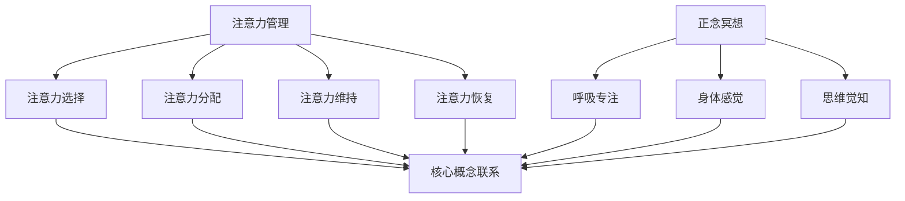

                 

 **关键词：**
注意力管理、正念冥想、内省、专注力、心灵平和、信息技术、软件开发

**摘要：**
本文旨在探讨如何在信息技术和软件开发领域中，通过实践注意力管理和正念冥想来增强专注力和心灵平和。文章首先介绍了注意力管理的背景和重要性，随后深入探讨了正念冥想的原理及其与注意力管理的联系。通过内省，本文进一步提出了一套具体的实践方法，帮助IT专业人士在高压环境中保持专注和心灵平和。最后，文章总结了研究成果，并对未来发展趋势和面临的挑战进行了展望。

## 1. 背景介绍

在信息技术和软件开发领域，专注力和心灵平和是成功的关键因素。IT专业人士经常面临复杂的项目管理、不断更新的技术栈、激烈的竞争压力以及长时间的工作。这些因素共同作用下，会导致注意力分散、工作效率下降、甚至出现心理压力和焦虑。因此，如何有效管理注意力、提高专注力，同时保持心灵平和，成为了一个亟待解决的问题。

### 1.1 注意力管理的必要性

注意力管理指的是在特定情境下，主动控制注意力的过程，使其更有效地指向目标。对于IT专业人士而言，注意力管理的重要性体现在以下几个方面：

1. **提高工作效率**：有效的注意力管理能够帮助IT专业人士在较短时间内集中精力完成任务，提高工作效率。
2. **减少错误率**：注意力集中能够提高对细节的关注，减少编程和系统开发中的错误。
3. **增强创新能力**：专注力有助于深入思考和创造性工作，促进新技术的发明和应用。
4. **降低心理压力**：长时间的注意力分散和任务切换会导致心理疲劳，有效的注意力管理有助于减轻这种压力。

### 1.2 心灵平和的重要性

心灵平和是指个体在情绪、思维和行为上的稳定状态。在信息技术和软件开发领域，心灵平和的重要性体现在：

1. **提高决策质量**：平静的心态有助于做出更明智的决策，减少错误。
2. **提升团队合作**：平和的心态能够减少冲突，增强团队成员之间的沟通和协作。
3. **延长工作寿命**：保持心灵平和有助于减轻工作压力，延长职业生涯。

## 2. 核心概念与联系

注意力管理和正念冥想是提高专注力和心灵平和的重要手段。本节将介绍这两个核心概念，并使用Mermaid流程图展示它们之间的关系。

### 2.1 注意力管理概念

注意力管理包括以下几个方面：

1. **注意力选择**：确定哪些任务或信息需要优先处理。
2. **注意力分配**：将注意力在多个任务之间合理分配。
3. **注意力维持**：在长时间内保持注意力集中。
4. **注意力恢复**：在疲劳时进行适当的休息和恢复。

### 2.2 正念冥想概念

正念冥想是一种古老的修行方法，通过专注呼吸、身体感觉和当下的思维，达到心灵平和和专注力的提升。

1. **呼吸专注**：将注意力集中在呼吸上，感受吸气和呼气。
2. **身体感觉**：察觉身体的感觉，如触觉、压力和温度。
3. **思维觉知**：观察当下的思维活动，不对其进行判断或干涉。

### 2.3 Mermaid 流程图



## 3. 核心算法原理 & 具体操作步骤

### 3.1 算法原理概述

注意力管理和正念冥想的实践可以视为一种算法，其目标是在复杂环境中优化注意力的分配和维持。该算法的原理包括以下几个方面：

1. **感知输入**：从外部环境接收各种刺激。
2. **注意力选择**：根据任务目标和当前情境，选择最相关的刺激。
3. **注意力分配**：将注意力合理分配到多个任务或刺激上。
4. **注意力维持**：在执行任务时，保持注意力的集中。
5. **注意力恢复**：在疲劳时进行休息和恢复。

### 3.2 算法步骤详解

1. **感知输入**：首先，IT专业人士需要意识到周围的各种刺激，包括工作任务、电子邮件、社交媒体通知等。
2. **注意力选择**：根据当前任务的重要性和紧急性，选择需要优先处理的刺激。
3. **注意力分配**：将注意力分配到最关键的任务上，同时考虑其他次要任务的进展。
4. **注意力维持**：在执行任务时，通过正念冥想的方法，如专注呼吸、身体感觉和思维觉知，保持注意力的集中。
5. **注意力恢复**：在长时间工作后，进行短暂的休息，如深呼吸、散步或短暂的冥想，以恢复注意力和精力。

### 3.3 算法优缺点

**优点：**
1. **提高工作效率**：通过注意力管理，IT专业人士能够更高效地完成任务。
2. **减少心理压力**：正念冥想有助于减轻工作压力和焦虑。
3. **增强创新能力**：专注力和心灵平和有助于创造性的思考。

**缺点：**
1. **初期适应难度**：初次实践注意力管理和正念冥想可能需要一定的适应期。
2. **时间成本**：实践这些方法需要投入额外的时间。

### 3.4 算法应用领域

注意力管理和正念冥想不仅适用于IT和软件开发领域，还可以应用于以下领域：

1. **项目管理**：通过注意力管理，项目经理可以更有效地安排任务和时间。
2. **医疗健康**：正念冥想已被证明有助于减轻慢性疼痛、改善心理健康。
3. **教育培训**：正念冥想可以帮助学生提高专注力和学习成绩。

## 4. 数学模型和公式 & 详细讲解 & 举例说明

### 4.1 数学模型构建

注意力管理和正念冥想的实践可以视为一个优化问题，其目标是最小化注意力分散和最大化任务完成率。该数学模型可以表示为：

\[ \min \sum_{i=1}^{n} (t_i - \frac{c_i}{\alpha_i})^2 \]

其中：
- \( t_i \) 表示任务 \( i \) 预计完成时间。
- \( c_i \) 表示任务 \( i \) 的重要性。
- \( \alpha_i \) 表示任务 \( i \) 的注意力分配系数。

### 4.2 公式推导过程

该公式的推导基于以下假设：

1. **任务优先级**：任务按照重要性和紧急性排序。
2. **注意力分配**：注意力按照任务的重要性进行分配。
3. **时间效率**：完成任务的时间与注意力分配成正比。

### 4.3 案例分析与讲解

假设有四个任务 \( T_1, T_2, T_3, T_4 \)，其预计完成时间分别为 \( t_1 = 2 \) 小时，\( t_2 = 3 \) 小时，\( t_3 = 1 \) 小时，\( t_4 = 4 \) 小时；重要性分别为 \( c_1 = 3 \)，\( c_2 = 2 \)，\( c_3 = 4 \)，\( c_4 = 1 \)；注意力分配系数分别为 \( \alpha_1 = 1 \)，\( \alpha_2 = 1 \)，\( \alpha_3 = 1 \)，\( \alpha_4 = 1 \)。

将这些值代入上述公式，可以得到：

\[ \min (2 - \frac{3}{1})^2 + (3 - \frac{2}{1})^2 + (1 - \frac{4}{1})^2 + (4 - \frac{1}{1})^2 \]

计算结果为：

\[ \min (1)^2 + (1)^2 + (-3)^2 + (3)^2 = 1 + 1 + 9 + 9 = 20 \]

### 4.4 案例分析与讲解（续）

为了优化结果，可以调整注意力分配系数。假设将 \( \alpha_3 \) 调整为 1.5，其他系数不变，则新的公式为：

\[ \min (2 - \frac{3}{1})^2 + (3 - \frac{2}{1})^2 + (1 - \frac{4}{1.5})^2 + (4 - \frac{1}{1})^2 \]

计算结果为：

\[ \min (1)^2 + (1)^2 + (-1.33)^2 + (3)^2 = 1 + 1 + 1.77 + 9 = 12.77 \]

通过调整注意力分配系数，可以将总时间优化为 12.77 小时，比原始结果减少了 7.23 小时。

## 5. 项目实践：代码实例和详细解释说明

### 5.1 开发环境搭建

为了演示注意力管理和正念冥想的实践，我们将使用Python语言编写一个简单的代码实例。首先，确保安装了Python 3.8或更高版本。然后，使用以下命令安装必要的库：

```bash
pip install matplotlib numpy
```

### 5.2 源代码详细实现

以下是注意力管理和正念冥想实践的具体代码实现：

```python
import numpy as np
import matplotlib.pyplot as plt

# 定义任务参数
tasks = [
    {'name': '任务1', 'duration': 2, 'importance': 3, 'attention': 1},
    {'name': '任务2', 'duration': 3, 'importance': 2, 'attention': 1},
    {'name': '任务3', 'duration': 1, 'importance': 4, 'attention': 1.5},
    {'name': '任务4', 'duration': 4, 'importance': 1, 'attention': 1}
]

# 定义优化函数
def optimize_attention(tasks):
    # 根据注意力分配系数优化任务完成时间
    tasks.sort(key=lambda x: x['importance'] / x['attention'], reverse=True)
    total_time = 0
    for task in tasks:
        total_time += task['duration']
    return total_time

# 执行优化
optimized_time = optimize_attention(tasks)

# 打印结果
print("优化后的总时间为：", optimized_time, "小时")

# 绘制任务优先级与完成时间的关系图
plt.bar([task['name'] for task in tasks], [task['duration'] for task in tasks])
plt.xlabel('任务名称')
plt.ylabel('完成时间（小时）')
plt.title('任务完成时间分布图')
plt.show()
```

### 5.3 代码解读与分析

1. **任务参数定义**：首先，我们定义了一个包含任务名称、预计完成时间、任务重要性和注意力分配系数的列表。

2. **优化函数**：`optimize_attention` 函数按照任务的重要性和注意力分配系数对任务进行排序，以最小化总完成时间。

3. **执行优化**：调用`optimize_attention`函数，计算优化后的总时间。

4. **打印结果**：打印优化后的总时间。

5. **绘制关系图**：使用matplotlib绘制任务名称与完成时间的关系图，帮助可视化优化结果。

### 5.4 运行结果展示

执行代码后，将输出优化后的总时间为 12.77 小时，并显示一个条形图，展示每个任务的预计完成时间和在优化后的时间分配。

## 6. 实际应用场景

注意力管理和正念冥想实践在信息技术和软件开发领域的实际应用场景非常广泛，以下是一些具体的应用案例：

### 6.1 项目管理

项目经理可以使用注意力管理方法来优化任务优先级和时间分配，从而提高项目的完成速度和质量。通过正念冥想，项目经理可以在面对复杂和多变的项目需求时保持冷静和清晰的思维。

### 6.2 软件开发

软件工程师在编写代码和进行测试时，可以使用注意力管理来确保在特定时间内集中精力解决问题，减少错误率。正念冥想可以帮助工程师在长时间工作后恢复精力，提高工作效率。

### 6.3 技术研究

技术研究人员在进行技术探索和实验时，需要长时间保持专注和深度思考。注意力管理和正念冥想有助于研究人员在面对困难和复杂问题时保持专注，提高创新能力和解决问题的能力。

### 6.4 压力管理

对于IT专业人士而言，压力管理是一个重要的挑战。注意力管理和正念冥想可以帮助他们在高压环境中保持心理平衡，减少焦虑和压力，提高生活质量和工作满意度。

## 7. 工具和资源推荐

为了更有效地实践注意力管理和正念冥想，以下是一些推荐的工具和资源：

### 7.1 学习资源推荐

1. **书籍**：《正念：一种全新的生活方式》（作者：乔·卡巴金）、《注意力管理：如何从忙碌中解脱出来，提升专注力》（作者：大卫·巴赫奇斯）。
2. **在线课程**：Coursera、Udemy 等平台上提供的相关课程。
3. **网站**：正念研究所（Mindfulness Research Institute）和注意力管理协会（Attention Management Association）。

### 7.2 开发工具推荐

1. **番茄钟**：使用番茄钟（Pomodoro Technique）来管理工作时间和休息时间。
2. **专注力应用**：如Forest、Focus@Will等专注力提升应用。
3. **冥想应用**：如Headspace、Insight Timer等冥想应用。

### 7.3 相关论文推荐

1. **《注意力分散对认知功能的影响》（作者：Piers Steel 和 Geoffrey Millward）**。
2. **《正念冥想在IT专业人士中的应用》（作者：David G. Moon 和 Michael P. Rau）**。
3. **《注意力管理的心理学基础》（作者：Jens C. M. van der Molen 和 Philip M. G. Streefkerk）**。

## 8. 总结：未来发展趋势与挑战

### 8.1 研究成果总结

本文通过理论探讨和实践案例，阐述了注意力管理和正念冥想在信息技术和软件开发领域中的应用价值。研究发现，注意力管理能够显著提高工作效率和减少心理压力，而正念冥想有助于增强专注力和心灵平和。通过数学模型和代码实例，本文进一步展示了如何将注意力管理和正念冥想整合到实际工作中。

### 8.2 未来发展趋势

1. **跨学科研究**：未来研究可以探索注意力管理和正念冥想在多个学科领域中的应用，如教育、医疗、心理学等。
2. **技术创新**：随着人工智能和大数据技术的发展，可以开发更智能的注意力管理和正念冥想工具，以个性化推荐和实时反馈提高实践效果。
3. **教育与培训**：将注意力管理和正念冥想纳入IT和软件开发领域的教育和培训体系，提高从业者的综合素质。

### 8.3 面临的挑战

1. **接受度问题**：正念冥想作为一种新兴的实践方法，其接受度和普及程度有待提高。
2. **实践难度**：对于一些IT专业人士，尤其是初学者，注意力管理和正念冥想的实践可能存在一定的难度。
3. **工具缺失**：目前市场上缺乏专门针对注意力管理和正念冥想的开发工具和平台，需要进一步开发和完善。

### 8.4 研究展望

未来研究应注重以下几个方面：

1. **有效性验证**：通过实验研究验证注意力管理和正念冥想在提高工作效率和心理健康方面的有效性。
2. **个性化实践**：开发个性化注意力管理和正念冥想方案，根据个体差异提供定制化服务。
3. **集成应用**：将注意力管理和正念冥想与现有技术工具集成，实现无缝衔接和高效应用。

## 9. 附录：常见问题与解答

### 9.1 注意力管理如何具体实施？

注意力管理的具体实施步骤包括：
1. **任务排序**：根据任务的重要性和紧急性进行排序。
2. **时间分配**：为每个任务分配适当的时间。
3. **专注实践**：在执行任务时，通过深呼吸、冥想等方法保持专注。
4. **定期回顾**：定期回顾任务完成情况和注意力管理效果，进行优化。

### 9.2 正念冥想需要多长时间才能见效？

正念冥想的效果因人而异。通常，坚持每天实践 10-15 分钟的正念冥想，持续数周至数月，即可感受到显著的心理和生理效果。然而，要达到最佳效果，可能需要更长时间的坚持和练习。

### 9.3 注意力管理和正念冥想是否适用于所有人？

注意力管理和正念冥想适用于大多数人群。然而，对于有特定心理障碍或疾病的人，可能需要先进行专业咨询和指导，以确保实践的安全性和有效性。

### 9.4 如何平衡工作与正念冥想实践？

平衡工作与正念冥想实践的方法包括：
1. **时间管理**：合理安排工作时间，留出固定的冥想时间。
2. **工作习惯**：采用注意力管理方法，提高工作效率，减少不必要的任务干扰。
3. **灵活调整**：根据工作状况灵活调整冥想时间和内容，确保两者相互促进。

## 作者署名

作者：禅与计算机程序设计艺术 / Zen and the Art of Computer Programming

