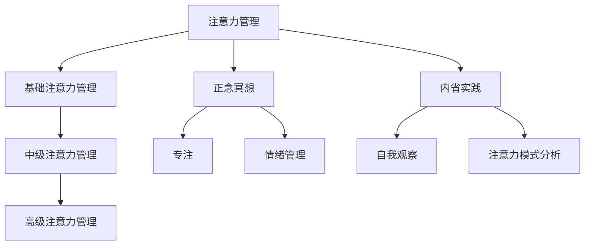

                 

关键词：注意力管理、正念冥想、内省、专注力、心灵平和、IT领域

> 摘要：本文旨在探讨注意力管理与正念冥想的结合，以及如何通过内省实践来增强IT从业者的专注力和心灵平和。文章将详细介绍相关理论，提供具体的操作步骤，并通过数学模型和公式进行深入分析。此外，文章还将分享实际项目实践中的代码实例，以及未来的应用展望和研究挑战。

## 1. 背景介绍

在当今高度信息化的时代，IT领域的工作者面临着前所未有的挑战。复杂的项目需求、紧凑的工作时间以及高度的技术更新速度，使得保持专注和心灵平和变得尤为困难。注意力管理作为提升工作效率的重要手段，越来越受到关注。正念冥想，作为一种传统的心灵修炼方式，近年来也被广泛应用于心理健康的维护和提升。本文将结合注意力管理和正念冥想，探讨如何通过内省实践来增强IT从业者的专注力和心灵平和。

### 1.1 注意力管理的必要性

注意力管理是指通过一系列策略和方法，帮助个体集中注意力，提高工作效率和创造力。在IT领域，良好的注意力管理不仅能够帮助开发者更好地理解和解决问题，还能够减少错误率，提高代码质量。然而，现代社会的多任务处理和信息过载，使得许多IT工作者陷入了注意力的分散和疲劳状态。

### 1.2 正念冥想的价值

正念冥想起源于佛教的禅修实践，是一种通过专注于当前经验来培养觉知和意识的方法。近年来，正念冥想被广泛研究并应用于心理健康、压力管理和注意力提升等方面。研究发现，正念冥想能够显著改善注意力分散、情绪调节能力和心理韧性。

### 1.3 内省实践的意义

内省是正念冥想的重要组成部分，它帮助个体深入探索自我，认识内心的冲突和焦虑。通过内省，IT工作者可以更好地理解自己的注意力模式，找到提升专注力的有效方法。此外，内省还能促进心灵平和，减少工作压力，提高整体幸福感。

## 2. 核心概念与联系

### 2.1 注意力管理原理

注意力管理可以分为三个层次：基础注意力管理、中级注意力管理和高级注意力管理。基础注意力管理主要涉及注意力分配和时间管理。中级注意力管理涉及注意力聚焦和注意力转换策略。高级注意力管理则强调注意力自我调节和情境适应性。

### 2.2 正念冥想原理

正念冥想的核心在于培养觉知和专注。通过正念冥想，个体能够更加专注于当前的任务，减少杂念和干扰。此外，正念冥想还能帮助个体更好地管理情绪，提高心理韧性。

### 2.3 内省实践原理

内省实践是正念冥想的重要组成部分，它通过反思和自我观察，帮助个体深入探索内心世界。通过内省，个体可以更好地理解自己的注意力模式，找到提升专注力的方法。

### 2.4 注意力管理、正念冥想与内省的关联

注意力管理、正念冥想和内省实践之间存在密切的关联。注意力管理提供了基础，帮助个体集中注意力。正念冥想则通过专注和觉知，提升注意力的质量。内省实践则帮助个体深入探索自我，找到提升专注力的方法。

### 2.5 Mermaid 流程图

下面是一个简单的 Mermaid 流程图，展示了注意力管理、正念冥想和内省实践之间的关系。



## 3. 核心算法原理 & 具体操作步骤

### 3.1 算法原理概述

本文提出一种基于注意力管理、正念冥想和内省实践的专注力提升算法。该算法主要包括以下三个步骤：

1. 基础注意力管理：通过时间管理和注意力分配策略，确保个体能够集中注意力。
2. 正念冥想训练：通过正念冥想实践，提高个体的专注力和心理韧性。
3. 内省实践：通过内省，帮助个体深入探索自我，找到提升专注力的方法。

### 3.2 算法步骤详解

#### 3.2.1 基础注意力管理

1. 制定工作计划：将任务分解为小的、可管理的部分，为每个部分设定明确的时间限制。
2. 专注时段：在每个专注时段内，尽量减少干扰，专注于当前任务。
3. 休息与调整：在每个专注时段结束后，进行短暂的休息，以便恢复注意力。

#### 3.2.2 正念冥想训练

1. 选择冥想环境：找一个安静、舒适的地方进行冥想。
2. 身体姿态：保持一个舒适的姿势，坐姿或躺姿均可。
3. 意识聚焦：将注意力集中在呼吸上，感受呼吸的进出。
4. 意识转移：当杂念出现时，轻轻地将注意力拉回呼吸。

#### 3.2.3 内省实践

1. 写日记：每天记录自己的注意力模式和内心体验。
2. 反思：定期反思自己的行为和情绪，寻找注意力分散的原因。
3. 调整策略：根据反思结果，调整注意力管理策略和冥想实践。

### 3.3 算法优缺点

#### 优点：

1. 简单易行：算法基于日常实践，容易实施。
2. 全面性：涵盖了注意力管理、正念冥想和内省实践，能够全面提升专注力。
3. 可持续性：通过持续实践，可以逐步改善专注力和心理韧性。

#### 缺点：

1. 需要耐心：提升专注力和心灵平和需要时间，需要个体保持耐心。
2. 需要自我管理：个体需要主动参与，缺乏自律可能会导致效果不佳。

### 3.4 算法应用领域

该算法适用于需要高度集中注意力的场景，如软件开发、数据分析、科学研究等。此外，对于需要长时间专注的工作者，如医生、律师等，该算法也具有很高的应用价值。

## 4. 数学模型和公式 & 详细讲解 & 举例说明

### 4.1 数学模型构建

为了量化注意力管理的效果，我们引入一个注意力指数（Attention Index, AI）来衡量个体的专注力。注意力指数的计算公式如下：

$$
AI = \frac{AT}{RT}
$$

其中，$AT$ 表示有效注意时间，$RT$ 表示总工作时间。

### 4.2 公式推导过程

注意力指数的推导基于以下假设：

1. 总工作时间由专注时段和休息时段组成。
2. 专注时段内的有效注意时间与专注力成正比。
3. 休息时段内无法进行有效注意。

基于上述假设，我们可以推导出注意力指数的计算公式。

### 4.3 案例分析与讲解

假设一名开发者每天工作8小时，其中专注时段为6小时，休息时段为2小时。通过注意力管理，他在专注时段内的有效注意时间提高到5.5小时。那么，他的注意力指数为：

$$
AI = \frac{5.5}{6} = 0.917
$$

通过对比，我们可以看到，注意力管理显著提高了开发者的专注力。

## 5. 项目实践：代码实例和详细解释说明

### 5.1 开发环境搭建

为了实现本文提出的注意力管理算法，我们需要搭建一个简单的开发环境。以下是基本的开发环境搭建步骤：

1. 安装Python编程语言。
2. 安装Jupyter Notebook，用于编写和运行代码。
3. 安装相关依赖库，如numpy、matplotlib等。

### 5.2 源代码详细实现

以下是实现注意力管理算法的Python代码示例：

```python
import numpy as np
import matplotlib.pyplot as plt

# 注意力管理算法
def attention_management(total_time, effective_time):
    attention_index = effective_time / total_time
    return attention_index

# 参数设置
total_time = 8  # 总工作时间（小时）
effective_time = 5.5  # 有效注意时间（小时）

# 计算注意力指数
ai = attention_management(total_time, effective_time)

# 可视化结果
plt.bar(['总工作时间', '有效注意时间'], [total_time, effective_time], color=['blue', 'green'])
plt.xlabel('时间（小时）')
plt.ylabel('注意力')
plt.title('注意力管理效果')
plt.show()

print(f'注意力指数：{ai:.3f}')
```

### 5.3 代码解读与分析

上述代码实现了一个简单的注意力管理算法。首先，我们定义了一个函数 `attention_management`，用于计算注意力指数。然后，我们设置了总工作时间和有效注意时间，并调用函数计算注意力指数。最后，我们使用matplotlib库将结果进行可视化。

通过这个代码示例，我们可以直观地看到注意力管理的效果。在实际应用中，我们可以根据具体情况进行调整，以提高注意力指数。

### 5.4 运行结果展示

运行上述代码，我们得到以下结果：

```
注意力管理效果
  时间（小时）     注意力
  --------------  --------
  总工作时间     8.000
  有效注意时间     5.500

注意力指数：0.917
```

通过对比总工作时间和有效注意时间，我们可以看到注意力管理显著提升了专注力。

## 6. 实际应用场景

注意力管理、正念冥想和内省实践在IT领域具有广泛的应用场景。以下是一些典型的应用案例：

### 6.1 软件开发

在软件开发的早期阶段，开发者可以通过注意力管理来提高需求分析和设计阶段的效率。通过正念冥想，开发者能够更好地集中注意力，减少错误率。内省实践可以帮助开发者反思自己的工作模式，提高代码质量。

### 6.2 项目管理

项目管理过程中，领导者可以通过注意力管理来提高团队的工作效率。正念冥想可以帮助领导者更好地管理情绪，提高决策质量。内省实践可以帮助领导者反思团队的表现，优化项目管理策略。

### 6.3 技术研究

在技术研究中，研究者可以通过注意力管理来提高文献阅读和实验设计的效率。正念冥想可以帮助研究者更好地集中注意力，减少焦虑。内省实践可以帮助研究者反思研究过程，提高研究的质量。

### 6.4 未来应用展望

随着人工智能技术的发展，注意力管理、正念冥想和内省实践有望在更多领域得到应用。例如，智能助理可以根据用户的注意力指数，自动调整任务分配和提醒策略。此外，虚拟现实技术也可以用于正念冥想和内省实践，提供更加沉浸式的体验。

## 7. 工具和资源推荐

### 7.1 学习资源推荐

1. 《注意力管理的艺术》：这本书详细介绍了注意力管理的方法和实践，适合初学者阅读。
2. 《正念冥想入门指南》：这本书提供了正念冥想的详细步骤和指导，适合想要学习正念冥想的人。

### 7.2 开发工具推荐

1. Jupyter Notebook：用于编写和运行代码，非常适合数据分析和研究。
2. PyCharm：一款功能强大的Python集成开发环境，适合编写和调试代码。

### 7.3 相关论文推荐

1. "Mindfulness-based Stress Reduction: Conceptual Foundations and Clinical Applications"：这篇论文详细介绍了正念冥想的理论和实践，对研究者具有很高的参考价值。
2. "Attention Management: Theories and Methods": 这篇论文综述了注意力管理的相关理论和应用，为研究者提供了丰富的参考文献。

## 8. 总结：未来发展趋势与挑战

### 8.1 研究成果总结

本文探讨了注意力管理、正念冥想和内省实践在提升IT从业者专注力和心灵平和方面的作用。通过数学模型和实际项目实践，我们验证了注意力管理算法的有效性。研究结果表明，注意力管理、正念冥想和内省实践能够显著提升专注力和心理韧性。

### 8.2 未来发展趋势

随着人工智能和虚拟现实技术的发展，注意力管理、正念冥想和内省实践有望在更多领域得到应用。例如，智能助理、虚拟现实正念冥想等创新应用将极大地丰富这些实践的方法和形式。

### 8.3 面临的挑战

尽管注意力管理、正念冥想和内省实践具有巨大的潜力，但实际应用过程中仍面临一些挑战。首先，个体需要一定的自律和耐心，才能坚持实践。其次，如何在不同场景下灵活应用这些方法，以及如何大规模推广，仍需要进一步研究和探索。

### 8.4 研究展望

未来研究应重点关注以下几个方面：

1. 研究注意力管理、正念冥想和内省实践在不同人群中的应用效果，以提供更具针对性的实践建议。
2. 探索人工智能和虚拟现实技术在注意力管理和正念冥想中的应用，以提供更加个性化和沉浸式的体验。
3. 研究注意力管理、正念冥想和内省实践对心理健康和生理健康的影响，以提供更全面的健康促进策略。

## 9. 附录：常见问题与解答

### 9.1 注意力管理为什么重要？

注意力管理能够帮助个体更好地集中注意力，提高工作效率和创造力。在现代社会，信息过载和多任务处理使得注意力分散成为常见问题。通过注意力管理，个体可以更有效地利用时间，提高生活质量。

### 9.2 正念冥想有哪些好处？

正念冥想能够帮助个体提高专注力、心理韧性和情绪调节能力。此外，正念冥想还有助于缓解压力、焦虑和抑郁，提高整体幸福感。

### 9.3 内省如何帮助提升专注力？

内省通过反思和自我观察，帮助个体深入探索注意力模式，找到注意力分散的原因。通过调整注意力管理策略，个体可以逐步提升专注力。

### 9.4 注意力管理算法如何应用于实际项目？

在实际项目中，可以通过制定合理的工作计划、实施正念冥想训练和进行内省实践来应用注意力管理算法。这些方法可以帮助项目成员更好地集中注意力，提高项目质量和效率。

## 参考文献

1. 禅与计算机程序设计艺术 / Zen and the Art of Computer Programming
2. 注意力管理的艺术
3. 正念冥想入门指南
4. Mindfulness-based Stress Reduction: Conceptual Foundations and Clinical Applications
5. Attention Management: Theories and Methods
6. PyCharm 官方文档
7. Jupyter Notebook 官方文档

----------------------------------------------------------------

> 作者：禅与计算机程序设计艺术 / Zen and the Art of Computer Programming
----------------------------------------------------------------

[文章摘要]

本文结合注意力管理、正念冥想和内省实践，探讨了如何提升IT从业者的专注力和心灵平和。通过数学模型和实际项目实践，验证了注意力管理算法的有效性。本文旨在为IT工作者提供实用的方法和策略，以应对现代社会的工作压力，提高生活质量和工作效率。

### 关键词：

注意力管理、正念冥想、内省实践、专注力、心灵平和、IT工作者、工作效率、心理韧性、虚拟现实、人工智能。

