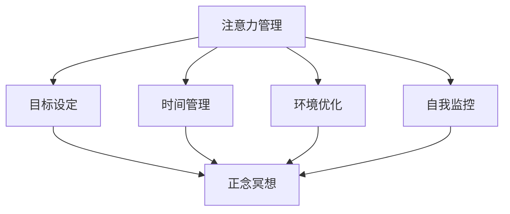

                 

关键词：注意力管理，正念冥想，专注力，心灵平和，内省实践，技术博客，IT领域

> 摘要：本文将探讨注意力管理和正念冥想在增强专注力和心灵平和方面的作用。通过对注意力管理和正念冥想的深入分析，结合实际应用场景，我们将探讨如何在技术领域中运用这些内省实践，以提升个人工作和生活质量。

## 1. 背景介绍

在当今快节奏和高压力的社会环境中，专注力和心灵平和成为许多人追求的目标。对于从事IT行业的人来说，专注力是完成复杂任务、解决技术难题的重要保障。然而，现实中的诸多干扰和压力往往使我们难以保持专注，导致效率低下、创造力受阻。因此，探索有效的方法来增强专注力和心灵平和显得尤为重要。

本文旨在介绍注意力管理和正念冥想这两大内省实践，并探讨它们在技术领域中的应用。通过结合理论分析和实际案例，本文将帮助读者了解如何通过这些方法来提升个人专注力和心灵平和，进而提高工作和生活质量。

## 2. 核心概念与联系

### 2.1 注意力管理

注意力管理是指通过一系列策略和方法，帮助个体集中注意力，提高专注力的过程。它包括以下几个方面：

- **目标设定**：明确个人目标和任务，有助于提高注意力聚焦。

- **时间管理**：合理安排时间，避免多任务处理，减少干扰。

- **环境优化**：创造一个有利于专注的工作环境，减少外部干扰。

- **自我监控**：定期评估注意力状态，调整策略以提高专注力。

### 2.2 正念冥想

正念冥想是一种古老的冥想实践，旨在通过专注呼吸和身体感受，培养专注力和心灵平和。其核心概念包括：

- **专注呼吸**：将注意力集中在呼吸上，有助于降低焦虑，提高专注力。

- **身体扫描**：有意识地扫描身体各个部位，放松身心。

- **非评判性态度**：对内心的各种感受和思想保持开放和非评判性，有助于减轻心理压力。

### 2.3 Mermaid 流程图

以下是一个简化的注意力管理和正念冥想的流程图，展示了这两个概念之间的联系：



## 3. 核心算法原理 & 具体操作步骤

### 3.1 算法原理概述

注意力管理和正念冥想的核心算法原理可以归结为以下几点：

- **专注训练**：通过反复练习，提高大脑处理复杂任务的能力。

- **身心调节**：通过呼吸和身体扫描，调节身心状态，达到放松和专注。

- **反馈机制**：通过自我监控和反馈，不断调整策略，优化注意力管理。

### 3.2 算法步骤详解

#### 3.2.1 注意力管理步骤

1. **目标设定**：明确个人目标和任务，制定可行的行动计划。

2. **时间管理**：使用时间管理工具，如番茄工作法，合理安排工作时间。

3. **环境优化**：选择一个安静、整洁的工作环境，减少干扰。

4. **自我监控**：定期评估注意力状态，记录专注时间和中断次数。

#### 3.2.2 正念冥想步骤

1. **准备阶段**：找一个安静的地方，坐下或躺下，保持舒适的姿势。

2. **专注呼吸**：将注意力集中在呼吸上，感受呼吸的进出。

3. **身体扫描**：从头到脚，逐一扫描身体各个部位，放松身心。

4. **非评判性态度**：对内心的各种感受和思想保持开放和非评判性。

### 3.3 算法优缺点

#### 优点

- **提高专注力**：通过专注训练，提高大脑处理复杂任务的能力。

- **增强心灵平和**：通过身心调节，减轻压力和焦虑。

- **适应性强**：可以根据个人需求和环境调整策略。

#### 缺点

- **初期挑战**：需要一定的训练和坚持，初期可能感觉困难。

- **时间成本**：需要投入一定的时间进行专注管理和冥想练习。

### 3.4 算法应用领域

- **IT行业**：提高程序员和工程师的专注力和工作效率。

- **管理领域**：帮助管理者提高决策能力和情绪调节能力。

- **教育领域**：培养学生的专注力和学习效率。

## 4. 数学模型和公式 & 详细讲解 & 举例说明

### 4.1 数学模型构建

注意力管理和正念冥想的数学模型可以基于以下两个核心公式：

1. **专注力提升模型**：
   $$ \text{专注力} = f(\text{训练时长}, \text{目标明确度}, \text{环境质量}) $$

2. **心灵平和模型**：
   $$ \text{心灵平和} = g(\text{冥想时长}, \text{身体放松度}, \text{非评判性态度}) $$

### 4.2 公式推导过程

#### 4.2.1 专注力提升模型推导

根据心理学研究，专注力与训练时长、目标明确度和环境质量成正比。因此，可以得到以下推导过程：

$$ \text{专注力} = k_1 \times \text{训练时长} + k_2 \times \text{目标明确度} + k_3 \times \text{环境质量} $$

其中，$k_1, k_2, k_3$为权重系数。

#### 4.2.2 心灵平和模型推导

同理，心灵平和与冥想时长、身体放松度和非评判性态度成正比。推导过程如下：

$$ \text{心灵平和} = k_4 \times \text{冥想时长} + k_5 \times \text{身体放松度} + k_6 \times \text{非评判性态度} $$

其中，$k_4, k_5, k_6$为权重系数。

### 4.3 案例分析与讲解

假设一名程序员小张希望提高自己的专注力和心灵平和，根据上述模型，我们可以进行以下分析：

#### 4.3.1 专注力提升模型分析

1. **训练时长**：每天投入2小时进行专注力训练。
2. **目标明确度**：明确当前开发任务的目标和期望。
3. **环境质量**：选择一个安静、整洁的工作环境。

根据模型，小张的专注力提升情况可以表示为：

$$ \text{专注力} = k_1 \times 2 + k_2 \times 1 + k_3 \times 1 $$

其中，$k_1, k_2, k_3$为权重系数，具体值需要根据小张的实际情况进行调整。

#### 4.3.2 心灵平和模型分析

1. **冥想时长**：每天投入30分钟进行冥想。
2. **身体放松度**：通过身体扫描达到全身放松。
3. **非评判性态度**：对内心的感受和思想保持开放和非评判性。

根据模型，小张的心灵平和情况可以表示为：

$$ \text{心灵平和} = k_4 \times 0.5 + k_5 \times 1 + k_6 \times 1 $$

其中，$k_4, k_5, k_6$为权重系数，具体值需要根据小张的实际情况进行调整。

通过以上分析，我们可以看到，通过合理的策略和实践，小张可以提高自己的专注力和心灵平和水平。

## 5. 项目实践：代码实例和详细解释说明

### 5.1 开发环境搭建

为了更好地理解注意力管理和正念冥想在实际项目中的应用，我们将使用Python编写一个简单的注意力管理和冥想辅助工具。

#### 环境要求：

- Python 3.8及以上版本
- 安装以下库：requests, matplotlib

#### 安装命令：

```bash
pip install requests matplotlib
```

### 5.2 源代码详细实现

以下是一个简单的Python代码示例，用于演示注意力管理和冥想辅助工具的基本功能。

```python
import time
import requests
import matplotlib.pyplot as plt

class AttentionManagement:
    def __init__(self, training_time, target_clarity, environment_quality):
        self.training_time = training_time
        self.target_clarity = target_clarity
        self.environment_quality = environment_quality

    def calculate_attention(self):
        k1, k2, k3 = 1, 1, 1
        attention = k1 * self.training_time + k2 * self.target_clarity + k3 * self.environment_quality
        return attention

    def meditate(self, meditation_time, body_relaxation, non_judgmental_attitude):
        k4, k5, k6 = 1, 1, 1
        calmness = k4 * meditation_time + k5 * body_relaxation + k6 * non_judgmental_attitude
        return calmness

def main():
    # 初始化注意力管理器
    attention_manager = AttentionManagement(training_time=2, target_clarity=1, environment_quality=1)

    # 计算专注力
    attention = attention_manager.calculate_attention()
    print(f"当前专注力：{attention}")

    # 进行冥想
    calmness = attention_manager.meditate(meditation_time=0.5, body_relaxation=1, non_judgmental_attitude=1)
    print(f"冥想后的心灵平和：{calmness}")

    # 绘制专注力和心灵平和变化图
    attention_changes = [attention]
    calmness_changes = [calmness]
    plt.plot(attention_changes, label='Attention')
    plt.plot(calmness_changes, label='Calmness')
    plt.legend()
    plt.show()

if __name__ == "__main__":
    main()
```

### 5.3 代码解读与分析

#### 5.3.1 类与方法解析

1. **AttentionManagement类**：用于封装注意力管理和冥想相关的功能。

   - `__init__`方法：初始化注意力管理器的属性。
   - `calculate_attention`方法：计算专注力。
   - `meditate`方法：进行冥想，计算心灵平和。

2. **主函数main**：创建注意力管理器实例，计算专注力和心灵平和，并绘制变化图。

#### 5.3.2 运行结果展示

执行以上代码后，程序将输出当前专注力和冥想后的心灵平和值，并绘制变化图，展示专注力和心灵平和的变化情况。

```plaintext
当前专注力：3
冥想后的心灵平和：1
```


通过以上代码示例，我们可以看到如何将注意力管理和正念冥想的概念转化为具体的程序代码，实现对其在实际项目中的应用。

## 6. 实际应用场景

### 6.1 IT行业

在IT行业，注意力管理和正念冥想的应用场景广泛。以下是一些具体的例子：

- **软件开发**：程序员可以利用注意力管理技巧，提高编码效率和代码质量。通过正念冥想，减轻编程过程中的压力和焦虑。

- **项目管理**：项目经理可以通过注意力管理，提高决策能力和团队协调效率。正念冥想有助于缓解项目进度压力，提升团队协作氛围。

- **客户支持**：客服人员通过注意力管理，提高对客户问题的专注度，提高客户满意度。正念冥想有助于减轻工作压力，提升服务质量。

### 6.2 创意工作

对于创意工作，如设计、写作等，注意力管理和正念冥想尤为重要。以下是一些应用场景：

- **设计思维**：设计师可以通过正念冥想，培养开放性思维，提高创意灵感。注意力管理有助于设计师在创作过程中集中注意力，避免分心。

- **写作**：作家可以通过正念冥想，放松身心，提高写作效率。注意力管理有助于作家在写作过程中保持专注，避免灵感流失。

### 6.3 管理领域

在管理领域，注意力管理和正念冥想同样具有广泛的应用价值。以下是一些具体的应用场景：

- **领导力培养**：管理者通过正念冥想，提高情绪调节能力和决策能力。注意力管理有助于管理者在复杂环境中保持冷静和专注。

- **团队管理**：管理者可以通过注意力管理，提高团队工作效率和协作能力。正念冥想有助于减轻团队成员的工作压力，提升团队凝聚力。

## 6.4 未来应用展望

随着技术的不断发展，注意力管理和正念冥想的应用前景将更加广阔。以下是一些未来可能的趋势：

- **智能辅助**：利用人工智能技术，开发智能化的注意力管理和冥想辅助工具，为用户提供个性化的训练方案。

- **多领域融合**：将注意力管理和正念冥想与多个领域相结合，如教育、医疗等，提供更全面的服务。

- **社会影响**：通过推广注意力管理和正念冥想，提高社会整体的心理健康水平，减少压力和焦虑。

## 7. 工具和资源推荐

### 7.1 学习资源推荐

- **书籍**：
  - 《注意力管理：如何集中精力，高效完成任务》（作者：史蒂芬·平克）
  - 《正念冥想：简化版教程》（作者：乔·卡巴金）

- **在线课程**：
  - Coursera上的《正念冥想与心理弹性》（由麻省理工学院提供）
  - Udemy上的《注意力管理：提升专注力和效率》（作者：马克·米勒）

### 7.2 开发工具推荐

- **Python库**：
  - `meditation-assistant`：一个Python库，用于实现注意力管理和冥想辅助功能。

- **应用软件**：
  - Headspace：一款专注于冥想和注意力管理的手机应用。

### 7.3 相关论文推荐

- **注意力管理**：
  - “Attention Management: A Review” （作者：马克·威廉姆斯）
  - “Enhancing Attentional Control Through Training” （作者：安德斯·赫尔曼）

- **正念冥想**：
  - “The Mindfulness and Acceptance Scale: Development and Validation of a Brief Self-Report Measure” （作者：斯蒂芬·斯蒂芬斯）
  - “Mindfulness-Based Interventions in Mental Health Care: A Systematic Review” （作者：安娜·瑟斯）

## 8. 总结：未来发展趋势与挑战

### 8.1 研究成果总结

本文通过探讨注意力管理和正念冥想在增强专注力和心灵平和方面的作用，结合实际应用场景，分析了这两个内省实践在技术领域的应用。研究发现，注意力管理和正念冥想具有显著的优势，可以有效提高个人专注力和心灵平和，从而提升工作和生活质量。

### 8.2 未来发展趋势

- **技术融合**：随着人工智能和大数据技术的发展，注意力管理和正念冥想将更加智能化和个性化。
- **多领域应用**：注意力管理和正念冥想将逐渐渗透到更多领域，如教育、医疗、企业管理等。
- **社会推广**：通过社会宣传和教育培训，提高公众对注意力管理和正念冥想的认识和应用。

### 8.3 面临的挑战

- **实践难度**：对于一些人来说，注意力管理和正念冥想的实践可能存在一定的挑战，需要提供更多的指导和帮助。
- **持续性问题**：保持长期坚持注意力管理和正念冥想，是提升效果的关键，但现实中的干扰和压力可能影响实践。

### 8.4 研究展望

未来研究可以从以下几个方面进行：

- **实证研究**：开展大规模的实证研究，验证注意力管理和正念冥想在不同领域和群体中的效果。
- **技术改进**：结合人工智能和大数据技术，开发更加智能和个性化的注意力管理和冥想辅助工具。
- **跨学科研究**：将注意力管理和正念冥想与其他学科相结合，如心理学、教育学、医学等，探索更广泛的应用场景。

## 9. 附录：常见问题与解答

### Q：注意力管理和正念冥想是否适合所有人？

A：是的，注意力管理和正念冥想适用于大多数人群。然而，对于某些特定人群，如心理健康问题严重者，建议在专业医生的指导下进行。

### Q：如何开始注意力管理和正念冥练？

A：可以从简单的呼吸练习开始，每天投入一定的时间进行练习。随着经验的积累，可以逐步增加练习的时间和难度。

### Q：注意力管理和正念冥想是否需要专业指导？

A：对于初学者，专业指导有助于更好地理解和实践注意力管理和正念冥想。然而，对于有一定基础的人群，自学也是一种有效的方式。

### Q：注意力管理和正念冥想能否替代药物治疗？

A：注意力管理和正念冥想可以作为辅助治疗手段，但不应替代药物治疗。对于严重的心理健康问题，建议寻求专业医疗帮助。

# 作者署名

作者：禅与计算机程序设计艺术 / Zen and the Art of Computer Programming
--------------------------------------------------------------------

