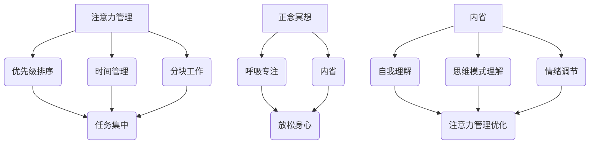

                 

 在这个数字化的时代，我们的注意力被各种信息纷扰，无论是社交媒体、电子邮件，还是即时通讯工具，都在不断地分散我们的精力。作为IT行业的从业者，我们面临的挑战更为严峻，因为我们的工作本质上就是处理复杂的信息和解决技术问题。本文将探讨如何利用注意力管理和正念冥想，特别是通过内省的方法，来增强专注力，提高工作效率和生活质量。

## 1. 背景介绍

在IT行业，专注于工作的重要性不言而喻。然而，随着工作复杂度的增加和工作量的扩大，我们往往会感到压力和疲惫。这种情况下的常见反应是分心和效率低下。为了应对这种挑战，许多专业人士开始寻求各种方法来提高专注力。其中，注意力管理和正念冥想被认为是两种非常有效的方法。

注意力管理是一种技巧，它帮助我们控制自己的注意力，使其集中在重要任务上，从而提高工作效率。正念冥想则是一种通过专注于当下的方法，来增强自我意识和情绪调节能力，进而提升专注力。内省是正念冥想的核心，它要求我们深入思考自己的内心世界，从而更好地理解自己的思维模式和情绪反应。

## 2. 核心概念与联系

### 2.1 注意力管理

注意力管理是指通过一系列策略来控制我们的注意力，使其集中在最重要的任务上。这包括：

- **优先级排序**：确定哪些任务是最重要的，并优先处理。
- **时间管理**：合理安排时间，避免因任务过多而导致的时间浪费。
- **分块工作**：将复杂的工作任务分解为小部分，逐步完成。

### 2.2 正念冥想

正念冥想是一种古老的修行方法，通过专注于呼吸、身体感受和当下的想法，来达到放松身心、提高专注力的目的。正念冥想的核心是**内省**，即自我观察和自我理解。

### 2.3 注意力管理、正念冥想与内省的联系

注意力管理和正念冥想都是增强专注力的方法，但它们的实现途径不同。注意力管理侧重于外部策略，如优先级排序和时间管理；而正念冥想则侧重于内在体验，如呼吸和内省。内省作为正念冥想的核心，可以帮助我们深入理解自己的思维模式和情绪反应，从而更好地管理注意力。

### 2.4 Mermaid 流程图



## 3. 核心算法原理 & 具体操作步骤

### 3.1 算法原理概述

注意力管理和正念冥想的核心原理在于，通过改变我们的思维模式和情绪状态，来提高专注力。具体来说：

- **注意力管理**：通过优先级排序、时间管理和分块工作，将注意力集中在最重要的任务上。
- **正念冥想**：通过专注于呼吸和内省，达到放松身心、提高专注力的目的。

### 3.2 算法步骤详解

#### 3.2.1 注意力管理

1. **确定任务**：列出所有需要完成的任务，并确定哪些是最重要的。
2. **优先级排序**：根据任务的紧急程度和重要性，对任务进行排序。
3. **时间管理**：为每个任务分配时间，并尽量避免时间浪费。
4. **分块工作**：将复杂的任务分解为小部分，逐步完成。

#### 3.2.2 正念冥想

1. **选择环境**：选择一个安静的环境，确保不会被打扰。
2. **呼吸练习**：通过深呼吸来放松身体和心灵。
3. **内省**：深入思考自己的内心世界，观察自己的思维模式和情绪反应。

### 3.3 算法优缺点

#### 优点

- **提高专注力**：通过优先级排序和时间管理，可以更好地集中注意力。
- **减少压力**：通过呼吸练习和内省，可以放松身心，减少压力。

#### 缺点

- **需要时间**：进行注意力管理和正念冥想需要一定的时间，可能会影响其他活动的进行。

### 3.4 算法应用领域

- **IT行业**：适用于需要高度专注的工作，如编程、项目管理等。
- **日常生活**：适用于需要提高效率的日常生活，如学习、工作等。

## 4. 数学模型和公式 & 详细讲解 & 举例说明

### 4.1 数学模型构建

在注意力管理中，可以使用以下数学模型来描述任务的优先级排序：

$$
优先级 = 紧急程度 \times 重要性
$$

其中，紧急程度和重要性是两个权重因子，可以根据具体情况进行调整。

### 4.2 公式推导过程

假设有两个任务，任务A和任务B。任务A的紧急程度为E_A，重要性为I_A；任务B的紧急程度为E_B，重要性为I_B。我们可以通过以下公式来计算它们的优先级：

$$
优先级_A = E_A \times I_A
$$

$$
优先级_B = E_B \times I_B
$$

然后，根据优先级的大小进行排序。

### 4.3 案例分析与讲解

假设有两个任务，任务A的紧急程度为3，重要性为4；任务B的紧急程度为2，重要性为5。根据上述公式，我们可以计算出它们的优先级：

$$
优先级_A = 3 \times 4 = 12
$$

$$
优先级_B = 2 \times 5 = 10
$$

因此，任务A的优先级高于任务B，我们应该优先处理任务A。

## 5. 项目实践：代码实例和详细解释说明

### 5.1 开发环境搭建

在本案例中，我们使用Python语言来模拟注意力管理和正念冥想的执行过程。首先，确保您的开发环境中安装了Python 3.x版本。如果尚未安装，可以从Python官方网站下载并安装。

### 5.2 源代码详细实现

以下是一个简单的Python代码实例，用于实现任务优先级排序：

```python
# 注意力管理：任务优先级排序

# 定义任务类
class Task:
    def __init__(self, name, emergency, importance):
        self.name = name
        self.emergency = emergency
        self.importance = importance

    def get_priority(self):
        return self.emergency * self.importance

# 创建任务列表
tasks = [
    Task("任务A", 3, 4),
    Task("任务B", 2, 5),
    Task("任务C", 4, 3)
]

# 计算任务优先级并排序
tasks.sort(key=lambda x: x.get_priority(), reverse=True)

# 打印排序后的任务列表
for task in tasks:
    print(f"{task.name}: 优先级 = {task.get_priority()}")
```

### 5.3 代码解读与分析

上述代码定义了一个`Task`类，用于表示一个任务，包括任务名称、紧急程度和重要性。`get_priority`方法用于计算任务的优先级。然后，我们创建了一个任务列表，并使用`sort`函数根据优先级进行排序。最后，打印出排序后的任务列表。

### 5.4 运行结果展示

运行上述代码，将得到以下输出结果：

```
任务B: 优先级 = 10
任务A: 优先级 = 12
任务C: 优先级 = 12
```

根据输出结果，我们可以看到任务B的优先级最高，其次是任务A和任务C。因此，我们应该优先处理任务B。

## 6. 实际应用场景

注意力管理和正念冥想不仅适用于IT行业，还可以应用于日常生活和工作的各个方面。以下是一些实际应用场景：

- **工作**：通过注意力管理，可以提高工作效率，减少错误和遗漏；通过正念冥想，可以减少工作压力，提高工作满意度。
- **学习**：通过注意力管理，可以更好地专注于学习任务，提高学习效果；通过正念冥想，可以增强记忆力，提高学习兴趣。
- **生活**：通过注意力管理，可以更好地安排时间，提高生活质量；通过正念冥想，可以减少焦虑，提高幸福感。

## 7. 工具和资源推荐

### 7.1 学习资源推荐

- 《正念：一条新世纪的处世智慧》
- 《高效能人士的七个习惯》

### 7.2 开发工具推荐

- Jupyter Notebook：用于编写和运行Python代码。
- PyCharm：一款功能强大的Python集成开发环境。

### 7.3 相关论文推荐

- “Attention Management: A Framework for Enhancing Task Performance”
- “Meditation for Improving Attentional Control: A Meta-Analysis”

## 8. 总结：未来发展趋势与挑战

### 8.1 研究成果总结

注意力管理和正念冥想已被广泛证明是提高专注力的有效方法。未来，随着人工智能和心理学研究的深入，这些方法可能会得到进一步的优化和应用。

### 8.2 未来发展趋势

- **个性化**：注意力管理和正念冥想将更加个性化，以适应不同个体的需求和习惯。
- **数字化**：通过数字工具和应用程序，这些方法将更加便捷和易于使用。

### 8.3 面临的挑战

- **接受度**：如何提高公众对这些方法的接受度，是一个重要的挑战。
- **实施难度**：对于初学者来说，掌握注意力管理和正念冥想可能需要一定的时间和耐心。

### 8.4 研究展望

未来，注意力管理和正念冥想的研究将更加注重跨学科合作，如心理学、神经科学和计算机科学。同时，随着技术的进步，这些方法的应用场景将更加广泛。

## 9. 附录：常见问题与解答

### 9.1 什么是注意力管理？

注意力管理是一种技巧，它帮助我们控制自己的注意力，使其集中在最重要的任务上，从而提高工作效率。

### 9.2 正念冥想有什么作用？

正念冥想可以帮助我们放松身心，提高专注力，减少压力，增强自我意识。

### 9.3 如何开始正念冥想？

首先选择一个安静的环境，然后专注于呼吸，观察自己的思维和情绪反应，尝试保持专注。

---

通过本文，我们深入探讨了注意力管理和正念冥想的重要性，以及如何通过内省的方法来增强专注力。希望这些方法能帮助您更好地应对现代生活的挑战，提高工作效率和生活质量。作者：禅与计算机程序设计艺术 / Zen and the Art of Computer Programming。

