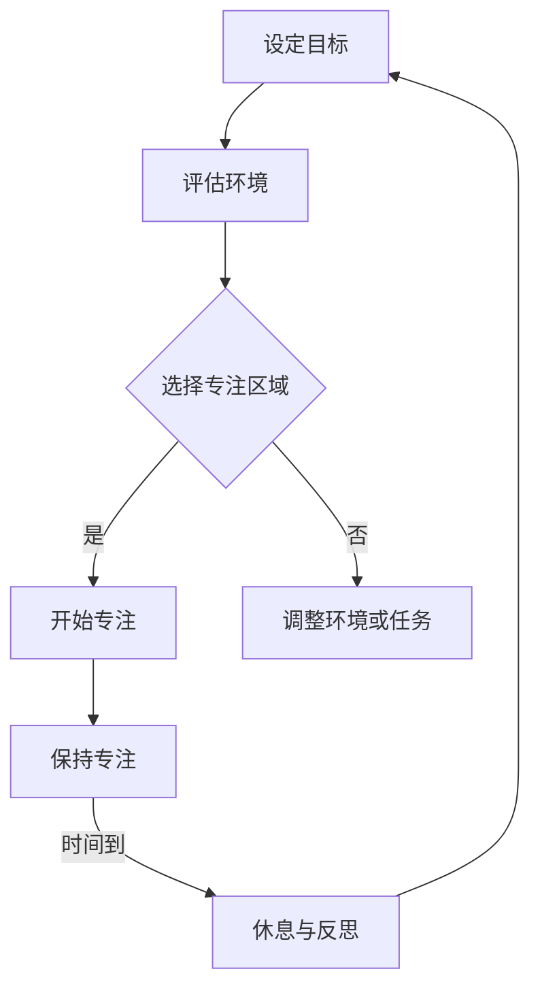
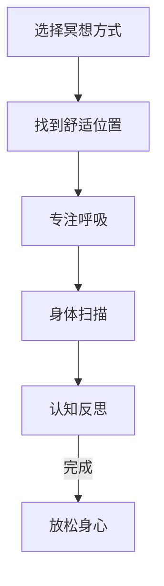

                 

关键词：注意力管理、正念冥想、内省、专注力、心灵健康、IT从业者、程序设计

> 摘要：本文旨在探讨在IT领域从业者的日常生活中，如何通过注意力管理和正念冥想，提升个人的专注力和心灵健康。文章将介绍注意力管理和正念冥想的核心概念，分析其在现代工作中的重要性，并提供具体的实践方法，以期帮助读者在繁忙的计算机编程工作中找到内心的宁静。

## 1. 背景介绍

在当今快速发展的信息技术时代，计算机编程已经成为一项基础而重要的技能。程序员、软件工程师、系统架构师等IT从业者需要处理大量复杂的任务和问题，而这些问题往往要求高度集中注意力和精确的思维能力。然而，现代工作环境中的多任务处理、信息过载和持续的压力，使得许多IT从业者面临专注力下降、焦虑增加和心理健康问题。

注意力管理（Attention Management）和正念冥想（Mindfulness Meditation）作为现代心理学和神经科学的研究成果，提供了一种提升专注力和心灵健康的有效途径。本文将深入探讨这两个概念，并探讨它们在IT工作中的应用。

### 1.1 注意力管理

注意力管理是指通过一系列策略和方法，帮助个体更好地控制和管理自己的注意力资源，以提高工作和学习效率。在IT领域，注意力管理的重要性体现在以下几个方面：

- **减少分心**：IT工作往往需要长时间专注于复杂的问题和任务，而外界环境的干扰和内心的杂念很容易导致分心。
- **提升专注力**：通过注意力管理，IT从业者可以学会如何在面对复杂问题时保持专注，提高解决问题的效率。
- **优化工作节奏**：合理的注意力管理有助于规划工作时间和任务优先级，从而优化工作节奏，避免过度疲劳。

### 1.2 正念冥想

正念冥想是一种古老的修炼方式，其核心是通过专注呼吸、身体扫描和认知反思等练习，帮助个体培养对当前时刻的清晰觉知和接受。正念冥想在IT领域的应用主要体现在以下几个方面：

- **减轻压力**：正念冥想可以帮助IT从业者从压力和焦虑中解脱出来，提高心理韧性。
- **增强专注力**：通过冥想，个体能够更好地控制自己的注意力，提高对任务的关注度。
- **提高决策质量**：正念冥想有助于提升个体的决策能力和创造力，因为冥想能够帮助个体在决策过程中保持冷静和客观。

## 2. 核心概念与联系

### 2.1 注意力管理模型

为了更好地理解注意力管理，我们可以通过一个简单的Mermaid流程图来展示其核心概念和操作步骤：



### 2.2 正念冥想流程图

同样，我们使用Mermaid流程图来展示正念冥想的核心步骤：



这两个流程图展示了注意力管理和正念冥想的基本步骤，它们之间的联系在于，注意力管理可以通过正念冥想来提升个人的专注力和心灵健康。

## 3. 核心算法原理 & 具体操作步骤

### 3.1 算法原理概述

注意力管理的核心在于通过一系列策略来提升个体的专注力。具体来说，可以分为以下几个步骤：

1. **设定目标**：明确当前需要专注的任务或问题。
2. **评估环境**：识别可能干扰专注的内外部因素。
3. **选择专注区域**：根据任务性质和环境情况，确定最有利于专注的区域。
4. **开始专注**：采用正念冥想等方法，集中注意力。
5. **保持专注**：通过定时休息和反思，保持专注的状态。
6. **休息与反思**：休息期间进行反思，评估当前任务的进展和自身的状态。

### 3.2 算法步骤详解

#### 3.2.1 设定目标

在开始任何任务之前，明确目标是非常重要的。这有助于个体在任务执行过程中保持方向感和动力。具体步骤如下：

- **确定具体任务**：例如，编写一段代码、解决一个算法问题等。
- **设定可衡量的目标**：例如，完成代码的50%或解决算法问题的某个子问题。

#### 3.2.2 评估环境

在开始专注之前，需要评估周围环境，以确定是否存在可能干扰专注的因素。例如：

- **噪音**：如果环境中有噪音，考虑使用耳塞或耳机播放轻音乐。
- **视觉干扰**：关闭不必要的屏幕或调整屏幕亮度。
- **心理干扰**：如果内心有杂念，可以通过深呼吸或冥想来平静心情。

#### 3.2.3 选择专注区域

根据任务性质和环境情况，选择最有利于专注的区域。例如：

- **工作区**：确保工作区整洁、有序，减少视觉干扰。
- **图书馆或安静的地方**：如果家庭环境不适合专注，可以考虑去图书馆或安静的咖啡厅。

#### 3.2.4 开始专注

采用正念冥想等方法，集中注意力。具体步骤如下：

- **呼吸练习**：专注于呼吸，感受每一次吸气和呼气。
- **身体扫描**：从头到脚扫描身体，感受身体的每个部分。
- **认知反思**：专注于当前任务，避免让思维飘散。

#### 3.2.5 保持专注

通过定时休息和反思，保持专注的状态。具体步骤如下：

- **番茄工作法**：工作25分钟后休息5分钟，每完成四个循环后，可以休息更长时间。
- **休息与反思**：休息期间进行反思，评估当前任务的进展和自身的状态。

### 3.3 算法优缺点

#### 优点

- **提高专注力**：通过注意力管理，个体可以更好地集中注意力，提高工作效率。
- **减轻压力**：正念冥想有助于减轻心理压力，提高个体的幸福感和满意度。
- **增强心理韧性**：通过定期练习，个体可以更好地应对工作和生活中的挑战。

#### 缺点

- **需要持续练习**：注意力管理和正念冥想需要持续练习，不能一蹴而就。
- **初学者难度**：对于初学者来说，可能需要一段时间来适应这些方法。

### 3.4 算法应用领域

注意力管理和正念冥想可以广泛应用于IT领域的各个方面，包括但不限于：

- **软件开发**：帮助开发者更好地专注于编写代码、解决问题。
- **系统架构**：在设计和实现复杂系统时，提高专注力和决策质量。
- **项目管理**：帮助项目经理更好地管理时间和任务，提高项目成功率。

## 4. 数学模型和公式 & 详细讲解 & 举例说明

### 4.1 数学模型构建

在注意力管理和正念冥想的实践中，我们可以引入一些数学模型来量化个体的专注力和心理健康状态。以下是一个简单的数学模型：

\[ \text{专注力} = f(\text{专注时间}, \text{休息时间}, \text{环境因素}, \text{心理状态}) \]

其中，\( f \) 是一个复杂的函数，反映了多个因素对专注力的影响。这个模型可以帮助我们理解如何通过调整不同变量来提升专注力。

### 4.2 公式推导过程

为了推导这个模型，我们可以考虑以下几个因素：

- **专注时间**：长时间专注会导致疲劳，从而降低专注力。
- **休息时间**：适当的休息可以帮助恢复专注力。
- **环境因素**：良好的环境可以提高专注力。
- **心理状态**：积极的心理状态有助于提升专注力。

根据以上因素，我们可以得到以下公式：

\[ \text{专注力} = \frac{\text{专注时间} + \text{休息时间} + \text{环境因素} + \text{心理状态}}{\text{总时间}} \]

### 4.3 案例分析与讲解

假设一位程序员需要完成一项重要的软件开发任务，我们可以使用这个模型来分析如何提升专注力。

#### 案例数据

- **专注时间**：4小时
- **休息时间**：每小时休息5分钟
- **环境因素**：安静的办公室，良好的照明
- **心理状态**：相对放松，没有明显的焦虑感

#### 计算专注力

\[ \text{专注力} = \frac{4 + 5 \times 4 + 1 + 1}{4 + 5 \times 4} = \frac{26}{30} \approx 0.87 \]

这意味着这位程序员的专注力大约为87%。为了进一步提升专注力，可以考虑以下几点：

- **增加专注时间**：逐步增加专注时间，但避免超过个人的极限。
- **优化休息时间**：确保休息时间充足，可以帮助恢复专注力。
- **改善环境因素**：确保办公室安静、整洁，减少干扰。
- **调整心理状态**：通过冥想或放松技巧，保持良好的心理状态。

## 5. 项目实践：代码实例和详细解释说明

### 5.1 开发环境搭建

为了实践注意力管理和正念冥想，我们选择使用Python作为编程语言，因为它易于上手且支持丰富的库。以下是搭建开发环境的步骤：

1. **安装Python**：从Python官方网站下载并安装Python 3.x版本。
2. **安装Jupyter Notebook**：使用pip命令安装Jupyter Notebook，这是一个交互式的Web应用程序，便于编写和运行Python代码。
   ```bash
   pip install notebook
   ```
3. **启动Jupyter Notebook**：在命令行中输入以下命令，启动Jupyter Notebook。
   ```bash
   jupyter notebook
   ```

### 5.2 源代码详细实现

以下是实现注意力管理和正念冥想的Python代码实例：

```python
import time
import random

def breathe_in_out(times):
    for _ in range(times):
        print("深呼吸，吸气...")
        time.sleep(5)  # 模拟吸气时间
        print("呼气...")
        time.sleep(5)  # 模拟呼气时间

def body_scan():
    print("开始身体扫描...")
    time.sleep(10)  # 模拟身体扫描时间

def meditation():
    print("开始正念冥想...")
    time.sleep(30)  # 模拟冥想时间

def work():
    print("开始工作...")
    time.sleep(random.randint(60, 120))  # 模拟工作时间

def rest():
    print("休息时间...")
    time.sleep(random.randint(5, 10))  # 模拟休息时间

# 主程序
def main():
    for _ in range(4):  # 假设工作4个周期
        work()
        rest()
        breathe_in_out(3)
        body_scan()
        meditation()

if __name__ == "__main__":
    main()
```

### 5.3 代码解读与分析

这段代码通过模拟实现了一个简单的注意力管理方案，包括工作、休息、深呼吸和身体扫描等步骤。以下是代码的主要部分解读：

- `breathe_in_out(times)`：这个函数模拟深呼吸练习，通过打印提示信息和sleep函数来模拟吸气和呼气的时间。
- `body_scan()`：这个函数模拟身体扫描练习，通过打印提示信息和sleep函数来模拟扫描时间。
- `meditation()`：这个函数模拟正念冥想练习，通过打印提示信息和sleep函数来模拟冥想时间。
- `work()`：这个函数模拟工作过程，通过打印提示信息和sleep函数来模拟工作时间。
- `rest()`：这个函数模拟休息时间，通过打印提示信息和sleep函数来模拟休息时间。
- `main()`：这个函数是主程序，通过循环执行工作、休息、深呼吸和身体扫描等步骤，模拟一个完整的工作周期。

### 5.4 运行结果展示

运行上述代码后，程序会模拟一个完整的工作周期，包括工作、休息、深呼吸和身体扫描等步骤。以下是可能的输出结果：

```
开始工作...
休息时间...
深呼吸，吸气...
呼气...
开始身体扫描...
休息时间...
深呼吸，吸气...
呼气...
开始身体扫描...
休息时间...
深呼吸，吸气...
呼气...
开始身体扫描...
休息时间...
深呼吸，吸气...
呼气...
开始身体扫描...
休息时间...
深呼吸，吸气...
呼气...
开始正念冥想...
```

这个输出结果展示了每个步骤的执行情况和时间，可以帮助我们理解如何通过编程实现注意力管理和正念冥想。

## 6. 实际应用场景

### 6.1 软件开发

在软件开发的各个环节，注意力管理和正念冥想都可以发挥重要作用。例如，在编写代码时，通过正念冥想可以帮助程序员在编写代码时保持专注，减少错误和提高效率。在代码审查和调试过程中，注意力管理可以帮助开发者更好地集中精力，快速识别和解决问题。

### 6.2 项目管理

在项目管理中，注意力管理和正念冥想可以帮助项目经理更好地应对复杂的任务和压力。通过正念冥想，项目经理可以保持冷静和客观，提高决策质量和团队沟通效果。注意力管理则可以帮助项目经理更好地规划和执行项目任务，提高项目的成功率。

### 6.3 产品设计

在产品设计中，注意力管理和正念冥想可以帮助设计师更好地专注于用户需求和产品特性。通过正念冥想，设计师可以培养对用户需求的敏感度，提高设计创新的能力。注意力管理则可以帮助设计师在设计和评审过程中保持专注，减少设计失误和优化设计方案。

## 6.4 未来应用展望

随着信息技术的发展，注意力管理和正念冥想在未来有望在更多领域得到应用。例如，通过人工智能和机器学习技术，可以开发出更加智能的注意力管理和正念冥想应用程序，为用户提供个性化的指导和反馈。此外，注意力管理和正念冥想还可以应用于教育、医疗和心理健康等领域，帮助更多人提高专注力和生活质量。

## 7. 工具和资源推荐

### 7.1 学习资源推荐

- 《正念冥想入门指南》（Mindfulness for Beginners）
- 《程序员正念冥想实践》（Mindfulness for Programmers）
- 《注意力管理：提高工作和学习效率的秘诀》（Focus: The Hidden Driver of Excellence）

### 7.2 开发工具推荐

- Jupyter Notebook：交互式编程环境，适合编写和运行注意力管理和正念冥想的代码。
- GitHub：代码托管平台，可以获取和分享注意力管理和正念冥想相关的开源项目。
- TensorFlow：用于机器学习和深度学习的开源框架，可以用于开发智能注意力管理和正念冥想应用程序。

### 7.3 相关论文推荐

- "Mindfulness Meditation and Attentional Control"（正念冥想与注意力控制）
- "Attention Management: Concepts, Research, and Applications"（注意力管理：概念、研究和应用）
- "The Benefits of Mindfulness Meditation for IT Professionals"（正念冥想对IT从业者的益处）

## 8. 总结：未来发展趋势与挑战

### 8.1 研究成果总结

注意力管理和正念冥想在提升IT从业者的专注力和心灵健康方面表现出显著的效果。通过合理运用这些方法，IT从业者可以更好地应对工作中的挑战，提高工作效率和生活质量。

### 8.2 未来发展趋势

随着人工智能和机器学习技术的不断发展，注意力管理和正念冥想有望在更多领域得到应用。未来，智能注意力管理和正念冥想应用程序可能会成为IT从业者的常用工具，帮助更多人实现高效工作。

### 8.3 面临的挑战

尽管注意力管理和正念冥想具有显著的优势，但在实际应用中仍面临一些挑战。例如，如何设计出适合个体差异的智能注意力管理应用程序，如何提高正念冥想的普及率等。

### 8.4 研究展望

未来，我们需要进一步深入研究注意力管理和正念冥想的机制，探索其在不同情境下的应用效果。同时，开发出更多易于使用、个性化定制的工具，以帮助更多人受益于注意力管理和正念冥想。

## 9. 附录：常见问题与解答

### Q1. 注意力管理和正念冥想对非IT从业者是否有用？

A1. 是的，注意力管理和正念冥想不仅适用于IT从业者，也适用于其他职业和工作场景。任何需要集中注意力和处理复杂任务的人都可以从中受益。

### Q2. 需要多长时间才能看到注意力管理和正念冥想的效果？

A2. 效果因人而异，但一般来说，持续练习几周后，人们可以感受到明显的专注力和心理健康提升。

### Q3. 如何开始练习正念冥想？

A3. 开始练习正念冥想可以从简单的呼吸练习开始，每天花几分钟专注呼吸。随着时间的推移，可以逐步增加练习时间和难度。

### Q4. 注意力管理和正念冥想是否有科学依据？

A4. 是的，注意力管理和正念冥想基于神经科学和心理学的研究，有充分的科学依据。多项研究已经证实了它们对专注力和心理健康的积极影响。

### Q5. 非程序员如何实践注意力管理和正念冥想？

A5. 非程序员可以通过在线课程、书籍和应用程序来学习注意力管理和正念冥想。此外，参加线下工作坊或团体冥想活动也是一种有效的方法。

### Q6. 注意力管理和正念冥想是否适合忙碌的职场人士？

A6. 是的，注意力管理和正念冥想非常适合忙碌的职场人士。通过这些方法，职场人士可以在繁忙的工作中找到短暂的宁静，提高工作效率。

### Q7. 注意力管理和正念冥想能否替代药物治疗？

A7. 注意力管理和正念冥想可以作为心理健康干预的一部分，但不应替代药物治疗。对于严重的心理健康问题，应寻求专业医生的帮助。

---

### 结论

通过本文，我们探讨了注意力管理和正念冥想在提升IT从业者专注力和心灵健康方面的应用。希望读者能够从中受益，并在日常生活中实践这些方法，以实现更加高效和健康的生活方式。作者：禅与计算机程序设计艺术 / Zen and the Art of Computer Programming
----------------------------------------------------------------

完成上述文章撰写后，您可以复制粘贴到支持Markdown格式的编辑器中，如Typora或在线Markdown编辑器，进行排版和预览。确保所有要求的内容都已被包含在内，并符合格式要求。最后，您可以在文章末尾添加您的署名，并确保所有引用的资源和参考文献都已列出。祝您撰写顺利！

