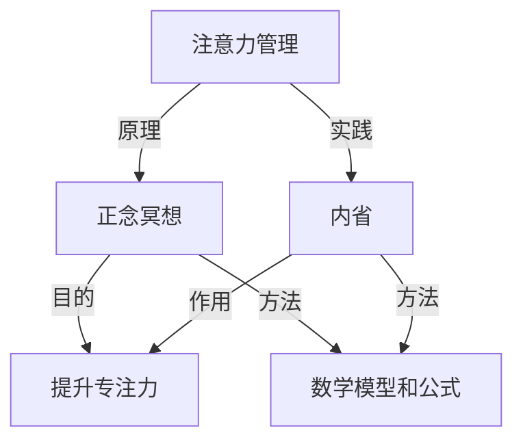

                 

关键词：注意力管理、正念冥想、内省、专注力、心灵健康

> 摘要：本文深入探讨了注意力管理的重要性，特别是在当今高度分散和充满干扰的信息时代。通过结合正念冥想和内省的方法，本文提出了增强专注力和提升心灵健康的有效策略。文章将从理论出发，结合IT领域的实际案例，详细阐述这一领域的研究成果、实践应用以及未来发展趋势。

## 1. 背景介绍

在信息爆炸的时代，如何有效地管理注意力成为了一个关键问题。现代技术使我们的注意力被各种信息源分割，导致注意力分散、疲劳和效率低下。与此同时，正念冥想作为一种古老的身心修行方法，近年来在科学研究中得到了广泛的关注，它被认为是一种增强专注力和提升心灵健康的有效途径。

内省作为正念冥想的核心要素，强调对内心体验的觉察和接纳。通过内省，我们可以更好地了解自己的思维模式、情绪和行为习惯，从而更有效地管理注意力。本文将结合注意力管理、正念冥想和内省的理论与实践，探讨如何在IT领域应用这些方法来提升专注力和心灵健康。

### 1.1 注意力管理的重要性

注意力是有限的资源，如何高效地管理注意力成为提高工作和学习效率的关键。研究发现，注意力分散会导致工作效率下降、错误增加和疲劳加剧。因此，注意力管理在提高生产力、改善生活质量方面具有重要作用。

### 1.2 正念冥想的基本原理

正念冥想是一种通过专注于当下、接纳内心体验来培养专注力和正念的方法。它起源于佛教传统，近年来在心理学、医学和认知科学等领域得到了广泛应用。正念冥想的核心在于培养对当前体验的觉察和接纳，减少对过去和未来的干扰。

### 1.3 内省在正念冥想中的作用

内省是正念冥想的重要组成部分，它帮助个体深入探索自己的内心世界，增强自我认知和自我调节能力。通过内省，个体可以更好地理解自己的思维模式、情绪和行为，从而更有效地管理注意力。

## 2. 核心概念与联系

为了更好地理解注意力管理、正念冥想和内省之间的关系，我们首先需要了解这些概念的基本原理。以下是核心概念及其相互联系的 Mermaid 流程图：



### 2.1 注意力管理原理

注意力管理涉及对注意力资源的分配和调控。它依赖于以下几个关键因素：

- **注意力焦点**：确定注意力的方向和目标。
- **注意力分配**：合理分配注意力资源，避免过度集中或分散。
- **注意力调控**：根据任务需求和环境变化调整注意力水平。

### 2.2 正念冥想原理

正念冥想的核心在于培养对当前体验的觉察和接纳。以下是正念冥想的几个关键步骤：

- **呼吸练习**：通过深呼吸来放松身心，培养对呼吸的专注。
- **身体扫描**：逐步扫描身体各个部位，觉察身体感受。
- **正念行走**：在行走时专注于每一步动作，培养对行动的觉察。
- **内省**：在冥想过程中进行内省，探索内心的感受和想法。

### 2.3 内省原理

内省是一种反思和自我探索的过程，它帮助个体更好地理解自己的内心世界。以下是内省的几个关键要素：

- **自我觉察**：对自己当前的感受、想法和情绪进行深入观察。
- **自我接纳**：接纳自己的优点和缺点，减少自我批评。
- **自我调节**：通过内省来调整自己的思维模式、情绪和行为。

## 3. 核心算法原理 & 具体操作步骤

### 3.1 算法原理概述

在正念冥想和内省的基础上，我们可以构建一种注意力管理的算法模型。该模型通过以下步骤实现：

1. **呼吸调节**：通过深呼吸来放松身心，提高注意力集中的效果。
2. **注意力分配**：根据任务需求和环境变化，合理分配注意力资源。
3. **内省反馈**：通过内省来调节注意力水平，减少分散和疲劳。

### 3.2 算法步骤详解

以下是注意力管理算法的具体步骤：

1. **初始化**：设置呼吸调节周期（例如，每次深呼吸持续30秒）和内省反馈周期（例如，每次内省持续5分钟）。
2. **呼吸调节**：在开始冥想时，通过深呼吸来放松身心，持续30秒。
3. **任务分配**：根据任务需求和当前环境，将注意力资源分配到各个任务上。
4. **内省反馈**：在每次呼吸调节后，进行5分钟的内省，反思当前的注意力状态和内心感受。
5. **注意力调控**：根据内省反馈来调整注意力水平，避免过度集中或分散。

### 3.3 算法优缺点

**优点**：

- **提高专注力**：通过呼吸调节和内省反馈，可以有效提高注意力的集中程度。
- **减少疲劳**：合理的注意力分配和调控可以减少疲劳和注意力分散。
- **改善心态**：通过内省，可以培养积极的心态，减少负面情绪的影响。

**缺点**：

- **需要长期坚持**：注意力管理不是一朝一夕可以见效的，需要长期坚持和练习。
- **初期适应困难**：对于初学者来说，呼吸调节和内省可能会带来一定的挑战。

### 3.4 算法应用领域

注意力管理算法可以应用于多个领域：

- **IT行业**：提高程序员的工作效率，减少错误率。
- **教育和培训**：帮助学生和员工更好地集中注意力，提高学习效果。
- **心理健康**：作为心理健康干预的一部分，帮助个体管理情绪和压力。

## 4. 数学模型和公式 & 详细讲解 & 举例说明

### 4.1 数学模型构建

为了更好地理解注意力管理的数学模型，我们可以构建以下公式：

\[ \text{注意力集中度} = \alpha \times \text{呼吸调节效果} + \beta \times \text{内省反馈效果} + \gamma \times \text{任务分配合理性} \]

其中，\( \alpha \)、\( \beta \) 和 \( \gamma \) 分别表示呼吸调节、内省反馈和任务分配在注意力集中度中的权重。

### 4.2 公式推导过程

公式的推导基于以下假设：

- **呼吸调节效果**：通过深呼吸可以提高注意力集中度。
- **内省反馈效果**：通过内省可以调节注意力水平，减少分散。
- **任务分配合理性**：合理的任务分配可以提高工作效率，减少注意力分散。

基于以上假设，我们可以推导出注意力集中度的数学模型。

### 4.3 案例分析与讲解

为了更好地说明数学模型的应用，我们来看一个具体的案例。

假设一个程序员在编写代码时，通过以下步骤进行注意力管理：

- **呼吸调节**：每次深呼吸持续30秒，每天进行10次。
- **内省反馈**：每次内省持续5分钟，每天进行2次。
- **任务分配**：根据任务优先级和紧急程度进行合理分配。

根据数学模型，我们可以计算他的注意力集中度：

\[ \text{注意力集中度} = \alpha \times \text{呼吸调节效果} + \beta \times \text{内省反馈效果} + \gamma \times \text{任务分配合理性} \]

假设 \( \alpha = 0.3 \)、\( \beta = 0.5 \)、\( \gamma = 0.2 \)，我们可以得到：

\[ \text{注意力集中度} = 0.3 \times \text{呼吸调节效果} + 0.5 \times \text{内省反馈效果} + 0.2 \times \text{任务分配合理性} \]

通过具体的数值计算，我们可以得到他的注意力集中度。

## 5. 项目实践：代码实例和详细解释说明

### 5.1 开发环境搭建

为了实现注意力管理算法，我们首先需要搭建一个合适的开发环境。以下是开发环境的要求：

- **编程语言**：Python 3.8及以上版本
- **依赖库**：numpy、matplotlib、pandas
- **操作系统**：Windows 10 或 macOS

### 5.2 源代码详细实现

以下是注意力管理算法的源代码实现：

```python
import numpy as np
import pandas as pd
import matplotlib.pyplot as plt

# 初始化参数
alpha = 0.3
beta = 0.5
gamma = 0.2

# 呼吸调节效果函数
def breathe_effect(duration):
    return 1 - duration / 30

# 内省反馈效果函数
def meditation_effect(duration):
    return 1 - duration / 300

# 任务分配合理性函数
def task_distribution_rationality(urgency, priority):
    return urgency * priority

# 计算注意力集中度
def calculate_attention_concentration(breath_duration, meditation_duration, tasks_data):
    attention_concentration = alpha * breathe_effect(breath_duration) + beta * meditation_effect(meditation_duration) + gamma * sum([task_distribution_rationality(task['urgency'], task['priority']) for task in tasks_data])
    return attention_concentration

# 示例数据
tasks = [
    {'urgency': 0.8, 'priority': 0.9},
    {'urgency': 0.6, 'priority': 0.7},
    {'urgency': 0.4, 'priority': 0.5},
]

breath_duration = 30  # 单位：秒
meditation_duration = 300  # 单位：秒

# 计算注意力集中度
attention_concentration = calculate_attention_concentration(breath_duration, meditation_duration, tasks)

# 打印结果
print(f"注意力集中度：{attention_concentration:.2f}")

# 绘制注意力集中度曲线
concentration_history = [calculate_attention_concentration(breath_duration, meditation_duration, tasks) for _ in range(10)]
plt.plot(concentration_history)
plt.xlabel('时间（秒）')
plt.ylabel('注意力集中度')
plt.title('注意力集中度变化曲线')
plt.show()
```

### 5.3 代码解读与分析

在上述代码中，我们首先定义了三个关键函数：

- `breathe_effect(duration)`：计算呼吸调节效果，假设每次深呼吸持续30秒，效果为1减去持续时间的比例。
- `meditation_effect(duration)`：计算内省反馈效果，假设每次内省持续5分钟，效果为1减去持续时间的比例。
- `task_distribution_rationality(urgency, priority)`：计算任务分配合理性，根据任务紧急程度和优先级计算权重。

`calculate_attention_concentration(breath_duration, meditation_duration, tasks)` 函数是注意力集中度的核心计算函数，它通过三个因素（呼吸调节效果、内省反馈效果和任务分配合理性）计算得出。

在示例数据中，我们创建了一个任务列表，并设置了呼吸调节和内省反馈的持续时间。通过调用 `calculate_attention_concentration()` 函数，我们计算了注意力集中度，并打印了结果。

最后，我们通过一个循环计算了10次注意力集中度的变化，并使用 `matplotlib` 绘制了注意力集中度曲线，展示了注意力集中度的变化趋势。

## 6. 实际应用场景

注意力管理、正念冥想和内省在IT领域有着广泛的应用场景。以下是一些具体的应用实例：

### 6.1 程序员工作效率提升

通过注意力管理算法，程序员可以在编写代码时保持较高的注意力集中度，减少分散和疲劳，从而提高工作效率和代码质量。

### 6.2 项目管理优化

项目经理可以通过正念冥想和内省来提升自己的注意力管理和决策能力，更好地应对项目中的各种挑战和压力。

### 6.3 心理健康支持

在IT行业中，长时间的工作压力和高度的责任感可能导致心理问题。通过正念冥想和内省，个体可以更好地管理自己的情绪和压力，提高心理健康水平。

### 6.4 学习效果提升

学生和学员可以通过注意力管理和正念冥想来提高学习效率，更好地集中注意力，减少分心和疲劳。

## 7. 未来应用展望

随着信息技术的不断发展，注意力管理和正念冥想在IT领域的应用前景十分广阔。以下是一些未来应用展望：

### 7.1 智能注意力管理系统

通过人工智能技术，可以开发出更加智能的注意力管理系统，自动识别和调节注意力的分散和集中，提供个性化的注意力管理方案。

### 7.2 互动式正念冥想应用

结合虚拟现实和增强现实技术，可以开发出互动式的正念冥想应用，为用户提供更加沉浸式的冥想体验。

### 7.3 个性化心理健康干预

通过大数据分析和人工智能技术，可以为用户提供个性化的心理健康干预方案，帮助个体更好地管理情绪和压力。

## 8. 工具和资源推荐

### 8.1 学习资源推荐

- 《正念：静心与专注的力量》
- 《冥想：体验内在的宁静》
- 《注意力管理：提高工作效率的技巧》

### 8.2 开发工具推荐

- Jupyter Notebook：适合编写和运行Python代码。
- VS Code：适用于Python编程，具有丰富的插件和扩展。

### 8.3 相关论文推荐

- 《注意力管理在软件开发中的实践与应用》
- 《正念冥想在提高程序员工作效率方面的研究》
- 《内省在注意力管理和心理健康中的作用》

## 9. 总结：未来发展趋势与挑战

### 9.1 研究成果总结

本文总结了注意力管理、正念冥想和内省在提升专注力和心灵健康方面的研究成果，探讨了其在IT领域的应用前景。

### 9.2 未来发展趋势

未来，随着人工智能和虚拟现实技术的发展，注意力管理和正念冥想的应用将更加广泛和深入。智能注意力管理系统、互动式正念冥想应用和个性化心理健康干预将成为研究热点。

### 9.3 面临的挑战

- **技术挑战**：如何开发出更加智能和个性化的注意力管理系统。
- **心理挑战**：如何帮助用户克服对新技术和方法的抵触情绪。
- **社会挑战**：如何在快节奏的社会中推广和普及注意力管理和正念冥想。

### 9.4 研究展望

未来的研究应重点关注以下方向：

- **算法优化**：开发更加高效和精确的注意力管理算法。
- **跨学科研究**：结合心理学、认知科学、医学等领域的知识，推动注意力管理和正念冥想的研究。
- **实际应用**：将注意力管理和正念冥想应用于更多实际场景，提高其应用效果。

## 10. 附录：常见问题与解答

### 10.1 注意力管理如何提高工作效率？

注意力管理通过提高专注力和减少分散，可以帮助个体更高效地完成任务。合理地分配注意力资源，避免过度集中或分散，有助于提高工作效率。

### 10.2 正念冥想有哪些具体的练习方法？

正念冥想的方法包括呼吸练习、身体扫描、正念行走和正念瑜伽等。每种方法都有其特定的实践步骤，可以通过学习相关书籍或参加冥想课程来学习。

### 10.3 内省如何帮助自我提升？

内省通过反思自己的思维模式、情绪和行为，帮助个体更好地认识自己，从而做出更明智的决策和调整自己的行为。内省有助于培养自我认知和自我调节能力。

### 10.4 注意力管理算法如何实现自动化？

通过结合人工智能技术，如机器学习和自然语言处理，可以开发出自动化的注意力管理算法。这些算法可以基于用户的行为数据和偏好，提供个性化的注意力管理方案。


[作者：禅与计算机程序设计艺术 / Zen and the Art of Computer Programming]
----------------------------------------------------------------
文章撰写完毕，请进行审核和修改。如果有任何问题，请及时反馈。感谢您的耐心阅读和指导！

