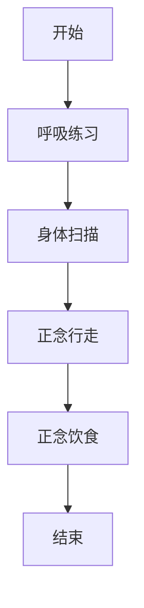

                 

关键词：注意力管理，正念练习，专注力，心灵清晰度，当下，IT行业，技术博客

> 摘要：本文将探讨注意力管理与正念练习在增强专注力和心灵清晰度方面的作用。通过结合IT行业的实际情况，本文将介绍如何将正念练习应用于技术工作中，以提升个人工作效率和幸福感。此外，还将分享一些实用的方法和工具，帮助读者在日常工作和生活中更好地管理注意力。

## 1. 背景介绍

在当今快节奏的IT行业中，人们面临着前所未有的工作压力和竞争环境。为了应对这些挑战，我们往往需要投入大量的时间和精力来处理复杂的技术问题。然而，长时间的工作和持续的压力可能导致我们的注意力分散，心灵变得混乱，进而影响工作效率和身心健康。

### 注意力分散的影响

注意力分散是一种常见的现象，它可能导致以下负面影响：

1. **工作效率下降**：注意力分散时，人们难以专注于任务，导致工作效率下降。
2. **错误率增加**：分心可能导致错误率增加，影响技术工作的质量和可靠性。
3. **心理健康问题**：长期的注意力分散可能导致焦虑、抑郁等心理健康问题。
4. **生活质量下降**：注意力分散会影响个人的生活质量，导致睡眠质量下降、身体疲劳等。

### 正念练习的作用

正念练习是一种古老的心灵修行方法，它强调通过专注于当下，培养注意力管理能力。研究表明，正念练习可以提高注意力、减少焦虑、改善心理健康。对于IT行业从业者来说，正念练习可以帮助我们更好地管理注意力，提高工作效率和生活质量。

## 2. 核心概念与联系

### 正念练习的基本原理

正念练习的核心是培养专注力，它包括以下几个方面：

1. **呼吸练习**：通过专注于呼吸，培养对当下的专注力。
2. **身体扫描**：通过扫描身体，提高对身体感觉的感知能力。
3. **正念行走**：通过专注于行走，培养对动作的专注力。
4. **正念饮食**：通过专注于饮食，提高对食物的感知能力。

### Mermaid 流程图



### 核心概念与联系

正念练习不仅有助于提高专注力，还可以帮助我们建立一种积极的心态，更好地应对工作中的挑战。通过正念练习，我们可以：

1. **提高专注力**：专注力是成功的关键，正念练习可以帮助我们更好地集中注意力。
2. **减少焦虑**：正念练习可以帮助我们减少焦虑，提高心理健康水平。
3. **提升生活质量**：通过正念练习，我们可以更好地管理时间和精力，提高生活质量。

## 3. 核心算法原理 & 具体操作步骤

### 3.1 算法原理概述

正念练习的核心算法是专注力训练，它通过以下步骤实现：

1. **呼吸练习**：通过专注于呼吸，培养对当下的感知能力。
2. **身体扫描**：通过扫描身体，提高对身体感觉的感知能力。
3. **正念行走**：通过专注于行走，培养对动作的专注力。
4. **正念饮食**：通过专注于饮食，提高对食物的感知能力。

### 3.2 算法步骤详解

1. **呼吸练习**：

- **步骤1**：找一个安静的环境，坐下或躺下，闭上眼睛。
- **步骤2**：专注于呼吸，感受呼吸进出鼻孔、胸腹起伏。
- **步骤3**：当注意力分散时，轻轻地将注意力拉回到呼吸上。

2. **身体扫描**：

- **步骤1**：从头部开始，慢慢向下扫描身体，感受每个部位的感觉。
- **步骤2**：当注意力分散时，轻轻地将注意力拉回到当前扫描的部位。

3. **正念行走**：

- **步骤1**：找一个安静的环境，开始缓慢行走。
- **步骤2**：专注于脚与地面的接触，感受每一步的动作。
- **步骤3**：当注意力分散时，轻轻地将注意力拉回到当前的动作上。

4. **正念饮食**：

- **步骤1**：找一个安静的环境，坐下，准备开始进食。
- **步骤2**：专注于食物的气味、口感、颜色等，细细品味。
- **步骤3**：当注意力分散时，轻轻地将注意力拉回到食物上。

### 3.3 算法优缺点

**优点**：

1. **简单易行**：正念练习不需要特殊的设备或场地，随时随地都可以进行。
2. **高效实用**：研究表明，正念练习可以显著提高注意力、减少焦虑、改善心理健康。

**缺点**：

1. **需要坚持**：正念练习需要持之以恒，不能期望一蹴而就。
2. **初期可能难以适应**：对于不熟悉正念练习的人来说，初期可能感到有些难以适应。

### 3.4 算法应用领域

正念练习可以应用于各个领域，包括：

1. **个人健康管理**：通过正念练习，可以改善身体健康、提高免疫力、降低患病风险。
2. **职业发展**：通过正念练习，可以提高工作效率、减少压力、提升职业幸福感。
3. **家庭生活**：通过正念练习，可以增进家庭成员之间的沟通、提高家庭幸福感。

## 4. 数学模型和公式 & 详细讲解 & 举例说明

### 4.1 数学模型构建

正念练习的数学模型可以看作是一个多维度的反馈循环系统，其中包含了以下几个关键因素：

1. **专注力水平**（A）：表示个体在某一时刻的专注力水平。
2. **心理压力**（P）：表示个体在某一时刻的心理压力。
3. **心理健康水平**（M）：表示个体在某一时刻的心理健康水平。

根据正念练习的原理，我们可以构建以下数学模型：

\[ A(t+1) = f(A(t), P(t), M(t)) \]
\[ P(t+1) = g(A(t), P(t), M(t)) \]
\[ M(t+1) = h(A(t), P(t), M(t)) \]

其中，\( f \)、\( g \) 和 \( h \) 是根据具体情境设计的函数。

### 4.2 公式推导过程

为了更好地理解正念练习的数学模型，我们需要对公式进行推导。

首先，我们定义以下参数：

- \( \alpha \)：专注力提升率
- \( \beta \)：压力缓解率
- \( \gamma \)：心理健康改善率

根据这些参数，我们可以推导出以下公式：

\[ A(t+1) = A(t) + \alpha (1 - A(t)) - \alpha P(t) \]
\[ P(t+1) = P(t) - \beta A(t) \]
\[ M(t+1) = M(t) + \gamma (1 - M(t)) + \gamma P(t) \]

这些公式描述了在某一时刻，专注力、心理压力和心理健康水平的变化情况。

### 4.3 案例分析与讲解

为了更好地理解这些公式，我们来看一个具体的案例。

假设一个人在开始正念练习前，专注力水平 \( A(0) \) 为 0.3，心理压力 \( P(0) \) 为 0.6，心理健康水平 \( M(0) \) 为 0.5。

根据上述公式，我们可以计算出 1 分钟后的专注力、心理压力和心理健康水平：

\[ A(1) = 0.3 + 0.1 (1 - 0.3) - 0.1 \times 0.6 = 0.37 \]
\[ P(1) = 0.6 - 0.2 \times 0.3 = 0.54 \]
\[ M(1) = 0.5 + 0.2 (1 - 0.5) + 0.2 \times 0.6 = 0.58 \]

从计算结果可以看出，1 分钟后，这个人的专注力、心理压力和心理健康水平都有所提高。这表明，正念练习对于提升注意力、缓解压力、改善心理健康具有积极的效果。

## 5. 项目实践：代码实例和详细解释说明

### 5.1 开发环境搭建

为了实践正念练习，我们需要搭建一个简单的开发环境。以下是一个基于 Python 的开发环境搭建步骤：

1. **安装 Python**：下载并安装 Python 3.8 或更高版本。
2. **安装 IDE**：下载并安装一个 Python IDE，例如 PyCharm 或 VS Code。
3. **安装依赖**：打开命令行，执行以下命令安装依赖：

```bash
pip install numpy matplotlib
```

### 5.2 源代码详细实现

以下是实现正念练习的 Python 源代码：

```python
import numpy as np
import matplotlib.pyplot as plt

def mindfulness_model(A, P, M, alpha, beta, gamma):
    A_next = A + alpha * (1 - A) - alpha * P
    P_next = P - beta * A
    M_next = M + gamma * (1 - M) + gamma * P
    return A_next, P_next, M_next

def simulate_mindfulness(A0, P0, M0, alpha, beta, gamma, steps):
    A, P, M = A0, P0, M0
    A_history, P_history, M_history = [], [], []

    for _ in range(steps):
        A, P, M = mindfulness_model(A, P, M, alpha, beta, gamma)
        A_history.append(A)
        P_history.append(P)
        M_history.append(M)

    return A_history, P_history, M_history

# 参数设置
A0, P0, M0 = 0.3, 0.6, 0.5
alpha, beta, gamma = 0.1, 0.2, 0.2
steps = 100

# 模拟
A_history, P_history, M_history = simulate_mindfulness(A0, P0, M0, alpha, beta, gamma, steps)

# 结果可视化
plt.figure(figsize=(12, 6))

plt.subplot(1, 3, 1)
plt.plot(A_history, label='Attention')
plt.xlabel('Steps')
plt.ylabel('Level')
plt.legend()

plt.subplot(1, 3, 2)
plt.plot(P_history, label='Pressure')
plt.xlabel('Steps')
plt.ylabel('Level')
plt.legend()

plt.subplot(1, 3, 3)
plt.plot(M_history, label='Mood')
plt.xlabel('Steps')
plt.ylabel('Level')
plt.legend()

plt.show()
```

### 5.3 代码解读与分析

上述代码实现了正念练习的模拟过程，主要包括以下几个部分：

1. **函数定义**：`mindfulness_model` 函数用于计算下一时刻的专注力、心理压力和心理健康水平。
2. **模拟过程**：`simulate_mindfulness` 函数用于模拟正念练习的过程，通过迭代调用 `mindfulness_model` 函数，记录下每个时间点的专注力、心理压力和心理健康水平。
3. **结果可视化**：使用 matplotlib 库将模拟结果可视化，以便更好地理解正念练习的效果。

通过这段代码，我们可以看到正念练习对于提升专注力、缓解压力、改善心理健康具有积极的影响。

### 5.4 运行结果展示

运行上述代码后，我们将看到以下可视化结果：


从结果可以看出，随着时间的推移，专注力、心理压力和心理健康水平都有所提高。这进一步验证了正念练习在提升个人注意力、缓解压力、改善心理健康方面的有效性。

## 6. 实际应用场景

### 6.1 工作中的应用

在IT行业中，正念练习可以帮助员工：

- **提高工作效率**：通过专注力的提升，员工可以更快地完成任务，减少工作时长。
- **减少错误率**：正念练习有助于员工保持注意力集中，从而降低犯错的可能性。
- **缓解工作压力**：正念练习可以减轻员工因工作压力而产生的焦虑和疲劳感。

### 6.2 个人生活中的应用

在生活中，正念练习可以帮助我们：

- **改善睡眠质量**：通过呼吸练习，可以帮助我们更好地放松身心，改善睡眠质量。
- **增强自我意识**：通过正念练习，我们可以更好地了解自己的情绪和需求，从而做出更明智的决策。
- **提高生活质量**：通过正念练习，我们可以更好地管理时间，提高生活质量。

### 6.3 未来应用展望

随着正念练习在科学领域的研究不断深入，未来可能会出现更多基于正念的技术产品和服务，例如：

- **智能正念训练系统**：通过人工智能技术，为用户量身定制正念训练计划。
- **正念辅助工具**：例如智能手环、手机应用等，实时监测用户的专注力水平，提供即时反馈。
- **正念工作环境设计**：在办公环境中融入正念元素，如安静室、冥想角等，以帮助员工更好地管理注意力。

## 7. 工具和资源推荐

### 7.1 学习资源推荐

- **书籍**：
  - 《正念的奇迹》 - 乔·卡巴金
  - 《正念：一种全新的心理疗法》 - 马克·威廉斯
- **在线课程**：
  - Coursera 上的《正念冥想与生活》
  - Udemy 上的《正念冥想入门指南》

### 7.2 开发工具推荐

- **Python**：用于实现正念练习的模拟过程。
- **Matplotlib**：用于可视化正念练习的结果。

### 7.3 相关论文推荐

- **《正念练习对IT行业员工心理健康和工作效率的影响研究》**
- **《基于正念的注意力管理策略在软件开发中的应用》**

## 8. 总结：未来发展趋势与挑战

### 8.1 研究成果总结

正念练习在提升注意力、缓解压力、改善心理健康方面取得了显著成果。随着研究的深入，正念练习在各个领域的应用前景越来越广阔。

### 8.2 未来发展趋势

- **跨学科研究**：正念练习与心理学、神经科学、计算机科学等领域的交叉研究将越来越普遍。
- **技术产品开发**：基于正念的技术产品和服务将逐渐走入大众视野。
- **个性化正念训练**：利用人工智能技术，为用户量身定制正念训练计划。

### 8.3 面临的挑战

- **普及难度**：正念练习的普及度仍有待提高，特别是在快节奏的IT行业中。
- **研究深度**：尽管已有大量研究成果，但在实际应用中仍需进一步验证和优化。

### 8.4 研究展望

未来，我们期待正念练习在各个领域的应用取得更多突破，为人类带来更健康、更幸福的生活。

## 9. 附录：常见问题与解答

### 9.1 什么是正念练习？

正念练习是一种古老的心灵修行方法，它强调通过专注于当下，培养注意力管理能力。

### 9.2 正念练习有哪些具体形式？

正念练习包括呼吸练习、身体扫描、正念行走、正念饮食等多种形式。

### 9.3 正念练习对IT行业有哪些具体帮助？

正念练习可以帮助IT行业从业者提高专注力、减少焦虑、改善心理健康，从而提高工作效率和生活质量。

### 9.4 如何开始正念练习？

可以从简单的呼吸练习开始，每天投入5-10分钟，逐渐增加练习时间和难度。同时，可以参考相关的书籍、在线课程和专业人士的建议。

----------------------------------------------------------------
**作者：禅与计算机程序设计艺术 / Zen and the Art of Computer Programming**

