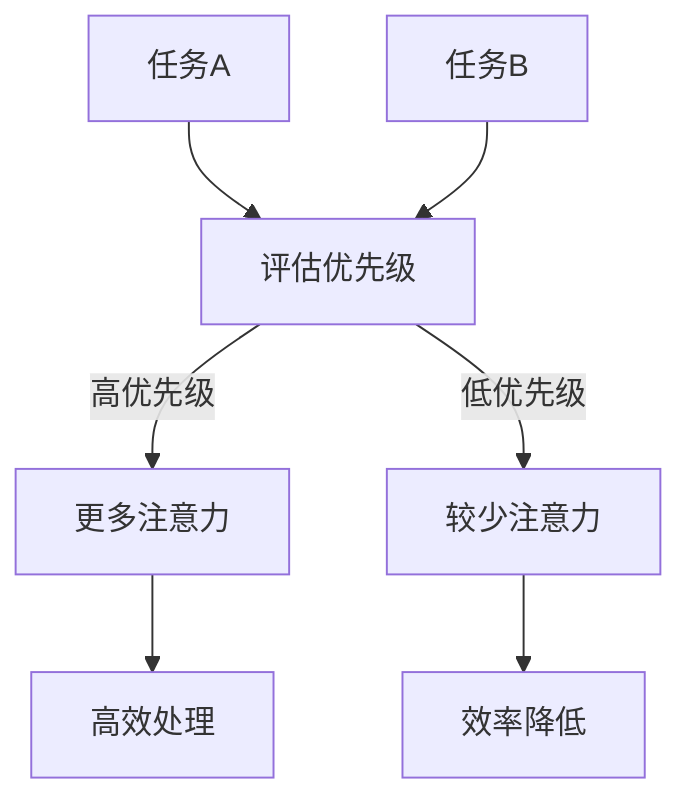
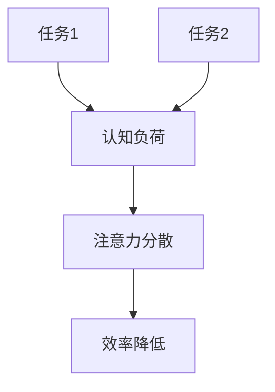
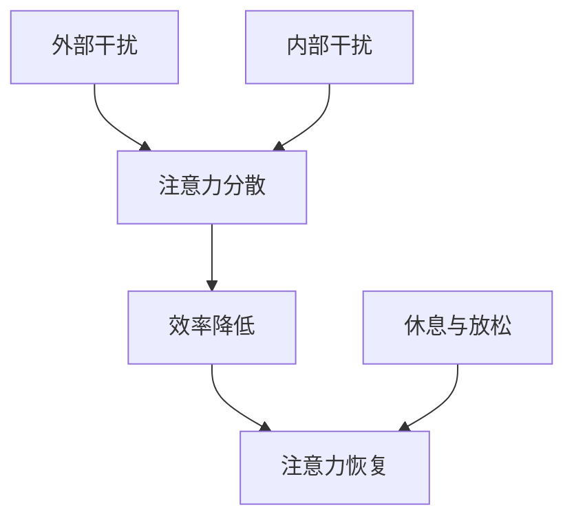
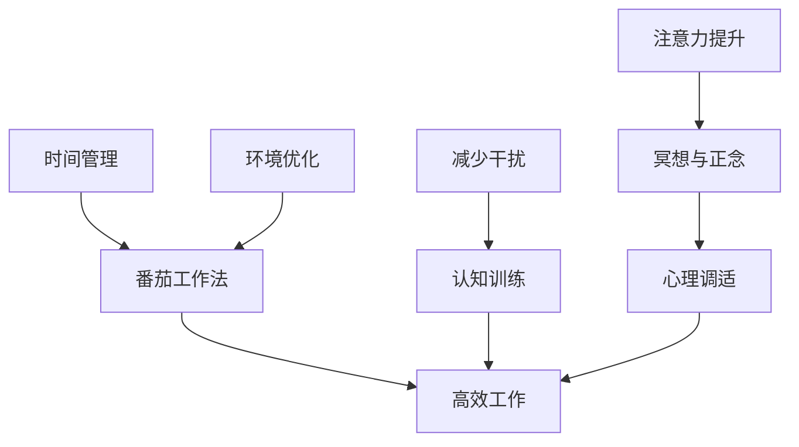
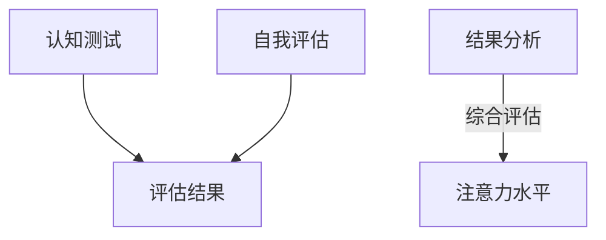
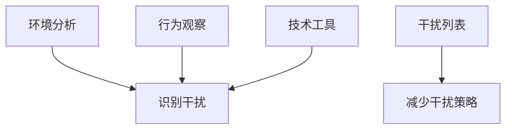
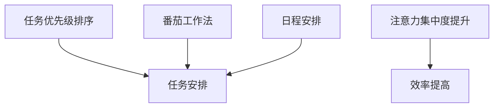
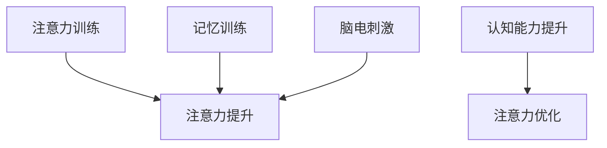
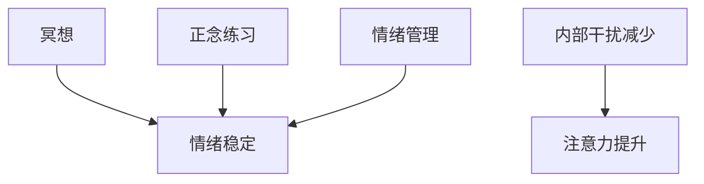
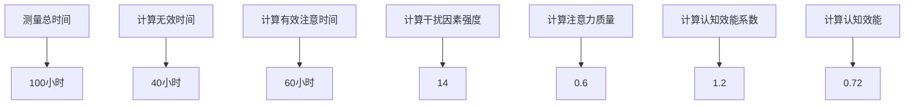

                 

关键词：注意力管理、专注力、个人成长、认知提升、效能优化、技术职业发展、自我改善

> 摘要：本文旨在探讨注意力管理的重要性，以及如何通过专注力提升个人在技术职业领域中的成长与发展。我们将从理论层面深入分析注意力管理的核心概念，结合实际案例展示如何通过具体方法改善注意力，最终实现个人在认知能力和职业发展上的飞跃。

## 1. 背景介绍

在当今快速变化的技术时代，个体需要不断学习、适应和提升自己以应对不断涌现的新技术和新挑战。注意力管理作为提高个人效能的关键因素，在这一过程中扮演着至关重要的角色。研究表明，注意力是有限的资源，正确管理和使用它能够显著提高工作效率和创新能力。然而，随着信息过载和分心因素的增多，许多人在日常工作中面临注意力分散的问题，这直接影响到他们的职业发展和个人成长。

本文将首先介绍注意力管理的理论基础，包括注意力分配理论、多任务处理理论和注意力分散机制。随后，我们将探讨如何通过认知提升策略，如冥想、记忆训练和注意力训练，来改善注意力质量。接着，文章将分析专注力对技术职业发展的影响，并给出一系列实用的建议和策略，帮助读者在技术领域实现自我提升。最后，我们将讨论未来的发展趋势和面临的挑战，以及如何为未来的职业发展做好充分准备。

## 2. 核心概念与联系

### 2.1 注意力分配理论

注意力分配理论（Attention Allocation Theory）是理解如何有效管理注意力资源的基础。该理论认为，注意力资源是有限的，且在不同的任务间进行分配时需要权衡。注意力分配理论提出了几个关键原则：

- **任务优先级**：高优先级的任务应得到更多的注意力资源。
- **资源限制**：长期任务或复杂任务可能需要更高的注意力投入。
- **分散注意力**：处理多个任务时，每个任务获得的注意力资源会减少，导致效率降低。

为了更好地理解这些概念，我们可以使用Mermaid流程图来展示注意力分配的过程：



### 2.2 多任务处理理论

多任务处理理论（Multitasking Theory）探讨了人类大脑在处理多个任务时的行为。研究表明，多任务处理实际上是一种认知资源分配的过程，但并非所有任务都可以同时高效处理。以下是多任务处理的一些关键点：

- **任务相似性**：相似的任务更容易同时处理，因为它们在认知结构上具有相似的模块。
- **认知负荷**：多任务处理会增加认知负荷，导致注意力分散和效率降低。
- **分心效应**：分心任务会干扰当前任务的执行，导致错误和延迟。

以下是一个简化的Mermaid流程图，展示了多任务处理的理论框架：



### 2.3 注意力分散机制

注意力分散机制（Distraction Mechanism）涉及外部和内部干扰因素对注意力的影响。外部干扰因素包括噪声、社交媒体和其他刺激，而内部干扰因素可能包括焦虑、压力和自我怀疑。以下是注意力分散机制的几个要点：

- **外部干扰**：环境噪声和视觉刺激会导致注意力分散。
- **内部干扰**：心理因素如焦虑和压力会干扰注意力集中。
- **注意力恢复**：短暂的休息和放松可以帮助恢复注意力。

以下是一个描述注意力分散机制的Mermaid流程图：



### 2.4 注意力管理的实际应用

注意力管理的核心是识别和减少干扰因素，从而提高注意力的质量。以下是一些实际应用的策略：

- **时间管理**：使用番茄工作法（Pomodoro Technique）来分割工作时间，以提高专注力。
- **环境优化**：创造一个安静、整洁的工作环境，减少外部干扰。
- **认知训练**：通过注意力训练和记忆训练提高大脑的处理能力。
- **心理调适**：学习冥想和正念练习，以减少内部干扰。

下面是一个结合这些策略的Mermaid流程图：



通过上述的理论和实际应用，我们可以更好地理解注意力管理的重要性，并学会如何在实际工作中有效地应用这些策略来提升个人的专注力和工作效率。

## 3. 核心算法原理 & 具体操作步骤

### 3.1 算法原理概述

注意力管理的核心在于提高注意力的质量和效率。在此，我们提出一种基于认知科学和心理学原理的注意力优化算法。该算法主要通过以下步骤实现：

1. **注意力评估**：通过认知测试和自我评估，了解当前的注意力水平。
2. **干扰因素识别**：分析外部和内部干扰因素，并制定减少干扰的策略。
3. **时间管理优化**：使用高效的日程安排和任务优先级排序，减少注意力分散。
4. **认知训练**：通过一系列训练任务，提高大脑的注意力和记忆力。
5. **心理调适**：通过冥想和正念练习，减少内部干扰，提升情绪状态。

### 3.2 算法步骤详解

#### 3.2.1 注意力评估

注意力评估是算法的第一步，目的是了解当前注意力水平。以下是一种常见的注意力评估方法：

1. **认知测试**：使用标准化测试，如Stroop任务、数字跨度测试等，评估注意力集中度和反应速度。
2. **自我评估**：通过问卷调查和日记记录，了解个人在日常生活中的注意力表现。

以下是一个简化的Mermaid流程图，展示了注意力评估的步骤：



#### 3.2.2 干扰因素识别

识别干扰因素是减少注意力分散的关键。以下是几种识别干扰因素的方法：

1. **环境分析**：观察工作环境中的噪声、视觉干扰等因素。
2. **行为观察**：记录个人在日常生活中的注意力分散情况，找出常见干扰因素。
3. **技术工具**：使用专注力追踪应用程序，监测注意力水平和干扰因素。

以下是一个描述干扰因素识别的Mermaid流程图：



#### 3.2.3 时间管理优化

时间管理优化旨在减少任务间的切换时间，提高注意力集中度。以下是一些具体策略：

1. **任务优先级排序**：根据任务的重要性和紧急程度进行排序，确保优先完成高优先级任务。
2. **番茄工作法**：将工作时间分割成25分钟的工作周期和5分钟的休息时间，以提高专注力。
3. **日程安排**：合理安排每天的任务，避免在注意力高峰期处理复杂任务。

以下是一个描述时间管理优化的Mermaid流程图：



#### 3.2.4 认知训练

认知训练是提高注意力质量和记忆力的有效方法。以下是一些常用的认知训练方法：

1. **注意力训练**：通过练习如数字追踪、视觉搜索等任务，提高注意力集中度。
2. **记忆训练**：通过记忆游戏、闪卡等训练，增强记忆力和认知灵活性。
3. **脑电刺激**：使用电刺激技术，如经颅直流刺激（tDCS），改善大脑功能。

以下是一个描述认知训练的Mermaid流程图：



#### 3.2.5 心理调适

心理调适旨在减少内部干扰，提升情绪状态。以下是一些常用的心理调适方法：

1. **冥想**：通过冥想和深呼吸练习，降低焦虑和压力。
2. **正念练习**：通过专注于当下的活动，提高注意力集中度和情绪稳定性。
3. **情绪管理**：学习情绪调节技巧，如呼吸控制、认知重构等。

以下是一个描述心理调适的Mermaid流程图：



### 3.3 算法优缺点

#### 优点

- **高效性**：通过优化时间管理和认知训练，显著提高工作效率和注意力集中度。
- **灵活性**：算法可以根据个人情况和需求进行调整，具有很高的适用性。
- **全面性**：综合考虑外部和内部干扰因素，提供全方位的注意力管理方案。

#### 缺点

- **实施难度**：算法需要一定的时间和精力去实施，对于忙碌的人来说可能较为困难。
- **初期效果不明显**：认知训练和心理调适需要一定时间才能见效，初期可能无法立刻感受到显著效果。

### 3.4 算法应用领域

注意力优化算法可以应用于多个领域，包括：

- **技术职业发展**：帮助技术人员提高专注力和工作效率，加快学习进度。
- **教育领域**：辅助教师和学生提高注意力和学习效果。
- **企业管理**：提升员工的工作效率和团队合作能力。

通过以上算法原理和步骤的详细解析，我们可以更好地理解如何通过注意力管理提升个人在技术职业领域中的成长和发展。

### 4. 数学模型和公式 & 详细讲解 & 举例说明

#### 4.1 数学模型构建

在注意力管理中，我们构建一个数学模型来量化注意力的质量、干扰因素和认知效能。该模型基于以下几个核心变量：

- \( A \)：注意力质量，衡量个体集中注意力的能力。
- \( I \)：干扰因素强度，衡量外部和内部干扰的总体水平。
- \( C \)：认知效能，衡量个体在注意力集中的情况下的工作表现。

数学模型可以表示为：

\[ E = f(A, I) \]

其中，\( E \) 表示个体的认知效能，\( f \) 是一个函数，用于描述注意力质量与干扰因素之间的关系。

#### 4.2 公式推导过程

注意力质量 \( A \) 可以通过以下公式计算：

\[ A = \frac{N}{T} \]

其中，\( N \) 表示有效注意时间，\( T \) 表示总时间。有效注意时间可以通过以下步骤计算：

1. **测量总时间**：记录个体在特定任务上的总时间。
2. **计算无效时间**：识别并从总时间中减去由于干扰因素导致的时间损失。
3. **计算有效注意时间**：用总时间减去无效时间得到有效注意时间。

干扰因素强度 \( I \) 可以通过以下公式计算：

\[ I = w_1 \times E_1 + w_2 \times E_2 + ... + w_n \times E_n \]

其中，\( w_i \) 是权重，\( E_i \) 是第 \( i \) 个干扰因素的水平。权重可以根据干扰因素的重要性进行调整。

认知效能 \( C \) 可以通过以下公式计算：

\[ C = A \times B \]

其中，\( B \) 表示认知效能系数，用于调整注意力质量对认知效能的影响。

#### 4.3 案例分析与讲解

为了更好地理解上述数学模型，我们通过一个实际案例进行讲解。

**案例背景**：一位软件开发工程师需要在两周内完成一个重要的项目。在项目期间，他遇到了一些干扰因素，包括技术难题、会议邀请和个人事务。

**步骤 1**：测量总时间

工程师记录了项目期间的总工作时间为100小时。

**步骤 2**：计算无效时间

工程师发现由于技术难题导致的无效时间为20小时，会议邀请导致的无效时间为15小时，个人事务导致的无效时间为5小时。因此，无效时间总计为40小时。

**步骤 3**：计算有效注意时间

有效注意时间 \( N \) 为：

\[ N = 100 - 40 = 60 \text{小时} \]

**步骤 4**：计算干扰因素强度

假设技术难题的权重为0.4，会议邀请的权重为0.3，个人事务的权重为0.3。干扰因素强度 \( I \) 为：

\[ I = 0.4 \times 20 + 0.3 \times 15 + 0.3 \times 5 = 8 + 4.5 + 1.5 = 14 \]

**步骤 5**：计算注意力质量

注意力质量 \( A \) 为：

\[ A = \frac{N}{T} = \frac{60}{100} = 0.6 \]

**步骤 6**：计算认知效能系数

假设认知效能系数 \( B \) 为1.2。

**步骤 7**：计算认知效能

认知效能 \( C \) 为：

\[ C = A \times B = 0.6 \times 1.2 = 0.72 \]

通过上述计算，我们可以得出该工程师在项目期间的实际认知效能。以下是一个简化的Mermaid流程图，展示了这个案例的计算过程：



**结论**：通过这个案例，我们可以看到注意力质量、干扰因素强度和认知效能之间的关系。工程师通过减少无效时间和优化干扰因素，显著提高了其认知效能，从而提高了工作效率和项目质量。

### 5. 项目实践：代码实例和详细解释说明

#### 5.1 开发环境搭建

在进行注意力管理项目的实践之前，我们需要搭建一个合适的开发环境。以下是一个简化的步骤指南：

1. **安装Python环境**：确保Python 3.8或更高版本已安装在您的计算机上。
2. **安装必要的库**：使用pip安装以下库：numpy、matplotlib、pandas、scikit-learn。

```bash
pip install numpy matplotlib pandas scikit-learn
```

3. **设置工作目录**：创建一个名为`attention_management`的项目目录，并将所有代码文件放在该目录中。

#### 5.2 源代码详细实现

在本节中，我们将展示一个注意力管理项目的核心代码实现。该项目的目标是根据注意力质量、干扰因素和认知效能的测量数据，生成一个注意力管理报告。

**步骤 1**：导入所需的库

```python
import numpy as np
import pandas as pd
import matplotlib.pyplot as plt
from sklearn.linear_model import LinearRegression
```

**步骤 2**：定义数据输入和预处理函数

```python
def load_data(filename):
    """加载注意力管理数据"""
    data = pd.read_csv(filename)
    return data

def preprocess_data(data):
    """预处理注意力管理数据"""
    # 数据清洗和转换
    data['Attention_Quality'] = data['Effective_Time'] / data['Total_Time']
    data['Distraction_Factor'] = data['Technical Proble

