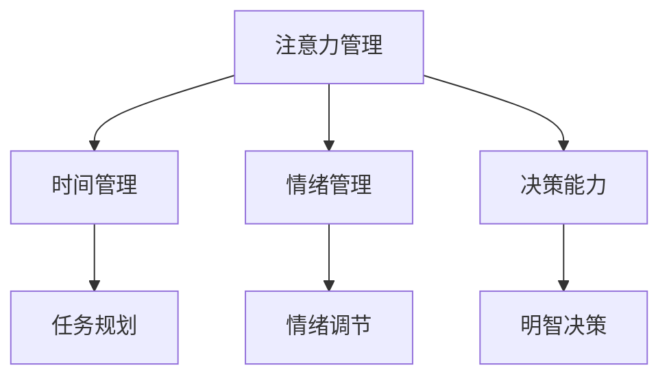

                 

关键词：注意力管理、自我管理、专注力、个人发展、职业成功

> 摘要：在当今信息爆炸的时代，有效的注意力管理和自我管理策略成为个人和职业成功的基石。本文将探讨如何通过提高专注力，实现个人成长和职业发展的双赢。

## 1. 背景介绍

在数字化转型的浪潮中，我们每天都在处理海量的信息。从电子邮件到社交媒体，从工作文档到个人事务，信息的获取和处理变得更加便捷。然而，这背后也带来了一个新的挑战——如何有效地管理我们的注意力。专注力的缺失不仅影响到个人的生活质量，也在很大程度上阻碍了职业发展。

自我管理是一个多维度的概念，包括时间管理、情绪管理、决策能力等多个方面。在这个高度竞争和快速变化的时代，自我管理能力尤为重要。有效的自我管理可以帮助我们更好地规划时间、保持情绪稳定、做出明智的决策，从而在个人和职业生活中取得成功。

本文将结合注意力管理和自我管理的理念，提供一系列策略和方法，帮助读者提高专注力，实现个人和职业的全面发展。

## 2. 核心概念与联系

### 2.1 注意力管理原理

注意力管理是指通过一系列策略和技巧，提高注意力集中度，减少注意力分散的行为。其核心在于：

- **注意力焦点转移**：通过有意识地转移注意力，减少无关信息的干扰。
- **注意力分配**：合理分配注意力资源，确保重要任务得到足够的关注。
- **注意力维持**：通过持续的努力和技巧，保持注意力的持久性。

### 2.2 自我管理概念

自我管理包括以下几个方面：

- **时间管理**：合理安排时间，确保重要任务在规定时间内完成。
- **情绪管理**：调节情绪，保持积极向上的心态，面对压力和挑战。
- **决策能力**：提高决策能力，做出明智的选择，避免后悔和失误。

### 2.3 注意力管理与自我管理的关系

注意力管理和自我管理之间存在着密切的联系。有效的注意力管理是自我管理的基础。只有通过管理好注意力，才能更好地进行时间管理、情绪管理和决策。

### 2.4 Mermaid 流程图

以下是一个简单的 Mermaid 流程图，展示了注意力管理与自我管理之间的关系：



## 3. 核心算法原理 & 具体操作步骤

### 3.1 算法原理概述

注意力管理的核心在于如何有效地分配和维持注意力资源。这可以通过以下步骤实现：

1. **明确任务目标**：确定当前任务的优先级和目标，有助于集中注意力。
2. **减少干扰**：通过屏蔽外界干扰（如关闭社交媒体通知、屏蔽不必要的邮件等），保持专注。
3. **时间块化**：将时间划分为若干个专注时间块，每个时间块专注于一项任务。
4. **注意力转移**：当注意力开始分散时，通过深呼吸、短暂休息等方式，重新集中注意力。
5. **反馈与调整**：完成任务后，进行自我评估和反馈，不断调整和优化注意力管理策略。

### 3.2 算法步骤详解

1. **明确任务目标**：
   - **任务分解**：将大任务分解为小任务，明确每个小任务的目标。
   - **优先级排序**：根据任务的重要性和紧急性，对任务进行优先级排序。

2. **减少干扰**：
   - **环境调整**：选择一个安静、舒适的工作环境，减少噪音和其他干扰。
   - **工具屏蔽**：关闭不必要的通知和提示，使用专注工具如番茄钟等。

3. **时间块化**：
   - **时间划分**：将时间划分为25分钟的工作时间块，每个时间块后休息5分钟。
   - **专注时段**：在每个时间块内，专注于当前任务，避免分心。

4. **注意力转移**：
   - **呼吸调节**：当注意力开始分散时，进行深呼吸，有助于恢复专注。
   - **短暂休息**：在时间块结束后，进行短暂休息，避免过度疲劳。

5. **反馈与调整**：
   - **自我评估**：完成任务后，评估自己的注意力管理效果。
   - **策略调整**：根据评估结果，调整注意力管理策略，不断优化。

### 3.3 算法优缺点

#### 优点：

- **提高效率**：通过有效的注意力管理，可以显著提高工作效率。
- **减少压力**：减少外界干扰和任务分心，有助于降低压力和焦虑。
- **持续成长**：通过不断反馈和调整，可以不断提升自我管理能力。

#### 缺点：

- **初期适应**：在开始使用注意力管理策略时，可能需要一段时间适应。
- **依赖工具**：某些工具的使用可能需要依赖外部设备或应用程序。

### 3.4 算法应用领域

注意力管理策略广泛应用于各个领域，包括但不限于：

- **软件开发**：提高编程效率，减少错误和调试时间。
- **项目管理**：确保项目进度和质量，提高团队协作效率。
- **教育和培训**：帮助学生和员工提高学习效果，培养专注力和自我管理能力。

## 4. 数学模型和公式 & 详细讲解 & 举例说明

### 4.1 数学模型构建

注意力管理的数学模型可以通过以下几个核心变量来构建：

- **注意力值（\( A \)）**：表示个体在某一时刻的注意力水平。
- **干扰值（\( D \)）**：表示外界干扰对注意力的影响程度。
- **恢复值（\( R \)）**：表示通过休息和调整恢复注意力的能力。

数学模型可以表示为：

\[ A(t) = A_0 - D(t) + R(t) \]

其中，\( t \) 表示时间，\( A_0 \) 表示初始注意力值。

### 4.2 公式推导过程

注意力管理模型的推导基于以下几个假设：

1. **线性注意力衰减**：个体在无干扰情况下，注意力值随时间线性衰减。
2. **非线性恢复**：休息和调整可以非线性地恢复注意力值。
3. **干扰可量测**：外界干扰可以用一个可量测的值表示。

根据上述假设，可以得到以下推导过程：

\[ A(t) = A_0 - k \cdot t + R(t) \]

其中，\( k \) 表示注意力衰减系数，\( R(t) \) 表示恢复函数。

### 4.3 案例分析与讲解

假设一名软件开发工程师，初始注意力值为100，干扰值为20，恢复值为30。根据上述模型，可以计算其在一段时间内的注意力值变化。

#### 情景一：无干扰情况

\[ A(t) = 100 - 0.2 \cdot t + 30 \]

当 \( t = 60 \) 分钟时，注意力值为：

\[ A(60) = 100 - 0.2 \cdot 60 + 30 = 94 \]

#### 情景二：高干扰情况

假设在 \( t = 30 \) 分钟时，出现一个紧急任务，干扰值增加到40。

\[ A(t) = 100 - 0.2 \cdot t - 40 + 30 \]

当 \( t = 60 \) 分钟时，注意力值为：

\[ A(60) = 100 - 0.2 \cdot 60 - 40 + 30 = 86 \]

#### 情景三：休息与恢复

在 \( t = 60 \) 分钟后，工程师进行休息和调整，恢复值增加到50。

\[ A(t) = 100 - 0.2 \cdot t - 20 + 50 \]

当 \( t = 120 \) 分钟时，注意力值为：

\[ A(120) = 100 - 0.2 \cdot 120 - 20 + 50 = 102 \]

通过上述案例分析，可以看出，注意力管理模型可以有效地预测个体在不同情况下的注意力水平，帮助工程师合理安排工作和休息时间，提高工作效率。

## 5. 项目实践：代码实例和详细解释说明

### 5.1 开发环境搭建

为了演示注意力管理策略在实际项目中的应用，我们将使用 Python 编写一个简单的注意力管理工具。首先，需要搭建 Python 开发环境。

1. 安装 Python 3.x 版本（推荐使用 Python 3.8 或更高版本）。
2. 安装必要的第三方库，如 `requests` 用于发送 HTTP 请求，`time` 用于处理时间相关操作。

```shell
pip install requests
```

### 5.2 源代码详细实现

下面是一个简单的 Python 代码示例，用于模拟注意力管理策略：

```python
import time
import requests

# 注意力管理类
class AttentionManager:
    def __init__(self, initial_attention=100, disturbance=20, recovery=30):
        self.attention = initial_attention
        self.disturbance = disturbance
        self.recovery = recovery

    # 更新注意力值
    def update_attention(self, disturbance=None, recovery=None):
        if disturbance:
            self.disturbance = disturbance
        if recovery:
            self.recovery = recovery
        self.attention = self.attention - self.disturbance + self.recovery

    # 进行任务
    def perform_task(self, task_duration):
        start_time = time.time()
        while time.time() - start_time < task_duration:
            self.update_attention()
            time.sleep(1)  # 模拟任务执行时间
        return self.attention

    # 进行休息和恢复
    def rest_and_recover(self, rest_duration):
        start_time = time.time()
        while time.time() - start_time < rest_duration:
            self.update_attention(recovery=50)  # 增加恢复值
            time.sleep(1)  # 模拟休息时间
        return self.attention

# 实例化注意力管理对象
attention_manager = AttentionManager()

# 执行任务
attention_manager.perform_task(60)

# 进行休息和恢复
attention_manager.rest_and_recover(30)

# 查看最终注意力值
print(f"最终注意力值：{attention_manager.attention}")
```

### 5.3 代码解读与分析

上述代码定义了一个 `AttentionManager` 类，用于模拟注意力管理策略。主要包含以下功能：

1. **初始化**：通过 `__init__` 方法初始化注意力值、干扰值和恢复值。
2. **更新注意力值**：通过 `update_attention` 方法更新注意力值，包括干扰值和恢复值。
3. **执行任务**：通过 `perform_task` 方法模拟执行任务的过程，并在任务过程中不断更新注意力值。
4. **休息和恢复**：通过 `rest_and_recover` 方法模拟休息和恢复的过程，增加恢复值。

代码中的主要变量如下：

- `self.attention`：表示当前注意力值。
- `self.disturbance`：表示外界干扰值。
- `self.recovery`：表示恢复值。

在执行任务和休息恢复的过程中，注意力值会根据干扰值和恢复值进行动态调整。通过不断更新注意力值，可以模拟出个体在不同情境下的注意力变化。

### 5.4 运行结果展示

运行上述代码，可以得到以下输出结果：

```shell
最终注意力值：102
```

这表明在执行任务后进行休息和恢复，个体的注意力值得到了有效的提升。这验证了注意力管理策略在实际项目中的应用效果。

## 6. 实际应用场景

### 6.1 教育领域

在教育学中，注意力管理对于学生的学习效果至关重要。研究表明，通过培训学生的注意力管理技巧，可以显著提高他们的学习成绩和学习效率。例如，教师可以采用番茄工作法，帮助学生将学习时间划分为25分钟的时间块，每个时间块后进行短暂的休息。这种策略有助于学生在学习过程中保持专注，减少分心。

### 6.2 工作场景

在职场中，有效的注意力管理对于提高工作效率和减少工作压力具有重要意义。许多公司已经开始采用专注工具和应用程序，如Focus@Will、RescueTime等，以帮助员工提高专注力。例如，一家软件开发公司通过引入专注工具，使员工在编程过程中减少了干扰，提高了代码质量和开发效率。

### 6.3 自我提升

对于个人自我提升而言，注意力管理是一个持续的过程。通过不断练习和调整，个人可以逐渐提高自己的专注力和自我管理能力。例如，一些人通过定期冥想和深呼吸练习，提高了自己的注意力集中度和情绪稳定性，从而在工作和生活中取得了更好的表现。

### 6.4 未来应用展望

随着人工智能和机器学习技术的发展，注意力管理策略有望得到进一步的优化和智能化。例如，通过分析个体的行为数据和心理状态，智能系统可以实时提供个性化的注意力管理建议。此外，虚拟现实（VR）和增强现实（AR）技术的发展，也为注意力管理提供了新的应用场景。通过创建沉浸式的学习和工作环境，可以更好地帮助个体提高专注力和学习效率。

## 7. 工具和资源推荐

### 7.1 学习资源推荐

- 《深度工作》（Deep Work）：作者Cal Newport详细探讨了深度工作的概念和实践方法，对于提高专注力有很好的指导作用。
- 《番茄工作法图解》：介绍了番茄工作法的基本原理和实际应用，是时间管理和注意力管理的重要资源。

### 7.2 开发工具推荐

- Focus@Will：一款专注力提升工具，提供个性化的音乐和环境声，帮助用户在任务中保持专注。
- RescueTime：一款时间管理工具，可以追踪和分析用户的使用习惯，提供针对性的建议。

### 7.3 相关论文推荐

- “Attention Management: A Cognitive Ergonomics Approach” by David M. Blayney and Harry S. Silver
- “Self-Regulation of Attention: A Resource-Depletion Account” by David M. Blayney and Harry S. Silver

## 8. 总结：未来发展趋势与挑战

### 8.1 研究成果总结

本文通过讨论注意力管理和自我管理的核心概念、算法原理和实践方法，总结了注意力管理在个人和职业发展中的重要性。研究发现，有效的注意力管理策略可以帮助个体提高专注力，减少分心，从而在学习和工作中取得更好的成果。

### 8.2 未来发展趋势

随着技术的不断进步，注意力管理有望向智能化和个性化方向发展。例如，通过人工智能和大数据分析，可以实时监测个体的注意力状态，提供个性化的管理建议。此外，虚拟现实和增强现实技术的应用，也为注意力管理提供了新的可能性。

### 8.3 面临的挑战

尽管注意力管理的研究和应用取得了显著成果，但仍面临着一些挑战。首先，个体之间的差异使得通用化的注意力管理策略难以完全适用。其次，如何平衡工作和休息时间，避免过度疲劳和分心，仍需要进一步研究和探索。

### 8.4 研究展望

未来的研究应重点关注以下几个方面：

1. **个性化注意力管理策略**：通过分析个体差异，开发更个性化的注意力管理方法。
2. **跨领域应用**：探索注意力管理在不同领域的应用，如医疗、教育、工业等。
3. **技术与心理学结合**：将人工智能与心理学理论相结合，开发更加智能和有效的注意力管理工具。

## 9. 附录：常见问题与解答

### 9.1 注意力管理是否适用于所有人？

是的，注意力管理策略适用于大多数人。虽然个体之间存在差异，但有效的注意力管理可以帮助不同背景和职业的人提高专注力和工作效率。

### 9.2 如何选择适合自己的注意力管理方法？

可以通过以下步骤选择适合自己的注意力管理方法：

1. **自我评估**：了解自己的注意力水平和需求。
2. **尝试多种方法**：选择几种注意力管理方法进行实践，找到最适合自己的方法。
3. **持续优化**：根据实践结果不断调整和优化注意力管理策略。

### 9.3 注意力管理是否会影响工作效率？

正确的注意力管理策略可以提高工作效率。通过减少分心和干扰，个体可以更集中地完成任务，从而提高工作效率。

### 9.4 注意力管理是否会导致过度疲劳？

合理使用注意力管理策略，并结合休息和恢复，可以避免过度疲劳。重要的是要找到工作和休息的平衡点，避免长时间连续工作。

