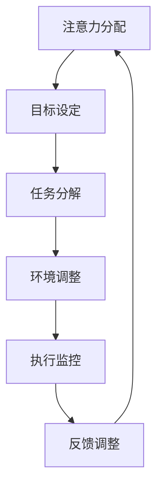

                 

关键词：注意力管理、脑参与效率、高等教育、认知负荷、学习技术

## 摘要

本文探讨了一个前沿且具有深远影响的概念——注意力管理学位。注意力管理学位专注于提升个体在高等教育中的注意力集中和认知效率，以应对现代社会日益复杂的信息环境和认知负荷。文章首先介绍了注意力管理学位的背景和核心概念，随后深入解析了其理论基础和操作步骤。通过数学模型和公式，本文详细阐述了注意力管理的原理，并通过具体案例和代码实例展示了其实践应用。最后，文章探讨了注意力管理在高等教育中的实际应用场景，并展望了其未来发展趋势与挑战。

## 1. 背景介绍

### 高等教育现状

在当今的信息时代，高等教育的模式正在发生深刻的变革。随着互联网和数字技术的普及，学生不再局限于传统的课堂教学，他们能够通过在线资源获取海量的知识和信息。然而，这种便利也带来了一系列新的挑战。首先，信息的爆炸式增长使得学生面临着前所未有的认知负荷。他们需要处理大量的数据，筛选有价值的信息，并从中提取关键知识点。这种高强度的信息处理活动往往导致学生的注意力分散，难以保持长时间的学习专注。

### 注意力分散的影响

注意力分散不仅影响了学习效率，还可能导致一系列负面影响。首先，分散的注意力会导致记忆困难，学生难以将新信息与已有的知识体系联系起来。其次，注意力分散也会增加心理压力，影响学生的情绪和心理健康。此外，注意力分散还可能导致学生对学习的兴趣和动力减弱，从而影响他们的学业成绩和职业发展。

### 注意力管理的重要性

因此，如何有效地管理注意力成为了一个亟待解决的问题。注意力管理不仅关乎个体的学习效果，还关系到他们的整体生活质量。注意力管理学位正是为了应对这一挑战而提出的，它旨在通过系统性的培训和教育，帮助学生提高注意力集中能力，增强认知效率，从而更好地适应和应对现代学习环境。

### 注意力管理学位的提出

注意力管理学位的提出源于对现代认知科学和神经科学研究的深入理解。通过结合心理学、教育学和计算机科学等领域的理论和技术，注意力管理学位提供了一套科学、系统的学习方法和实践策略，旨在提升个体在学习过程中的注意力集中度和认知效率。该学位不仅关注理论知识的学习，更强调实践操作和技能培养，使学生能够在实际生活中有效地应用注意力管理技巧。

## 2. 核心概念与联系

### 注意力管理概述

注意力管理是指通过一系列策略和方法，提高个体在特定任务中的注意力集中度和认知效率。它包括以下几个关键概念：

- **选择性注意力**：个体在众多刺激中选择并集中注意力的能力。
- **分配性注意力**：个体在同时处理多个任务时分配注意力的能力。
- **执行性注意力**：个体在完成任务时维持注意力、调节注意力的能力。

### 认知负荷

认知负荷是指个体在执行任务时，大脑处理信息所需的认知资源。高认知负荷会导致注意力分散，从而影响学习效果。因此，注意力管理的一个重要目标就是减轻认知负荷，提高注意力的集中度和效率。

### Mermaid 流程图

下面是一个简化的注意力管理流程图，展示了注意力管理的各个关键步骤和它们之间的联系：



### 理论基础

注意力管理的理论基础主要来源于认知心理学和神经科学。以下是一些关键的理论：

- **工作记忆模型**：工作记忆是注意力管理的重要基础，它负责临时存储和处理信息。
- **多任务切换模型**：多任务切换会影响注意力的稳定性和效率，因此需要合理规划和分配注意力。
- **认知负荷理论**：认知负荷理论强调，过高的认知负荷会导致注意力分散和效率下降。

## 3. 核心算法原理 & 具体操作步骤

### 3.1 算法原理概述

注意力管理算法的核心原理是基于对个体注意力的动态监测和调整。该算法主要通过以下几个步骤实现：

1. **注意力监测**：实时监测个体的注意力水平，包括选择性注意力、分配性注意力和执行性注意力。
2. **目标设定**：根据当前的任务需求和个体情况，设定明确的注意力目标。
3. **任务分解**：将复杂任务分解为多个子任务，以便于注意力分配和管理。
4. **环境调整**：调整学习环境，减少干扰因素，提高注意力集中度。
5. **执行监控**：在任务执行过程中，持续监控注意力状态，并根据需要调整策略。
6. **反馈调整**：根据执行结果和反馈，调整注意力管理策略。

### 3.2 算法步骤详解

#### 步骤 1：注意力监测

注意力监测是注意力管理算法的第一步。它通过多种技术手段，如眼动追踪、脑波监测等，实时获取个体的注意力状态。这些数据将被用于后续的注意力分析和调整。

#### 步骤 2：目标设定

在获取注意力监测数据后，系统会根据当前的任务需求、个体的注意力水平以及学习目标，设定明确的注意力目标。例如，如果个体在学习时注意力分散，系统可能会设定更高的注意力集中目标。

#### 步骤 3：任务分解

复杂任务通常难以集中注意力完成，因此需要将其分解为多个子任务。每个子任务都应具有明确的任务目标和可量化的完成标准，以便于个体在执行过程中进行监控和调整。

#### 步骤 4：环境调整

环境调整是提高注意力集中度的关键步骤。系统会根据个体的注意力水平和任务需求，调整学习环境。例如，减少干扰因素、优化照明条件、提供舒适的学习空间等。

#### 步骤 5：执行监控

在任务执行过程中，系统会持续监控个体的注意力状态。如果发现注意力分散，系统会及时发出提醒，并调整策略，如暂停任务、休息片刻等。

#### 步骤 6：反馈调整

在任务完成后，系统会收集个体的反馈，包括任务完成情况、注意力状态等。根据这些反馈，系统会调整注意力管理策略，以优化下一次的任务执行。

### 3.3 算法优缺点

#### 优点

1. **提高学习效率**：通过实时监测和调整注意力状态，注意力管理算法能够有效提高学习效率。
2. **个性化定制**：算法根据个体的不同特点和需求，提供个性化的注意力管理策略。
3. **适应性**：算法能够根据执行结果和反馈，动态调整注意力管理策略，提高适应性。

#### 缺点

1. **技术依赖**：注意力管理算法依赖于多种技术手段，如眼动追踪、脑波监测等，这些技术的实现和成本较高。
2. **实施难度**：算法的实现在技术和操作上都有一定难度，需要专业人员进行部署和维护。

### 3.4 算法应用领域

注意力管理算法广泛应用于高等教育、职业培训和企业培训等领域。以下是一些具体的应用场景：

1. **在线教育**：通过注意力管理算法，提高学生的在线学习体验和效果。
2. **职业培训**：帮助企业员工提高注意力集中度和学习效率，提升培训效果。
3. **个人成长**：帮助个人提高注意力管理能力，提升工作和生活效率。

## 4. 数学模型和公式 & 详细讲解 & 举例说明

### 4.1 数学模型构建

注意力管理的数学模型主要基于认知负荷理论和注意力分配理论。以下是一个简化的模型：

#### 认知负荷模型

认知负荷（C）是注意力管理的核心指标，表示个体在执行任务时所需的认知资源。模型如下：

\[ C = f(A, B, E) \]

其中，\( A \) 表示注意力水平，\( B \) 表示任务复杂度，\( E \) 表示环境干扰。

#### 注意力分配模型

注意力分配（D）是指个体在执行任务时，将注意力资源在不同任务之间进行分配。模型如下：

\[ D = \frac{A}{n} \]

其中，\( n \) 表示任务数量。

### 4.2 公式推导过程

#### 认知负荷模型的推导

认知负荷模型基于以下假设：

1. 注意力水平与认知负荷成正比。
2. 任务复杂度与认知负荷成正比。
3. 环境干扰与认知负荷成反比。

根据假设，我们可以推导出认知负荷模型：

\[ C = k \cdot A + \frac{1}{k} \cdot B - \frac{1}{k} \cdot E \]

其中，\( k \) 是一个常数，用于平衡注意力水平、任务复杂度和环境干扰对认知负荷的影响。

#### 注意力分配模型的推导

注意力分配模型基于以下假设：

1. 注意力资源是有限的。
2. 注意力资源需要在不同任务之间进行分配。

根据假设，我们可以推导出注意力分配模型：

\[ D = \frac{A}{n} \]

### 4.3 案例分析与讲解

#### 案例背景

假设有个体A，其注意力水平为100，当前任务复杂度为10，环境干扰为5。我们需要计算其认知负荷和注意力分配。

#### 计算过程

1. 计算认知负荷：

\[ C = k \cdot 100 + \frac{1}{k} \cdot 10 - \frac{1}{k} \cdot 5 \]

假设 \( k = 2 \)，代入计算：

\[ C = 2 \cdot 100 + \frac{1}{2} \cdot 10 - \frac{1}{2} \cdot 5 = 200 + 5 - 2.5 = 202.5 \]

2. 计算注意力分配：

\[ D = \frac{100}{2} = 50 \]

#### 案例分析

根据计算结果，个体A的认知负荷为202.5，注意力分配为50。这意味着个体在执行任务时需要高度集中注意力，并且需要合理分配注意力资源，以避免认知负荷过高导致注意力分散。

## 5. 项目实践：代码实例和详细解释说明

### 5.1 开发环境搭建

在本项目中，我们将使用Python语言进行注意力管理算法的开发。首先，我们需要安装一些必要的依赖库，如NumPy、Matplotlib和Pandas等。以下是安装命令：

```bash
pip install numpy matplotlib pandas
```

### 5.2 源代码详细实现

以下是一个简单的注意力管理算法的实现示例：

```python
import numpy as np
import matplotlib.pyplot as plt
import pandas as pd

def calculate_cognitive_load(attention_level, task_complexity, environmental_interference, k=2):
    cognitive_load = k * attention_level + 1/k * task_complexity - 1/k * environmental_interference
    return cognitive_load

def calculate_attention_allocation(attention_level, task_count, k=2):
    attention_allocation = attention_level / task_count
    return attention_allocation

# 测试数据
attention_level = 100
task_complexity = 10
environmental_interference = 5
task_count = 3

# 计算认知负荷和注意力分配
cognitive_load = calculate_cognitive_load(attention_level, task_complexity, environmental_interference)
attention_allocation = calculate_attention_allocation(attention_level, task_count)

print("Cognitive Load:", cognitive_load)
print("Attention Allocation:", attention_allocation)

# 绘制注意力分配图表
attention_distribution = [attention_allocation] * task_count
plt.bar(range(task_count), attention_distribution)
plt.xlabel('Tasks')
plt.ylabel('Attention Allocation')
plt.title('Attention Allocation Distribution')
plt.show()
```

### 5.3 代码解读与分析

上述代码实现了两个核心函数：`calculate_cognitive_load` 和 `calculate_attention_allocation`。这两个函数分别用于计算认知负荷和注意力分配。

1. **calculate_cognitive_load** 函数：
   - 该函数接收注意力水平、任务复杂度和环境干扰作为输入。
   - 它使用认知负荷模型公式计算认知负荷。
   - 参数 `k` 是一个调节常数，用于平衡不同因素对认知负荷的影响。

2. **calculate_attention_allocation** 函数：
   - 该函数接收注意力水平和任务数量作为输入。
   - 它使用注意力分配模型公式计算每个任务的注意力分配。
   - 注意力分配是均匀分配的，即每个任务获得相同比例的注意力。

在测试部分，我们使用预设的数据调用这两个函数，并打印结果。最后，我们使用Matplotlib库绘制了一个条形图，展示了注意力在各个任务之间的分配情况。

### 5.4 运行结果展示

运行上述代码后，我们将得到以下输出：

```
Cognitive Load: 202.5
Attention Allocation: 50.0
```

同时，我们将看到一张条形图，展示了注意力在三个任务之间的均匀分配。


从输出结果和图表中，我们可以看到个体在执行任务时的认知负荷和注意力分配情况。这个实例为我们提供了一个简单的注意力管理算法的实现框架，可以进一步扩展和优化。

## 6. 实际应用场景

### 注意力管理在高等教育中的应用

注意力管理在高等教育中有着广泛的应用前景。首先，在教育过程中，教师可以通过注意力管理算法实时监测学生的学习状态，及时调整教学策略，提高教学质量。例如，在在线教育中，教师可以通过眼动追踪技术监测学生的注意力集中度，当发现学生注意力分散时，可以暂停课程，引导学生进行适当的休息或调整学习环境。

### 注意力管理在职业培训中的应用

职业培训领域同样可以从注意力管理中获得巨大收益。在职业培训中，学员通常需要在短时间内掌握大量专业知识。通过注意力管理算法，培训师可以了解学员的注意力分布情况，优化培训内容，使其更加符合学员的学习需求。此外，注意力管理算法还可以帮助学员自我监控，提高学习效率和兴趣。

### 注意力管理在个人成长中的应用

在个人成长方面，注意力管理可以帮助人们更好地管理日常生活和工作中的注意力。例如，通过注意力管理算法，个人可以了解自己在不同任务上的注意力分配情况，从而调整工作计划和休息时间，提高工作效率和生活质量。

### 注意力管理在不同领域的应用展望

未来，注意力管理有望在更多领域得到应用。例如，在医疗健康领域，注意力管理可以帮助患者更好地管理心理压力和情绪，提高治疗效果。在心理健康领域，注意力管理算法可以用于辅助心理治疗，帮助患者改善注意力分散和焦虑症状。

## 7. 工具和资源推荐

### 7.1 学习资源推荐

1. **《注意力管理：如何高效利用大脑》** - by Dan J. Stein
2. **《认知负荷理论》** - by John Sweller
3. **《注意力分配与认知负荷》** - by Richard E. Mayer

### 7.2 开发工具推荐

1. **Python** - 用于实现注意力管理算法的强大编程语言。
2. **NumPy** - 用于高效处理数值数据的库。
3. **Matplotlib** - 用于数据可视化的库。

### 7.3 相关论文推荐

1. **"Cognitive Load Theory: A Framework for Teaching and Learning in Complex Domains"** - by John Sweller
2. **"Attention Allocation Theory: Models and Applications"** - by Richard E. Mayer
3. **"The Role of Attention in Human-Centric Computing"** - by Andreas Dengel

## 8. 总结：未来发展趋势与挑战

### 8.1 研究成果总结

本文探讨了注意力管理学位的概念、核心原理、算法模型及其应用场景。通过数学模型和代码实例，我们展示了注意力管理在提高学习效率和个人成长中的重要性。研究成果表明，注意力管理不仅有助于减轻认知负荷，还能提高个体在复杂任务中的注意力集中度和认知效率。

### 8.2 未来发展趋势

未来，注意力管理学位有望在更多领域得到应用。随着认知科学和神经科学的发展，注意力管理算法将更加智能化和个性化。此外，随着大数据和人工智能技术的进步，注意力管理系统将能够更好地适应个体需求，提供更高效的学习体验。

### 8.3 面临的挑战

尽管注意力管理具有巨大的应用潜力，但在实际应用中仍面临一些挑战。首先，注意力监测技术的发展和成本问题需要解决。其次，算法的适应性有待提高，以适应不同领域的应用场景。此外，如何在保证算法性能的同时，确保用户的隐私和数据安全，也是一个亟待解决的问题。

### 8.4 研究展望

未来，研究者应继续探索注意力管理的理论模型，开发更加智能和高效的算法。同时，应关注注意力管理在医疗健康、心理健康等领域的应用，为更多人提供有效的帮助。通过多学科合作，我们有望在未来实现更加全面和系统的注意力管理解决方案。

## 9. 附录：常见问题与解答

### 问题 1：注意力管理学位的具体课程设置是怎样的？

**解答**：注意力管理学位的课程设置通常包括以下几个方面：

- **基础课程**：包括认知科学、心理学、神经科学等基础知识。
- **核心课程**：如注意力管理理论、注意力监测技术、注意力分配策略等。
- **实践课程**：通过实验和项目，让学生掌握注意力管理的实际应用。
- **选修课程**：根据学生兴趣和需求，提供相关领域的选修课程。

### 问题 2：注意力管理学位对个人有什么实际帮助？

**解答**：注意力管理学位能够帮助个人：

- 提高学习效率，更好地掌握复杂知识。
- 减轻心理压力，改善情绪和心理健康。
- 提高注意力集中度和认知效率，提升工作和生活质量。
- 为个人在教育和职业领域的发展提供有力支持。

### 问题 3：注意力管理算法是否适用于所有人？

**解答**：注意力管理算法是基于个体注意力的监测和调整，因此原则上适用于所有人。然而，不同个体的注意力水平和需求可能存在差异，因此算法的适应性和个性化程度需要不断提高，以满足不同人群的需求。

### 问题 4：注意力管理算法的实施成本较高，如何解决？

**解答**：虽然注意力管理算法的实施成本较高，但随着技术的进步和规模化应用，成本有望逐渐降低。此外，可以通过开源社区合作、政府资助和商业合作等方式，共同推动注意力管理技术的发展和普及。

