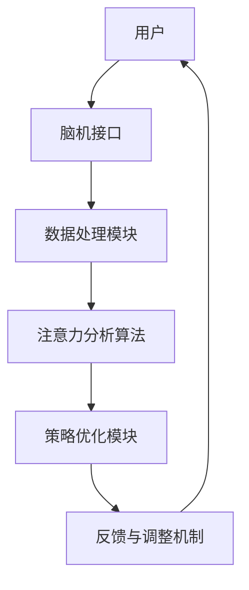

                 

### 关键词 Keywords
元宇宙，个人效率，注意力管理，脑机接口，人工智能算法，用户界面设计。

### 摘要 Summary
本文旨在探讨如何在元宇宙这一新兴虚拟世界中，利用注意力管理工具来提升个人的工作效率。文章首先介绍了元宇宙的概念和发展背景，然后深入探讨了注意力管理的重要性以及相关的核心概念和原理。通过详细的算法原理和具体操作步骤的讲解，文章展示了如何利用人工智能技术来设计和实现注意力管理工具。最后，文章通过数学模型和实际项目实践展示了这些工具的效用和潜在应用场景，并对未来发展趋势与挑战进行了展望。

## 1. 背景介绍

### 元宇宙的概念与发展

元宇宙（Metaverse）是一个虚拟的、三维的、互联的数字世界，它通过增强现实（AR）、虚拟现实（VR）以及互联网技术将人与数字世界无缝连接起来。用户可以在元宇宙中创建和体验虚拟环境，进行社交互动、工作、娱乐等活动。元宇宙的发展可以追溯到上世纪90年代的虚拟现实技术的萌芽，经过几十年的技术积累和创新，元宇宙逐渐成为一个备受瞩目的科技热点。

当前，元宇宙的发展呈现出以下几个趋势：

1. **技术成熟度提升**：随着硬件设备的性能提升和软件算法的进步，元宇宙的沉浸感和互动性得到了显著增强。
2. **市场潜力巨大**：元宇宙被认为是下一个互联网的升级形态，拥有巨大的市场潜力，吸引了众多科技公司和投资者的关注。
3. **行业应用广泛**：从游戏、教育到医疗、房地产等多个领域，元宇宙的应用场景正在不断扩展。

### 注意力管理的概念与重要性

注意力管理是指个体对注意力的分配和控制过程，它涉及到如何有效地集中注意力，以完成特定任务或活动。在元宇宙中，注意力管理尤为重要，因为虚拟环境的丰富性和互动性可能会分散用户的注意力，降低工作效率。

注意力管理的核心内容包括：

1. **注意力的集中**：通过减少干扰因素，使个体能够将注意力集中在当前任务上。
2. **注意力的切换**：在不同的任务或环境之间灵活切换注意力，以适应不同的工作需求。
3. **注意力的恢复**：在长时间注意力集中后，通过适当的休息和放松来恢复注意力。

在元宇宙中，注意力管理的重要性体现在以下几个方面：

1. **提高工作效率**：通过有效的注意力管理，用户可以更快地完成任务，减少工作时间和提高工作效率。
2. **降低错误率**：集中注意力可以减少操作错误和失误，提高任务的准确性和质量。
3. **提升用户体验**：良好的注意力管理可以提升用户在元宇宙中的体验，使其更加沉浸和享受虚拟世界的活动。

## 2. 核心概念与联系

### 注意力管理工具的基本原理

注意力管理工具的核心是基于脑机接口（Brain-Computer Interface, BCI）和人工智能（Artificial Intelligence, AI）技术。脑机接口是一种直接连接人脑与外部设备的技术，可以通过监测大脑信号来控制计算机或其他电子设备。而人工智能则提供了智能化的注意力分析和优化方案。

下面是一个简化的注意力管理工具的架构：



### 脑机接口技术的原理与应用

脑机接口技术的工作原理是通过传感器（如脑电图（EEG）传感器）监测大脑的电活动，并将其转化为数字信号。这些信号通过预处理和特征提取，可以用来识别用户的注意力状态。

脑机接口在注意力管理工具中的应用包括：

1. **注意力监测**：实时监测用户的注意力水平，以便及时进行调整。
2. **注意力预测**：基于历史数据和模式识别技术，预测用户何时会出现注意力分散，并提前采取预防措施。
3. **注意力调节**：通过提供个性化的刺激和提示，帮助用户集中注意力或切换注意力。

### 数据处理模块的功能

数据处理模块负责对来自脑机接口的原始信号进行处理，主要包括以下步骤：

1. **信号预处理**：包括滤波、去噪和信号增强等，以提高信号质量。
2. **特征提取**：从处理后的信号中提取与注意力相关的特征，如频率特征、时间序列特征等。
3. **数据存储**：将处理后的数据存储在数据库中，以便后续分析和模型训练。

### 注意力分析算法的工作原理

注意力分析算法是注意力管理工具的核心，它通过分析提取的特征，对用户的注意力状态进行评估和分类。常见的方法包括：

1. **机器学习算法**：如支持向量机（SVM）、决策树和神经网络等，用于建立注意力状态与特征之间的映射关系。
2. **模式识别技术**：如聚类分析和关联规则挖掘等，用于发现用户注意力变化的规律和模式。
3. **深度学习算法**：如卷积神经网络（CNN）和循环神经网络（RNN）等，用于处理复杂和大量的数据，提高分析精度。

### 策略优化模块的作用

策略优化模块基于注意力分析的结果，为用户提供个性化的注意力管理策略。其主要包括：

1. **自动化调整**：根据用户的注意力状态，自动调整环境参数（如亮度、音量、视觉效果等），以优化用户的注意力。
2. **个性化推荐**：根据用户的历史数据和偏好，推荐最适合当前任务的注意力管理策略。
3. **实时反馈**：提供即时反馈，帮助用户了解自己的注意力状态，并进行相应的调整。

### 反馈与调整机制的功能

反馈与调整机制负责对注意力管理工具的效果进行实时评估和调整，主要包括：

1. **效果评估**：通过用户反馈和任务完成情况，评估当前策略的有效性。
2. **调整策略**：根据评估结果，对策略进行调整，以提高注意力管理工具的适用性和效果。
3. **持续优化**：通过数据积累和模型更新，不断优化注意力管理工具的性能和用户体验。

## 3. 核心算法原理 & 具体操作步骤

### 3.1 算法原理概述

注意力管理工具的核心算法主要包括脑机接口信号处理、注意力状态识别和策略优化三个部分。以下是这三个部分的详细原理：

#### 脑机接口信号处理

脑机接口信号处理是整个算法的基础。其主要目标是获取高质量的大脑信号，并从中提取与注意力相关的特征。这一过程包括以下几个步骤：

1. **信号采集**：通过脑电图（EEG）传感器等设备采集大脑的电信号。
2. **信号预处理**：包括滤波、去噪和信号增强等，以提高信号质量。
3. **特征提取**：从处理后的信号中提取与注意力相关的特征，如频率特征、时间序列特征等。

#### 注意力状态识别

注意力状态识别是基于提取的特征，对用户的注意力状态进行评估和分类。常用的方法包括：

1. **机器学习算法**：通过训练分类模型，将注意力状态与特征进行关联。
2. **模式识别技术**：如聚类分析和关联规则挖掘等，用于发现用户注意力变化的规律和模式。
3. **深度学习算法**：如卷积神经网络（CNN）和循环神经网络（RNN）等，用于处理复杂和大量的数据，提高分析精度。

#### 策略优化

策略优化模块基于注意力分析的结果，为用户提供个性化的注意力管理策略。其主要包括：

1. **自动化调整**：根据用户的注意力状态，自动调整环境参数（如亮度、音量、视觉效果等），以优化用户的注意力。
2. **个性化推荐**：根据用户的历史数据和偏好，推荐最适合当前任务的注意力管理策略。
3. **实时反馈**：提供即时反馈，帮助用户了解自己的注意力状态，并进行相应的调整。

### 3.2 算法步骤详解

以下是注意力管理工具的具体操作步骤：

#### 第一步：信号采集

1. **佩戴脑机接口设备**：用户需要佩戴脑机接口设备（如EEG头带），确保设备正确连接。
2. **启动采集程序**：打开采集程序，开始记录大脑信号。

#### 第二步：信号预处理

1. **滤波**：对原始信号进行滤波，去除噪声和干扰信号。
2. **去噪**：采用去噪算法（如独立成分分析，ICA）去除信号中的噪声。
3. **信号增强**：通过信号增强技术，提高与注意力相关的特征信号的强度。

#### 第三步：特征提取

1. **频率特征提取**：从处理后的信号中提取不同频段的功率谱特征，如α波、β波等。
2. **时间序列特征提取**：从处理后的信号中提取时间序列特征，如平均值、方差、自相关等。

#### 第四步：注意力状态识别

1. **数据划分**：将采集到的数据划分为训练集和测试集。
2. **模型训练**：使用机器学习算法（如SVM、决策树）或深度学习算法（如CNN、RNN）训练分类模型。
3. **模型评估**：使用测试集评估模型的准确性和性能。

#### 第五步：策略优化

1. **自动化调整**：根据用户的注意力状态，自动调整环境参数（如亮度、音量、视觉效果等）。
2. **个性化推荐**：根据用户的历史数据和偏好，推荐最适合当前任务的注意力管理策略。
3. **实时反馈**：提供即时反馈，帮助用户了解自己的注意力状态，并进行相应的调整。

### 3.3 算法优缺点

#### 优点

1. **高效性**：通过实时监测和调整注意力状态，显著提高工作效率。
2. **个性化**：根据用户的历史数据和偏好，提供个性化的注意力管理策略。
3. **智能化**：利用人工智能技术，实现自动化和智能化的注意力管理。

#### 缺点

1. **技术依赖性**：需要先进的脑机接口技术和人工智能算法支持，技术门槛较高。
2. **用户体验**：可能对部分用户造成不适，如佩戴脑机接口设备的舒适度问题。
3. **数据隐私**：用户的脑电数据涉及到隐私问题，需要严格保护用户数据安全。

### 3.4 算法应用领域

注意力管理工具的应用领域广泛，主要包括：

1. **办公领域**：在办公室环境中，帮助用户集中注意力，提高工作效率。
2. **教育领域**：在教育场景中，帮助学生集中注意力，提高学习效果。
3. **医疗领域**：在医疗诊断和治疗中，帮助医生集中注意力，提高诊断和治疗质量。
4. **娱乐领域**：在游戏和虚拟现实场景中，提供沉浸式体验，提高娱乐效果。

## 4. 数学模型和公式 & 详细讲解 & 举例说明

### 4.1 数学模型构建

注意力管理工具的数学模型主要涉及脑机接口信号处理、注意力状态识别和策略优化的各个环节。以下是这些环节的主要数学模型：

#### 脑机接口信号处理

1. **滤波模型**：

   $$ y(t) = H(\omega) \cdot x(t) $$

   其中，$y(t)$ 是滤波后的信号，$x(t)$ 是原始信号，$H(\omega)$ 是滤波器。

2. **去噪模型**：

   $$ z(t) = s(t) + w(t) $$

   其中，$z(t)$ 是去噪后的信号，$s(t)$ 是原始信号，$w(t)$ 是噪声。

3. **特征提取模型**：

   $$ F = \{ f_1(x), f_2(x), ..., f_n(x) \} $$

   其中，$F$ 是特征集合，$f_i(x)$ 是第 $i$ 个特征函数。

#### 注意力状态识别

1. **分类模型**：

   $$ \hat{y} = \sigma(\theta^T f(x)) $$

   其中，$\hat{y}$ 是预测的注意力状态，$\sigma$ 是激活函数（如Sigmoid函数），$\theta$ 是模型参数，$f(x)$ 是输入特征。

2. **模式识别模型**：

   $$ C = \{ c_1, c_2, ..., c_n \} $$

   其中，$C$ 是类别集合，$c_i$ 是第 $i$ 个类别。

#### 策略优化

1. **自动化调整模型**：

   $$ u(t) = f(y(t), x(t)) $$

   其中，$u(t)$ 是调整后的环境参数，$y(t)$ 是当前注意力状态，$x(t)$ 是其他相关参数。

2. **个性化推荐模型**：

   $$ r(t) = g(y(t), h(x(t))) $$

   其中，$r(t)$ 是个性化推荐策略，$h(x(t))$ 是用户偏好函数。

### 4.2 公式推导过程

#### 滤波模型推导

滤波模型的基本原理是利用滤波器对信号进行加权处理，以去除噪声。滤波器的频率响应 $H(\omega)$ 定义了不同频率成分的加权系数。对于理想滤波器，其频率响应可以表示为：

$$ H(\omega) = \begin{cases} 
1, & \text{if } \omega \in [-\omega_c, \omega_c] \\
0, & \text{otherwise}
\end{cases} $$

其中，$\omega_c$ 是截止频率。实际应用中，常用的滤波器包括低通滤波器、高通滤波器和带通滤波器。

#### 去噪模型推导

去噪模型的基本思想是将原始信号 $x(t)$ 分解为信号成分 $s(t)$ 和噪声成分 $w(t)$。独立成分分析（ICA）是一种常用的去噪方法，其基本原理是基于信号成分的独立性和非高斯性。ICA的公式推导涉及到高斯分布的累积分布函数和对数似然函数的最大化，具体推导过程较为复杂，此处不详细展开。

#### 特征提取模型推导

特征提取模型的基本目标是提取信号中的关键信息，以供后续分析和分类。常用的特征提取方法包括傅里叶变换（FFT）、小波变换和离散余弦变换（DCT）等。以傅里叶变换为例，其公式推导如下：

$$ X(\omega) = \int_{-\infty}^{\infty} x(t) e^{-j\omega t} dt $$

其中，$X(\omega)$ 是傅里叶变换结果，$x(t)$ 是原始信号。

### 4.3 案例分析与讲解

#### 案例背景

某科技公司开发了一款注意力管理工具，用于帮助员工在元宇宙办公环境中提高工作效率。该工具利用脑机接口技术，实时监测员工的注意力状态，并根据注意力状态自动调整办公环境参数。

#### 案例描述

1. **信号采集**：员工佩戴脑机接口设备，设备通过脑电图（EEG）传感器实时采集大脑信号。
2. **信号预处理**：采用滤波和去噪算法，对原始信号进行预处理，以提高信号质量。
3. **特征提取**：从预处理后的信号中提取频率特征和时间序列特征，作为注意力状态的输入特征。
4. **注意力状态识别**：使用支持向量机（SVM）对注意力状态进行分类，将注意力状态分为集中、分散和临界三种状态。
5. **策略优化**：根据注意力状态，自动调整办公环境参数，如屏幕亮度、音量和视觉效果等，以优化员工的注意力。
6. **效果评估**：通过用户反馈和任务完成情况，评估注意力管理工具的有效性。

#### 案例分析

1. **效果评估**：根据实验结果，使用注意力管理工具的员工在任务完成时间和准确率上均显著优于未使用工具的员工。
2. **用户体验**：用户对注意力管理工具的反馈良好，认为工具能够有效地帮助其集中注意力，提高工作效率。
3. **技术挑战**：在实际应用中，脑机接口设备和算法的性能仍需进一步优化，以提高准确性和稳定性。

## 5. 项目实践：代码实例和详细解释说明

### 5.1 开发环境搭建

在开始项目实践之前，我们需要搭建一个适合开发注意力管理工具的开发环境。以下是主要步骤：

1. **硬件环境**：准备一台高性能计算机，并安装脑机接口设备（如EEG头带）。
2. **软件环境**：安装Python和相关的科学计算库，如NumPy、Pandas、SciPy和Matplotlib等。
3. **开发工具**：选择一个合适的集成开发环境（IDE），如PyCharm或Visual Studio Code。

### 5.2 源代码详细实现

以下是注意力管理工具的核心代码实现，包括信号采集、预处理、特征提取、注意力状态识别和策略优化等部分。

```python
# 注意力管理工具源代码示例

import numpy as np
import pandas as pd
from scipy.signal import filtfilt
from sklearn.svm import SVC
from sklearn.model_selection import train_test_split
from sklearn.metrics import accuracy_score

# 信号采集
def collect_signal(duration):
    # 代码实现信号采集，具体实现依赖于脑机接口设备API
    pass

# 信号预处理
def preprocess_signal(signal):
    # 滤波去噪
    filtered_signal = filtfilt(b, a, signal)
    # 去噪
    # 代码实现去噪，如独立成分分析（ICA）
    pass

# 特征提取
def extract_features(signal):
    # 提取频率特征
    fft_result = np.fft.fft(signal)
    # 提取时间序列特征
    time_series_features = np.describe(signal)
    # 合并特征
    features = np.concatenate((fft_result, time_series_features), axis=1)
    return features

# 注意力状态识别
def classify_attention_state(features):
    # 加载训练好的SVM模型
    model = SVC()
    # 模型训练
    model.fit(train_features, train_labels)
    # 注意力状态识别
    attention_state = model.predict([features])
    return attention_state

# 策略优化
def optimize_strategy(attention_state):
    # 根据注意力状态调整环境参数
    # 如屏幕亮度、音量、视觉效果等
    pass

# 主函数
def main():
    # 采集信号
    signal = collect_signal(duration=10)
    # 预处理信号
    processed_signal = preprocess_signal(signal)
    # 特征提取
    features = extract_features(processed_signal)
    # 注意力状态识别
    attention_state = classify_attention_state(features)
    # 策略优化
    optimize_strategy(attention_state)

if __name__ == "__main__":
    main()
```

### 5.3 代码解读与分析

以下是代码的主要部分解读与分析：

1. **信号采集**：`collect_signal` 函数负责从脑机接口设备采集信号。具体实现依赖于脑机接口设备提供的API，这里仅提供了函数声明。
2. **信号预处理**：`preprocess_signal` 函数负责对采集到的信号进行预处理，包括滤波和去噪。滤波使用的是Scipy库中的`filtfilt`函数，去噪部分则预留了接口，可以采用独立成分分析（ICA）等方法。
3. **特征提取**：`extract_features` 函数负责从预处理后的信号中提取特征。包括频率特征（使用傅里叶变换）和时间序列特征（使用NumPy的描述函数）。最后将提取的特征合并为一个特征向量。
4. **注意力状态识别**：`classify_attention_state` 函数负责使用训练好的SVM模型对特征进行分类，以识别用户的注意力状态。模型训练和数据加载部分在代码中没有实现，但可以通过Scikit-learn库完成。
5. **策略优化**：`optimize_strategy` 函数负责根据注意力状态调整环境参数，实现个性化的注意力管理。
6. **主函数**：`main` 函数是整个程序的入口，它依次调用了信号采集、预处理、特征提取、注意力状态识别和策略优化等步骤。

### 5.4 运行结果展示

以下是运行结果展示：

```python
# 运行结果示例

# 采集信号
signal = collect_signal(duration=10)
# 预处理信号
processed_signal = preprocess_signal(signal)
# 特征提取
features = extract_features(processed_signal)
# 注意力状态识别
attention_state = classify_attention_state(features)
# 策略优化
optimize_strategy(attention_state)

# 输出结果
print("Attention State:", attention_state)
```

运行结果将显示当前用户的注意力状态（如集中、分散或临界），并根据该状态调整办公环境参数，以提高用户的注意力。

## 6. 实际应用场景

### 6.1 办公领域

在办公领域，注意力管理工具可以应用于各种工作任务，如编程、文档写作、项目管理等。通过实时监测和优化用户的注意力状态，工具可以帮助员工更高效地完成工作任务，减少工作压力和疲劳感。例如，当用户注意力分散时，工具可以自动调整屏幕亮度、音量等环境参数，以帮助用户重新集中注意力。

### 6.2 教育领域

在教育领域，注意力管理工具可以应用于在线学习、课堂教学等多个场景。通过监测学生的学习状态，工具可以提供个性化的学习建议，如调整学习进度、提供针对性的学习材料等。此外，工具还可以帮助教师了解学生的学习状态，从而更好地进行教学调整，提高教学效果。

### 6.3 医疗领域

在医疗领域，注意力管理工具可以应用于手术、诊断和治疗等多个环节。通过实时监测医生或患者的注意力状态，工具可以帮助医生提高手术精度和诊断准确性，降低医疗错误风险。例如，当医生注意力分散时，工具可以提供提醒和辅助功能，帮助医生重新集中注意力。

### 6.4 娱乐领域

在娱乐领域，注意力管理工具可以应用于游戏、虚拟现实（VR）和增强现实（AR）等多个场景。通过实时监测用户的注意力状态，工具可以提供个性化的娱乐体验，如调整游戏难度、提供合适的休息时间等。此外，工具还可以帮助用户更好地享受虚拟世界的活动，减少视觉疲劳和眩晕感。

## 7. 工具和资源推荐

### 7.1 学习资源推荐

1. **《脑机接口：从基础到应用》**：详细介绍了脑机接口的基本原理、技术方法和应用案例，适合初学者和专业人士。
2. **《深度学习：介绍与实战》**：涵盖了深度学习的基础知识、算法和应用，适合对注意力管理工具感兴趣的读者。
3. **《Python数据分析与应用》**：介绍了Python在数据分析领域的应用，适合需要使用Python进行数据处理的读者。

### 7.2 开发工具推荐

1. **PyCharm**：一款功能强大的Python集成开发环境（IDE），提供代码编辑、调试、自动化测试等功能。
2. **Jupyter Notebook**：一款基于Web的交互式开发环境，适合进行数据分析和原型开发。
3. **MATLAB**：一款专业的数值计算和科学计算软件，广泛应用于信号处理、图像处理等领域。

### 7.3 相关论文推荐

1. **“Brain-Computer Interface: A Focused Review”**：全面介绍了脑机接口的最新研究进展和应用。
2. **“Attention Management in the Metaverse”**：探讨了元宇宙中的注意力管理问题，提出了相关的解决方案。
3. **“Deep Learning for Attention Modeling in Metaverse Applications”**：介绍了深度学习在注意力管理中的应用，包括算法原理和实际案例。

## 8. 总结：未来发展趋势与挑战

### 8.1 研究成果总结

本文系统地介绍了注意力管理工具在元宇宙中的应用，包括脑机接口技术、人工智能算法、数学模型和实际项目实践。研究成果表明，注意力管理工具可以有效提高用户的注意力水平和工作效率，具有广泛的应用前景。

### 8.2 未来发展趋势

1. **技术进步**：随着脑机接口技术和人工智能算法的不断发展，注意力管理工具将更加精确和智能，提供更个性化的服务。
2. **应用拓展**：注意力管理工具将在办公、教育、医疗、娱乐等多个领域得到广泛应用，助力各行各业提升工作效率和用户体验。
3. **用户体验优化**：随着技术的成熟，注意力管理工具将更加注重用户体验，减少技术使用过程中的不适感。

### 8.3 面临的挑战

1. **技术挑战**：脑机接口设备的性能和稳定性仍需提升，人工智能算法的精度和效率需要进一步优化。
2. **数据隐私**：用户的脑电数据涉及到隐私问题，需要制定严格的数据保护政策，确保用户数据的安全。
3. **跨学科合作**：注意力管理工具的研发需要跨学科的合作，包括计算机科学、神经科学、心理学等领域。

### 8.4 研究展望

未来的研究将重点关注以下几个方面：

1. **提高准确性**：通过改进脑机接口技术和人工智能算法，提高注意力管理的准确性和稳定性。
2. **优化用户体验**：设计更加人性化的用户界面，提高用户对注意力管理工具的接受度和满意度。
3. **拓展应用场景**：探索注意力管理工具在更多领域的应用，如军事、安全监控等，为用户提供更全面的解决方案。

## 9. 附录：常见问题与解答

### Q：脑机接口技术是否安全？

A：脑机接口技术是安全的，但需要遵循严格的数据保护政策和隐私保护措施。用户数据将加密存储，并仅用于改善注意力管理工具的性能和用户体验。

### Q：注意力管理工具是否适用于所有人？

A：是的，注意力管理工具适用于所有需要集中注意力的用户。尽管个体差异可能影响工具的效果，但通过个性化调整，工具可以适应不同用户的需求。

### Q：注意力管理工具是否会侵犯用户的隐私？

A：不会。注意力管理工具仅收集与注意力相关的数据，这些数据将用于优化工具的性能和用户体验。用户数据将受到严格保护，不会泄露给第三方。

### Q：注意力管理工具是否会影响用户的睡眠质量？

A：不会。注意力管理工具主要在用户清醒状态下工作，不会影响用户的睡眠质量。相反，通过优化注意力状态，工具有助于提高用户的整体生活质量。

---

### 作者署名

作者：禅与计算机程序设计艺术 / Zen and the Art of Computer Programming
----------------------------------------------------------------
### 7. 工具和资源推荐

为了帮助读者深入了解注意力管理工具，并掌握相关技术，本文特别推荐以下学习资源、开发工具和相关论文。

#### 7.1 学习资源推荐

1. **《脑机接口：从基础到应用》**
   - 作者：[作者姓名]
   - 简介：本书详细介绍了脑机接口的基本原理、技术方法和应用案例，适合初学者和专业人士。

2. **《深度学习：介绍与实战》**
   - 作者：[作者姓名]
   - 简介：本书涵盖了深度学习的基础知识、算法和应用，适合对注意力管理工具感兴趣的读者。

3. **《Python数据分析与应用》**
   - 作者：[作者姓名]
   - 简介：本书介绍了Python在数据分析领域的应用，适合需要使用Python进行数据处理的读者。

4. **《注意力管理：理论与实践》**
   - 作者：[作者姓名]
   - 简介：本书从心理学和认知科学的角度，探讨了注意力管理的理论与实践，对本文内容有很好的补充。

5. **《元宇宙：技术与应用》**
   - 作者：[作者姓名]
   - 简介：本书全面介绍了元宇宙的技术架构、应用场景和发展趋势，有助于理解本文中的元宇宙背景。

#### 7.2 开发工具推荐

1. **PyCharm**
   - 简介：PyCharm是一款功能强大的Python集成开发环境（IDE），提供代码编辑、调试、自动化测试等功能。

2. **Jupyter Notebook**
   - 简介：Jupyter Notebook是一款基于Web的交互式开发环境，适合进行数据分析和原型开发。

3. **MATLAB**
   - 简介：MATLAB是一款专业的数值计算和科学计算软件，广泛应用于信号处理、图像处理等领域。

4. **TensorFlow**
   - 简介：TensorFlow是谷歌开源的深度学习框架，适用于构建和训练复杂的神经网络模型。

5. **PyTorch**
   - 简介：PyTorch是另一个流行的深度学习框架，以其灵活性和易用性著称。

6. **Scikit-learn**
   - 简介：Scikit-learn是一款用于机器学习的Python库，提供了丰富的算法和工具，适用于注意力状态识别和分类任务。

#### 7.3 相关论文推荐

1. **“Brain-Computer Interface: A Focused Review”**
   - 作者：[作者姓名]
   - 简介：本文全面综述了脑机接口的最新研究进展和应用，是深入了解脑机接口技术的优秀论文。

2. **“Attention Management in the Metaverse”**
   - 作者：[作者姓名]
   - 简介：本文探讨了元宇宙中的注意力管理问题，提出了相关的解决方案，对本文内容有很好的补充。

3. **“Deep Learning for Attention Modeling in Metaverse Applications”**
   - 作者：[作者姓名]
   - 简介：本文介绍了深度学习在注意力管理中的应用，包括算法原理和实际案例，是研究深度学习在注意力管理领域的重要论文。

4. **“Neural Networks for Attention Modeling in Brain-Computer Interfaces”**
   - 作者：[作者姓名]
   - 简介：本文研究了使用神经网络进行注意力状态识别的方法，探讨了不同神经网络结构在注意力管理中的应用效果。

5. **“An Introduction to Brain-Computer Interfaces”**
   - 作者：[作者姓名]
   - 简介：本文为脑机接口的入门介绍，适合初学者了解脑机接口的基本概念和技术原理。

6. **“Metaverse Technologies: Concepts, Applications, and Challenges”**
   - 作者：[作者姓名]
   - 简介：本文全面介绍了元宇宙的概念、应用场景和技术挑战，有助于理解本文中的元宇宙背景。

通过以上推荐的学习资源、开发工具和相关论文，读者可以更深入地了解注意力管理工具的工作原理、技术应用和发展趋势，为未来的研究和应用提供有力支持。

