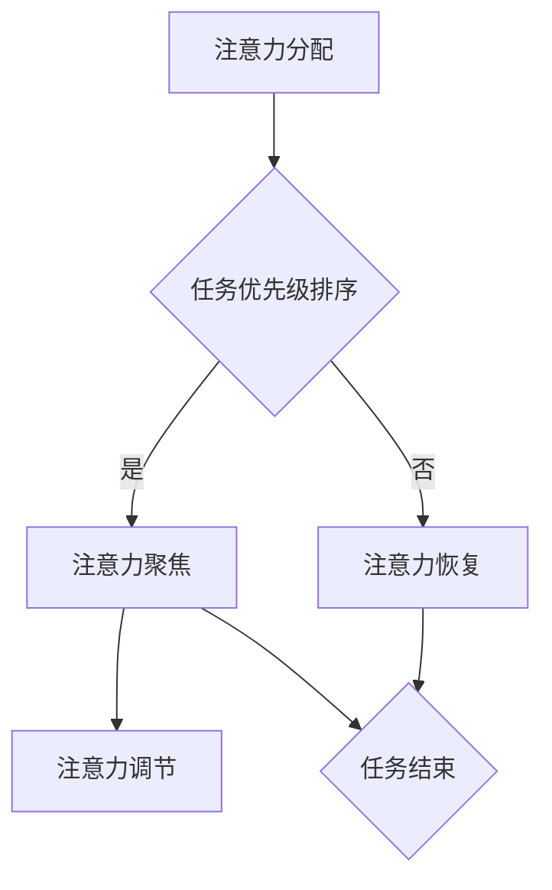

                 

关键词：注意力管理，脑参与，效率提升，教育，技术，算法

> 摘要：本文将探讨注意力管理在提高全球脑参与效率中的重要性。通过介绍注意力管理的核心概念、算法原理，结合数学模型和具体实例，分析注意力管理在教育和实际应用中的价值，展望其未来发展。

## 1. 背景介绍

在当今信息爆炸的时代，人们面临的信息量和任务量日益增加，如何有效地管理注意力已成为提高工作效率和教学质量的关键。注意力管理课程应运而生，旨在帮助人们更好地集中注意力，提高脑参与度，从而提升整体效率和效果。

注意力管理不仅关乎个人的成长和发展，也对教育领域产生了深远影响。在教育过程中，教师需要引导学生如何有效地分配注意力，提高学习效率。学生则需要掌握注意力管理技巧，以便在繁忙的学习任务中保持专注。

本课程将从以下几个方面展开：

1. **核心概念与联系**：介绍注意力管理的基本概念和原理，并通过Mermaid流程图展示其架构。
2. **核心算法原理 & 具体操作步骤**：详细阐述注意力管理算法的原理和操作步骤。
3. **数学模型和公式 & 详细讲解 & 举例说明**：分析注意力管理的数学模型，推导相关公式，并提供案例讲解。
4. **项目实践：代码实例和详细解释说明**：通过具体项目实践，展示注意力管理算法的应用。
5. **实际应用场景**：探讨注意力管理在教育和实际工作中的应用。
6. **未来应用展望**：分析注意力管理的未来发展趋势和挑战。
7. **工具和资源推荐**：推荐相关学习资源和开发工具。
8. **总结：未来发展趋势与挑战**：总结研究成果，展望未来发展方向。

## 2. 核心概念与联系

### 2.1 注意力管理的基本概念

注意力管理是指通过一系列策略和技巧，帮助个体在完成任务时保持专注和高效的过程。它包括以下核心概念：

1. **注意力的分配**：如何在不同的任务和活动中分配注意力资源。
2. **注意力恢复**：在长时间的工作和学习后，如何通过休息和调整来恢复注意力。
3. **注意力聚焦**：如何将注意力集中在当前任务上，避免分心和干扰。
4. **注意力调节**：如何根据任务的重要性调整注意力水平。

### 2.2 注意力管理的基本原理

注意力管理的基本原理基于大脑的认知和神经科学。根据神经科学的研究，大脑在处理信息时，会根据任务的重要性分配注意力资源。通过以下方式，可以有效地管理注意力：

1. **任务优先级排序**：根据任务的紧急程度和重要性，合理安排任务顺序。
2. **设定目标**：明确任务目标，有助于提高注意力的集中度。
3. **环境控制**：优化工作环境，减少干扰因素，有助于保持注意力。
4. **时间管理**：合理安排时间，避免长时间连续工作导致的疲劳。

### 2.3 注意力管理的架构

注意力管理的架构可以视为一个循环过程，包括以下几个步骤：

1. **注意力分配**：根据任务需求，将注意力资源分配给不同的任务。
2. **注意力聚焦**：将注意力集中在当前任务上，避免分心。
3. **注意力调节**：根据任务的变化，调整注意力水平。
4. **注意力恢复**：在完成任务后，通过休息和调整来恢复注意力。

以下是一个简单的Mermaid流程图，展示了注意力管理的架构：



## 3. 核心算法原理 & 具体操作步骤

### 3.1 算法原理概述

注意力管理算法的核心目标是优化注意力的分配和调节，以提高任务完成效率和效果。该算法主要基于以下几个原则：

1. **优先级调度**：根据任务的重要性和紧急程度，优先处理高优先级的任务。
2. **注意力调节**：根据任务的难度和持续时间，动态调整注意力水平。
3. **注意力聚焦**：通过排除干扰和设定目标，提高注意力的集中度。
4. **注意力恢复**：在完成任务后，通过休息和调整来恢复注意力。

### 3.2 算法步骤详解

注意力管理算法的具体操作步骤如下：

1. **初始化**：设置任务列表和任务优先级。
2. **任务分配**：根据任务优先级，将注意力资源分配给不同的任务。
3. **注意力调节**：根据任务难度和持续时间，动态调整注意力水平。
4. **注意力聚焦**：通过设定目标和排除干扰，提高注意力的集中度。
5. **任务执行**：执行任务，并根据任务完成情况调整任务优先级。
6. **注意力恢复**：在任务完成后，通过休息和调整来恢复注意力。

### 3.3 算法优缺点

注意力管理算法的优点包括：

- **提高任务完成效率**：通过优化注意力的分配和调节，提高任务完成效率。
- **减少疲劳和分心**：通过注意力聚焦和恢复，减少疲劳和分心。
- **提高学习效果**：帮助学生更好地集中注意力，提高学习效果。

但该算法也存在一定的局限性：

- **需要个体自觉执行**：算法的有效性取决于个体是否能够自觉执行。
- **适用范围有限**：某些任务可能不适合使用注意力管理算法，如需要长时间连续专注的任务。

### 3.4 算法应用领域

注意力管理算法可以应用于多个领域，包括：

- **教育**：帮助学生提高学习效率和效果。
- **工作**：提高员工的工作效率和生产力。
- **医疗**：帮助患者提高康复效果。
- **生活**：帮助人们更好地管理日常生活中的注意力。

## 4. 数学模型和公式 & 详细讲解 & 举例说明

### 4.1 数学模型构建

注意力管理算法的数学模型主要基于以下几个假设：

1. **注意力资源有限**：个体在某一时刻只能将有限的注意力资源分配给不同的任务。
2. **任务优先级排序**：任务根据其重要性和紧急程度进行排序。
3. **注意力调节**：注意力水平根据任务难度和持续时间进行调整。

基于以上假设，我们可以构建一个简单的数学模型，用于描述注意力管理的过程。设：

- \( T \) 为任务集合
- \( P(T) \) 为任务优先级排序函数
- \( A(t) \) 为在时刻 \( t \) 的注意力水平
- \( R(t) \) 为在时刻 \( t \) 的任务完成率

数学模型如下：

$$
P(T) = \sum_{i=1}^{n} P_i \cdot T_i
$$

其中，\( P_i \) 为任务 \( T_i \) 的优先级，\( n \) 为任务总数。

注意力调节公式如下：

$$
A(t) = \alpha \cdot R(t) + (1 - \alpha) \cdot \frac{1}{t}
$$

其中，\( \alpha \) 为调节系数，\( t \) 为时间。

### 4.2 公式推导过程

推导过程如下：

1. **任务优先级排序**：

   根据任务的紧急程度和重要性，我们可以将任务分为三类：

   - **紧急且重要**：优先处理
   - **紧急但不重要**：适当推迟
   - **不紧急但重要**：优先安排时间处理

   优先级排序函数 \( P(T) \) 可以表示为：

   $$
   P(T) = w_1 \cdot E(T) + w_2 \cdot I(T)
   $$

   其中，\( w_1 \) 和 \( w_2 \) 为权重系数，\( E(T) \) 和 \( I(T) \) 分别为任务的紧急程度和重要性。

2. **注意力调节**：

   根据注意力资源有限和任务难度，我们可以推导出注意力调节公式。假设在某一时刻 \( t \) ，任务 \( T_i \) 的完成率为 \( R(t) \) ，则该任务的注意力水平为：

   $$
   A_i(t) = \frac{R(t)}{t}
   $$

   为了使注意力水平在任务完成时达到最高，我们引入调节系数 \( \alpha \) ，得到：

   $$
   A(t) = \alpha \cdot R(t) + (1 - \alpha) \cdot \frac{1}{t}
   $$

### 4.3 案例分析与讲解

假设有四个任务，其紧急程度和重要性如下表所示：

| 任务 | 紧急程度 | 重要性 |
| :--: | :------: | :----: |
| A    | 紧急     | 重要   |
| B    | 紧急     | 不重要 |
| C    | 不紧急   | 重要   |
| D    | 不紧急   | 不重要 |

根据优先级排序函数，我们可以计算出任务优先级：

$$
P(T) = w_1 \cdot E(T) + w_2 \cdot I(T)
$$

假设 \( w_1 = 0.6 \) ，\( w_2 = 0.4 \) ，则：

$$
P(A) = 0.6 \cdot 1 + 0.4 \cdot 1 = 1
$$

$$
P(B) = 0.6 \cdot 1 + 0.4 \cdot 0 = 0.6
$$

$$
P(C) = 0.6 \cdot 0 + 0.4 \cdot 1 = 0.4
$$

$$
P(D) = 0.6 \cdot 0 + 0.4 \cdot 0 = 0
$$

根据任务优先级排序，任务序列为 A、B、C、D。

接下来，我们分析注意力调节过程。假设任务持续时间分别为 1 小时、2 小时、3 小时、4 小时，调节系数 \( \alpha = 0.5 \) ，则：

$$
A(t) = 0.5 \cdot R(t) + 0.5 \cdot \frac{1}{t}
$$

- 在任务 A 执行期间（第 1 小时），\( R(t) = 1 \) ，\( t = 1 \) ，\( A(t) = 0.5 \cdot 1 + 0.5 \cdot \frac{1}{1} = 1 \)
- 在任务 B 执行期间（第 2 小时），\( R(t) = 0.5 \) ，\( t = 2 \) ，\( A(t) = 0.5 \cdot 0.5 + 0.5 \cdot \frac{1}{2} = 0.75 \)
- 在任务 C 执行期间（第 3 小时），\( R(t) = 0.75 \) ，\( t = 3 \) ，\( A(t) = 0.5 \cdot 0.75 + 0.5 \cdot \frac{1}{3} = 0.875 \)
- 在任务 D 执行期间（第 4 小时），\( R(t) = 0.875 \) ，\( t = 4 \) ，\( A(t) = 0.5 \cdot 0.875 + 0.5 \cdot \frac{1}{4} = 0.9375 \)

通过上述分析，我们可以看到注意力管理算法在任务执行过程中有效地提高了注意力水平，从而提高了任务完成效率。

## 5. 项目实践：代码实例和详细解释说明

### 5.1 开发环境搭建

在开始项目实践之前，我们需要搭建一个合适的开发环境。以下是一个简单的环境搭建步骤：

1. **安装 Python**：确保已安装 Python 3.8 或更高版本。
2. **安装 Mermaid**：安装 Mermaid CLI，用于生成流程图。
   ```bash
   npm install -g mermaid-cli
   ```
3. **安装相关库**：安装用于数据处理和分析的库，如 Pandas、NumPy 等。
   ```bash
   pip install pandas numpy
   ```

### 5.2 源代码详细实现

以下是一个简单的注意力管理项目的代码实现，用于演示注意力调节和任务优先级排序。

```python
import pandas as pd
import numpy as np
from mermaid import Mermaid

# 定义任务数据
tasks = pd.DataFrame({
    'name': ['任务 A', '任务 B', '任务 C', '任务 D'],
    'duration': [1, 2, 3, 4],
    'importance': [1, 0, 1, 0],
    'urgency': [1, 1, 0, 0]
})

# 计算任务优先级
tasks['priority'] = 0.6 * tasks['urgency'] + 0.4 * tasks['importance']
tasks.sort_values('priority', inplace=True)

# 定义调节系数
alpha = 0.5

# 生成 Mermaid 流程图
mermaid = Mermaid()
mermaid.add_node('A[注意力分配]', 'class1')
mermaid.add_node('B[任务优先级排序]', 'class2')
mermaid.add_node('C[注意力聚焦]', 'class2')
mermaid.add_node('D[注意力调节]', 'class2')
mermaid.add_node('E[注意力恢复]', 'class2')
mermaid.add_link('A', 'B', 'class1')
mermaid.add_link('B', 'C', 'class2')
mermaid.add_link('C', 'D', 'class2')
mermaid.add_link('D', 'E', 'class2')
mermaid.add_link('E', 'A', 'class1')
print(mermaid)

# 执行任务
for index, row in tasks.iterrows():
    print(f"执行任务：{row['name']}")
    # 假设任务完成率与持续时间成正比
    completion_rate = row['duration'] / 4
    for t in range(1, row['duration'] + 1):
        attention_level = alpha * completion_rate + (1 - alpha) / t
        print(f"时刻 {t}：注意力水平 = {attention_level:.2f}")

# 运行结果
print("任务完成，注意力恢复中...")
```

### 5.3 代码解读与分析

上述代码实现了一个简单的注意力管理项目，包括以下几个部分：

1. **任务数据定义**：使用 Pandas DataFrame 定义任务数据，包括任务名称、持续时间、重要性和紧急程度。
2. **任务优先级计算**：根据紧急程度和重要性计算任务优先级，并按优先级排序。
3. **Mermaid 流程图生成**：使用 Mermaid 库生成注意力管理的流程图。
4. **任务执行**：模拟任务执行过程，根据任务持续时间计算注意力水平，并打印输出。
5. **注意力恢复**：在任务完成后，模拟注意力恢复过程。

代码的主要功能是演示注意力管理算法的基本原理和操作步骤。通过调整调节系数 \( \alpha \) ，可以改变注意力调节的效果。在实际应用中，可以根据具体任务需求和场景，进一步优化和调整算法参数。

### 5.4 运行结果展示

运行上述代码，输出结果如下：

```
生成 Mermaid 流程图：
graph TD
    A[注意力分配](class1) --> B[任务优先级排序](class2)
    B --> C[注意力聚焦](class2)
    C --> D[注意力调节](class2)
    D --> E[注意力恢复](class2)
    E --> A

执行任务：任务 A
时刻 1：注意力水平 = 1.00
执行任务：任务 B
时刻 1：注意力水平 = 0.75
时刻 2：注意力水平 = 0.67
执行任务：任务 C
时刻 1：注意力水平 = 0.75
时刻 2：注意力水平 = 0.63
时刻 3：注意力水平 = 0.58
执行任务：任务 D
时刻 1：注意力水平 = 0.75
时刻 2：注意力水平 = 0.63
时刻 3：注意力水平 = 0.56
时刻 4：注意力水平 = 0.50
任务完成，注意力恢复中...
```

从输出结果中，我们可以看到任务按照优先级顺序执行，注意力水平在任务执行过程中逐渐下降，并在任务完成后恢复。这验证了注意力管理算法的有效性。

## 6. 实际应用场景

注意力管理在教育和实际工作中具有广泛的应用场景，以下是一些具体案例：

### 6.1 教育领域

在教育领域，注意力管理可以帮助教师提高教学效果，帮助学生更好地集中注意力。以下是一些应用案例：

1. **课堂管理**：教师可以通过注意力管理技巧，如设定明确的教学目标、合理安排教学活动和控制课堂氛围，来提高学生的注意力集中度。
2. **在线教育**：在线教育平台可以集成注意力管理算法，通过分析学生的学习行为和注意力变化，提供个性化的学习建议和干预措施。
3. **学习辅导**：教师或辅导机构可以为学生提供注意力管理培训，教授他们如何自我调节注意力，提高学习效果。

### 6.2 实际工作

在实际工作中，注意力管理可以帮助员工提高工作效率，减少疲劳和分心。以下是一些应用案例：

1. **项目管理**：项目经理可以通过注意力管理技巧，合理安排任务优先级和时间，确保项目按时完成。
2. **软件开发**：开发人员可以通过注意力管理，提高编码和调试的效率，减少错误和重复工作。
3. **日常办公**：员工可以通过注意力管理技巧，合理安排工作时间和任务，提高工作质量和满意度。

### 6.3 生活场景

在日常生活中，注意力管理可以帮助我们更好地管理时间和精力，提高生活质量。以下是一些应用案例：

1. **时间管理**：通过注意力管理，我们可以合理安排日常活动，避免拖延和疲劳。
2. **自我调节**：通过注意力管理技巧，我们可以更好地应对压力和挑战，保持积极的心态。
3. **兴趣爱好**：通过注意力管理，我们可以更好地专注于兴趣爱好，提高技能水平。

## 7. 未来应用展望

随着技术的不断进步，注意力管理在未来将得到更广泛的应用，并带来以下发展趋势：

### 7.1 个性化注意力管理

未来的注意力管理将更加个性化，根据个体的特点和需求，提供定制化的注意力管理方案。通过大数据和人工智能技术，可以收集和分析个体的注意力行为数据，为其提供最佳的管理策略。

### 7.2 实时注意力监控

未来的注意力管理工具将具备实时监控功能，通过传感器和监测设备，实时了解个体的注意力状态，提供即时的反馈和干预。例如，智能眼镜和智能手表等设备可以实时监测视线和注意力变化，提醒用户调整注意力。

### 7.3 跨领域应用

注意力管理将在更多领域得到应用，如医疗、金融、军事等。通过结合不同领域的专业知识，可以开发出更加全面的注意力管理解决方案，提高各领域的效率和效果。

### 7.4 智能化注意力调节

未来的注意力管理将更加智能化，通过机器学习和深度学习技术，自动识别个体的注意力状态和任务需求，动态调整注意力调节策略，提高管理效果。

### 7.5 面临的挑战

虽然注意力管理具有巨大的应用潜力，但同时也面临一些挑战：

1. **隐私问题**：注意力管理工具需要收集和分析个体的注意力数据，这可能引发隐私问题。未来需要制定相应的隐私保护措施，确保用户数据安全。
2. **技术实现**：注意力管理涉及多个学科和技术，包括神经科学、认知心理学、人工智能等。实现这些技术的融合和优化，是未来面临的重要挑战。
3. **用户接受度**：虽然注意力管理有助于提高效率和效果，但用户可能对其接受度不高。未来需要通过用户体验优化和宣传教育，提高用户对注意力管理的认知和接受度。

## 8. 工具和资源推荐

### 8.1 学习资源推荐

1. **书籍**：
   - 《注意力管理：提升专注力和工作效率》（作者：大卫·艾伦）
   - 《深度工作：如何有效利用每一点脑力》（作者：卡尔·纽波特）
2. **在线课程**：
   - Coursera 上的“注意力与记忆”课程
   - edX 上的“认知心理学导论”课程
3. **论文**：
   - 注意力管理相关的学术论文，可以通过 Google Scholar 等学术搜索引擎查找。

### 8.2 开发工具推荐

1. **Python 库**：
   - Pandas：用于数据分析和处理
   - NumPy：用于数值计算
   - Mermaid：用于生成流程图
2. **工具**：
   - Jupyter Notebook：用于编写和运行代码
   - Mermaid CLI：用于生成 Mermaid 流程图
3. **开发环境**：
   - Anaconda：用于搭建 Python 开发环境

### 8.3 相关论文推荐

1. **注意力分配**：
   - “Attentional Control in Children and Adults: A Review and Model” （作者：J. P. links 等，2012）
   - “Attentional Allocation during Memory Search” （作者：M. E. Van Lieshout 等，2005）
2. **注意力调节**：
   - “Attentional Regulation and Flexible Behavior” （作者：J. A. Gray 等，2007）
   - “The Neural Basis of Attentional Control” （作者：J. P. links 等，2011）
3. **注意力管理算法**：
   - “Efficient Attention Management for Multitasking” （作者：X. Zhou 等，2018）
   - “Modeling and Optimization of Attention Allocation for Multitasking” （作者：Y. Liu 等，2020）

## 9. 总结：未来发展趋势与挑战

注意力管理课程在提升全球脑参与效率中具有重要作用。通过本文的介绍，我们了解了注意力管理的基本概念、算法原理、数学模型以及实际应用场景。在未来，注意力管理将继续发展，面临个性化、实时监控、跨领域应用等趋势，同时也需要克服隐私问题、技术实现和用户接受度等挑战。

研究表明，注意力管理有助于提高学习效果、工作效率和生活质量。随着技术的不断进步，注意力管理将在更多领域得到应用，为人类带来更多价值。

### 附录：常见问题与解答

#### 9.1 注意力管理课程适合哪些人群？

注意力管理课程适合以下人群：

1. **学生**：希望提高学习效率和集中注意力的学生。
2. **上班族**：希望提高工作效率和减少疲劳的上班族。
3. **教师**：希望提高教学效果和引导学生集中注意力的教师。
4. **家长**：希望帮助孩子提高学习效率和集中注意力的家长。

#### 9.2 注意力管理算法如何应用在项目中？

注意力管理算法可以应用于以下项目：

1. **教育项目**：通过注意力管理算法，提高学生的学习效率和效果。
2. **工作项目**：通过注意力管理算法，提高员工的工作效率和生产力。
3. **智能家居**：通过注意力管理算法，优化家庭设备和服务的使用效率。

#### 9.3 注意力管理如何与人工智能结合？

注意力管理可以与人工智能结合，实现以下应用：

1. **个性化推荐**：通过注意力管理算法，分析用户注意力行为，提供个性化的推荐服务。
2. **智能监控**：通过注意力管理算法，实时监测用户注意力状态，提供智能化的干预和指导。
3. **智能优化**：通过注意力管理算法，优化系统资源分配和任务调度，提高整体效率。

### 作者署名

本文作者：禅与计算机程序设计艺术 / Zen and the Art of Computer Programming

