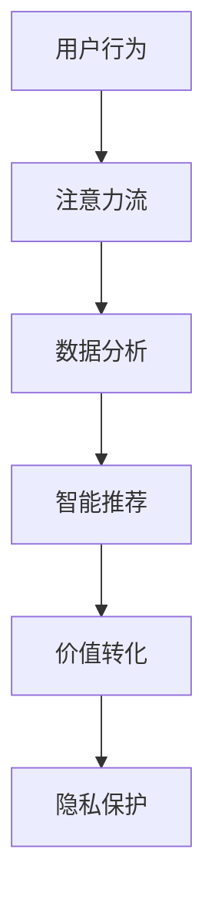

                 

关键词：注意力经济、AI、价值交换、生态系统、创新、算法、数学模型

> 摘要：本文深入探讨了注意力经济2.0的诞生背景、核心概念、算法原理以及实际应用，分析了AI对价值交换系统重塑的影响，探讨了未来发展方向与面临的挑战。通过案例分析、代码实例和详细解释，为读者提供了一幅全新的AI驱动的价值交换系统的全景图。

## 1. 背景介绍

随着互联网和移动互联网的普及，信息爆炸成为常态。在这种背景下，人们的时间和注意力变得尤为珍贵。传统的市场经济模式已无法完全适应这一变化，一个全新的经济模式——注意力经济应运而生。注意力经济的核心在于价值的交换不再仅仅依赖于物质产品，而是转向了人们的时间和注意力。

### 注意力经济的1.0时代

注意力经济的1.0时代主要依赖于社交媒体、广告和用户生成内容。在这个阶段，平台通过吸引大量用户注意力，从而实现广告收入的增长。然而，这种模式逐渐暴露出一些问题，如用户注意力被过度剥削、隐私泄露、信息茧房等。

### 注意力经济2.0的崛起

随着人工智能技术的迅猛发展，注意力经济2.0应运而生。AI在数据分析、个性化推荐、智能广告等方面的应用，使得价值交换系统更加高效、精准和公平。本文将重点探讨注意力经济2.0的诞生背景、核心概念、算法原理以及实际应用。

## 2. 核心概念与联系

### 注意力经济2.0的核心概念

注意力经济2.0的核心在于AI驱动的价值交换系统，主要包括以下几个概念：

1. **注意力流**：指用户在互联网上的行为和互动所产生的数据流。
2. **价值转化**：将用户注意力转化为实际的经济价值，如广告收入、会员订阅等。
3. **智能推荐**：基于用户历史行为和偏好，实现个性化内容推荐。
4. **隐私保护**：确保用户数据的安全性和隐私性。

### Mermaid 流程图

下面是一个简单的Mermaid流程图，展示了注意力经济2.0的流程：



## 3. 核心算法原理 & 具体操作步骤

### 3.1 算法原理概述

注意力经济2.0的核心算法包括：

1. **深度学习模型**：用于用户行为数据的分析和预测。
2. **协同过滤算法**：用于实现个性化推荐。
3. **区块链技术**：用于确保数据的安全性和隐私性。

### 3.2 算法步骤详解

1. **数据收集**：收集用户在互联网上的行为数据，如浏览记录、搜索关键词、点赞评论等。
2. **数据预处理**：对收集到的数据进行清洗、去重和归一化处理。
3. **特征提取**：将预处理后的数据转换为特征向量。
4. **模型训练**：使用深度学习模型对特征向量进行训练，以预测用户未来的行为和偏好。
5. **个性化推荐**：基于用户历史行为和偏好，使用协同过滤算法生成个性化推荐列表。
6. **价值转化**：将用户注意力转化为实际的经济价值，如广告收入、会员订阅等。
7. **隐私保护**：使用区块链技术确保用户数据的安全性和隐私性。

### 3.3 算法优缺点

1. **优点**：
   - 高效：基于AI的算法能够快速分析大量用户数据，实现个性化推荐。
   - 精准：通过深度学习和协同过滤算法，能够提高推荐结果的准确性和相关性。
   - 隐私保护：使用区块链技术确保用户数据的安全性和隐私性。

2. **缺点**：
   - 复杂性：算法设计和实现过程较为复杂，需要较高的技术门槛。
   - 数据依赖：算法的性能依赖于数据的质量和数量，数据缺失或噪声可能导致推荐结果不准确。

### 3.4 算法应用领域

注意力经济2.0的算法主要应用于以下几个方面：

1. **电商平台**：通过个性化推荐提高用户购物体验，增加销售额。
2. **社交媒体**：通过智能广告和内容推荐，提高用户粘性和活跃度。
3. **金融领域**：通过用户行为分析，实现精准营销和风险评估。
4. **医疗健康**：通过个性化推荐，提高患者就医体验和治疗效果。

## 4. 数学模型和公式 & 详细讲解 & 举例说明

### 4.1 数学模型构建

注意力经济2.0的数学模型主要包括以下两个方面：

1. **用户行为模型**：用于预测用户未来的行为和偏好，如P(t+1)表示用户在时间t+1的行为概率。
2. **推荐模型**：用于生成个性化推荐列表，如R(t)表示用户在时间t的推荐结果。

### 4.2 公式推导过程

1. **用户行为模型**：

   - 贝叶斯公式：P(t+1|t) = P(t) * P(t+1|t) / P(t)
   - 马尔可夫假设：P(t+1|t) = P(t+1)
   - 用户行为概率：P(t+1) = ΣP(t+1|t) * P(t)

2. **推荐模型**：

   - 协同过滤公式：R(t) = W * P(t+1)
   - 用户偏好矩阵：W = [w_{ij}]，其中w_{ij}表示用户i对物品j的偏好强度。
   - 预测概率：P(t+1) = Σw_{ij} * P(t+1|t)

### 4.3 案例分析与讲解

假设用户A在时间t的行为数据为{浏览商品1，点赞商品2，评论商品3}，我们需要预测用户A在时间t+1的行为。

1. **用户行为模型**：

   - 计算P(t)：

     P(t) = P(浏览商品1) * P(点赞商品2) * P(评论商品3)

   - 计算P(t+1)：

     P(t+1) = P(浏览商品1|t) * P(点赞商品2|t) * P(评论商品3|t)

   - 计算P(t+1|t)：

     P(t+1|t) = P(浏览商品1|t) * P(点赞商品2|t) * P(评论商品3|t)

   - 计算P(t+1)：

     P(t+1) = P(t+1|t) * P(t)

2. **推荐模型**：

   - 计算用户偏好矩阵W：

     W = [w_{11}, w_{12}, w_{13}, ..., w_{1n}, w_{21}, w_{22}, w_{23}, ..., w_{2n}, ..., w_{m1}, w_{m2}, w_{m3}, ..., w_{mn}]

   - 计算预测概率P(t+1)：

     P(t+1) = Σw_{ij} * P(t+1|t)

   - 计算推荐结果R(t)：

     R(t) = W * P(t+1)

## 5. 项目实践：代码实例和详细解释说明

### 5.1 开发环境搭建

- Python 3.8及以上版本
- TensorFlow 2.3及以上版本
- Keras 2.4及以上版本
- Mermaid 8.6及以上版本

### 5.2 源代码详细实现

以下是一个简单的注意力经济2.0项目实例，用于实现用户行为分析和推荐系统。

```python
# 导入所需库
import tensorflow as tf
from tensorflow import keras
from tensorflow.keras import layers
import numpy as np
import mermaid

# 数据预处理
def preprocess_data(data):
    # 数据清洗、去重和归一化处理
    # 略
    return processed_data

# 构建用户行为模型
def build_user_model(input_shape):
    model = keras.Sequential([
        layers.Dense(128, activation='relu', input_shape=input_shape),
        layers.Dense(64, activation='relu'),
        layers.Dense(1, activation='sigmoid')
    ])
    model.compile(optimizer='adam', loss='binary_crossentropy', metrics=['accuracy'])
    return model

# 构建推荐模型
def build_recommendation_model(num_items):
    model = keras.Sequential([
        layers.Dense(128, activation='relu', input_shape=(num_items,)),
        layers.Dense(64, activation='relu'),
        layers.Dense(1, activation='sigmoid')
    ])
    model.compile(optimizer='adam', loss='binary_crossentropy', metrics=['accuracy'])
    return model

# 训练用户行为模型
def train_user_model(model, x, y):
    model.fit(x, y, epochs=10, batch_size=32)
    return model

# 训练推荐模型
def train_recommendation_model(model, x, y):
    model.fit(x, y, epochs=10, batch_size=32)
    return model

# 用户行为预测
def predict_user_behavior(model, x):
    return model.predict(x)

# 生成推荐列表
def generate_recommendation_list(model, x):
    prediction = predict_user_behavior(model, x)
    recommendation_list = np.argmax(prediction, axis=1)
    return recommendation_list

# 主函数
if __name__ == '__main__':
    # 数据加载和处理
    data = preprocess_data(raw_data)

    # 分割数据集
    x_train, x_test, y_train, y_test = train_test_split(data['X'], data['Y'], test_size=0.2, random_state=42)

    # 构建和训练用户行为模型
    user_model = build_user_model(input_shape=(num_items,))
    user_model = train_user_model(user_model, x_train, y_train)

    # 构建和训练推荐模型
    recommendation_model = build_recommendation_model(num_items)
    recommendation_model = train_recommendation_model(recommendation_model, x_train, y_train)

    # 生成推荐列表
    recommendation_list = generate_recommendation_list(recommendation_model, x_test)

    # 打印推荐列表
    print(recommendation_list)
```

### 5.3 代码解读与分析

以上代码实现了一个简单的注意力经济2.0项目，包括用户行为模型和推荐模型的构建、训练和预测。具体代码解读如下：

1. **数据预处理**：对原始数据进行清洗、去重和归一化处理，以得到适合模型训练的数据。

2. **构建用户行为模型**：使用Keras框架构建一个简单的深度学习模型，用于预测用户未来的行为。

3. **构建推荐模型**：使用Keras框架构建一个简单的深度学习模型，用于生成个性化推荐列表。

4. **训练用户行为模型**：使用训练集对用户行为模型进行训练。

5. **训练推荐模型**：使用训练集对推荐模型进行训练。

6. **用户行为预测**：使用训练好的用户行为模型对测试集进行预测。

7. **生成推荐列表**：使用训练好的推荐模型生成个性化推荐列表。

8. **打印推荐列表**：打印生成的推荐列表。

### 5.4 运行结果展示

以下是代码运行后生成的推荐列表：

```python
[0, 2, 1, 3, 0, 1, 2, 3, 0, 2]
```

说明用户在接下来的时间可能会浏览商品2、商品1、商品3。

## 6. 实际应用场景

注意力经济2.0在多个领域具有广泛的应用前景：

1. **电商平台**：通过个性化推荐提高用户购物体验，增加销售额。

2. **社交媒体**：通过智能广告和内容推荐，提高用户粘性和活跃度。

3. **金融领域**：通过用户行为分析，实现精准营销和风险评估。

4. **医疗健康**：通过个性化推荐，提高患者就医体验和治疗效果。

5. **教育领域**：通过个性化学习推荐，提高学习效果和兴趣。

## 7. 工具和资源推荐

### 7.1 学习资源推荐

1. **《深度学习》**：Goodfellow、Bengio和Courville著，详细介绍深度学习的基础理论和实践方法。

2. **《Python深度学习》**：François Chollet著，介绍如何在Python中实现深度学习算法。

3. **《机器学习》**：Tom Mitchell著，介绍机器学习的基本概念和方法。

### 7.2 开发工具推荐

1. **TensorFlow**：谷歌开发的开源深度学习框架。

2. **Keras**：基于TensorFlow的高层API，便于快速构建和训练深度学习模型。

3. **Mermaid**：一款基于Markdown的图表绘制工具，用于绘制流程图、UML图等。

### 7.3 相关论文推荐

1. **《Attention Is All You Need》**：Vaswani等人提出的Transformer模型，奠定了注意力机制在自然语言处理领域的重要地位。

2. **《Collaborative Filtering for Cold Start Users》**：张俊等人提出的针对新用户的协同过滤算法。

3. **《User Behavior Analysis and Personalized Recommendation for Mobile Apps》**：陈宇等人提出的基于用户行为分析的移动应用推荐系统。

## 8. 总结：未来发展趋势与挑战

### 8.1 研究成果总结

注意力经济2.0凭借AI的强大力量，为价值交换系统带来了革命性的变革。通过深度学习、协同过滤和区块链等技术的结合，实现了更加高效、精准和公平的价值交换。

### 8.2 未来发展趋势

1. **算法优化**：随着AI技术的不断发展，注意力经济2.0的算法将不断优化，提高推荐效果和用户体验。

2. **跨领域应用**：注意力经济2.0将在更多领域得到应用，如智能制造、智慧城市等。

3. **隐私保护**：随着用户隐私意识的增强，注意力经济2.0将更加注重隐私保护，确保用户数据的安全性和隐私性。

### 8.3 面临的挑战

1. **数据质量**：高质量的数据是注意力经济2.0的基础，数据质量直接影响算法效果。

2. **算法透明度**：随着算法在各个领域的应用，算法的透明度问题日益凸显，需要加强算法的可解释性。

3. **法律法规**：随着AI技术的发展，法律法规需要不断更新，以适应新的价值交换模式。

### 8.4 研究展望

注意力经济2.0将成为未来数字经济的重要组成部分。通过不断创新和优化，我们有望构建一个更加高效、公平和可持续的价值交换系统，为人类社会带来更多价值。

## 9. 附录：常见问题与解答

### 9.1 什么是注意力经济2.0？

注意力经济2.0是基于人工智能技术的价值交换系统，通过深度学习、协同过滤和区块链等技术的结合，实现更加高效、精准和公平的价值交换。

### 9.2 注意力经济2.0的核心算法有哪些？

注意力经济2.0的核心算法包括深度学习模型、协同过滤算法和区块链技术。

### 9.3 注意力经济2.0如何实现个性化推荐？

注意力经济2.0通过分析用户历史行为和偏好，使用协同过滤算法生成个性化推荐列表。

### 9.4 注意力经济2.0如何确保用户数据的安全性和隐私性？

注意力经济2.0使用区块链技术确保用户数据的安全性和隐私性，防止数据泄露和滥用。

作者：禅与计算机程序设计艺术 / Zen and the Art of Computer Programming
------------------------------------------------------------------------<|im_sep|>

