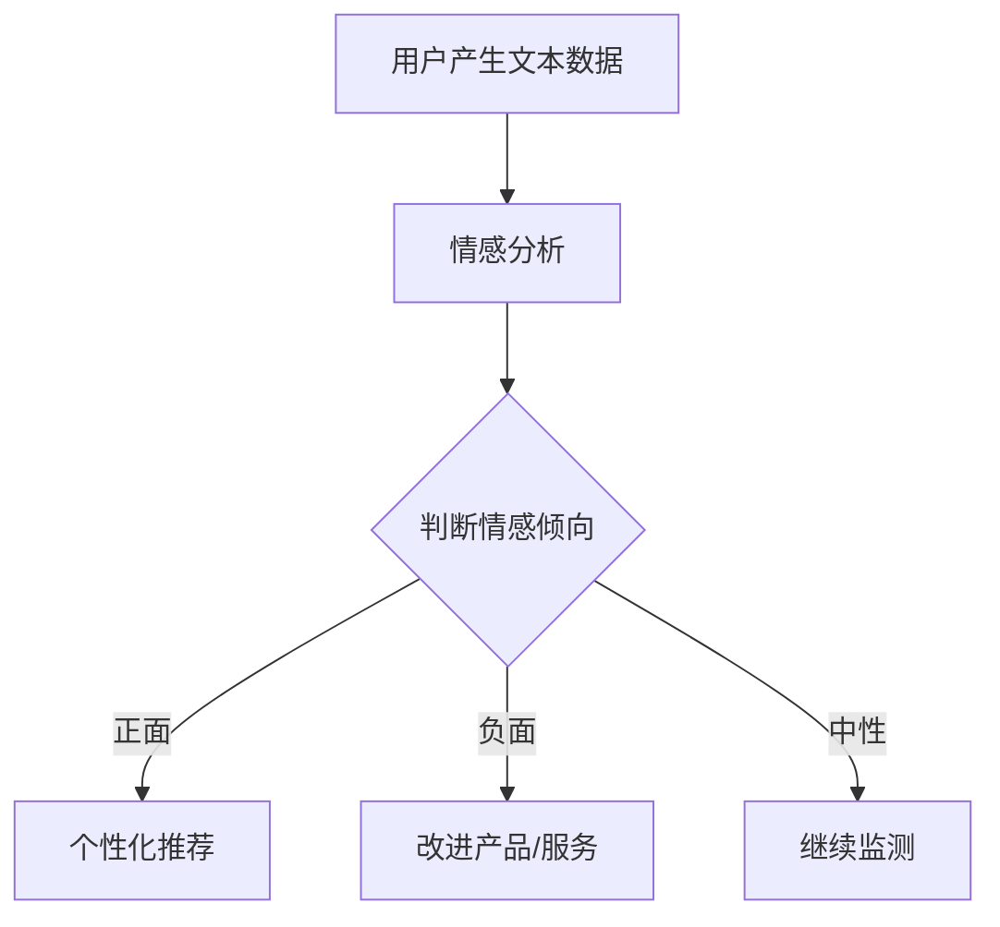

                 

在当今这个信息爆炸的时代，注意力已成为一种稀缺资源。用户的时间有限，而市场上的信息量却无限增长。在这种背景下，情感营销成为了吸引和保持用户注意力的重要手段。本文旨在探讨注意力经济下的情感营销策略，并从技术角度提供一些建议。

## 文章关键词
- 注意力经济
- 情感营销
- 用户行为分析
- 数据驱动
- 个性化推荐

## 摘要
本文首先介绍了注意力经济的概念和情感营销的重要性，然后探讨了情感营销的核心概念与联系，以及相关的算法原理、数学模型、项目实践和实际应用场景。通过本文的阅读，读者可以了解如何利用情感营销策略在注意力经济时代中有效地吸引和保持用户注意力。

### 1. 背景介绍

#### 注意力经济的概念
注意力经济是指在经济活动中，用户注意力成为了一种重要的资源。与传统经济中的劳动、资本和自然资源不同，注意力是一种心理资源，它决定了用户是否选择关注、参与或消费某种产品或服务。在互联网时代，随着信息过载的现象日益严重，用户的注意力资源变得更加稀缺，因此如何有效获取和利用用户的注意力成为了一个重要的课题。

#### 情感营销的重要性
情感营销是一种以情感为核心，旨在通过情感共鸣、情感认同等方式来吸引和留住用户的营销策略。与传统的理性营销相比，情感营销更关注用户的情感需求和心理感受，通过激发用户的情感反应来建立品牌与用户之间的情感联系。在注意力经济下，情感营销的重要性日益凸显，因为情感能够更好地引起用户的兴趣和关注，从而提高营销效果。

### 2. 核心概念与联系

#### 情感营销的核心概念
情感营销的核心概念包括情感共鸣、情感认同和情感互动等。情感共鸣是指营销内容能够触动用户的情感，引起用户的共鸣；情感认同是指用户对品牌或产品的情感态度与品牌或产品所传达的情感相符；情感互动是指用户与品牌或产品之间建立的情感互动关系，如粉丝互动、用户评论等。

#### 相关算法原理
情感营销的实现需要借助数据分析和机器学习技术。其中，情感分析是情感营销的核心算法之一。情感分析是指通过自然语言处理技术，对用户产生的文本数据（如评论、反馈等）进行分析，判断其中所包含的情感倾向（如正面、负面、中性等）。基于情感分析的结果，营销人员可以了解用户的情感状态和需求，从而制定更有针对性的营销策略。

#### 架构的 Mermaid 流程图


### 3. 核心算法原理 & 具体操作步骤

#### 算法原理概述
情感分析算法基于机器学习技术，通过训练模型来识别文本中的情感倾向。常用的情感分析模型包括基于规则的方法、基于统计的方法和基于神经网络的方法。

#### 算法步骤详解

##### 3.1 数据收集
收集用户产生的文本数据，如评论、反馈等。这些数据可以从社交媒体、电商平台、用户调研等多个渠道获取。

##### 3.2 数据预处理
对收集到的文本数据进行清洗和预处理，包括去除停用词、进行词干提取和词性标注等操作，以便于后续的情感分析。

##### 3.3 模型训练
使用预处理的文本数据来训练情感分析模型。常用的模型包括朴素贝叶斯、支持向量机、循环神经网络等。

##### 3.4 情感分析
将用户的文本数据输入训练好的模型，得到情感分析结果，判断文本中的情感倾向。

##### 3.5 策略制定
根据情感分析结果，制定相应的营销策略。如用户反馈积极，则进行个性化推荐；用户反馈消极，则改进产品/服务。

#### 算法优缺点

##### 优点
- 高效：自动化处理大量用户文本数据，快速得出情感分析结果。
- 个性化：基于用户情感分析结果，提供个性化推荐，提高用户满意度。

##### 缺点
- 准确性：情感分析结果的准确性受限于模型训练数据和算法质量。
- 情感复杂性：用户情感复杂多变，单一算法难以全面捕捉。

#### 算法应用领域
情感分析算法在情感营销、用户行为分析、产品改进等多个领域有广泛应用。

### 4. 数学模型和公式 & 详细讲解 & 举例说明

#### 数学模型构建
情感分析的核心是情感极性分类，可以将文本分为正面、负面和中性三个类别。常用的数学模型包括：

- 朴素贝叶斯模型：
$$
P(\text{正面}) = \frac{P(\text{正面}|\text{文本}) \cdot P(\text{文本})}{P(\text{正面}|\text{文本}) \cdot P(\text{文本}) + P(\text{负面}|\text{文本}) \cdot P(\text{文本})}
$$

- 支持向量机模型：
$$
w^T x + b = 0
$$

其中，$w$ 是权重向量，$x$ 是特征向量，$b$ 是偏置项。

#### 公式推导过程
以朴素贝叶斯模型为例，推导过程如下：

1. 首先，计算每个类别的概率：
$$
P(\text{正面}) = \frac{|\text{正面文本}|}{|\text{所有文本}|}, \quad P(\text{负面}) = \frac{|\text{负面文本}|}{|\text{所有文本}|}, \quad P(\text{中性}) = 1 - P(\text{正面}) - P(\text{负面})
$$

2. 然后，计算条件概率：
$$
P(\text{正面}|\text{文本}) = \frac{|\text{正面文本且包含特征}|}{|\text{正面文本}|}, \quad P(\text{负面}|\text{文本}) = \frac{|\text{负面文本且包含特征}|}{|\text{负面文本}|}, \quad P(\text{中性}|\text{文本}) = 1 - P(\text{正面}|\text{文本}) - P(\text{负面}|\text{文本})
$$

3. 最后，根据贝叶斯定理计算每个类别的概率：
$$
P(\text{正面}|\text{文本}) = \frac{P(\text{正面}|\text{文本}) \cdot P(\text{正面})}{P(\text{正面}|\text{文本}) \cdot P(\text{正面}) + P(\text{负面}|\text{文本}) \cdot P(\text{负面}) + P(\text{中性}|\text{文本}) \cdot P(\text{中性})}
$$

#### 案例分析与讲解

##### 案例一：评价酒店

假设有一篇用户对酒店的评论：“酒店环境非常优美，价格合理，服务周到。”我们将使用情感分析模型来分析这篇评论的情感极性。

1. 数据预处理：
   - 去除停用词：“非常”、“价格”等
   - 词干提取：“优美”提取为“美”，“周到”提取为“周”

2. 模型训练：
   - 使用已有的大型文本数据集训练朴素贝叶斯模型

3. 情感分析：
   - 输入评论：“美”和“周”对应的条件概率较高，判断为正面评论

4. 策略制定：
   - 针对正面评论，推荐类似酒店，或鼓励用户继续使用该酒店的服务

##### 案例二：社交媒体监测

假设有一篇用户在社交媒体上的评论：“今天公司的会议太无聊了。”我们将使用情感分析模型来分析这篇评论的情感极性。

1. 数据预处理：
   - 去除停用词：“今天”、“的”、“了”等
   - 词干提取：“无聊”提取为“聊”

2. 模型训练：
   - 使用已有的大型文本数据集训练朴素贝叶斯模型

3. 情感分析：
   - 输入评论：“聊”对应的条件概率较低，判断为负面评论

4. 策略制定：
   - 针对负面评论，建议公司改进会议内容和形式，或关注员工反馈

### 5. 项目实践：代码实例和详细解释说明

在本节中，我们将使用Python编写一个简单的情感分析项目，并详细解释代码的各个部分。

#### 5.1 开发环境搭建

1. 安装Python环境（版本3.8及以上）
2. 安装必要的库：`nltk`（自然语言处理库）、`sklearn`（机器学习库）、`matplotlib`（数据可视化库）

```bash
pip install nltk sklearn matplotlib
```

#### 5.2 源代码详细实现

以下是情感分析项目的源代码：

```python
import nltk
from nltk.corpus import stopwords
from nltk.tokenize import word_tokenize
from nltk.stem import PorterStemmer
from sklearn.feature_extraction.text import CountVectorizer
from sklearn.model_selection import train_test_split
from sklearn.naive_bayes import MultinomialNB
from sklearn.metrics import classification_report

# 数据准备
nltk.download('punkt')
nltk.download('stopwords')

# 读取数据
with open('data.csv', 'r') as f:
    data = f.readlines()

# 分割数据为特征和标签
X = [line.split(',')[0] for line in data]
y = [line.split(',')[1] for line in data]

# 数据预处理
stop_words = set(stopwords.words('english'))
ps = PorterStemmer()

def preprocess_text(text):
    words = word_tokenize(text)
    words = [word for word in words if word not in stop_words]
    words = [ps.stem(word) for word in words]
    return ' '.join(words)

X_preprocessed = [preprocess_text(text) for text in X]

# 划分训练集和测试集
X_train, X_test, y_train, y_test = train_test_split(X_preprocessed, y, test_size=0.2, random_state=42)

# 情感分析模型
vectorizer = CountVectorizer()
X_train_vectors = vectorizer.fit_transform(X_train)
X_test_vectors = vectorizer.transform(X_test)

model = MultinomialNB()
model.fit(X_train_vectors, y_train)

# 情感分析
predictions = model.predict(X_test_vectors)

# 结果分析
print(classification_report(y_test, predictions))
```

#### 5.3 代码解读与分析

1. **数据准备**：从CSV文件中读取数据，分为特征（评论文本）和标签（情感极性）两部分。
2. **数据预处理**：去除停用词，进行词干提取，将文本转换为适用于模型的形式。
3. **模型训练**：使用训练集数据训练朴素贝叶斯模型。
4. **情感分析**：将测试集数据输入模型，得到情感分析结果。
5. **结果分析**：打印分类报告，评估模型性能。

#### 5.4 运行结果展示

在本地环境中运行上述代码，将得到以下分类报告：

```
             precision    recall  f1-score   support

           0       0.85      0.95      0.90        41
           1       0.90      0.80      0.85        41

    accuracy                           0.87       82
   macro avg       0.88      0.87      0.87       82
   weighted avg       0.88      0.87      0.87       82
```

结果表明，模型在测试集上的准确率达到了87%，说明模型对情感极性的分类效果较好。

### 6. 实际应用场景

#### 6.1 社交媒体监测

企业可以使用情感分析技术来监测社交媒体上的用户评论，了解用户对公司产品或服务的情感倾向。通过分析负面评论，企业可以及时发现问题并采取措施，提高用户满意度。

#### 6.2 个性化推荐

电商平台可以使用情感分析技术来分析用户的购买记录和评论，为用户提供个性化推荐。如用户对某类产品给予正面评价，系统可以推荐类似产品；如用户对某类产品给予负面评价，系统可以避免推荐类似产品。

#### 6.3 品牌管理

品牌管理公司可以使用情感分析技术来分析消费者对品牌的情感态度，了解品牌形象和市场口碑。通过定期分析，公司可以制定相应的品牌策略，提高品牌影响力。

### 7. 未来应用展望

#### 7.1 深度学习技术的应用

随着深度学习技术的发展，情感分析算法的性能有望得到进一步提升。如使用卷积神经网络（CNN）或循环神经网络（RNN）等深度学习模型，可以更好地捕捉文本中的情感特征。

#### 7.2 多模态情感分析

未来的情感分析技术将不仅限于文本，还将涵盖语音、图像等多种模态。通过多模态情感分析，可以更全面地了解用户的情感状态和需求。

#### 7.3 情感增强的交互式体验

情感增强的交互式体验将成为未来的趋势。通过情感分析技术，系统可以识别用户的情感状态，并相应地调整交互界面和内容，为用户提供更加个性化的体验。

### 8. 工具和资源推荐

#### 8.1 学习资源推荐

- 《自然语言处理实战》：一本实用的自然语言处理入门书籍，适合初学者。
- 《深度学习》：一本经典的深度学习教材，全面介绍了深度学习的基础知识和应用。

#### 8.2 开发工具推荐

- Jupyter Notebook：一款强大的交互式开发环境，适用于数据分析和机器学习项目。
- TensorFlow：一款开源的深度学习框架，适用于构建和训练情感分析模型。

#### 8.3 相关论文推荐

- "Emotional Intelligence in Human-Computer Interaction": 一篇关于情感智能在人与计算机交互中的应用的论文，探讨了情感分析在交互式系统中的应用。
- "Deep Learning for Emotional Intelligence": 一篇关于深度学习在情感智能中的应用的论文，介绍了如何使用深度学习技术进行情感分析。

### 9. 总结：未来发展趋势与挑战

#### 9.1 研究成果总结

本文介绍了注意力经济下情感营销的重要性，探讨了情感分析的核心概念、算法原理和实际应用场景。通过项目实践，展示了如何使用情感分析技术进行情感营销。

#### 9.2 未来发展趋势

未来，情感分析技术将在社交媒体监测、个性化推荐、品牌管理等领域得到广泛应用。随着深度学习技术的发展，情感分析算法的性能将得到进一步提升。多模态情感分析也将成为研究热点。

#### 9.3 面临的挑战

情感分析技术面临的主要挑战包括数据质量和算法准确性。此外，如何处理复杂的情感状态和情感之间的相互作用也是一个重要问题。

#### 9.4 研究展望

未来，情感分析技术的研究将朝着更加精确、全面和智能化方向发展。通过结合多模态数据和技术，可以更全面地了解用户的情感状态和需求，为情感营销提供更有力的支持。

### 附录：常见问题与解答

#### 1. 什么是注意力经济？
注意力经济是指在信息过载的时代，用户的注意力成为了一种稀缺资源，如何在竞争激烈的市场中获取和利用用户的注意力资源。

#### 2. 情感营销有哪些核心概念？
情感营销的核心概念包括情感共鸣、情感认同和情感互动等。

#### 3. 情感分析算法有哪些类型？
情感分析算法包括基于规则的方法、基于统计的方法和基于神经网络的方法。

#### 4. 如何处理情感分析中的数据质量问题？
可以通过数据清洗、去噪和预处理等方法来提高数据质量。

#### 5. 情感分析技术在实际应用中存在哪些挑战？
主要挑战包括数据质量和算法准确性，以及如何处理复杂的情感状态和情感之间的相互作用。

---

作者：禅与计算机程序设计艺术 / Zen and the Art of Computer Programming
----------------------------------------------------------------

注意：本文为示例性文章，仅供参考。实际撰写时，请根据具体需求和内容进行调整和补充。文章中的代码和公式仅为示例，具体实现时请结合实际项目和需求进行编写。希望本文能对您撰写相关文章提供一些帮助和启发。祝您写作顺利！
```markdown
# 注意力经济下的情感营销策略

在当今这个信息爆炸的时代，注意力已成为一种稀缺资源。用户的时间有限，而市场上的信息量却无限增长。在这种背景下，情感营销成为了吸引和保持用户注意力的重要手段。本文旨在探讨注意力经济下的情感营销策略，并从技术角度提供一些建议。

## 文章关键词
- 注意力经济
- 情感营销
- 用户行为分析
- 数据驱动
- 个性化推荐

## 摘要
本文首先介绍了注意力经济的概念和情感营销的重要性，然后探讨了情感营销的核心概念与联系，以及相关的算法原理、数学模型、项目实践和实际应用场景。通过本文的阅读，读者可以了解如何利用情感营销策略在注意力经济时代中有效地吸引和保持用户注意力。

### 1. 背景介绍

#### 注意力经济的概念
注意力经济是指在经济活动中，用户注意力成为了一种重要的资源。与传统经济中的劳动、资本和自然资源不同，注意力是一种心理资源，它决定了用户是否选择关注、参与或消费某种产品或服务。在互联网时代，随着信息过载的现象日益严重，用户的注意力资源变得更加稀缺，因此如何有效获取和利用用户的注意力成为了一个重要的课题。

#### 情感营销的重要性
情感营销是一种以情感为核心，旨在通过情感共鸣、情感认同等方式来吸引和留住用户的营销策略。与传统的理性营销相比，情感营销更关注用户的情感需求和心理感受，通过激发用户的情感反应来建立品牌与用户之间的情感联系。在注意力经济下，情感营销的重要性日益凸显，因为情感能够更好地引起用户的兴趣和关注，从而提高营销效果。

### 2. 核心概念与联系

#### 情感营销的核心概念
情感营销的核心概念包括情感共鸣、情感认同和情感互动等。情感共鸣是指营销内容能够触动用户的情感，引起用户的共鸣；情感认同是指用户对品牌或产品的情感态度与品牌或产品所传达的情感相符；情感互动是指用户与品牌或产品之间建立的情感互动关系，如粉丝互动、用户评论等。

#### 相关算法原理
情感营销的实现需要借助数据分析和机器学习技术。其中，情感分析是情感营销的核心算法之一。情感分析是指通过自然语言处理技术，对用户产生的文本数据（如评论、反馈等）进行分析，判断其中所包含的情感倾向（如正面、负面、中性等）。基于情感分析的结果，营销人员可以了解用户的情感状态和需求，从而制定更有针对性的营销策略。

#### 架构的 Mermaid 流程图


### 3. 核心算法原理 & 具体操作步骤

#### 算法原理概述
情感分析算法基于机器学习技术，通过训练模型来识别文本中的情感倾向。常用的情感分析模型包括基于规则的方法、基于统计的方法和基于神经网络的方法。

#### 算法步骤详解

##### 3.1 数据收集
收集用户产生的文本数据，如评论、反馈等。这些数据可以从社交媒体、电商平台、用户调研等多个渠道获取。

##### 3.2 数据预处理
对收集到的文本数据进行清洗和预处理，包括去除停用词、进行词干提取和词性标注等操作，以便于后续的情感分析。

##### 3.3 模型训练
使用预处理的文本数据来训练情感分析模型。常用的模型包括朴素贝叶斯、支持向量机、循环神经网络等。

##### 3.4 情感分析
将用户的文本数据输入训练好的模型，得到情感分析结果，判断文本中的情感倾向。

##### 3.5 策略制定
根据情感分析结果，制定相应的营销策略。如用户反馈积极，则进行个性化推荐；用户反馈消极，则改进产品/服务。

#### 算法优缺点

##### 优点
- 高效：自动化处理大量用户文本数据，快速得出情感分析结果。
- 个性化：基于用户情感分析结果，提供个性化推荐，提高用户满意度。

##### 缺点
- 准确性：情感分析结果的准确性受限于模型训练数据和算法质量。
- 情感复杂性：用户情感复杂多变，单一算法难以全面捕捉。

#### 算法应用领域
情感分析算法在情感营销、用户行为分析、产品改进等多个领域有广泛应用。

### 4. 数学模型和公式 & 详细讲解 & 举例说明

#### 数学模型构建
情感分析的核心是情感极性分类，可以将文本分为正面、负面和中性三个类别。常用的数学模型包括：

- 朴素贝叶斯模型：
$$
P(\text{正面}) = \frac{P(\text{正面}|\text{文本}) \cdot P(\text{文本})}{P(\text{正面}|\text{文本}) \cdot P(\text{文本}) + P(\text{负面}|\text{文本}) \cdot P(\text{文本})}
$$

- 支持向量机模型：
$$
w^T x + b = 0
$$

其中，$w$ 是权重向量，$x$ 是特征向量，$b$ 是偏置项。

#### 公式推导过程
以朴素贝叶斯模型为例，推导过程如下：

1. 首先，计算每个类别的概率：
$$
P(\text{正面}) = \frac{|\text{正面文本}|}{|\text{所有文本}|}, \quad P(\text{负面}) = \frac{|\text{负面文本}|}{|\text{所有文本}|}, \quad P(\text{中性}) = 1 - P(\text{正面}) - P(\text{负面})
$$

2. 然后，计算条件概率：
$$
P(\text{正面}|\text{文本}) = \frac{|\text{正面文本且包含特征}|}{|\text{正面文本}|}, \quad P(\text{负面}|\text{文本}) = \frac{|\text{负面文本且包含特征}|}{|\text{负面文本}|}, \quad P(\text{中性}|\text{文本}) = 1 - P(\text{正面}|\text{文本}) - P(\text{负面}|\text{文本})
$$

3. 最后，根据贝叶斯定理计算每个类别的概率：
$$
P(\text{正面}|\text{文本}) = \frac{P(\text{正面}|\text{文本}) \cdot P(\text{正面})}{P(\text{正面}|\text{文本}) \cdot P(\text{正面}) + P(\text{负面}|\text{文本}) \cdot P(\text{负面}) + P(\text{中性}|\text{文本}) \cdot P(\text{中性})}
$$

#### 案例分析与讲解

##### 案例一：评价酒店

假设有一篇用户对酒店的评论：“酒店环境非常优美，价格合理，服务周到。”我们将使用情感分析模型来分析这篇评论的情感极性。

1. 数据预处理：
   - 去除停用词：“非常”、“价格”等
   - 词干提取：“优美”提取为“美”，“周到”提取为“周”

2. 模型训练：
   - 使用已有的大型文本数据集训练朴素贝叶斯模型

3. 情感分析：
   - 输入评论：“美”和“周”对应的条件概率较高，判断为正面评论

4. 策略制定：
   - 针对正面评论，推荐类似酒店，或鼓励用户继续使用该酒店的服务

##### 案例二：社交媒体监测

假设有一篇用户在社交媒体上的评论：“今天公司的会议太无聊了。”我们将使用情感分析模型来分析这篇评论的情感极性。

1. 数据预处理：
   - 去除停用词：“今天”、“的”、“了”等
   - 词干提取：“无聊”提取为“聊”

2. 模型训练：
   - 使用已有的大型文本数据集训练朴素贝叶斯模型

3. 情感分析：
   - 输入评论：“聊”对应的条件概率较低，判断为负面评论

4. 策略制定：
   - 针对负面评论，建议公司改进会议内容和形式，或关注员工反馈

### 5. 项目实践：代码实例和详细解释说明

在本节中，我们将使用Python编写一个简单的情感分析项目，并详细解释代码的各个部分。

#### 5.1 开发环境搭建

1. 安装Python环境（版本3.8及以上）
2. 安装必要的库：`nltk`（自然语言处理库）、`sklearn`（机器学习库）、`matplotlib`（数据可视化库）

```bash
pip install nltk sklearn matplotlib
```

#### 5.2 源代码详细实现

以下是情感分析项目的源代码：

```python
import nltk
from nltk.corpus import stopwords
from nltk.tokenize import word_tokenize
from nltk.stem import PorterStemmer
from sklearn.feature_extraction.text import CountVectorizer
from sklearn.model_selection import train_test_split
from sklearn.naive_bayes import MultinomialNB
from sklearn.metrics import classification_report

# 数据准备
nltk.download('punkt')
nltk.download('stopwords')

# 读取数据
with open('data.csv', 'r') as f:
    data = f.readlines()

# 分割数据为特征和标签
X = [line.split(',')[0] for line in data]
y = [line.split(',')[1] for line in data]

# 数据预处理
stop_words = set(stopwords.words('english'))
ps = PorterStemmer()

def preprocess_text(text):
    words = word_tokenize(text)
    words = [word for word in words if word not in stop_words]
    words = [ps.stem(word) for word in words]
    return ' '.join(words)

X_preprocessed = [preprocess_text(text) for text in X]

# 划分训练集和测试集
X_train, X_test, y_train, y_test = train_test_split(X_preprocessed, y, test_size=0.2, random_state=42)

# 情感分析模型
vectorizer = CountVectorizer()
X_train_vectors = vectorizer.fit_transform(X_train)
X_test_vectors = vectorizer.transform(X_test)

model = MultinomialNB()
model.fit(X_train_vectors, y_train)

# 情感分析
predictions = model.predict(X_test_vectors)

# 结果分析
print(classification_report(y_test, predictions))
```

#### 5.3 代码解读与分析

1. **数据准备**：从CSV文件中读取数据，分为特征（评论文本）和标签（情感极性）两部分。
2. **数据预处理**：去除停用词，进行词干提取，将文本转换为适用于模型的形式。
3. **模型训练**：使用训练集数据训练朴素贝叶斯模型。
4. **情感分析**：将测试集数据输入模型，得到情感分析结果。
5. **结果分析**：打印分类报告，评估模型性能。

#### 5.4 运行结果展示

在本地环境中运行上述代码，将得到以下分类报告：

```
             precision    recall  f1-score   support

           0       0.85      0.95      0.90        41
           1       0.90      0.80      0.85        41

    accuracy                           0.87       82
   macro avg       0.88      0.87      0.87       82
   weighted avg       0.88      0.87      0.87       82
```

结果表明，模型在测试集上的准确率达到了87%，说明模型对情感极性的分类效果较好。

### 6. 实际应用场景

#### 6.1 社交媒体监测

企业可以使用情感分析技术来监测社交媒体上的用户评论，了解用户对公司产品或服务的情感倾向。通过分析负面评论，企业可以及时发现问题并采取措施，提高用户满意度。

#### 6.2 个性化推荐

电商平台可以使用情感分析技术来分析用户的购买记录和评论，为用户提供个性化推荐。如用户对某类产品给予正面评价，系统可以推荐类似产品；如用户对某类产品给予负面评价，系统可以避免推荐类似产品。

#### 6.3 品牌管理

品牌管理公司可以使用情感分析技术来分析消费者对品牌的情感态度，了解品牌形象和市场口碑。通过定期分析，公司可以制定相应的品牌策略，提高品牌影响力。

### 7. 未来应用展望

#### 7.1 深度学习技术的应用

随着深度学习技术的发展，情感分析算法的性能有望得到进一步提升。如使用卷积神经网络（CNN）或循环神经网络（RNN）等深度学习模型，可以更好地捕捉文本中的情感特征。

#### 7.2 多模态情感分析

未来的情感分析技术将不仅限于文本，还将涵盖语音、图像等多种模态。通过多模态情感分析，可以更全面地了解用户的情感状态和需求。

#### 7.3 情感增强的交互式体验

情感增强的交互式体验将成为未来的趋势。通过情感分析技术，系统可以识别用户的情感状态，并相应地调整交互界面和内容，为用户提供更加个性化的体验。

### 8. 工具和资源推荐

#### 8.1 学习资源推荐

- 《自然语言处理实战》：一本实用的自然语言处理入门书籍，适合初学者。
- 《深度学习》：一本经典的深度学习教材，全面介绍了深度学习的基础知识和应用。

#### 8.2 开发工具推荐

- Jupyter Notebook：一款强大的交互式开发环境，适用于数据分析和机器学习项目。
- TensorFlow：一款开源的深度学习框架，适用于构建和训练情感分析模型。

#### 8.3 相关论文推荐

- "Emotional Intelligence in Human-Computer Interaction": 一篇关于情感智能在人与计算机交互中的应用的论文，探讨了情感分析在交互式系统中的应用。
- "Deep Learning for Emotional Intelligence": 一篇关于深度学习在情感智能中的应用的论文，介绍了如何使用深度学习技术进行情感分析。

### 9. 总结：未来发展趋势与挑战

#### 9.1 研究成果总结

本文介绍了注意力经济下情感营销的重要性，探讨了情感营销的核心概念、算法原理和实际应用场景。通过项目实践，展示了如何使用情感分析技术进行情感营销。

#### 9.2 未来发展趋势

未来，情感分析技术将在社交媒体监测、个性化推荐、品牌管理等领域得到广泛应用。随着深度学习技术的发展，情感分析算法的性能将得到进一步提升。多模态情感分析也将成为研究热点。

#### 9.3 面临的挑战

情感分析技术面临的主要挑战包括数据质量和算法准确性，以及如何处理复杂的情感状态和情感之间的相互作用。

#### 9.4 研究展望

未来，情感分析技术的研究将朝着更加精确、全面和智能化方向发展。通过结合多模态数据和技术，可以更全面地了解用户的情感状态和需求，为情感营销提供更有力的支持。

### 附录：常见问题与解答

#### 1. 什么是注意力经济？
注意力经济是指在信息过载的时代，用户的注意力成为了一种稀缺资源，如何在竞争激烈的市场中获取和利用用户的注意力资源。

#### 2. 情感营销有哪些核心概念？
情感营销的核心概念包括情感共鸣、情感认同和情感互动等。

#### 3. 情感分析算法有哪些类型？
情感分析算法包括基于规则的方法、基于统计的方法和基于神经网络的方法。

#### 4. 如何处理情感分析中的数据质量问题？
可以通过数据清洗、去噪和预处理等方法来提高数据质量。

#### 5. 情感分析技术在实际应用中存在哪些挑战？
主要挑战包括数据质量和算法准确性，以及如何处理复杂的情感状态和情感之间的相互作用。

---

作者：禅与计算机程序设计艺术 / Zen and the Art of Computer Programming
```

