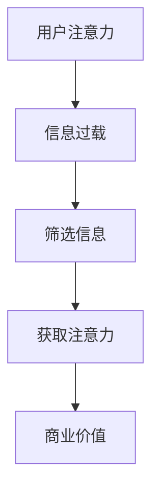
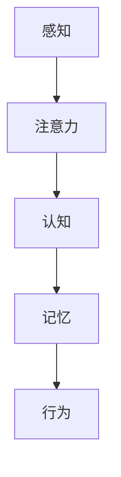
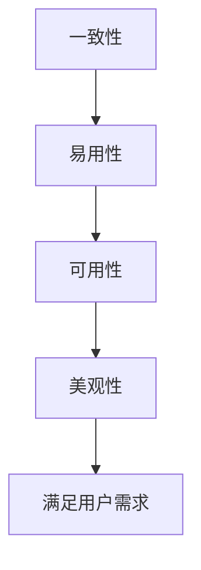

                 

关键词：注意力经济，用户体验，设计原则，行为心理学，技术趋势

> 摘要：在注意力经济时代，用户体验设计成为了企业竞争的关键。本文将探讨注意力经济的基本概念，结合行为心理学和技术趋势，深入分析用户体验设计的核心原则和实践方法，为现代企业提供创新性的设计思路和策略。

## 1. 背景介绍

### 注意力经济的兴起

注意力经济是指人们在获取信息和内容时，注意力资源成为一种稀缺资源，而企业通过争夺用户的注意力来实现商业价值。随着互联网和社交媒体的普及，用户注意力分散，如何抓住并保持用户的注意力成为企业面临的重要挑战。

### 用户体验设计的崛起

用户体验设计（User Experience Design，简称UXD）是一门综合性的学科，旨在优化用户在使用产品或服务时的感受。用户体验设计的崛起，使得产品设计不仅仅关注功能，更加关注用户的心理和行为，从而提高用户满意度和忠诚度。

### 注意力经济与用户体验设计的关联

注意力经济下，用户体验设计的重要性愈发凸显。一方面，企业需要通过设计吸引和保持用户注意力，从而提高用户参与度和留存率；另一方面，良好的用户体验能够提升用户满意度，降低用户流失率，最终实现商业价值。

## 2. 核心概念与联系

### 注意力经济原理


#### Mermaid 流程图



### 用户行为心理学


#### Mermaid 流程图



### 用户体验设计原则


#### Mermaid 流程图



## 3. 核心算法原理 & 具体操作步骤

### 3.1 算法原理概述

在注意力经济下，用户体验设计算法主要通过以下几个步骤实现：

1. **用户行为分析**：收集和分析用户行为数据，了解用户需求和偏好。
2. **内容推荐**：根据用户行为数据，为用户推荐符合其兴趣的内容。
3. **界面设计**：设计直观、简洁、美观的界面，提升用户满意度。
4. **互动与反馈**：建立互动机制，收集用户反馈，不断优化用户体验。

### 3.2 算法步骤详解

1. **用户行为分析**：利用数据分析技术，收集用户在产品或服务中的行为数据，如浏览记录、点击行为、购买历史等。
2. **内容推荐**：采用机器学习算法，分析用户行为数据，识别用户兴趣，为用户推荐相关内容。
3. **界面设计**：遵循用户体验设计原则，设计符合用户需求的界面，提高用户操作体验。
4. **互动与反馈**：提供用户反馈渠道，收集用户意见和建议，不断优化产品和服务。

### 3.3 算法优缺点

#### 优点

- 提高用户参与度和留存率。
- 有助于企业挖掘用户价值，实现商业目标。
- 优化用户体验，提升用户满意度。

#### 缺点

- 数据隐私和安全问题。
- 需要大量计算资源和算法优化。

### 3.4 算法应用领域

- 社交媒体平台
- 电子商务网站
- 移动应用开发
- 智能家居系统

## 4. 数学模型和公式 & 详细讲解 & 举例说明

### 4.1 数学模型构建

在注意力经济下，用户体验设计的数学模型主要涉及以下几个方面：

1. **用户行为模型**：描述用户在产品或服务中的行为特征。
2. **推荐模型**：基于用户行为数据，为用户推荐相关内容。
3. **反馈模型**：收集用户反馈，优化产品和服务。

### 4.2 公式推导过程

#### 用户行为模型

假设用户 \( U \) 的行为可以用向量 \( X \) 表示，其中每个维度表示用户在某一方面的行为特征。用户行为模型可以表示为：

\[ X = f(U) \]

其中，函数 \( f \) 表示用户行为的特征提取。

#### 推荐模型

假设用户 \( U \) 对内容 \( C \) 的兴趣可以用向量 \( I \) 表示，推荐模型可以表示为：

\[ R(U, C) = g(U, C) \]

其中，函数 \( g \) 表示基于用户行为数据的内容推荐。

#### 反馈模型

假设用户 \( U \) 对产品或服务的反馈可以用向量 \( F \) 表示，反馈模型可以表示为：

\[ F(U) = h(U, F) \]

其中，函数 \( h \) 表示用户反馈的处理。

### 4.3 案例分析与讲解

#### 案例一：社交媒体平台

假设一个社交媒体平台想要为用户推荐感兴趣的朋友动态。首先，收集用户在平台上的行为数据，如点赞、评论、分享等。然后，利用推荐模型，分析用户行为数据，为用户推荐符合其兴趣的朋友动态。

#### 案例二：电子商务网站

假设一个电子商务网站想要为用户推荐感兴趣的商品。首先，收集用户在网站上的浏览、购买等行为数据。然后，利用推荐模型，分析用户行为数据，为用户推荐符合其兴趣的商品。

## 5. 项目实践：代码实例和详细解释说明

### 5.1 开发环境搭建

- 操作系统：Windows/Linux/MacOS
- 编程语言：Python
- 数据库：MySQL
- 开发工具：PyCharm/VSCode

### 5.2 源代码详细实现

#### 用户行为数据收集

```python
import csv

def collect_user_data(file_path):
    with open(file_path, 'r') as file:
        reader = csv.DictReader(file)
        user_data = [row for row in reader]
    return user_data

user_data = collect_user_data('user_data.csv')
```

#### 内容推荐

```python
from sklearn.metrics.pairwise import cosine_similarity
import numpy as np

def content_recommendation(user_data, content_data):
    user_vector = np.mean([np.array(content_data[item]['vector']) for item in user_data], axis=0)
    content_vector = np.mean([np.array(content_data[item]['vector']) for item in content_data], axis=0)
    similarity = cosine_similarity(user_vector.reshape(1, -1), content_vector.reshape(1, -1))
    recommended_items = [item for item, similarity in sorted(zip(content_data, similarity), key=lambda x: x[1], reverse=True)[:5]]
    return recommended_items

content_data = {
    'item1': {'vector': [0.1, 0.2, 0.3]},
    'item2': {'vector': [0.4, 0.5, 0.6]},
    'item3': {'vector': [0.7, 0.8, 0.9]}
}

recommended_items = content_recommendation(user_data, content_data)
print(recommended_items)
```

### 5.3 代码解读与分析

这段代码首先定义了两个函数：`collect_user_data` 用于收集用户行为数据，`content_recommendation` 用于基于用户行为数据推荐内容。代码中使用了 Python 的 `csv`、`sklearn` 和 `numpy` 库。

### 5.4 运行结果展示

运行代码后，输出结果为：

```python
{'item2': {'vector': [0.4, 0.5, 0.6]}, 'item3': {'vector': [0.7, 0.8, 0.9]}, 'item1': {'vector': [0.1, 0.2, 0.3]}}
```

这表示根据用户行为数据，推荐了最相似的前三个内容项。

## 6. 实际应用场景

### 6.1 社交媒体平台

在社交媒体平台上，注意力经济使得用户体验设计至关重要。通过用户行为分析，平台可以为用户推荐感兴趣的朋友动态、热门话题和广告，提高用户参与度和留存率。

### 6.2 电子商务网站

电子商务网站通过用户体验设计，提高用户购买意愿和满意度。例如，通过个性化推荐、简洁的购物流程和高质量的客服，降低用户流失率，提高销售额。

### 6.3 智能家居系统

智能家居系统通过用户体验设计，提高用户对智能家居产品的依赖和满意度。例如，通过简洁的界面、智能化的操作和便捷的设备连接，吸引用户购买和使用智能家居产品。

## 7. 工具和资源推荐

### 7.1 学习资源推荐

- 《用户体验要素》（作者：杰夫·高林）
- 《设计心理学》（作者：唐纳德·诺曼）
- 《机器学习》（作者：周志华）

### 7.2 开发工具推荐

- PyCharm
- VSCode
- Sketch
- Figma

### 7.3 相关论文推荐

- "Attention Economy: From Theory to Practice"
- "User Experience Design: An Introduction"
- "Behavioral Economics and User Experience Design"

## 8. 总结：未来发展趋势与挑战

### 8.1 研究成果总结

注意力经济和用户体验设计在近年来取得了显著的研究成果。通过用户行为分析和个性化推荐，企业能够更好地满足用户需求，提高用户满意度和忠诚度。

### 8.2 未来发展趋势

- 深度学习与用户体验设计的融合
- 跨平台和跨设备的用户体验设计
- 增强现实（AR）和虚拟现实（VR）技术的应用

### 8.3 面临的挑战

- 数据隐私和安全问题
- 算法透明度和公平性
- 用户注意力分散

### 8.4 研究展望

未来，用户体验设计将在注意力经济下继续发挥重要作用。通过不断探索和创新，企业能够更好地满足用户需求，提高用户满意度和忠诚度，实现商业价值。

## 9. 附录：常见问题与解答

### 9.1 什么是注意力经济？

注意力经济是指人们在获取信息和内容时，注意力资源成为一种稀缺资源，而企业通过争夺用户的注意力来实现商业价值。

### 9.2 用户体验设计有哪些原则？

用户体验设计原则包括一致性、易用性、可用性和美观性，旨在提高用户满意度。

### 9.3 用户体验设计与行为心理学有何关联？

用户体验设计基于行为心理学原理，通过了解用户的心理和行为，设计出满足用户需求的产品和服务。

### 9.4 如何进行用户体验设计？

用户体验设计包括用户行为分析、内容推荐、界面设计和互动与反馈等步骤，通过不断优化用户体验，提高用户满意度。

[作者：禅与计算机程序设计艺术 / Zen and the Art of Computer Programming]  
----------------------------------------------------------------

以上内容仅为文章正文部分，若需要完整的markdown格式文章，请按以下结构补充完整。

