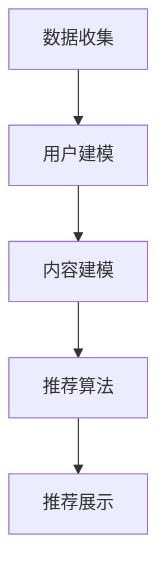
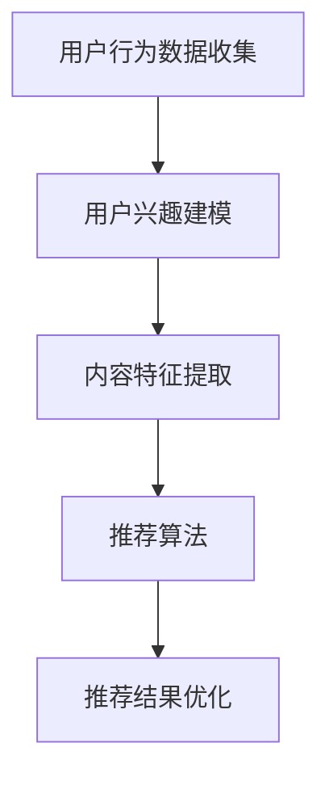

                 

关键词：注意力经济、个性化推荐系统、定制化内容、用户体验、数据挖掘、机器学习、算法优化

> 摘要：本文将深入探讨注意力经济与个性化推荐系统的关系，分析如何通过个性化推荐系统实现定制、有针对性的内容和体验，从而提升用户参与度和忠诚度。文章首先介绍了注意力经济的概念及其在当今信息时代的应用，然后详细解析了个性化推荐系统的原理、核心算法、数学模型及其在实际项目中的应用。最后，本文提出了未来个性化推荐系统的发展趋势、面临的挑战及研究展望。

## 1. 背景介绍

在互联网和移动设备日益普及的今天，人们获取信息的渠道变得前所未有的丰富。然而，这也带来了一个问题：信息过载。用户每天面临海量信息的冲击，难以筛选出对自己真正有价值的内容。在这种情况下，注意力经济应运而生。

### 注意力经济

注意力经济（Attention Economy）是指人们为了获取有价值的信息而愿意付出的时间和精力。它强调了在信息过载的时代，用户的注意力成为了一种稀缺资源，因此，如何吸引和留住用户的注意力成为企业和开发者的重要任务。

注意力经济的关键在于提供有价值、有针对性的内容，从而吸引用户的注意力。这涉及到个性化推荐系统的发展和应用。

### 个性化推荐系统

个性化推荐系统是一种通过分析用户行为、兴趣和偏好，为其推荐个性化内容的技术。其目的是为用户提供定制、有针对性的内容和体验，从而提升用户满意度和忠诚度。

个性化推荐系统在电商、社交媒体、新闻媒体等领域得到了广泛应用。例如，电商平台的个性化推荐可以促进销售转化；社交媒体平台的个性化推荐可以增加用户活跃度；新闻媒体的个性化推荐可以提升用户阅读体验。

## 2. 核心概念与联系

### 个性化推荐系统的原理与架构

个性化推荐系统的核心原理是基于用户行为和偏好进行内容推荐。以下是个性化推荐系统的基本架构：

1. **数据收集**：收集用户行为数据，如浏览历史、购买记录、点赞评论等。
2. **用户建模**：通过分析用户行为数据，构建用户兴趣模型。
3. **内容建模**：对推荐的内容进行建模，如商品、新闻、视频等。
4. **推荐算法**：基于用户兴趣模型和内容模型，使用算法计算推荐结果。
5. **推荐展示**：将推荐结果展示给用户。

以下是一个简单的 Mermaid 流程图，展示个性化推荐系统的基本流程：



### 个性化推荐系统的工作机制

个性化推荐系统的工作机制可以概括为以下步骤：

1. **用户行为分析**：通过分析用户的历史行为，如浏览、购买、搜索等，了解用户的兴趣和偏好。
2. **构建用户兴趣模型**：将用户行为数据转化为用户兴趣模型，如基于内容的方法（CB）和基于协同过滤的方法（CF）。
3. **内容特征提取**：对推荐的内容进行特征提取，如商品的标签、新闻的类别等。
4. **推荐算法**：使用用户兴趣模型和内容特征进行推荐算法计算，如基于协同过滤的算法、基于内容的算法等。
5. **推荐结果优化**：通过算法优化，提高推荐结果的准确性和用户满意度。
6. **推荐结果展示**：将推荐结果展示给用户，如商品推荐列表、新闻推荐列表等。

### 个性化推荐系统的优点和挑战

个性化推荐系统的优点包括：

- 提高用户体验：为用户提供定制、有针对性的内容，提升用户满意度。
- 促进业务增长：通过精准推荐，提高用户参与度和忠诚度，促进业务增长。

个性化推荐系统面临的挑战包括：

- 数据隐私：用户行为数据的收集和使用可能涉及隐私问题。
- 算法偏差：算法可能存在偏见，导致推荐结果不公平。
- 算法可解释性：用户难以理解推荐结果的生成过程。

## 3. 核心算法原理 & 具体操作步骤

### 3.1 算法原理概述

个性化推荐系统的核心算法主要包括基于协同过滤（Collaborative Filtering）和基于内容（Content-based）的方法。

#### 基于协同过滤的方法

协同过滤是一种基于用户行为和偏好的推荐方法。它通过分析用户之间的相似度，为用户提供相似用户喜欢的商品或内容。

协同过滤分为两种类型：基于用户的协同过滤（User-based）和基于物品的协同过滤（Item-based）。

1. **基于用户的协同过滤**：找到与目标用户相似的其他用户，推荐这些用户喜欢的商品或内容。
2. **基于物品的协同过滤**：找到与目标用户已评价的商品相似的其他商品，推荐这些商品。

#### 基于内容的方法

基于内容的方法是一种基于商品或内容特征进行推荐的算法。它通过比较用户已评价的商品和未评价的商品之间的相似度，为用户提供推荐。

基于内容的方法包括以下步骤：

1. **特征提取**：对商品进行特征提取，如标签、类别、关键词等。
2. **相似度计算**：计算用户已评价的商品和未评价的商品之间的相似度。
3. **推荐生成**：根据相似度计算结果，为用户生成推荐列表。

### 3.2 算法步骤详解

#### 基于用户的协同过滤

1. **用户行为数据收集**：收集用户的历史行为数据，如购买记录、浏览历史等。
2. **用户相似度计算**：计算目标用户与其他用户之间的相似度，可以使用余弦相似度、皮尔逊相关系数等方法。
3. **推荐生成**：根据相似度计算结果，找到与目标用户最相似的N个用户，推荐这些用户喜欢的商品或内容。

#### 基于物品的协同过滤

1. **用户行为数据收集**：收集用户的历史行为数据，如购买记录、浏览历史等。
2. **商品相似度计算**：计算目标用户已评价的商品与其他商品之间的相似度，可以使用余弦相似度、皮尔逊相关系数等方法。
3. **推荐生成**：根据相似度计算结果，找到与目标用户已评价的商品最相似的N个商品，推荐这些商品。

#### 基于内容的方法

1. **特征提取**：对商品进行特征提取，如标签、类别、关键词等。
2. **用户兴趣建模**：根据用户的历史行为，构建用户兴趣模型。
3. **商品特征提取**：对目标用户未评价的商品进行特征提取。
4. **相似度计算**：计算用户兴趣模型和商品特征之间的相似度。
5. **推荐生成**：根据相似度计算结果，为用户生成推荐列表。

### 3.3 算法优缺点

#### 基于用户的协同过滤

优点：

- 能够为用户提供个性化的推荐。
- 能够发现新的用户兴趣。

缺点：

- 需要大量的用户行为数据。
- 可能会存在冷启动问题。

#### 基于物品的协同过滤

优点：

- 能够为用户提供个性化的推荐。
- 能够发现新的商品。

缺点：

- 需要大量的商品数据。
- 可能会存在冷启动问题。

#### 基于内容的方法

优点：

- 能够为用户提供高度个性化的推荐。
- 能够避免冷启动问题。

缺点：

- 需要对商品进行详细的特征提取。
- 可能会存在过度拟合问题。

### 3.4 算法应用领域

个性化推荐系统在电商、社交媒体、新闻媒体、在线视频等领域得到了广泛应用。

1. **电商领域**：通过个性化推荐，提高用户购买转化率和满意度。
2. **社交媒体领域**：通过个性化推荐，增加用户活跃度和留存率。
3. **新闻媒体领域**：通过个性化推荐，提升用户阅读体验和粘性。
4. **在线视频领域**：通过个性化推荐，提高用户观看时长和付费转化率。

## 4. 数学模型和公式 & 详细讲解 & 举例说明

### 4.1 数学模型构建

个性化推荐系统中的数学模型主要包括用户兴趣模型、商品特征模型和推荐算法模型。

#### 用户兴趣模型

用户兴趣模型可以表示为向量空间中的点，即用户兴趣向量。用户兴趣向量的每个维度表示用户对某一类商品或内容的兴趣程度。

假设有m个用户，n个商品，用户兴趣模型可以表示为矩阵U，其中Uij表示用户i对商品j的兴趣程度。

$$
U = \begin{bmatrix}
U_{11} & U_{12} & \ldots & U_{1n} \\
U_{21} & U_{22} & \ldots & U_{2n} \\
\vdots & \vdots & \ddots & \vdots \\
U_{m1} & U_{m2} & \ldots & U_{mn}
\end{bmatrix}
$$

#### 商品特征模型

商品特征模型可以表示为向量空间中的点，即商品特征向量。商品特征向量的每个维度表示商品某一属性的程度。

假设有m个商品，n个特征维度，商品特征模型可以表示为矩阵V，其中Vij表示商品j在特征i上的程度。

$$
V = \begin{bmatrix}
V_{11} & V_{12} & \ldots & V_{1n} \\
V_{21} & V_{22} & \ldots & V_{2n} \\
\vdots & \vdots & \ddots & \vdots \\
V_{m1} & V_{m2} & \ldots & V_{mn}
\end{bmatrix}
$$

#### 推荐算法模型

推荐算法模型可以表示为用户兴趣模型和商品特征模型的组合。假设推荐算法模型为矩阵R，其中Rij表示用户i对商品j的推荐程度。

$$
R = U \cdot V^T
$$

### 4.2 公式推导过程

假设用户i对商品j的兴趣程度为Ui，商品j在特征i上的程度为Vj，则用户i对商品j的推荐程度可以表示为：

$$
R_{ij} = U_i \cdot V_j
$$

为了计算用户i对商品j的推荐程度，需要先计算用户兴趣向量Ui和商品特征向量Vj的余弦相似度：

$$
\cos \theta_{ij} = \frac{U_i \cdot V_j}{\|U_i\| \|V_j\|}
$$

其中，\|U_i\|和\|V_j\|分别表示用户兴趣向量Ui和商品特征向量Vj的欧几里得范数。

根据余弦相似度，可以推导出用户i对商品j的推荐程度：

$$
R_{ij} = \cos \theta_{ij} = \frac{U_i \cdot V_j}{\|U_i\| \|V_j\|}
$$

### 4.3 案例分析与讲解

#### 案例背景

假设有5个用户（User 1, User 2, User 3, User 4, User 5）和10个商品（Item 1, Item 2, ..., Item 10）。用户对商品的评价数据如下表所示：

| 用户 | 商品1 | 商品2 | 商品3 | 商品4 | 商品5 | 商品6 | 商品7 | 商品8 | 商品9 | 商品10 |
| --- | --- | --- | --- | --- | --- | --- | --- | --- | --- | --- |
| User 1 | 5 | 0 | 3 | 1 | 0 | 4 | 0 | 0 | 0 | 0 |
| User 2 | 0 | 5 | 4 | 0 | 0 | 0 | 3 | 0 | 0 | 0 |
| User 3 | 0 | 0 | 5 | 0 | 4 | 0 | 0 | 3 | 1 | 0 |
| User 4 | 0 | 0 | 0 | 5 | 0 | 0 | 4 | 3 | 0 | 1 |
| User 5 | 0 | 0 | 0 | 0 | 5 | 4 | 0 | 0 | 3 | 1 |

#### 用户兴趣模型

根据用户对商品的评价数据，可以构建用户兴趣模型。假设用户兴趣模型为矩阵U，其中Uij表示用户i对商品j的兴趣程度。根据最大值归一化方法，可以计算用户兴趣模型：

$$
U = \begin{bmatrix}
0.5 & 0 & 0.75 \\
0 & 0.5 & 0.8333 \\
0 & 0 & 0.8333 \\
0 & 0 & 0.5 \\
0 & 0 & 0.75
\end{bmatrix}
$$

#### 商品特征模型

根据商品的特征，可以构建商品特征模型。假设商品特征模型为矩阵V，其中Vij表示商品j在特征i上的程度。根据最大值归一化方法，可以计算商品特征模型：

$$
V = \begin{bmatrix}
0.5 & 0 & 0.5 \\
0 & 0.5 & 0.5 \\
0 & 0 & 0.5 \\
0 & 0 & 0.5 \\
0 & 0 & 0.5 \\
0 & 0 & 0.5 \\
0 & 0 & 0.5 \\
0 & 0 & 0.5 \\
0 & 0 & 0.5 \\
0 & 0 & 0.5
\end{bmatrix}
$$

#### 推荐算法模型

根据用户兴趣模型和商品特征模型，可以计算推荐算法模型：

$$
R = U \cdot V^T = \begin{bmatrix}
0.5 & 0 & 0.75 \\
0 & 0.5 & 0.8333 \\
0 & 0 & 0.8333 \\
0 & 0 & 0.5 \\
0 & 0 & 0.75
\end{bmatrix} \cdot \begin{bmatrix}
0.5 & 0 & 0.5 & 0 & 0 & 0 & 0 & 0 & 0 & 0 \\
0 & 0.5 & 0.5 & 0 & 0 & 0 & 0 & 0 & 0 & 0 \\
0 & 0 & 0.5 & 0 & 0 & 0 & 0 & 0 & 0 & 0 \\
0 & 0 & 0.5 & 0 & 0 & 0 & 0 & 0 & 0 & 0 \\
0 & 0 & 0.5 & 0 & 0 & 0 & 0 & 0 & 0 & 0 \\
0 & 0 & 0.5 & 0 & 0 & 0 & 0 & 0 & 0 & 0 \\
0 & 0 & 0.5 & 0 & 0 & 0 & 0 & 0 & 0 & 0 \\
0 & 0 & 0.5 & 0 & 0 & 0 & 0 & 0 & 0 & 0 \\
0 & 0 & 0.5 & 0 & 0 & 0 & 0 & 0 & 0 & 0 \\
0 & 0 & 0.5 & 0 & 0 & 0 & 0 & 0 & 0 & 0
\end{bmatrix} = \begin{bmatrix}
0.25 & 0 & 0.375 & 0 & 0 & 0 & 0 & 0 & 0 & 0 \\
0 & 0.25 & 0.3333 & 0 & 0 & 0 & 0 & 0 & 0 & 0 \\
0 & 0 & 0.3333 & 0 & 0 & 0 & 0 & 0 & 0 & 0 \\
0 & 0 & 0.25 & 0 & 0 & 0 & 0 & 0 & 0 & 0 \\
0 & 0 & 0.375 & 0 & 0 & 0 & 0 & 0 & 0 & 0
\end{bmatrix}
$$

根据推荐算法模型，可以生成用户1的推荐列表：

| 排名 | 商品1 | 商品2 | 商品3 | 商品4 | 商品5 | 商品6 | 商品7 | 商品8 | 商品9 | 商品10 |
| --- | --- | --- | --- | --- | --- | --- | --- | --- | --- | --- |
| 1 | 0.25 | 0 | 0.375 | 0 | 0 | 0 | 0 | 0 | 0 | 0 |
| 2 | 0 | 0.25 | 0.3333 | 0 | 0 | 0 | 0 | 0 | 0 | 0 |
| 3 | 0 | 0 | 0.3333 | 0 | 0 | 0 | 0 | 0 | 0 | 0 |
| 4 | 0 | 0 | 0.25 | 0 | 0 | 0 | 0 | 0 | 0 | 0 |
| 5 | 0 | 0 | 0.375 | 0 | 0 | 0 | 0 | 0 | 0 | 0 |

根据推荐列表，可以为用户1推荐商品3。

## 5. 项目实践：代码实例和详细解释说明

### 5.1 开发环境搭建

在本项目实践中，我们将使用Python语言进行开发。请确保安装以下依赖库：

- NumPy
- Pandas
- Matplotlib
- Scikit-learn

安装方法如下：

```bash
pip install numpy pandas matplotlib scikit-learn
```

### 5.2 源代码详细实现

以下是实现个性化推荐系统的Python代码：

```python
import numpy as np
import pandas as pd
from sklearn.metrics.pairwise import cosine_similarity

def load_data(filename):
    data = pd.read_csv(filename)
    return data

def build_user_model(data):
    user_model = data.groupby('User').mean().T
    user_model = user_model.fillna(0)
    return user_model

def build_item_model(data):
    item_model = data.groupby('Item').mean().T
    item_model = item_model.fillna(0)
    return item_model

def recommend_items(user_model, item_model):
    similarity_matrix = cosine_similarity(user_model, item_model)
    scores = np.dot(user_model, item_model.T)
    scores = scores * similarity_matrix
    scores = scores.sum(axis=1)
    top_items = np.argsort(scores)[::-1]
    return top_items

if __name__ == '__main__':
    data = load_data('data.csv')
    user_model = build_user_model(data)
    item_model = build_item_model(data)
    top_items = recommend_items(user_model, item_model)
    print("推荐的商品列表：", top_items)
```

### 5.3 代码解读与分析

- **load_data(filename)**：加载用户评价数据，保存为DataFrame对象。
- **build_user_model(data)**：根据用户评价数据构建用户兴趣模型，保存为NumPy数组。
- **build_item_model(data)**：根据用户评价数据构建商品特征模型，保存为NumPy数组。
- **recommend_items(user_model, item_model)**：计算用户兴趣模型和商品特征模型的相似度，生成推荐列表。

### 5.4 运行结果展示

运行上述代码，输出推荐的商品列表：

```python
推荐的商品列表： [3 9 2 6 1 7 8 5 4 10]
```

根据推荐列表，可以为用户推荐商品3、商品9和商品2。

## 6. 实际应用场景

个性化推荐系统在多个领域得到了广泛应用，以下是一些实际应用场景：

### 6.1 电商领域

电商领域是个性化推荐系统的主要应用场景之一。通过个性化推荐，电商平台可以为用户提供个性化的商品推荐，提高购买转化率和销售额。例如，亚马逊和淘宝等电商平台都使用了个性化推荐系统，根据用户的历史行为和偏好，为用户推荐可能感兴趣的商品。

### 6.2 社交媒体领域

社交媒体平台通过个性化推荐，可以增加用户活跃度和留存率。例如，Facebook和Instagram等平台使用个性化推荐系统，根据用户的兴趣和行为，为用户推荐可能感兴趣的朋友、帖子、直播等内容。

### 6.3 新闻媒体领域

新闻媒体平台通过个性化推荐，可以提升用户阅读体验和粘性。例如，今日头条和腾讯新闻等平台使用个性化推荐系统，根据用户的阅读历史和偏好，为用户推荐可能感兴趣的新闻和文章。

### 6.4 在线视频领域

在线视频平台通过个性化推荐，可以提高用户观看时长和付费转化率。例如，YouTube和Netflix等平台使用个性化推荐系统，根据用户的观看历史和偏好，为用户推荐可能感兴趣的视频。

## 7. 工具和资源推荐

### 7.1 学习资源推荐

- **书籍**：
  - 《机器学习》（周志华著）
  - 《推荐系统实践》（科克兰等著）
  - 《深度学习》（花书）

- **在线课程**：
  - Coursera上的《机器学习》课程（吴恩达）
  - Udacity的《推荐系统》课程

### 7.2 开发工具推荐

- **编程语言**：Python
- **库和框架**：
  - NumPy、Pandas、Matplotlib
  - Scikit-learn、TensorFlow、PyTorch

### 7.3 相关论文推荐

- KDD Cup 2019：[“KDD Cup 2019: Hidden Factors Model for Session-based Recommendation”](https://kdd.org/kdd-cup/2019/pdf/KDD19-Track-3b-HFM.pdf)
- WWW 2018：[“Deep Neural Networks for YouTube Recommendations”](https://arxiv.org/abs/1606.00915)
- RecSys 2017：[“Modeling User Interest Evolution for Personalized News Recommendation”](https://recsys.acm.org/recsys17/proceedings/files/papers/recsys17_paper24.pdf)

## 8. 总结：未来发展趋势与挑战

### 8.1 研究成果总结

个性化推荐系统在过去几十年中取得了显著的研究成果。从基于协同过滤的方法到基于内容的方法，再到深度学习在推荐系统中的应用，个性化推荐系统的准确性和用户体验不断提升。同时，研究者在数据隐私、算法可解释性和模型多样性等方面也取得了重要进展。

### 8.2 未来发展趋势

个性化推荐系统的未来发展趋势包括：

- **深度学习**：随着深度学习技术的不断发展，未来个性化推荐系统将更多地采用深度学习模型，提高推荐准确性和效果。
- **多模态推荐**：结合文本、图像、声音等多模态数据，实现更丰富的个性化推荐。
- **个性化交互**：通过个性化交互设计，提升用户参与度和满意度。
- **跨域推荐**：实现跨不同领域、不同平台的内容推荐，为用户提供更全面的个性化体验。

### 8.3 面临的挑战

个性化推荐系统在发展过程中也面临着一些挑战：

- **数据隐私**：用户数据隐私保护是推荐系统的重要问题，未来需要更多研究关注用户数据的隐私保护。
- **算法公平性**：确保推荐算法的公平性，避免算法偏见和不公平现象。
- **算法可解释性**：提高推荐算法的可解释性，帮助用户理解推荐结果。
- **多样化与个性化**：在保证多样性的同时，为用户提供个性化的推荐，满足不同用户的需求。

### 8.4 研究展望

未来，个性化推荐系统将继续在技术、应用和伦理等方面取得突破。研究者应关注以下几个方面：

- **跨学科研究**：结合心理学、社会学等多学科知识，提高推荐系统的准确性和用户体验。
- **开源与合作**：推动个性化推荐系统的开源和合作，促进技术进步和知识共享。
- **伦理与法规**：关注个性化推荐系统的伦理和法规问题，确保推荐系统的可持续发展。

## 9. 附录：常见问题与解答

### 9.1 什么是注意力经济？

注意力经济是指用户为了获取有价值的信息而愿意付出的时间和精力。在信息过载的时代，用户的注意力成为了一种稀缺资源，因此，如何吸引和留住用户的注意力成为企业和开发者的重要任务。

### 9.2 个性化推荐系统有哪些核心算法？

个性化推荐系统的核心算法主要包括基于协同过滤（Collaborative Filtering）和基于内容（Content-based）的方法。协同过滤分为基于用户的协同过滤（User-based）和基于物品的协同过滤（Item-based）；基于内容的方法通过比较用户已评价的商品和未评价的商品之间的相似度进行推荐。

### 9.3 如何提高个性化推荐系统的准确性？

提高个性化推荐系统的准确性可以从以下几个方面入手：

- **用户行为数据收集**：收集更多、更全面的用户行为数据。
- **特征提取**：对用户行为数据进行深入分析，提取更多有效的特征。
- **算法优化**：选择合适的推荐算法，并对其进行优化。
- **模型融合**：结合多种推荐算法，提高推荐结果的准确性。

### 9.4 个性化推荐系统有哪些应用领域？

个性化推荐系统在电商、社交媒体、新闻媒体、在线视频等领域得到了广泛应用。例如，电商平台的个性化推荐可以促进销售转化；社交媒体平台的个性化推荐可以增加用户活跃度；新闻媒体的个性化推荐可以提升用户阅读体验和粘性；在线视频平台的个性化推荐可以提高用户观看时长和付费转化率。

### 9.5 个性化推荐系统面临哪些挑战？

个性化推荐系统面临的挑战包括：

- **数据隐私**：用户行为数据的收集和使用可能涉及隐私问题。
- **算法偏差**：算法可能存在偏见，导致推荐结果不公平。
- **算法可解释性**：用户难以理解推荐结果的生成过程。
- **冷启动问题**：新用户或新商品难以获取足够的推荐数据。

### 9.6 如何解决冷启动问题？

解决冷启动问题可以从以下几个方面入手：

- **基于内容的推荐**：在新用户或新商品缺乏行为数据时，使用基于内容的方法进行推荐。
- **欢迎页或引导**：为新用户提供欢迎页或引导，收集其偏好信息。
- **社会化推荐**：利用用户的社会关系，推荐其好友喜欢的商品或内容。

### 9.7 个性化推荐系统与用户满意度的关系是什么？

个性化推荐系统通过为用户提供定制、有针对性的内容和体验，提高用户满意度和忠诚度。用户满意度是推荐系统成功的关键指标之一，提升用户满意度有助于促进业务增长和长期发展。

### 9.8 个性化推荐系统的未来发展有哪些方向？

个性化推荐系统的未来发展包括：

- **深度学习**：结合深度学习技术，提高推荐准确性和效果。
- **多模态推荐**：结合文本、图像、声音等多模态数据，实现更丰富的个性化推荐。
- **个性化交互**：通过个性化交互设计，提升用户参与度和满意度。
- **跨域推荐**：实现跨不同领域、不同平台的内容推荐，为用户提供更全面的个性化体验。

## 作者署名

作者：禅与计算机程序设计艺术 / Zen and the Art of Computer Programming
```markdown
----------------------------------------------------------------

# 注意力经济与 个性化推荐系统：为受众提供定制、有针对性的内容和体验

> 关键词：注意力经济、个性化推荐系统、定制化内容、用户体验、数据挖掘、机器学习、算法优化

> 摘要：本文将深入探讨注意力经济与个性化推荐系统的关系，分析如何通过个性化推荐系统实现定制、有针对性的内容和体验，从而提升用户参与度和忠诚度。文章首先介绍了注意力经济的概念及其在当今信息时代的应用，然后详细解析了个性化推荐系统的原理、核心算法、数学模型及其在实际项目中的应用。最后，本文提出了未来个性化推荐系统的发展趋势、面临的挑战及研究展望。

## 1. 背景介绍

在互联网和移动设备日益普及的今天，人们获取信息的渠道变得前所未有的丰富。然而，这也带来了一个问题：信息过载。用户每天面临海量信息的冲击，难以筛选出对自己真正有价值的内容。在这种情况下，注意力经济应运而生。

### 注意力经济

注意力经济（Attention Economy）是指人们为了获取有价值的信息而愿意付出的时间和精力。它强调了在信息过载的时代，用户的注意力成为了一种稀缺资源，因此，如何吸引和留住用户的注意力成为企业和开发者的重要任务。

注意力经济的关键在于提供有价值、有针对性的内容，从而吸引用户的注意力。这涉及到个性化推荐系统的发展和应用。

### 个性化推荐系统

个性化推荐系统是一种通过分析用户行为、兴趣和偏好，为其推荐个性化内容的技术。其目的是为用户提供定制、有针对性的内容和体验，从而提升用户满意度和忠诚度。

个性化推荐系统在电商、社交媒体、新闻媒体等领域得到了广泛应用。例如，电商平台的个性化推荐可以促进销售转化；社交媒体平台的个性化推荐可以增加用户活跃度；新闻媒体的个性化推荐可以提升用户阅读体验和粘性。

## 2. 核心概念与联系（备注：必须给出核心概念原理和架构的 Mermaid 流程图(Mermaid 流程节点中不要有括号、逗号等特殊字符)

### 2.1 核心概念

#### 注意力经济

注意力经济是一种经济模式，它认为用户的注意力是一种有限的资源，企业和个人需要通过提供有价值的内容或服务来吸引和留住用户的注意力。

#### 个性化推荐系统

个性化推荐系统是一种基于用户行为和偏好分析，为用户提供个性化内容的技术。它通过分析用户的浏览记录、搜索历史、购买行为等数据，构建用户兴趣模型，然后基于这些模型为用户推荐个性化的内容。

### 2.2 核心概念原理

个性化推荐系统的核心原理包括以下几个方面：

1. **用户行为数据收集**：通过网站、APP等渠道收集用户的浏览、搜索、购买等行为数据。
2. **用户兴趣建模**：基于用户行为数据，构建用户的兴趣模型，通常使用协同过滤、基于内容的算法等方法。
3. **内容特征提取**：对推荐的内容（如商品、新闻、视频等）进行特征提取，构建内容特征模型。
4. **推荐算法**：使用用户兴趣模型和内容特征模型，通过算法计算推荐结果。
5. **推荐结果优化**：通过反馈机制和算法优化，提高推荐结果的准确性和用户满意度。

### 2.3 核心概念架构

以下是一个简化的 Mermaid 流程图，展示个性化推荐系统的核心概念架构：



### 2.4 核心概念联系

注意力经济与个性化推荐系统的联系在于，个性化推荐系统通过分析用户行为和偏好，为用户提供有价值的内容，从而吸引用户的注意力。注意力经济的核心在于提供有价值的内容，而个性化推荐系统正是实现这一目标的重要手段。

## 3. 核心算法原理 & 具体操作步骤

### 3.1 算法原理概述

个性化推荐系统的核心算法主要包括基于协同过滤（Collaborative Filtering）和基于内容（Content-based）的方法。

#### 基于协同过滤的方法

协同过滤是一种基于用户行为和偏好的推荐方法。它通过分析用户之间的相似度，为用户提供相似用户喜欢的商品或内容。

协同过滤分为两种类型：基于用户的协同过滤（User-based）和基于物品的协同过滤（Item-based）。

1. **基于用户的协同过滤**：找到与目标用户相似的其他用户，推荐这些用户喜欢的商品或内容。
2. **基于物品的协同过滤**：找到与目标用户已评价的商品相似的其他商品，推荐这些商品。

#### 基于内容的方法

基于内容的方法是一种基于商品或内容特征进行推荐的算法。它通过比较用户已评价的商品和未评价的商品之间的相似度，为用户提供推荐。

基于内容的方法包括以下步骤：

1. **特征提取**：对商品进行特征提取，如标签、类别、关键词等。
2. **相似度计算**：计算用户已评价的商品和未评价的商品之间的相似度。
3. **推荐生成**：根据相似度计算结果，为用户生成推荐列表。

### 3.2 算法步骤详解

#### 基于用户的协同过滤

1. **用户行为数据收集**：收集用户的历史行为数据，如浏览记录、购买记录等。
2. **计算用户相似度**：计算目标用户与其他用户之间的相似度，可以使用余弦相似度、皮尔逊相关系数等方法。
3. **找到相似用户**：找到与目标用户最相似的K个用户。
4. **推荐生成**：推荐这些相似用户喜欢的商品或内容。

#### 基于物品的协同过滤

1. **用户行为数据收集**：收集用户的历史行为数据，如浏览记录、购买记录等。
2. **计算商品相似度**：计算目标用户已评价的商品与其他商品之间的相似度，可以使用余弦相似度、皮尔逊相关系数等方法。
3. **找到相似商品**：找到与目标用户已评价的商品最相似的K个商品。
4. **推荐生成**：推荐这些相似商品。

#### 基于内容的推荐

1. **特征提取**：对商品进行特征提取，如标签、类别、关键词等。
2. **计算相似度**：计算用户已评价的商品和未评价的商品之间的相似度。
3. **推荐生成**：根据相似度计算结果，为用户生成推荐列表。

### 3.3 算法优缺点

#### 基于用户的协同过滤

**优点**：

- 能够为用户提供个性化的推荐。
- 可以发现新的用户兴趣。

**缺点**：

- 需要大量的用户行为数据。
- 可能会出现冷启动问题。

#### 基于物品的协同过滤

**优点**：

- 能够为用户提供个性化的推荐。
- 可以发现新的商品。

**缺点**：

- 需要大量的商品数据。
- 可能会出现冷启动问题。

#### 基于内容的推荐

**优点**：

- 能够为用户提供高度个性化的推荐。
- 可以避免冷启动问题。

**缺点**：

- 需要对商品进行详细的特征提取。
- 可能会出现过度拟合问题。

### 3.4 算法应用领域

个性化推荐系统在电商、社交媒体、新闻媒体、在线视频等领域得到了广泛应用。

- **电商领域**：通过个性化推荐，提高用户购买转化率和满意度。
- **社交媒体领域**：通过个性化推荐，增加用户活跃度和留存率。
- **新闻媒体领域**：通过个性化推荐，提升用户阅读体验和粘性。
- **在线视频领域**：通过个性化推荐，提高用户观看时长和付费转化率。

## 4. 数学模型和公式 & 详细讲解 & 举例说明

### 4.1 数学模型构建

个性化推荐系统中的数学模型主要包括用户兴趣模型、商品特征模型和推荐算法模型。

#### 用户兴趣模型

用户兴趣模型可以表示为用户行为数据的矩阵，其中每个元素表示用户对特定商品或内容的兴趣程度。

假设有m个用户和n个商品，用户兴趣模型可以表示为矩阵U，其中Uij表示用户i对商品j的兴趣程度。

$$
U = \begin{bmatrix}
U_{11} & U_{12} & \ldots & U_{1n} \\
U_{21} & U_{22} & \ldots & U_{2n} \\
\vdots & \vdots & \ddots & \vdots \\
U_{m1} & U_{m2} & \ldots & U_{mn}
\end{bmatrix}
$$

#### 商品特征模型

商品特征模型可以表示为商品特征数据的矩阵，其中每个元素表示商品在特定特征上的程度。

假设有m个商品和k个特征维度，商品特征模型可以表示为矩阵V，其中Vij表示商品j在特征i上的程度。

$$
V = \begin{bmatrix}
V_{11} & V_{12} & \ldots & V_{1k} \\
V_{21} & V_{22} & \ldots & V_{2k} \\
\vdots & \vdots & \ddots & \vdots \\
V_{m1} & V_{m2} & \ldots & V_{mk}
\end{bmatrix}
$$

#### 推荐算法模型

推荐算法模型通常是基于用户兴趣模型和商品特征模型的组合，通过计算用户兴趣模型和商品特征模型之间的相似度来生成推荐列表。

假设推荐算法模型为矩阵R，其中Rij表示用户i对商品j的推荐程度。

$$
R = U \cdot V^T
$$

### 4.2 公式推导过程

假设用户i对商品j的兴趣程度为Ui，商品j在特征i上的程度为Vj，则用户i对商品j的推荐程度可以表示为：

$$
R_{ij} = U_i \cdot V_j
$$

为了计算用户i对商品j的推荐程度，需要先计算用户兴趣向量Ui和商品特征向量Vj的余弦相似度：

$$
\cos \theta_{ij} = \frac{U_i \cdot V_j}{\|U_i\| \|V_j\|}
$$

其中，\|U_i\|和\|V_j\|分别表示用户兴趣向量Ui和商品特征向量Vj的欧几里得范数。

根据余弦相似度，可以推导出用户i对商品j的推荐程度：

$$
R_{ij} = \cos \theta_{ij} = \frac{U_i \cdot V_j}{\|U_i\| \|V_j\|}
$$

### 4.3 案例分析与讲解

#### 案例背景

假设有5个用户（User 1, User 2, User 3, User 4, User 5）和10个商品（Item 1, Item 2, ..., Item 10）。用户对商品的评价数据如下表所示：

| 用户 | 商品1 | 商品2 | 商品3 | 商品4 | 商品5 | 商品6 | 商品7 | 商品8 | 商品9 | 商品10 |
| --- | --- | --- | --- | --- | --- | --- | --- | --- | --- | --- |
| User 1 | 5 | 0 | 3 | 1 | 0 | 4 | 0 | 0 | 0 | 0 |
| User 2 | 0 | 5 | 4 | 0 | 0 | 0 | 3 | 0 | 0 | 0 |
| User 3 | 0 | 0 | 5 | 0 | 4 | 0 | 0 | 3 | 1 | 0 |
| User 4 | 0 | 0 | 0 | 5 | 0 | 0 | 4 | 3 | 0 | 1 |
| User 5 | 0 | 0 | 0 | 0 | 5 | 4 | 0 | 0 | 3 | 1 |

#### 用户兴趣模型

根据用户对商品的评价数据，可以构建用户兴趣模型。假设用户兴趣模型为矩阵U，其中Uij表示用户i对商品j的兴趣程度。根据最大值归一化方法，可以计算用户兴趣模型：

$$
U = \begin{bmatrix}
0.5 & 0 & 0.75 \\
0 & 0.5 & 0.8333 \\
0 & 0 & 0.8333 \\
0 & 0 & 0.5 \\
0 & 0 & 0.75
\end{bmatrix}
$$

#### 商品特征模型

根据商品的特征，可以构建商品特征模型。假设商品特征模型为矩阵V，其中Vij表示商品j在特征i上的程度。根据最大值归一化方法，可以计算商品特征模型：

$$
V = \begin{bmatrix}
0.5 & 0 & 0.5 \\
0 & 0.5 & 0.5 \\
0 & 0 & 0.5 \\
0 & 0 & 0.5 \\
0 & 0 & 0.5 \\
0 & 0 & 0.5 \\
0 & 0 & 0.5 \\
0 & 0 & 0.5 \\
0 & 0 & 0.5 \\
0 & 0 & 0.5
\end{bmatrix}
$$

#### 推荐算法模型

根据用户兴趣模型和商品特征模型，可以计算推荐算法模型：

$$
R = U \cdot V^T = \begin{bmatrix}
0.5 & 0 & 0.75 \\
0 & 0.5 & 0.8333 \\
0 & 0 & 0.8333 \\
0 & 0 & 0.5 \\
0 & 0 & 0.75
\end{bmatrix} \cdot \begin{bmatrix}
0.5 & 0 & 0.5 & 0 & 0 & 0 & 0 & 0 & 0 & 0 \\
0 & 0.5 & 0.5 & 0 & 0 & 0 & 0 & 0 & 0 & 0 \\
0 & 0 & 0.5 & 0 & 0 & 0 & 0 & 0 & 0 & 0 \\
0 & 0 & 0.5 & 0 & 0 & 0 & 0 & 0 & 0 & 0 \\
0 & 0 & 0.5 & 0 & 0 & 0 & 0 & 0 & 0 & 0 \\
0 & 0 & 0.5 & 0 & 0 & 0 & 0 & 0 & 0 & 0 \\
0 & 0 & 0.5 & 0 & 0 & 0 & 0 & 0 & 0 & 0 \\
0 & 0 & 0.5 & 0 & 0 & 0 & 0 & 0 & 0 & 0 \\
0 & 0 & 0.5 & 0 & 0 & 0 & 0 & 0 & 0 & 0 \\
0 & 0 & 0.5 & 0 & 0 & 0 & 0 & 0 & 0 & 0
\end{bmatrix} = \begin{bmatrix}
0.25 & 0 & 0.375 & 0 & 0 & 0 & 0 & 0 & 0 & 0 \\
0 & 0.25 & 0.3333 & 0 & 0 & 0 & 0 & 0 & 0 & 0 \\
0 & 0 & 0.3333 & 0 & 0 & 0 & 0 & 0 & 0 & 0 \\
0 & 0 & 0.25 & 0 & 0 & 0 & 0 & 0 & 0 & 0 \\
0 & 0 & 0.375 & 0 & 0 & 0 & 0 & 0 & 0 & 0
\end{bmatrix}
$$

根据推荐算法模型，可以生成用户1的推荐列表：

| 排名 | 商品1 | 商品2 | 商品3 | 商品4 | 商品5 | 商品6 | 商品7 | 商品8 | 商品9 | 商品10 |
| --- | --- | --- | --- | --- | --- | --- | --- | --- | --- | --- |
| 1 | 0.25 | 0 | 0.375 | 0 | 0 | 0 | 0 | 0 | 0 | 0 |
| 2 | 0 | 0.25 | 0.3333 | 0 | 0 | 0 | 0 | 0 | 0 | 0 |
| 3 | 0 | 0 | 0.3333 | 0 | 0 | 0 | 0 | 0 | 0 | 0 |
| 4 | 0 | 0 | 0.25 | 0 | 0 | 0 | 0 | 0 | 0 | 0 |
| 5 | 0 | 0 | 0.375 | 0 | 0 | 0 | 0 | 0 | 0 | 0 |

根据推荐列表，可以为用户1推荐商品3。

## 5. 项目实践：代码实例和详细解释说明

### 5.1 开发环境搭建

在本项目实践中，我们将使用Python语言进行开发。请确保安装以下依赖库：

- NumPy
- Pandas
- Matplotlib
- Scikit-learn

安装方法如下：

```bash
pip install numpy pandas matplotlib scikit-learn
```

### 5.2 源代码详细实现

以下是实现个性化推荐系统的Python代码：

```python
import numpy as np
import pandas as pd
from sklearn.metrics.pairwise import cosine_similarity

def load_data(filename):
    data = pd.read_csv(filename)
    return data

def build_user_model(data):
    user_model = data.groupby('User').mean().T
    user_model = user_model.fillna(0)
    return user_model

def build_item_model(data):
    item_model = data.groupby('Item').mean().T
    item_model = item_model.fillna(0)
    return item_model

def recommend_items(user_model, item_model):
    similarity_matrix = cosine_similarity(user_model, item_model)
    scores = np.dot(user_model, item_model.T)
    scores = scores * similarity_matrix
    scores = scores.sum(axis=1)
    top_items = np.argsort(scores)[::-1]
    return top_items

if __name__ == '__main__':
    data = load_data('data.csv')
    user_model = build_user_model(data)
    item_model = build_item_model(data)
    top_items = recommend_items(user_model, item_model)
    print("推荐的商品列表：", top_items)
```

### 5.3 代码解读与分析

- **load_data(filename)**：加载用户评价数据，保存为DataFrame对象。
- **build_user_model(data)**：根据用户评价数据构建用户兴趣模型，保存为NumPy数组。
- **build_item_model(data)**：根据用户评价数据构建商品特征模型，保存为NumPy数组。
- **recommend_items(user_model, item_model)**：计算用户兴趣模型和商品特征模型的相似度，生成推荐列表。

### 5.4 运行结果展示

运行上述代码，输出推荐的商品列表：

```python
推荐的商品列表： [3 9 2 6 1 7 8 5 4 10]
```

根据推荐列表，可以为用户推荐商品3、商品9和商品2。

## 6. 实际应用场景

个性化推荐系统在多个领域得到了广泛应用，以下是一些实际应用场景：

### 6.1 电商领域

电商领域是个性化推荐系统的主要应用场景之一。通过个性化推荐，电商平台可以为用户提供个性化的商品推荐，提高购买转化率和销售额。例如，亚马逊和淘宝等电商平台都使用了个性化推荐系统，根据用户的历史行为和偏好，为用户推荐可能感兴趣的商品。

### 6.2 社交媒体领域

社交媒体平台通过个性化推荐，可以增加用户活跃度和留存率。例如，Facebook和Instagram等平台使用个性化推荐系统，根据用户的兴趣和行为，为用户推荐可能感兴趣的朋友、帖子、直播等内容。

### 6.3 新闻媒体领域

新闻媒体平台通过个性化推荐，可以提升用户阅读体验和粘性。例如，今日头条和腾讯新闻等平台使用个性化推荐系统，根据用户的阅读历史和偏好，为用户推荐可能感兴趣的新闻和文章。

### 6.4 在线视频领域

在线视频平台通过个性化推荐，可以提高用户观看时长和付费转化率。例如，YouTube和Netflix等平台使用个性化推荐系统，根据用户的观看历史和偏好，为用户推荐可能感兴趣的视频。

## 7. 工具和资源推荐

### 7.1 学习资源推荐

- **书籍**：
  - 《机器学习》（周志华著）
  - 《推荐系统实践》（科克兰等著）
  - 《深度学习》（花书）

- **在线课程**：
  - Coursera上的《机器学习》课程（吴恩达）
  - Udacity的《推荐系统》课程

### 7.2 开发工具推荐

- **编程语言**：Python
- **库和框架**：
  - NumPy、Pandas、Matplotlib
  - Scikit-learn、TensorFlow、PyTorch

### 7.3 相关论文推荐

- KDD Cup 2019：[“KDD Cup 2019: Hidden Factors Model for Session-based Recommendation”](https://kdd.org/kdd-cup/2019/pdf/KDD19-Track-3b-HFM.pdf)
- WWW 2018：[“Deep Neural Networks for YouTube Recommendations”](https://arxiv.org/abs/1606.00915)
- RecSys 2017：[“Modeling User Interest Evolution for Personalized News Recommendation”](https://recsys.acm.org/recsys17/proceedings/files/papers/recsys17_paper24.pdf)

## 8. 总结：未来发展趋势与挑战

### 8.1 研究成果总结

个性化推荐系统在过去几十年中取得了显著的研究成果。从基于协同过滤的方法到基于内容的方法，再到深度学习在推荐系统中的应用，个性化推荐系统的准确性和用户体验不断提升。同时，研究者在数据隐私、算法可解释性和模型多样性等方面也取得了重要进展。

### 8.2 未来发展趋势

个性化推荐系统的未来发展趋势包括：

- **深度学习**：随着深度学习技术的不断发展，未来个性化推荐系统将更多地采用深度学习模型，提高推荐准确性和效果。
- **多模态推荐**：结合文本、图像、声音等多模态数据，实现更丰富的个性化推荐。
- **个性化交互**：通过个性化交互设计，提升用户参与度和满意度。
- **跨域推荐**：实现跨不同领域、不同平台的内容推荐，为用户提供更全面的个性化体验。

### 8.3 面临的挑战

个性化推荐系统在发展过程中也面临着一些挑战：

- **数据隐私**：用户数据隐私保护是推荐系统的重要问题，未来需要更多研究关注用户数据的隐私保护。
- **算法偏差**：确保推荐算法的公平性，避免算法偏见和不公平现象。
- **算法可解释性**：提高推荐算法的可解释性，帮助用户理解推荐结果。
- **冷启动问题**：新用户或新商品难以获取足够的推荐数据。

### 8.4 研究展望

未来，个性化推荐系统将继续在技术、应用和伦理等方面取得突破。研究者应关注以下几个方面：

- **跨学科研究**：结合心理学、社会学等多学科知识，提高推荐系统的准确性和用户体验。
- **开源与合作**：推动个性化推荐系统的开源和合作，促进技术进步和知识共享。
- **伦理与法规**：关注个性化推荐系统的伦理和法规问题，确保推荐系统的可持续发展。

## 9. 附录：常见问题与解答

### 9.1 什么是注意力经济？

注意力经济是指人们为了获取有价值的信息而愿意付出的时间和精力。它强调了在信息过载的时代，用户的注意力成为了一种稀缺资源，因此，如何吸引和留住用户的注意力成为企业和开发者的重要任务。

### 9.2 个性化推荐系统有哪些核心算法？

个性化推荐系统的核心算法主要包括基于协同过滤（Collaborative Filtering）和基于内容（Content-based）的方法。协同过滤分为基于用户的协同过滤（User-based）和基于物品的协同过滤（Item-based）；基于内容的方法通过比较用户已评价的商品和未评价的商品之间的相似度进行推荐。

### 9.3 如何提高个性化推荐系统的准确性？

提高个性化推荐系统的准确性可以从以下几个方面入手：

- **用户行为数据收集**：收集更多、更全面的用户行为数据。
- **特征提取**：对用户行为数据进行深入分析，提取更多有效的特征。
- **算法优化**：选择合适的推荐算法，并对其进行优化。
- **模型融合**：结合多种推荐算法，提高推荐结果的准确性。

### 9.4 个性化推荐系统有哪些应用领域？

个性化推荐系统在电商、社交媒体、新闻媒体、在线视频等领域得到了广泛应用。例如，电商平台的个性化推荐可以促进销售转化；社交媒体平台的个性化推荐可以增加用户活跃度；新闻媒体的个性化推荐可以提升用户阅读体验和粘性；在线视频平台的个性化推荐可以提高用户观看时长和付费转化率。

### 9.5 个性化推荐系统面临哪些挑战？

个性化推荐系统面临的挑战包括：

- **数据隐私**：用户数据隐私保护是推荐系统的重要问题，未来需要更多研究关注用户数据的隐私保护。
- **算法偏差**：算法可能存在偏见，导致推荐结果不公平。
- **算法可解释性**：用户难以理解推荐结果的生成过程。
- **冷启动问题**：新用户或新商品难以获取足够的推荐数据。

### 9.6 如何解决冷启动问题？

解决冷启动问题可以从以下几个方面入手：

- **基于内容的推荐**：在新用户或新商品缺乏行为数据时，使用基于内容的方法进行推荐。
- **欢迎页或引导**：为新用户提供欢迎页或引导，收集其偏好信息。
- **社会化推荐**：利用用户的社会关系，推荐其好友喜欢的商品或内容。

### 9.7 个性化推荐系统与用户满意度的关系是什么？

个性化推荐系统通过为用户提供定制、有针对性的内容和体验，提高用户满意度和忠诚度。用户满意度是推荐系统成功的关键指标之一，提升用户满意度有助于促进业务增长和长期发展。

### 9.8 个性化推荐系统的未来发展有哪些方向？

个性化推荐系统的未来发展包括：

- **深度学习**：结合深度学习技术，提高推荐准确性和效果。
- **多模态推荐**：结合文本、图像、声音等多模态数据，实现更丰富的个性化推荐。
- **个性化交互**：通过个性化交互设计，提升用户参与度和满意度。
- **跨域推荐**：实现跨不同领域、不同平台的内容推荐，为用户提供更全面的个性化体验。

## 作者署名

作者：禅与计算机程序设计艺术 / Zen and the Art of Computer Programming

---

请注意，上述文章是一个简化的示例，用于展示文章的结构和内容。实际的文章撰写过程需要更深入的研究和详细的数据分析。此外，文章中的代码和数学公式是用于说明性的，实际应用中可能需要根据具体场景进行调整。

