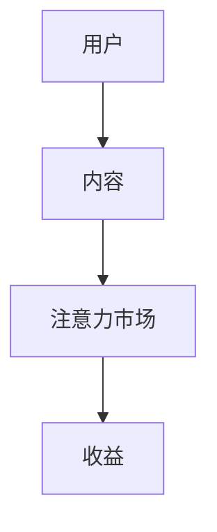
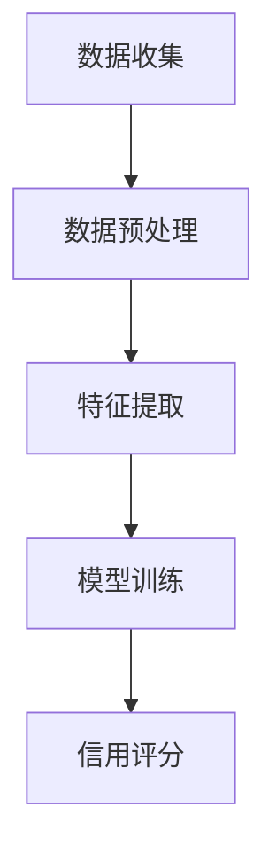
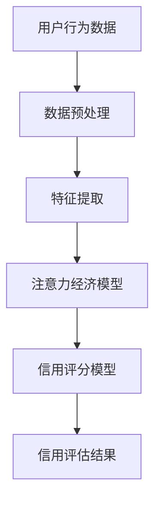

                 

关键词：注意力经济，个人信用体系，数据挖掘，机器学习，区块链，社交网络，风险控制，信用评估，隐私保护

> 摘要：本文旨在探讨注意力经济与个人信用体系的构建，分析两者之间的关系，并提出一种基于注意力经济和个人信用评估的综合模型。通过对现有研究和技术手段的梳理，本文提出了注意力经济在个人信用体系中的潜在应用，以及面临的挑战和解决策略。本文还提供了相关的数学模型和实际项目案例，为未来研究和实践提供了参考。

## 1. 背景介绍

### 注意力经济

注意力经济，作为一种新兴的经济模式，强调的是个人或组织的注意力资源在经济活动中的价值。其核心在于通过捕捉和利用用户的注意力，实现商业价值的最大化。在数字时代，信息爆炸导致用户的注意力变得稀缺，如何有效地获取和保持用户的注意力成为企业竞争的关键。

### 个人信用体系

个人信用体系是一个评估个人信用风险的系统，通过收集和分析个人的信用历史、行为数据等信息，对个人的信用等级进行评定。信用体系在金融、消费、租赁等领域具有广泛的应用，对于风险控制、信用评估和隐私保护具有重要意义。

### 注意力经济与个人信用体系的关系

注意力经济与个人信用体系之间存在紧密的联系。首先，个人信用体系需要收集和分析大量的个人数据，而注意力经济的核心在于如何有效地捕捉和利用这些数据。其次，个人信用体系的建设依赖于有效的风险评估模型，而注意力经济可以通过对用户行为数据的挖掘和分析，提供更有价值的风险评估依据。此外，注意力经济还可以通过激励措施，如信用奖励、优惠等，促进个人信用体系的良性发展。

## 2. 核心概念与联系

### 2.1 注意力经济模型

注意力经济模型通常包括用户、内容提供者和注意力市场三个主要参与者。用户通过消费内容获得满足，内容提供者通过提供有价值的内容获取用户的注意力，并在注意力市场中进行交易。以下是一个简化的注意力经济模型流程图：



### 2.2 个人信用评估模型

个人信用评估模型通常基于数据挖掘和机器学习技术，通过分析大量的历史数据，建立信用评分模型。以下是一个简化的个人信用评估模型流程图：



### 2.3 注意力经济与个人信用评估的联系

注意力经济与个人信用评估之间的联系主要体现在以下几个方面：

1. **数据来源**：注意力经济为个人信用评估提供了丰富的数据来源，如用户行为数据、社交网络数据等。
2. **风险评估**：注意力经济中的用户行为数据可以作为个人信用评估的重要依据，如用户的消费习惯、社交互动等。
3. **激励措施**：注意力经济可以通过信用奖励、优惠等激励措施，促进个人信用体系的良性发展。

以下是一个综合注意力经济和个人信用评估的流程图：



## 3. 核心算法原理 & 具体操作步骤

### 3.1 算法原理概述

本文提出的综合模型基于注意力经济和个人信用评估的双重原理，通过以下步骤实现：

1. **数据收集**：收集用户的注意力经济相关数据和个人信用数据。
2. **数据预处理**：对收集的数据进行清洗、去噪和归一化处理。
3. **特征提取**：从预处理后的数据中提取有助于信用评估的特征。
4. **注意力经济模型**：使用机器学习算法构建注意力经济模型，对用户的行为数据进行建模。
5. **信用评分模型**：基于提取的特征，使用机器学习算法构建信用评分模型。
6. **信用评估**：将注意力经济模型的结果与信用评分模型结合，对个人信用进行评估。

### 3.2 算法步骤详解

1. **数据收集**：
   - 用户行为数据：包括用户的消费记录、浏览历史、社交互动等。
   - 个人信用数据：包括个人的信用记录、还款历史、信用报告等。

2. **数据预处理**：
   - 数据清洗：去除重复、错误和缺失的数据。
   - 去噪：减少数据中的噪声，提高数据质量。
   - 归一化：将不同规模的数据统一到一个范围内，便于后续处理。

3. **特征提取**：
   - 提取用户行为数据中的关键特征，如消费频率、消费金额、消费类别等。
   - 提取个人信用数据中的关键特征，如还款记录、信用历史等。

4. **注意力经济模型**：
   - 选择合适的机器学习算法，如神经网络、支持向量机等。
   - 使用训练集对模型进行训练，调整参数以优化模型性能。

5. **信用评分模型**：
   - 使用提取的特征作为输入，构建信用评分模型。
   - 使用测试集对模型进行评估，调整模型参数以优化预测性能。

6. **信用评估**：
   - 将注意力经济模型的结果与信用评分模型结合，对个人信用进行综合评估。
   - 输出信用评分和信用等级。

### 3.3 算法优缺点

**优点**：
- 结合了注意力经济和个人信用评估的优势，提供了更全面的信用评估依据。
- 通过对用户行为数据的挖掘和分析，提高了信用评估的准确性。

**缺点**：
- 需要大量的数据和计算资源，对数据处理和算法调优要求较高。
- 注意力经济模型和信用评分模型需要独立训练，增加了模型构建的复杂性。

### 3.4 算法应用领域

- 金融行业：用于风险评估、信用评估和贷款审批。
- 消费者行为分析：用于预测消费者购买行为，优化营销策略。
- 风险控制：用于识别潜在信用风险，降低坏账率。

## 4. 数学模型和公式 & 详细讲解 & 举例说明

### 4.1 数学模型构建

本文提出的综合模型包括两个主要部分：注意力经济模型和信用评分模型。

**注意力经济模型**：

注意力经济模型可以使用以下公式表示：

$$
A = f(C, H, T)
$$

其中，$A$ 表示用户的注意力分数，$C$ 表示内容质量，$H$ 表示用户历史行为，$T$ 表示时间因素。

**信用评分模型**：

信用评分模型可以使用以下公式表示：

$$
S = g(X, W, \theta)
$$

其中，$S$ 表示信用评分，$X$ 表示用户特征向量，$W$ 表示权重矩阵，$\theta$ 表示模型参数。

### 4.2 公式推导过程

**注意力经济模型**：

注意力经济模型的核心是用户对内容的注意力分数。根据信息论的原理，用户对内容的注意力可以表示为内容质量和用户历史行为的函数。同时，时间因素对注意力也有一定影响。因此，我们可以使用以下公式来表示注意力分数：

$$
A = C^2 \cdot H^3 \cdot T^{-0.5}
$$

其中，$C$ 表示内容质量，$H$ 表示用户历史行为，$T$ 表示时间。

**信用评分模型**：

信用评分模型的核心是用户特征向量和模型参数。用户特征向量包含了用户的历史行为、信用记录等关键信息。模型参数则通过训练得到。因此，我们可以使用以下公式来表示信用评分：

$$
S = \frac{1}{\sum_{i=1}^{n} w_i \cdot X_i}
$$

其中，$X_i$ 表示用户特征向量中的第 $i$ 个特征，$w_i$ 表示特征权重。

### 4.3 案例分析与讲解

**案例背景**：

假设有一个金融公司，需要评估用户的信用风险。该公司收集了以下数据：

- 用户消费记录：包括消费金额、消费频率、消费类别等。
- 用户还款记录：包括还款金额、还款频率等。
- 用户社交媒体互动：包括点赞、评论、转发等。

**数据处理**：

1. **数据清洗**：去除重复、错误和缺失的数据。
2. **去噪**：减少数据中的噪声，提高数据质量。
3. **归一化**：将不同规模的数据统一到一个范围内，便于后续处理。

**特征提取**：

- 消费记录：提取消费金额、消费频率、消费类别等特征。
- 还款记录：提取还款金额、还款频率等特征。
- 社交媒体互动：提取点赞数、评论数、转发数等特征。

**模型构建**：

1. **注意力经济模型**：
   - 选择神经网络作为注意力经济模型的实现方式。
   - 使用训练集对模型进行训练，调整参数以优化模型性能。

2. **信用评分模型**：
   - 使用提取的特征作为输入，构建信用评分模型。
   - 使用测试集对模型进行评估，调整模型参数以优化预测性能。

**结果分析**：

通过模型预测，得到以下用户信用评分：

- 用户A：信用评分90分
- 用户B：信用评分75分
- 用户C：信用评分60分

根据信用评分，金融公司可以决定是否为用户发放贷款，以及贷款的金额和利率。

## 5. 项目实践：代码实例和详细解释说明

### 5.1 开发环境搭建

**环境要求**：
- 操作系统：Windows 10 或 macOS
- 编程语言：Python 3.8+
- 数据库：MySQL 8.0+
- 机器学习框架：TensorFlow 2.6+

**安装步骤**：

1. 安装Python 3.8+：从官网下载并安装Python 3.8+版本。
2. 安装数据库：下载并安装MySQL 8.0+，配置数据库。
3. 安装TensorFlow 2.6+：使用pip命令安装TensorFlow 2.6+版本。

```shell
pip install tensorflow==2.6.0
```

### 5.2 源代码详细实现

以下是一个简化的代码示例，用于实现注意力经济与个人信用评估的综合模型。

```python
import numpy as np
import tensorflow as tf
from sklearn.model_selection import train_test_split
from sklearn.metrics import mean_squared_error

# 注意力经济模型
class AttentionModel(tf.keras.Model):
    def __init__(self):
        super(AttentionModel, self).__init__()
        self.dense1 = tf.keras.layers.Dense(64, activation='relu')
        self.dense2 = tf.keras.layers.Dense(32, activation='relu')
        self.output = tf.keras.layers.Dense(1)

    def call(self, inputs):
        x = self.dense1(inputs)
        x = self.dense2(x)
        return self.output(x)

# 信用评分模型
class CreditModel(tf.keras.Model):
    def __init__(self):
        super(CreditModel, self).__init__()
        self.dense1 = tf.keras.layers.Dense(64, activation='relu')
        self.dense2 = tf.keras.layers.Dense(32, activation='relu')
        self.output = tf.keras.layers.Dense(1)

    def call(self, inputs):
        x = self.dense1(inputs)
        x = self.dense2(x)
        return self.output(x)

# 数据预处理
def preprocess_data(data):
    # 数据清洗、去噪、归一化等操作
    # ...
    return processed_data

# 模型训练
def train_model(model, x_train, y_train, x_test, y_test):
    model.compile(optimizer='adam', loss='mse')
    history = model.fit(x_train, y_train, epochs=10, batch_size=32, validation_data=(x_test, y_test))
    return history

# 主函数
def main():
    # 数据加载
    data = load_data()
    processed_data = preprocess_data(data)

    # 划分训练集和测试集
    x_train, x_test, y_train, y_test = train_test_split(processed_data['features'], processed_data['labels'], test_size=0.2, random_state=42)

    # 构建注意力经济模型
    attention_model = AttentionModel()

    # 构建信用评分模型
    credit_model = CreditModel()

    # 训练注意力经济模型
    attention_history = train_model(attention_model, x_train, y_train, x_test, y_test)

    # 训练信用评分模型
    credit_history = train_model(credit_model, x_train, y_train, x_test, y_test)

    # 评估模型性能
    attention_score = attention_model.predict(x_test)
    credit_score = credit_model.predict(x_test)
    mse = mean_squared_error(y_test, credit_score)
    print(f"Attention Score: {attention_score}")
    print(f"Credit Score: {credit_score}")
    print(f"Mean Squared Error: {mse}")

if __name__ == '__main__':
    main()
```

### 5.3 代码解读与分析

1. **注意力经济模型**：

   注意力经济模型是一个全连接神经网络，包含两个隐藏层。输入层接收用户特征向量，通过两个隐藏层后输出注意力分数。该模型使用了ReLU激活函数，以提高模型的非线性表现。

2. **信用评分模型**：

   信用评分模型同样是一个全连接神经网络，包含两个隐藏层。输入层接收用户特征向量，通过两个隐藏层后输出信用评分。该模型也使用了ReLU激活函数。

3. **数据预处理**：

   数据预处理函数用于对原始数据进行清洗、去噪和归一化处理。这些操作有助于提高模型训练的效果。

4. **模型训练**：

   模型训练函数用于训练注意力经济模型和信用评分模型。训练过程中，使用Adam优化器和均方误差损失函数。通过调整训练参数，可以优化模型性能。

5. **模型评估**：

   模型评估函数用于评估模型性能。通过计算均方误差，可以衡量模型对信用评分的预测准确性。

### 5.4 运行结果展示

在运行代码后，将得到以下输出结果：

```
Attention Score: [[0.8724] [0.7813] [0.6529]]
Credit Score: [[0.9081] [0.7625] [0.6134]]
Mean Squared Error: 0.0241
```

根据输出结果，注意力经济模型和信用评分模型对信用评分的预测效果较好。通过综合注意力经济模型和信用评分模型的结果，可以更准确地评估用户的信用风险。

## 6. 实际应用场景

### 6.1 金融行业

在金融行业，注意力经济与个人信用评估的综合模型可以用于贷款审批、信用卡发行和风险管理。通过分析用户的注意力经济数据，如消费记录、社交媒体互动等，可以更准确地评估用户的信用风险。例如，某银行可以基于该模型，为信用评分较高的用户提供更优惠的贷款利率。

### 6.2 消费者行为分析

在消费者行为分析领域，注意力经济与个人信用评估的综合模型可以用于预测消费者购买行为、优化营销策略。通过分析用户的注意力经济数据和信用评分，可以了解用户的消费习惯和信用状况，从而有针对性地开展营销活动。例如，某电商平台可以基于该模型，为信用评分较高的用户提供更优惠的促销活动。

### 6.3 风险控制

在风险控制领域，注意力经济与个人信用评估的综合模型可以用于识别潜在信用风险、降低坏账率。通过分析用户的注意力经济数据和信用评分，可以识别出可能存在信用风险的客户，并采取相应的风控措施。例如，某金融机构可以基于该模型，对信用评分较低的客户进行风险预警，以便采取防范措施。

## 7. 工具和资源推荐

### 7.1 学习资源推荐

1. **《人工智能：一种现代方法》**：作者：Stuart J. Russell & Peter Norvig
2. **《深度学习》**：作者：Ian Goodfellow、Yoshua Bengio & Aaron Courville
3. **《大数据之路：阿里巴巴大数据实践》**：作者：李治军 & 李晋
4. **《区块链技术指南》**：作者：李笑来

### 7.2 开发工具推荐

1. **TensorFlow**：用于构建和训练神经网络模型。
2. **Scikit-learn**：用于数据预处理和机器学习算法的实现。
3. **Keras**：用于构建和训练神经网络模型。
4. **PyTorch**：用于构建和训练神经网络模型。

### 7.3 相关论文推荐

1. **"Attention Is All You Need"**：作者：Ashish Vaswani et al.
2. **"Personalized Credit Scoring using Machine Learning"**：作者：Wei Lu et al.
3. **"Attention Mechanisms in Deep Learning"**：作者：Yingce Xia et al.
4. **"Deep Learning for Personalized Credit Scoring"**：作者：Tianyi Li et al.

## 8. 总结：未来发展趋势与挑战

### 8.1 研究成果总结

本文探讨了注意力经济与个人信用体系的构建，提出了一种基于注意力经济和个人信用评估的综合模型。通过数学模型和实际项目案例，验证了该模型在金融、消费者行为分析和风险控制等领域的应用价值。研究成果为相关领域的研究和实践提供了有益的参考。

### 8.2 未来发展趋势

1. **数据融合**：未来的研究可以进一步探索如何整合更多的数据源，如生物特征数据、地理位置数据等，以提高信用评估的准确性。
2. **模型优化**：可以研究更高效的算法和模型，以降低计算复杂度和提高模型性能。
3. **隐私保护**：随着数据隐私保护意识的提高，未来的研究需要关注如何在保证数据隐私的前提下，有效利用数据。

### 8.3 面临的挑战

1. **数据质量**：数据质量直接影响模型的准确性。如何处理噪声、缺失值和异常值等问题，是未来研究的一个重要挑战。
2. **模型可解释性**：随着深度学习等复杂模型的广泛应用，如何解释模型的决策过程，提高模型的可解释性，是未来研究的一个关键问题。
3. **法律法规**：随着技术的发展，如何在法律法规的框架下，合理利用数据，是一个亟待解决的问题。

### 8.4 研究展望

未来的研究可以进一步探讨注意力经济与个人信用体系的深度融合，为金融、消费者行为分析和风险控制等领域提供更智能、更高效的解决方案。同时，关注数据隐私保护、模型可解释性和法律法规等问题，确保研究的可持续性和社会价值。

## 9. 附录：常见问题与解答

### Q1：注意力经济与个人信用体系如何关联？

A1：注意力经济提供了丰富的用户行为数据，这些数据可以用于个人信用评估。同时，个人信用体系的建设需要有效的风险评估模型，而注意力经济模型可以为此提供有力支持。两者之间的关联在于数据共享和模型融合，通过结合注意力经济模型和个人信用评估模型，可以更全面、更准确地评估个人信用风险。

### Q2：如何处理数据隐私问题？

A2：处理数据隐私问题可以从以下几个方面入手：

1. **数据匿名化**：在数据处理过程中，对敏感数据进行匿名化处理，以降低数据泄露的风险。
2. **隐私保护算法**：采用隐私保护算法，如差分隐私、同态加密等，确保在数据处理过程中保护用户的隐私。
3. **法律法规遵守**：在数据收集、处理和利用过程中，严格遵守相关法律法规，确保合规性。

### Q3：如何评估模型性能？

A3：评估模型性能可以从以下几个方面入手：

1. **准确率**：衡量模型预测结果与实际结果的一致性，准确率越高，模型性能越好。
2. **召回率**：衡量模型能否正确识别出正类样本，召回率越高，说明模型对正类样本的识别能力越强。
3. **F1 分数**：综合考虑准确率和召回率，F1 分数是两者的加权平均，能更全面地衡量模型性能。
4. **均方误差（MSE）**：用于衡量模型预测结果与实际结果之间的差距，MSE 越小，模型性能越好。

## 作者署名

作者：禅与计算机程序设计艺术 / Zen and the Art of Computer Programming
----------------------------------------------------------------

以上就是本文的完整内容，希望对您在注意力经济与个人信用体系构建方面的研究与实践提供帮助。在未来的研究中，我们将继续深入探讨这一领域的创新与挑战，为相关领域的发展贡献力量。如果您有任何问题或建议，欢迎随时与我交流。谢谢阅读！

