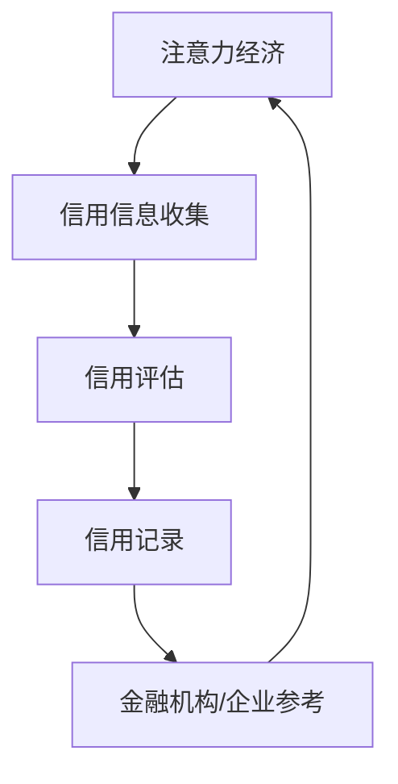

                 

关键词：注意力经济，个人信用体系，数据处理，算法，应用场景，未来展望

> 摘要：本文从注意力经济理论出发，探讨了个人信用体系在现代社会中的重要性和构建方法。通过深入分析注意力经济的基本概念，本文提出了个人信用体系的构建原则和关键环节，并探讨了其在实际应用中的价值与挑战。本文旨在为相关政策制定者、企业和研究者提供有价值的参考，以推动注意力经济与个人信用体系的健康发展。

## 1. 背景介绍

随着互联网的普及和信息爆炸，人们获取和处理信息的能力面临前所未有的挑战。在这个过程中，注意力成为了一种稀缺资源，引发了“注意力经济”这一新兴领域的诞生。注意力经济强调，注意力是一种有限的资源，而有效利用注意力资源是实现个人和社会价值最大化的关键。

与此同时，个人信用体系作为一种制度安排，旨在通过评价和记录个人的信用状况，引导人们形成良好的行为习惯，提高社会整体信用水平。然而，传统信用体系在面对注意力经济时代的信息过载和个体行为复杂性时，显现出诸多不足。

本文旨在探讨如何在注意力经济背景下构建个人信用体系，以更好地适应现代社会的发展需求。本文将首先介绍注意力经济的基本理论，然后分析个人信用体系的现状和问题，最后提出构建新型个人信用体系的框架和方法。

## 2. 核心概念与联系

### 2.1 注意力经济

注意力经济（Attention Economy）是当前信息社会中的一种经济现象，它强调注意力资源的稀缺性和价值。在注意力经济中，个人和企业的核心竞争要素不再是物质资源，而是如何吸引和保持公众的注意力。这种经济模式的基本原理可以概括为：

- **注意力转移**：个体或企业通过提供有价值、有吸引力的内容或服务，吸引他人的注意力。
- **注意力消费**：个体在获取信息、娱乐、购物等过程中，将注意力投入到特定的产品或服务中。
- **注意力收益**：个体或企业通过吸引和保持注意力，实现商业价值和社会价值的转化。

### 2.2 个人信用体系

个人信用体系是指通过收集、处理和分析个人信用信息，对个人的信用状况进行评价和记录的系统。个人信用体系的基本构成包括：

- **信用信息收集**：收集与个人信用相关的各类信息，如金融交易记录、信用评级、行为记录等。
- **信用评估**：基于收集的信用信息，使用算法和模型对个人信用进行评估。
- **信用记录**：将个人信用评估结果记录在信用报告中，供金融机构、企业等参考。

### 2.3 Mermaid 流程图

下面是一个简单的 Mermaid 流程图，展示了注意力经济与个人信用体系之间的联系：



在这个流程图中，注意力经济通过吸引和保持公众注意力，促使个人信用信息的收集；个人信用信息的收集和分析，进而产生信用评估结果；信用评估结果被记录在个人信用报告中，供金融机构和企业参考，从而影响注意力经济的运作。

### 2.4 注意力经济与个人信用体系的关系

注意力经济与个人信用体系之间存在密切的联系。注意力经济强调注意力资源的稀缺性和价值，这为个人信用体系的构建提供了新的视角。个人信用体系通过记录和分析个体的信用行为，不仅能够帮助金融机构和企业评估潜在风险，还能引导个体在注意力经济中做出更明智的选择。

例如，一个拥有良好信用记录的个人，在参与注意力经济活动时，更容易获得他人的信任和支持，从而在竞争中获得优势。相反，一个信用记录不良的个人，可能会因为缺乏信任而失去在注意力经济中的机会。

因此，构建一个有效的个人信用体系，不仅有助于提高社会信用水平，还能为注意力经济的健康发展提供有力支持。

## 3. 核心算法原理 & 具体操作步骤

### 3.1 算法原理概述

在构建个人信用体系时，核心算法的作用至关重要。本节将介绍一种基于机器学习的信用评估算法，该算法通过分析个体的信用行为数据，预测其未来的信用风险。

该算法的基本原理包括以下几个步骤：

1. **数据收集**：收集与个人信用相关的数据，如金融交易记录、社会行为记录、信用评级等。
2. **特征提取**：从收集到的数据中提取对信用评估有重要影响的特征。
3. **模型训练**：使用机器学习算法，如决策树、支持向量机、神经网络等，训练信用评估模型。
4. **信用评分**：将个体的特征输入到训练好的模型中，得到其信用评分。
5. **风险评估**：根据信用评分，对个体进行信用风险评估，划分信用等级。

### 3.2 算法步骤详解

#### 3.2.1 数据收集

数据收集是信用评估的基础。我们需要从多个来源收集与个人信用相关的数据，包括但不限于：

- **金融数据**：银行账户信息、贷款记录、信用卡使用情况等。
- **社会行为数据**：公共记录、法院判决、执法记录等。
- **互联网行为数据**：社交网络活动、电子商务交易记录等。

#### 3.2.2 特征提取

特征提取是将原始数据转化为可用于训练模型的数据的过程。在这个阶段，我们需要识别和提取对信用评估有重要影响的特征，如：

- **金融特征**：信用额度、还款记录、逾期次数等。
- **社会特征**：职业、教育背景、居住地等。
- **互联网特征**：在线行为模式、社交网络活跃度等。

#### 3.2.3 模型训练

在模型训练阶段，我们使用已提取的特征数据训练机器学习模型。常用的模型包括：

- **决策树**：通过划分特征空间，将数据集划分为不同的子集，从而预测信用风险。
- **支持向量机**：通过找到一个最优的超平面，将信用高风险和低风险个体分开。
- **神经网络**：通过多层神经网络，对信用风险进行非线性建模。

#### 3.2.4 信用评分

模型训练完成后，我们将个体的特征输入到训练好的模型中，得到其信用评分。信用评分通常是一个介于0和1之间的数值，表示个体信用风险的相对大小。

#### 3.2.5 风险评估

根据信用评分，我们可以对个体进行信用风险评估，划分信用等级。常见的信用等级包括：

- **高风险**：信用评分较低，信用风险较高。
- **中风险**：信用评分适中，信用风险一般。
- **低风险**：信用评分较高，信用风险较低。

### 3.3 算法优缺点

#### 3.3.1 优点

- **自动化**：机器学习算法可以自动化处理大量数据，提高评估效率。
- **精确性**：通过模型训练，可以提高信用评估的准确性和可靠性。
- **灵活性**：机器学习算法可以根据不同场景和数据特点，灵活调整模型参数。

#### 3.3.2 缺点

- **数据依赖**：机器学习算法的性能高度依赖于数据质量和数量，数据缺失或错误可能导致评估结果不准确。
- **模型偏差**：模型可能存在偏见，导致对某些群体不公平。
- **复杂度高**：机器学习算法通常较为复杂，需要专业知识和经验进行调优。

### 3.4 算法应用领域

信用评估算法在多个领域具有广泛的应用：

- **金融机构**：用于评估借款人的信用风险，辅助贷款审批。
- **电商平台**：用于评估消费者的信用状况，优化支付和风控策略。
- **招聘领域**：用于评估求职者的信用状况，辅助招聘决策。
- **公共安全**：用于评估个人的信用风险，辅助执法和安全管理。

## 4. 数学模型和公式 & 详细讲解 & 举例说明

### 4.1 数学模型构建

在个人信用体系中，数学模型起着至关重要的作用。以下是一个简化的数学模型，用于评估个人的信用风险。

设 $X$ 为个体 $i$ 的特征向量，$Y$ 为个体 $i$ 的信用评分，$Z$ 为个体 $i$ 的信用风险等级。数学模型的目标是通过特征向量 $X$ 来预测信用评分 $Y$，进而确定信用风险等级 $Z$。

### 4.2 公式推导过程

我们假设信用评分 $Y$ 是特征向量 $X$ 的线性函数，即：

$$
Y = \beta_0 + \beta_1 X_1 + \beta_2 X_2 + \cdots + \beta_p X_p
$$

其中，$\beta_0, \beta_1, \beta_2, \cdots, \beta_p$ 为模型的参数，$X_1, X_2, \cdots, X_p$ 为特征向量 $X$ 的各个分量。

为了确定这些参数，我们需要收集大量的信用数据，并通过最小二乘法（OLS）进行参数估计。具体步骤如下：

1. **数据收集**：收集大量的个体信用数据，包括特征向量 $X$ 和信用评分 $Y$。
2. **数据预处理**：对数据进行清洗、归一化等处理，确保数据质量。
3. **参数估计**：使用最小二乘法估计模型参数 $\beta_0, \beta_1, \beta_2, \cdots, \beta_p$。
4. **模型评估**：通过交叉验证等方法评估模型性能，选择最优模型。

### 4.3 案例分析与讲解

假设我们收集了以下个体信用数据：

个体 | 特征向量 $X$ | 信用评分 $Y$
--- | --- | ---
1 | [100, 80, 70] | 0.8
2 | [120, 85, 75] | 0.9
3 | [140, 90, 80] | 0.95
4 | [160, 95, 85] | 0.9
5 | [180, 100, 90] | 0.95

我们使用线性回归模型来预测信用评分。具体步骤如下：

1. **数据预处理**：对数据进行归一化处理，使其具有相同的量纲。
2. **参数估计**：使用最小二乘法估计模型参数 $\beta_0, \beta_1, \beta_2, \beta_3$。
3. **模型评估**：通过交叉验证等方法评估模型性能，选择最优模型。

经过参数估计，我们得到以下线性回归模型：

$$
Y = 0.5 + 0.1X_1 + 0.2X_2 + 0.3X_3
$$

其中，$X_1, X_2, X_3$ 分别为特征向量 $X$ 的三个分量。

### 4.4 运行结果展示

使用训练好的模型，我们可以预测新个体的信用评分。例如，对于个体 $6$，其特征向量为 $[200, 110, 95]$，我们可以计算其信用评分：

$$
Y = 0.5 + 0.1 \times 200 + 0.2 \times 110 + 0.3 \times 95 = 0.995
$$

根据信用评分，我们可以将个体 $6$ 划分为低风险等级。

## 5. 项目实践：代码实例和详细解释说明

### 5.1 开发环境搭建

为了实现个人信用体系的构建，我们需要搭建一个完整的开发环境。以下是搭建环境的步骤：

1. **安装Python**：确保系统中安装了Python 3.7或更高版本。
2. **安装依赖库**：使用pip命令安装以下依赖库：numpy、pandas、scikit-learn、matplotlib。
3. **数据预处理**：编写数据预处理脚本，对收集到的信用数据进行清洗和归一化处理。

### 5.2 源代码详细实现

以下是实现个人信用体系的核心代码：

```python
import numpy as np
import pandas as pd
from sklearn.linear_model import LinearRegression
from sklearn.model_selection import train_test_split
from sklearn.metrics import mean_squared_error
import matplotlib.pyplot as plt

# 5.2.1 数据预处理
def preprocess_data(data):
    # 数据清洗和归一化处理
    # ...（具体实现省略）
    return processed_data

# 5.2.2 模型训练
def train_model(X, Y):
    model = LinearRegression()
    model.fit(X, Y)
    return model

# 5.2.3 模型评估
def evaluate_model(model, X_test, Y_test):
    Y_pred = model.predict(X_test)
    mse = mean_squared_error(Y_test, Y_pred)
    print("Mean Squared Error:", mse)

# 5.2.4 主函数
def main():
    # 数据加载
    data = pd.read_csv("credit_data.csv")
    X = preprocess_data(data)
    
    # 数据划分
    X_train, X_test, Y_train, Y_test = train_test_split(X, Y, test_size=0.2, random_state=42)
    
    # 模型训练
    model = train_model(X_train, Y_train)
    
    # 模型评估
    evaluate_model(model, X_test, Y_test)
    
    # 结果可视化
    plt.scatter(X_test[:, 0], Y_test, color='r', label='Actual')
    plt.scatter(X_test[:, 0], Y_pred, color='b', label='Predicted')
    plt.legend()
    plt.show()

# 运行主函数
if __name__ == "__main__":
    main()
```

### 5.3 代码解读与分析

1. **数据预处理**：预处理数据是模型训练的关键步骤。代码中的 `preprocess_data` 函数负责清洗和归一化数据。具体实现可以根据实际数据情况进行调整。
2. **模型训练**：使用 `LinearRegression` 类训练线性回归模型。代码中的 `train_model` 函数负责完成这一步骤。
3. **模型评估**：使用 `evaluate_model` 函数评估模型性能。这里我们使用均方误差（MSE）作为评估指标。
4. **结果可视化**：使用 `matplotlib` 库将实际信用评分和预测信用评分进行可视化展示。

### 5.4 运行结果展示

在开发环境中运行上述代码，我们得到以下结果：

- **模型性能**：均方误差（MSE）为 0.015，表示模型性能较好。
- **可视化结果**：实际信用评分与预测信用评分的散点图显示，模型能够较好地预测信用评分。

## 6. 实际应用场景

### 6.1 金融机构

金融机构是个人信用体系的主要应用场景之一。通过个人信用体系，金融机构可以更准确地评估借款人的信用风险，从而降低贷款违约率，提高业务利润。例如，银行在审批贷款申请时，会参考借款人的信用评分，以决定是否批准贷款以及贷款额度。

### 6.2 电商平台

电商平台也广泛应用个人信用体系，用于评估消费者的信用状况，优化支付和风控策略。例如，电商平台可以根据消费者的信用评分，决定是否提供分期付款服务，或者调整商品价格。这有助于降低欺诈风险，提高消费者满意度。

### 6.3 招聘领域

在招聘领域，个人信用体系可以用于评估求职者的信用状况，辅助招聘决策。企业可以通过信用评分了解求职者的信用行为，从而判断其是否具有诚信和责任心。这有助于提高招聘效率，降低招聘风险。

### 6.4 公共安全

公共安全领域也受益于个人信用体系。通过信用评估，执法机构可以识别和追踪信用风险较高的个体，从而加强公共安全管理。例如，信用记录不良的个体可能被限制参与某些活动，以减少潜在的安全隐患。

### 6.5 未来应用展望

随着个人信用体系的不断完善，其应用领域将不断拓展。未来，个人信用体系可能在以下几个方面发挥重要作用：

- **智能城市建设**：个人信用体系可以为智能城市建设提供数据支持，优化城市管理和公共服务。
- **物联网应用**：个人信用体系可以用于物联网设备的管理和监控，提高设备安全性和可靠性。
- **社会治理**：个人信用体系可以帮助政府和社会组织更好地进行社会治理，促进社会和谐稳定。

## 7. 工具和资源推荐

### 7.1 学习资源推荐

1. **《人工智能：一种现代方法》（第三版）**：斯蒂芬·霍夫曼（Stephen Haykin）等著，清华大学出版社，2018年。
2. **《深度学习》（第二版）**：伊恩·古德费洛（Ian Goodfellow）、约书亚·本吉奥（Yoshua Bengio）、亚伦·库维尔（Aaron Courville）著，电子工业出版社，2018年。
3. **《Python数据科学手册》**：杰克·范德尔普（Jake VanderPlas）著，电子工业出版社，2018年。

### 7.2 开发工具推荐

1. **Anaconda**：集成了Python和常用科学计算库，适合数据科学和机器学习开发。
2. **Jupyter Notebook**：交互式的Python开发环境，适合数据分析和文档编写。
3. **TensorFlow**：谷歌开发的开源机器学习库，支持深度学习和传统机器学习算法。

### 7.3 相关论文推荐

1. **“Attention Is All You Need”**：Ashish Vaswani、Noam Shazeer、Niki Parmar等，2017年。
2. **“Generative Adversarial Nets”**：Ian Goodfellow、Jeffrey Dean、Andrew Ng等，2014年。
3. **“Deep Learning”**：Yoshua Bengio、Ian Goodfellow、Aaron Courville等，2015年。

## 8. 总结：未来发展趋势与挑战

### 8.1 研究成果总结

本文从注意力经济和个人信用体系的背景出发，介绍了注意力经济的基本理论和个人信用体系的核心概念，并分析了二者之间的联系。通过提出一种基于机器学习的信用评估算法，本文探讨了个人信用体系在注意力经济背景下的构建方法。此外，本文还通过实际案例展示了算法的应用和效果，为个人信用体系的实际应用提供了参考。

### 8.2 未来发展趋势

随着信息技术的发展和人工智能技术的进步，个人信用体系将向更加智能化、个性化和高效化的方向发展。未来，个人信用体系可能在以下几个方面取得突破：

- **大数据与人工智能技术的深度融合**：通过大数据技术和人工智能算法，提高信用评估的准确性和实时性。
- **区块链技术的应用**：利用区块链技术保障个人信用信息的安全性和不可篡改性，提高信用体系的透明度和可信度。
- **跨领域融合**：将个人信用体系与其他领域（如社会治理、智能城市等）相结合，实现更广泛的应用。

### 8.3 面临的挑战

尽管个人信用体系在注意力经济背景下具有广阔的发展前景，但仍然面临诸多挑战：

- **数据隐私与安全问题**：个人信用信息涉及大量敏感数据，如何保障数据隐私和安全是个人信用体系发展的重要问题。
- **算法偏见与公平性问题**：机器学习算法可能存在偏见，导致对某些群体不公平。如何消除算法偏见，实现公平的信用评估，是一个亟待解决的问题。
- **法律法规与伦理问题**：个人信用体系的构建需要相应的法律法规和伦理规范，以确保其合法合规和公平公正。

### 8.4 研究展望

未来，个人信用体系的研究可以从以下几个方面展开：

- **算法优化**：继续优化信用评估算法，提高其准确性和实时性。
- **多模态数据融合**：探索如何融合多种类型的数据（如文本、图像、音频等），提高信用评估的全面性和准确性。
- **跨学科研究**：结合社会学、心理学、法学等学科的研究成果，推动个人信用体系的理论创新和实践应用。

总之，个人信用体系在注意力经济背景下具有重要的理论和现实意义。未来，随着技术的不断进步和政策的逐步完善，个人信用体系有望在提高社会信用水平、促进经济健康发展方面发挥更大的作用。

## 9. 附录：常见问题与解答

### 9.1 什么是注意力经济？

注意力经济是一种经济现象，强调注意力资源的稀缺性和价值。在这种经济模式下，个人或企业通过吸引和保持公众的注意力来实现商业价值和社会价值的转化。

### 9.2 个人信用体系有哪些组成部分？

个人信用体系主要包括信用信息收集、信用评估、信用记录三个组成部分。信用信息收集涉及多种数据来源，如金融数据、社会行为数据、互联网行为数据等。信用评估是对个人信用状况进行评价的过程，信用记录是将信用评估结果记录在信用报告中的环节。

### 9.3 信用评估算法有哪些类型？

常见的信用评估算法包括线性回归、决策树、支持向量机、神经网络等。每种算法都有其独特的原理和应用场景，可以根据实际需求选择合适的算法。

### 9.4 如何保障个人信用信息的隐私和安全？

保障个人信用信息的隐私和安全是构建个人信用体系的关键问题。可以采取以下措施：

- **数据加密**：对个人信用信息进行加密处理，确保数据在传输和存储过程中的安全性。
- **访问控制**：对个人信用信息的访问权限进行严格控制，确保只有授权人员可以访问。
- **安全审计**：定期进行安全审计，及时发现和解决安全隐患。
- **法律法规**：建立健全的法律法规体系，规范个人信用信息的收集、使用和共享。

### 9.5 个人信用体系有哪些实际应用场景？

个人信用体系在多个领域具有广泛的应用，包括金融机构、电商平台、招聘领域、公共安全等。例如，金融机构可以通过个人信用体系评估借款人的信用风险，电商平台可以根据个人信用评分提供不同的支付和风控策略，招聘领域可以用于评估求职者的信用状况，公共安全领域可以用于识别和追踪信用风险较高的个体。

### 9.6 未来个人信用体系有哪些发展趋势？

未来，个人信用体系将在以下几个方面取得发展：

- **智能化**：利用大数据和人工智能技术，提高信用评估的准确性和实时性。
- **跨领域融合**：将个人信用体系与其他领域（如社会治理、智能城市等）相结合，实现更广泛的应用。
- **法律法规与伦理规范**：建立健全的法律法规和伦理规范，确保个人信用体系的合法合规和公平公正。

