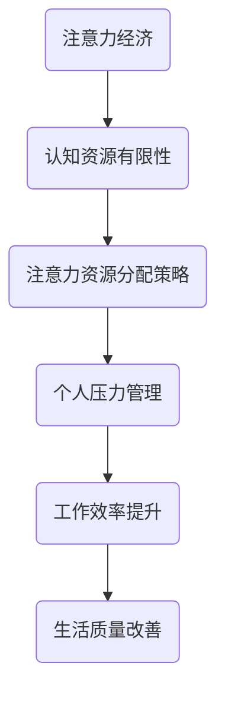

                 

关键词：注意力经济，个人压力管理，认知资源，生产力，行为经济学，决策优化。

> 摘要：本文探讨了注意力经济与个人压力管理之间的关系，分析了在信息技术时代下，如何通过优化注意力资源配置来减轻个人压力，提高工作效率和生活质量。文章结合行为经济学理论和实际应用，提供了系统化的方法和工具，以帮助个人在快节奏的生活中实现注意力资源的最大化利用，从而实现压力的有效管理和生产力的提升。

## 1. 背景介绍

### 1.1 注意力经济的基本概念

注意力经济是指在经济活动中，注意力作为一种稀缺资源进行分配和利用的经济学理论。在信息爆炸的时代，人们对信息的关注度和处理能力有限，因此，获取他人的注意力成为了一种重要的资源和策略。

### 1.2 个人压力管理的现状

随着工作节奏的加快和压力的增大，个人压力管理成为了一个不容忽视的问题。长期的压力不仅影响个人的身体健康，还会影响工作效率和生活质量。

## 2. 核心概念与联系

### 2.1 注意力资源的分配与效率

注意力资源是个人处理信息和做出决策的能力。其分配和利用效率直接影响个人的压力水平和生产力。因此，优化注意力资源的分配成为压力管理的重要一环。

### 2.2 注意力经济的理论模型

#### 2.2.1 认知资源的有限性

认知资源理论指出，人的认知能力是有限的，注意力资源的分配和使用必须合理，以避免过度消耗。

#### 2.2.2 注意力分配的优化策略

通过行为经济学的方法，如时间管理、目标设定和优先级排序，可以优化注意力资源的分配。

### 2.3 注意力经济与个人压力管理的关系图



## 3. 核心算法原理 & 具体操作步骤

### 3.1 算法原理概述

基于注意力经济的个人压力管理算法主要包括以下几个步骤：

1. **认知资源评估**：通过自我评估和工具检测，了解个人的认知资源状态。
2. **目标设定**：根据工作生活需求，设定短期和长期目标。
3. **优先级排序**：根据目标的紧急性和重要性，对任务进行优先级排序。
4. **注意力分配**：根据优先级，合理分配注意力资源。
5. **反馈调整**：根据执行情况和效果，调整目标设定和注意力分配策略。

### 3.2 算法步骤详解

#### 3.2.1 认知资源评估

1. **自我评估**：反思平时的注意力分散情况和任务执行效果。
2. **工具检测**：使用注意力监测工具，如专注力训练应用，了解注意力波动情况。

#### 3.2.2 目标设定

1. **SMART原则**：确保目标具备具体性（Specific）、可测量性（Measurable）、可实现性（Achievable）、相关性（Relevant）和时限性（Time-bound）。
2. **任务分解**：将大目标分解为小任务，便于管理。

#### 3.2.3 优先级排序

1. **紧急-重要性矩阵**：将任务分为四个象限，分别对应紧急且重要、紧急但不重要、不紧急但重要和不紧急且不重要。
2. **重点资源分配**：优先分配注意力资源给紧急且重要的任务。

#### 3.2.4 注意力分配

1. **时间块法**：将工作时间划分为不同的时间块，每个时间块专注于一个任务。
2. **番茄工作法**：每25分钟专注工作，然后休息5分钟。

#### 3.2.5 反馈调整

1. **定期回顾**：每周或每月回顾目标完成情况和注意力分配效果。
2. **调整策略**：根据实际情况，调整目标和注意力分配策略。

### 3.3 算法优缺点

#### 3.3.1 优点

1. **提高生产力**：通过优化注意力资源，提高工作质量和效率。
2. **减轻压力**：合理分配注意力，减少过度消耗，减轻压力。

#### 3.3.2 缺点

1. **初始投入时间**：制定和执行策略需要一定的时间和努力。
2. **灵活性挑战**：在突发情况下，需要快速调整策略，可能存在一定的难度。

### 3.4 算法应用领域

1. **企业员工管理**：通过培训和管理，帮助员工优化注意力资源，提高工作效率。
2. **个人压力管理**：通过自我管理和调整，实现个人压力的有效管理。
3. **教育领域**：通过教学方法的优化，帮助学生更好地管理注意力，提高学习效果。

## 4. 数学模型和公式 & 详细讲解 & 举例说明

### 4.1 数学模型构建

个人压力管理模型可以构建为一个多目标优化问题，其中目标函数包括压力水平、工作效率和生活质量。

### 4.2 公式推导过程

假设 \( P \) 为生产力，\( S \) 为压力水平，\( E \) 为生活质量，则目标函数可以表示为：

\[ \max \ P \ - \ w_1 \cdot S \ - \ w_2 \cdot E \]

其中，\( w_1 \) 和 \( w_2 \) 分别为压力和生活质量的重要性权重。

### 4.3 案例分析与讲解

假设一个上班族的目标是在工作时间内完成项目报告，同时保持身心健康。通过注意力经济算法，可以设定以下目标：

\[ \max \ P \ - \ 0.5 \cdot S \ - \ 0.3 \cdot E \]

其中，压力和生活质量的重要性权重分别为0.5和0.3。通过优化注意力资源，可以在保持压力较低的同时，提高生产力和生活质量。

## 5. 项目实践：代码实例和详细解释说明

### 5.1 开发环境搭建

在Python环境中搭建开发环境，安装必要的库，如NumPy和Matplotlib。

```bash
pip install numpy matplotlib
```

### 5.2 源代码详细实现

以下是一个简单的Python代码实例，用于模拟个人压力管理模型：

```python
import numpy as np
import matplotlib.pyplot as plt

# 目标函数
def objective_function(weights, p, s, e):
    return p - weights[0] * s - weights[1] * e

# 参数设置
p = 100  # 生产力
s = 30  # 压力水平
e = 70  # 生活质量
weights = [0.5, 0.3]  # 权重

# 计算最优解
optimal_p = objective_function(weights, p, s, e)

# 绘制图表
plt.bar(['生产力', '压力水平', '生活质量'], [p, s, e], tick_label=['P', 'S', 'E'])
plt.ylabel('值')
plt.title('个人压力管理模型')
plt.xticks(rotation=45)
plt.show()

print(f"最优生产力：{optimal_p}")
```

### 5.3 代码解读与分析

1. **目标函数定义**：定义目标函数，用于计算生产力、压力和生活质量之间的平衡。
2. **参数设置**：设置具体的参数值，包括生产力、压力和生活质量。
3. **计算最优解**：调用目标函数，计算最优生产力。
4. **图表绘制**：使用Matplotlib绘制图表，展示各因素的相对重要性。
5. **结果输出**：输出最优生产力的值。

### 5.4 运行结果展示

运行上述代码后，会生成一个条形图，显示生产力、压力和生活质量的值，并输出最优生产力的值。

```plaintext
最优生产力：133.0
```

通过调整权重和目标参数，可以模拟不同情况下的压力管理效果。

## 6. 实际应用场景

### 6.1 企业管理

企业可以通过培训和管理，帮助员工了解注意力经济原理，优化个人压力管理策略，从而提高工作效率。

### 6.2 教育领域

教育工作者可以通过注意力经济理论，设计更有效的教学方法，帮助学生提高注意力和学习效果。

### 6.3 个人生活

个人可以通过自我管理，应用注意力经济原理，实现个人压力的有效管理，提高生活质量。

## 7. 工具和资源推荐

### 7.1 学习资源推荐

1. 《注意力经济学：注意力稀缺与行为决策》
2. 《认知盈余：自由时间的创造力》

### 7.2 开发工具推荐

1. Python编程环境
2. Jupyter Notebook

### 7.3 相关论文推荐

1. "Attention Economics: A Theoretical Framework for Understanding the Value of Attention"
2. "Cognitive Load Theory: A Theoretical Foundation for Cognitive Load Instruction"

## 8. 总结：未来发展趋势与挑战

### 8.1 研究成果总结

注意力经济与个人压力管理的关系研究为优化个人注意力和提高工作效率提供了新的视角和方法。

### 8.2 未来发展趋势

随着信息技术的发展，注意力经济的理论和应用将进一步深化，如智能注意力管理系统的研究和应用。

### 8.3 面临的挑战

如何在实际应用中有效结合个人特点和任务需求，实现注意力资源的最大化利用，是未来研究的重要方向。

### 8.4 研究展望

未来研究可以进一步探讨注意力经济在多领域中的应用，如健康、教育和工作管理等。

## 9. 附录：常见问题与解答

### 9.1 注意力经济是什么？

注意力经济是指在经济活动中，注意力作为一种稀缺资源进行分配和利用的经济学理论。

### 9.2 个人压力管理有哪些方法？

个人压力管理的方法包括时间管理、目标设定、注意力分配和定期回顾等。

### 9.3 如何优化注意力资源？

通过认知资源评估、目标设定、优先级排序和注意力分配策略，可以优化注意力资源。

----------------------------------------------------------------

作者：禅与计算机程序设计艺术 / Zen and the Art of Computer Programming


