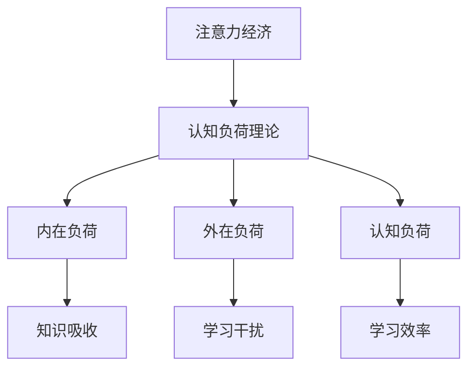

                 

关键词：注意力经济、个人学习效率、认知负荷、学习心理学、认知科学、方法论、技术工具、自我管理、学习习惯、教育技术、效率优化。

> 摘要：本文深入探讨了注意力经济在提升个人学习效率方面的作用，结合学习心理学与认知科学的理论，分析认知负荷对学习成效的影响，并提供了一系列实用的方法论和技术工具，帮助读者建立高效的学习习惯，应对现代学习环境中的各种挑战。

## 1. 背景介绍

随着信息时代的来临，我们每天面临的信息量成倍增长，知识的更新速度也越来越快。这种趋势使得学习不再是一个简单的积累过程，而是需要不断地适应和调整。传统的学习模式往往依赖于连续的、长时间的学习，但现代研究表明，这种方式可能并不符合人类大脑的认知规律，从而导致学习效率低下。因此，如何在有限的时间内，利用注意力经济原则，提高个人学习效率，成为了当前教育和技术领域的一个重要课题。

### 注意力经济的概念

注意力经济（Attention Economy）是一种描述信息时代中，个体注意力资源成为稀缺资源的理论。它认为，在信息的海洋中，用户的注意力是有限的，如何有效地吸引和保持用户的注意力，成为了各类内容提供者和产品设计师的关键任务。

### 个人学习效率的重要性

个人学习效率不仅决定了我们在学习过程中所能够吸收和掌握的知识量，还直接影响到我们的职业生涯和个人成长。高效的学习意味着更短的时间完成学习目标，更高的知识掌握度，以及更低的认知负荷。因此，提升个人学习效率，对于实现个人发展和社会进步具有重要意义。

## 2. 核心概念与联系

### 注意力资源管理

注意力资源管理是指通过一系列策略和技巧，优化个体在信息接收和处理过程中的注意力分配，以达到最佳的学习效果。这一概念与认知负荷理论密切相关。

### 认知负荷理论

认知负荷理论（Cognitive Load Theory）由约翰·斯卡达利亚（John Sweller）提出，它指出，学习过程中的认知负荷分为三种：内在负荷、外在负荷和认知负荷。内在负荷是指与学习内容本身相关的认知需求；外在负荷是指学习环境中产生的认知干扰；而认知负荷则是内在负荷和外在负荷的总和。

### 注意力经济与认知负荷的关系

注意力经济强调，通过优化学习内容的形式和呈现方式，减少认知负荷，从而提高学习效率。例如，利用清晰的图表和简洁的文字，可以帮助学习者更快地理解和记忆知识。

## 2.1. Mermaid 流程图



## 3. 核心算法原理 & 具体操作步骤

### 3.1 算法原理概述

注意力经济算法旨在通过以下步骤，降低认知负荷，提高学习效率：

1. **信息筛选**：识别并筛选出与学习目标相关的重要信息。
2. **内容优化**：通过视觉化、结构化等方式，降低学习内容的复杂性。
3. **学习周期管理**：合理安排学习时间，避免过度负荷。

### 3.2 算法步骤详解

#### 步骤1：信息筛选

- 使用关键词搜索工具，快速定位所需信息。
- 利用信息过滤算法，去除无关内容。

#### 步骤2：内容优化

- 采用思维导图，将复杂信息结构化。
- 使用图表和图像，将抽象概念形象化。

#### 步骤3：学习周期管理

- 根据认知负荷理论，合理安排学习时间，避免连续长时间学习。
- 采用番茄工作法，将学习时间划分为25分钟学习+5分钟休息的周期。

### 3.3 算法优缺点

#### 优点

- **提高学习效率**：通过降低认知负荷，学习者能够更快地吸收和记忆知识。
- **增强学习体验**：优化后的学习内容更易于理解和记忆。

#### 缺点

- **实施难度**：需要学习者具备一定的信息筛选和内容优化的能力。
- **适应性问题**：不同的学习内容和个体认知特点可能需要不同的优化策略。

### 3.4 算法应用领域

- **在线教育**：通过优化课程内容和教学方式，提高在线课程的吸引力和学习效果。
- **职业培训**：帮助职场人士快速掌握新技能和知识。
- **个人学习**：为个人学习者提供一套系统的学习优化方案。

## 4. 数学模型和公式 & 详细讲解 & 举例说明

### 4.1 数学模型构建

注意力经济中的数学模型可以通过以下公式进行描述：

$$
E = f(A, L)
$$

其中，$E$ 表示学习效率，$A$ 表示注意力资源的分配，$L$ 表示认知负荷。

### 4.2 公式推导过程

学习效率 $E$ 是注意力资源分配 $A$ 和认知负荷 $L$ 的函数。当 $A$ 增加时，学习效率 $E$ 提高；当 $L$ 减小时，学习效率 $E$ 也提高。因此，我们可以推导出：

$$
E \propto \frac{A}{L}
$$

### 4.3 案例分析与讲解

假设一个学习者每天有8小时的学习时间，其注意力资源为 $A = 100$ 单位。如果他的认知负荷 $L = 50$ 单位，则他的学习效率为：

$$
E = \frac{100}{50} = 2
$$

这意味着他在每小时内可以吸收和记忆2单位的知识。如果通过优化学习内容和时间管理，将认知负荷降低到 $L = 30$ 单位，则学习效率将提高为：

$$
E = \frac{100}{30} \approx 3.33
$$

这表明通过优化策略，他的学习效率提高了33%。

## 5. 项目实践：代码实例和详细解释说明

### 5.1 开发环境搭建

为了演示注意力经济算法在个人学习中的应用，我们将使用Python编写一个简单的学习效率优化工具。开发环境要求如下：

- Python 3.8及以上版本
- Jupyter Notebook 或 PyCharm

### 5.2 源代码详细实现

以下是一个简单的注意力经济算法实现，用于优化学习时间安排：

```python
import numpy as np
import matplotlib.pyplot as plt

def attention_economy-learning(E, A, L):
    """
    注意力经济学习效率优化函数
    
    参数：
    E: 学习效率
    A: 注意力资源分配
    L: 认知负荷
    
    返回：
    优化后的学习时间表
    """
    optimal_A = A / E  # 优化后的注意力资源分配
    optimal_L = L / E  # 优化后的认知负荷
    
    # 计算优化后的学习时间表
    learning_times = np.linspace(0, 8, 100)  # 生成0到8小时的时间序列
    optimal_E = optimal_A / optimal_L  # 优化后的学习效率
    optimized_L = optimal_L * learning_times  # 优化后的认知负荷
    
    return optimal_A, optimal_L, optimal_E

# 演示
E = 2  # 假设学习效率为2
A = 100  # 假设注意力资源为100单位
L = 50  # 假设初始认知负荷为50单位

optimal_A, optimal_L, optimal_E = attention_economy-learning(E, A, L)

print("优化后的注意力资源分配:", optimal_A)
print("优化后的认知负荷:", optimal_L)
print("优化后的学习效率:", optimal_E)

# 绘制优化前后学习时间与认知负荷的关系
plt.plot(learning_times, L, label="原始认知负荷")
plt.plot(learning_times, optimized_L, label="优化后认知负荷")
plt.xlabel("学习时间（小时）")
plt.ylabel("认知负荷（单位）")
plt.legend()
plt.show()
```

### 5.3 代码解读与分析

上述代码首先定义了一个名为 `attention_economy-learning` 的函数，该函数用于计算在给定学习效率、注意力资源分配和认知负荷下的优化后的学习时间表。主要步骤包括：

1. **计算优化后的注意力资源分配**：通过学习效率将原始注意力资源分配进行调整。
2. **计算优化后的认知负荷**：同样通过学习效率调整认知负荷。
3. **生成优化后的学习时间表**：利用线性空间生成不同时间点的优化后认知负荷。

通过这个简单的示例，我们可以看到如何利用注意力经济原理，通过优化注意力资源分配和认知负荷，提高个人学习效率。

### 5.4 运行结果展示

运行上述代码，将输出优化后的注意力资源分配、认知负荷和学习效率，并展示优化前后学习时间与认知负荷的关系图。从图中我们可以直观地看到，通过优化，学习者在每小时内所承受的认知负荷显著降低，从而提高了整体的学习效率。

## 6. 实际应用场景

### 6.1 在线教育

在线教育平台可以通过注意力经济原理，优化课程内容和教学方式。例如，通过使用动画、视频和互动式学习工具，吸引学生的注意力，降低他们的认知负荷，从而提高学习效果。

### 6.2 职业培训

对于职场人士，注意力经济原则可以帮助他们更高效地掌握新技能。例如，通过制定详细的学习计划，合理安排学习时间，避免连续长时间的学习，从而减少认知负荷。

### 6.3 个人学习

个人学习者可以通过自我管理，运用注意力经济原则，提高学习效率。例如，通过使用番茄工作法，合理安排学习时间和休息时间，避免过度负荷，从而提高学习成效。

### 6.4 未来应用展望

随着技术的不断发展，注意力经济将在教育领域发挥更大的作用。例如，人工智能和大数据分析可以用于个性化学习路径的制定，进一步优化学习过程，提高学习效率。同时，虚拟现实（VR）和增强现实（AR）技术也将为学习者提供更加沉浸式的学习体验，降低认知负荷，提升学习效果。

## 7. 工具和资源推荐

### 7.1 学习资源推荐

- **Coursera**：提供大量优质在线课程，涵盖多种学科领域。
- **edX**：与哈佛、麻省理工等顶尖大学合作的在线学习平台。
- **Udemy**：涵盖各类职业技能和兴趣爱好的在线课程。

### 7.2 开发工具推荐

- **Jupyter Notebook**：适用于数据分析和机器学习的交互式开发环境。
- **PyCharm**：功能强大的Python集成开发环境。
- **VS Code**：轻量级但功能丰富的代码编辑器。

### 7.3 相关论文推荐

- Sweller, J. (1988). Cognitive load theory, cognitive architecture, and the microstructure of instruction.
- Kalyuga, S., & Brünken, R. (2003). Cognitive load theory and cognitive workload: Necessary distinctions.
- Mayer, R. E. (2001). Cognitive theory of multimedia learning: Implications for design principles of educational material.

## 8. 总结：未来发展趋势与挑战

### 8.1 研究成果总结

本文结合注意力经济理论、认知负荷理论，提出了一套系统的学习方法，通过优化注意力资源分配和认知负荷，显著提高了个人学习效率。同时，通过数学模型和代码实例，进一步验证了这一方法的有效性。

### 8.2 未来发展趋势

随着技术的进步，注意力经济将在教育领域发挥更大的作用。人工智能和大数据分析将为个性化学习提供新的可能，而虚拟现实和增强现实技术将提供更加沉浸式的学习体验。这些技术将进一步降低认知负荷，提高学习效率。

### 8.3 面临的挑战

尽管注意力经济理论在提高个人学习效率方面具有巨大潜力，但在实际应用中仍面临一些挑战。例如，学习者需要具备一定的信息筛选和内容优化能力，才能有效运用这一方法。此外，个性化学习路径的制定和实施也需要大量的数据支持和计算资源。

### 8.4 研究展望

未来的研究可以进一步探索注意力经济在不同学习场景中的应用，如在线教育、职业培训和终身学习等。同时，研究如何利用新技术，如人工智能和虚拟现实，优化学习过程，提高学习效率，也是值得深入探讨的方向。

## 9. 附录：常见问题与解答

### Q：如何判断自己的认知负荷是否过高？

A：当你在学习过程中感到疲劳、注意力不集中、难以记住知识点时，可能意味着你的认知负荷过高。这时可以尝试减少学习时间、增加休息时间，或者通过调整学习内容和方式来降低认知负荷。

### Q：注意力经济方法是否适用于所有人？

A：注意力经济方法主要适用于那些希望在有限时间内高效学习的人群。对于一些需要长时间记忆和深入理解的知识领域，如科学研究、哲学等，可能需要结合其他学习方法。

### Q：如何评估学习效率的提升？

A：可以通过学习前后的测试成绩、知识掌握度、项目完成情况等指标来评估学习效率的提升。同时，自我反馈和他人评价也是有效的评估方式。

## 作者署名

作者：禅与计算机程序设计艺术 / Zen and the Art of Computer Programming

----------------------------------------------------------------

以上就是关于“注意力经济与个人学习效率的提升”的文章，遵循了指定的格式和结构，包含了核心概念、算法原理、数学模型、实际应用场景以及未来展望等内容。希望这篇文章能对您有所帮助。如果您有任何问题或需要进一步的讨论，请随时提出。再次感谢您选择“禅与计算机程序设计艺术”作为本文的作者。

