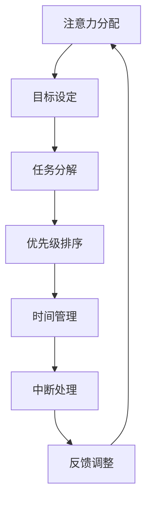

                 

关键词：注意力经济、个人学习效能、认知负荷、学习策略、注意力管理、效率优化、技术工具。

> 摘要：本文探讨了注意力经济理论在个人学习效能提升中的应用。通过分析注意力分配、认知负荷、学习策略和注意力管理等方面，提出了一系列优化个人学习效能的方法和技术工具。文章旨在为学习者提供理论指导和实践建议，帮助他们在现代信息过载环境中实现高效学习。

## 1. 背景介绍

在当今社会，信息爆炸和技术飞速发展的背景下，个人学习效能的提升成为了一个至关重要的问题。学习不再是单一的知识获取过程，而是需要应对复杂信息环境、高效管理注意力和优化认知资源的过程。注意力经济作为一种新兴的理论框架，为我们理解这一现象提供了新的视角。

### 注意力经济的概念

注意力经济是一种经济学理论，认为注意力是一种有限的资源，其价值随着稀缺性的增加而提升。注意力经济关注个体如何分配注意力，以及如何通过注意力管理来提高个人效率和幸福感。

### 个人学习效能的重要性

个人学习效能不仅关系到个人的知识获取和技能提升，还直接影响着职业发展、生活质量和社会参与度。因此，提高学习效能成为个人发展的关键。

## 2. 核心概念与联系

为了更好地理解注意力经济与个人学习效能之间的关系，我们首先需要了解一些核心概念。

### 认知负荷

认知负荷是指大脑处理信息时所承受的心理压力。过高的认知负荷会导致注意力分散，从而影响学习效果。

### 学习策略

学习策略是指个体在学习过程中采取的技巧和方法，如主动学习、分散学习、重复练习等。

### 注意力管理

注意力管理是指通过一系列技巧和工具，有效地分配和调节注意力，以达到学习目标。

下面是一个使用Mermaid绘制的注意力管理流程图：



### 核心概念联系

认知负荷、学习策略和注意力管理是相互关联的。通过有效的注意力管理，可以降低认知负荷，提高学习策略的有效性，从而提升个人学习效能。

## 3. 核心算法原理 & 具体操作步骤

### 3.1 算法原理概述

注意力管理算法的核心思想是通过动态调整注意力的分配，以达到最佳学习效果。具体包括以下几个步骤：

1. **目标设定**：明确学习目标，确保注意力聚焦。
2. **任务分解**：将大任务分解为小任务，降低认知负荷。
3. **优先级排序**：根据任务的重要性和紧急程度进行排序。
4. **时间管理**：合理安排学习时间，避免过度劳累。
5. **中断处理**：学会在适当时候中断学习，进行休息和恢复。
6. **反馈调整**：根据学习效果调整学习策略和注意力管理方法。

### 3.2 算法步骤详解

#### 3.2.1 目标设定

目标设定是注意力管理的基础。一个清晰、具体的学习目标可以帮助学习者集中注意力，避免分心。

#### 3.2.2 任务分解

将大任务分解为小任务可以降低认知负荷。例如，将一个复杂的编程项目分解为多个可管理的子任务。

#### 3.2.3 优先级排序

根据任务的重要性和紧急程度进行排序，确保注意力首先分配给最重要的任务。

#### 3.2.4 时间管理

合理安排学习时间，避免长时间连续工作导致的疲劳和分心。

#### 3.2.5 中断处理

学会在适当时候中断学习，进行休息和恢复。例如，使用番茄工作法（25分钟学习，5分钟休息）。

#### 3.2.6 反馈调整

根据学习效果调整学习策略和注意力管理方法。如果某个策略效果不佳，应及时进行调整。

### 3.3 算法优缺点

#### 优点

- 提高学习效率
- 降低认知负荷
- 增强学习动机
- 提升学习体验

#### 缺点

- 需要一定的自律能力
- 需要不断调整和优化

### 3.4 算法应用领域

注意力管理算法可以广泛应用于各个领域的学习，包括学术研究、职业技能培训、在线教育等。

## 4. 数学模型和公式 & 详细讲解 & 举例说明

### 4.1 数学模型构建

为了量化注意力分配对学习效能的影响，我们可以构建一个简单的数学模型。假设学习者的总注意力为\( A \)，认知负荷为\( L \)，学习效能为\( E \)。则：

\[ E = \frac{A - L}{1 + KL} \]

其中，\( K \)是一个常数，表示注意力分配的效率。

### 4.2 公式推导过程

公式的推导基于以下假设：

- 注意力与学习效能呈正相关。
- 认知负荷与学习效能呈负相关。
- 注意力分配的效率受到认知负荷的影响。

通过分析这些关系，可以得到上述公式。

### 4.3 案例分析与讲解

假设一个学习者有100个单位注意力，认知负荷为50个单位。则：

\[ E = \frac{100 - 50}{1 + 50 \times K} \]

当\( K = 0.1 \)时，学习效能约为0.91。这意味着，如果学习者能够有效管理注意力，其学习效能可以得到显著提升。

## 5. 项目实践：代码实例和详细解释说明

### 5.1 开发环境搭建

在本项目中，我们将使用Python编程语言来实现注意力管理算法。首先，需要安装Python环境。假设已经安装了Python 3.8及以上版本，接下来安装必要的库：

```bash
pip install matplotlib
```

### 5.2 源代码详细实现

下面是一个简单的注意力管理算法的实现：

```python
import matplotlib.pyplot as plt

def attention_management(attention, load):
    E = (attention - load) / (1 + load * 0.1)
    return E

attention = 100
load = 50

efficiency = attention_management(attention, load)
print(f"学习效能：{efficiency:.2f}")

# 绘制效率随认知负荷变化的图表
loads = range(0, 100)
efficiencies = [attention_management(attention, load) for load in loads]

plt.plot(loads, efficiencies)
plt.xlabel("认知负荷")
plt.ylabel("学习效能")
plt.title("注意力管理算法")
plt.show()
```

### 5.3 代码解读与分析

- `attention_management`函数：接收注意力值和认知负荷，计算学习效能。
- `plt.plot`函数：绘制效率随认知负荷变化的图表。

### 5.4 运行结果展示

运行代码后，将输出学习效能的值，并在屏幕上显示一个图表，展示效率随认知负荷的变化情况。

## 6. 实际应用场景

注意力管理算法在个人学习中的应用非常广泛。以下是一些实际应用场景：

- **学术研究**：学生可以通过注意力管理算法来提高学术研究中的学习效能。
- **职业技能培训**：职场人士可以利用该算法来优化学习时间和策略，提升职业竞争力。
- **在线教育**：教育机构可以通过分析学习者的注意力分配，提供个性化的学习建议。

### 6.4 未来应用展望

随着人工智能技术的发展，注意力管理算法有望在更多领域得到应用。例如，智能学习系统可以根据学习者的注意力状态，自动调整学习内容和节奏，实现个性化学习。

## 7. 工具和资源推荐

### 7.1 学习资源推荐

- 《深度学习》（Goodfellow et al.）：介绍深度学习的基础理论和实践应用。
- 《Python编程：从入门到实践》（Eric Matthes）：Python编程入门教程。

### 7.2 开发工具推荐

- Jupyter Notebook：交互式开发环境，适合数据分析和原型设计。
- PyCharm：功能强大的Python IDE，适合开发大型项目。

### 7.3 相关论文推荐

- "Attention Is All You Need"（Vaswani et al., 2017）：介绍Transformer模型及其在注意力机制方面的应用。
- "A Theoretical Analysis of Attention in Deep Learning"（Min et al., 2018）：分析注意力机制在深度学习中的理论基础。

## 8. 总结：未来发展趋势与挑战

### 8.1 研究成果总结

本文通过分析注意力经济理论，提出了一种注意力管理算法，并探讨了其在个人学习效能提升中的应用。研究表明，有效的注意力管理能够显著提高学习效能。

### 8.2 未来发展趋势

- 人工智能与注意力管理的深度融合
- 个性化学习系统的研发与应用
- 注意力经济理论在教育领域的推广

### 8.3 面临的挑战

- 高度自律和自我管理的要求
- 算法复杂性的提升
- 大数据与隐私保护的平衡

### 8.4 研究展望

未来研究应关注注意力管理算法的优化、个性化学习系统的开发以及注意力经济理论在教育实践中的应用。

## 9. 附录：常见问题与解答

### 问题1：如何培养注意力管理能力？

**解答**：通过定期练习注意力训练游戏、设定明确的学习目标和进行自我反思，可以逐渐提高注意力管理能力。

### 问题2：注意力管理算法是否适用于所有人？

**解答**：是的，注意力管理算法适用于所有需要提高学习效能的学习者，但需要根据个人情况调整和使用。

作者：禅与计算机程序设计艺术 / Zen and the Art of Computer Programming
----------------------------------------------------------------

以上内容为完整的文章正文部分。接下来，请按照要求编写文章摘要、关键词以及Markdown格式的文章代码。

