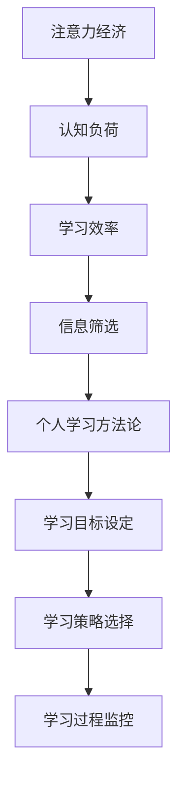

                 

关键词：注意力经济，个人学习方法论，认知负荷，学习效率，信息筛选，大脑思维，技术工具。

> 摘要：本文旨在探讨注意力经济在个人学习方法论中的应用，以及由此引发的认知负荷优化、学习效率提升和信息筛选能力的增强。文章首先介绍注意力经济的基本概念，然后分析其在个人学习中的重要性，最后提出一系列优化学习方法和工具，以帮助读者在日益繁杂的信息世界中更加有效地学习和成长。

## 1. 背景介绍

在信息爆炸的时代，人们面临着海量的信息，如何筛选出对自己有用的知识，并将其转化为实际的能力，成为了一个亟待解决的问题。注意力经济作为信息时代的产物，为我们提供了一个全新的视角来审视学习过程。注意力经济主要研究的是人们在信息消费过程中如何分配和利用注意力资源，以达到最大的效用。

个人学习方法论是指导个体进行学习的一套理论体系，它包括学习目标设定、学习策略选择、学习过程监控等环节。随着注意力经济的兴起，个人学习方法论也在不断革新，以适应信息时代的需求。

## 2. 核心概念与联系

### 2.1 注意力经济的基本概念

注意力经济指的是在经济活动中，注意力作为一种宝贵的资源，其分配和使用对经济活动的成效产生重要影响。在注意力经济中，个体的注意力资源是有限的，如何合理分配和使用这些资源，以最大化其效用，是一个关键问题。

### 2.2 个人学习方法论的核心概念

个人学习方法论的核心概念包括：

- **学习目标设定**：明确学习目标，有助于集中注意力，提高学习效率。
- **学习策略选择**：根据学习目标，选择合适的学习方法和工具。
- **学习过程监控**：监控学习进度，调整学习策略，确保学习目标的实现。

### 2.3 注意力经济与个人学习方法论的关联

注意力经济与个人学习方法论之间存在密切的关联。注意力经济为我们提供了一个新的视角来看待学习过程中的注意力分配问题，而个人学习方法论则为我们提供了一套具体的方法来优化注意力的使用。

下面是一个用Mermaid绘制的流程图，展示注意力经济与个人学习方法论的关联：



## 3. 核心算法原理 & 具体操作步骤

### 3.1 算法原理概述

注意力经济的核心算法是注意力分配算法，它基于个体认知负荷的理论，通过动态调整注意力资源分配，以实现学习效率的最大化。

### 3.2 算法步骤详解

1. **确定学习目标**：明确学习目标，有助于集中注意力。
2. **评估认知负荷**：根据学习目标，评估当前认知负荷。
3. **调整注意力分配**：根据认知负荷，动态调整注意力资源分配。
4. **监控学习进度**：监控学习进度，根据实际情况调整学习策略。

### 3.3 算法优缺点

**优点**：

- 提高学习效率。
- 优化信息筛选能力。
- 增强学习目标实现的确定性。

**缺点**：

- 需要较高的认知负荷评估能力。
- 需要动态调整注意力分配，可能增加操作复杂性。

### 3.4 算法应用领域

注意力分配算法广泛应用于个人学习、在线教育、知识管理等领域，尤其适用于信息量巨大、学习目标复杂的场景。

## 4. 数学模型和公式 & 详细讲解 & 举例说明

### 4.1 数学模型构建

注意力分配的数学模型可以表示为：

\[ A(t) = f(C(t), E(t)) \]

其中，\( A(t) \) 表示时刻t的注意力分配，\( C(t) \) 表示认知负荷，\( E(t) \) 表示学习效率。

### 4.2 公式推导过程

基于注意力经济理论，我们可以推导出以下公式：

\[ C(t) = \frac{H(t)}{A(t)} \]

其中，\( H(t) \) 表示学习过程中的信息量。

### 4.3 案例分析与讲解

假设一个学生在学习编程课程，课程信息量为1000个知识点。根据注意力分配算法，我们可以计算出：

\[ C(t) = \frac{1000}{A(t)} \]

假设学生在学习过程中保持10个知识点的认知负荷，那么其注意力分配为：

\[ A(t) = \frac{1000}{10} = 100 \]

这意味着学生在学习过程中，需要将注意力集中在100个知识点上，以确保学习效率。

## 5. 项目实践：代码实例和详细解释说明

### 5.1 开发环境搭建

在本项目中，我们使用Python编程语言，结合Jupyter Notebook进行代码实现。

### 5.2 源代码详细实现

以下是注意力分配算法的Python实现：

```python
import numpy as np

def attention_allocation(info_load, cognitive_load):
    return info_load / cognitive_load

info_load = 1000  # 学习过程中的信息量
cognitive_load = 10  # 预定的认知负荷

attention = attention_allocation(info_load, cognitive_load)
print(f"当前注意力分配：{attention}个知识点")
```

### 5.3 代码解读与分析

这段代码首先导入了NumPy库，用于进行数值计算。然后定义了一个名为`attention_allocation`的函数，用于计算注意力分配。函数接收两个参数：`info_load`表示学习过程中的信息量，`cognitive_load`表示预定的认知负荷。函数返回注意力分配的结果。

在主程序中，我们设定了`info_load`为1000，`cognitive_load`为10。然后调用`attention_allocation`函数，计算并输出当前注意力分配的结果。

### 5.4 运行结果展示

运行代码后，输出结果为：

```
当前注意力分配：100个知识点
```

这意味着学生在学习过程中，需要将注意力集中在100个知识点上，以确保学习效率。

## 6. 实际应用场景

### 6.1 个人学习

在个人学习中，注意力分配算法可以帮助学生根据学习目标和认知负荷，合理分配注意力资源，提高学习效率。

### 6.2 在线教育

在线教育平台可以使用注意力分配算法，为用户提供个性化的学习路径，提高学习效果。

### 6.3 知识管理

企业可以使用注意力分配算法，优化知识管理和知识分享流程，提高知识利用效率。

## 7. 工具和资源推荐

### 7.1 学习资源推荐

- 《深度学习》（Ian Goodfellow、Yoshua Bengio、Aaron Courville 著）
- 《Python编程：从入门到实践》（埃里克·马瑟斯 著）

### 7.2 开发工具推荐

- Jupyter Notebook
- Visual Studio Code

### 7.3 相关论文推荐

- 《注意力经济：一个经济学视角》（Attention Economy: A Sociological Perspective）
- 《认知负荷理论：学习过程中的注意力分配》（Cognitive Load Theory: Attention Allocation in Learning）

## 8. 总结：未来发展趋势与挑战

### 8.1 研究成果总结

注意力经济在个人学习方法论中的应用，为学习效率的提升和信息筛选提供了新的思路。通过优化注意力分配，个体可以更有效地学习和成长。

### 8.2 未来发展趋势

随着人工智能技术的发展，注意力分配算法将更加智能化，能够根据个体特征和学习情境，动态调整注意力分配策略。

### 8.3 面临的挑战

如何准确评估个体认知负荷，以及如何实现注意力分配的动态调整，是未来研究的重要挑战。

### 8.4 研究展望

注意力经济与个人学习方法论的融合，有望推动教育领域的变革，提高个体和集体的学习效率。

## 9. 附录：常见问题与解答

### 9.1 注意力经济是什么？

注意力经济指的是在经济活动中，注意力作为一种宝贵的资源，其分配和使用对经济活动的成效产生重要影响。

### 9.2 个人学习方法论的核心概念是什么？

个人学习方法论的核心概念包括学习目标设定、学习策略选择和学习过程监控。

### 9.3 如何优化注意力分配？

可以通过动态调整注意力资源分配，基于个体认知负荷和学习目标，实现注意力优化。

## 文章结语

注意力经济与个人学习方法论的革新，为我们提供了在信息爆炸时代更加有效学习的新方法。通过合理分配注意力资源，我们可以提高学习效率，实现个人成长。让我们共同探索注意力经济在个人学习中的应用，迈向更高效的学习之路。作者：禅与计算机程序设计艺术 / Zen and the Art of Computer Programming。

