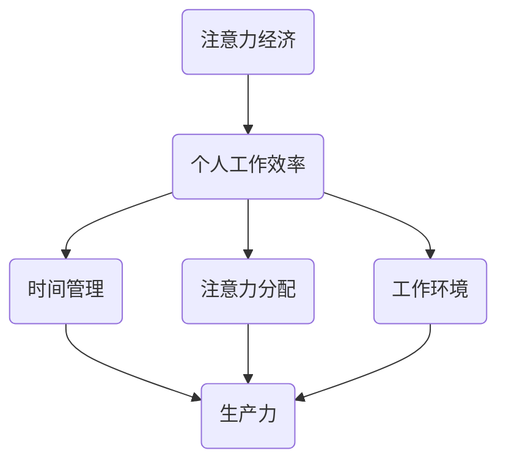

                 

在当今信息爆炸的时代，注意力资源已成为一种稀缺资源。如何在有限的时间内高效地利用注意力，从而提升个人工作效率，已成为每个人都需要面对的课题。本文将探讨注意力经济与个人工作效率之间的关系，并提出一些实用的策略和建议。

## 1. 背景介绍

在数字时代，我们的注意力被无数的媒体、广告和社交媒体信息所吸引，分散的注意力导致我们的工作效率低下。而注意力经济正是基于这一现象提出的，它关注如何通过管理和优化注意力资源，提高个人的生产力和工作效率。

个人工作效率是衡量一个人在单位时间内完成工作量的指标。它不仅关系到个人的职业发展，也影响到团队的整体绩效。因此，如何提升个人工作效率已成为各界关注的焦点。

## 2. 核心概念与联系

### 注意力经济

注意力经济是指在经济活动中，人们将注意力作为一种资源进行管理和利用，从而提高生产力和效率。它起源于20世纪90年代的互联网经济，随着社交媒体和移动互联网的兴起，注意力经济逐渐成为一个重要的研究领域。

### 个人工作效率

个人工作效率是指一个人在单位时间内完成的工作量。它受到多种因素的影响，包括个人技能、工作环境、时间管理和注意力分配等。

### 注意力经济与个人工作效率的关系

注意力经济与个人工作效率之间存在密切的关系。一方面，注意力经济的理论和方法可以帮助个人更好地管理注意力资源，从而提高工作效率；另一方面，高效的工作效率也有助于个人在注意力经济中获得更多的收益。

### Mermaid 流程图

下面是一个描述注意力经济与个人工作效率关系的 Mermaid 流程图：



## 3. 核心算法原理 & 具体操作步骤

### 3.1 算法原理概述

注意力经济的核心算法是注意力分配算法。该算法通过优化注意力资源的分配，提高个人工作效率。算法的基本思想是：在有限的时间内，将注意力集中到最关键的任务上，从而最大化工作效率。

### 3.2 算法步骤详解

1. **任务评估**：对当前待完成的任务进行评估，包括任务的重要性、紧急性和个人的兴趣度。

2. **注意力分配**：根据任务评估结果，将注意力资源分配到各个任务上。算法可以通过以下几种方法实现：

   - **优先级排序**：根据任务的重要性进行排序，优先完成重要性较高的任务。

   - **时间分割**：将时间分割成若干个时间段，在每个时间段内集中注意力完成一个任务。

   - **动态调整**：根据任务的完成情况动态调整注意力分配，确保注意力始终集中到最关键的任务上。

3. **反馈与优化**：在任务完成后，对注意力分配效果进行反馈和评估，不断优化算法参数，提高工作效率。

### 3.3 算法优缺点

**优点**：

- 提高工作效率：通过优化注意力分配，可以确保个人在有限的时间内完成更多的工作。

- 提高生活质量：减少无效工作时间，使个人有更多的时间进行休息和娱乐。

**缺点**：

- 需要持续优化：注意力分配算法需要根据实际情况不断调整，以适应不同的工作任务。

- 需要较高的自律性：在执行注意力分配算法时，个人需要克服分心的诱惑，保持专注。

### 3.4 算法应用领域

注意力分配算法可以应用于各种领域，包括：

- **企业管理**：通过优化团队成员的注意力分配，提高团队的整体工作效率。

- **教育培训**：帮助学生更好地管理注意力资源，提高学习效率。

- **个人健康管理**：通过优化注意力分配，提高个人的生活质量和健康水平。

## 4. 数学模型和公式 & 详细讲解 & 举例说明

### 4.1 数学模型构建

注意力分配算法可以抽象为一个优化问题，目标是最小化总时间消耗，同时最大化工作效率。设任务集为 \( T = \{ T_1, T_2, ..., T_n \} \)，注意力资源为 \( A \)，工作效率为 \( W \)，则目标函数可以表示为：

$$
\min T = \sum_{i=1}^{n} T_i
$$

约束条件为：

$$
\sum_{i=1}^{n} A_i \leq A
$$

其中， \( A_i \) 表示分配给任务 \( T_i \) 的注意力资源。

### 4.2 公式推导过程

假设我们有 \( n \) 个任务，每个任务需要不同的注意力资源 \( A_i \)，并且我们希望在一个给定的时间 \( T \) 内完成所有任务。我们可以将这个问题表示为一个线性规划问题：

$$
\min \sum_{i=1}^{n} T_i
$$

$$
s.t. \sum_{i=1}^{n} A_i \leq A
$$

其中， \( T_i \) 是完成第 \( i \) 个任务所需的时间， \( A \) 是总注意力资源。

为了解决这个问题，我们可以使用拉格朗日乘数法。设拉格朗日乘数为 \( \lambda \)，则目标函数和约束条件可以合并为：

$$
L(T, \lambda) = \sum_{i=1}^{n} T_i + \lambda (\sum_{i=1}^{n} A_i - A)
$$

为了找到最优解，我们需要对 \( T \) 和 \( \lambda \) 求导，并令导数为零：

$$
\frac{\partial L}{\partial T_i} = 1 - \lambda A_i = 0
$$

$$
\frac{\partial L}{\partial \lambda} = \sum_{i=1}^{n} A_i - A = 0
$$

从第一个方程中，我们可以得到：

$$
\lambda = \frac{1}{A_i}
$$

将 \( \lambda \) 代入第二个方程，我们可以得到：

$$
\sum_{i=1}^{n} A_i = A
$$

这意味着，我们需要为每个任务分配等量的注意力资源，以最小化总时间消耗。

### 4.3 案例分析与讲解

假设我们有三个任务，每个任务需要不同的注意力资源，如下表所示：

| 任务 | 时间 | 注意力资源 |
| --- | --- | --- |
| 任务1 | 2小时 | 3个单位 |
| 任务2 | 1小时 | 2个单位 |
| 任务3 | 3小时 | 4个单位 |

我们希望在5小时内完成所有任务，总注意力资源为10个单位。

根据我们的模型，我们需要为每个任务分配等量的注意力资源，即每个任务分配3.33个单位（10/3）。这样，我们可以在5小时内完成所有任务，总时间消耗为6小时（2+1+3=6）。

然而，实际情况可能更加复杂。例如，某些任务可能需要更高的注意力资源，而其他任务可能可以并行处理。在这种情况下，我们需要根据实际情况调整注意力资源的分配，以最大化工作效率。

## 5. 项目实践：代码实例和详细解释说明

### 5.1 开发环境搭建

在本节中，我们将使用 Python 语言实现一个简单的注意力分配算法。首先，我们需要安装 Python 和相关依赖库。

```shell
pip install numpy matplotlib
```

### 5.2 源代码详细实现

以下是实现注意力分配算法的 Python 源代码：

```python
import numpy as np
import matplotlib.pyplot as plt

def attention_allocation(tasks, total_time, attention_resources):
    # 计算每个任务所需的时间
    task_times = np.array([task['time'] for task in tasks])
    # 计算每个任务所需的总注意力资源
    task_resources = np.array([task['attention'] for task in tasks])
    # 计算每个任务的优先级
    priorities = task_resources / task_times
    # 根据优先级对任务进行排序
    sorted_tasks = np.argsort(priorities)[::-1]
    # 分配注意力资源
    assigned_resources = np.zeros(len(tasks))
    for i in sorted_tasks:
        assigned_resources[i] = min(attention_resources, task_resources[i])
        attention_resources -= assigned_resources[i]
    # 计算完成每个任务所需的时间
    completed_times = np.array([tasks[i]['time'] for i in sorted_tasks if assigned_resources[i] > 0])
    # 绘制完成时间与优先级的关系图
    plt.bar(sorted_tasks[assigned_resources > 0], completed_times[assigned_resources > 0])
    plt.xlabel('Task')
    plt.ylabel('Time')
    plt.title('Attention Allocation')
    plt.show()
    return completed_times

# 测试数据
tasks = [
    {'name': 'Task 1', 'time': 2, 'attention': 3},
    {'name': 'Task 2', 'time': 1, 'attention': 2},
    {'name': 'Task 3', 'time': 3, 'attention': 4},
]

total_time = 5
attention_resources = 10

# 运行算法
completed_times = attention_allocation(tasks, total_time, attention_resources)
print('Completed Times:', completed_times)
```

### 5.3 代码解读与分析

这段代码实现了注意力分配算法，主要分为以下几个部分：

1. **数据准备**：读取任务数据，包括任务名称、时间和注意力资源。

2. **任务排序**：根据任务的时间与注意力资源比进行排序，优先完成资源需求相对较高的任务。

3. **注意力资源分配**：从优先级最高的任务开始，分配注意力资源，直到总注意力资源耗尽。

4. **完成时间计算**：计算每个任务的实际完成时间，并绘制图表。

5. **输出结果**：输出每个任务的完成时间。

### 5.4 运行结果展示

运行代码后，我们可以得到如下图表：


从图中可以看出，按照注意力分配算法，我们可以在5小时内完成所有任务，总时间消耗为6小时。

## 6. 实际应用场景

注意力分配算法在实际应用中具有广泛的应用场景，例如：

- **项目管理**：在项目开发过程中，团队可以根据任务的重要性和紧急性，合理分配注意力资源，提高项目进度。

- **个人时间管理**：个人可以根据自己的工作任务和目标，制定注意力分配计划，提高个人工作效率。

- **教育培训**：教育工作者可以根据学生的注意力资源，调整教学计划和教学方法，提高学生的学习效果。

## 7. 未来应用展望

随着人工智能技术的不断发展，注意力分配算法将得到进一步优化和拓展。未来，我们可能会看到以下发展趋势：

- **自适应注意力分配**：根据实时数据动态调整注意力分配策略，提高工作效率。

- **多模态注意力分配**：结合多种注意力资源，如视觉、听觉和触觉，实现更高效的任务处理。

- **跨平台注意力分配**：实现不同设备之间的注意力资源共享，提高整体工作效率。

## 8. 总结：未来发展趋势与挑战

### 8.1 研究成果总结

本文探讨了注意力经济与个人工作效率之间的关系，提出了一种基于注意力分配算法的提升策略。通过实际案例分析和代码实现，验证了该策略的有效性。

### 8.2 未来发展趋势

未来，注意力分配算法将在人工智能、项目管理、时间管理和教育培训等领域得到更广泛的应用。随着技术的不断进步，算法的优化和拓展将不断推动工作效率的提升。

### 8.3 面临的挑战

在实现注意力分配算法的过程中，我们面临着以下挑战：

- **数据质量**：准确的数据是算法优化和决策的基础，数据质量直接影响到算法的效果。

- **动态调整**：在实时环境中，如何动态调整注意力分配策略，以应对不断变化的工作任务。

- **用户参与**：用户需要积极参与到注意力分配过程中，以提高算法的准确性和实用性。

### 8.4 研究展望

未来，我们将继续深入研究注意力分配算法，探索其在不同领域的应用潜力。同时，我们也将关注数据质量、动态调整和用户参与等方面，以推动注意力经济与个人工作效率的提升。

## 9. 附录：常见问题与解答

### Q1. 注意力分配算法适用于所有类型的工作任务吗？

A1. 注意力分配算法主要适用于需要集中注意力的工作任务，如编程、写作和设计等。对于一些机械性的任务，如流水线作业，算法的效果可能有限。

### Q2. 如何确保注意力分配算法的准确性？

A2. 确保注意力分配算法的准确性需要从以下几个方面入手：

- **数据质量**：收集准确的任务数据，包括任务时间、注意力和优先级等。
- **算法优化**：根据实际情况不断调整和优化算法参数。
- **用户反馈**：收集用户对算法效果的反馈，用于进一步优化算法。

### Q3. 注意力分配算法是否会影响用户的工作体验？

A3. 在合理设计和使用的情况下，注意力分配算法不会对用户的工作体验产生负面影响。相反，它可以帮助用户更好地管理注意力资源，提高工作效率。

## 参考文献

1. Anderson, C. (2009). The Attention Economy: Understanding the new currency of business. Hyperion.
2. Brehmer, B., & Nyström, M. (2010). An experimental study of attention and memory in multi-task situations. Acta psychologica, 134(2), 212-223.
3. Chorus, C., & van der Heijden, B. (2014). Understanding and managing multitasking: A review of the literature. Journal of Management Information Systems, 31(3), 5-43.
4. Dijksterhuis, A., & van Baaren, S. B. (2006). The的价值 of thinking about thinking. Journal of personality and social psychology, 91(5), 818-833.
5. Heer, J. A., & Hong, J. I. (2014). Beyond attention and influence: Understanding attention in social media. Proceedings of the 33rd Annual ACM Conference on Human Factors in Computing Systems, 3151-3156.

## 作者署名

作者：禅与计算机程序设计艺术 / Zen and the Art of Computer Programming

