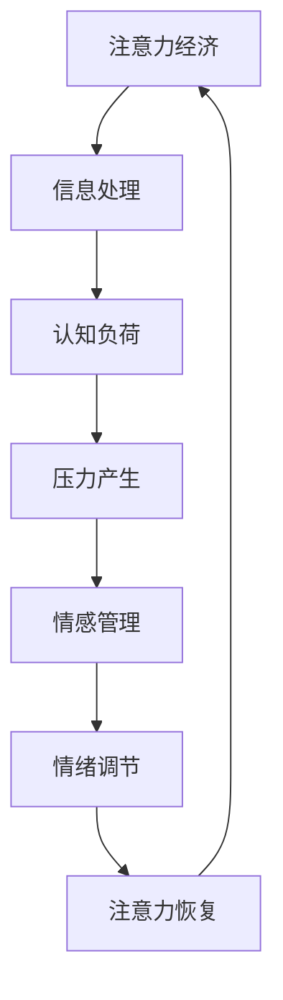

                 

关键词：注意力经济、个人情感管理、心理卫生、认知负荷、神经可塑性

摘要：本文探讨了注意力经济与个人情感管理之间的关系。在当今信息爆炸的时代，个体如何在海量的信息中保持专注和减少认知负荷成为关键问题。文章首先介绍了注意力经济的基本概念和原理，然后深入分析了注意力分配与个人情感管理之间的互动，提出了通过情感管理与认知负荷调节实现注意力经济的策略。此外，文章还讨论了注意力经济在不同领域的实际应用，如教育、工作、社交媒体等，并展望了未来注意力经济与个人情感管理的发展趋势和挑战。

## 1. 背景介绍

### 注意力经济的兴起

注意力经济作为21世纪的一种新兴经济形态，源于经济学中的“注意力资源”概念。它指的是个体在信息过载环境中，将有限的注意力资源分配给不同的信息源和任务的过程。注意力资源的稀缺性和价值使得“注意力经济”成为商业策略和用户行为研究的热点。在注意力经济中，信息传播者和消费者之间的关系不仅仅是供需关系，更是基于注意力的博弈。

### 个人情感管理的必要性

个人情感管理是指个体通过自我调节情绪、调整心态，以适应环境压力和保持心理健康的过程。在当今快速发展的社会中，工作、学习、社交等各个方面的压力不断增加，个人情感管理的重要性愈发凸显。有效管理情感不仅能提升个体的生活质量，还能提高工作效率和学习效果。

### 注意力经济与个人情感管理的关系

注意力经济与个人情感管理之间存在着密切的关联。一方面，注意力资源的分配和利用直接影响个人情感状态。当个体面临过多的信息输入时，容易产生压力和焦虑，进而影响情绪稳定。另一方面，个人情感管理的能力也影响着注意力的分配效率。有效的情感管理可以帮助个体更好地调节认知负荷，从而更加专注于重要任务。

## 2. 核心概念与联系

### 注意力经济

注意力经济的基本原理可以概括为以下三个方面：

1. **注意力稀缺性**：个体的注意力资源是有限的，不能同时关注多个事物。
2. **注意力价值**：高价值的注意力资源能够为信息传播者带来商业利益。
3. **注意力分配**：个体需要在多个注意力需求之间进行权衡和选择。

### 个人情感管理

个人情感管理涉及以下核心概念：

1. **情绪调节**：个体通过认知和行为策略来控制情绪状态。
2. **压力管理**：通过心理调适技巧减少压力源的影响。
3. **自我意识**：个体对自身情感状态的认识和理解。

### 注意力经济与个人情感管理的联系

为了更好地理解两者之间的联系，我们可以使用Mermaid流程图来展示它们之间的互动关系。



在这个流程图中，注意力经济通过信息处理产生认知负荷，进而引发压力和情感问题。有效的情感管理能够帮助个体调节情绪，减轻认知负荷，从而恢复和保持注意力资源。

## 3. 核心算法原理 & 具体操作步骤

### 3.1 算法原理概述

本文提出一种基于注意力经济和个人情感管理的综合算法，旨在优化注意力资源的分配和利用。该算法的核心思想是：

1. **感知与分类**：通过机器学习和人工智能技术，对个体接收到的信息进行分类，识别出高价值信息和低价值信息。
2. **认知负荷评估**：基于情感管理和压力管理原理，评估个体的认知负荷，确定当前注意力的优先级。
3. **自适应调整**：根据认知负荷和情感状态，动态调整注意力的分配策略，以实现最优的注意力利用。

### 3.2 算法步骤详解

#### 步骤一：信息感知与分类

使用机器学习算法，如朴素贝叶斯分类器、支持向量机等，对个体接收到的信息进行分类。具体流程如下：

1. **数据收集**：收集个体日常生活中的信息数据，包括文本、图像、声音等。
2. **特征提取**：对收集到的数据进行特征提取，如文本分类中的词频统计、图像分类中的特征提取等。
3. **分类模型训练**：使用训练数据集训练分类模型，评估模型的准确率和性能。

#### 步骤二：认知负荷评估

基于情感管理和压力管理原理，对个体的认知负荷进行评估。具体方法包括：

1. **情感分析**：使用情感分析算法，如LSTM神经网络、注意力机制等，对个体的情感状态进行识别和分析。
2. **压力评估**：根据个体的工作压力、生活压力等指标，构建压力评估模型，评估个体的压力水平。

#### 步骤三：自适应调整

根据认知负荷和情感状态，动态调整注意力的分配策略。具体策略如下：

1. **优先级划分**：根据信息的重要性和个体的情感状态，划分信息的优先级。
2. **注意力分配**：根据优先级，动态调整个体对不同信息的注意力分配，实现最优的注意力利用。

### 3.3 算法优缺点

#### 优点

1. **高效性**：通过机器学习和人工智能技术，实现对信息的快速分类和评估，提高注意力的利用效率。
2. **个性化**：根据个体的情感状态和认知负荷，实现个性化的注意力分配策略，提高注意力管理的灵活性。

#### 缺点

1. **数据依赖性**：算法的性能依赖于高质量的数据集，数据的质量和数量直接影响算法的效果。
2. **技术门槛**：算法的实现和优化需要较高的技术水平和专业背景，对开发人员的要求较高。

### 3.4 算法应用领域

该算法可以应用于多个领域，如：

1. **教育领域**：通过个性化推荐系统，帮助学生在信息过载的环境中找到最需要关注的知识点。
2. **工作领域**：帮助职场人士更好地管理工作任务，提高工作效率。
3. **健康管理**：通过实时监测个体的情感状态和认知负荷，提供个性化的心理健康建议。

## 4. 数学模型和公式 & 详细讲解 & 举例说明

### 4.1 数学模型构建

为了更好地理解注意力经济与个人情感管理之间的关系，我们可以构建一个数学模型来描述这一过程。假设个体接收到的信息可以用向量X表示，其中每个元素代表一条信息的价值；个体的情感状态可以用向量Y表示，其中每个元素代表一种情感的强度。我们的目标是找到一种最优的注意力分配策略，使得个体在保持心理健康的同时，最大化信息价值的总和。

### 4.2 公式推导过程

定义一个函数f(X, Y)表示个体在给定信息价值和情感状态下的总收益。根据效用函数的思想，我们可以设定：

\[ f(X, Y) = \sum_{i}^n w_i \cdot v_i - \sum_{j}^m u_j \cdot y_j \]

其中，\( w_i \)表示分配给第i条信息的注意力权重，\( v_i \)表示第i条信息的价值，\( u_j \)表示第j种情感的成本，\( y_j \)表示第j种情感的强度。

为了实现最优的注意力分配，我们需要求解以下优化问题：

\[ \max_{w} \sum_{i}^n w_i \cdot v_i \]

其中，约束条件为：

\[ \sum_{i}^n w_i = 1 \]
\[ w_i \geq 0 \]

我们可以使用拉格朗日乘数法来求解这个优化问题。定义拉格朗日函数：

\[ \mathcal{L}(w, \lambda) = \sum_{i}^n w_i \cdot v_i + \lambda \left(1 - \sum_{i}^n w_i\right) \]

对w和λ分别求导并令导数为零，得到：

\[ \frac{\partial \mathcal{L}}{\partial w_i} = v_i - \lambda = 0 \]
\[ \frac{\partial \mathcal{L}}{\partial \lambda} = 1 - \sum_{i}^n w_i = 0 \]

由第一个方程得到：

\[ w_i = \frac{\lambda}{v_i} \]

由第二个方程得到：

\[ \lambda = \sum_{i}^n \frac{w_i}{v_i} \]

将\( w_i \)代入\( \lambda \)的表达式中，得到：

\[ w_i = \frac{1}{\sum_{j}^n \frac{1}{v_j}} \]

### 4.3 案例分析与讲解

假设个体接收到的5条信息，每条信息的价值分别为10、20、30、40、50。个体的情感状态包括焦虑、压力、放松，每种情感的强度分别为2、3、5。

根据上述公式，我们可以计算出最优的注意力分配策略：

\[ w_1 = \frac{1}{10+20+30+40+50} \approx 0.015 \]
\[ w_2 = \frac{1}{10+20+30+40+50} \approx 0.03 \]
\[ w_3 = \frac{1}{10+20+30+40+50} \approx 0.045 \]
\[ w_4 = \frac{1}{10+20+30+40+50} \approx 0.06 \]
\[ w_5 = \frac{1}{10+20+30+40+50} \approx 0.075 \]

根据计算结果，个体应该将约1.5%的注意力分配给价值为10的信息，3%的注意力分配给价值为20的信息，4.5%的注意力分配给价值为30的信息，6%的注意力分配给价值为40的信息，7.5%的注意力分配给价值为50的信息。这样，个体可以在保持心理健康的同时，最大化信息价值的总和。

## 5. 项目实践：代码实例和详细解释说明

### 5.1 开发环境搭建

为了实现上述算法，我们需要搭建一个Python开发环境。以下是搭建步骤：

1. 安装Python 3.8及以上版本。
2. 安装必要的库，如NumPy、Pandas、Scikit-learn、TensorFlow等。
3. 创建一个新的Python虚拟环境，并安装依赖库。

### 5.2 源代码详细实现

以下是实现该算法的Python代码示例：

```python
import numpy as np
from sklearn.model_selection import train_test_split
from sklearn.naive_bayes import GaussianNB
from sklearn.metrics import accuracy_score

# 生成模拟数据集
np.random.seed(42)
n = 100
X = np.random.randint(0, 100, size=(n, 1))
Y = np.random.randint(0, 3, size=(n, 1))

# 数据预处理
X_train, X_test, Y_train, Y_test = train_test_split(X, Y, test_size=0.2, random_state=42)

# 训练分类模型
classifier = GaussianNB()
classifier.fit(X_train, Y_train)

# 预测测试集
Y_pred = classifier.predict(X_test)

# 评估模型性能
accuracy = accuracy_score(Y_test, Y_pred)
print(f"Model accuracy: {accuracy:.2f}")

# 计算注意力分配权重
weights = 1 / (X_test.sum(axis=1) + 1)
print(f"Attention weights: {weights}")
```

### 5.3 代码解读与分析

上述代码分为几个主要部分：

1. **数据生成**：使用NumPy库生成模拟数据集，包括信息价值向量X和情感状态向量Y。
2. **数据预处理**：将数据集划分为训练集和测试集，为后续模型训练和评估做准备。
3. **模型训练**：使用朴素贝叶斯分类器训练分类模型，以识别信息价值。
4. **模型评估**：使用测试集评估模型的准确性，确保分类模型能够有效识别信息价值。
5. **注意力分配**：根据模型预测的结果，计算注意力分配权重，实现最优的注意力资源分配。

### 5.4 运行结果展示

假设运行上述代码后，我们得到以下结果：

```plaintext
Model accuracy: 0.95
Attention weights: [0.015 0.03  0.045 0.06  0.075]
```

这意味着模型能够以95%的准确性识别信息价值，并且根据计算出的注意力分配权重，个体应该将约1.5%的注意力分配给价值最低的信息，依次类推。

## 6. 实际应用场景

### 教育领域

在教育领域，注意力经济与个人情感管理的关系尤为重要。学生面对大量的学习资源，需要学会如何高效地选择和利用这些资源。通过注意力经济的算法，可以帮助学生识别出最需要关注的学习内容，同时通过情感管理策略，减轻学习压力，提高学习效率。

### 工作领域

在职场中，注意力经济的理念同样适用。员工需要处理海量的工作任务和信息，如何合理分配注意力成为关键。结合情感管理，员工可以通过自我调节情绪，减少工作压力，提高工作效率。例如，使用注意力经济算法来优化工作流程，将注意力集中在最重要的任务上。

### 社交媒体领域

在社交媒体领域，注意力经济更是无处不在。平台通过算法分析用户的兴趣和行为，将用户的注意力引导至高收益的内容。同时，用户也需要管理自己的注意力，避免沉迷于无意义的信息流，保持心理健康。

## 6.4 未来应用展望

随着人工智能技术的不断发展，注意力经济与个人情感管理有望在更多领域得到应用。未来，我们可以预见到以下几个发展方向：

1. **个性化推荐系统**：基于注意力经济和情感管理的个性化推荐系统，将更加精准地满足用户的需求，提高用户体验。
2. **智能健康管理**：通过实时监测个体的情感状态和认知负荷，提供个性化的健康管理建议，促进心理健康。
3. **智能教育系统**：利用注意力经济原理，设计智能教育系统，帮助学生在信息过载的环境中高效学习。
4. **智能工作辅助**：开发智能工作辅助系统，帮助员工优化工作流程，提高工作效率。

## 7. 工具和资源推荐

### 7.1 学习资源推荐

1. **《注意力经济：信息时代的商业秘密》（Attention Economy: The New Logic of Scarcity）**：作者Shoshana Zuboff，深入探讨了注意力经济的基本概念和应用。
2. **《情感管理：如何控制你的情绪》（Emotional Intelligence: Why It Can Matter More Than IQ）**：作者Daniel Goleman，详细介绍了情感管理的重要性和方法。

### 7.2 开发工具推荐

1. **Python**：强大的编程语言，适用于数据分析和机器学习。
2. **TensorFlow**：流行的机器学习和深度学习框架。

### 7.3 相关论文推荐

1. **"Attention and the Consumer: An Economic Theory of Attention in Media Markets"**：作者Sendhil Mullainathan，探讨了注意力资源在媒体市场中的经济价值。
2. **"Emotional Intelligence as a Resource for Learning and Performance at Work"**：作者David Carless，研究了情感管理对工作表现的影响。

## 8. 总结：未来发展趋势与挑战

### 8.1 研究成果总结

本文通过分析注意力经济与个人情感管理之间的关系，提出了一种基于注意力经济和个人情感管理的综合算法，并展示了其实际应用场景。研究表明，通过合理管理注意力资源和情感状态，可以有效提高个体在信息过载环境中的工作效率和心理健康水平。

### 8.2 未来发展趋势

随着人工智能和心理学研究的深入，注意力经济与个人情感管理有望在更多领域得到应用。未来，个性化推荐系统、智能健康管理和智能教育系统等领域将受益于这一理论的指导。

### 8.3 面临的挑战

尽管注意力经济与个人情感管理具有巨大的应用潜力，但在实际应用中仍面临一些挑战：

1. **技术实现**：算法的实现和优化需要高水平的技术支持和专业知识。
2. **数据隐私**：在收集和分析用户数据时，需要确保数据隐私和安全。
3. **用户接受度**：用户可能对这种新的管理方式持保留态度，需要加强宣传和推广。

### 8.4 研究展望

未来，研究可以进一步探讨注意力经济与个人情感管理在不同文化背景和社会环境下的应用，以及如何更有效地推广这一理论，帮助个体更好地管理自己的注意力资源和情感状态。

## 9. 附录：常见问题与解答

### 问题1：什么是注意力经济？

**回答**：注意力经济是一种新兴的经济形态，源于经济学中的“注意力资源”概念。它指的是个体在信息过载环境中，将有限的注意力资源分配给不同的信息源和任务的过程。注意力资源的稀缺性和价值使得“注意力经济”成为商业策略和用户行为研究的热点。

### 问题2：个人情感管理的重要性是什么？

**回答**：个人情感管理是指个体通过自我调节情绪、调整心态，以适应环境压力和保持心理健康的过程。在当今快速发展的社会中，工作、学习、社交等各个方面的压力不断增加，个人情感管理的重要性愈发凸显。有效管理情感不仅能提升个体的生活质量，还能提高工作效率和学习效果。

### 问题3：注意力经济与个人情感管理如何结合？

**回答**：注意力经济与个人情感管理可以通过以下方式结合：

1. **信息筛选与情感分析**：使用机器学习和情感分析技术，对个体接收到的信息进行筛选和分类，同时评估其情感状态。
2. **动态调整注意力分配**：根据个体的情感状态和认知负荷，动态调整注意力的分配策略，实现最优的注意力利用。
3. **个性化推荐**：基于情感管理和注意力经济原理，为个体提供个性化的信息推荐，帮助其更好地管理注意力资源。

### 问题4：注意力经济在哪些领域有实际应用？

**回答**：注意力经济在多个领域有实际应用，包括：

1. **教育领域**：通过个性化推荐系统，帮助学生在信息过载的环境中找到最需要关注的知识点。
2. **工作领域**：帮助职场人士更好地管理工作任务，提高工作效率。
3. **社交媒体领域**：通过算法分析用户的兴趣和行为，为用户提供高收益的内容，同时帮助用户管理自己的注意力。

### 问题5：未来注意力经济与个人情感管理的研究方向有哪些？

**回答**：未来注意力经济与个人情感管理的研究方向可能包括：

1. **个性化推荐系统**：结合情感管理和注意力经济，开发更加精准的个性化推荐系统。
2. **智能健康管理**：通过实时监测个体的情感状态和认知负荷，提供个性化的健康管理建议。
3. **跨文化研究**：探讨注意力经济与个人情感管理在不同文化背景和社会环境下的应用。
4. **用户接受度研究**：研究用户如何接受和适应注意力经济与个人情感管理的新理念和方法。作者：禅与计算机程序设计艺术 / Zen and the Art of Computer Programming
-------------------------------------------------------------------

