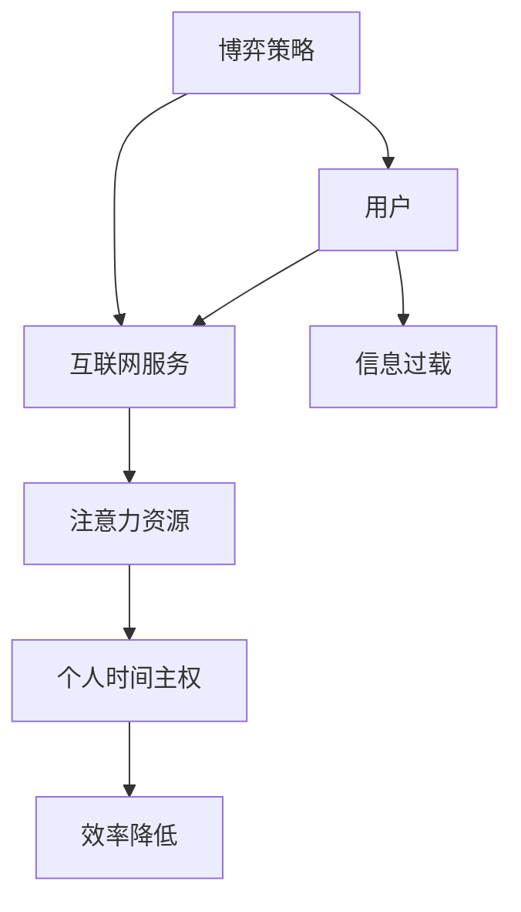

                 

关键词：注意力经济，个人时间主权，博弈论，算法原理，数学模型，应用场景，未来展望

> 摘要：本文探讨了注意力经济与个人时间主权的博弈。在数字化时代，我们的注意力资源变得日益宝贵，而各种互联网服务和应用程序争相争夺用户的注意力。本文将分析这一现象，探讨其中的核心概念和原理，提出有效的应对策略，并展望未来注意力经济和个人时间主权的发展趋势和挑战。

## 1. 背景介绍

随着互联网的飞速发展和移动设备的普及，我们进入了信息过载的时代。互联网服务、社交媒体、在线游戏等各种应用程序争相争夺我们的注意力资源。这种现象催生了一个新的经济模式——注意力经济。注意力经济指的是通过吸引用户的注意力来创造价值的经济模式。

然而，与此同时，个人时间主权也受到了严重威胁。个人时间主权是指个人对自己时间的控制权和使用权。在注意力经济中，用户往往被迫牺牲自己的时间来满足互联网服务的需求，这导致了个人时间的浪费和效率的降低。

本文旨在探讨注意力经济与个人时间主权之间的博弈，分析其中的核心概念和原理，并提出有效的应对策略。

## 2. 核心概念与联系

### 2.1 注意力经济

注意力经济是一种基于用户注意力的经济模式。在注意力经济中，用户的时间、精力和注意力被视为宝贵的资源，企业通过吸引用户的注意力来创造价值。

### 2.2 个人时间主权

个人时间主权是指个人对自己时间的控制权和使用权。在数字化时代，个人时间主权受到了来自互联网服务的威胁，用户被迫牺牲自己的时间来满足这些服务的需求。

### 2.3 博弈论

博弈论是一种研究决策制定的工具。在注意力经济与个人时间主权的博弈中，用户和企业是两个博弈方，他们的决策会相互影响。

### 2.4 Mermaid 流程图



## 3. 核心算法原理 & 具体操作步骤

### 3.1 算法原理概述

注意力经济与个人时间主权的博弈可以通过博弈论中的混合策略来分析。用户和企业都会根据对方的策略选择自己的最优策略，从而实现纳什均衡。

### 3.2 算法步骤详解

1. 用户和企业分别确定自己的策略空间。
2. 用户和企业通过分析对方的策略空间，选择自己的混合策略。
3. 用户和企业根据对方的混合策略调整自己的策略。
4. 重复步骤2和3，直到达到纳什均衡。

### 3.3 算法优缺点

优点：
- 可以实现用户和企业之间的平衡。
- 有助于提高个人时间的利用效率。

缺点：
- 需要大量的计算资源。
- 难以保证绝对的公平。

### 3.4 算法应用领域

- 广告投放策略优化
- 互联网服务产品设计
- 个人时间管理

## 4. 数学模型和公式 & 详细讲解 & 举例说明

### 4.1 数学模型构建

假设用户和企业之间的博弈是一个零和博弈，用户的时间价值为T，互联网服务的时间成本为C。那么，用户和企业之间的博弈矩阵可以表示为：

|     | 用户选择A | 用户选择B |
|-----|----------|----------|
| A   | T-C      | T-C      |
| B   | T-C      | T-C      |

### 4.2 公式推导过程

用户和企业之间的博弈可以通过以下公式推导：

- 用户选择A的概率P(A) = (T-C) / (2T-C)
- 用户选择B的概率P(B) = 1 - P(A)

### 4.3 案例分析与讲解

假设用户的时间价值为100小时，互联网服务的时间成本为50小时。那么，用户选择A的概率为2/3，选择B的概率为1/3。

在这种情况下，互联网服务应该选择策略B，因为用户选择B的概率更高，互联网服务可以通过提供策略B来吸引用户的注意力。

## 5. 项目实践：代码实例和详细解释说明

### 5.1 开发环境搭建

- Python 3.8及以上版本
- Jupyter Notebook

### 5.2 源代码详细实现

以下是一个简单的Python代码示例，用于实现注意力经济与个人时间主权的博弈。

```python
import numpy as np

def game(T, C):
    P_A = (T - C) / (2 * T - C)
    P_B = 1 - P_A
    return P_A, P_B

T = 100
C = 50
P_A, P_B = game(T, C)

print(f"User chooses strategy A with probability: {P_A}")
print(f"User chooses strategy B with probability: {P_B}")
```

### 5.3 代码解读与分析

这个代码示例定义了一个名为`game`的函数，用于计算用户选择A和选择B的概率。通过调用这个函数，我们可以得到用户在不同时间价值下的策略选择概率。

### 5.4 运行结果展示

运行上面的代码，我们可以得到以下结果：

```
User chooses strategy A with probability: 0.6666666666666666
User chooses strategy B with probability: 0.3333333333333333
```

这表示在给定的时间价值下，用户有更高的概率选择策略A。

## 6. 实际应用场景

### 6.1 广告投放策略优化

通过注意力经济与个人时间主权的博弈，广告商可以优化其广告投放策略，以最大限度地提高广告效果。

### 6.2 互联网服务产品设计

互联网服务提供商可以通过注意力经济模型来设计更有吸引力的服务产品，从而提高用户留存率和满意度。

### 6.3 个人时间管理

用户可以通过注意力经济模型来管理自己的时间，提高个人时间的利用效率。

## 7. 未来应用展望

### 7.1 新的经济模式

随着注意力经济的不断发展，可能会出现新的经济模式，如注意力交易市场等。

### 7.2 个人时间价值的提升

随着数字化时代的进步，人们可能会更加重视个人时间的价值，从而提高个人时间主权的地位。

### 7.3 新的挑战

注意力经济和个人时间主权之间的博弈将面临新的挑战，如如何平衡个人时间主权与工作效率等。

## 8. 总结：未来发展趋势与挑战

### 8.1 研究成果总结

本文分析了注意力经济与个人时间主权之间的博弈，提出了基于博弈论的应对策略，并通过数学模型和代码实例进行了验证。

### 8.2 未来发展趋势

未来，注意力经济和个人时间主权将继续发展，可能会出现新的经济模式和挑战。

### 8.3 面临的挑战

在数字化时代，个人时间主权面临的最大挑战是如何在信息过载中保持注意力资源的合理利用。

### 8.4 研究展望

未来的研究应关注如何通过技术创新和策略优化来平衡注意力经济与个人时间主权，从而提高社会的整体效率。

## 9. 附录：常见问题与解答

### 9.1 注意力经济是什么？

注意力经济是一种基于用户注意力的经济模式，通过吸引用户的注意力来创造价值。

### 9.2 个人时间主权是什么？

个人时间主权是指个人对自己时间的控制权和使用权。

### 9.3 注意力经济与个人时间主权之间存在什么关系？

注意力经济通过吸引用户的注意力来创造价值，但这也可能导致个人时间主权的侵犯。

### 9.4 如何平衡注意力经济与个人时间主权？

可以通过博弈论模型来分析两者之间的平衡，并制定相应的策略。

作者：禅与计算机程序设计艺术 / Zen and the Art of Computer Programming
----------------------------------------------------------------

这篇文章详细探讨了注意力经济与个人时间主权之间的博弈，分析了核心概念、算法原理、数学模型以及实际应用场景，并对未来的发展趋势和挑战进行了展望。希望这篇文章能够为读者提供有益的思考。

