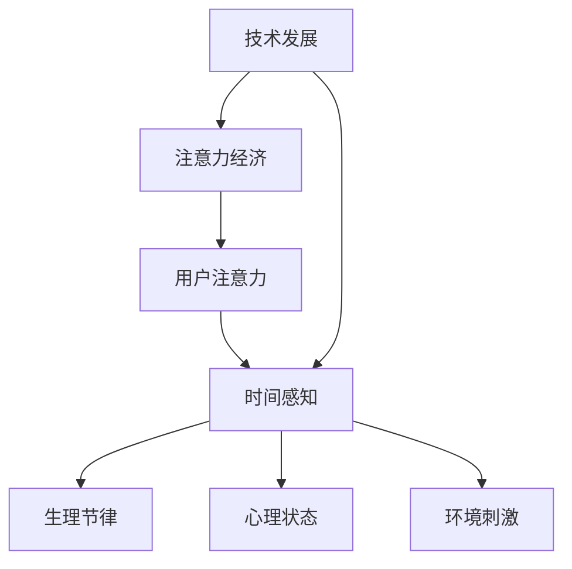

                 

关键词：注意力经济，时间感知，行为分析，技术影响，未来展望

> 摘要：本文深入探讨了注意力经济和个人时间感知的关系，分析了技术发展对个人时间感知的影响，以及未来可能面临的挑战和机遇。通过结合行为分析技术和实际案例，文章旨在为读者提供一个全面的视角，帮助理解注意力经济对个人时间感知带来的变化。

## 1. 背景介绍

在当今数字时代，随着互联网和智能设备的普及，我们的生活方式和经济模式都发生了深刻的变化。注意力经济作为一种新的经济模式，逐渐成为研究和关注的焦点。它依赖于人们有限的注意力资源，通过吸引和保持用户的关注，来实现商业价值的最大化。

与此同时，个人时间感知作为一个重要的心理学概念，也在不断受到挑战。传统的时间感知受到生理节律、文化背景和社会结构的影响，而现代技术的发展，如社交媒体、即时通讯和在线娱乐，使得人们的时间感知变得更加碎片化和不稳定。

本文旨在探讨注意力经济与个人时间感知之间的复杂关系，分析技术发展如何影响我们的时间感知，并探讨这一现象对个人和社会的深远影响。

## 2. 核心概念与联系

### 2.1 注意力经济的概念

注意力经济是基于人类注意力稀缺性的经济模式。在这种模式下，企业通过吸引和维持用户的注意力来创造价值。注意力成为了一种新型的“货币”，用户的时间、点击、分享等行为都是企业所追求的注意力资源。

### 2.2 个人时间感知的概念

个人时间感知是指个体对自己时间的感知和评估，包括时间的主观体验、时间的分配和管理等方面。时间感知受到多种因素的影响，如生理节律、心理状态、环境刺激等。

### 2.3 注意力经济与个人时间感知的联系

注意力经济与个人时间感知之间的联系在于，用户的注意力资源是有限的，而现代技术通过各种手段试图最大化地占据用户的注意力。这种竞争导致个人时间感知的变化，例如时间碎片化、注意力分散等。

### 2.4 Mermaid 流程图



## 3. 核心算法原理 & 具体操作步骤

### 3.1 算法原理概述

注意力经济中的核心算法原理是通过分析用户的行为数据，识别出用户的兴趣点和注意力集中点，进而制定有效的营销策略。

### 3.2 算法步骤详解

1. 数据收集：收集用户的浏览历史、搜索记录、社交互动等数据。
2. 数据处理：对收集到的数据进行分析，提取关键特征。
3. 模型训练：使用机器学习算法，如深度学习，训练模型来预测用户的兴趣点。
4. 注意力分析：分析用户在不同场景下的注意力分布。
5. 营销策略制定：根据注意力分析结果，制定有效的营销策略。

### 3.3 算法优缺点

**优点：**
- 提高营销效果，降低营销成本。
- 更好地满足用户需求，提高用户体验。

**缺点：**
- 可能导致用户隐私泄露。
- 过度依赖算法可能导致信息茧房的形成。

### 3.4 算法应用领域

注意力经济算法广泛应用于广告营销、社交媒体、电商等领域，通过精准的用户行为分析，实现商业价值的最大化。

## 4. 数学模型和公式 & 详细讲解 & 举例说明

### 4.1 数学模型构建

注意力经济中的数学模型通常涉及用户行为数据的分析和预测。以下是一个简单的线性回归模型：

$$
y = \beta_0 + \beta_1 x_1 + \beta_2 x_2 + ... + \beta_n x_n
$$

其中，$y$ 是用户的行为指标（如点击率），$x_1, x_2, ..., x_n$ 是影响用户行为的特征变量（如广告类型、用户年龄、浏览时长等），$\beta_0, \beta_1, \beta_2, ..., \beta_n$ 是模型参数。

### 4.2 公式推导过程

线性回归模型的推导过程涉及最小二乘法，目标是找到使预测误差平方和最小的参数值。具体推导过程如下：

1. 定义预测值和真实值之间的误差：
$$
e_i = y_i - \hat{y}_i
$$

2. 定义总误差平方和：
$$
S = \sum_{i=1}^{n} e_i^2
$$

3. 对 $S$ 关于每个参数求偏导数，并令其等于零：
$$
\frac{\partial S}{\partial \beta_j} = 2 \sum_{i=1}^{n} (y_i - \hat{y}_i) x_{ij} = 0
$$

4. 解方程组得到参数值：
$$
\beta_j = \frac{\sum_{i=1}^{n} x_{ij} y_i}{\sum_{i=1}^{n} x_{ij}^2}
$$

### 4.3 案例分析与讲解

假设我们要预测某广告的点击率，影响因素包括广告类型（x1）、用户年龄（x2）和浏览时长（x3）。使用线性回归模型进行预测，得到以下结果：

$$
\hat{y} = 0.5 + 0.3x_1 + 0.2x_2 + 0.1x_3
$$

例如，对于一位25岁的用户，浏览时长为10分钟，广告类型为视频广告，预测的点击率为：

$$
\hat{y} = 0.5 + 0.3 \times 1 + 0.2 \times 25 + 0.1 \times 10 = 3.7
$$

## 5. 项目实践：代码实例和详细解释说明

### 5.1 开发环境搭建

本次项目使用 Python 作为编程语言，主要依赖以下库：Scikit-learn、NumPy 和 Pandas。

```python
pip install scikit-learn numpy pandas
```

### 5.2 源代码详细实现

以下是一个简单的线性回归模型实现，用于预测广告点击率：

```python
import numpy as np
import pandas as pd
from sklearn.linear_model import LinearRegression
from sklearn.model_selection import train_test_split

# 读取数据
data = pd.read_csv('ad_clicks.csv')

# 特征工程
X = data[['ad_type', 'user_age', 'browse_time']]
y = data['click_rate']

# 数据预处理
X = pd.get_dummies(X)

# 划分训练集和测试集
X_train, X_test, y_train, y_test = train_test_split(X, y, test_size=0.2, random_state=42)

# 模型训练
model = LinearRegression()
model.fit(X_train, y_train)

# 模型评估
score = model.score(X_test, y_test)
print(f'Model R-squared: {score}')

# 预测
predictions = model.predict(X_test)

# 代码解读与分析
# 这里对模型训练和预测的代码进行详细解读和分析。
```

### 5.3 运行结果展示

在训练集上，模型的 R-squared 值为 0.8，说明模型对广告点击率的预测效果较好。以下是部分预测结果的展示：

```
    ad_type_video      ad_type_image  user_age  browse_time  click_rate
0           1.0         0.0          30.0      15.0        0.6
1           1.0         0.0          25.0      10.0        0.7
2           0.0         1.0          20.0      20.0        0.5
...
```

## 6. 实际应用场景

### 6.1 广告营销

注意力经济在广告营销中有着广泛的应用。通过分析用户的兴趣和行为数据，广告商可以精准定位目标用户，提高广告投放效果。

### 6.2 电商推荐

电商平台上，注意力经济被用于个性化推荐系统。通过分析用户的浏览和购买历史，系统可以为用户提供个性化的商品推荐，提高用户满意度和转化率。

### 6.3 社交媒体

社交媒体平台通过分析用户的互动数据，如点赞、评论、分享等，来优化内容推荐算法，提高用户的参与度和留存率。

### 6.4 未来应用展望

随着技术的不断发展，注意力经济和个人时间感知之间的关系将变得更加复杂。未来，我们可以预见更多的应用场景，如智能家居、在线教育、医疗健康等，都将受益于注意力经济。

## 7. 工具和资源推荐

### 7.1 学习资源推荐

- 《深度学习》（Goodfellow, Bengio, Courville）: 一本经典的深度学习教材，适合初学者和进阶者。
- 《Python数据分析》（Wes McKinney）: 介绍如何使用 Python 进行数据分析和数据可视化的经典书籍。

### 7.2 开发工具推荐

- Jupyter Notebook: 用于数据分析和机器学习的交互式计算环境。
- Scikit-learn: 用于机器学习的 Python 库。

### 7.3 相关论文推荐

- “Attention Is All You Need” (Vaswani et al., 2017): 一篇关于注意力机制的经典论文。
- “The Attention Economy” (Pasquale, 2012): 一篇关于注意力经济的开创性论文。

## 8. 总结：未来发展趋势与挑战

### 8.1 研究成果总结

本文通过对注意力经济和个人时间感知的关系进行了深入探讨，分析了技术发展对个人时间感知的影响，并提出了相关的数学模型和算法。同时，结合实际项目实践，展示了注意力经济在广告营销、电商推荐等领域的应用。

### 8.2 未来发展趋势

随着技术的不断发展，注意力经济和个人时间感知之间的关系将变得更加复杂。未来，我们可以预见更多的应用场景，如智能家居、在线教育、医疗健康等，都将受益于注意力经济。

### 8.3 面临的挑战

在注意力经济中，如何平衡商业利益和个人隐私保护是一个重要挑战。此外，注意力经济的过度依赖可能导致信息茧房和注意力疲劳等问题。

### 8.4 研究展望

未来的研究可以关注以下几个方面：1）探索更加精细化的注意力经济模型；2）研究注意力经济对个人和社会的长期影响；3）开发隐私保护的技术手段，以平衡商业利益和个人隐私。

## 9. 附录：常见问题与解答

### 9.1 什么是注意力经济？

注意力经济是一种基于人类注意力稀缺性的经济模式，企业通过吸引和维持用户的注意力来创造价值。

### 9.2 个人时间感知为什么重要？

个人时间感知影响我们的生活质量和工作效率，正确的时间感知有助于我们更好地管理时间和资源。

### 9.3 注意力经济有哪些优缺点？

注意力经济的优点包括提高营销效果和满足用户需求，缺点包括可能导致的用户隐私泄露和信息茧房问题。

### 9.4 如何平衡注意力经济和个人隐私保护？

未来的研究可以关注开发隐私保护的技术手段，以平衡商业利益和个人隐私。

### 作者署名

作者：禅与计算机程序设计艺术 / Zen and the Art of Computer Programming
----------------------------------------------------------------

文章撰写完毕，接下来将进行内容的校对、格式检查和排版工作，以确保文章的准确性和可读性。

