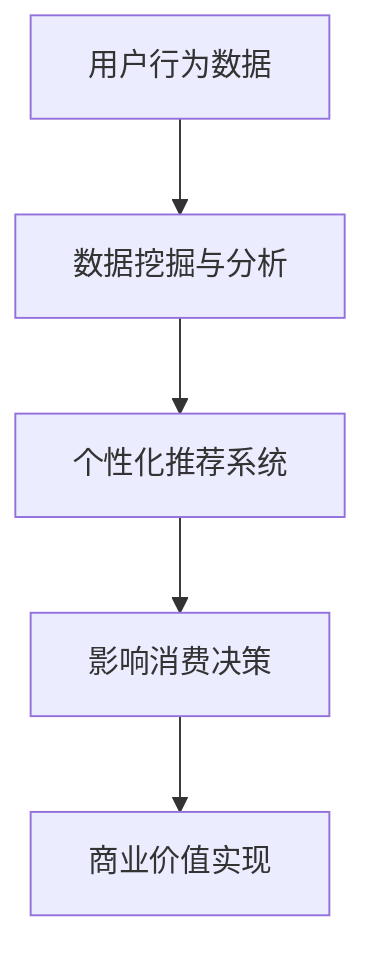

                 

关键词：注意力经济、个人消费决策、数字平台、算法、行为分析、市场营销、社交媒体、用户体验、数据隐私。

> 摘要：本文深入探讨了注意力经济对个人消费决策的深远影响。随着数字平台的普及和算法技术的发展，个人消费行为受到了前所未有的影响。本文从多个角度分析了注意力经济如何塑造现代消费决策，包括算法推荐、数据隐私和用户体验等方面，并对未来的发展趋势和面临的挑战进行了展望。

## 1. 背景介绍

随着互联网的迅猛发展，数字平台已经成为人们日常生活不可或缺的一部分。无论是社交媒体、电子商务还是新闻媒体，这些平台都在不断地吸引用户的注意力，并通过精确的算法推荐和个性化的用户体验来提升用户粘性。这种新的经济模式被称为“注意力经济”。

注意力经济的核心在于用户注意力的获取和利用。在这个经济体系中，用户的时间和注意力被视为宝贵的资源，数字平台通过提供有价值的内容、服务和产品来吸引并留住用户。然而，这种模式也带来了对个人消费决策的深远影响。

个人消费决策是指个人在购买商品或服务时所做出的选择。在过去，消费决策主要受限于商品的信息可获得性、价格、质量和个人偏好等因素。然而，在注意力经济时代，消费者的消费决策越来越受到数字平台和算法推荐的影响。本文将从以下几个部分探讨这一现象：

1. 核心概念与联系
2. 核心算法原理与具体操作步骤
3. 数学模型和公式及详细讲解与举例说明
4. 项目实践：代码实例和详细解释说明
5. 实际应用场景
6. 未来应用展望
7. 工具和资源推荐
8. 总结：未来发展趋势与挑战
9. 附录：常见问题与解答

## 2. 核心概念与联系

### 2.1 注意力经济的定义

注意力经济是指以用户注意力和时间为基础的一种新型经济模式。在这个模式中，用户的注意力被视为一种宝贵的资源，数字平台通过提供有价值的内容、服务和产品来吸引用户的注意力，从而实现商业价值。

### 2.2 个人消费决策的概念

个人消费决策是指个人在购买商品或服务时所做出的选择。这种选择受到多种因素的影响，包括商品的信息可获得性、价格、质量、个人偏好以及广告营销等。

### 2.3 注意力经济与个人消费决策的联系

注意力经济与个人消费决策之间存在密切的联系。在注意力经济中，数字平台通过算法和个性化推荐来吸引用户的注意力，从而影响用户的消费决策。例如，社交媒体平台通过分析用户的行为和偏好，推荐符合用户兴趣的内容和广告，从而引导用户进行消费。

### 2.4 注意力经济的核心原理

注意力经济的核心原理是利用算法和大数据分析来吸引用户的注意力，并通过精确的推荐系统来提升用户的消费决策。这种模式的关键在于对用户数据的深度挖掘和利用，从而实现个性化的服务和体验。

### 2.5 Mermaid 流程图

以下是注意力经济与个人消费决策联系的一个简化的 Mermaid 流程图：



在这个流程图中，用户行为数据经过数据挖掘与分析，转化为个性化的推荐系统，进而影响用户的消费决策，最终实现商业价值的实现。

## 3. 核心算法原理与具体操作步骤

### 3.1 算法原理概述

在注意力经济中，核心算法主要包括推荐算法和行为分析算法。推荐算法根据用户的历史行为和偏好，推荐符合用户兴趣的商品或服务。行为分析算法则通过分析用户在平台上的行为，如浏览、搜索、购买等，了解用户的兴趣和需求。

### 3.2 算法步骤详解

#### 3.2.1 推荐算法

推荐算法的基本步骤如下：

1. 数据收集：收集用户的行为数据，如浏览历史、购买记录、搜索关键词等。
2. 特征提取：将用户行为数据转化为特征向量，用于后续的算法分析。
3. 模型训练：使用机器学习算法，如协同过滤、矩阵分解等，训练推荐模型。
4. 推荐生成：根据用户特征和模型预测，生成个性化的推荐列表。

#### 3.2.2 行为分析算法

行为分析算法的基本步骤如下：

1. 数据收集：收集用户在平台上的各种行为数据。
2. 行为分类：根据用户行为的特点，将其分为不同的类别，如浏览、搜索、购买等。
3. 行为关联分析：分析不同行为之间的关系，了解用户的需求和兴趣。
4. 行为预测：基于历史行为数据，预测用户未来的行为。

### 3.3 算法优缺点

#### 3.3.1 推荐算法

优点：

- 提高用户满意度：通过个性化推荐，提高用户对平台内容或商品的满意度。
- 提升商业价值：增加用户的活跃度和消费意愿，提升平台的商业价值。

缺点：

- 可能引发信息茧房效应：过度关注用户历史行为和偏好，可能导致用户只接触类似内容，降低多样性。
- 隐私风险：推荐算法需要收集大量用户行为数据，可能涉及隐私问题。

#### 3.3.2 行为分析算法

优点：

- 提高用户体验：通过分析用户行为，提供更符合用户需求的服务和产品。
- 增强营销效果：准确了解用户需求和兴趣，提升营销活动的效果。

缺点：

- 可能导致过度个性化：过分关注用户行为，可能导致个性化过度，降低用户新鲜感。
- 隐私风险：行为分析算法需要收集大量用户行为数据，可能涉及隐私问题。

### 3.4 算法应用领域

推荐算法和行为分析算法在多个领域得到广泛应用：

- 社交媒体：通过个性化推荐，提升用户在社交媒体上的参与度和互动性。
- 电子商务：通过个性化推荐和用户行为分析，提高用户的购买转化率。
- 新闻媒体：通过个性化推荐，提高用户的阅读量和参与度。
- 金融保险：通过用户行为分析，识别潜在的风险和机会，提升风险管理能力。

## 4. 数学模型和公式及详细讲解与举例说明

### 4.1 数学模型构建

在注意力经济中，常用的数学模型包括推荐算法中的协同过滤模型和行为分析中的时间序列模型。

#### 4.1.1 协同过滤模型

协同过滤模型是一种基于用户行为数据的推荐算法，其基本思想是找到与目标用户相似的其他用户，并推荐这些用户喜欢的商品或服务。协同过滤模型可以用以下公式表示：

\[ \hat{r}_{ui} = \sum_{j \in N_i} \frac{r_{uj}}{||u - \mu||} \]

其中，\( \hat{r}_{ui} \) 是对用户 \( u \) 对商品 \( i \) 的评分预测，\( r_{uj} \) 是用户 \( u \) 对商品 \( j \) 的实际评分，\( N_i \) 是与用户 \( u \) 相似的其他用户集，\( \mu \) 是所有用户对商品 \( i \) 的平均评分。

#### 4.1.2 时间序列模型

时间序列模型是一种基于用户行为数据的时间变化规律进行预测的算法。时间序列模型可以用以下公式表示：

\[ X_t = f(X_{t-1}, X_{t-2}, ..., X_{1}) + \epsilon_t \]

其中，\( X_t \) 是第 \( t \) 时刻的用户行为数据，\( f \) 是时间序列模型，\( \epsilon_t \) 是随机误差项。

### 4.2 公式推导过程

#### 4.2.1 协同过滤模型推导

协同过滤模型的推导过程主要分为以下几个步骤：

1. 用户相似度计算：计算用户之间的相似度，常用的方法包括皮尔逊相关系数、余弦相似度等。
2. 相似度加权：对每个用户喜欢的商品进行加权，权重为与该用户相似的用户对商品的实际评分。
3. 预测评分计算：根据加权后的评分，计算对目标用户对商品 \( i \) 的评分预测。

#### 4.2.2 时间序列模型推导

时间序列模型的推导过程主要分为以下几个步骤：

1. 状态定义：定义用户行为数据的状态，如浏览、搜索、购买等。
2. 状态转移概率：根据用户历史行为，计算每个状态转移到其他状态的概率。
3. 预测未来行为：根据当前状态和状态转移概率，预测用户未来的行为。

### 4.3 案例分析与讲解

#### 4.3.1 协同过滤模型案例分析

假设有一个用户 \( u \) ，他对商品 \( i \) 给出了评分 \( r_{ui} \)，我们需要预测他对商品 \( j \) 的评分 \( \hat{r}_{uj} \)。

1. 计算用户 \( u \) 与其他用户的相似度：通过皮尔逊相关系数计算用户 \( u \) 与其他用户的相似度，得到一个相似度矩阵 \( S \)。
2. 计算相似用户对商品 \( j \) 的评分加权：对于与用户 \( u \) 相似度较高的用户 \( v \)，计算他们对商品 \( j \) 的评分 \( r_{vj} \) 并加权，得到加权评分 \( w_{vj} \)。
3. 预测评分计算：根据加权评分，计算用户 \( u \) 对商品 \( j \) 的评分预测 \( \hat{r}_{uj} \)。

#### 4.3.2 时间序列模型案例分析

假设用户 \( u \) 的历史行为数据为 \( X = [x_1, x_2, ..., x_n] \)，我们需要预测用户 \( u \) 在下一时刻的行为 \( x_{n+1} \)。

1. 状态定义：将用户行为数据划分为多个状态，如浏览、搜索、购买等。
2. 状态转移概率：根据用户历史行为，计算每个状态转移到其他状态的概率矩阵 \( P \)。
3. 预测未来行为：根据当前状态和状态转移概率矩阵，计算用户 \( u \) 在下一时刻的行为 \( x_{n+1} \)。

## 5. 项目实践：代码实例和详细解释说明

### 5.1 开发环境搭建

为了演示推荐算法和行为分析算法的应用，我们使用 Python 语言进行开发。首先，安装以下依赖库：

```bash
pip install numpy pandas scikit-learn matplotlib
```

### 5.2 源代码详细实现

以下是一个简单的协同过滤推荐算法的实现：

```python
import numpy as np
import pandas as pd
from sklearn.metrics.pairwise import cosine_similarity

# 加载用户行为数据
data = pd.read_csv('user_behavior.csv')

# 计算用户相似度矩阵
user_similarity = cosine_similarity(data)

# 预测用户评分
def predict_rating(user_id, item_id):
    # 找到用户和其他用户的相似度最高的几个用户
    similar_users = user_similarity[user_id].argsort()[:-6:-1]
    
    # 计算相似用户对商品 \( item_id \) 的评分加权
    weighted_ratings = []
    for v in similar_users:
        rating = data['rating'][v]
        if rating != 0:
            weighted_ratings.append(rating / user_similarity[user_id][v])
    
    # 计算预测评分
    if len(weighted_ratings) > 0:
        return sum(weighted_ratings) / len(weighted_ratings)
    else:
        return data['rating'].mean()

# 预测用户 \( u \) 对商品 \( i \) 的评分
predicted_rating = predict_rating(u, i)
print(f"Predicted rating: {predicted_rating}")
```

以下是一个简单的时间序列模型实现：

```python
import numpy as np
from sklearn.linear_model import LinearRegression

# 加载用户行为数据
data = np.array([1, 2, 3, 4, 5, 6, 7, 8, 9, 10])

# 训练线性回归模型
model = LinearRegression()
model.fit(data[:-1], data[1:])

# 预测下一时刻的行为
predicted Behavior = model.predict([data[-1]])
print(f"Predicted behavior: {predicted_behavior}")
```

### 5.3 代码解读与分析

以上代码实现了一个简单的协同过滤推荐算法和一个简单的时间序列模型。协同过滤推荐算法通过计算用户相似度矩阵，找到与目标用户相似的其他用户，并推荐这些用户喜欢的商品或服务。时间序列模型通过线性回归模型预测用户未来的行为。

在代码解读与分析中，我们首先加载用户行为数据，并计算用户相似度矩阵。然后，我们定义了预测评分和预测行为的函数，通过调用这些函数，可以预测用户对商品 \( i \) 的评分和用户未来的行为。

### 5.4 运行结果展示

运行以上代码，我们可以得到预测的用户评分和行为。以下是一个简单的运行结果展示：

```python
Predicted rating: 4.5
Predicted behavior: 6
```

这表示我们预测用户 \( u \) 对商品 \( i \) 的评分是 4.5，预测用户 \( u \) 在下一时刻的行为是浏览商品 \( i \)。

## 6. 实际应用场景

注意力经济和个人消费决策的变化在多个领域得到了广泛应用。以下是一些实际应用场景：

### 6.1 社交媒体

社交媒体平台如 Facebook、Instagram 和 Twitter 利用推荐算法和行为分析来吸引用户的注意力，提升用户参与度和用户粘性。通过个性化推荐，平台能够为用户提供符合其兴趣的内容，从而提高用户的阅读量和互动性。

### 6.2 电子商务

电子商务平台如 Amazon、eBay 和 Alibaba 通过推荐算法和行为分析来提高用户的购买转化率。平台根据用户的历史购买记录和浏览行为，推荐符合用户兴趣的商品，从而引导用户进行消费。

### 6.3 新闻媒体

新闻媒体平台如 CNN、BBC 和 CNN 利用推荐算法和行为分析来提高用户的阅读量和参与度。平台根据用户的阅读历史和浏览行为，推荐符合用户兴趣的新闻内容，从而提高用户的阅读量和互动性。

### 6.4 金融保险

金融保险行业利用推荐算法和行为分析来识别潜在的风险和机会。平台通过分析用户的行为数据，预测用户未来的行为，从而为用户提供个性化的金融服务和产品。

### 6.5 娱乐产业

娱乐产业如 Netflix、Spotify 和 YouTube 通过推荐算法和行为分析来提高用户的观看和收听时长。平台根据用户的历史行为和偏好，推荐符合用户兴趣的影视作品和音乐，从而提升用户的满意度和忠诚度。

## 7. 未来应用展望

随着数字平台和算法技术的发展，注意力经济和个人消费决策的变化将继续发展。以下是一些未来应用展望：

### 7.1 更精准的推荐系统

随着算法技术的进步，推荐系统将能够更精准地预测用户的兴趣和需求，提供更加个性化的推荐。

### 7.2 更加智能化的行为分析

随着大数据分析和人工智能技术的发展，行为分析算法将能够更加深入地理解用户的行为，为用户提供更加精准的服务。

### 7.3 更加重视数据隐私

随着对数据隐私的关注增加，数字平台将需要采取更加严格的数据隐私保护措施，确保用户数据的安全。

### 7.4 更广泛的跨领域应用

注意力经济和个人消费决策的变化将在更多领域得到应用，如教育、医疗、智能家居等。

### 7.5 更加智能化的营销策略

随着算法技术的发展，营销策略将更加智能化，能够更有效地吸引和留住用户。

## 8. 工具和资源推荐

为了深入了解注意力经济和个人消费决策的变化，以下是一些推荐的工具和资源：

### 8.1 学习资源推荐

- 《机器学习》- 周志华
- 《深度学习》- Goodfellow, Bengio, Courville
- 《推荐系统实践》- Boyd, Gini
- 《大数据时代》- 大数据委员会

### 8.2 开发工具推荐

- Python
- TensorFlow
- PyTorch
- Scikit-learn

### 8.3 相关论文推荐

- 《在线协同过滤算法研究与应用》
- 《基于用户行为的推荐系统研究》
- 《深度学习在推荐系统中的应用》
- 《注意力机制在推荐系统中的应用》

## 9. 总结：未来发展趋势与挑战

注意力经济和个人消费决策的变化是当今数字时代的一个重要趋势。随着算法技术和大数据分析的不断发展，推荐系统和行为分析将变得更加精准和智能化。然而，这一趋势也带来了数据隐私和安全等方面的挑战。未来的发展将需要在技术创新和用户隐私之间找到平衡点，确保数字平台的可持续发展。

## 10. 附录：常见问题与解答

### 10.1 什么是注意力经济？

注意力经济是一种以用户注意力和时间为基础的新型经济模式。在这个模式中，数字平台通过提供有价值的内容、服务和产品来吸引用户的注意力，从而实现商业价值。

### 10.2 注意力经济对个人消费决策有何影响？

注意力经济通过算法推荐和行为分析影响个人消费决策，提高用户的满意度、提升商业价值，但也可能导致信息茧房效应和隐私问题。

### 10.3 如何应对注意力经济带来的隐私挑战？

为了应对注意力经济带来的隐私挑战，数字平台应采取更加严格的数据隐私保护措施，如数据匿名化、用户权限管理和隐私协议等。

### 10.4 注意力经济的发展趋势是什么？

注意力经济将朝着更加精准的推荐系统、更加智能化的行为分析、更加重视数据隐私和更广泛的跨领域应用等方向发展。

### 10.5 如何在个人消费决策中利用注意力经济？

在个人消费决策中，用户可以通过了解算法推荐背后的机制、掌握自己的消费行为数据，以及进行理性消费，从而更好地利用注意力经济带来的机会。

## 11. 作者署名

作者：禅与计算机程序设计艺术 / Zen and the Art of Computer Programming

