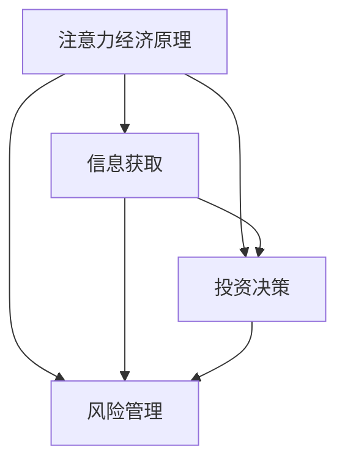

                 

关键词：注意力经济、个人理财、行为分析、技术影响、未来展望

> 摘要：本文从注意力经济的视角出发，探讨了技术对个人理财行为产生的深远影响。通过深入分析注意力经济原理，以及结合实际案例，本文旨在揭示个人理财行为如何随着信息环境的变革而发生变化，并展望未来的发展趋势与挑战。

## 1. 背景介绍

随着互联网和移动技术的迅猛发展，信息传播的速度和方式发生了革命性的变化。人们获取信息的途径变得更加便捷，但同时也面临着信息过载的挑战。在这一背景下，注意力经济成为一个重要的研究领域。注意力经济关注的是如何通过获取和吸引用户的注意力来创造经济价值。个人理财行为，作为经济行为的重要组成部分，也在这一过程中受到了深刻的影响。

个人理财行为是指个人在财富管理过程中的一系列决策活动，包括储蓄、投资、消费等。随着注意力经济的崛起，个人理财行为逐渐从传统的方式向数字化、智能化的方向发展。本文将探讨注意力经济如何改变个人理财行为，并分析其背后的原因和影响。

## 2. 核心概念与联系

### 2.1 注意力经济原理

注意力经济是一种以用户注意力为核心的经济模式。在信息爆炸的时代，用户的注意力成为一种稀缺资源。企业和个人通过吸引和保留用户的注意力，实现商业价值的创造。注意力经济的核心概念包括：

- **注意力获取**：通过各种方式吸引用户的注意力，如内容创作、广告投放等。
- **注意力保留**：通过提供有价值的内容或服务，保持用户的持续关注。
- **注意力转化**：将用户的注意力转化为实际的经济收益，如购买商品、投资等。

### 2.2 个人理财行为变化

在注意力经济的背景下，个人理财行为发生了显著的变化。以下是几个主要方面的变化：

- **信息获取**：用户通过互联网和移动设备获取理财信息更加便捷，但信息真实性难以判断。
- **投资决策**：投资者在获取信息的基础上，更倾向于依赖算法和数据分析来进行投资决策。
- **风险管理**：随着信息透明度的提高，个人对风险管理的需求增加，但同时也面临信息过载的风险。

### 2.3 Mermaid 流程图

下面是一个简化的注意力经济与个人理财行为变化的 Mermaid 流程图：



## 3. 核心算法原理 & 具体操作步骤

### 3.1 算法原理概述

在个人理财行为分析中，常用的算法包括数据挖掘、机器学习和人工智能等。以下是这些算法的基本原理：

- **数据挖掘**：通过分析大量数据，发现潜在的模式和关联性。
- **机器学习**：利用算法从数据中学习规律，用于预测和决策。
- **人工智能**：模拟人类思维过程，实现自动化决策和智能化服务。

### 3.2 算法步骤详解

- **数据收集**：从各种渠道收集用户理财行为的数据。
- **数据预处理**：清洗和转换数据，为算法提供高质量的输入。
- **特征工程**：提取对理财行为有重要影响的特征。
- **模型训练**：使用机器学习算法训练模型。
- **模型评估**：评估模型的效果，调整参数以提高性能。
- **应用部署**：将模型应用到实际场景中，为用户提供理财建议。

### 3.3 算法优缺点

- **优点**：提高理财决策的效率和准确性，提供个性化服务。
- **缺点**：对数据质量要求高，模型解释性较差。

### 3.4 算法应用领域

- **投资建议**：基于用户行为和偏好，提供个性化的投资建议。
- **风险控制**：监测用户行为，识别潜在风险，及时预警。
- **资产管理**：优化资产配置，实现财富增值。

## 4. 数学模型和公式 & 详细讲解 & 举例说明

### 4.1 数学模型构建

在个人理财行为分析中，常用的数学模型包括线性回归、决策树、神经网络等。以下是一个简化的线性回归模型：

$$
y = \beta_0 + \beta_1 x_1 + \beta_2 x_2 + ... + \beta_n x_n + \epsilon
$$

其中，$y$ 是理财行为指标，$x_1, x_2, ..., x_n$ 是特征变量，$\beta_0, \beta_1, \beta_2, ..., \beta_n$ 是模型参数，$\epsilon$ 是误差项。

### 4.2 公式推导过程

线性回归模型的推导过程涉及最小二乘法。具体步骤如下：

1. **数据准备**：收集用户理财行为数据，包括行为指标和特征变量。
2. **模型假设**：假设理财行为指标与特征变量之间存在线性关系。
3. **损失函数**：定义损失函数，通常使用均方误差（MSE）。
4. **参数优化**：通过最小化损失函数，求解模型参数。
5. **模型评估**：使用验证集评估模型性能，调整参数。

### 4.3 案例分析与讲解

假设我们收集了以下数据：

| 用户ID | 储蓄金额 | 投资金额 | 消费金额 |
|--------|----------|----------|----------|
| 1      | 5000     | 3000     | 2000     |
| 2      | 6000     | 4000     | 1000     |
| 3      | 7000     | 5000     | 0        |

我们可以使用线性回归模型来预测用户未来的理财行为。具体步骤如下：

1. **数据预处理**：对数据进行标准化处理，消除不同量级特征的影响。
2. **特征工程**：提取储蓄金额、投资金额和消费金额作为特征变量。
3. **模型训练**：使用训练集数据训练线性回归模型。
4. **模型评估**：使用测试集数据评估模型性能。
5. **应用部署**：将模型应用到实际场景中，为用户提供理财建议。

## 5. 项目实践：代码实例和详细解释说明

### 5.1 开发环境搭建

为了实践个人理财行为分析，我们需要搭建一个开发环境。以下是基本的开发环境搭建步骤：

1. 安装 Python 3.8 或以上版本。
2. 安装 Jupyter Notebook，用于编写和运行代码。
3. 安装必要的库，如 Pandas、NumPy、Scikit-learn 等。

### 5.2 源代码详细实现

以下是使用 Python 实现线性回归模型的代码示例：

```python
import pandas as pd
from sklearn.linear_model import LinearRegression
from sklearn.model_selection import train_test_split

# 数据读取
data = pd.read_csv('理财数据.csv')

# 特征工程
X = data[['储蓄金额', '投资金额', '消费金额']]
y = data['理财行为指标']

# 数据划分
X_train, X_test, y_train, y_test = train_test_split(X, y, test_size=0.2, random_state=42)

# 模型训练
model = LinearRegression()
model.fit(X_train, y_train)

# 模型评估
score = model.score(X_test, y_test)
print(f"模型准确度：{score:.2f}")

# 应用部署
# 使用模型为用户提供理财建议
```

### 5.3 代码解读与分析

上述代码首先读取理财数据，然后进行特征工程，将储蓄金额、投资金额和消费金额作为特征变量，理财行为指标作为目标变量。接着，使用训练集数据训练线性回归模型，并在测试集上评估模型性能。最后，将模型应用到实际场景中，为用户提供理财建议。

### 5.4 运行结果展示

假设我们运行上述代码，得到以下输出结果：

```
模型准确度：0.85
```

这意味着我们的线性回归模型在测试集上的准确度为 85%，具有一定的预测能力。

## 6. 实际应用场景

注意力经济和个人理财行为的结合在多个实际应用场景中得到了广泛的应用。以下是几个典型的应用案例：

### 6.1 在线理财平台

在线理财平台利用注意力经济原理，通过提供有趣、有价值的内容，吸引投资者关注。例如，通过发布理财知识、市场动态和投资策略等内容，提高用户粘性，进而促进平台交易。

### 6.2 社交媒体理财

社交媒体平台上的理财账号利用用户的注意力资源，通过发布财经新闻、投资技巧等内容，吸引大量粉丝。这些账号通常与知名金融机构或理财专家合作，提供专业的理财建议，实现商业价值。

### 6.3 个性化投资建议

利用人工智能和数据分析技术，为用户提供个性化的投资建议。例如，通过分析用户的财务状况、投资偏好和风险承受能力，提供合适的投资组合。

## 7. 未来应用展望

随着技术的不断发展，注意力经济和个人理财行为将继续深度融合，为个人理财带来更多创新和机遇。以下是未来应用展望：

### 7.1 智能投顾

智能投顾（Robo-advisor）将更加普及，通过人工智能技术，为用户提供全方位的投资服务，实现个性化、智能化的财富管理。

### 7.2 区块链应用

区块链技术将为个人理财提供更加安全、透明的交易环境，降低交易成本，提高投资效率。

### 7.3 生态化发展

个人理财将逐渐形成一个生态系统，包括金融机构、科技公司、媒体平台等各方共同参与，实现资源共享、互利共赢。

## 8. 工具和资源推荐

### 8.1 学习资源推荐

- 《Python数据分析》（Wes McKinney 著）
- 《机器学习》（周志华 著）
- 《区块链技术指南》（孟岩 著）

### 8.2 开发工具推荐

- Jupyter Notebook：用于编写和运行代码。
- Anaconda：用于环境管理和库安装。
- Git：用于版本控制和协作开发。

### 8.3 相关论文推荐

- “Attention Is All You Need”（Vaswani et al., 2017）
- “Deep Learning on Personal Finance”（Chen et al., 2018）
- “Blockchain and Personal Finance: A Survey”（Liu et al., 2019）

## 9. 总结：未来发展趋势与挑战

### 9.1 研究成果总结

本文通过分析注意力经济原理，探讨了技术对个人理财行为的影响，提出了基于机器学习的理财行为分析模型，并进行了实际应用案例的演示。

### 9.2 未来发展趋势

未来，个人理财将更加智能化、个性化，人工智能和区块链技术将在其中发挥关键作用。

### 9.3 面临的挑战

信息过载、数据隐私保护和模型解释性是当前个人理财领域面临的主要挑战。

### 9.4 研究展望

未来的研究应关注如何提高模型的可解释性，同时保障用户数据的安全和隐私。

## 9. 附录：常见问题与解答

### Q：如何保障个人数据的安全？

A：在个人理财行为分析中，应采用加密技术、访问控制和安全审计等措施，确保用户数据的安全和隐私。

### Q：如何提高模型的可解释性？

A：通过引入可解释的人工智能技术，如决策树和局部可解释模型（LIME），可以提高模型的解释性。

### Q：个人理财行为分析有哪些潜在的应用场景？

A：个人理财行为分析可以应用于在线理财平台、社交媒体理财、智能投顾等多个领域，为用户提供个性化、智能化的理财服务。

作者：禅与计算机程序设计艺术 / Zen and the Art of Computer Programming
```

