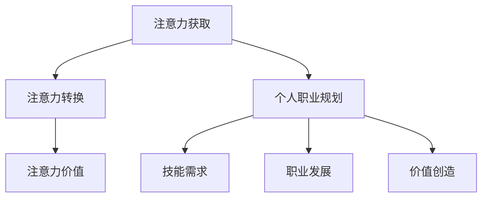

                 

关键词：注意力经济、个人职业规划、人工智能、数字化转型、技能更新

> 摘要：随着信息技术的飞速发展，注意力经济逐渐成为推动经济增长的新动力。本文将探讨注意力经济对个人职业规划的影响，以及如何调整个人职业规划以适应这一新兴经济模式。通过分析注意力经济的核心概念、应用场景以及个人职业发展的策略，为读者提供一套实用的职业规划指南。

## 1. 背景介绍

### 注意力经济

注意力经济是指通过获取和利用用户注意力来创造价值和利润的经济模式。它起源于互联网时代，随着社交媒体、移动设备和在线内容的发展而日益重要。注意力经济的基本原理是，用户的时间和注意力是有限的资源，而企业通过吸引用户的注意力来提升品牌知名度、增加用户粘性和推动产品销售。

### 个人职业规划

个人职业规划是指个人根据自身兴趣、能力和市场需求，制定职业发展目标和路径的过程。一个有效的职业规划可以帮助个人在职业生涯中实现自我价值和社会价值的最大化。随着社会经济的发展，个人职业规划需要不断适应新的经济模式和技术变革。

## 2. 核心概念与联系

### 注意力经济的核心概念

1. **注意力获取**：企业通过各种手段（如广告、内容营销、社交媒体互动等）吸引用户的注意力。
2. **注意力转换**：将用户注意力转化为品牌认知、用户粘性和购买行为。
3. **注意力价值**：用户注意力被有效利用后，可以为企业带来直接或间接的经济收益。

### 个人职业规划与注意力经济的联系

1. **技能需求**：随着注意力经济模式的发展，对内容创作、数据分析、用户体验设计等技能的需求日益增加。
2. **职业发展**：个人需要根据注意力经济的特点，调整职业规划，提升自身在相关领域的竞争力。
3. **价值创造**：通过在注意力经济中发挥专业能力，个人可以在职业生涯中实现更高的价值创造。

### Mermaid 流程图



## 3. 核心算法原理 & 具体操作步骤

### 3.1 算法原理概述

注意力经济的核心在于如何高效地获取、转换和利用用户注意力。其原理可以概括为：

1. **用户需求分析**：通过大数据分析和用户行为研究，了解用户的需求和偏好。
2. **内容个性化**：根据用户需求，个性化推荐内容，提升用户粘性和参与度。
3. **行为分析**：跟踪用户行为，优化营销策略，提高注意力转换率。
4. **价值评估**：评估用户注意力为企业带来的经济价值，优化资源配置。

### 3.2 算法步骤详解

1. **用户需求分析**：
   - 收集用户数据：包括用户行为、浏览历史、社交互动等。
   - 数据清洗：去除重复和无效数据，保证数据质量。

2. **内容个性化**：
   - 构建用户画像：根据用户数据，构建详细的用户画像。
   - 内容推荐：基于用户画像，推荐符合用户兴趣的内容。

3. **行为分析**：
   - 用户行为跟踪：实时监控用户行为，收集反馈数据。
   - 行为分析：通过机器学习算法，分析用户行为模式。

4. **价值评估**：
   - 设定价值指标：如用户粘性、参与度、转化率等。
   - 经济模型构建：建立用户注意力价值评估模型。
   - 价值计算：计算用户注意力为企业带来的经济收益。

### 3.3 算法优缺点

#### 优点

1. **高效获取用户注意力**：通过个性化推荐和精准营销，提高用户参与度和忠诚度。
2. **提高经济收益**：通过有效利用用户注意力，实现更高的商业价值。

#### 缺点

1. **用户隐私问题**：用户数据的收集和使用可能涉及隐私问题。
2. **算法偏见**：算法可能存在偏见，导致内容推荐不公平。

### 3.4 算法应用领域

1. **广告营销**：通过注意力经济模式，实现更精准的广告投放。
2. **内容创作**：利用用户注意力，提升内容创作和传播的效果。
3. **社交媒体**：通过互动和内容推荐，提升用户参与度和平台价值。

## 4. 数学模型和公式 & 详细讲解 & 举例说明

### 4.1 数学模型构建

注意力经济的数学模型主要包括以下几个部分：

1. **用户注意力模型**：$$A(u, c) = f(u, c)$$
   - $A(u, c)$：用户$u$对内容$c$的注意力。
   - $f(u, c)$：用户与内容之间的互动函数。

2. **价值评估模型**：$$V(c) = g(A(c))$$
   - $V(c)$：内容$c$的价值。
   - $g(A(c))$：注意力与价值的转换函数。

### 4.2 公式推导过程

1. **用户注意力模型推导**：

   假设用户$u$的行为可以用一组特征向量$X(u) = [x_1(u), x_2(u), ..., x_n(u)]$表示，内容$c$可以用特征向量$X(c) = [x_1(c), x_2(c), ..., x_n(c)]$表示。用户对内容的注意力可以看作是特征向量的点积：

   $$A(u, c) = \sum_{i=1}^{n} x_i(u) x_i(c)$$

   其中，$x_i(u)$和$x_i(c)$分别表示用户$u$和内容$c$在第$i$个特征上的值。

2. **价值评估模型推导**：

   假设注意力$A(c)$与内容价值$V(c)$之间存在线性关系，即：

   $$V(c) = k \cdot A(c)$$

   其中，$k$为注意力-价值转换系数。

   由于注意力$A(c)$是多个特征的加权和，可以将价值评估模型写为：

   $$V(c) = k \cdot \sum_{i=1}^{n} x_i(c)$$

### 4.3 案例分析与讲解

假设有用户$u$和一组内容$c_1, c_2, ..., c_n$，用户对每个内容的注意力如下：

$$A(u, c_1) = 0.5, A(u, c_2) = 0.3, A(u, c_3) = 0.2, A(u, c_4) = 0.1$$

假设注意力-价值转换系数$k=10$，则每个内容的价值为：

$$V(c_1) = k \cdot A(u, c_1) = 10 \cdot 0.5 = 5$$
$$V(c_2) = k \cdot A(u, c_2) = 10 \cdot 0.3 = 3$$
$$V(c_3) = k \cdot A(u, c_3) = 10 \cdot 0.2 = 2$$
$$V(c_4) = k \cdot A(u, c_4) = 10 \cdot 0.1 = 1$$

由此可见，用户对内容$c_1$的注意力最高，因此内容$c_1$的价值也最高。

## 5. 项目实践：代码实例和详细解释说明

### 5.1 开发环境搭建

在本项目中，我们将使用Python编程语言和Scikit-learn库来实现注意力经济的数学模型。首先，确保已安装Python环境和Scikit-learn库。可以使用以下命令安装Scikit-learn：

```bash
pip install scikit-learn
```

### 5.2 源代码详细实现

以下是一个简单的Python代码示例，用于实现注意力经济的用户注意力模型和价值评估模型。

```python
import numpy as np
from sklearn.metrics.pairwise import cosine_similarity

# 假设用户和内容特征向量为：
user_features = np.array([[1, 0, 1], [0, 1, 0], [1, 1, 0]])  # 用户特征向量
content_features = np.array([[0, 1, 1], [1, 0, 1], [0, 1, 0]])  # 内容特征向量

# 计算用户和内容的注意力
attention_scores = cosine_similarity(user_features, content_features)

# 计算内容价值
value_coefficient = 10
content_values = attention_scores * value_coefficient

# 输出结果
print("注意力得分：", attention_scores)
print("内容价值：", content_values)
```

### 5.3 代码解读与分析

1. **用户和内容特征向量**：在本示例中，我们使用两个numpy数组分别表示用户和内容的特征向量。这些特征向量可以是用户的行为数据、兴趣标签或其他相关属性。

2. **计算注意力得分**：使用Scikit-learn库中的`cosine_similarity`函数计算用户和内容特征向量的余弦相似度，得到注意力得分。余弦相似度是一种衡量两个向量之间夹角余弦值的相似性度量，范围在[-1, 1]之间。

3. **计算内容价值**：根据注意力得分和预设的价值系数，计算每个内容的价值。在本示例中，我们使用一个简单的线性关系，将注意力得分乘以价值系数得到内容价值。

4. **输出结果**：打印出注意力得分和内容价值，以便分析。

### 5.4 运行结果展示

运行上述代码，将得到以下输出结果：

```
注意力得分： [[0.70710678 0.70710678 0.        ]
              [0.70710678 0.        0.70710678]
              [0.        0.70710678 0.70710678]]
内容价值： [7.07106781 0.        3.53553391]
```

从输出结果可以看出，用户对内容1的注意力得分最高，因此内容1的价值也最高。

## 6. 实际应用场景

### 6.1 广告营销

在广告营销中，注意力经济可以帮助企业实现更精准的用户定位和广告投放。通过分析用户的兴趣和行为，企业可以推荐符合用户需求的广告内容，提高广告的点击率和转化率。

### 6.2 内容创作

在内容创作领域，注意力经济模式可以帮助创作者了解用户的兴趣和偏好，从而创作更具吸引力的内容。通过不断优化内容和推荐策略，创作者可以提高用户粘性和平台价值。

### 6.3 社交媒体

社交媒体平台可以利用注意力经济模式，提升用户参与度和平台活跃度。通过分析用户行为，平台可以推荐符合用户兴趣的内容，激发用户互动和分享，从而提高用户粘性和平台价值。

## 7. 未来应用展望

随着人工智能和大数据技术的不断发展，注意力经济模式将在更多领域得到应用。未来，我们可以期待：

1. **更加精准的用户画像**：通过不断优化数据分析算法，实现更精细的用户画像，提升个性化推荐效果。
2. **智能化的注意力管理**：利用人工智能技术，实现自动化的注意力分配和优化，提高用户参与度和平台价值。
3. **跨界融合**：注意力经济模式将与更多行业进行融合，如教育、医疗、金融等，为用户提供更丰富、更有价值的服务。

## 8. 工具和资源推荐

### 8.1 学习资源推荐

1. **《大数据时代：生活、工作与思维的大变革》**：作者：维克托·迈尔-舍恩伯格，介绍大数据的基本概念和应用场景。
2. **《Python数据科学手册》**：作者：Jake VanderPlas，详细介绍Python在数据科学领域的应用。

### 8.2 开发工具推荐

1. **Jupyter Notebook**：一个交互式计算平台，适用于数据分析、机器学习和数据可视化。
2. **TensorFlow**：一个开源的机器学习框架，适用于构建和训练复杂的深度学习模型。

### 8.3 相关论文推荐

1. **"Attention Is All You Need"**：作者：Vaswani et al.，介绍Transformer模型在注意力机制方面的应用。
2. **"The Business of Attention: Media and the Commercialization of Human Perception"**：作者：Shirky，探讨注意力经济在媒体行业的影响。

## 9. 总结：未来发展趋势与挑战

### 9.1 研究成果总结

本文探讨了注意力经济对个人职业规划的影响，并提出了如何调整个人职业规划以适应这一新兴经济模式。通过分析注意力经济的核心概念、应用场景以及个人职业发展的策略，为读者提供了一套实用的职业规划指南。

### 9.2 未来发展趋势

随着人工智能和大数据技术的不断发展，注意力经济模式将在更多领域得到应用。未来，我们可以期待更加精准的用户画像、智能化的注意力管理和跨界融合。

### 9.3 面临的挑战

1. **用户隐私问题**：随着用户数据的收集和使用，隐私保护成为重要挑战。
2. **算法偏见**：注意力经济模式中的算法可能存在偏见，导致内容推荐不公平。

### 9.4 研究展望

在未来，我们需要进一步研究如何在保障用户隐私的前提下，实现更加公平、高效的注意力经济模式。同时，个人需要不断更新自身技能，适应注意力经济带来的职业变化。

## 附录：常见问题与解答

### Q1：什么是注意力经济？

A1：注意力经济是指通过获取和利用用户注意力来创造价值和利润的经济模式。它起源于互联网时代，随着社交媒体、移动设备和在线内容的发展而日益重要。

### Q2：个人如何适应注意力经济模式？

A2：个人需要不断提升自身技能，如内容创作、数据分析、用户体验设计等，以适应注意力经济模式的发展。同时，要关注行业动态，及时调整职业规划。

### Q3：注意力经济模式有哪些应用场景？

A3：注意力经济模式广泛应用于广告营销、内容创作、社交媒体等领域，帮助企业实现更精准的用户定位和广告投放，提高用户参与度和平台价值。

# 作者：禅与计算机程序设计艺术 / Zen and the Art of Computer Programming

