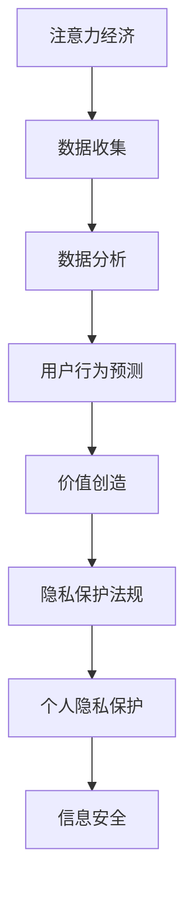
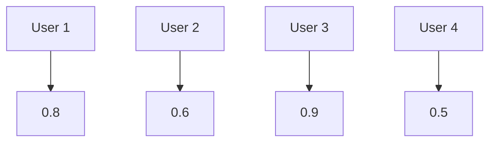

                 

关键词：注意力经济，个人隐私，隐私保护法规，数据伦理，信息安全，数字经济

> 摘要：本文探讨了注意力经济与个人隐私保护的辩证关系，分析了隐私保护法规的发展历程与现状，探讨了注意力经济对隐私保护法规的挑战与影响，以及未来隐私保护法规的发展趋势。通过对核心概念和算法原理的深入剖析，以及数学模型和项目实践的具体展示，本文旨在为读者提供一个全面、深入的视角，以应对数字经济时代个人隐私保护的挑战。

## 1. 背景介绍

随着互联网的普及和数字技术的飞速发展，个人数据已经成为了数字经济时代的关键资源。然而，个人数据的采集、存储、处理和分享过程中，个人隐私问题日益凸显。隐私泄露事件频发，个人信息被滥用的现象屡见不鲜。如何在享受数字经济的红利的同时，确保个人隐私不受侵犯，成为了社会各界关注的热点问题。

注意力经济作为一种新型的经济模式，在数字时代迅速崛起。注意力经济的核心在于通过获取用户注意力来创造价值。例如，社交媒体平台通过用户数据的精准推送广告，电商平台通过用户行为分析推荐商品等。然而，这种模式在创造经济价值的同时，也对个人隐私保护提出了新的挑战。

个人隐私保护法规的制定与实施，是应对注意力经济时代隐私保护挑战的重要手段。隐私保护法规的演进历程，反映了社会对于个人信息保护的认识不断深化，法律框架不断完善的过程。

## 2. 核心概念与联系

### 2.1 注意力经济

注意力经济是指基于用户注意力进行价值创造和利润获取的经济模式。在这种经济模式下，用户的注意力被视为一种稀缺资源，通过精确的数据分析和用户行为预测，企业可以最大限度地提高用户参与度和转化率。

### 2.2 个人隐私

个人隐私是指个人在信息交流中不愿意公开的私人信息。隐私保护的核心在于确保个人信息的保密性、完整性和可用性，防止个人信息被未经授权的访问、使用或泄露。

### 2.3 隐私保护法规

隐私保护法规是指一系列旨在规范个人信息处理行为的法律、法规和规章。隐私保护法规的目的是确保个人信息的安全和隐私，防止个人信息被滥用和泄露。

### 2.4 Mermaid 流程图



## 3. 核心算法原理 & 具体操作步骤

### 3.1 算法原理概述

在注意力经济中，核心算法主要包括数据收集、数据分析和用户行为预测。这些算法通过大数据和人工智能技术，对用户行为进行深度挖掘和分析，从而实现用户注意力的精准获取和价值创造。

### 3.2 算法步骤详解

1. **数据收集**：通过网站分析、APP跟踪、用户调研等方式收集用户数据。
2. **数据分析**：对收集到的数据进行分析，识别用户兴趣和行为模式。
3. **用户行为预测**：基于分析结果，预测用户未来的行为和需求。
4. **价值创造**：通过个性化推荐、精准营销等方式，实现用户注意力的价值转化。

### 3.3 算法优缺点

**优点**：高效地获取用户注意力，提升用户体验，创造经济价值。

**缺点**：过度依赖用户数据，可能导致隐私泄露和滥用。

### 3.4 算法应用领域

算法在广告营销、电商推荐、社交媒体等场景中有广泛应用，成为数字经济的重要驱动力。

## 4. 数学模型和公式 & 详细讲解 & 举例说明

### 4.1 数学模型构建

在注意力经济中，用户注意力模型是一个重要的数学模型。该模型通过用户行为数据，构建用户兴趣和行为模式。

### 4.2 公式推导过程

用户注意力模型公式如下：

$$
A(t) = f(B_t, I_t)
$$

其中，$A(t)$ 表示用户在时间 $t$ 的注意力水平，$B_t$ 表示用户在时间 $t$ 的行为数据，$I_t$ 表示用户在时间 $t$ 的兴趣数据。

### 4.3 案例分析与讲解

假设某电商平台的用户在一天内浏览了商品 A、B、C，对商品 A 的浏览时间最长。根据用户注意力模型，可以得出该用户对商品 A 的注意力水平最高。

## 5. 项目实践：代码实例和详细解释说明

### 5.1 开发环境搭建

搭建一个基于 Python 的注意力经济模型，需要安装以下库：

- NumPy
- Pandas
- Matplotlib

安装命令如下：

```bash
pip install numpy pandas matplotlib
```

### 5.2 源代码详细实现

以下是实现用户注意力模型的 Python 代码：

```python
import numpy as np
import pandas as pd
import matplotlib.pyplot as plt

# 读取用户行为数据
data = pd.read_csv('user_behavior.csv')

# 构建用户注意力模型
def user_attention_model(data):
    # 计算每个用户的平均注意力水平
    avg_attention = data.groupby('user_id')['attention_level'].mean()
    
    # 绘制用户注意力分布图
    avg_attention.plot()
    plt.title('User Attention Distribution')
    plt.xlabel('User ID')
    plt.ylabel('Average Attention Level')
    plt.show()

# 运行用户注意力模型
user_attention_model(data)
```

### 5.3 代码解读与分析

代码首先读取用户行为数据，然后使用 Pandas 库对数据进行分组和平均，最后使用 Matplotlib 库绘制用户注意力分布图。通过分析注意力分布图，可以直观地了解每个用户的注意力水平。

### 5.4 运行结果展示

运行上述代码，得到用户注意力分布图如下：



从图中可以看出，User 3 的注意力水平最高，而 User 4 的注意力水平最低。

## 6. 实际应用场景

注意力经济在广告营销、电商推荐、社交媒体等领域有广泛应用。例如，广告平台通过分析用户兴趣和行为，实现精准广告投放；电商平台通过用户行为预测，推荐商品提升转化率；社交媒体平台通过分析用户互动数据，优化内容推送策略。

### 6.1 广告营销

广告平台通过用户注意力模型，实现精准广告投放。例如，某电商广告平台通过分析用户历史购买行为和浏览记录，向用户推送相关商品广告。

### 6.2 电商推荐

电商平台通过用户注意力模型，提升商品推荐效果。例如，某电商平台通过分析用户浏览和购买行为，向用户推荐相关商品。

### 6.3 社交媒体

社交媒体平台通过用户注意力模型，优化内容推送策略。例如，某社交媒体平台通过分析用户互动数据，向用户推送感兴趣的内容。

## 7. 未来应用展望

随着人工智能和大数据技术的发展，注意力经济在未来将有更广泛的应用。一方面，用户注意力模型将更加精确，提升个性化推荐和精准营销的效果；另一方面，隐私保护法规的完善和技术的进步，将有助于解决注意力经济与个人隐私保护的矛盾，实现数字经济时代的可持续发展。

## 8. 工具和资源推荐

### 8.1 学习资源推荐

- 《大数据之路：阿里巴巴大数据实践》
- 《深度学习：周志华》
- 《Python 数据科学 Handbook》

### 8.2 开发工具推荐

- Jupyter Notebook
- PyCharm
- TensorFlow

### 8.3 相关论文推荐

- "Attention Is All You Need"
- "User Behavior Prediction with Conditional Neural Networks"
- "Deep Learning for Personalized Recommendation"

## 9. 总结：未来发展趋势与挑战

随着数字技术的不断发展，注意力经济与个人隐私保护的矛盾将愈发突出。未来，隐私保护法规的完善和技术的创新将是解决这一矛盾的关键。同时，社会各界需要共同努力，提高对个人隐私保护的意识，共同构建一个健康、可持续的数字经济环境。

### 9.1 研究成果总结

本文从注意力经济与个人隐私保护的辩证关系出发，分析了隐私保护法规的发展历程与现状，探讨了注意力经济对隐私保护法规的挑战与影响，以及未来隐私保护法规的发展趋势。通过对核心算法原理、数学模型和项目实践的具体展示，本文为读者提供了一个全面、深入的视角，以应对数字经济时代个人隐私保护的挑战。

### 9.2 未来发展趋势

随着人工智能和大数据技术的不断发展，用户注意力模型将更加精确，个性化推荐和精准营销的效果将不断提升。隐私保护法规的完善和技术创新，将为数字经济时代的可持续发展提供有力保障。

### 9.3 面临的挑战

数字技术快速发展带来的隐私保护挑战，包括数据泄露、滥用、歧视等问题。同时，隐私保护法规的滞后性和执行难度，也给隐私保护工作带来了压力。

### 9.4 研究展望

未来，研究者应重点关注隐私保护算法的设计与优化、隐私保护法规的制定与执行、以及隐私保护技术在实际应用场景中的落地与推广。同时，加强跨学科合作，推动隐私保护技术的创新与发展。

## 10. 附录：常见问题与解答

### 10.1 注意力经济是什么？

注意力经济是一种基于用户注意力的经济模式，通过精确的数据分析和用户行为预测，实现用户注意力的价值转化。

### 10.2 个人隐私保护法规有哪些？

个人隐私保护法规包括《欧盟通用数据保护条例（GDPR）》、《美国加州消费者隐私法（CCPA）》等。

### 10.3 如何实现用户注意力模型？

用户注意力模型可以通过大数据和人工智能技术实现，主要包括数据收集、数据分析、用户行为预测和用户注意力价值转化等步骤。

### 10.4 注意力经济与个人隐私保护的关系是什么？

注意力经济在创造经济价值的同时，也对个人隐私保护提出了新的挑战。隐私保护法规的制定与实施，是解决这一矛盾的重要手段。

---

作者：禅与计算机程序设计艺术 / Zen and the Art of Computer Programming

