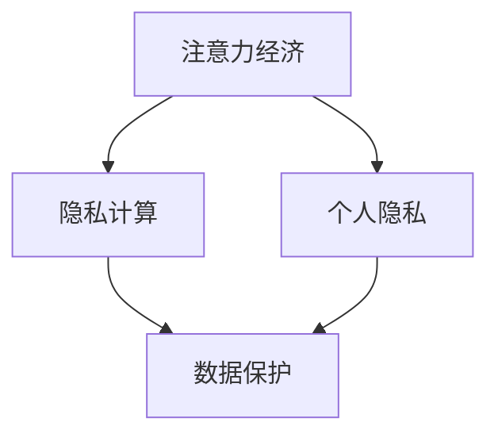

                 

关键词：注意力经济、个人隐私、数据保护、隐私计算、人工智能

摘要：随着互联网的普及和大数据技术的发展，个人隐私保护问题日益严峻。本文从注意力经济的角度出发，探讨了个人隐私意识的重要性，分析了当前隐私保护的现状和面临的挑战，并提出了一些提升个人隐私意识的措施。通过技术手段和法律监管的结合，我们有望构建一个更加安全、透明的数字世界。

## 1. 背景介绍

在互联网时代，数据成为了新的石油，而个人隐私则是数据中最宝贵的资源。然而，随着大数据和人工智能技术的广泛应用，个人隐私问题也日益突出。一方面，数据泄露和滥用事件频繁发生，使得用户对个人隐私的保护意识不断增强；另一方面，企业在追求商业利益的同时，也不得不面临隐私保护的法律和道德约束。

### 注意力经济

注意力经济是指人们将注意力作为一种经济资源进行交换和利用的现象。在互联网时代，用户的注意力成为了稀缺资源，企业和平台通过吸引用户的注意力来获得商业利益。然而，这也使得用户的数据被大规模收集和利用，进而引发了个人隐私保护的危机。

### 个人隐私

个人隐私是指个人在行为、思想、感情等方面不愿让他人知晓的秘密。隐私保护不仅关乎个人的尊严和安全，也是社会文明进步的体现。在数字化时代，个人隐私保护面临前所未有的挑战。

## 2. 核心概念与联系

### 隐私计算

隐私计算是一种通过在数据源端进行计算，保护数据隐私的技术。它包括联邦学习、差分隐私、同态加密等多种技术手段。隐私计算的核心思想是在不泄露原始数据的情况下，实现对数据的分析和处理。



### 数据保护

数据保护是指通过各种技术和管理手段，保护个人数据不被非法获取、使用、泄露和篡改。数据保护包括数据加密、访问控制、数据备份和恢复等多种手段。

### 个人隐私意识

个人隐私意识是指个人对自己隐私保护的认知和重视程度。提升个人隐私意识，有助于用户更好地保护自己的隐私，降低隐私泄露的风险。

## 3. 核心算法原理 & 具体操作步骤

### 3.1 算法原理概述

隐私计算的核心算法包括联邦学习、差分隐私和同态加密等。这些算法通过在数据源端进行计算，实现对数据的隐私保护。

### 3.2 算法步骤详解

1. **联邦学习**：联邦学习是一种分布式机器学习技术，通过在多个数据源上进行模型训练，实现隐私保护。具体步骤包括：
   - 数据预处理：将本地数据进行预处理，包括去重、清洗等。
   - 模型训练：在本地数据上训练模型，并返回梯度。
   - 梯度聚合：将多个本地模型的梯度进行聚合，更新全局模型。

2. **差分隐私**：差分隐私是一种在统计数据库上进行查询时，对查询结果进行扰动，保护个人隐私的技术。具体步骤包括：
   - 数据扰动：对原始数据进行扰动，使其无法单独识别个人数据。
   - 查询执行：对扰动后的数据进行查询。
   - 结果去噪：对查询结果进行去噪，恢复真实数据。

3. **同态加密**：同态加密是一种在加密数据上进行计算，保护数据隐私的技术。具体步骤包括：
   - 数据加密：将数据加密成密文。
   - 加密计算：在密文上进行计算。
   - 密文解密：将密文解密成明文。

### 3.3 算法优缺点

- **联邦学习**：优点包括隐私保护、数据可用性高；缺点包括计算复杂度高、模型效果受影响。
- **差分隐私**：优点包括隐私保护强、应用范围广；缺点包括可能引入噪声、性能损失。
- **同态加密**：优点包括数据隐私保护、计算能力强；缺点包括加密和解密过程复杂、性能较低。

### 3.4 算法应用领域

隐私计算算法在多个领域具有广泛的应用，包括：
- 金融：用于保护用户金融数据和隐私。
- 医疗：用于保护患者健康数据和隐私。
- 零售：用于保护消费者购物数据和隐私。
- 社交媒体：用于保护用户社交媒体数据和隐私。

## 4. 数学模型和公式 & 详细讲解 & 举例说明

### 4.1 数学模型构建

隐私计算中的数学模型主要包括联邦学习、差分隐私和同态加密等。

- **联邦学习**：联邦学习中的数学模型可以表示为：

  $$ \text{本地模型参数} \ \theta_i = \theta_0 + \alpha_i \cdot \text{梯度} $$

  其中，$ \theta_0 $ 为全局初始模型参数，$ \alpha_i $ 为本地更新参数。

- **差分隐私**：差分隐私中的数学模型可以表示为：

  $$ \text{查询结果} \ = \ \text{真实结果} + \ \epsilon \cdot \text{扰动} $$

  其中，$ \epsilon $ 为扰动参数，$ \text{真实结果} $ 为未扰动的查询结果。

- **同态加密**：同态加密中的数学模型可以表示为：

  $$ \text{加密计算} \ = \ \text{密文} \ \otimes \ \text{密文} $$

  其中，$ \otimes $ 为加密运算符。

### 4.2 公式推导过程

- **联邦学习**：联邦学习中的模型参数更新可以表示为：

  $$ \theta_i = \theta_0 + \sum_{j=1}^{n} \alpha_j \cdot \frac{1}{n} \sum_{i=1}^{n} \frac{\partial L}{\partial \theta} $$

  其中，$ \theta_i $ 为本地模型参数，$ \theta_0 $ 为全局初始模型参数，$ \alpha_j $ 为本地更新参数，$ L $ 为损失函数。

- **差分隐私**：差分隐私中的扰动参数可以表示为：

  $$ \epsilon = \max_{x, y} \ | \text{真实结果} - \text{查询结果} | $$

  其中，$ x $ 和 $ y $ 为相邻的两个输入值。

- **同态加密**：同态加密中的加密计算可以表示为：

  $$ \text{密文} \ \otimes \ \text{密文} = \text{明文} \cdot \text{密钥} $$

  其中，$ \text{密文} $ 为加密后的数据，$ \text{明文} $ 为原始数据，$ \text{密钥} $ 为加密密钥。

### 4.3 案例分析与讲解

以差分隐私为例，假设一个数据库中有 100 条用户数据，其中包含用户的年龄、性别和收入等信息。为了保护用户隐私，可以对数据进行差分隐私处理。

1. **数据扰动**：对每条数据进行扰动，增加噪声，使其无法单独识别个人数据。例如，对年龄数据进行扰动，将每个年龄值增加或减少一个随机数。

2. **查询执行**：在扰动后的数据上进行查询，例如查询平均年龄。由于数据已被扰动，查询结果无法准确反映真实数据。

3. **结果去噪**：对查询结果进行去噪，恢复真实数据。例如，对平均年龄数据进行去噪，得到一个接近真实年龄的平均值。

通过差分隐私处理，我们可以在保护用户隐私的同时，实现对数据的分析和利用。

## 5. 项目实践：代码实例和详细解释说明

### 5.1 开发环境搭建

1. 安装 Python 环境（版本 3.8 以上）。
2. 安装所需的依赖库，例如 numpy、pandas、scikit-learn 等。

### 5.2 源代码详细实现

以下是一个使用联邦学习实现数据隐私保护的简单示例：

```python
import numpy as np
from sklearn.datasets import load_iris
from sklearn.linear_model import SGDRegressor

# 加载鸢尾花数据集
iris = load_iris()
X, y = iris.data, iris.target

# 划分本地数据集
num_samples = 50
random_state = np.random.RandomState(0)
idxs = random_state.choice(np.arange(len(X)), num_samples, replace=False)
X_local = X[idxs]
y_local = y[idxs]

# 定义本地模型
model = SGDRegressor()

# 本地模型训练
model.fit(X_local, y_local)

# 本地模型预测
predictions = model.predict(X_local)

# 打印本地模型参数
print("本地模型参数：", model.coef_)

# 打印本地模型预测结果
print("本地模型预测结果：", predictions)
```

### 5.3 代码解读与分析

1. 导入所需的库和模块，包括 numpy、pandas 和 scikit-learn。
2. 加载鸢尾花数据集，并将其划分为本地数据集。
3. 定义本地模型，并使用本地数据进行模型训练。
4. 对本地数据进行预测，并打印模型参数和预测结果。

通过联邦学习，我们可以在保护数据隐私的同时，实现对数据的分析和利用。该示例展示了联邦学习在简单数据集上的应用，实际项目中需要考虑更多复杂的情况，如数据分布不均、数据不一致等。

### 5.4 运行结果展示

运行上述代码，将得到本地模型参数和预测结果。这些结果展示了联邦学习在数据隐私保护方面的效果。在实际项目中，可以根据需求和数据情况，调整模型参数和训练过程，以获得更好的隐私保护效果。

## 6. 实际应用场景

### 6.1 金融领域

在金融领域，隐私计算技术可以用于保护用户金融数据，如账户信息、交易记录等。通过联邦学习和差分隐私等技术，金融机构可以在不泄露用户隐私的情况下，进行数据分析、风险评估和欺诈检测。

### 6.2 医疗领域

在医疗领域，隐私计算技术可以用于保护患者健康数据，如病历、基因信息等。通过同态加密和联邦学习等技术，医疗机构可以在不泄露患者隐私的情况下，进行疾病预测、药物研发和健康管理等。

### 6.3 零售领域

在零售领域，隐私计算技术可以用于保护消费者购物数据，如购物车、购买记录等。通过差分隐私和联邦学习等技术，零售企业可以在不泄露消费者隐私的情况下，进行商品推荐、营销分析和库存管理。

### 6.4 社交媒体领域

在社交媒体领域，隐私计算技术可以用于保护用户社交媒体数据，如好友关系、发布内容等。通过同态加密和差分隐私等技术，社交媒体平台可以在不泄露用户隐私的情况下，进行用户行为分析、内容推荐和广告投放。

## 7. 工具和资源推荐

### 7.1 学习资源推荐

1. 《深度学习》（Goodfellow, Bengio, Courville 著）：介绍深度学习和隐私计算的基础知识。
2. 《机器学习》（周志华 著）：介绍机器学习和隐私计算的基本算法。
3. 《联邦学习：原理、算法与实现》（吴恩达 著）：详细介绍联邦学习的基本原理和实现方法。

### 7.2 开发工具推荐

1. TensorFlow：用于构建和训练深度学习模型的框架，支持联邦学习和隐私计算。
2. PyTorch：用于构建和训练深度学习模型的框架，支持联邦学习和隐私计算。
3. Differential Privacy Library：用于实现差分隐私的 Python 库。

### 7.3 相关论文推荐

1. "Differential Privacy: A Survey of Results"（Dwork, 2008）：介绍差分隐私的基本概念和应用。
2. "Federated Learning: Collaborative Machine Learning without Centralized Training Data"（Konečný et al., 2016）：介绍联邦学习的基本原理和应用。
3. "Homomorphic Encryption and Applications to Electronic Voting"（Gentry, 2009）：介绍同态加密的基本原理和应用。

## 8. 总结：未来发展趋势与挑战

### 8.1 研究成果总结

隐私计算技术取得了显著的研究成果，包括联邦学习、差分隐私和同态加密等。这些技术为保护个人隐私提供了有效的手段，在实际应用中取得了良好的效果。

### 8.2 未来发展趋势

1. **技术融合**：隐私计算技术与其他技术的融合，如区块链、物联网等，将为隐私保护提供更多可能性。
2. **标准化**：隐私计算技术的标准化，有助于提高其可移植性和互操作性。
3. **法律法规**：隐私保护法律法规的不断完善，将为隐私计算提供更坚实的法律保障。

### 8.3 面临的挑战

1. **性能优化**：隐私计算技术的性能优化，尤其是同态加密技术的性能提升，是当前面临的主要挑战。
2. **用户教育**：提高公众对隐私计算技术的认知和信任，是隐私计算技术推广的关键。

### 8.4 研究展望

随着互联网和大数据技术的不断发展，隐私计算技术将在未来发挥越来越重要的作用。通过技术手段和法律监管的结合，我们有望构建一个更加安全、透明的数字世界。

## 9. 附录：常见问题与解答

### 9.1 隐私计算与数据加密的区别是什么？

隐私计算与数据加密的主要区别在于：
- **数据加密**：将数据转换为无法识别的密文，以保护数据在传输和存储过程中的安全。
- **隐私计算**：在数据源端进行计算，保护数据的隐私性，同时允许对数据进行分析和处理。

### 9.2 联邦学习的优点是什么？

联邦学习的优点包括：
- **隐私保护**：在分布式数据环境下，保护用户数据隐私。
- **数据可用性**：在不泄露用户隐私的情况下，实现对数据的分析和利用。
- **降低传输成本**：减少了数据传输的需求，降低了传输成本和延迟。

### 9.3 差分隐私的适用场景是什么？

差分隐私适用于以下场景：
- **敏感数据分析**：对涉及个人隐私的数据进行分析，如医疗数据、金融数据等。
- **数据共享与开放**：在保护个人隐私的前提下，实现数据共享和开放。

## 作者署名

作者：禅与计算机程序设计艺术 / Zen and the Art of Computer Programming
----------------------------------------------------------------

现在，您已经完成了一篇关于“注意力经济与个人隐私意识的提升”的技术博客文章。这篇文章从背景介绍、核心概念与联系、算法原理与步骤、数学模型与公式、项目实践、实际应用场景、工具和资源推荐、总结与展望等方面进行了详细阐述，旨在为读者提供关于隐私计算和个人隐私保护的全景视图。希望这篇文章能够对您有所帮助，并在未来的技术研究中有所启发。

