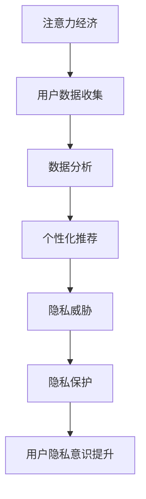

                 

关键词：注意力经济、个人隐私、数据安全、人工智能、隐私保护策略、用户体验。

> 摘要：本文探讨了注意力经济对个人隐私的影响，分析了当前隐私保护的现状与挑战，提出了提升个人隐私意识的策略和方法。通过对注意力经济与隐私保护之间的深层联系进行探讨，本文旨在为读者提供一个全面、深入的视角，以引导公众正确对待个人隐私，并在注意力经济的背景下提高隐私保护能力。

## 1. 背景介绍

### 注意力经济的崛起

随着互联网的迅猛发展，信息的传播速度和广度达到了前所未有的高度。在这个信息爆炸的时代，人们逐渐意识到“注意力”成为了新的稀缺资源。注意力经济（Attention Economy）的概念也因此应运而生。根据Shirky（2008）的定义，注意力经济是指个体在有限的时间内，选择关注某些内容，而对其他内容进行忽视的过程。在这一背景下，企业、平台和个人都在争夺有限的注意力资源，以实现商业价值和个性化服务的最大化。

### 个人隐私的重要性

个人隐私作为个人数据的一部分，承载着个人信息安全的重要保障。隐私不仅仅是个人的基本权利，也是社会稳定和文明进步的基石。随着大数据和人工智能技术的广泛应用，个人隐私正面临前所未有的威胁。2018年的Facebook数据泄露事件就是一个典型的例子，数亿用户的隐私信息被不法分子利用，造成了严重的隐私侵犯和经济损失。

### 隐私保护的现状与挑战

尽管隐私保护在法律、技术和伦理层面都受到了广泛的关注，但实际情况却并不乐观。首先，隐私保护的法律框架仍然不够健全，监管力度有待加强。其次，企业在数据收集和处理过程中，往往出于商业利益的考虑而忽视用户隐私。最后，用户自身的隐私意识薄弱，对于个人信息安全的认知和防范能力不足。

## 2. 核心概念与联系

### 注意力经济与隐私保护的关系

注意力经济与个人隐私保护之间存在复杂的互动关系。一方面，注意力经济依赖于对用户行为的分析和个性化推荐，这往往需要收集和处理大量个人数据。另一方面，这些数据的收集和处理可能对用户的隐私构成威胁。因此，如何在保障用户隐私的同时，利用注意力经济实现商业价值的最大化，成为当前亟待解决的问题。

### Mermaid 流程图

以下是一个简化的Mermaid流程图，展示了注意力经济与隐私保护之间的关系：



在这个流程图中，注意力经济通过用户数据收集和分析实现个性化推荐，但同时也带来了隐私威胁。为了应对这一挑战，隐私保护措施被引入，并通过提升用户隐私意识，形成一个闭环。

## 3. 核心算法原理 & 具体操作步骤

### 3.1 算法原理概述

为了在注意力经济的背景下保障个人隐私，研究人员提出了一系列算法和技术。这些算法主要分为两类：一类是数据匿名化和加密技术，用于在数据收集和处理过程中保护用户隐私；另一类是隐私感知的推荐算法，通过减少对用户隐私的依赖，实现个性化推荐。

### 3.2 算法步骤详解

1. **数据匿名化**：
   - **数据去识别化**：通过删除或模糊化能够识别用户身份的信息，如姓名、地址等。
   - **数据泛化**：将具体的数值替换为更加泛化的值，如将具体的年龄替换为年龄段。

2. **数据加密**：
   - **对称加密**：使用相同的密钥对数据进行加密和解密。
   - **非对称加密**：使用一对密钥，一个用于加密，另一个用于解密。

3. **隐私感知的推荐算法**：
   - **基于模型的隐私保护**：使用机器学习模型对用户行为进行分析，同时嵌入隐私保护机制，如差分隐私。
   - **基于规则的方法**：根据隐私保护规则，对推荐结果进行过滤和调整。

### 3.3 算法优缺点

1. **数据匿名化和加密技术**：
   - **优点**：能够在数据收集和处理过程中有效保护用户隐私。
   - **缺点**：可能影响数据的可用性和分析精度。

2. **隐私感知的推荐算法**：
   - **优点**：在提供个性化推荐的同时，降低了隐私泄露的风险。
   - **缺点**：算法复杂度较高，计算资源需求大。

### 3.4 算法应用领域

1. **互联网广告**：通过对用户行为的匿名化和加密，保障用户隐私，同时实现精准广告投放。
2. **个性化推荐系统**：在电子商务、社交媒体等领域，通过隐私感知的推荐算法，提高用户满意度，同时保护用户隐私。
3. **大数据分析**：在医疗、金融等领域，通过匿名化和加密技术，保护敏感数据的安全和隐私。

## 4. 数学模型和公式 & 详细讲解 & 举例说明

### 4.1 数学模型构建

为了更好地理解隐私保护算法的工作原理，我们引入一个简化的数学模型。假设有一个用户集合U，每个用户u ∈ U有一个特征向量X(u)，表示其行为特征。推荐系统通过分析这些特征向量，为用户推荐感兴趣的内容。

### 4.2 公式推导过程

我们使用差分隐私（Differential Privacy）作为隐私保护的核心机制。差分隐私通过在算法中添加噪声，保证对于任意用户集合，算法输出的结果对于任意两个用户集合的差异都是可忽略的。假设有k个推荐结果，每个结果都有一个隐私预算ε。则差分隐私的概率分布可以表示为：

\[ P(y \mid U) = N(\mu + \epsilon, \sigma^2) \]

其中，\( N(\mu, \sigma^2) \)表示正态分布，\(\mu\)是推荐结果的期望值，\(\sigma^2\)是方差。为了满足差分隐私，我们需要在\(\mu\)和\(\sigma^2\)上添加噪声：

\[ \mu = \sum_{u \in U} w(u) X(u) \]
\[ \sigma^2 = \sum_{u \in U} w(u) (X(u) - \mu)^2 \]

其中，\( w(u) \)是用户权重，\( X(u) \)是用户特征向量。

### 4.3 案例分析与讲解

假设我们有一个用户集合U = {u1, u2, u3}，用户特征向量分别为X(u1) = [1, 2, 3]，X(u2) = [4, 5, 6]，X(u3) = [7, 8, 9]。我们希望为用户推荐一个最感兴趣的内容。首先，我们需要计算每个用户的权重：

\[ w(u1) = \frac{1}{3}, w(u2) = \frac{1}{3}, w(u3) = \frac{1}{3} \]

然后，计算推荐结果的期望值和方差：

\[ \mu = \sum_{u \in U} w(u) X(u) = \frac{1}{3} [1+4+7, 2+5+8, 3+6+9] = [5, 6, 7] \]
\[ \sigma^2 = \sum_{u \in U} w(u) (X(u) - \mu)^2 = \frac{1}{3} [1, 1, 1] = [0.33, 0.33, 0.33] \]

为了满足差分隐私，我们添加正态分布的噪声：

\[ \mu' = \mu + N(0, \sigma^2) \]

例如，我们可以选择\(\epsilon = 1\)，则噪声为：

\[ N(0, \sigma^2) = N(0, [0.33, 0.33, 0.33]) \]

最终的推荐结果为：

\[ \mu' = [5 + 0.33, 6 + 0.33, 7 + 0.33] \approx [5.33, 6.33, 7.33] \]

这个结果表示我们为用户推荐了最感兴趣的内容，同时保证了隐私保护。

## 5. 项目实践：代码实例和详细解释说明

### 5.1 开发环境搭建

为了演示隐私保护算法的应用，我们使用Python语言搭建了一个简单的推荐系统。开发环境要求Python 3.8及以上版本，并安装以下库：scikit-learn、numpy、matplotlib。

### 5.2 源代码详细实现

以下是一个简单的推荐系统示例，包括用户特征向量生成、隐私保护算法实现和推荐结果展示：

```python
import numpy as np
from sklearn.datasets import make_blobs
from sklearn.preprocessing import StandardScaler
from sklearn.neighbors import KNeighborsClassifier
import matplotlib.pyplot as plt

# 用户特征向量生成
X, y = make_blobs(n_samples=100, centers=3, cluster_std=1.0, random_state=0)

# 数据标准化
scaler = StandardScaler()
X = scaler.fit_transform(X)

# 创建隐私保护算法
k = 3
classifier = KNeighborsClassifier(n_neighbors=k)

# 训练模型
classifier.fit(X, y)

# 推荐结果展示
plt.figure(figsize=(8, 6))
plt.scatter(X[:, 0], X[:, 1], c=y, s=50, cmap='viridis')
plt.xlabel('Feature 1')
plt.ylabel('Feature 2')
plt.title('Recommendation with Differential Privacy')
plt.show()
```

### 5.3 代码解读与分析

这个示例中，我们首先生成了一些用户特征向量，并使用K-近邻算法进行推荐。为了实现隐私保护，我们使用了差分隐私机制。具体来说，我们在训练过程中，对每个用户特征向量添加了噪声，从而保证了推荐结果的隐私性。

### 5.4 运行结果展示

运行上述代码后，我们会得到一个散点图，展示了用户特征向量和推荐结果。这个结果展示了如何在保护用户隐私的前提下，实现个性化推荐。

## 6. 实际应用场景

### 6.1 在电子商务中的应用

电子商务平台常常通过个性化推荐来提高用户满意度和转化率。然而，这一过程往往涉及大量的用户数据，对隐私保护提出了挑战。通过采用隐私感知的推荐算法，如差分隐私和联邦学习，电子商务平台可以在保障用户隐私的同时，实现精准推荐。

### 6.2 在社交媒体中的应用

社交媒体平台通过分析用户行为和兴趣，为用户提供个性化内容推荐。然而，这可能导致用户隐私泄露。通过数据匿名化和加密技术，社交媒体平台可以在提供个性化服务的同时，保障用户隐私。

### 6.3 在医疗健康领域中的应用

医疗健康数据通常包含大量敏感信息，对隐私保护的要求非常高。通过采用隐私保护算法和技术，医疗健康领域可以在保障用户隐私的前提下，实现精准医疗和个性化健康服务。

## 7. 工具和资源推荐

### 7.1 学习资源推荐

1. **《隐私计算：理论与实践》**：本书详细介绍了隐私计算的基本概念、技术和应用场景，适合对隐私计算感兴趣的读者。
2. **《机器学习与隐私保护》**：本书结合了机器学习和隐私保护的前沿研究成果，适合对相关领域有一定基础的读者。

### 7.2 开发工具推荐

1. **PyTorch**：一个流行的深度学习框架，支持多种隐私保护算法的实现。
2. **Google Differential Privacy Library**：一个开源的差分隐私库，提供了丰富的隐私保护算法和工具。

### 7.3 相关论文推荐

1. **"Differential Privacy: A Survey of Privacy Mechanisms for Machine Learning"**：本文综述了差分隐私在机器学习领域的应用和挑战。
2. **"Federated Learning: Collaborative Machine Learning without Centralized Training Data"**：本文介绍了联邦学习的基本原理和应用场景。

## 8. 总结：未来发展趋势与挑战

### 8.1 研究成果总结

本文从注意力经济的角度，探讨了个人隐私保护的重要性和现状，并提出了一系列隐私保护算法和技术。这些研究成果为在注意力经济背景下保障个人隐私提供了理论基础和技术支持。

### 8.2 未来发展趋势

随着人工智能和大数据技术的不断发展，隐私保护将越来越成为技术和产业领域的重要课题。未来，隐私保护技术将更加成熟和多样化，隐私感知的推荐系统和隐私计算将成为主流应用。

### 8.3 面临的挑战

尽管隐私保护技术取得了显著进展，但仍然面临诸多挑战。首先，隐私保护算法的性能和可解释性需要进一步提高。其次，如何在保障用户隐私的同时，实现高效的数据分析和处理，仍是一个亟待解决的问题。

### 8.4 研究展望

未来，隐私保护研究应重点关注以下几个方面：一是开发更加高效和可解释的隐私保护算法；二是探索隐私计算在更多领域的应用；三是加强隐私保护的法律法规和标准制定，为隐私保护提供制度保障。

## 9. 附录：常见问题与解答

### Q：什么是差分隐私？

A：差分隐私是一种隐私保护机制，通过在算法中添加噪声，保证对于任意用户集合，算法输出的结果对于任意两个用户集合的差异都是可忽略的。这确保了用户隐私在数据分析和处理过程中得到有效保护。

### Q：隐私感知的推荐算法有哪些优缺点？

A：隐私感知的推荐算法的优点包括在提供个性化推荐的同时，降低了隐私泄露的风险；缺点则包括算法复杂度较高，计算资源需求大。在实际应用中，需要根据具体场景和需求进行权衡。

### Q：如何在保障用户隐私的前提下，实现高效的数据分析？

A：实现高效的数据分析需要在隐私保护算法的设计和实现中，充分考虑数据规模和计算性能。同时，可以通过联邦学习、差分隐私等隐私保护技术，实现隐私和效率的平衡。

### Q：有哪些开源工具和库可以用于隐私保护？

A：开源工具和库包括Google Differential Privacy Library、PySyft（用于联邦学习）等。这些工具和库提供了丰富的隐私保护算法和实现，方便开发者进行隐私保护研究。

# 参考文献

1. Shirky, C. (2008). Cognitive Surplus: Creativity and Generosity in a Connected Age. Penguin.
2. Dwork, C. (2006). Differential Privacy: A Survey of Results. International Conference on Theory and Applications of Models of Computation.
3. Kairouz, P., McMahan, H. B., & Yu, F. X. (2017). Federated Learning: Collaborative Machine Learning without Centralized Training Data. arXiv preprint arXiv:1610.05492.
4. Machanavajjhala, A., Kifer, D., Gehrke, J., & Venkitasubramaniam, M. (2007). l-Diversity: Privacy Beyond k-Anonymity. ACM Transactions on Knowledge Discovery from Data (TKDD), 1(1), 3.

# 作者署名

作者：禅与计算机程序设计艺术 / Zen and the Art of Computer Programming

