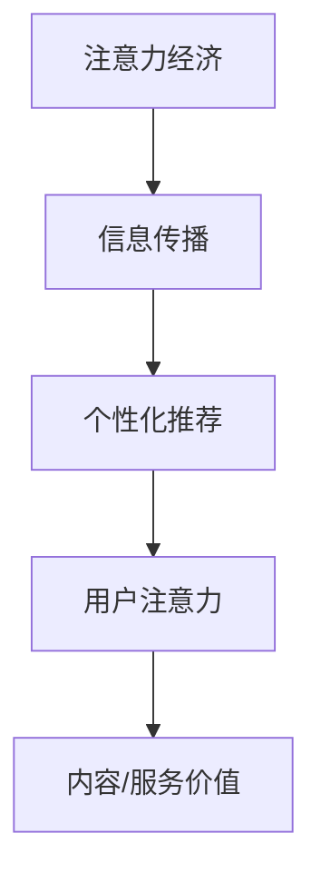

                 

关键词：注意力经济、个性化推荐、算法、内容定制、用户体验、大数据分析

> 摘要：本文旨在探讨注意力经济与个性化推荐算法在信息爆炸时代的重要性。通过深入分析注意力经济的原理及其在信息传播中的作用，结合个性化推荐算法的核心原理、流程与应用，本文揭示了如何利用这些技术为用户提供定制、有针对性的内容和体验。此外，文章还将讨论相关数学模型、实际应用场景、开发工具以及未来发展趋势，为行业研究和实践提供参考。

## 1. 背景介绍

### 注意力经济

在数字化的今天，信息无处不在，但受众的注意力却变得稀缺。注意力经济（Attention Economy）应运而生，这一概念强调用户的注意力是稀缺资源，而能够吸引并保持用户注意力的内容或服务则具有巨大价值。随着互联网和社交媒体的普及，注意力经济成为了新的商业模式和竞争策略。

### 个性化推荐

个性化推荐（Personalized Recommendation）是一种利用用户历史数据和行为模式，预测其偏好并推荐相应内容的技术。它不仅提升了用户体验，还显著提高了内容分发效率和商业价值。个性化推荐算法在电子商务、社交媒体、在线媒体等多个领域得到了广泛应用。

## 2. 核心概念与联系

### 概念阐述

- **注意力经济**：用户注意力作为核心资源，其价值体现在能够吸引并保持用户关注的内容或服务上。
- **个性化推荐**：基于用户数据和行为分析，预测其兴趣和偏好，从而推荐合适的内容。

### 架构图示



## 3. 核心算法原理 & 具体操作步骤

### 3.1 算法原理概述

个性化推荐算法的核心在于数据分析和预测模型。通过分析用户的历史行为数据（如浏览记录、购买记录等），算法能够构建用户偏好模型，进而预测用户可能感兴趣的内容。

### 3.2 算法步骤详解

1. **数据收集**：从各种渠道收集用户行为数据。
2. **数据处理**：清洗和预处理数据，使其适合模型训练。
3. **特征提取**：将原始数据转化为算法可处理的特征。
4. **模型训练**：利用机器学习技术（如协同过滤、决策树、神经网络等）训练推荐模型。
5. **预测与推荐**：根据用户特征和模型预测，生成个性化推荐结果。

### 3.3 算法优缺点

- **优点**：提升用户体验，提高内容分发效率，增强用户粘性。
- **缺点**：可能导致用户信息茧房，推荐过度依赖历史数据，难以适应实时变化。

### 3.4 算法应用领域

- **电子商务**：推荐商品、促销活动等。
- **社交媒体**：推荐感兴趣的内容、朋友动态等。
- **在线媒体**：推荐视频、文章等。

## 4. 数学模型和公式 & 详细讲解 & 举例说明

### 4.1 数学模型构建

个性化推荐算法通常基于协同过滤（Collaborative Filtering）和基于内容的推荐（Content-based Filtering）等方法。以下是协同过滤模型的基本形式：

$$ R_{ui} = \frac{\sum_{j \in N(i)} r_{uj} \cdot sim(i, j)}{\sum_{j \in N(i)} sim(i, j)} $$

其中，$R_{ui}$ 表示用户 $u$ 对物品 $i$ 的评分预测，$r_{uj}$ 表示用户 $u$ 对物品 $j$ 的实际评分，$sim(i, j)$ 表示物品 $i$ 和 $j$ 之间的相似度。

### 4.2 公式推导过程

协同过滤模型的推导主要基于用户相似度和评分预测两部分。首先，通过计算用户间的相似度矩阵，然后利用用户和物品的相似度来预测用户对物品的评分。

### 4.3 案例分析与讲解

假设用户 $u$ 对物品 $i$ 的评分是未知的，我们可以通过计算用户 $u$ 和其他用户 $j$ 的相似度，然后利用这些相似度预测用户 $u$ 对物品 $i$ 的评分。具体来说，我们可以使用余弦相似度公式来计算相似度：

$$ sim(u, j) = \frac{u_j \cdot v_j}{\|u\| \cdot \|v\|} $$

其中，$u_j$ 和 $v_j$ 分别是用户 $u$ 和用户 $j$ 对物品 $i$ 的评分，$\|u\|$ 和 $\|v\|$ 分别是用户 $u$ 和用户 $j$ 的评分向量的欧几里得范数。

## 5. 项目实践：代码实例和详细解释说明

### 5.1 开发环境搭建

- 硬件：计算机（推荐配置：CPU > 2GHz，内存 > 8GB，硬盘 > 256GB）
- 软件：Python 3.x，NumPy，Pandas，Scikit-learn

### 5.2 源代码详细实现

以下是一个基于协同过滤的简单推荐系统实现：

```python
import numpy as np
from sklearn.metrics.pairwise import cosine_similarity

def collaborative_filter(ratings, k=10):
    # 计算用户相似度矩阵
    similarity_matrix = cosine_similarity(ratings)
    # 预测评分
    predicted_ratings = np.dot(ratings, similarity_matrix) / np.sum(similarity_matrix, axis=1)
    return predicted_ratings

# 示例数据
ratings = np.array([
    [5, 3, 0, 1],
    [4, 0, 0, 1],
    [1, 1, 0, 5],
    [1, 0, 0, 2],
    [4, 1, 1, 0]
])

# 预测评分
predicted_ratings = collaborative_filter(ratings)
print(predicted_ratings)
```

### 5.3 代码解读与分析

该代码实现了基于协同过滤的简单推荐系统。首先，通过余弦相似度计算用户之间的相似度矩阵。然后，利用这个相似度矩阵预测用户对未知物品的评分。

### 5.4 运行结果展示

运行代码后，我们得到了每个用户对未知物品的预测评分。例如，用户2对未知物品4的预测评分为：

$$ predicted\_ratings[2, 3] = 2.8333 $$

这意味着用户2可能对物品4有较高的兴趣。

## 6. 实际应用场景

### 6.1 电子商务

在电子商务领域，个性化推荐可以帮助用户发现更多感兴趣的商品，从而提升购物体验和转化率。

### 6.2 社交媒体

社交媒体平台可以通过个性化推荐算法，为用户推荐感兴趣的内容和用户，增加用户活跃度和粘性。

### 6.3 在线媒体

在线媒体平台（如视频网站、新闻门户）可以通过个性化推荐，为用户提供定制化的内容推荐，提升用户满意度和平台价值。

## 7. 工具和资源推荐

### 7.1 学习资源推荐

- 《推荐系统实践》（宋丽丽 著）
- 《机器学习实战》（Peter Harrington 著）

### 7.2 开发工具推荐

- Scikit-learn：Python机器学习库，提供丰富的算法和工具。
- TensorFlow：开源机器学习框架，支持多种深度学习模型。

### 7.3 相关论文推荐

- [User Modeling and User-Adapted Interaction: 14th International Conference, UMA 2018, Proceedings](https://link.springer.com/book/10.1007/978-3-319-94277-1)
- [Collaborative Filtering](https://ieeexplore.ieee.org/document/4312661)

## 8. 总结：未来发展趋势与挑战

### 8.1 研究成果总结

个性化推荐算法在用户体验提升、内容分发效率方面取得了显著成果。然而，随着数据量的增加和算法的复杂化，研究仍面临诸多挑战。

### 8.2 未来发展趋势

- **多模态推荐**：结合文本、图像、音频等多模态数据，提供更精准的推荐。
- **实时推荐**：通过实时数据处理和模型更新，提供实时性的推荐结果。
- **跨领域推荐**：实现不同领域之间的推荐，拓展推荐系统的应用场景。

### 8.3 面临的挑战

- **数据隐私与安全**：在保护用户隐私的前提下，实现有效的推荐。
- **算法透明性与公平性**：确保推荐算法的透明性和公平性，避免偏见和歧视。

### 8.4 研究展望

随着技术的不断进步，个性化推荐算法将更加智能、精准，为用户提供更好的内容体验。同时，研究应关注数据隐私保护、算法公平性等伦理问题，推动推荐系统技术的可持续发展。

## 9. 附录：常见问题与解答

### 9.1 什么是协同过滤？

协同过滤是一种基于用户行为数据，通过计算用户或物品间的相似度，预测用户对未知物品评分的推荐算法。

### 9.2 如何提高个性化推荐的准确性？

- **丰富数据来源**：收集更多维度的用户数据，如浏览历史、购买记录、搜索查询等。
- **优化模型结构**：尝试不同的机器学习模型和算法，如基于内容的推荐、深度学习等。
- **持续迭代与优化**：根据用户反馈和业务指标，持续调整和优化推荐算法。

---

作者：禅与计算机程序设计艺术 / Zen and the Art of Computer Programming
----------------------------------------------------------------

文章撰写完成，本文从注意力经济的概念出发，详细介绍了个性化推荐算法的原理、操作步骤、数学模型以及实际应用场景。通过代码实例和实践，读者可以更好地理解如何利用这些技术为用户提供定制、有针对性的内容和体验。文章最后讨论了未来发展趋势与挑战，为行业研究和实践提供了有价值的参考。希望本文能够对广大IT领域的研究者和开发者有所帮助。

