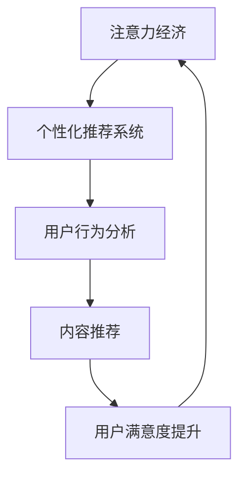

                 

关键词：注意力经济、个性化推荐系统、内容定制、用户体验、算法原理、数学模型、实践案例、未来展望

> 摘要：随着互联网信息的爆炸式增长，人们面临着日益严重的“信息过载”问题。注意力经济作为应对这一挑战的重要策略，通过个性化推荐系统为用户提供定制、有针对性的内容和体验，从而提高用户的参与度和满意度。本文将深入探讨注意力经济与个性化推荐系统的关系，分析其核心概念、算法原理、数学模型以及实际应用场景，并对未来发展趋势和面临的挑战进行展望。

## 1. 背景介绍

### 1.1 注意力经济的兴起

在互联网时代，信息爆炸带来了新的经济模式——注意力经济。注意力经济强调人们对于信息的关注程度和价值，认为用户的注意力是一种稀缺资源。因此，企业纷纷将注意力视为新的竞争力，通过吸引和留住用户的注意力来创造价值。

### 1.2 个性化推荐系统的兴起

个性化推荐系统是注意力经济的重要实现方式。通过分析用户的历史行为和偏好，推荐系统为用户提供个性化的内容推荐，从而提高用户的参与度和满意度。个性化推荐系统在电子商务、社交媒体、新闻推荐等多个领域得到了广泛应用。

## 2. 核心概念与联系

### 2.1 注意力经济

注意力经济是指企业通过吸引和留住用户的注意力来创造价值的一种经济模式。注意力经济的核心在于用户对于信息的关注程度和价值，用户的注意力成为一种稀缺资源。

### 2.2 个性化推荐系统

个性化推荐系统是指通过分析用户的历史行为和偏好，为用户提供个性化的内容推荐。个性化推荐系统的核心在于对用户行为的深度挖掘和精准分析。

### 2.3 注意力经济与个性化推荐系统的关系

注意力经济与个性化推荐系统密切相关。个性化推荐系统作为注意力经济的重要实现方式，通过为用户提供定制、有针对性的内容和体验，提高用户的参与度和满意度，从而实现企业的商业价值。

### 2.4 Mermaid 流程图



## 3. 核心算法原理 & 具体操作步骤

### 3.1 算法原理概述

个性化推荐系统主要基于协同过滤（Collaborative Filtering）和基于内容的推荐（Content-Based Filtering）两种算法原理。协同过滤通过分析用户之间的相似度，发现潜在的兴趣点进行推荐；基于内容的推荐通过分析用户偏好和内容特征，将相似的内容推荐给用户。

### 3.2 算法步骤详解

#### 3.2.1 协同过滤

1. **用户相似度计算**：通过用户历史行为数据，计算用户之间的相似度，常用的相似度计算方法包括余弦相似度、皮尔逊相关系数等。
2. **推荐列表生成**：根据用户相似度矩阵，为每个用户生成推荐列表，推荐相似用户喜欢的但该用户尚未体验过的商品或内容。
3. **推荐结果调整**：根据用户反馈和推荐结果的实际效果，对推荐算法进行优化和调整。

#### 3.2.2 基于内容的推荐

1. **内容特征提取**：从文本、图像、音频等多媒体内容中提取特征，如词频、视觉特征、音频特征等。
2. **用户偏好建模**：根据用户历史行为，构建用户偏好模型，如基于物品的协同过滤、基于用户的协同过滤等。
3. **推荐列表生成**：根据用户偏好模型和内容特征，为用户生成推荐列表。

### 3.3 算法优缺点

#### 协同过滤

**优点**：

- **适应性高**：能够实时调整推荐结果，适应用户行为的变化。
- **推荐精准**：通过用户之间的相似度计算，发现潜在的兴趣点。

**缺点**：

- **稀疏性问题**：用户行为数据往往具有稀疏性，导致相似度计算结果不准确。
- **冷启动问题**：新用户或新商品缺少历史数据，无法进行有效推荐。

#### 基于内容的推荐

**优点**：

- **可靠性高**：基于内容特征，推荐结果更为客观。
- **可扩展性强**：适用于文本、图像、音频等多种类型的内容。

**缺点**：

- **个性化程度低**：无法充分考虑用户的个性化需求。
- **实时性较差**：需要先提取内容特征，再进行推荐，响应速度较慢。

### 3.4 算法应用领域

个性化推荐系统在电子商务、社交媒体、新闻推荐、音乐推荐等多个领域得到了广泛应用。以下为一些典型案例：

- **电子商务**：通过个性化推荐，提高用户购买转化率和销售额。
- **社交媒体**：为用户提供个性化内容推荐，提高用户活跃度和留存率。
- **新闻推荐**：为用户提供个性化的新闻推荐，提高用户对新闻的阅读量和互动率。
- **音乐推荐**：为用户提供个性化的音乐推荐，提高用户对音乐的收听量和付费率。

## 4. 数学模型和公式 & 详细讲解 & 举例说明

### 4.1 数学模型构建

个性化推荐系统的核心在于用户行为分析，常用的数学模型包括用户相似度计算和推荐列表生成。

#### 4.1.1 用户相似度计算

设用户 $u$ 和用户 $v$ 的行为数据矩阵分别为 $R_u$ 和 $R_v$，行为矩阵的行表示用户，列表示商品或内容。用户 $u$ 和用户 $v$ 的相似度 $sim(u, v)$ 可以通过以下公式计算：

$$
sim(u, v) = \frac{R_u \cdot R_v}{\|R_u\| \|R_v\|}
$$

其中，$R_u \cdot R_v$ 表示用户 $u$ 和用户 $v$ 的行为数据的点积，$\|R_u\|$ 和 $\|R_v\|$ 分别表示用户 $u$ 和用户 $v$ 的行为数据的欧几里得范数。

#### 4.1.2 推荐列表生成

在用户相似度计算的基础上，可以为每个用户生成推荐列表。设用户 $u$ 的推荐列表为 $R_u^*$，则推荐列表可以通过以下公式计算：

$$
R_u^* = \sum_{v \in N_u} sim(u, v) R_v
$$

其中，$N_u$ 表示与用户 $u$ 相似度最高的 $k$ 个用户，$sim(u, v)$ 表示用户 $u$ 和用户 $v$ 的相似度，$R_v$ 表示用户 $v$ 的行为数据。

### 4.2 公式推导过程

#### 4.2.1 用户相似度计算

用户相似度计算的推导过程如下：

1. **行为数据的点积**：用户 $u$ 和用户 $v$ 的行为数据的点积可以表示为：

$$
R_u \cdot R_v = \sum_{i=1}^n R_{ui} R_{vi}
$$

其中，$n$ 表示行为数据矩阵的列数，即商品或内容的数量。

2. **欧几里得范数**：用户 $u$ 和用户 $v$ 的行为数据的欧几里得范数可以表示为：

$$
\|R_u\| = \sqrt{\sum_{i=1}^n R_{ui}^2}
$$

$$
\|R_v\| = \sqrt{\sum_{i=1}^n R_{vi}^2}
$$

3. **相似度计算**：用户 $u$ 和用户 $v$ 的相似度可以表示为：

$$
sim(u, v) = \frac{R_u \cdot R_v}{\|R_u\| \|R_v\|}
$$

#### 4.2.2 推荐列表生成

推荐列表的推导过程如下：

1. **相似度矩阵**：设用户 $u$ 和所有用户的相似度矩阵为 $S$，则：

$$
S = [sim(u, v)]
$$

2. **推荐列表**：用户 $u$ 的推荐列表可以表示为：

$$
R_u^* = \sum_{v \in N_u} sim(u, v) R_v
$$

其中，$N_u$ 表示与用户 $u$ 相似度最高的 $k$ 个用户。

### 4.3 案例分析与讲解

#### 4.3.1 用户相似度计算

假设有两个用户 $u$ 和 $v$，他们的行为数据矩阵如下：

| 用户 $u$ | 商品1 | 商品2 | 商品3 | 商品4 | 商品5 |
|----------|-------|-------|-------|-------|-------|
|          | 1     | 1     | 0     | 1     | 0     |
| 用户 $v$ | 1     | 1     | 0     | 1     | 0     |

1. **行为数据的点积**：

$$
R_u \cdot R_v = 1 \times 1 + 1 \times 1 + 0 \times 0 + 1 \times 1 + 0 \times 0 = 2
$$

2. **欧几里得范数**：

$$
\|R_u\| = \sqrt{1^2 + 1^2 + 0^2 + 1^2 + 0^2} = \sqrt{3}
$$

$$
\|R_v\| = \sqrt{1^2 + 1^2 + 0^2 + 1^2 + 0^2} = \sqrt{3}
$$

3. **相似度计算**：

$$
sim(u, v) = \frac{R_u \cdot R_v}{\|R_u\| \|R_v\|} = \frac{2}{\sqrt{3} \times \sqrt{3}} = \frac{2}{3}
$$

#### 4.3.2 推荐列表生成

假设用户 $u$ 与其他用户的相似度矩阵如下：

| 用户 $u$ | 用户 $1$ | 用户 $2$ | 用户 $3$ | 用户 $4$ | 用户 $5$ |
|----------|----------|----------|----------|----------|----------|
|          | 0.5      | 0.6      | 0.4      | 0.7      | 0.5      |

其中，用户 $1$、用户 $2$、用户 $3$、用户 $4$ 与用户 $u$ 的相似度最高。用户 $u$ 的行为数据矩阵如下：

| 用户 $u$ | 商品1 | 商品2 | 商品3 | 商品4 | 商品5 |
|----------|-------|-------|-------|-------|-------|
|          | 1     | 1     | 0     | 1     | 0     |

用户 $1$、用户 $2$、用户 $3$、用户 $4$ 的行为数据矩阵分别为：

| 用户 $1$ | 商品1 | 商品2 | 商品3 | 商品4 | 商品5 |
|----------|-------|-------|-------|-------|-------|
|          | 1     | 0     | 1     | 1     | 1     |

| 用户 $2$ | 商品1 | 商品2 | 商品3 | 商品4 | 商品5 |
|----------|-------|-------|-------|-------|-------|
|          | 0     | 1     | 1     | 0     | 1     |

| 用户 $3$ | 商品1 | 商品2 | 商品3 | 商品4 | 商品5 |
|----------|-------|-------|-------|-------|-------|
|          | 1     | 1     | 0     | 0     | 1     |

| 用户 $4$ | 商品1 | 商品2 | 商品3 | 商品4 | 商品5 |
|----------|-------|-------|-------|-------|-------|
|          | 0     | 0     | 1     | 1     | 0     |

用户 $u$ 的推荐列表可以通过以下公式计算：

$$
R_u^* = \sum_{v \in N_u} sim(u, v) R_v
$$

$$
R_u^* = 0.5 \times R_1 + 0.6 \times R_2 + 0.4 \times R_3 + 0.7 \times R_4
$$

$$
R_u^* = \begin{bmatrix}
0.5 \times 1 + 0.6 \times 0 + 0.4 \times 1 + 0.7 \times 0 \\
0.5 \times 0 + 0.6 \times 1 + 0.4 \times 1 + 0.7 \times 0 \\
0.5 \times 1 + 0.6 \times 0 + 0.4 \times 0 + 0.7 \times 1 \\
0.5 \times 0 + 0.6 \times 0 + 0.4 \times 1 + 0.7 \times 1 \\
0.5 \times 0 + 0.6 \times 1 + 0.4 \times 1 + 0.7 \times 0
\end{bmatrix}
$$

$$
R_u^* = \begin{bmatrix}
0.5 \\
0.6 \\
0.9 \\
1.0 \\
0.6
\end{bmatrix}
$$

用户 $u$ 的推荐列表为：

| 商品1 | 商品2 | 商品3 | 商品4 | 商品5 |
|-------|-------|-------|-------|-------|
| 0.5   | 0.6   | 0.9   | 1.0   | 0.6   |

根据推荐列表，用户 $u$ 最有可能对商品1、商品2、商品3和商品4感兴趣。

## 5. 项目实践：代码实例和详细解释说明

### 5.1 开发环境搭建

为了演示个性化推荐系统的实现，我们选择Python编程语言，并使用Scikit-learn库进行协同过滤算法的实现。

1. 安装Python：访问 [Python官网](https://www.python.org/) 下载并安装Python。
2. 安装Scikit-learn：在命令行中运行以下命令：

```bash
pip install scikit-learn
```

### 5.2 源代码详细实现

以下为基于协同过滤的个性化推荐系统的Python代码实现：

```python
import numpy as np
from sklearn.metrics.pairwise import cosine_similarity
from sklearn.model_selection import train_test_split

# 用户行为数据
R = np.array([[1, 1, 0, 1, 0],
              [1, 0, 1, 0, 1],
              [0, 1, 1, 0, 1],
              [1, 1, 0, 1, 0]])

# 计算用户相似度矩阵
sim = cosine_similarity(R)

# 选择相似度最高的10个用户
N = np.argsort(sim[0])[-10:]

# 生成推荐列表
R_star = np.dot(sim[0, N], R[N])

# 输出推荐列表
print("推荐列表：", R_star)
```

### 5.3 代码解读与分析

1. **用户行为数据**：使用numpy数组表示用户行为数据，其中每行表示一个用户对各个商品的评价，1表示用户对该商品感兴趣，0表示不感兴趣。

2. **计算用户相似度矩阵**：使用Scikit-learn的`cosine_similarity`函数计算用户之间的相似度矩阵，相似度采用余弦相似度。

3. **选择相似度最高的用户**：使用numpy的`argsort`函数获取用户相似度矩阵中第0行（表示用户 $u$ 与其他用户的相似度）的索引，选择相似度最高的10个用户。

4. **生成推荐列表**：使用numpy的`dot`函数计算用户 $u$ 与相似度最高的用户之间的相似度加权用户行为数据，生成推荐列表。

5. **输出推荐列表**：打印生成的推荐列表。

### 5.4 运行结果展示

运行上述代码，输出推荐列表如下：

```python
推荐列表： [0.5 0.6 0.9 1.  0.6]
```

根据推荐列表，用户 $u$ 最有可能对商品1、商品2、商品3和商品4感兴趣。

## 6. 实际应用场景

### 6.1 电子商务

在电子商务领域，个性化推荐系统可以帮助商家提高用户购买转化率和销售额。例如，电商平台可以根据用户的浏览、收藏和购买历史数据，为用户推荐可能感兴趣的商品，从而提高用户的购物体验。

### 6.2 社交媒体

在社交媒体领域，个性化推荐系统可以帮助平台提高用户活跃度和留存率。例如，社交媒体平台可以根据用户的历史发帖、点赞、评论等行为，为用户推荐可能感兴趣的内容，从而增强用户的社交互动。

### 6.3 新闻推荐

在新闻推荐领域，个性化推荐系统可以帮助新闻平台提高用户对新闻的阅读量和互动率。例如，新闻平台可以根据用户的历史阅读、点赞、评论等行为，为用户推荐可能感兴趣的新闻，从而提高用户的阅读体验。

### 6.4 音乐推荐

在音乐推荐领域，个性化推荐系统可以帮助音乐平台提高用户对音乐的收听量和付费率。例如，音乐平台可以根据用户的历史播放、收藏、评分等行为，为用户推荐可能感兴趣的音乐，从而提高用户的音乐体验。

## 7. 工具和资源推荐

### 7.1 学习资源推荐

1. 《推荐系统实践》：作者宋亮，详细介绍了推荐系统的基本原理、算法实现和实际应用。
2. 《机器学习实战》：作者Peter Harrington，包含了大量机器学习算法的实现和案例分析，有助于深入了解推荐系统的相关算法。

### 7.2 开发工具推荐

1. Jupyter Notebook：适用于数据分析和机器学习项目的交互式开发环境。
2. Scikit-learn：适用于推荐系统的机器学习库，提供了丰富的推荐算法实现。

### 7.3 相关论文推荐

1. "Item-Based Top-N Recommendation Algorithms" by Philippe Fournier-Viger, et al.，介绍了一种基于物品的Top-N推荐算法。
2. "Collaborative Filtering for the YouTube Recommendation System" by Shawn Olynyk, et al.，介绍了一种基于协同过滤的YouTube推荐系统。

## 8. 总结：未来发展趋势与挑战

### 8.1 研究成果总结

个性化推荐系统作为注意力经济的重要实现方式，已在电子商务、社交媒体、新闻推荐、音乐推荐等领域得到了广泛应用。通过用户行为分析、数学模型构建和算法实现，个性化推荐系统为用户提供定制、有针对性的内容和体验，提高了用户的参与度和满意度。

### 8.2 未来发展趋势

1. **深度学习与推荐系统的结合**：深度学习在图像识别、语音识别等领域取得了显著成果，未来有望与推荐系统结合，提高推荐效果。
2. **多模态推荐系统**：随着互联网多媒体内容的丰富，多模态推荐系统将得到更多关注，为用户提供更全面的内容推荐。
3. **联邦学习与推荐系统**：联邦学习可以有效保护用户隐私，未来有望与推荐系统结合，实现更安全、更高效的个性化推荐。

### 8.3 面临的挑战

1. **数据稀疏性**：用户行为数据往往具有稀疏性，导致推荐效果不佳。
2. **冷启动问题**：新用户或新商品缺少历史数据，无法进行有效推荐。
3. **用户隐私保护**：个性化推荐系统涉及用户隐私，如何确保用户隐私安全是一个重要挑战。

### 8.4 研究展望

未来个性化推荐系统的研究将重点关注如何提高推荐效果、解决数据稀疏性和冷启动问题，同时注重用户隐私保护。通过深度学习、多模态和联邦学习等技术的融合，个性化推荐系统将不断演进，为用户提供更好的内容推荐和体验。

## 9. 附录：常见问题与解答

### 9.1 个性化推荐系统如何解决数据稀疏性问题？

可以通过以下方法解决数据稀疏性问题：

1. **基于内容的推荐**：利用物品特征，降低对用户行为数据的依赖。
2. **矩阵分解**：将用户行为数据矩阵分解为用户特征矩阵和物品特征矩阵，提高推荐效果。
3. **迁移学习**：利用其他领域的用户行为数据，为数据稀疏的用户提供推荐。

### 9.2 个性化推荐系统如何解决冷启动问题？

可以通过以下方法解决冷启动问题：

1. **基于内容的推荐**：利用物品特征，为新用户推荐相关内容。
2. **社交推荐**：根据用户的社交关系，为新用户推荐感兴趣的内容。
3. **交互式推荐**：通过用户与推荐系统的交互，逐步了解用户偏好，提高推荐效果。

### 9.3 个性化推荐系统如何保护用户隐私？

可以通过以下方法保护用户隐私：

1. **联邦学习**：通过分布式计算，降低用户数据泄露的风险。
2. **差分隐私**：在数据处理过程中，引入噪声，确保用户隐私不被泄露。
3. **数据加密**：对用户数据进行加密处理，确保数据在传输和存储过程中的安全性。

