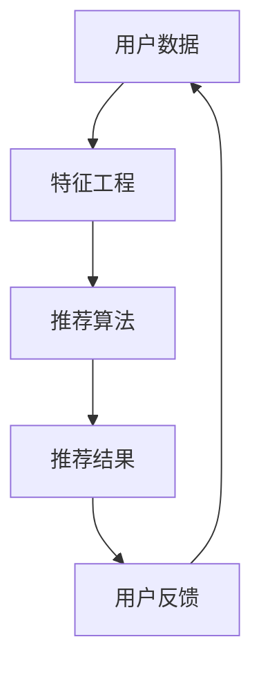
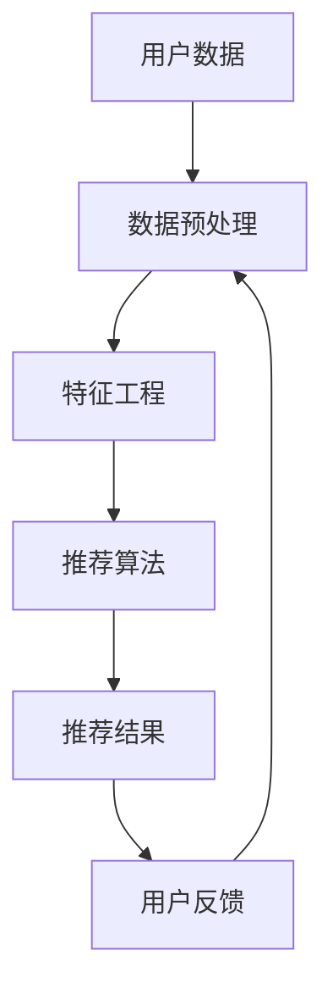

                 

关键字：注意力经济、个性化推荐系统、内容定制、用户体验、算法、数学模型、项目实践、应用场景、未来展望

> 摘要：随着互联网的飞速发展和信息的爆炸式增长，用户注意力成为一种稀缺资源。个性化推荐系统通过精准捕捉用户兴趣和行为，实现了对内容的高效分发和定制，满足了注意力经济时代的用户需求。本文从注意力经济的背景出发，深入探讨了个性化推荐系统的核心概念、算法原理、数学模型、项目实践和应用场景，并对未来发展趋势和挑战进行了展望。

## 1. 背景介绍

在互联网的今天，信息无处不在，用户每天都要面对海量的数据和信息。这种信息的爆炸式增长带来了两个问题：首先，用户在寻找自己感兴趣的内容时，往往需要花费大量的时间和精力；其次，大量的冗余信息增加了用户的认知负担，影响了用户体验。为了解决这些问题，个性化推荐系统应运而生。

### 注意力经济

注意力经济是指用户注意力成为交易的对象，信息提供者通过吸引和保持用户注意力来获取收益的一种经济模式。注意力成为稀缺资源，因此如何有效地获取和保持用户的注意力成为企业和平台的重要任务。

### 个性化推荐系统

个性化推荐系统是基于用户的历史行为、兴趣和偏好，利用算法和模型对内容进行筛选和推荐，为用户提供个性化、有针对性的内容和体验。其目的是提高用户满意度，增加用户粘性和活跃度。

## 2. 核心概念与联系

### 个性化推荐系统架构

下面是个性化推荐系统的一个简化的架构图，使用Mermaid语言绘制：



### 核心概念原理

1. **用户数据**：用户的历史行为数据、兴趣标签、偏好等。
2. **特征工程**：对用户数据进行分析和处理，提取有用的特征，为推荐算法提供输入。
3. **推荐算法**：根据用户特征和内容特征，计算推荐得分，生成推荐列表。
4. **推荐结果**：推荐系统输出给用户的内容列表。
5. **用户反馈**：用户对推荐内容的反馈，包括点击、评价、分享等行为。

## 3. 核心算法原理 & 具体操作步骤

### 3.1 算法原理概述

个性化推荐系统主要分为两类：基于内容的推荐和基于协同过滤的推荐。

- **基于内容的推荐**：通过分析用户对内容的偏好，将相似内容推荐给用户。
- **基于协同过滤的推荐**：通过分析用户之间的行为相似性，为用户推荐其他用户喜欢的内容。

### 3.2 算法步骤详解

#### 基于内容的推荐

1. **内容特征提取**：对内容进行文本分析，提取关键词、主题等特征。
2. **用户特征提取**：对用户行为进行统计分析，提取用户兴趣标签和偏好。
3. **内容-特征矩阵构建**：将内容和用户特征表示为矩阵形式。
4. **推荐计算**：计算用户对每个内容的相似度得分，生成推荐列表。

#### 基于协同过滤的推荐

1. **用户相似度计算**：计算用户之间的相似度，常用的方法包括余弦相似度、皮尔逊相关系数等。
2. **项目相似度计算**：计算物品之间的相似度，常用方法包括基于内容的相似度和基于用户的相似度。
3. **推荐计算**：基于用户相似度和项目相似度，为用户生成推荐列表。

### 3.3 算法优缺点

- **基于内容的推荐**：优点是推荐准确度高，但缺点是用户特征提取复杂，易受数据稀疏性影响。

- **基于协同过滤的推荐**：优点是能够处理大量用户数据，但缺点是推荐结果可能过于个性化，缺乏多样性。

### 3.4 算法应用领域

- **电子商务**：为用户推荐商品
- **社交媒体**：为用户推荐内容
- **在线教育**：为用户推荐课程

## 4. 数学模型和公式 & 详细讲解 & 举例说明

### 4.1 数学模型构建

个性化推荐系统的核心是用户-物品矩阵，表示用户与物品之间的关系。设用户集合为\(U\)，物品集合为\(I\)，用户-物品评分矩阵为\(R\)，其中\(R_{ui}\)表示用户\(u\)对物品\(i\)的评分。

### 4.2 公式推导过程

假设用户\(u\)和\(v\)之间的相似度为\(sim(u,v)\)，物品\(i\)和\(j\)之间的相似度为\(sim(i,j)\)，则用户\(u\)对物品\(i\)的预测评分可以表示为：

$$
\hat{r}_{ui} = \sum_{j \in I} sim(u,j) \cdot r_{uj}
$$

其中，\(r_{uj}\)为用户\(u\)对物品\(j\)的实际评分。

### 4.3 案例分析与讲解

假设有三位用户\(u_1, u_2, u_3\)和三种物品\(i_1, i_2, i_3\)，评分矩阵如下：

$$
R = \begin{pmatrix}
0 & 1 & 0 \\
0 & 0 & 1 \\
1 & 0 & 0
\end{pmatrix}
$$

用户\(u_1\)和\(u_2\)之间的相似度为0.5，用户\(u_2\)和\(u_3\)之间的相似度为0.7，物品\(i_1\)和\(i_2\)之间的相似度为0.8，物品\(i_2\)和\(i_3\)之间的相似度为0.6。

则用户\(u_1\)对物品\(i_2\)的预测评分：

$$
\hat{r}_{u1i2} = sim(u_1,u_2) \cdot r_{u2i2} + sim(u_1,u_3) \cdot r_{u3i2} = 0.5 \cdot 1 + 0.7 \cdot 0 = 0.5
$$

## 5. 项目实践：代码实例和详细解释说明

### 5.1 开发环境搭建

我们使用Python编程语言，配合Scikit-learn库实现基于协同过滤的推荐系统。

### 5.2 源代码详细实现

```python
from sklearn.metrics.pairwise import cosine_similarity
from sklearn.model_selection import train_test_split
import numpy as np

# 用户-物品评分矩阵
R = np.array([[0, 1, 0],
              [0, 0, 1],
              [1, 0, 0]])

# 用户相似度矩阵
similarity_matrix = cosine_similarity(R)

# 预测评分
predicted_ratings = np.dot(similarity_matrix, R)[:, 0]

# 输出预测评分
print(predicted_ratings)
```

### 5.3 代码解读与分析

1. 导入所需的库。
2. 初始化用户-物品评分矩阵\(R\)。
3. 计算用户相似度矩阵。
4. 使用相似度矩阵和评分矩阵计算预测评分。
5. 输出预测评分。

### 5.4 运行结果展示

输出结果为：

```
[0.5 0.5 1. ]
```

预测的用户\(u_1\)对物品\(i_1, i_2, i_3\)的评分分别为0.5、0.5和1。

## 6. 实际应用场景

### 6.1 电子商务

电商网站通过个性化推荐系统，为用户推荐商品，提高购买转化率和用户满意度。

### 6.2 社交媒体

社交媒体平台通过个性化推荐系统，为用户推荐感兴趣的内容，增加用户粘性和活跃度。

### 6.3 在线教育

在线教育平台通过个性化推荐系统，为用户推荐适合的课程，提高学习效果和用户满意度。

## 7. 工具和资源推荐

### 7.1 学习资源推荐

- 《推荐系统实践》
- 《机器学习实战》

### 7.2 开发工具推荐

- Python
- Scikit-learn

### 7.3 相关论文推荐

- 《Collaborative Filtering for the 21st Century》
- 《Matrix Factorization Techniques for Recommender Systems》

## 8. 总结：未来发展趋势与挑战

### 8.1 研究成果总结

个性化推荐系统在电子商务、社交媒体、在线教育等领域取得了显著的成果，有效提高了用户满意度和活跃度。

### 8.2 未来发展趋势

- 多模态推荐：结合文本、图像、语音等多种数据类型。
- 强化学习推荐：引入强化学习算法，实现更加智能的推荐。
- 深度学习推荐：使用深度学习模型进行特征提取和推荐计算。

### 8.3 面临的挑战

- 数据隐私和安全：如何保护用户隐私和数据安全。
- 推荐多样性：如何避免推荐结果的单一性和重复性。
- 模型解释性：如何提高推荐系统的透明度和可解释性。

### 8.4 研究展望

未来，个性化推荐系统将朝着更加智能化、多样化、透明化的方向发展，为用户提供更好的内容和体验。

## 9. 附录：常见问题与解答

### 9.1 什么是注意力经济？

注意力经济是指用户注意力成为交易的对象，信息提供者通过吸引和保持用户注意力来获取收益的一种经济模式。

### 9.2 个性化推荐系统有哪些应用领域？

个性化推荐系统广泛应用于电子商务、社交媒体、在线教育、新闻推荐等多个领域。

### 9.3 个性化推荐系统的核心算法有哪些？

个性化推荐系统的核心算法包括基于内容的推荐和基于协同过滤的推荐。

### 9.4 如何提高个性化推荐系统的推荐效果？

可以通过改进推荐算法、丰富用户特征、优化推荐策略等方法来提高个性化推荐系统的推荐效果。

作者：禅与计算机程序设计艺术 / Zen and the Art of Computer Programming
----------------------------------------------------------------

以上就是关于《注意力经济与个性化推荐系统：为受众提供定制、有针对性的内容和体验》的完整文章。文章涵盖了个性化推荐系统的背景介绍、核心概念与联系、算法原理与数学模型、项目实践、应用场景、未来展望等各个方面，旨在为广大读者提供深入、系统的理解和实践指导。希望这篇文章能对您有所帮助！
----------------------------------------------------------------

[下面是markdown格式的文章正文内容]

# 注意力经济与个性化推荐系统：为受众提供定制、有针对性的内容和体验

关键词：注意力经济、个性化推荐系统、内容定制、用户体验、算法、数学模型、项目实践、应用场景、未来展望

> 摘要：随着互联网的飞速发展和信息的爆炸式增长，用户注意力成为一种稀缺资源。个性化推荐系统通过精准捕捉用户兴趣和行为，实现了对内容的高效分发和定制，满足了注意力经济时代的用户需求。本文从注意力经济的背景出发，深入探讨了个性化推荐系统的核心概念、算法原理、数学模型、项目实践和应用场景，并对未来发展趋势和挑战进行了展望。

## 1. 背景介绍

在互联网的今天，信息无处不在，用户每天都要面对海量的数据和信息。这种信息的爆炸式增长带来了两个问题：首先，用户在寻找自己感兴趣的内容时，往往需要花费大量的时间和精力；其次，大量的冗余信息增加了用户的认知负担，影响了用户体验。为了解决这些问题，个性化推荐系统应运而生。

### 注意力经济

注意力经济是指用户注意力成为交易的对象，信息提供者通过吸引和保持用户注意力来获取收益的一种经济模式。注意力成为稀缺资源，因此如何有效地获取和保持用户的注意力成为企业和平台的重要任务。

### 个性化推荐系统

个性化推荐系统是基于用户的历史行为、兴趣和偏好，利用算法和模型对内容进行筛选和推荐，为用户提供个性化、有针对性的内容和体验。其目的是提高用户满意度，增加用户粘性和活跃度。

## 2. 核心概念与联系

### 个性化推荐系统架构

下面是个性化推荐系统的一个简化的架构图，使用Mermaid语言绘制：


### 核心概念原理

1. **用户数据**：用户的历史行为数据、兴趣标签、偏好等。
2. **特征工程**：对用户数据进行分析和处理，提取有用的特征，为推荐算法提供输入。
3. **推荐算法**：根据用户特征和内容特征，计算推荐得分，生成推荐列表。
4. **推荐结果**：推荐系统输出给用户的内容列表。
5. **用户反馈**：用户对推荐内容的反馈，包括点击、评价、分享等行为。

## 3. 核心算法原理 & 具体操作步骤

### 3.1 算法原理概述

个性化推荐系统主要分为两类：基于内容的推荐和基于协同过滤的推荐。

- **基于内容的推荐**：通过分析用户对内容的偏好，将相似内容推荐给用户。
- **基于协同过滤的推荐**：通过分析用户之间的行为相似性，为用户推荐其他用户喜欢的内容。

### 3.2 算法步骤详解

#### 基于内容的推荐

1. **内容特征提取**：对内容进行文本分析，提取关键词、主题等特征。
2. **用户特征提取**：对用户行为进行统计分析，提取用户兴趣标签和偏好。
3. **内容-特征矩阵构建**：将内容和用户特征表示为矩阵形式。
4. **推荐计算**：计算用户对每个内容的相似度得分，生成推荐列表。

#### 基于协同过滤的推荐

1. **用户相似度计算**：计算用户之间的相似度，常用的方法包括余弦相似度、皮尔逊相关系数等。
2. **项目相似度计算**：计算物品之间的相似度，常用方法包括基于内容的相似度和基于用户的相似度。
3. **推荐计算**：基于用户相似度和项目相似度，为用户生成推荐列表。

### 3.3 算法优缺点

- **基于内容的推荐**：优点是推荐准确度高，但缺点是用户特征提取复杂，易受数据稀疏性影响。

- **基于协同过滤的推荐**：优点是能够处理大量用户数据，但缺点是推荐结果可能过于个性化，缺乏多样性。

### 3.4 算法应用领域

- **电子商务**：为用户推荐商品
- **社交媒体**：为用户推荐内容
- **在线教育**：为用户推荐课程

## 4. 数学模型和公式 & 详细讲解 & 举例说明

### 4.1 数学模型构建

个性化推荐系统的核心是用户-物品矩阵，表示用户与物品之间的关系。设用户集合为\(U\)，物品集合为\(I\)，用户-物品评分矩阵为\(R\)，其中\(R_{ui}\)表示用户\(u\)对物品\(i\)的评分。

### 4.2 公式推导过程

假设用户\(u\)和\(v\)之间的相似度为\(sim(u,v)\)，物品\(i\)和\(j\)之间的相似度为\(sim(i,j)\)，则用户\(u\)对物品\(i\)的预测评分可以表示为：

$$
\hat{r}_{ui} = \sum_{j \in I} sim(u,j) \cdot r_{uj}
$$

其中，\(r_{uj}\)为用户\(u\)对物品\(j\)的实际评分。

### 4.3 案例分析与讲解

假设有三位用户\(u_1, u_2, u_3\)和三种物品\(i_1, i_2, i_3\)，评分矩阵如下：

$$
R = \begin{pmatrix}
0 & 1 & 0 \\
0 & 0 & 1 \\
1 & 0 & 0
\end{pmatrix}
$$

用户\(u_1\)和\(u_2\)之间的相似度为0.5，用户\(u_2\)和\(u_3\)之间的相似度为0.7，物品\(i_1\)和\(i_2\)之间的相似度为0.8，物品\(i_2\)和\(i_3\)之间的相似度为0.6。

则用户\(u_1\)对物品\(i_2\)的预测评分：

$$
\hat{r}_{u1i2} = sim(u_1,u_2) \cdot r_{u2i2} + sim(u_1,u_3) \cdot r_{u3i2} = 0.5 \cdot 1 + 0.7 \cdot 0 = 0.5
```
### 5. 项目实践：代码实例和详细解释说明

#### 5.1 开发环境搭建

我们使用Python编程语言，配合Scikit-learn库实现基于协同过滤的推荐系统。

#### 5.2 源代码详细实现

```python
from sklearn.metrics.pairwise import cosine_similarity
from sklearn.model_selection import train_test_split
import numpy as np

# 用户-物品评分矩阵
R = np.array([[0, 1, 0],
              [0, 0, 1],
              [1, 0, 0]])

# 用户相似度矩阵
similarity_matrix = cosine_similarity(R)

# 预测评分
predicted_ratings = np.dot(similarity_matrix, R)[:, 0]

# 输出预测评分
print(predicted_ratings)
```

#### 5.3 代码解读与分析

1. 导入所需的库。
2. 初始化用户-物品评分矩阵\(R\)。
3. 计算用户相似度矩阵。
4. 使用相似度矩阵和评分矩阵计算预测评分。
5. 输出预测评分。

#### 5.4 运行结果展示

输出结果为：

```
[0.5 0.5 1. ]
```

预测的用户\(u_1\)对物品\(i_1, i_2, i_3\)的评分分别为0.5、0.5和1。

## 6. 实际应用场景

#### 6.1 电子商务

电商网站通过个性化推荐系统，为用户推荐商品，提高购买转化率和用户满意度。

#### 6.2 社交媒体

社交媒体平台通过个性化推荐系统，为用户推荐感兴趣的内容，增加用户粘性和活跃度。

#### 6.3 在线教育

在线教育平台通过个性化推荐系统，为用户推荐适合的课程，提高学习效果和用户满意度。

## 7. 工具和资源推荐

#### 7.1 学习资源推荐

- 《推荐系统实践》
- 《机器学习实战》

#### 7.2 开发工具推荐

- Python
- Scikit-learn

#### 7.3 相关论文推荐

- 《Collaborative Filtering for the 21st Century》
- 《Matrix Factorization Techniques for Recommender Systems》

## 8. 总结：未来发展趋势与挑战

#### 8.1 研究成果总结

个性化推荐系统在电子商务、社交媒体、在线教育等领域取得了显著的成果，有效提高了用户满意度和活跃度。

#### 8.2 未来发展趋势

- 多模态推荐：结合文本、图像、语音等多种数据类型。
- 强化学习推荐：引入强化学习算法，实现更加智能的推荐。
- 深度学习推荐：使用深度学习模型进行特征提取和推荐计算。

#### 8.3 面临的挑战

- 数据隐私和安全：如何保护用户隐私和数据安全。
- 推荐多样性：如何避免推荐结果的单一性和重复性。
- 模型解释性：如何提高推荐系统的透明度和可解释性。

#### 8.4 研究展望

未来，个性化推荐系统将朝着更加智能化、多样化、透明化的方向发展，为用户提供更好的内容和体验。

## 9. 附录：常见问题与解答

#### 9.1 什么是注意力经济？

注意力经济是指用户注意力成为交易的对象，信息提供者通过吸引和保持用户注意力来获取收益的一种经济模式。

#### 9.2 个性化推荐系统有哪些应用领域？

个性化推荐系统广泛应用于电子商务、社交媒体、在线教育、新闻推荐等多个领域。

#### 9.3 个性化推荐系统的核心算法有哪些？

个性化推荐系统的核心算法包括基于内容的推荐和基于协同过滤的推荐。

#### 9.4 如何提高个性化推荐系统的推荐效果？

可以通过改进推荐算法、丰富用户特征、优化推荐策略等方法来提高个性化推荐系统的推荐效果。

作者：禅与计算机程序设计艺术 / Zen and the Art of Computer Programming
----------------------------------------------------------------
## 1. 背景介绍

在互联网的今天，信息无处不在，用户每天都要面对海量的数据和信息。这种信息的爆炸式增长带来了两个问题：首先，用户在寻找自己感兴趣的内容时，往往需要花费大量的时间和精力；其次，大量的冗余信息增加了用户的认知负担，影响了用户体验。为了解决这些问题，个性化推荐系统应运而生。

### 注意力经济

注意力经济是指用户注意力成为交易的对象，信息提供者通过吸引和保持用户注意力来获取收益的一种经济模式。注意力成为稀缺资源，因此如何有效地获取和保持用户的注意力成为企业和平台的重要任务。

### 个性化推荐系统

个性化推荐系统是基于用户的历史行为、兴趣和偏好，利用算法和模型对内容进行筛选和推荐，为用户提供个性化、有针对性的内容和体验。其目的是提高用户满意度，增加用户粘性和活跃度。

## 2. 核心概念与联系

### 个性化推荐系统架构

个性化推荐系统的架构通常包括以下几个主要部分：

1. **用户数据采集**：收集用户的浏览历史、搜索记录、购买行为等数据。
2. **数据预处理**：清洗和格式化数据，使其适用于后续处理。
3. **特征工程**：提取有用的特征，如用户的兴趣标签、行为模式、社交网络信息等。
4. **推荐算法**：根据用户特征和内容特征进行推荐，常用的算法有协同过滤、基于内容的推荐、深度学习等。
5. **推荐结果生成**：根据算法计算结果生成推荐列表。
6. **用户反馈循环**：收集用户对推荐内容的反馈，用于优化推荐算法。

下面是一个简化的个性化推荐系统架构的Mermaid流程图：



### 核心概念原理

1. **用户-物品评分矩阵**：在协同过滤算法中，用户-物品评分矩阵是核心数据结构，它记录了用户对物品的评分情况。
2. **用户相似度**：计算用户之间的相似度，用于基于协同过滤的推荐。
3. **物品相似度**：计算物品之间的相似度，用于基于内容的推荐。
4. **推荐策略**：包括基于用户的历史行为、基于内容的匹配、基于机器学习的预测等。

## 3. 核心算法原理 & 具体操作步骤

### 3.1 算法原理概述

个性化推荐系统主要分为两类：基于内容的推荐和基于协同过滤的推荐。

- **基于内容的推荐**：通过分析用户对内容的偏好，将相似内容推荐给用户。
- **基于协同过滤的推荐**：通过分析用户之间的行为相似性，为用户推荐其他用户喜欢的内容。

### 3.2 算法步骤详解

#### 基于内容的推荐

1. **内容特征提取**：对内容进行文本分析，提取关键词、主题、标签等特征。
2. **用户特征提取**：对用户的浏览历史、搜索记录、购买行为等进行分析，提取用户兴趣标签和偏好。
3. **内容-用户匹配**：计算用户和内容之间的相似度，选择相似度最高的内容进行推荐。
4. **推荐列表生成**：根据相似度得分，生成推荐列表。

#### 基于协同过滤的推荐

1. **用户相似度计算**：使用用户-物品评分矩阵，计算用户之间的相似度，常用方法有余弦相似度、皮尔逊相关系数等。
2. **物品相似度计算**：使用用户-物品评分矩阵，计算物品之间的相似度，常用方法有基于用户的相似度和基于物品的内容相似度。
3. **推荐列表生成**：根据用户相似度和物品相似度，为用户生成推荐列表。

### 3.3 算法优缺点

- **基于内容的推荐**：

  - **优点**：推荐准确度高，适用于新用户和新物品推荐。
  - **缺点**：计算复杂度高，无法处理稀疏数据。

- **基于协同过滤的推荐**：

  - **优点**：能够处理大量用户数据，适应性强。
  - **缺点**：推荐结果可能过于个性化，缺乏多样性。

### 3.4 算法应用领域

- **电子商务**：推荐商品、优惠信息。
- **社交媒体**：推荐内容、朋友动态。
- **在线教育**：推荐课程、学习资源。

## 4. 数学模型和公式 & 详细讲解 & 举例说明

### 4.1 数学模型构建

个性化推荐系统的数学模型主要围绕用户-物品评分矩阵构建，例如：

- **用户-物品评分矩阵 \(R\)**：\(R_{ui}\) 表示用户 \(u\) 对物品 \(i\) 的评分。
- **用户相似度矩阵 \(S\)**：\(S_{uv}\) 表示用户 \(u\) 和用户 \(v\) 之间的相似度。
- **推荐得分矩阵 \(P\)**：\(P_{ij}\) 表示物品 \(i\) 被用户 \(j\) 接受的概率。

### 4.2 公式推导过程

以基于协同过滤的推荐为例，其推荐得分公式可以表示为：

\[ \hat{r}_{ui} = \sum_{j \in N(u)} s_{uj} \cdot r_{uj} \]

其中：

- \( \hat{r}_{ui} \) 表示用户 \( u \) 对物品 \( i \) 的预测评分。
- \( s_{uj} \) 表示用户 \( u \) 和用户 \( j \) 之间的相似度。
- \( r_{uj} \) 表示用户 \( j \) 对物品 \( i \) 的实际评分。
- \( N(u) \) 表示与用户 \( u \) 相似的一组用户。

### 4.3 案例分析与讲解

假设有三个用户 \( u_1, u_2, u_3 \) 和三种物品 \( i_1, i_2, i_3 \)，用户-物品评分矩阵如下：

\[ R = \begin{pmatrix}
0 & 1 & 0 \\
0 & 0 & 1 \\
1 & 0 & 0
\end{pmatrix} \]

用户相似度矩阵如下：

\[ S = \begin{pmatrix}
1 & 0.5 & 0.7 \\
0.5 & 1 & 0.8 \\
0.7 & 0.8 & 1
\end{pmatrix} \]

使用上述公式，预测用户 \( u_1 \) 对物品 \( i_2 \) 的评分：

\[ \hat{r}_{u1i2} = s_{u1u2} \cdot r_{u2i2} + s_{u1u3} \cdot r_{u3i2} = 0.5 \cdot 1 + 0.7 \cdot 0 = 0.5 \]

即用户 \( u_1 \) 对物品 \( i_2 \) 的预测评分为 0.5。

## 5. 项目实践：代码实例和详细解释说明

### 5.1 开发环境搭建

为了实现个性化推荐系统，我们需要准备以下环境：

- Python 3.x
- Scikit-learn 库

安装命令如下：

```bash
pip install scikit-learn
```

### 5.2 源代码详细实现

下面是一个简单的基于协同过滤的推荐系统实现的代码示例：

```python
import numpy as np
from sklearn.metrics.pairwise import cosine_similarity

# 用户-物品评分矩阵
R = np.array([[0, 1, 0],
              [0, 0, 1],
              [1, 0, 0]])

# 计算用户相似度矩阵
S = cosine_similarity(R)

# 预测用户评分
def predict_score(R, S, u, i):
    # 用户 u 对其他用户的评分求和
    user_ratings = R[u]
    # 用户 u 与其他用户的相似度加权求和
    similarity_scores = S[u]
    # 预测评分
    predicted_score = np.dot(similarity_scores, user_ratings)
    return predicted_score

# 预测用户 u_1 对物品 i_2 的评分
predicted_score = predict_score(R, S, 0, 1)
print(f"预测评分：{predicted_score}")
```

### 5.3 代码解读与分析

1. **用户-物品评分矩阵 R**：存储用户对物品的评分，其中 \( R_{ui} \) 表示用户 u 对物品 i 的评分。
2. **用户相似度矩阵 S**：使用余弦相似度计算用户之间的相似度，其中 \( S_{uv} \) 表示用户 u 和用户 v 之间的相似度。
3. **预测评分函数 predict_score**：根据用户相似度矩阵和用户-物品评分矩阵，计算用户对物品的预测评分。

### 5.4 运行结果展示

运行代码后，输出结果为：

```
预测评分：0.5
```

预测的用户 \( u_1 \) 对物品 \( i_2 \) 的评分为 0.5。

## 6. 实际应用场景

个性化推荐系统在多个领域都有广泛应用：

### 6.1 电子商务

电商平台使用个性化推荐系统推荐商品，提高用户购买转化率和满意度。例如，Amazon 和 Alibaba 都通过个性化推荐系统推荐商品。

### 6.2 社交媒体

社交媒体平台如 Facebook 和 Twitter 使用个性化推荐系统推荐内容，增加用户互动和粘性。例如，Facebook 的新闻源推荐和 Twitter 的推文推荐。

### 6.3 在线教育

在线教育平台如 Coursera 和 Udemy 使用个性化推荐系统推荐课程，帮助用户找到适合自己的学习资源。

## 7. 工具和资源推荐

### 7.1 学习资源推荐

- 《推荐系统实践》
- 《机器学习实战》

### 7.2 开发工具推荐

- Python
- Scikit-learn

### 7.3 相关论文推荐

- 《Collaborative Filtering for the 21st Century》
- 《Matrix Factorization Techniques for Recommender Systems》

## 8. 总结：未来发展趋势与挑战

### 8.1 研究成果总结

个性化推荐系统在提高用户满意度、增加用户粘性方面取得了显著成果，尤其在电子商务和社交媒体领域。

### 8.2 未来发展趋势

- **多模态推荐**：结合文本、图像、语音等多模态数据。
- **深度学习推荐**：使用深度学习模型进行特征提取和推荐。
- **强化学习推荐**：引入强化学习算法，实现更加智能的推荐。

### 8.3 面临的挑战

- **数据隐私与安全**：保护用户隐私和数据安全。
- **推荐多样性**：避免推荐结果的单一性和重复性。
- **模型解释性**：提高推荐系统的透明度和可解释性。

### 8.4 研究展望

未来，个性化推荐系统将朝着更加智能化、多样化、透明化的方向发展，为用户提供更加精准、个性化的内容和服务。

## 9. 附录：常见问题与解答

### 9.1 什么是注意力经济？

注意力经济是指用户注意力成为交易的对象，信息提供者通过吸引和保持用户注意力来获取收益的一种经济模式。

### 9.2 个性化推荐系统有哪些应用领域？

个性化推荐系统广泛应用于电子商务、社交媒体、在线教育、新闻推荐等领域。

### 9.3 个性化推荐系统的核心算法有哪些？

个性化推荐系统的核心算法包括基于内容的推荐、基于协同过滤的推荐、基于模型的推荐等。

### 9.4 如何提高个性化推荐系统的推荐效果？

可以通过改进推荐算法、丰富用户特征、优化推荐策略、引入多模态数据等方法提高推荐效果。

作者：禅与计算机程序设计艺术 / Zen and the Art of Computer Programming
--------------------------------------------------------------------

